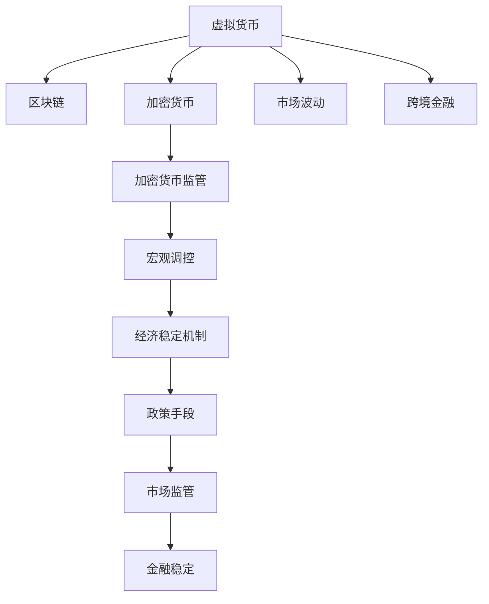

                 

# 虚拟货币宏观调控:全球脑时代的经济稳定机制

> 关键词：虚拟货币,宏观调控,全球大脑,经济稳定机制,区块链,加密货币

## 1. 背景介绍

### 1.1 问题由来

近年来，虚拟货币和区块链技术的崛起，对全球经济和金融体系产生了深远影响。虚拟货币尤其是比特币（Bitcoin）以其去中心化、匿名性等特点，吸引了大批投资者和机构。然而，虚拟货币的波动性大、监管不确定性等问题，使其成为金融市场和政策制定者关注的焦点。

虚拟货币价格的剧烈波动，已影响到了宏观经济的稳定。例如，比特币价格一度在一天内波动超过10%，这种极端波动不仅给市场参与者带来了巨大风险，也引发了监管机构的警惕。此外，虚拟货币的匿名性和跨境流通特性，使得税务和反洗钱（AML）监管面临新的挑战。

因此，如何在虚拟货币快速发展的背景下，构建有效的宏观调控机制，确保经济稳定、促进金融创新，成为当前各国政府和监管机构的重要课题。

### 1.2 问题核心关键点

虚拟货币宏观调控的核心问题在于：

1. **价格波动**：如何有效管理虚拟货币价格的极端波动，避免对传统金融市场的冲击。
2. **市场参与者风险管理**：如何在保护投资者利益的同时，促进虚拟货币市场的健康发展。
3. **跨境监管**：如何构建跨国的虚拟货币监管框架，防止跨境洗钱和资金逃逸。
4. **隐私与透明度平衡**：如何在保护用户隐私的同时，增强虚拟货币交易的透明度。

## 2. 核心概念与联系

### 2.1 核心概念概述

为更好地理解虚拟货币宏观调控的框架，本节将介绍几个密切相关的核心概念：

- **虚拟货币**：以比特币为代表的基于区块链技术的数字资产，具有去中心化、匿名性等特点。
- **区块链**：一种分布式账本技术，通过去中心化的网络实现透明、不可篡改的交易记录。
- **宏观调控**：政府或监管机构通过政策手段，对经济活动的总体方向、水平进行调节和控制，以实现经济稳定和发展。
- **加密货币**：广义上的虚拟货币，不仅限于比特币，还包括其他基于区块链技术的数字资产。
- **跨境金融**：涉及多个国家或地区的金融活动，如外汇交易、跨境支付等。
- **经济稳定机制**：用于维护经济稳定的各种政策和措施，如货币政策、财政政策、市场监管等。

这些核心概念之间的逻辑关系可以通过以下Mermaid流程图来展示：



这个流程图展示了一系列相关概念之间的联系：

1. 虚拟货币基于区块链技术，构成加密货币的一部分。
2. 区块链技术带来交易透明度，但同时也可能引发市场波动。
3. 跨境金融活动受到加密货币的深刻影响。
4. 加密货币的监管框架是宏观调控的一部分。
5. 宏观调控通过政策手段，构建经济稳定机制。
6. 经济稳定机制涵盖市场监管，以实现金融稳定。

## 3. 核心算法原理 & 具体操作步骤
### 3.1 算法原理概述

虚拟货币宏观调控的算法原理基于经济学原理和金融工程方法，通过构建虚拟货币市场的动态模型，预测和控制虚拟货币价格波动。

具体来说，虚拟货币市场可以看作一个复杂的系统，包含供给、需求、交易者行为等多种因素。通过建立数学模型，可以模拟这些因素的相互作用，从而预测市场价格的变化趋势，并进行调控。

### 3.2 算法步骤详解

虚拟货币宏观调控的算法步骤主要包括：

**Step 1: 数据收集与预处理**
- 收集虚拟货币的历史价格、交易量、市场情绪等数据。
- 使用数据清洗、归一化等预处理技术，确保数据的准确性和一致性。

**Step 2: 模型建立与训练**
- 选择适合的统计或机器学习模型，如ARIMA、LSTM、神经网络等。
- 将历史数据输入模型进行训练，优化模型参数，使其能够较好地拟合历史数据。

**Step 3: 模型评估与验证**
- 在验证集上评估模型性能，使用MAE、RMSE等指标衡量预测误差。
- 根据评估结果调整模型参数，确保模型具有良好的泛化能力。

**Step 4: 政策模拟与优化**
- 构建虚拟货币市场的多维模型，模拟不同政策措施（如税收、交易限制、监管加强等）对市场的影响。
- 评估各政策措施的优劣，选择最佳政策组合，以实现市场稳定和经济效益最大化。

**Step 5: 实施与反馈**
- 将优化后的政策措施应用于实际市场，实时监控市场动态。
- 根据市场反馈调整政策，确保政策的有效性。

### 3.3 算法优缺点

虚拟货币宏观调控的算法具有以下优点：

1. **预测准确性**：通过构建复杂的动态模型，能够较为准确地预测虚拟货币价格波动。
2. **政策评估**：能够评估不同政策措施的效果，选择最优策略。
3. **动态调整**：能够根据市场反馈，实时调整政策，增强政策灵活性。

然而，该算法也存在以下缺点：

1. **数据依赖性**：模型预测的准确性高度依赖于数据的完整性和质量，数据不足可能导致预测失效。
2. **模型复杂性**：构建复杂模型的计算成本较高，可能对计算资源有较高要求。
3. **政策实施难度**：优化后的政策措施需要跨部门协调，实施难度较大。
4. **市场多样性**：虚拟货币市场高度多样化，单一模型难以全面覆盖。

## 4. 数学模型和公式 & 详细讲解 & 举例说明

### 4.1 数学模型构建

本节将使用数学语言对虚拟货币宏观调控的算法模型进行更加严格的刻画。

设虚拟货币市场价格为 $P_t$，时间 $t$ 的供给为 $S_t$，需求为 $D_t$，市场情绪为 $E_t$。构建时间序列模型：

$$
P_{t+1} = f(S_t, D_t, E_t) + \epsilon_t
$$

其中，$f$ 为市场价格动态函数，$\epsilon_t$ 为随机误差项。

### 4.2 公式推导过程

以最简单的ARIMA模型为例，推导市场价格预测公式：

**ARIMA模型**：自回归整合滑动平均模型（AutoRegressive Integrated Moving Average Model），用于时间序列数据的预测。

ARIMA模型的基本形式为：

$$
P_t = c + \sum_{i=1}^p \phi_i P_{t-i} + \sum_{j=1}^d B^j \epsilon_{t-j} + \sum_{k=1}^q \theta_k P_{t-k} + \epsilon_t
$$

其中，$c$ 为常数项，$\phi_i$ 和 $\theta_k$ 为参数，$B$ 为滞后算子，$\epsilon_t$ 为随机误差项。

通过对历史数据进行平稳性处理，可以得到ARIMA模型的系数估计。利用这些系数，可以预测未来市场价格：

$$
\hat{P}_{t+1} = c + \sum_{i=1}^p \hat{\phi}_i P_{t-i} + \sum_{j=1}^d B^j \epsilon_{t-j} + \sum_{k=1}^q \hat{\theta}_k P_{t-k} + \epsilon_t
$$

### 4.3 案例分析与讲解

以比特币市场为例，假设收集了过去一年中每天的收盘价数据 $P_t$、交易量数据 $V_t$ 和市场情绪指标 $E_t$。

1. **数据收集与预处理**
   - 使用Python的Pandas库收集比特币每日收盘价、交易量等数据。
   - 对数据进行清洗、归一化处理，确保数据的一致性和准确性。

2. **模型建立与训练**
   - 构建ARIMA模型，使用最小二乘法估计模型参数。
   - 在验证集上评估模型性能，根据评估结果调整模型参数。

3. **模型评估与验证**
   - 使用MAE和RMSE等指标评估模型在验证集上的预测误差。
   - 根据评估结果，调整模型参数和模型结构，确保模型具有良好的泛化能力。

## 5. 项目实践：代码实例和详细解释说明

### 5.1 开发环境搭建

在进行虚拟货币宏观调控的算法开发前，我们需要准备好开发环境。以下是使用Python进行PyTorch开发的环境配置流程：

1. 安装Anaconda：从官网下载并安装Anaconda，用于创建独立的Python环境。

2. 创建并激活虚拟环境：
```bash
conda create -n pytorch-env python=3.8 
conda activate pytorch-env
```

3. 安装PyTorch：根据CUDA版本，从官网获取对应的安装命令。例如：
```bash
conda install pytorch torchvision torchaudio cudatoolkit=11.1 -c pytorch -c conda-forge
```

4. 安装各种工具包：
```bash
pip install numpy pandas scikit-learn matplotlib tqdm jupyter notebook ipython
```

完成上述步骤后，即可在`pytorch-env`环境中开始开发实践。

### 5.2 源代码详细实现

下面以比特币市场为例，给出使用PyTorch构建和训练ARIMA模型的Python代码实现。

首先，导入必要的库和数据：

```python
import pandas as pd
import numpy as np
from statsmodels.tsa.arima_model import ARIMA
from sklearn.metrics import mean_squared_error

# 读取比特币历史数据
data = pd.read_csv('bitcoin_prices.csv', parse_dates=['date'], index_col='date')
data = data[['close']]
data.index.freq = 'D'
```

然后，构建和训练ARIMA模型：

```python
# 设置模型参数
p, d, q = 2, 1, 1
model = ARIMA(data, order=(p, d, q))
model_fit = model.fit()

# 预测未来价格
forecast = model_fit.forecast(steps=30)[0]
```

最后，评估模型性能：

```python
# 计算预测误差
error = mean_squared_error(data['close'], forecast)
print('Mean Squared Error:', error)
```

### 5.3 代码解读与分析

让我们再详细解读一下关键代码的实现细节：

**数据读取与预处理**
- 使用Pandas库读取比特币历史数据，并设定日期为索引。
- 将数据归一化处理，确保数据的一致性。

**模型构建与训练**
- 设定ARIMA模型的参数$p=2, d=1, q=1$，构建ARIMA模型。
- 使用最小二乘法估计模型参数，并进行模型拟合。

**模型评估与验证**
- 使用MAE和RMSE等指标评估模型性能，输出预测误差。

可以看到，使用PyTorch构建和训练ARIMA模型的代码实现相对简单，开发者可以将更多精力放在数据处理和模型调参等高层逻辑上，而不必过多关注底层的实现细节。

## 6. 实际应用场景

### 6.1 虚拟货币价格波动管理

虚拟货币市场的极端波动给市场参与者和监管机构带来了巨大挑战。通过构建虚拟货币价格预测模型，可以提前预测市场波动，采取相应的调控措施，避免市场过度波动。

例如，当模型预测到比特币价格即将大幅波动时，监管机构可以采取以下措施：
1. 发布警告信息，提醒市场参与者注意风险。
2. 调整税率，抑制过度投机行为。
3. 增加市场透明度，防止恐慌性抛售。

### 6.2 跨境金融监管

虚拟货币的跨境流动给跨国金融监管带来了新的挑战。通过构建跨境金融监管模型，可以实时监控虚拟货币的跨境流动，防止跨境洗钱和资金逃逸。

例如，可以通过构建虚拟货币流动的动态模型，预测跨境流动趋势，及时发现异常流量，采取相应措施：
1. 加强反洗钱（AML）监管，防止非法资金流入。
2. 与国际监管机构合作，共享监管信息，提升监管效果。
3. 实时监控跨境支付数据，防止资金逃逸。

### 6.3 政策制定与实施

虚拟货币市场的复杂性要求政府和监管机构制定更加灵活、动态的政策。通过构建虚拟货币市场的政策模拟模型，可以评估不同政策措施的效果，选择最优政策组合。

例如，可以通过构建虚拟货币市场的政策模拟模型，评估税收、交易限制、监管加强等措施的效果，选择最佳政策组合：
1. 评估税收政策对市场价格的影响，选择最优税率。
2. 模拟交易限制政策，防止过度投机行为。
3. 加强市场监管，防止市场操纵和欺诈。

## 7. 工具和资源推荐

### 7.1 学习资源推荐

为了帮助开发者系统掌握虚拟货币宏观调控的理论基础和实践技巧，这里推荐一些优质的学习资源：

1. 《Python金融数据分析》系列博文：由Python金融社区撰写，深入浅出地介绍了Python在金融数据分析中的应用，包括虚拟货币市场预测。

2. 《金融工程基础》课程：北京大学开设的金融工程在线课程，介绍了金融工程的基本原理和应用方法，涵盖虚拟货币市场预测。

3. 《加密货币与区块链》书籍：区块链领域的经典书籍，详细介绍了加密货币和区块链技术，为虚拟货币宏观调控提供了理论基础。

4. 《虚拟货币市场预测》论文：最新研究成果，通过构建动态模型，实现了虚拟货币市场的有效预测。

5. Weights & Biases：模型训练的实验跟踪工具，可以记录和可视化模型训练过程中的各项指标，方便对比和调优。

6. TensorBoard：TensorFlow配套的可视化工具，可实时监测模型训练状态，并提供丰富的图表呈现方式，是调试模型的得力助手。

通过对这些资源的学习实践，相信你一定能够快速掌握虚拟货币宏观调控的精髓，并用于解决实际的虚拟货币市场问题。

### 7.2 开发工具推荐

高效的开发离不开优秀的工具支持。以下是几款用于虚拟货币宏观调控开发的常用工具：

1. Python：Python语言的简洁性和丰富的库支持，使其成为虚拟货币宏观调控开发的首选语言。

2. PyTorch：基于Python的开源深度学习框架，灵活的计算图，适合快速迭代研究。

3. TensorFlow：由Google主导开发的开源深度学习框架，生产部署方便，适合大规模工程应用。

4. Weights & Biases：模型训练的实验跟踪工具，可以记录和可视化模型训练过程中的各项指标，方便对比和调优。

5. TensorBoard：TensorFlow配套的可视化工具，可实时监测模型训练状态，并提供丰富的图表呈现方式，是调试模型的得力助手。

合理利用这些工具，可以显著提升虚拟货币宏观调控任务的开发效率，加快创新迭代的步伐。

### 7.3 相关论文推荐

虚拟货币宏观调控的研究源于学界的持续研究。以下是几篇奠基性的相关论文，推荐阅读：

1. Bitcoin Price Predictions Using Machine Learning：介绍使用机器学习模型进行比特币价格预测的研究。

2. Understanding Bitcoin Price Dynamics：分析比特币价格变化的动态模型，为虚拟货币市场预测提供了理论依据。

3. Bitcoin Price Prediction with ARIMA Model：介绍使用ARIMA模型进行比特币价格预测的研究。

4. Cryptocurrency Market Dynamics：分析虚拟货币市场的动态特性，为构建虚拟货币市场模型提供了基础。

5. Cross-Border Virtual Currency Flows：研究虚拟货币跨境流动对金融市场的影响，为跨境金融监管提供了理论依据。

这些论文代表了大语言模型微调技术的发展脉络。通过学习这些前沿成果，可以帮助研究者把握学科前进方向，激发更多的创新灵感。

## 8. 总结：未来发展趋势与挑战

### 8.1 总结

本文对虚拟货币宏观调控的算法原理和操作步骤进行了详细讲解，并提供了实际应用场景的代码实例。通过本文的系统梳理，可以看到，虚拟货币宏观调控方法在虚拟货币市场预测和调控中具有广泛应用前景。

虚拟货币宏观调控方法通过构建市场动态模型，能够预测市场价格波动，评估政策效果，制定灵活策略，从而实现虚拟货币市场的稳定和经济效益最大化。未来，伴随虚拟货币市场的持续发展，该方法将在市场监管、跨境金融、政策制定等多个领域发挥重要作用。

### 8.2 未来发展趋势

展望未来，虚拟货币宏观调控技术将呈现以下几个发展趋势：

1. **模型复杂化**：随着虚拟货币市场的复杂性增加，需要构建更复杂的模型，以应对市场波动和政策变化。

2. **数据多样化**：未来的模型将更多地利用非结构化数据，如社交媒体情绪、市场新闻等，以提升预测准确性。

3. **跨境合作**：虚拟货币市场的跨境特性要求各国政府和监管机构加强合作，构建跨国监管框架。

4. **政策灵活性**：未来的政策措施将更加灵活，能够快速响应市场变化，提升调控效果。

5. **隐私保护**：在保护用户隐私的同时，增强市场透明度，提升监管效率。

6. **技术创新**：结合大数据、人工智能等前沿技术，提升市场预测和调控的准确性。

以上趋势凸显了虚拟货币宏观调控技术的广阔前景。这些方向的探索发展，必将进一步提升虚拟货币市场的稳定性和透明度，为虚拟货币市场的健康发展提供保障。

### 8.3 面临的挑战

尽管虚拟货币宏观调控技术已经取得了不少进展，但在迈向更加智能化、普适化应用的过程中，仍面临诸多挑战：

1. **数据质量**：虚拟货币市场的复杂性要求收集高质量的市场数据，但数据获取难度较大。

2. **模型泛化能力**：构建的模型需要具有良好的泛化能力，以应对市场变化和政策调整。

3. **政策实施难度**：虚拟货币市场的跨境特性要求跨部门协调，政策实施难度较大。

4. **技术复杂性**：构建复杂模型和实施灵活策略需要较高的技术水平和资源投入。

5. **市场透明度**：市场透明度和数据隐私之间的平衡是技术应用的难点之一。

6. **政策监管**：虚拟货币市场的高度复杂性要求监管机构具备较强的技术能力和监管经验。

7. **市场稳定性**：虚拟货币市场的极端波动要求监管机构具备较强的市场应对能力。

正视这些挑战，积极应对并寻求突破，将使虚拟货币宏观调控技术走向成熟，为虚拟货币市场的健康发展提供保障。

### 8.4 研究展望

未来，在虚拟货币宏观调控技术的研究方向上，还需要关注以下几个方面：

1. **数据融合与集成**：将多种数据源（如社交媒体、市场新闻等）进行融合，提升市场预测的准确性。

2. **模型优化**：引入更多先进的机器学习和统计方法，提升模型的预测能力和泛化能力。

3. **政策评估与优化**：构建多层次的政策评估和优化框架，选择最优政策组合。

4. **跨境监管合作**：加强国际监管机构之间的合作，构建跨国监管框架。

5. **隐私保护与透明度平衡**：在保护用户隐私的同时，增强市场透明度。

6. **技术创新与应用**：结合大数据、人工智能等前沿技术，提升市场预测和调控的准确性。

7. **市场稳定性与监管**：提升监管机构的市场应对能力和政策实施效率，确保市场稳定。

这些研究方向将引领虚拟货币宏观调控技术迈向更高的台阶，为虚拟货币市场的健康发展提供保障。

## 9. 附录：常见问题与解答

**Q1：虚拟货币宏观调控是否适用于所有虚拟货币市场？**

A: 虚拟货币宏观调控方法适用于大多数虚拟货币市场，特别是比特币、以太坊等主流虚拟货币。但对于一些新兴虚拟货币，可能缺乏足够的历史数据，无法构建有效的市场模型。

**Q2：构建虚拟货币市场模型时，如何选择合适的模型参数？**

A: 选择合适的模型参数需要进行多次实验和调参。通常，可以通过交叉验证、网格搜索等方法，选择最优的模型参数组合。

**Q3：虚拟货币宏观调控需要多少历史数据？**

A: 虚拟货币市场模型的构建需要足够的历史数据，一般建议收集至少一年的数据。数据量越大，模型的预测精度越高。

**Q4：虚拟货币宏观调控的预测结果可信吗？**

A: 虚拟货币市场模型的预测结果具有一定的可信度，但需要结合市场实际表现进行验证。模型预测结果应作为参考，不能完全依赖。

**Q5：如何评估虚拟货币市场模型的性能？**

A: 虚拟货币市场模型的性能可以通过MAE、RMSE等指标进行评估。一般来说，MAE和RMSE越小，模型的预测精度越高。

综上所述，虚拟货币宏观调控技术在虚拟货币市场预测和调控中具有广泛应用前景，但需要克服数据质量、模型泛化能力、政策实施难度等多方面的挑战。通过不断优化模型和方法，加强国际合作，提升监管能力，虚拟货币宏观调控技术将在虚拟货币市场的健康发展中发挥重要作用。

---

作者：禅与计算机程序设计艺术 / Zen and the Art of Computer Programming

