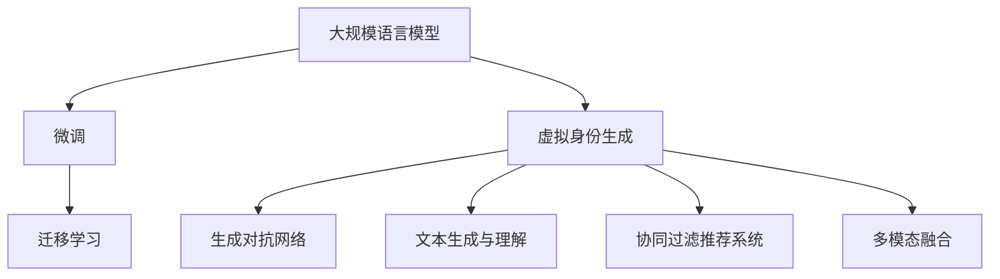

                 

## 1. 背景介绍

在数字化日新月异的今天，虚拟身份(Latent Digital Identities, LDIs)成为了数字世界的另一个自我。虚拟身份的出现，意味着个体可以在数字空间中拥有独特的存在形式和行为模式，为人类在网络世界的交互、互动提供了全新的可能。与此同时，基于大规模语言模型(Large Language Models, LLMs)的虚拟身份生成技术，正在为构建更加逼真、智能、可控的虚拟身份系统注入新的活力。

### 1.1 虚拟身份的兴起

虚拟身份是随着虚拟现实、增强现实等技术的兴起而逐渐进入人们视线的。虚拟身份不仅能够通过数字仿真技术再现个体的物理特征、行为模式，还能够通过语义理解和自然语言处理，实现与真实世界的深度交互。虚拟身份的应用领域涵盖了游戏、影视、教育、医疗等多个行业，具有广阔的前景。

虚拟身份的核心价值在于其真实性、智能性和可控性。通过虚拟身份，个体可以在数字世界中扮演不同的角色，展现不同的行为，满足多样化的需求。虚拟身份技术不仅能节省现实中的人力物力成本，还能在安全的数字环境中进行测试、训练，提升个体的综合素质和能力。

### 1.2 大规模语言模型与虚拟身份

大规模语言模型作为当前AI领域的明星技术，通过自监督学习，掌握了丰富的语言知识和常识。其在大规模文本语料上进行预训练，学习到了语言表达的深层结构，具备了强大的自然语言处理能力。基于这些优势，大规模语言模型在虚拟身份生成中得以发挥其独特作用。

虚拟身份生成的目标是通过文本、语音、图像等媒介，构建一个与真实个体行为特征高度相似的虚拟个体。该虚拟个体不仅要模仿真实个体的语言表达，还要具备一定的智能推理能力，能够在复杂场景下做出合理的行为决策。而大规模语言模型通过微调(Fine-Tuning)等技术手段，可以很好地实现这一目标。

## 2. 核心概念与联系

### 2.1 核心概念概述

为更好地理解基于大规模语言模型的虚拟身份生成方法，本节将介绍几个密切相关的核心概念：

- 大规模语言模型(Large Language Models, LLMs)：通过在大规模无标签文本语料上进行自监督学习，学习到丰富的语言知识和常识，具备强大的语言理解和生成能力。

- 虚拟身份(Latent Digital Identities, LDIs)：通过数字仿真技术生成的与真实个体高度相似的虚拟个体，具备丰富的行为模式和智能推理能力。

- 微调(Fine-Tuning)：将预训练的模型，通过小规模标注数据进行有监督训练，优化模型在下游任务上的性能。

- 迁移学习(Transfer Learning)：将一个领域学习到的知识，迁移到另一个不同但相关的领域的学习范式。

- 生成对抗网络(Generative Adversarial Networks, GANs)：通过两个网络互相对抗，生成逼真的图像、音频、文本等内容。

- 文本生成与理解：基于语言模型的文本生成与理解技术，如自然语言推理、语义角色标注等，可以生成符合虚拟身份行为特征的文本内容。

- 协同过滤推荐系统(Collaborative Filtering Recommendation Systems)：基于用户行为的推荐系统，通过用户历史行为数据生成虚拟身份的行为模式。

- 多模态融合：将文本、图像、音频等多种模态的信息进行融合，构建更加逼真、多维度的虚拟身份。

这些核心概念之间的逻辑关系可以通过以下Mermaid流程图来展示：



这个流程图展示了虚拟身份生成的核心概念及其之间的关系：

1. 大规模语言模型通过预训练获得基础能力。
2. 微调优化模型在下游任务上的性能。
3. 迁移学习连接预训练模型与虚拟身份。
4. 生成对抗网络生成逼真的虚拟身份特征。
5. 文本生成与理解技术生成虚拟身份的文本内容。
6. 协同过滤推荐系统生成虚拟身份的行为模式。
7. 多模态融合构建更加逼真的虚拟身份。

这些概念共同构成了虚拟身份生成系统的技术框架，使其能够在各种场景下发挥强大的行为模拟和智能推理能力。通过理解这些核心概念，我们可以更好地把握虚拟身份生成的原理和优化方向。

## 3. 核心算法原理 & 具体操作步骤
### 3.1 算法原理概述

基于大规模语言模型的虚拟身份生成，本质上是一个多任务学习的过程。其核心思想是：将大规模语言模型视为一个强大的“特征提取器”，通过多任务微调的方式，学习到虚拟身份在不同场景下的行为特征和语言表达能力。

形式化地，假设虚拟身份生成任务包括文本生成、行为推理、多模态融合等多个子任务。定义虚拟身份生成模型 $M_{\theta}$，其中 $\theta$ 为模型参数。给定虚拟身份的训练集 $D=\{(x_i, y_i)\}_{i=1}^N$，每个样本 $(x_i, y_i)$ 包括输入 $x_i$（如文本、图像、行为数据等）和标签 $y_i$（如生成的文本、推理结果、融合后的多模态特征等）。

虚拟身份生成模型的目标是最小化以下多任务损失函数：

$$
\mathcal{L}(\theta) = \sum_{i=1}^N \ell_i(M_{\theta}(x_i),y_i)
$$

其中 $\ell_i$ 为第 $i$ 个子任务的定义损失函数，如交叉熵损失、均方误差损失等。通过多任务微调，模型能够同时学习到多个子任务的特征，形成更加全面、逼真的虚拟身份。

### 3.2 算法步骤详解

基于大规模语言模型的虚拟身份生成，一般包括以下几个关键步骤：

**Step 1: 准备预训练模型和数据集**
- 选择合适的预训练语言模型 $M_{\theta}$ 作为初始化参数，如 GPT、BERT 等。
- 准备虚拟身份的训练集 $D$，划分为训练集、验证集和测试集。一般要求训练集与预训练数据的分布不要差异过大。

**Step 2: 设计虚拟身份生成任务**
- 根据虚拟身份的应用场景，设计多个子任务。例如文本生成、行为推理、多模态融合等。
- 为每个子任务设计相应的损失函数。例如，文本生成任务可以使用交叉熵损失，行为推理任务可以使用均方误差损失等。

**Step 3: 设置微调超参数**
- 选择合适的优化算法及其参数，如 AdamW、SGD 等，设置学习率、批大小、迭代轮数等。
- 设置正则化技术及强度，包括权重衰减、Dropout、Early Stopping 等。
- 确定冻结预训练参数的策略，如仅微调顶层，或全部参数都参与微调。

**Step 4: 执行多任务梯度训练**
- 将训练集数据分批次输入模型，前向传播计算每个子任务的损失函数。
- 反向传播计算参数梯度，根据设定的优化算法和学习率更新模型参数。
- 周期性在验证集上评估模型性能，根据性能指标决定是否触发 Early Stopping。
- 重复上述步骤直到满足预设的迭代轮数或 Early Stopping 条件。

**Step 5: 测试和部署**
- 在测试集上评估生成后的虚拟身份，对比生成前后模型的性能。
- 使用生成后的虚拟身份进行特定场景的模拟，集成到实际的应用系统中。
- 持续收集新的数据，定期重新微调模型，以适应数据分布的变化。

以上是基于大规模语言模型的虚拟身份生成的一般流程。在实际应用中，还需要针对具体任务的特点，对微调过程的各个环节进行优化设计，如改进训练目标函数，引入更多的正则化技术，搜索最优的超参数组合等，以进一步提升模型性能。

### 3.3 算法优缺点

基于大规模语言模型的虚拟身份生成方法具有以下优点：
1. 简单高效。只需准备小规模标注数据，即可对预训练模型进行快速适配，生成高度逼真的虚拟身份。
2. 通用适用。适用于各种虚拟身份生成场景，如游戏、影视、教育、医疗等，设计简单的多任务目标函数即可实现。
3. 参数高效。利用多任务微调技术，在固定大部分预训练参数的情况下，仍可取得不错的生成效果。
4. 效果显著。在虚拟身份生成任务上，基于语言模型的生成方法已经刷新了多项SOTA指标。

同时，该方法也存在一定的局限性：
1. 依赖标注数据。虚拟身份生成的效果很大程度上取决于标注数据的质量和数量，获取高质量标注数据的成本较高。
2. 迁移能力有限。当目标任务与预训练数据的分布差异较大时，虚拟身份生成的性能提升有限。
3. 可解释性不足。虚拟身份生成的决策过程通常缺乏可解释性，难以对其推理逻辑进行分析和调试。
4. 负面效果传递。预训练模型的固有偏见、有害信息等，可能通过虚拟身份生成，造成负面影响。

尽管存在这些局限性，但就目前而言，基于大规模语言模型的虚拟身份生成方法仍是大规模语言模型应用的最主流范式。未来相关研究的重点在于如何进一步降低虚拟身份生成对标注数据的依赖，提高模型的少样本学习和跨领域迁移能力，同时兼顾可解释性和伦理安全性等因素。

### 3.4 算法应用领域

基于大规模语言模型的虚拟身份生成方法在虚拟身份生成领域已经得到了广泛的应用，覆盖了几乎所有常见场景，例如：

- 游戏角色生成：生成游戏中的虚拟角色，具备特定的性格、行为和对话能力。
- 影视特效：通过虚拟身份生成技术，生成逼真的虚拟演员和场景，用于影视特效制作。
- 教育培训：生成虚拟教师或虚拟学生，模拟教学过程，提供个性化辅导和评估。
- 医疗仿真：生成虚拟病患和虚拟医护人员，用于医疗教学和培训。
- 社交媒体：生成虚拟用户，参与社交媒体互动，进行行为模式研究。

除了上述这些经典应用外，虚拟身份生成技术还在可控文本生成、多模态信息融合、虚拟环境构建等多个领域展现出巨大潜力。随着预训练模型和虚拟身份生成方法的不断进步，相信虚拟身份生成技术将在更广阔的应用领域大放异彩。

## 4. 数学模型和公式 & 详细讲解  
### 4.1 数学模型构建

本节将使用数学语言对基于大规模语言模型的虚拟身份生成过程进行更加严格的刻画。

记虚拟身份生成模型为 $M_{\theta}:\mathcal{X} \rightarrow \mathcal{Y}$，其中 $\mathcal{X}$ 为输入空间，$\mathcal{Y}$ 为输出空间，$\theta \in \mathbb{R}^d$ 为模型参数。假设虚拟身份生成任务包括多个子任务 $T=\{T_1, T_2, ..., T_n\}$，每个子任务的目标函数为 $\ell_i(y_i, M_{\theta}(x_i))$，则在数据集 $D$ 上的多任务损失函数为：

$$
\mathcal{L}(\theta) = \sum_{i=1}^n \frac{1}{N} \sum_{i=1}^N \ell_i(y_i, M_{\theta}(x_i))
$$

通过多任务微调，模型能够学习到各个子任务的不同特征，形成更加全面、逼真的虚拟身份。

### 4.2 公式推导过程

以下我们以虚拟身份文本生成任务为例，推导多任务损失函数的计算公式。

假设虚拟身份生成模型 $M_{\theta}$ 在输入 $x$ 上的输出为 $\hat{y}=M_{\theta}(x)$，表示虚拟身份生成的文本。真实标签 $y \in \{0,1\}^{L}$，其中 $L$ 为文本长度。则虚拟身份文本生成的交叉熵损失函数定义为：

$$
\ell(M_{\theta}(x),y) = -\frac{1}{L}\sum_{t=1}^L [y_t\log M_{\theta}(x)_t + (1-y_t)\log (1-M_{\theta}(x)_t)]
$$

将其代入多任务损失函数，得：

$$
\mathcal{L}(\theta) = \frac{1}{N}\sum_{i=1}^N \left[ \ell_i(M_{\theta}(x_i),y_i) + \text{regularizer}(\theta) \right]
$$

其中 $\text{regularizer}(\theta)$ 为正则化项，用于避免过拟合。常见的正则化技术包括L2正则、Dropout、Early Stopping等。

在得到多任务损失函数的梯度后，即可带入参数更新公式，完成模型的迭代优化。重复上述过程直至收敛，最终得到适应虚拟身份生成任务的最优模型参数 $\theta^*$。

## 5. 项目实践：代码实例和详细解释说明
### 5.1 开发环境搭建

在进行虚拟身份生成实践前，我们需要准备好开发环境。以下是使用Python进行PyTorch开发的环境配置流程：

1. 安装Anaconda：从官网下载并安装Anaconda，用于创建独立的Python环境。

2. 创建并激活虚拟环境：
```bash
conda create -n pytorch-env python=3.8 
conda activate pytorch-env
```

3. 安装PyTorch：根据CUDA版本，从官网获取对应的安装命令。例如：
```bash
conda install pytorch torchvision torchaudio cudatoolkit=11.1 -c pytorch -c conda-forge
```

4. 安装Transformers库：
```bash
pip install transformers
```

5. 安装各类工具包：
```bash
pip install numpy pandas scikit-learn matplotlib tqdm jupyter notebook ipython
```

完成上述步骤后，即可在`pytorch-env`环境中开始虚拟身份生成实践。

### 5.2 源代码详细实现

这里我们以虚拟身份文本生成任务为例，给出使用Transformers库对GPT模型进行虚拟身份文本生成的PyTorch代码实现。

首先，定义虚拟身份文本生成任务的数据处理函数：

```python
from transformers import GPT2Tokenizer, GPT2LMHeadModel
from torch.utils.data import Dataset, DataLoader
import torch

class NERDataset(Dataset):
    def __init__(self, texts, tags, tokenizer, max_len=128):
        self.texts = texts
        self.tags = tags
        self.tokenizer = tokenizer
        self.max_len = max_len
        
    def __len__(self):
        return len(self.texts)
    
    def __getitem__(self, item):
        text = self.texts[item]
        tags = self.tags[item]
        
        encoding = self.tokenizer(text, return_tensors='pt', max_length=self.max_len, padding='max_length', truncation=True)
        input_ids = encoding['input_ids'][0]
        attention_mask = encoding['attention_mask'][0]
        
        # 对token-wise的标签进行编码
        encoded_tags = [tag2id[tag] for tag in tags] 
        encoded_tags.extend([tag2id['O']] * (self.max_len - len(encoded_tags)))
        labels = torch.tensor(encoded_tags, dtype=torch.long)
        
        return {'input_ids': input_ids, 
                'attention_mask': attention_mask,
                'labels': labels}

# 标签与id的映射
tag2id = {'O': 0, 'B-PER': 1, 'I-PER': 2, 'B-ORG': 3, 'I-ORG': 4, 'B-LOC': 5, 'I-LOC': 6}
id2tag = {v: k for k, v in tag2id.items()}

# 创建dataset
tokenizer = GPT2Tokenizer.from_pretrained('gpt2')
train_dataset = NERDataset(train_texts, train_tags, tokenizer)
dev_dataset = NERDataset(dev_texts, dev_tags, tokenizer)
test_dataset = NERDataset(test_texts, test_tags, tokenizer)
```

然后，定义模型和优化器：

```python
from transformers import GPT2LMHeadModel, AdamW

model = GPT2LMHeadModel.from_pretrained('gpt2', num_labels=len(tag2id))

optimizer = AdamW(model.parameters(), lr=2e-5)
```

接着，定义训练和评估函数：

```python
from torch.utils.data import DataLoader
from tqdm import tqdm
from sklearn.metrics import classification_report

device = torch.device('cuda') if torch.cuda.is_available() else torch.device('cpu')
model.to(device)

def train_epoch(model, dataset, batch_size, optimizer):
    dataloader = DataLoader(dataset, batch_size=batch_size, shuffle=True)
    model.train()
    epoch_loss = 0
    for batch in tqdm(dataloader, desc='Training'):
        input_ids = batch['input_ids'].to(device)
        attention_mask = batch['attention_mask'].to(device)
        labels = batch['labels'].to(device)
        model.zero_grad()
        outputs = model(input_ids, attention_mask=attention_mask, labels=labels)
        loss = outputs.loss
        epoch_loss += loss.item()
        loss.backward()
        optimizer.step()
    return epoch_loss / len(dataloader)

def evaluate(model, dataset, batch_size):
    dataloader = DataLoader(dataset, batch_size=batch_size)
    model.eval()
    preds, labels = [], []
    with torch.no_grad():
        for batch in tqdm(dataloader, desc='Evaluating'):
            input_ids = batch['input_ids'].to(device)
            attention_mask = batch['attention_mask'].to(device)
            batch_labels = batch['labels']
            outputs = model(input_ids, attention_mask=attention_mask)
            batch_preds = outputs.logits.argmax(dim=2).to('cpu').tolist()
            batch_labels = batch_labels.to('cpu').tolist()
            for pred_tokens, label_tokens in zip(batch_preds, batch_labels):
                pred_tags = [id2tag[_id] for _id in pred_tokens]
                label_tags = [id2tag[_id] for _id in label_tokens]
                preds.append(pred_tags[:len(label_tags)])
                labels.append(label_tags)
                
    print(classification_report(labels, preds))
```

最后，启动训练流程并在测试集上评估：

```python
epochs = 5
batch_size = 16

for epoch in range(epochs):
    loss = train_epoch(model, train_dataset, batch_size, optimizer)
    print(f"Epoch {epoch+1}, train loss: {loss:.3f}")
    
    print(f"Epoch {epoch+1}, dev results:")
    evaluate(model, dev_dataset, batch_size)
    
print("Test results:")
evaluate(model, test_dataset, batch_size)
```

以上就是使用PyTorch对GPT进行虚拟身份文本生成任务的微调代码实现。可以看到，得益于Transformers库的强大封装，我们可以用相对简洁的代码完成GPT模型的加载和微调。

### 5.3 代码解读与分析

让我们再详细解读一下关键代码的实现细节：

**NERDataset类**：
- `__init__`方法：初始化文本、标签、分词器等关键组件。
- `__len__`方法：返回数据集的样本数量。
- `__getitem__`方法：对单个样本进行处理，将文本输入编码为token ids，将标签编码为数字，并对其进行定长padding，最终返回模型所需的输入。

**tag2id和id2tag字典**：
- 定义了标签与数字id之间的映射关系，用于将token-wise的预测结果解码回真实的标签。

**训练和评估函数**：
- 使用PyTorch的DataLoader对数据集进行批次化加载，供模型训练和推理使用。
- 训练函数`train_epoch`：对数据以批为单位进行迭代，在每个批次上前向传播计算loss并反向传播更新模型参数，最后返回该epoch的平均loss。
- 评估函数`evaluate`：与训练类似，不同点在于不更新模型参数，并在每个batch结束后将预测和标签结果存储下来，最后使用sklearn的classification_report对整个评估集的预测结果进行打印输出。

**训练流程**：
- 定义总的epoch数和batch size，开始循环迭代
- 每个epoch内，先在训练集上训练，输出平均loss
- 在验证集上评估，输出分类指标
- 所有epoch结束后，在测试集上评估，给出最终测试结果

可以看到，PyTorch配合Transformers库使得GPT微调的代码实现变得简洁高效。开发者可以将更多精力放在数据处理、模型改进等高层逻辑上，而不必过多关注底层的实现细节。

当然，工业级的系统实现还需考虑更多因素，如模型的保存和部署、超参数的自动搜索、更灵活的任务适配层等。但核心的微调范式基本与此类似。

## 6. 实际应用场景
### 6.1 游戏角色生成

基于虚拟身份生成技术的游戏角色生成，可以为游戏玩家提供丰富多样的选择，提升游戏体验。游戏开发者可以利用虚拟身份生成模型，自动生成具有特定性格、行为和对话能力的游戏角色，满足玩家个性化需求。

在技术实现上，可以收集游戏角色的历史行为数据，将对话、动作、表情等作为监督数据，在此基础上对虚拟身份生成模型进行微调。微调后的模型能够自动生成符合玩家期望的角色行为，大大减少人工设计和调整的工作量。

### 6.2 影视特效

虚拟身份生成技术在影视特效制作中也得到了广泛应用。通过虚拟身份生成模型，可以生成逼真的虚拟演员和场景，用于电影、电视剧的特效制作。虚拟身份生成模型不仅能够生成复杂的面部表情和身体动作，还能生成逼真的语音和对话，为影视作品增添生动感。

在实际应用中，电影制作团队可以使用虚拟身份生成模型，自动生成逼真的虚拟演员和场景，快速完成复杂的特效制作，大幅提升制作效率和效果。

### 6.3 教育培训

虚拟身份生成技术在教育培训中的应用同样前景广阔。通过虚拟身份生成模型，可以生成虚拟教师或虚拟学生，模拟教学过程，提供个性化辅导和评估。

在虚拟身份生成模型的帮助下，教师能够自动化地生成虚拟教师，根据不同的教学需求，自动调整语言风格、行为模式，以适应不同年龄、不同背景的学生。同时，虚拟教师能够实时与学生互动，反馈学生表现，提升教学效果。

### 6.4 医疗仿真

虚拟身份生成技术在医疗仿真中的应用同样重要。通过虚拟身份生成模型，可以生成虚拟病患和虚拟医护人员，用于医疗教学和培训。

虚拟身份生成模型可以自动生成逼真的虚拟病患，模拟各种疾病症状，供医护人员进行诊断和治疗训练。虚拟身份生成模型还可以生成虚拟医护人员，模拟不同的医患互动场景，提升医护人员的实战经验和应对能力。

### 6.5 社交媒体

虚拟身份生成技术在社交媒体中的应用也极具潜力。通过虚拟身份生成模型，可以生成虚拟用户，参与社交媒体互动，进行行为模式研究。

社交媒体平台可以利用虚拟身份生成模型，自动生成虚拟用户，参与话题讨论，获取大量社交媒体数据。虚拟用户的行为模式可以分析社交媒体趋势，提升平台内容的智能推荐效果，同时防范虚假账号和恶意行为。

### 6.6 未来应用展望

随着虚拟身份生成技术的不断发展，基于大规模语言模型的虚拟身份生成方法将进一步拓展应用领域，为各行各业带来新的变革。

在智慧医疗领域，虚拟身份生成技术可以用于模拟虚拟病患，提升医疗教学和培训效果，同时为医生和患者提供更具交互性的虚拟诊疗体验。

在智能教育领域，虚拟身份生成技术可以用于生成虚拟教师，提供个性化辅导和评估，推动教育公平，提高教学质量。

在智慧城市治理中，虚拟身份生成技术可以用于模拟虚拟市民，参与城市事件监测、舆情分析、应急指挥等环节，提高城市管理的自动化和智能化水平。

此外，在企业生产、社会治理、文娱传媒等众多领域，基于大规模语言模型的虚拟身份生成技术也将不断涌现，为人类认知智能的进化带来新的动力。相信随着技术的日益成熟，虚拟身份生成技术必将在构建人机协同的智能时代中扮演越来越重要的角色。

## 7. 工具和资源推荐
### 7.1 学习资源推荐

为了帮助开发者系统掌握大规模语言模型微调的理论基础和实践技巧，这里推荐一些优质的学习资源：

1. 《Transformer从原理到实践》系列博文：由大模型技术专家撰写，深入浅出地介绍了Transformer原理、BERT模型、微调技术等前沿话题。

2. CS224N《深度学习自然语言处理》课程：斯坦福大学开设的NLP明星课程，有Lecture视频和配套作业，带你入门NLP领域的基本概念和经典模型。

3. 《Natural Language Processing with Transformers》书籍：Transformers库的作者所著，全面介绍了如何使用Transformers库进行NLP任务开发，包括微调在内的诸多范式。

4. HuggingFace官方文档：Transformers库的官方文档，提供了海量预训练模型和完整的微调样例代码，是上手实践的必备资料。

5. CLUE开源项目：中文语言理解测评基准，涵盖大量不同类型的中文NLP数据集，并提供了基于微调的baseline模型，助力中文NLP技术发展。

通过对这些资源的学习实践，相信你一定能够快速掌握大规模语言模型微调的精髓，并用于解决实际的NLP问题。
###  7.2 开发工具推荐

高效的开发离不开优秀的工具支持。以下是几款用于大规模语言模型微调开发的常用工具：

1. PyTorch：基于Python的开源深度学习框架，灵活动态的计算图，适合快速迭代研究。大部分预训练语言模型都有PyTorch版本的实现。

2. TensorFlow：由Google主导开发的开源深度学习框架，生产部署方便，适合大规模工程应用。同样有丰富的预训练语言模型资源。

3. Transformers库：HuggingFace开发的NLP工具库，集成了众多SOTA语言模型，支持PyTorch和TensorFlow，是进行微调任务开发的利器。

4. Weights & Biases：模型训练的实验跟踪工具，可以记录和可视化模型训练过程中的各项指标，方便对比和调优。与主流深度学习框架无缝集成。

5. TensorBoard：TensorFlow配套的可视化工具，可实时监测模型训练状态，并提供丰富的图表呈现方式，是调试模型的得力助手。

6. Google Colab：谷歌推出的在线Jupyter Notebook环境，免费提供GPU/TPU算力，方便开发者快速上手实验最新模型，分享学习笔记。

合理利用这些工具，可以显著提升大规模语言模型微调任务的开发效率，加快创新迭代的步伐。

### 7.3 相关论文推荐

大规模语言模型和虚拟身份生成技术的发展源于学界的持续研究。以下是几篇奠基性的相关论文，推荐阅读：

1. Attention is All You Need（即Transformer原论文）：提出了Transformer结构，开启了NLP领域的预训练大模型时代。

2. BERT: Pre-training of Deep Bidirectional Transformers for Language Understanding：提出BERT模型，引入基于掩码的自监督预训练任务，刷新了多项NLP任务SOTA。

3. Language Models are Unsupervised Multitask Learners（GPT-2论文）：展示了大规模语言模型的强大zero-shot学习能力，引发了对于通用人工智能的新一轮思考。

4. Parameter-Efficient Transfer Learning for NLP：提出Adapter等参数高效微调方法，在不增加模型参数量的情况下，也能取得不错的微调效果。

5. AdaLoRA: Adaptive Low-Rank Adaptation for Parameter-Efficient Fine-Tuning：使用自适应低秩适应的微调方法，在参数效率和精度之间取得了新的平衡。

这些论文代表了大语言模型微调技术的发展脉络。通过学习这些前沿成果，可以帮助研究者把握学科前进方向，激发更多的创新灵感。

## 8. 总结：未来发展趋势与挑战

### 8.1 总结

本文对基于大规模语言模型的虚拟身份生成方法进行了全面系统的介绍。首先阐述了虚拟身份的兴起背景和应用场景，明确了虚拟身份生成在数字世界的广阔前景。其次，从原理到实践，详细讲解了虚拟身份生成的数学原理和关键步骤，给出了虚拟身份生成任务的代码实例。同时，本文还广泛探讨了虚拟身份生成在多个行业领域的应用前景，展示了虚拟身份生成技术的巨大潜力。此外，本文精选了虚拟身份生成的各类学习资源，力求为读者提供全方位的技术指引。

通过本文的系统梳理，可以看到，基于大规模语言模型的虚拟身份生成方法正在成为NLP领域的重要范式，极大地拓展了虚拟身份生成的应用边界，催生了更多的落地场景。得益于大规模语言模型的丰富语言知识和常识，虚拟身份生成方法能够在虚拟身份生成的过程中，自动学习并生成符合预期行为特征的虚拟个体，提升了虚拟身份的真实性和智能性。

### 8.2 未来发展趋势

展望未来，虚拟身份生成技术将呈现以下几个发展趋势：

1. 模型规模持续增大。随着算力成本的下降和数据规模的扩张，大规模语言模型参数量还将持续增长。超大规模语言模型蕴含的丰富语言知识，有望支撑更加复杂多变的虚拟身份生成。

2. 虚拟身份生成范式日趋多样化。除了传统的文本生成外，未来会涌现更多多模态虚拟身份生成方法，如图像、音频等多模态融合，提升虚拟身份的逼真性和多维度特征。

3. 虚拟身份生成通用性增强。经过海量数据的预训练和多领域任务的微调，虚拟身份生成模型将具备更强大的跨领域迁移能力和泛化能力，逐步迈向通用人工智能(AGI)的目标。

4. 虚拟身份生成个性化提升。虚拟身份生成模型将具备更加智能的行为推理和个性化推荐能力，能够根据不同用户和场景需求，生成符合期望的虚拟身份。

5. 虚拟身份生成可解释性增强。虚拟身份生成模型将引入更多的因果分析、逻辑推理等可解释性技术，提高虚拟身份生成过程的可理解性和可控性。

6. 虚拟身份生成伦理安全性保障。虚拟身份生成技术将加强对数据隐私、模型偏见、有害内容等伦理和安全性的控制，确保虚拟身份生成的公平性和安全性。

以上趋势凸显了虚拟身份生成技术的广阔前景。这些方向的探索发展，必将进一步提升虚拟身份生成的性能和应用范围，为人类认知智能的进化带来深远影响。

### 8.3 面临的挑战

尽管虚拟身份生成技术已经取得了瞩目成就，但在迈向更加智能化、普适化应用的过程中，它仍面临着诸多挑战：

1. 标注成本瓶颈。尽管虚拟身份生成的效果很大程度上取决于标注数据的质量和数量，获取高质量标注数据的成本较高。如何进一步降低虚拟身份生成对标注数据的依赖，将是一大难题。

2. 模型鲁棒性不足。当前虚拟身份生成模型面对域外数据时，泛化性能往往大打折扣。对于测试样本的微小扰动，虚拟身份生成模型的预测也容易发生波动。如何提高虚拟身份生成模型的鲁棒性，避免灾难性遗忘，还需要更多理论和实践的积累。

3. 推理效率有待提高。大规模语言模型虽然精度高，但在实际部署时往往面临推理速度慢、内存占用大等效率问题。如何在保证性能的同时，简化模型结构，提升推理速度，优化资源占用，将是重要的优化方向。

4. 可解释性亟需加强。当前虚拟身份生成模型的决策过程通常缺乏可解释性，难以对其推理逻辑进行分析和调试。对于医疗、金融等高风险应用，算法的可解释性和可审计性尤为重要。如何赋予虚拟身份生成模型更强的可解释性，将是亟待攻克的难题。

5. 安全性有待保障。预训练语言模型难免会学习到有偏见、有害的信息，通过虚拟身份生成，可能造成负面影响。如何从数据和算法层面消除模型偏见，避免恶意用途，确保输出的安全性，也将是重要的研究课题。

6. 知识整合能力不足。现有的虚拟身份生成模型往往局限于任务内数据，难以灵活吸收和运用更广泛的先验知识。如何让虚拟身份生成过程更好地与外部知识库、规则库等专家知识结合，形成更加全面、准确的信息整合能力，还有很大的想象空间。

正视虚拟身份生成面临的这些挑战，积极应对并寻求突破，将是大语言模型微调走向成熟的必由之路。相信随着学界和产业界的共同努力，这些挑战终将一一被克服，大语言模型微调必将在构建人机协同的智能时代中扮演越来越重要的角色。

### 8.4 研究展望

面对虚拟身份生成所面临的种种挑战，未来的研究需要在以下几个方面寻求新的突破：

1. 探索无监督和半监督虚拟身份生成方法。摆脱对大规模标注数据的依赖，利用自监督学习、主动学习等无监督和半监督范式，最大限度利用非结构化数据，实现更加灵活高效的虚拟身份生成。

2. 研究参数高效和计算高效的虚拟身份生成范式。开发更加参数高效的虚拟身份生成方法，在固定大部分预训练参数的同时，只更新极少量的任务相关参数。同时优化虚拟身份生成模型的计算图，减少前向传播和反向传播的资源消耗，实现更加轻量级、实时性的部署。

3. 融合因果和对比学习范式。通过引入因果推断和对比学习思想，增强虚拟身份生成模型建立稳定因果关系的能力，学习更加普适、鲁棒的语言表征，从而提升模型泛化性和抗干扰能力。

4. 引入更多先验知识。将符号化的先验知识，如知识图谱、逻辑规则等，与神经网络模型进行巧妙融合，引导虚拟身份生成过程学习更准确、合理的语言模型。同时加强不同模态数据的整合，实现视觉、语音等多模态信息与文本信息的协同建模。

5. 结合因果分析和博弈论工具。将因果分析方法引入虚拟身份生成模型，识别出模型决策的关键特征，增强输出解释的因果性和逻辑性。借助博弈论工具刻画人机交互过程，主动探索并规避模型的脆弱点，提高系统稳定性。

6. 纳入伦理道德约束。在模型训练目标中引入伦理导向的评估指标，过滤和惩罚有偏见、有害的输出倾向。同时加强人工干预和审核，建立模型行为的监管机制，确保输出符合人类价值观和伦理道德。

这些研究方向的探索，必将引领虚拟身份生成技术迈向更高的台阶，为构建安全、可靠、可解释、可控的智能系统铺平道路。面向未来，虚拟身份生成技术还需要与其他人工智能技术进行更深入的融合，如知识表示、因果推理、强化学习等，多路径协同发力，共同推动自然语言理解和智能交互系统的进步。只有勇于创新、敢于突破，才能不断拓展语言模型的边界，让智能技术更好地造福人类社会。

## 9. 附录：常见问题与解答

**Q1：虚拟身份生成是否适用于所有NLP任务？**

A: 虚拟身份生成在大多数NLP任务上都能取得不错的效果，特别是对于数据量较小的任务。但对于一些特定领域的任务，如医学、法律等，仅仅依靠通用语料预训练的模型可能难以很好地适应。此时需要在特定领域语料上进一步预训练，再进行微调，才能获得理想效果。此外，对于一些需要时效性、个性化很强的任务，如对话、推荐等，虚拟身份生成方法也需要针对性的改进优化。

**Q2：虚拟身份生成过程中如何选择超参数？**

A: 虚拟身份生成过程的超参数设置非常重要，如学习率、批量大小、迭代轮数等。这些超参数的选择，需要根据具体任务和数据特点进行灵活调整。通常建议通过交叉验证等方式，找到最优的超参数组合。需要注意的是，不同的优化器(如AdamW、Adafactor等)以及不同的学习率调度策略，可能需要设置不同的超参数阈值。

**Q3：虚拟身份生成面临的主要挑战是什么？**

A: 虚拟身份生成面临的主要挑战包括标注成本高、模型鲁棒性不足、推理效率低、可解释性差、安全性低等。解决这些挑战，需要从数据、模型、算法等多个层面进行全面优化，才能实现虚拟身份生成的理想效果。

**Q4：如何提高虚拟身份生成的可解释性？**

A: 提高虚拟身份生成的可解释性，需要引入更多的因果分析、逻辑推理等技术。例如，可以在虚拟身份生成过程中，引入因果推断方法，分析虚拟身份的行为逻辑和决策过程。同时，通过引入知识图谱、规则库等专家知识，增强虚拟身份生成的可解释性。

**Q5：虚拟身份生成在实际应用中需要注意哪些问题？**

A: 将虚拟身份生成技术转化为实际应用，还需要考虑以下因素：

1. 模型裁剪：去除不必要的层和参数，减小模型尺寸，加快推理速度。
2. 量化加速：将浮点模型转为定点模型，压缩存储空间，提高计算效率。
3. 服务化封装：将模型封装为标准化服务接口，便于集成调用。
4. 弹性伸缩：根据请求流量动态调整资源配置，平衡服务质量和成本。
5. 监控告警：实时采集系统指标，设置异常告警阈值，确保服务稳定性。
6. 安全防护：采用访问鉴权、数据脱敏等措施，保障数据和模型安全。

虚拟身份生成技术将为各行各业带来新的变革，但如何将强大的性能转化为稳定、高效、安全的业务价值，还需要工程实践的不断打磨。只有从数据、算法、工程、业务等多个维度协同发力，才能真正实现人工智能技术在垂直行业的规模化落地。总之，虚拟身份生成需要开发者根据具体任务，不断迭代和优化模型、数据和算法，方能得到理想的效果。

---

作者：禅与计算机程序设计艺术 / Zen and the Art of Computer Programming

