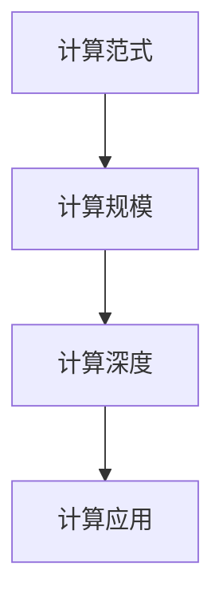

                 

# 计算的本质变化与未来趋势

计算技术的演进是人类文明进步的重要推动力。从最早的机械计算到电子计算机的诞生，再到人工智能的崛起，每一次技术的飞跃都为社会的各个方面带来了深刻变革。本文将探讨计算技术从根本上带来的变化，以及这些变化对未来社会的潜影影响。

## 1. 背景介绍

### 1.1 问题由来

在过去的几十年里，计算技术经历了飞速发展。特别是近十几年来，人工智能(AI)技术的进步，特别是深度学习和大规模数据驱动模型的兴起，正引领计算领域进入一个新的纪元。计算机不再是单纯的计算工具，而是具备了学习、推理和自我进化的能力。这种变化不仅改变了计算的方式，也改变了我们对世界的认知和处理方式。

### 1.2 问题核心关键点

计算技术的变革主要体现在以下几个方面：

- **计算范式转变**：从传统的规则驱动到基于数据的模型驱动，计算开始具备自我学习的能力。
- **计算规模扩大**：从单核计算到分布式计算，再到云计算，计算能力呈指数级增长。
- **计算深度增强**：从表面数据处理到深度数据理解，计算模型能够挖掘更深层的信息。
- **计算应用的拓展**：从科研领域到工业应用，计算技术在各个领域发挥着越来越重要的作用。

这些变化不仅使得计算技术成为推动社会进步的重要力量，也带来了新的伦理、安全和隐私等问题。面对这些挑战，计算技术的研究和应用需要持续创新和发展。

## 2. 核心概念与联系

### 2.1 核心概念概述

为了更好地理解计算技术的根本变化，本节将介绍几个关键概念及其相互联系：

- **计算范式**：从传统的规则驱动到基于数据的模型驱动，计算范式的转变使得机器能够学习并自主决策。
- **计算规模**：从小规模的本地计算到分布式计算，再到云计算，计算规模的扩大带来了更多的可能性。
- **计算深度**：从表面数据处理到深度数据理解，计算模型能够挖掘更深层的信息，做出更准确的预测和决策。
- **计算应用**：从科研领域到工业应用，计算技术在各个领域发挥着越来越重要的作用。

这些概念之间的联系可以通过以下Mermaid流程图来展示：



这个流程图展示了计算技术演进的路径：

1. 计算范式转变，赋予机器学习能力。
2. 计算规模扩大，提供更多的计算资源。
3. 计算深度增强，深入理解数据。
4. 计算应用拓展，渗透各行各业。

这些概念共同构成了计算技术的发展脉络，推动了技术的进步和社会的发展。

## 3. 核心算法原理 & 具体操作步骤

### 3.1 算法原理概述

计算技术的变革，在算法层面上表现为从传统规则到模型驱动的转变。这一转变，通过深度学习和大规模数据驱动模型来实现。

深度学习模型通常由多个层次组成，每个层次都能学习到不同层次的特征。通过反向传播算法，模型能够根据输入数据和输出标签，自动调整权重和偏置，从而实现对数据的深度理解。这种基于数据的模型驱动方式，使得计算技术能够从根本上学习和适应新的数据和任务。

### 3.2 算法步骤详解

深度学习模型的训练通常包括以下几个关键步骤：

1. **数据准备**：收集、清洗和标注数据集，准备训练模型所需的输入和输出。
2. **模型构建**：选择合适的模型架构，如卷积神经网络、循环神经网络、Transformer等，构建计算模型。
3. **模型训练**：使用反向传播算法和优化器（如SGD、Adam等），在训练集上迭代优化模型参数，最小化损失函数。
4. **模型评估**：在验证集上评估模型性能，防止过拟合，选择最优模型。
5. **模型部署**：将训练好的模型部署到生产环境中，进行实时推理和预测。

### 3.3 算法优缺点

深度学习模型的优势在于其能够从数据中自动学习特征，处理非线性关系，适用于复杂的模式识别和预测任务。然而，深度学习模型也存在以下缺点：

- **数据依赖性高**：深度学习模型需要大量标注数据进行训练，数据质量和数量对模型性能有直接影响。
- **计算资源需求大**：深度学习模型通常需要大量计算资源，如GPU、TPU等，训练和推理成本较高。
- **可解释性差**：深度学习模型通常是"黑盒"，难以解释其内部决策过程，缺乏透明性和可解释性。
- **泛化能力有限**：深度学习模型可能过拟合训练数据，泛化能力受限于数据集的大小和质量。

### 3.4 算法应用领域

深度学习模型在多个领域得到了广泛应用，包括但不限于：

- **计算机视觉**：图像分类、目标检测、图像生成等。
- **自然语言处理**：机器翻译、语音识别、情感分析等。
- **医疗健康**：疾病诊断、基因分析、医疗影像分析等。
- **自动驾驶**：环境感知、决策规划、路径规划等。
- **金融科技**：信用评估、风险管理、欺诈检测等。
- **智能制造**：工业检测、质量控制、工艺优化等。

深度学习模型的应用，极大地推动了各行业的智能化转型，提升了效率和精度，带来了前所未有的变革。

## 4. 数学模型和公式 & 详细讲解 & 举例说明

### 4.1 数学模型构建

深度学习模型通常由输入层、若干个隐藏层和输出层组成。假设输入数据为 $x$，模型参数为 $\theta$，输出标签为 $y$。则模型预测的输出为 $f(x;\theta)$。

损失函数 $\mathcal{L}(\theta)$ 用于衡量模型预测与真实标签之间的差异，常用的损失函数包括均方误差、交叉熵等。模型的目标是通过优化算法（如梯度下降），最小化损失函数，使得 $f(x;\theta)$ 逼近 $y$。

### 4.2 公式推导过程

以二分类任务为例，假设模型输出为 $f(x;\theta)=\sigma(z(x;\theta))$，其中 $\sigma$ 为激活函数，$z(x;\theta)=W^1x+b^1$ 为线性变换层，$W^1$ 和 $b^1$ 为线性层的权重和偏置，$W^2$ 和 $b^2$ 为输出层的权重和偏置。损失函数通常为交叉熵损失：

$$
\mathcal{L}(\theta) = -\frac{1}{N}\sum_{i=1}^N [y_i\log f(x_i;\theta) + (1-y_i)\log (1-f(x_i;\theta))]
$$

其中 $y_i \in \{0,1\}$，$N$ 为样本数量。反向传播算法通过链式法则计算损失函数对每个参数的梯度，用于更新模型参数：

$$
\frac{\partial \mathcal{L}(\theta)}{\partial \theta} = \frac{\partial \mathcal{L}(\theta)}{\partial z(x_i;\theta)} \frac{\partial z(x_i;\theta)}{\partial x_i} \frac{\partial x_i}{\partial \theta}
$$

### 4.3 案例分析与讲解

以图像分类为例，假设输入图像 $x$ 经过卷积层和池化层处理，得到特征向量 $z$，然后通过全连接层得到输出 $y$：

$$
y = W^3\sigma(W^2\sigma(z+b^2)+b^3)
$$

其中 $W^3$ 和 $b^3$ 为全连接层的权重和偏置，$W^2$ 和 $b^2$ 为前一层的全连接层的权重和偏置。交叉熵损失函数为：

$$
\mathcal{L}(\theta) = -\frac{1}{N}\sum_{i=1}^N [y_i\log f(x_i;\theta) + (1-y_i)\log (1-f(x_i;\theta))]
$$

通过反向传播算法，计算出各参数的梯度，并使用优化器进行参数更新。

## 5. 项目实践：代码实例和详细解释说明

### 5.1 开发环境搭建

在进行深度学习项目开发前，我们需要准备好开发环境。以下是使用Python进行TensorFlow开发的常见环境配置流程：

1. 安装Anaconda：从官网下载并安装Anaconda，用于创建独立的Python环境。

2. 创建并激活虚拟环境：
```bash
conda create -n tf-env python=3.7
conda activate tf-env
```

3. 安装TensorFlow：根据CUDA版本，从官网获取对应的安装命令。例如：
```bash
conda install tensorflow=2.7.0
```

4. 安装各类工具包：
```bash
pip install numpy pandas scikit-learn matplotlib tqdm jupyter notebook ipython
```

完成上述步骤后，即可在`tf-env`环境中开始深度学习项目开发。

### 5.2 源代码详细实现

我们以图像分类任务为例，给出使用TensorFlow进行深度学习模型训练的完整代码实现。

```python
import tensorflow as tf
from tensorflow.keras import datasets, layers, models
import matplotlib.pyplot as plt

# 加载数据集
(train_images, train_labels), (test_images, test_labels) = datasets.cifar10.load_data()

# 数据预处理
train_images, test_images = train_images / 255.0, test_images / 255.0

# 构建模型
model = models.Sequential([
    layers.Conv2D(32, (3, 3), activation='relu', input_shape=(32, 32, 3)),
    layers.MaxPooling2D((2, 2)),
    layers.Conv2D(64, (3, 3), activation='relu'),
    layers.MaxPooling2D((2, 2)),
    layers.Conv2D(64, (3, 3), activation='relu'),
    layers.Flatten(),
    layers.Dense(64, activation='relu'),
    layers.Dense(10)
])

# 编译模型
model.compile(optimizer='adam',
              loss=tf.keras.losses.SparseCategoricalCrossentropy(from_logits=True),
              metrics=['accuracy'])

# 训练模型
history = model.fit(train_images, train_labels, epochs=10, 
                    validation_data=(test_images, test_labels))

# 评估模型
test_loss, test_acc = model.evaluate(test_images, test_labels, verbose=2)
print('\nTest accuracy:', test_acc)

# 可视化训练过程
plt.plot(history.history['accuracy'], label='accuracy')
plt.plot(history.history['val_accuracy'], label = 'val_accuracy')
plt.xlabel('Epoch')
plt.ylabel('Accuracy')
plt.legend()
plt.show()
```

以上代码实现了使用卷积神经网络对CIFAR-10数据集进行图像分类的完整过程。可以看到，TensorFlow提供了一个非常简洁的高级API，使得深度学习模型的构建和训练变得非常简单。

### 5.3 代码解读与分析

让我们再详细解读一下关键代码的实现细节：

**数据加载和预处理**：
- 使用`datasets.cifar10.load_data()`加载CIFAR-10数据集，包含训练集和测试集。
- 将像素值归一化到0到1之间，提高模型的收敛速度。

**模型构建**：
- 使用`Sequential`模型定义序列化神经网络，依次添加卷积层、池化层和全连接层。
- 最后一层全连接层输出10个分类，使用`Dense`层实现。

**模型编译**：
- 使用`compile`方法设置优化器、损失函数和评价指标。
- 指定`from_logits=True`，表示输出是未经过softmax激活的logit值。

**模型训练**：
- 使用`fit`方法进行模型训练，指定训练集、测试集、迭代次数等参数。
- 使用`validation_data`指定验证集，监控模型在验证集上的性能。

**模型评估**：
- 使用`evaluate`方法在测试集上评估模型性能，输出准确率。

**可视化训练过程**：
- 使用`matplotlib`绘制训练过程的准确率和验证集准确率的对比图。

可以看到，TensorFlow的高级API使得深度学习模型的构建和训练变得非常简单，大大降低了开发者的工作量。

## 6. 实际应用场景

### 6.1 医疗健康

深度学习在医疗健康领域有着广泛的应用，如疾病诊断、基因分析、医疗影像分析等。通过深度学习模型，医生能够快速准确地诊断疾病，进行基因分析，甚至预测患者风险，提高医疗服务的效率和质量。

在疾病诊断方面，深度学习模型可以通过对大量的医疗影像数据进行学习，自动识别并定位病灶，帮助医生进行精准诊断。例如，卷积神经网络在乳腺癌筛查中已经取得了非常好的效果。

在基因分析方面，深度学习模型可以从DNA序列中自动学习特征，进行疾病风险预测和基因变异分析，提高个性化医疗的水平。

在医疗影像分析方面，深度学习模型可以自动检测和分析医疗影像中的病灶，辅助医生进行诊断和治疗。例如，在肺部CT影像中，深度学习模型能够自动检测和分类肺结节，提高筛查效率。

### 6.2 自动驾驶

自动驾驶技术是深度学习应用的另一个重要领域。通过深度学习模型，车辆能够实时感知环境，做出决策，保证行车安全。

在环境感知方面，深度学习模型可以自动检测和识别路标、车辆、行人等交通要素，提供准确的感知信息。例如，卷积神经网络在目标检测和行人检测中已经取得了非常好的效果。

在决策规划方面，深度学习模型可以通过学习历史驾驶数据，自动生成驾驶策略，保证行车安全和舒适性。例如，深度强化学习在自动驾驶路径规划中已经取得了非常好的效果。

在路径规划方面，深度学习模型可以通过学习地图和环境数据，自动生成最优路径，避免交通事故。例如，卷积神经网络在路径规划中已经取得了非常好的效果。

### 6.3 金融科技

深度学习在金融科技领域也有着广泛的应用，如信用评估、风险管理、欺诈检测等。通过深度学习模型，金融机构能够更好地理解客户需求，进行风险评估和欺诈检测，提升金融服务的效率和质量。

在信用评估方面，深度学习模型可以通过学习客户的交易数据、行为数据等，自动评估客户的信用风险，提高审批效率。例如，深度神经网络在信用评估中已经取得了非常好的效果。

在风险管理方面，深度学习模型可以通过学习历史交易数据，自动预测市场风险，帮助金融机构进行风险管理。例如，深度学习模型在股票市场预测中已经取得了非常好的效果。

在欺诈检测方面，深度学习模型可以通过学习用户的交易数据，自动检测异常行为，防范欺诈风险。例如，深度学习模型在信用卡欺诈检测中已经取得了非常好的效果。

### 6.4 未来应用展望

随着深度学习技术的不断发展，未来深度学习将会在更多领域得到应用，为社会带来更加深远的变革。

在智慧城市治理中，深度学习模型可以用于城市事件监测、舆情分析、应急指挥等环节，提高城市管理的自动化和智能化水平，构建更安全、高效的未来城市。

在智能制造中，深度学习模型可以用于工业检测、质量控制、工艺优化等环节，提高生产效率和产品质量。

在智能家居中，深度学习模型可以用于智能语音识别、智能家居控制等环节，提升用户的生活体验。

在教育领域，深度学习模型可以用于智能推荐、学习效果评估等环节，提高教育质量和个性化教育水平。

## 7. 工具和资源推荐

### 7.1 学习资源推荐

为了帮助开发者系统掌握深度学习技术，这里推荐一些优质的学习资源：

1. 《深度学习》系列书籍：由Ian Goodfellow、Yoshua Bengio、Aaron Courville共同编写，系统介绍了深度学习的基本概念和算法。

2. CS231n《卷积神经网络》课程：斯坦福大学开设的计算机视觉课程，由Fei-Fei Li教授主讲，涵盖卷积神经网络、目标检测、图像生成等。

3. DeepLearning.AI《深度学习专项课程》：由Andrew Ng教授主讲，涵盖深度学习的基础、进阶和实战应用。

4. PyTorch官方文档：PyTorch官方文档，提供了大量的教程和案例，是学习深度学习的必备资料。

5. TensorFlow官方文档：TensorFlow官方文档，提供了丰富的API和案例，帮助开发者快速上手深度学习。

通过对这些资源的学习实践，相信你一定能够快速掌握深度学习技术，并用于解决实际的NLP问题。

### 7.2 开发工具推荐

高效的开发离不开优秀的工具支持。以下是几款用于深度学习开发的常用工具：

1. PyTorch：基于Python的开源深度学习框架，灵活动态的计算图，适合快速迭代研究。大部分深度学习模型都有PyTorch版本的实现。

2. TensorFlow：由Google主导开发的开源深度学习框架，生产部署方便，适合大规模工程应用。同样有丰富的深度学习模型资源。

3. Keras：基于TensorFlow和Theano的高级API，提供了简洁的API接口，方便快速构建深度学习模型。

4. JAX：由Google开发的自动微分库，支持高效计算和自动向量化，适合高效并行计算。

5. PyTorch Lightning：基于PyTorch的轻量级深度学习框架，支持分布式训练和模型调优，适用于大规模应用。

6. Weights & Biases：模型训练的实验跟踪工具，可以记录和可视化模型训练过程中的各项指标，方便对比和调优。

这些工具大大简化了深度学习模型的开发和部署流程，提高了工作效率和模型性能。

### 7.3 相关论文推荐

深度学习技术的发展源于学界的持续研究。以下是几篇奠基性的相关论文，推荐阅读：

1. ImageNet Classification with Deep Convolutional Neural Networks（AlexNet论文）：提出了卷积神经网络，并应用于图像分类任务，刷新了ImageNet数据集的SOTA。

2. Deep Residual Learning for Image Recognition（ResNet论文）：提出了残差网络，解决了深度神经网络中的梯度消失问题，提高了模型的深度和性能。

3. Generative Adversarial Nets（GAN论文）：提出了生成对抗网络，生成逼真的图像和视频，推动了计算机视觉和图像生成技术的发展。

4. Attention is All You Need（Transformer原论文）：提出了Transformer结构，开启了深度学习中的自注意力机制，推动了自然语言处理技术的发展。

5. Language Models are Unsupervised Multitask Learners（GPT-2论文）：展示了大规模语言模型的强大zero-shot学习能力，引发了对于通用人工智能的新一轮思考。

6. Towards Generalization with Transferable Representation Learning（CIFAR-10数据集论文）：提出了一种通用的迁移学习方法，提高了深度学习模型的泛化能力。

这些论文代表了大深度学习技术的发展脉络。通过学习这些前沿成果，可以帮助研究者把握学科前进方向，激发更多的创新灵感。

## 8. 总结：未来发展趋势与挑战

### 8.1 研究成果总结

深度学习技术在过去十年中取得了显著进展，已经广泛应用于图像处理、自然语言处理、语音识别等多个领域，推动了科技和社会的进步。未来，深度学习技术将进一步发展，解决更多复杂的问题，带来更多创新。

### 8.2 未来发展趋势

展望未来，深度学习技术将呈现以下几个发展趋势：

1. **模型规模扩大**：随着计算资源和数据的不断增加，深度学习模型的规模将不断扩大，可以处理更复杂的数据和任务。

2. **模型结构优化**：深度学习模型将变得更加高效和灵活，采用更先进的架构和技术，如自注意力机制、残差网络等。

3. **模型泛化能力增强**：深度学习模型将具有更强的泛化能力，能够在不同领域和任务上表现出色。

4. **模型解释性提升**：深度学习模型将变得更加透明和可解释，方便开发人员进行调试和优化。

5. **模型安全性保障**：深度学习模型将具有更好的安全性，防止模型被恶意攻击和篡改。

6. **模型伦理合规**：深度学习模型将更加符合伦理和法律规范，保护用户隐私和数据安全。

这些趋势将推动深度学习技术不断进步，为各个领域带来更多的创新和变革。

### 8.3 面临的挑战

尽管深度学习技术已经取得了显著进展，但在迈向更加智能化、普适化应用的过程中，它仍面临着诸多挑战：

1. **数据隐私和安全**：深度学习模型需要大量数据进行训练，数据隐私和安全问题不容忽视。如何保护用户隐私和数据安全，是一个重要的研究方向。

2. **模型鲁棒性不足**：深度学习模型面对新的数据和任务时，容易过拟合或泛化能力不足。如何提高模型的鲁棒性和泛化能力，是深度学习模型的重要挑战。

3. **计算资源需求大**：深度学习模型通常需要大量计算资源进行训练和推理，资源需求大。如何降低计算成本，提高计算效率，是一个重要的研究方向。

4. **模型解释性差**：深度学习模型通常是"黑盒"，难以解释其内部决策过程。如何提高模型的可解释性，是一个重要的研究方向。

5. **模型安全性有待保障**：深度学习模型可能被恶意攻击和篡改，如何提高模型的安全性，是一个重要的研究方向。

6. **模型伦理合规**：深度学习模型可能存在偏见和歧视，如何保证模型的公平性和伦理合规性，是一个重要的研究方向。

### 8.4 研究展望

面对深度学习面临的这些挑战，未来的研究需要在以下几个方面寻求新的突破：

1. **数据隐私和安全**：研究数据保护技术，如数据匿名化、差分隐私等，保护用户隐私和数据安全。

2. **模型鲁棒性提升**：研究模型鲁棒性提升技术，如对抗样本生成、鲁棒正则化等，提高模型的泛化能力。

3. **计算资源优化**：研究计算资源优化技术，如模型压缩、模型加速等，降低计算成本，提高计算效率。

4. **模型解释性提升**：研究模型解释性提升技术，如可解释性学习、可解释性模型等，提高模型的可解释性。

5. **模型安全性保障**：研究模型安全性保障技术，如模型鲁棒性、对抗样本防御等，提高模型的安全性。

6. **模型伦理合规**：研究模型伦理合规技术，如公平性检测、偏见消除等，保证模型的公平性和伦理合规性。

这些研究方向的探索，将引领深度学习技术迈向更高的台阶，为构建安全、可靠、可解释、可控的智能系统铺平道路。

---

作者：禅与计算机程序设计艺术 / Zen and the Art of Computer Programming

