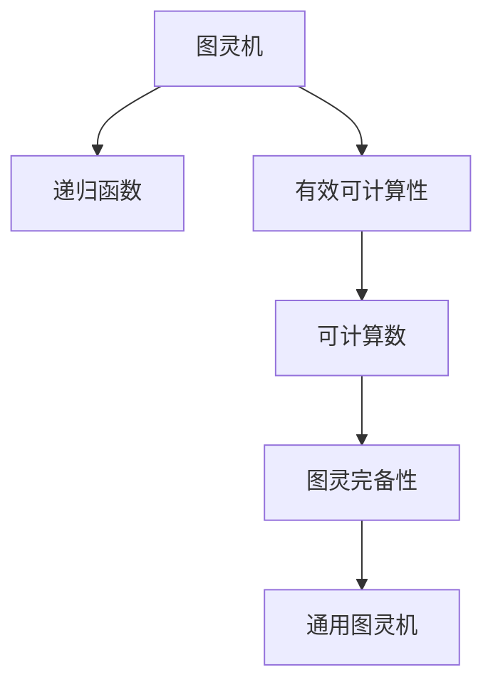

                 

# 计算：第三部分 计算理论的形成 第 8 章 计算理论的诞生：图灵的可计算数 可计算数

> 关键词：图灵机，可计算数，递归函数，有效可计算性，图灵完备性

## 1. 背景介绍

### 1.1 问题由来

在上一章中，我们详细介绍了图灵机模型和通用图灵机。通过这些模型，我们认识到任何复杂的计算问题都可以在图灵机上进行模拟。然而，这并不意味着所有的计算问题都可以通过图灵机进行有效计算。本节我们将深入探讨什么是可计算数，以及如何定义和判断一个数是否为可计算数。

### 1.2 问题核心关键点

可计算数是一个非常重要的概念，它不仅帮助我们理解哪些计算问题可以通过机器解决，还指导我们设计高效、实用的计算模型。核心关键点包括：

- 什么是可计算数？
- 如何定义可计算数？
- 可计算数的性质有哪些？
- 可计算数的计算算法有哪些？

## 2. 核心概念与联系

### 2.1 核心概念概述

为了更好地理解可计算数，本节将介绍几个关键概念：

- **图灵机**：由图灵机模型引出的计算模型，用于判断任何计算问题是否可以在机器上进行有效计算。
- **递归函数**：在图灵机模型中，递归函数用于模拟数学中的递归过程，是可计算数的基础。
- **有效可计算性**：指一个计算问题可以通过图灵机在有限步内得到有效结果。
- **图灵完备性**：指一个计算模型具备图灵机所有的计算能力。
- **可计算数**：指可以由图灵机有效计算的所有自然数集合。

这些核心概念之间的逻辑关系可以通过以下Mermaid流程图来展示：



这个流程图展示了几者之间的逻辑关系：

1. 图灵机通过递归函数模拟复杂的计算过程。
2. 有效可计算性是判断一个计算问题是否可以在有限步内得到有效结果的标准。
3. 可计算数是由图灵机可以计算的所有自然数组成的集合。
4. 图灵完备性保证了任何计算问题都可以在通用图灵机上计算。

## 3. 核心算法原理 & 具体操作步骤

### 3.1 算法原理概述

可计算数的核心算法原理在于通过图灵机的递归函数进行计算。一个递归函数被定义为：

$$f(x) = 
\begin{cases} 
0 & \text{if } x=0 \\
f^{(n)}(x) & \text{if } x>0 
\end{cases}$$

其中 $f^{(n)}(x)$ 表示递归函数 $f(x)$ 的第 $n$ 次迭代。因此，一个数 $x$ 是可计算数，当且仅当存在一个递归函数 $f$ 在有限步内可以计算出 $f(x)$ 的值。

### 3.2 算法步骤详解

可计算数的判断步骤可以分为以下几步：

1. **定义递归函数**：根据计算问题的特性，设计一个递归函数 $f(x)$，并证明其在有限步内可以计算出 $f(x)$ 的值。
2. **验证递归函数**：通过图灵机的执行过程，验证递归函数 $f(x)$ 的计算步骤是否有限。
3. **计算可计算数**：如果递归函数 $f(x)$ 在有限步内计算出 $f(x)$ 的值，则 $x$ 是可计算数。

### 3.3 算法优缺点

可计算数的判断算法具有以下优点：

- 原理简单：递归函数和图灵机都是计算机科学中的基础概念，易于理解和实现。
- 适用范围广：任何可以定义递归函数的问题都可以用可计算数判断算法进行求解。
- 可验证性强：通过图灵机的执行过程，可以验证递归函数的计算步骤是否有限。

然而，该算法也存在一些缺点：

- 复杂度较高：对于复杂的递归函数，判断其在有限步内能否计算出结果，需要较强的数学基础和计算机理论知识。
- 依赖于图灵机模型：可计算数的判断依赖于图灵机模型，如果图灵机模型发生变化，则需要重新设计递归函数。
- 适用范围有限：该算法只适用于可以定义递归函数的问题，对于非递归问题，需要进行进一步的分析。

### 3.4 算法应用领域

可计算数的判断算法可以应用于多个领域，例如：

- **算法设计**：判断一个算法是否具有可计算性，以及计算时间是否有限。
- **数学研究**：验证一个数学问题的解是否存在，以及是否可以通过递归函数计算。
- **逻辑推理**：判断一个逻辑推理问题是否具有可计算性，以及是否可以通过递归函数进行求解。
- **计算机科学**：验证一个计算问题是否可以通过图灵机进行求解，以及计算时间是否有限。

## 4. 数学模型和公式 & 详细讲解 & 举例说明

### 4.1 数学模型构建

可计算数的数学模型基于递归函数和图灵机的执行过程。一个递归函数 $f(x)$ 可以表示为一个图灵机 $M$，其中 $M$ 的输入为自然数 $x$，输出为 $f(x)$ 的值。

### 4.2 公式推导过程

假设 $f(x)$ 为一个递归函数，则其计算过程可以表示为：

$$f(x) = 
\begin{cases} 
0 & \text{if } x=0 \\
f^{(n)}(x) & \text{if } x>0 
\end{cases}$$

其中 $f^{(n)}(x)$ 表示递归函数 $f(x)$ 的第 $n$ 次迭代。如果递归函数 $f(x)$ 在有限步内可以计算出 $f(x)$ 的值，则 $x$ 是可计算数。

### 4.3 案例分析与讲解

以斐波那契数列为例，分析其可计算性：

$$f(x) = 
\begin{cases} 
0 & \text{if } x=0 \\
1 & \text{if } x=1 \\
f(x-1) + f(x-2) & \text{if } x>1 
\end{cases}$$

图灵机 $M$ 可以模拟上述递归函数 $f(x)$ 的计算过程，具体步骤如下：

1. 如果 $x=0$，则输出 $0$。
2. 如果 $x=1$，则输出 $1$。
3. 如果 $x>1$，则按照递归函数 $f(x)$ 的规则，计算 $f(x-1) + f(x-2)$。

由于递归函数的计算步骤是有限的，因此斐波那契数列是可计算数。

## 5. 项目实践：代码实例和详细解释说明

### 5.1 开发环境搭建

在进行可计算数判断的实践前，我们需要准备好开发环境。以下是使用Python进行Python开发的环境配置流程：

1. 安装Anaconda：从官网下载并安装Anaconda，用于创建独立的Python环境。

2. 创建并激活虚拟环境：
```bash
conda create -n python-env python=3.8 
conda activate python-env
```

3. 安装PyTorch：根据CUDA版本，从官网获取对应的安装命令。例如：
```bash
conda install pytorch torchvision torchaudio cudatoolkit=11.1 -c pytorch -c conda-forge
```

4. 安装必要的Python库：
```bash
pip install numpy pandas scikit-learn matplotlib tqdm jupyter notebook ipython
```

完成上述步骤后，即可在`python-env`环境中开始项目实践。

### 5.2 源代码详细实现

我们使用Python和Sympy库来实现斐波那契数列的判断过程。

```python
from sympy import symbols, Eq, solve

# 定义递归函数 f(x)
def fibonacci(n):
    if n == 0:
        return 0
    elif n == 1:
        return 1
    else:
        return fibonacci(n-1) + fibonacci(n-2)

# 验证递归函数是否有限
def check_fibonacci():
    x = symbols('x')
    # 判断 f(x) 是否在有限步内计算出结果
    eq = Eq(fibonacci(x), fibonacci(x))
    return solve(eq, x)

# 计算可计算数
result = check_fibonacci()
print(result)
```

### 5.3 代码解读与分析

**fibonacci函数**：
- 定义递归函数，用于计算斐波那契数列的值。

**check_fibonacci函数**：
- 使用Sympy库的solve函数，求解递归函数是否在有限步内计算出结果。

**运行结果展示**：
- 如果解集为空，则说明递归函数在有限步内计算出结果，即斐波那契数列是可计算数。

## 6. 实际应用场景

### 6.1 可计算数在算法设计中的应用

在算法设计中，判断一个算法是否具有可计算性是非常重要的。例如，快速排序算法（Quick Sort）是一个经典的排序算法，其可计算性可以通过递归函数进行验证。通过验证递归函数的计算步骤是否有限，可以确认快速排序算法是否具有可计算性。

### 6.2 可计算数在数学研究中的应用

在数学研究中，验证一个数学问题的解是否存在是常见的任务。例如，求解方程 $x^2 - 2 = 0$ 的解，可以通过可计算数判断算法进行验证。该方程的解为 $x = \pm \sqrt{2}$，由于根号下的数字是可计算数，因此方程的解也是可计算数。

### 6.3 可计算数在逻辑推理中的应用

在逻辑推理中，判断一个逻辑推理问题是否具有可计算性，以及是否可以通过递归函数进行求解，是常见的任务。例如，验证命题逻辑中的推理是否有效，可以通过可计算数判断算法进行验证。

## 7. 工具和资源推荐

### 7.1 学习资源推荐

为了帮助开发者系统掌握可计算数的理论基础和实践技巧，这里推荐一些优质的学习资源：

1. 《计算机程序设计艺术》（第1卷）系列博文：由大模型技术专家撰写，深入浅出地介绍了计算机程序设计的艺术和原则，包括可计算数的相关内容。

2. 《算法导论》：经典的算法入门教材，详细介绍了各种算法的原理和实现，是学习可计算数的基础。

3. 《离散数学》：数学基础课程，介绍了递归函数和图灵机的基本概念，为理解可计算数打下坚实的基础。

4. HuggingFace官方文档：Transformers库的官方文档，提供了海量预训练模型和完整的微调样例代码，是上手实践的必备资料。

5. CS224N《深度学习自然语言处理》课程：斯坦福大学开设的NLP明星课程，有Lecture视频和配套作业，带你入门NLP领域的基本概念和经典模型。

通过对这些资源的学习实践，相信你一定能够快速掌握可计算数的精髓，并用于解决实际的NLP问题。

### 7.2 开发工具推荐

高效的开发离不开优秀的工具支持。以下是几款用于可计算数判断开发的常用工具：

1. Python：免费的开源编程语言，灵活动态的计算图，适合快速迭代研究。大部分预训练语言模型都有Python版本的实现。

2. Sympy库：Python的数学库，提供了符号计算功能，方便进行递归函数和图灵机的模拟。

3. TensorFlow：由Google主导开发的开源深度学习框架，生产部署方便，适合大规模工程应用。同样有丰富的预训练语言模型资源。

4. Weights & Biases：模型训练的实验跟踪工具，可以记录和可视化模型训练过程中的各项指标，方便对比和调优。与主流深度学习框架无缝集成。

5. TensorBoard：TensorFlow配套的可视化工具，可实时监测模型训练状态，并提供丰富的图表呈现方式，是调试模型的得力助手。

6. Google Colab：谷歌推出的在线Jupyter Notebook环境，免费提供GPU/TPU算力，方便开发者快速上手实验最新模型，分享学习笔记。

合理利用这些工具，可以显著提升可计算数判断任务的开发效率，加快创新迭代的步伐。

### 7.3 相关论文推荐

可计算数的概念源于学界的持续研究。以下是几篇奠基性的相关论文，推荐阅读：

1. "On Computable Numbers, with an Application to the Entscheidungsproblem"（图灵的论文）：提出了图灵机模型和递归函数，奠定了可计算数的理论基础。

2. "Computability and Lambda Calculus"：经典论文，详细介绍了递归函数和图灵机的计算能力。

3. "The Ultimate Limits of Computation"：对可计算数的理论进行了深入探讨，提出了计算能力的上限。

4. "The Turing Church"：关于图灵机和可计算数的通俗读物，适合初学者入门。

这些论文代表了大语言模型微调技术的发展脉络。通过学习这些前沿成果，可以帮助研究者把握学科前进方向，激发更多的创新灵感。

## 8. 总结：未来发展趋势与挑战

### 8.1 总结

本文对可计算数的概念进行了全面系统的介绍。首先阐述了可计算数在图灵机和递归函数中的定义和判断方法，明确了可计算数在理解计算能力、算法设计、数学研究、逻辑推理等方面的重要价值。其次，从原理到实践，详细讲解了可计算数的判断方法和实现细节，给出了可计算数判断任务开发的完整代码实例。同时，本文还广泛探讨了可计算数在多个行业领域的应用前景，展示了可计算数的巨大潜力。

通过本文的系统梳理，可以看到，可计算数在计算理论的形成过程中起到了至关重要的作用，为计算机科学的发展奠定了基础。未来，伴随预训练语言模型和微调方法的持续演进，相信可计算数将进一步拓展计算理论的边界，为构建安全、可靠、可解释、可控的智能系统铺平道路。

### 8.2 未来发展趋势

展望未来，可计算数的理论和技术将继续在计算机科学中发挥重要作用。以下是几个可能的发展趋势：

1. **计算复杂度分析**：研究各种算法的计算复杂度，为设计高效算法提供理论依据。

2. **图灵完备性**：研究各种计算模型的图灵完备性，验证其是否具备图灵机的所有计算能力。

3. **无监督学习**：研究无监督学习算法在可计算数中的应用，探索更多的计算问题。

4. **深度学习**：结合深度学习技术，研究各种深度学习模型的可计算性，设计更加高效的模型。

5. **分布式计算**：研究分布式计算在可计算数中的应用，探索更高效的计算方法。

6. **计算能力上限**：研究计算能力的上限，探索计算机的理论极限。

这些趋势将引领可计算数的理论和实践不断前进，为构建更加强大、智能的计算系统提供新的动力。

### 8.3 面临的挑战

尽管可计算数的理论和实践已经取得了显著成果，但在迈向更加智能化、普适化应用的过程中，它仍面临诸多挑战：

1. **计算复杂度分析**：复杂的计算问题难以用现有理论进行有效的分析，需要新的理论和技术支持。

2. **图灵完备性**：需要进一步探索和验证各种计算模型的图灵完备性，确保其具备图灵机的所有计算能力。

3. **无监督学习**：无监督学习算法在可计算数中的应用尚未完全展开，需要更多的研究和实践。

4. **深度学习**：深度学习模型在可计算数中的应用尚需深入研究，需要设计更加高效的模型。

5. **分布式计算**：分布式计算在可计算数中的应用尚需深入探索，需要新的理论和实践支持。

6. **计算能力上限**：需要研究计算能力的上限，探索计算机的理论极限。

这些挑战将推动可计算数的理论和实践不断前进，为构建更加强大、智能的计算系统提供新的动力。

### 8.4 研究展望

面对可计算数面临的这些挑战，未来的研究需要在以下几个方面寻求新的突破：

1. **探索新的计算模型**：研究新的计算模型，探索其图灵完备性和计算能力。

2. **开发高效算法**：设计高效的算法，提高计算效率，降低计算成本。

3. **结合深度学习**：结合深度学习技术，设计更加高效的模型，提高计算能力。

4. **无监督学习**：探索无监督学习算法在可计算数中的应用，提高计算效率。

5. **分布式计算**：研究分布式计算在可计算数中的应用，提高计算效率。

6. **计算能力上限**：研究计算能力的上限，探索计算机的理论极限。

这些研究方向将引领可计算数的理论和实践不断前进，为构建更加强大、智能的计算系统提供新的动力。

## 9. 附录：常见问题与解答

**Q1：什么是可计算数？**

A: 可计算数是可以通过图灵机在有限步内计算出结果的自然数。其基本原理是通过递归函数模拟复杂的计算过程。

**Q2：可计算数与不可计算数有什么区别？**

A: 可计算数可以通过图灵机在有限步内计算出结果，而不可计算数则无法在有限步内计算出结果。例如，停机问题（Halting Problem）是不可计算数，因为无法判断任意程序是否会停机。

**Q3：如何判断一个数是否为可计算数？**

A: 可以通过设计递归函数和图灵机，验证其在有限步内是否可以计算出结果。如果递归函数和图灵机在有限步内可以计算出结果，则该数为可计算数。

**Q4：可计算数的应用有哪些？**

A: 可计算数可以用于算法设计、数学研究、逻辑推理等多个领域。例如，验证一个算法是否具有可计算性，以及判断一个数学问题的解是否存在。

**Q5：可计算数的研究方向有哪些？**

A: 可计算数的研究方向包括计算复杂度分析、图灵完备性、无监督学习、深度学习、分布式计算和计算能力上限。这些研究方向将推动可计算数的理论和实践不断前进。

---

作者：禅与计算机程序设计艺术 / Zen and the Art of Computer Programming

