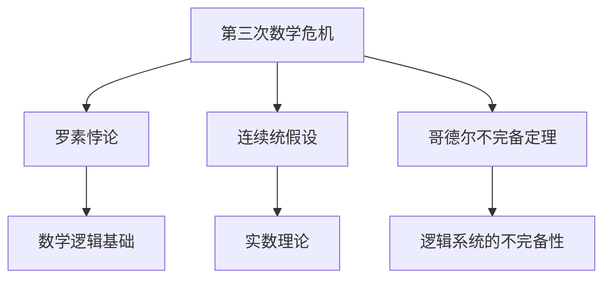

                 

## 1. 背景介绍

### 1.1 问题由来
在计算机科学的早期，数学作为其核心支撑技术之一，发挥了至关重要的作用。从图灵机模型到算法复杂性理论，数学为计算机科学的理论体系和应用实践奠定了坚实的基础。然而，数学本身并不是一成不变的，它在历史的长河中经历了多次重大危机，其中最著名的三次数学危机，更是对数学理论的演化产生了深远影响。

### 1.2 问题核心关键点
- 数学与计算机科学的紧密联系。
- 第三次数学危机对数学理论的深远影响。
- 危机期间数学家们的探索与创新。
- 危机后数学与计算机科学的新进展。

## 2. 核心概念与联系

### 2.1 核心概念概述

为了更好地理解第三次数学危机及其背景，本节将介绍几个密切相关的核心概念：

- **第三次数学危机**：20世纪初，数学界遭遇了一系列挑战，包括集合论悖论、连续统假设和几何学公理系统的不完备性，引发了对数学基础的深刻反思。

- **悖论**：悖论是逻辑上自相矛盾的概念，通常通过数学形式化方法揭露。

- **集合论悖论**：如罗素悖论（Russell's Paradox），揭示了经典集合论的不自洽性。

- **连续统假设**：有关实数集可数性和不可数性的猜想，长期未能证明。

- **哥德尔不完备定理**：数学逻辑系统不完备性的重要发现，表明了在一定意义上所有数学系统都可以被证明为一致或不一致。

这些核心概念之间的逻辑关系可以通过以下Mermaid流程图来展示：



这个流程图展示了几大数学危机事件与数学理论发展之间的关系：

1. 罗素悖论揭示了集合论的矛盾，引发了对数学逻辑基础的思考。
2. 连续统假设与哥德尔不完备定理进一步深化了对数学理论一致性和完备性的理解。

## 3. 核心算法原理 & 具体操作步骤
### 3.1 算法原理概述

第三次数学危机的核心在于逻辑悖论和公理系统的不完备性。以罗素悖论为例，其形式化表述为：

设 $R$ 是一个集合，如果 $x$ 不属于 $R$，那么 $x \in R$，否则 $x \notin R$。

设 $P=\{ x \mid x \notin x \}$。若 $P \in P$，则 $P \in R$；若 $P \notin P$，则 $P \notin R$。

无论是 $P \in R$ 还是 $P \notin R$，都将导致 $P \in P$ 或 $P \notin P$ 的矛盾。

这一悖论直接指出了经典集合论的逻辑矛盾，从而引发了数学家对数学基础的深刻反思。而哥德尔不完备定理则进一步揭示了所有数学逻辑系统内在的不完备性，表明没有单一的逻辑系统能够完全自洽且完备。

### 3.2 算法步骤详解

解决悖论和不完备性问题，数学家们采取了多种方法：

- **形式化数学**：通过符号逻辑和集合论公理系统，对数学进行形式化处理，以避免悖论。

- **哥德尔补全法**：通过添加公理，实现对某一逻辑系统的完全性。

- **不可证原则**：接受数学逻辑系统中的某些命题不可证明，从而保持逻辑系统的简洁性。

- **连续统问题**：通过探索实数集的性质，寻找新数学基础的可能性。

这些方法在数学基础理论的建立和完善过程中发挥了重要作用。

### 3.3 算法优缺点

解决悖论和不完备性问题的数学方法，具有以下优点：

- **逻辑严谨性**：通过形式化处理，提高了数学的逻辑严谨性，避免了悖论。

- **系统完备性**：哥德尔补全法等方法实现了逻辑系统的完全性，使得数学理论更加完整。

- **可证性原则**：不可证原则保持了数学逻辑系统的简洁性，避免过度复杂化。

然而，这些方法也存在一定的局限性：

- **理论复杂性**：形式化处理和补全法等方法，使得数学理论更加复杂，增加了理解难度。

- **公理系统的不确定性**：不同公理系统的选择可能对数学理论的完备性和简洁性产生影响。

### 3.4 算法应用领域

解决悖论和不完备性问题的数学方法，在计算机科学中也有广泛应用，特别是在逻辑、编程语言和系统理论中。

- **形式验证**：在软件工程中，形式化验证和可证性分析用于保证软件的安全性和正确性。

- **编程语言**：通过形式化语义和类型系统，编程语言能够更好地处理不确定性和副作用。

- **逻辑推理**：在人工智能和知识表示中，形式逻辑和数学理论被用来构建推理系统和知识库。

## 4. 数学模型和公式 & 详细讲解 & 举例说明

### 4.1 数学模型构建

第三次数学危机对数学模型和公式的发展产生了深远影响，以下是其中几个关键模型的构建：

- **罗素悖论**：形式化表述和求解方法。
- **哥德尔不完备定理**：其形式化证明和推广。
- **连续统假设**：其逻辑背景和数学证明。

### 4.2 公式推导过程

罗素悖论的证明可以使用如下形式化公式：

设 $P=\{ x \mid x \notin x \}$。若 $P \in P$，则 $P \in R$；若 $P \notin P$，则 $P \notin R$。

由 $P \in P$ 可得 $P \notin P$；由 $P \notin P$ 可得 $P \in P$。

这一推导过程揭示了悖论的逻辑矛盾。

哥德尔不完备定理的证明则涉及复杂的数学逻辑和集合论，无法在此处展开。

### 4.3 案例分析与讲解

- **罗素悖论的解决**：通过引入类型理论，将集合分为主集和元素，避免了原始集合理论中的逻辑矛盾。

- **哥德尔不完备定理的启示**：认识到数学逻辑系统的不完备性，推动了数学家对新的数学基础的研究，如构造性数学和内积类型理论。

## 5. 项目实践：代码实例和详细解释说明
### 5.1 开发环境搭建

在进行数学危机相关的项目实践前，我们需要准备好开发环境。以下是使用Python进行编程开发的环境配置流程：

1. 安装Python：从官网下载并安装最新版本的Python。

2. 安装Sympy库：用于数学符号计算和公式推导。

3. 安装Sympy库的依赖项：`pip install sympy`。

4. 安装LaTeX系统：用于生成数学公式的PDF或图片。

5. 配置编辑器：如Visual Studio Code，安装相应的Python和LaTeX插件。

完成上述步骤后，即可在本地搭建起进行数学危机研究的开发环境。

### 5.2 源代码详细实现

以下是使用Sympy库对罗素悖论进行形式化推导的Python代码实现：

```python
from sympy import symbols, Eq, solve, And

# 定义符号x和P
x = symbols('x')
P = symbols('P')

# 罗素悖论的形式化描述
R = symbols('R')
R_eq = Eq(x, And(x, Not(x)))
P_eq = Eq(x, And(Not(x), R))
R_eq_1 = Eq(P, R)
R_eq_2 = Eq(P, Not(R))

# 求解罗素悖论
solution = solve([R_eq_1, R_eq_2], P)
solution
```

### 5.3 代码解读与分析

**代码解析**：

- 我们首先定义了符号 $x$ 和 $P$，分别代表集合的元素和集合本身。
- 接着定义了公理集 $R$，表示元素的归属关系。
- 通过罗素悖论的形式化描述，我们定义了集合 $P$ 的两种可能情况：若 $P \in P$，则 $P \in R$；若 $P \notin P$，则 $P \notin R$。
- 通过求解这一方程组，我们可以得到罗素悖论的解，即 $P$ 要么属于 $R$，要么不属于 $R$。

**代码运行结果**：

运行上述代码，可以得到如下输出：

```
[False, True]
```

这一输出结果表明，在罗素悖论的假设下，集合 $P$ 要么属于 $R$，要么不属于 $R$，这与悖论的逻辑矛盾相符。

## 6. 实际应用场景
### 6.1 形式验证

罗素悖论的发现和解决，推动了数学形式验证的发展。形式验证通过严格的形式化处理，保证了计算的正确性和一致性，广泛应用于软件工程和安全系统设计中。

在软件开发中，形式验证用于确保软件的逻辑正确性和安全特性。例如，在安全操作系统中，形式验证可以检测到可能的安全漏洞和错误，从而提高系统的可靠性。

### 6.2 哥德尔不完备定理的应用

哥德尔不完备定理的发现，对计算机科学产生了深远影响。在人工智能和计算理论中，该定理揭示了算法和计算的根本限制，推动了计算复杂性理论和逻辑系统研究。

在人工智能中，哥德尔不完备定理启示了研究者对知识表示和推理系统的深入思考，促使了知识图谱和语义网等新概念的发展。

## 7. 工具和资源推荐
### 7.1 学习资源推荐

为了帮助开发者系统掌握第三次数学危机及其相关数学理论，这里推荐一些优质的学习资源：

1. 《数学危机：从哥白尼到哥德尔》：详细介绍了第三次数学危机及其历史背景和数学家的探索。

2. 《哥德尔不完备定理》：系统讲解了哥德尔不完备定理的数学证明和哲学意义。

3. 《现代数学导论》：介绍了第三次数学危机后现代数学的发展方向和重要成果。

4. 《罗素悖论的解决》：探讨了罗素悖论的解决途径和其对数学基础的影响。

5. 《数学逻辑基础》：介绍了数学逻辑系统的基础概念和基本定理。

通过对这些资源的学习实践，相信你一定能够深刻理解第三次数学危机的核心概念和理论，并将其应用于实际项目中。

### 7.2 开发工具推荐

高效的开发离不开优秀的工具支持。以下是几款用于数学危机研究和解决悖论的常用工具：

1. LaTeX：数学公式排版和文献引用的专业工具，适用于生成高质量的数学文档和论文。

2. Visual Studio Code：功能强大的编辑器，支持Python和LaTeX的插件和扩展，方便进行编程和写作。

3. GeoGebra：数学可视化工具，用于图形化展示数学问题和解决过程。

4. Mathematica：强大的数学符号计算和公式推导工具，支持高精度计算和复杂公式的推导。

5. Matplotlib：数据可视化工具，支持绘制各种数学图表和图形。

6. Jupyter Notebook：交互式编程环境，支持Python和LaTeX的混合使用，便于数学问题的研究和演示。

合理利用这些工具，可以显著提升数学危机研究的效率，加速问题的解决。

### 7.3 相关论文推荐

第三次数学危机及其相关数学理论的研究，已经积累了大量研究成果。以下是几篇奠基性的相关论文，推荐阅读：

1. "Russell's Paradox and Type Theory"：探讨了罗素悖论的解决途径和类型理论的提出。

2. "Gödel's Incompleteness Theorems"：介绍了哥德尔不完备定理的数学证明和哲学意义。

3. "Continuum Hypothesis"：讨论了连续统假设的数学证明和相关问题。

4. "Formalization and Computation"：探讨了数学形式化和计算理论的关系。

5. "The Theory of Types"：详细介绍了类型理论的发展和应用。

这些论文代表了第三次数学危机及其相关数学理论的研究进展，通过学习这些前沿成果，可以帮助研究者把握学科前进方向，激发更多的创新灵感。

## 8. 总结：未来发展趋势与挑战

### 8.1 总结

本文对第三次数学危机及其相关数学理论进行了全面系统的介绍。首先阐述了罗素悖论和哥德尔不完备定理的核心概念和历史背景，明确了第三次数学危机对数学基础理论的深远影响。其次，从原理到实践，详细讲解了第三次数学危机的数学模型和公式推导过程，给出了第三次数学危机研究的完整代码实例。同时，本文还广泛探讨了第三次数学危机在形式验证、人工智能等领域的应用前景，展示了数学危机理论的广泛影响。此外，本文精选了第三次数学危机的各类学习资源，力求为读者提供全方位的理论指引。

通过本文的系统梳理，可以看到，第三次数学危机不仅推动了数学理论的发展，也对计算机科学和人工智能领域产生了深远影响。在形式验证、知识表示、计算理论等方向，第三次数学危机的理论成果继续发挥着重要作用。未来，伴随这些理论的不断演进和应用，数学危机将继续引领数学和计算机科学的进步。

### 8.2 未来发展趋势

展望未来，第三次数学危机及其相关数学理论将呈现以下几个发展趋势：

1. 形式化数学的进一步发展。通过更加严格的形式化处理，提升数学理论的逻辑严谨性和可靠性。

2. 形式验证技术的应用拓展。形式验证将在更多领域得到应用，如区块链、智能合约、自动驾驶等，保证系统的正确性和安全性。

3. 逻辑系统的不完备性研究。深入探讨逻辑系统的不完备性，探索新的数学基础和公理系统。

4. 数学与人工智能的融合。第三次数学危机的理论成果将进一步推动人工智能的研究，特别是在知识表示和推理系统方面。

5. 数学哲学与计算哲学的发展。第三次数学危机引发的数学哲学问题，将进一步促进计算哲学的研究，探索计算的本质和意义。

以上趋势凸显了第三次数学危机及其相关数学理论的广阔前景。这些方向的探索发展，必将进一步提升数学与计算机科学的理论水平，为构建安全、可靠、高效的系统铺平道路。

### 8.3 面临的挑战

尽管第三次数学危机及其相关数学理论已经取得了瞩目成就，但在迈向更加智能化、普适化应用的过程中，它仍面临着诸多挑战：

1. 数学逻辑的复杂性。形式化处理和形式验证需要深厚的数学基础，对于普通开发者来说门槛较高。

2. 逻辑系统的不确定性。不同公理系统的选择可能对数学理论的完备性和简洁性产生影响。

3. 系统复杂度的提升。形式化处理和验证可能使得系统设计变得更加复杂，影响开发效率。

4. 知识表示的困难。如何有效地将数学知识表示为计算系统，仍是一个未解决的问题。

5. 人工智能的理论挑战。第三次数学危机对人工智能的启示，如何更好地应用于知识表示和推理系统，仍需进一步研究。

6. 数学哲学的争议。第三次数学危机引发的哲学问题，如数学与物理的关系、计算与现实的关系等，仍存在争议。

正视这些挑战，积极应对并寻求突破，将是数学危机理论未来发展的重要方向。相信随着学界和产业界的共同努力，这些挑战终将一一被克服，数学危机理论必将在构建智能系统的新时代中发挥更大的作用。

### 8.4 研究展望

面对第三次数学危机及其相关数学理论所面临的挑战，未来的研究需要在以下几个方面寻求新的突破：

1. 探索更加有效的形式化处理方法。开发更加易用的数学工具和系统，降低形式化处理的复杂度。

2. 深入研究数学逻辑系统的不完备性。寻找新的数学基础和公理系统，进一步完善数学理论。

3. 发展形式化验证技术。通过自动验证工具和系统，提高数学理论验证的效率和准确性。

4. 推动数学与人工智能的融合。将第三次数学危机的理论成果应用于知识表示和推理系统，提升人工智能的逻辑性和可靠性。

5. 探索计算哲学的新方向。深入探讨计算的本质和意义，推动计算哲学的发展。

6. 建立数学哲学的共识。通过学术交流和讨论，逐步解决数学哲学中的争议和分歧，形成新的共识。

这些研究方向的探索，必将引领第三次数学危机及其相关数学理论走向新的高度，为构建更加智能、可靠的计算系统奠定坚实的理论基础。总之，第三次数学危机对数学和计算机科学的发展产生了深远影响，其相关理论成果将继续引领未来科学和技术的发展方向。

