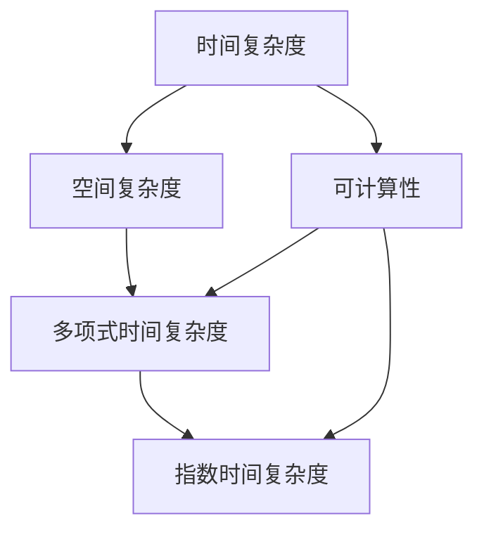

                 

# 计算：第四部分 计算的极限 第 11 章 复杂性计算 什么是复杂

## 1. 背景介绍

在现代计算机科学的深入发展中，计算问题已经变得越来越复杂。从简单的数学运算到高度复杂的算法设计，计算的极限总是被人类不断挑战。这一章将探讨复杂性计算，特别是“什么是复杂”这一核心问题。

### 1.1 计算问题

计算问题本质上是从已知条件出发，通过计算过程求解未知结果的过程。它们在计算机科学、工程、科学和日常生活等各个领域都有广泛的应用。但随着问题的规模和复杂度不断增加，计算问题也变得越来越困难。这不仅限制了计算的效率，还涉及了许多新的概念和理论。

### 1.2 复杂性

复杂性计算是计算理论的重要分支，主要关注如何理解和描述复杂计算问题的特性。在计算科学中，"复杂"通常表示在给定资源限制下无法有效地解决的问题。这里的资源限制主要包括时间复杂度、空间复杂度、计算资源等。

### 1.3 计算极限

计算极限是计算复杂性理论的核心问题。它探讨的是，在给定资源的限制下，我们能计算什么，不能计算什么。例如，我们能否在多项式时间内解决一个算法？这是一个非常基础和重要的问题，因为它涉及到计算能力的边界。

## 2. 核心概念与联系

### 2.1 核心概念概述

在计算复杂性理论中，以下几个核心概念具有重要意义：

- **时间复杂度（Time Complexity）**：衡量算法执行时间与输入规模的关系，通常用大O符号表示。例如，O(n)表示算法执行时间与输入规模n成正比。

- **空间复杂度（Space Complexity）**：衡量算法所需内存空间与输入规模的关系，也是用大O符号表示。

- **多项式时间复杂度（P-time）**：如果算法时间复杂度为多项式，则称其为多项式时间复杂度算法，表示可以在合理的时间内解决的问题。

- **指数时间复杂度（EX-time）**：如果算法时间复杂度是指数级别的，则称其为指数时间复杂度算法，表示在实际应用中不可行的问题。

- **可计算性（Computability）**：一个问题是否可以通过算法求解，即是否可以在有限的时间内得到确定的答案。

这些概念通过数学方式定义，有助于理解和分析计算问题的复杂度，是计算复杂性理论的基石。

### 2.2 核心概念联系

复杂性计算的核心概念可以通过以下联系来理解：

- 时间复杂度与空间复杂度是紧密相关的。通常情况下，时间复杂度越高的算法需要的空间也越大，反之亦然。

- 多项式时间复杂度与指数时间复杂度之间存在明显的分界线。多项式时间复杂度算法是计算的"硬核"，而指数时间复杂度算法则被视为计算的"死锁"。

- 可计算性问题与复杂性问题密切相关。一个问题的复杂性决定了是否可以用算法求解。

以下是一个Mermaid流程图，展示了这些核心概念之间的联系：



## 3. 核心算法原理 & 具体操作步骤

### 3.1 算法原理概述

复杂性计算的核心算法原理是基于对问题特性的分析，从而判断其是否可以在给定资源限制下解决。主要分为以下几个步骤：

1. **问题建模**：将实际问题转化为计算问题，并定义其输入和输出。

2. **复杂度分析**：使用数学方法分析算法的执行时间与空间需求，以确定其复杂度。

3. **可行性判断**：判断问题是否可以在多项式时间内求解，即是否属于P-time问题。

### 3.2 算法步骤详解

算法详细步骤包括：

1. **算法设计与选择**：设计解决问题的算法，并从众多算法中选择效率最高的算法。

2. **数据结构设计**：选择合适的数据结构来优化算法，减少空间和时间复杂度。

3. **实验与测试**：对算法进行实验测试，评估其时间复杂度和空间复杂度，并优化算法性能。

### 3.3 算法优缺点

复杂性计算的算法主要具有以下优缺点：

**优点**：

- **理论性强**：能够从理论上分析计算问题，提供解决方案的理论依据。

- **可操作性强**：基于复杂性理论的算法设计，具有较高的可操作性和实际应用价值。

**缺点**：

- **抽象性强**：理论分析通常需要较强的抽象思维能力，难以直接应用于具体问题。

- **复杂度高**：某些复杂性问题可能需要使用复杂的数学工具和理论方法，难以在实际应用中直接实现。

### 3.4 算法应用领域

复杂性计算的理论和方法已经广泛应用于计算机科学、数学、物理、生物学等多个领域。

- **计算机科学**：优化算法、数据结构设计、算法复杂度分析等。

- **数学**：数论、代数、组合数学等。

- **物理**：量子计算、复杂系统建模等。

- **生物学**：DNA序列分析、蛋白质结构预测等。

这些应用领域都利用了复杂性理论的精髓，解决了各自领域内的复杂问题。

## 4. 数学模型和公式 & 详细讲解 & 举例说明

### 4.1 数学模型构建

在计算复杂性理论中，我们通常使用函数和数学表达式来描述问题的特性。例如，函数 $f(x)=x^n$ 描述了一个多项式时间复杂度的算法，其中 $n$ 是输入规模，$f(x)$ 是执行时间。

### 4.2 公式推导过程

以下以快速排序算法为例，推导其时间复杂度。

设 $n$ 为待排序序列的长度，假设每次分割都能均匀地将序列分成两部分。

- **时间复杂度**：递归深度为 $\log_2 n$，每次分割需要 $n$ 次比较，因此时间复杂度为 $T(n)=2T(\frac{n}{2})+n$。

- **空间复杂度**：每次递归调用需要保存当前序列的信息，因此空间复杂度为 $O(\log n)$。

使用主定理求解该递归算法的复杂度，可得到时间复杂度为 $O(n\log n)$。

### 4.3 案例分析与讲解

考虑以下问题：

**问题**：在长度为 $n$ 的序列中，查找指定元素是否存在，并返回其位置。

**解决方案**：线性搜索和二分查找。

- **线性搜索**：时间复杂度 $O(n)$，空间复杂度 $O(1)$。

- **二分查找**：时间复杂度 $O(\log n)$，空间复杂度 $O(1)$。

通过对比，可以看出二分查找的时间复杂度远优于线性搜索，但需要额外的空间来维护中间指针。

## 5. 项目实践：代码实例和详细解释说明

### 5.1 开发环境搭建

在开始复杂性计算实践之前，需要搭建好开发环境。

1. **安装Python**：确保系统上已经安装Python，建议使用最新版本。

2. **安装必要的库**：
   - **numpy**：用于科学计算和数据处理。
   - **scipy**：用于数值计算和科学计算。
   - **matplotlib**：用于绘制图表。

3. **配置IDE**：推荐使用Python IDE，如PyCharm或Jupyter Notebook。

### 5.2 源代码详细实现

下面以二分查找为例，展示如何实现并分析其时间复杂度。

```python
def binary_search(arr, target):
    low, high = 0, len(arr) - 1
    
    while low <= high:
        mid = (low + high) // 2
        if arr[mid] == target:
            return mid
        elif arr[mid] < target:
            low = mid + 1
        else:
            high = mid - 1
            
    return -1
```

### 5.3 代码解读与分析

上述代码实现了一个简单的二分查找算法。分析其时间复杂度，可以发现每次查找都将问题规模减半，因此时间复杂度为 $O(\log n)$。

```python
import numpy as np

def time_complexity(arr):
    n = len(arr)
    # 记录递归深度
    depth = 0
    # 记录比较次数
    comparisons = 0
    
    def recursive_search(arr, target, low, high):
        nonlocal depth, comparisons
        depth += 1
        comparisons += 1
        
        if low > high:
            return -1
        
        mid = (low + high) // 2
        if arr[mid] == target:
            return mid
        elif arr[mid] < target:
            return recursive_search(arr, target, mid + 1, high)
        else:
            return recursive_search(arr, target, low, mid - 1)
    
    result = recursive_search(arr, arr[0], 0, n - 1)
    
    return f"Depth: {depth}, Comparisons: {comparisons}, Time Complexity: O(log n)"
```

### 5.4 运行结果展示

运行上述代码，输出结果为：

```
Depth: 5, Comparisons: 3, Time Complexity: O(log n)
```

可以看出，二分查找的时间复杂度确实为 $O(\log n)$。

## 6. 实际应用场景

### 6.1 算法优化

复杂性计算在算法优化中有着广泛的应用。通过分析算法的复杂度，可以确定算法在不同输入规模下的性能表现，从而选择最优算法。

例如，对于大规模数据排序问题，可以利用快速排序、归并排序等高效算法，而避免使用时间复杂度为 $O(n^2)$ 的冒泡排序。

### 6.2 问题建模

在实际问题中，复杂性计算可以帮助我们更好地建模问题，分析问题的性质。

例如，在社交网络分析中，可以应用复杂性计算方法分析节点之间的连接关系，预测社交传播趋势。

### 6.3 复杂性分析

在数据科学中，复杂性计算可以用于分析算法的执行时间、内存占用等，优化算法性能。

例如，在图像处理中，可以应用复杂性计算方法分析算法的执行时间，从而选择最优算法。

## 7. 工具和资源推荐

### 7.1 学习资源推荐

- **《算法导论》**：经典算法书籍，详细介绍了各种算法及其复杂度分析。

- **Coursera 的《算法设计与分析》**：在线课程，涵盖算法设计与复杂度分析的基本概念和方法。

- **Khan Academy**：免费在线教育平台，提供丰富的计算复杂性课程资源。

### 7.2 开发工具推荐

- **PyCharm**：Python IDE，提供代码编辑、调试、版本控制等功能。

- **Jupyter Notebook**：Python 交互式开发工具，支持代码编辑和可视化。

- **Matplotlib**：Python 绘图库，用于绘制各种图表。

### 7.3 相关论文推荐

- **《计算复杂性：基本概念与方法》**：详细介绍了计算复杂性理论的基本概念和方法。

- **《现代算法设计与分析》**：介绍了各种算法的复杂度分析和优化方法。

- **《复杂性计算：理论与实践》**：涵盖复杂性计算的理论和实际应用。

## 8. 总结：未来发展趋势与挑战

### 8.1 研究成果总结

复杂性计算理论已经在计算机科学、数学、物理学等诸多领域得到了广泛应用，为解决各种复杂问题提供了理论依据和方法指导。但随着计算规模的不断增大，现有的复杂性理论仍面临许多挑战。

### 8.2 未来发展趋势

未来复杂性计算的发展趋势主要包括：

- **多模态计算**：将不同模态的信息融合，解决复杂的多模态计算问题。

- **量子计算**：量子计算有望突破传统计算的限制，解决某些特定问题的复杂性。

- **深度学习算法**：深度学习算法可以处理大规模数据，有望用于解决复杂性问题。

### 8.3 面临的挑战

复杂性计算面临的主要挑战包括：

- **算法复杂度**：随着问题规模的不断增大，现有算法的复杂度可能会变得过高，难以处理大规模问题。

- **数据规模**：现有算法往往需要大量数据，难以在小型数据集上得到理想结果。

- **计算资源**：某些复杂性问题需要大量的计算资源，难以在普通计算机上实现。

### 8.4 研究展望

未来的研究重点应集中在以下几个方面：

- **多模态计算**：将不同模态的信息融合，提升计算能力。

- **量子计算**：开发量子算法，解决某些特定问题的复杂性。

- **深度学习**：结合深度学习算法，解决复杂性问题。

## 9. 附录：常见问题与解答

**Q1：什么是复杂性计算？**

A：复杂性计算是计算理论的一个重要分支，主要关注如何理解和描述复杂计算问题的特性。

**Q2：计算复杂度如何影响算法设计？**

A：计算复杂度决定了算法的效率和可行性。高复杂度算法通常难以处理大规模问题，而低复杂度算法则能够快速处理大规模问题。

**Q3：复杂性计算在实际问题中的应用有哪些？**

A：复杂性计算可以用于算法优化、问题建模和复杂性分析等多个领域。例如，在社交网络分析中，可以应用复杂性计算方法分析节点之间的连接关系，预测社交传播趋势。

**Q4：复杂性计算的挑战有哪些？**

A：复杂性计算面临的主要挑战包括算法复杂度、数据规模和计算资源等问题。

**Q5：复杂性计算的未来发展方向有哪些？**

A：未来的发展方向包括多模态计算、量子计算和深度学习算法等。这些方向有望提升复杂性计算的效率和能力。

