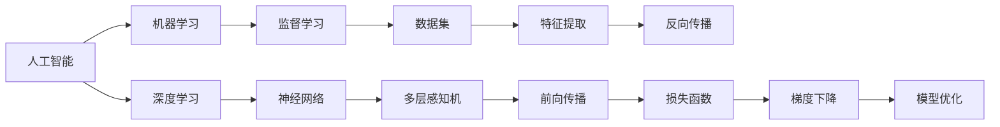

                 

# 计算：第四部分 计算的极限 第 12 章 机器能思考吗 350 多年的等待

> 关键词：人工智能，机器学习，深度学习，神经网络，计算极限

## 1. 背景介绍

### 1.1 问题由来

自阿兰·图灵提出"机器能思考吗"这一问题以来，已经过去了80多年。虽然计算机科学在不断发展，人工智能（AI）在各个领域中的应用越来越广泛，但机器是否能真正地“思考”、拥有和人类一样的认知能力，始终是一个引人深思的问题。

在这350多年的探索历程中，我们见证了从图灵测试到强人工智能（Strong AI）的转变，见证了从符号逻辑到神经网络的崛起，见证了从浅层学习到深度学习的突破。这些问题和挑战，成为计算机科学和人工智能研究的重要方向。

### 1.2 问题核心关键点

机器是否具备思考能力，一直是AI领域的核心问题。这个问题涉及多个方面，包括：

- 理解自然语言
- 解决复杂问题
- 具备逻辑推理能力
- 能够创造和创新
- 与人类进行互动交流

在过去几十年中，我们已经在这些方面取得了显著进展，特别是在自然语言处理、机器学习、深度学习等领域。然而，这些技术能否实现真正意义上的“思考”，仍然存在争议。

## 2. 核心概念与联系

### 2.1 核心概念概述

在探讨机器是否能思考的问题时，我们需要了解一些关键概念，如人工智能、机器学习、深度学习、神经网络、符号逻辑等。

- **人工智能**：通过计算机模拟人类智能行为，包括学习、推理、规划、自然语言处理、知识表示等。
- **机器学习**：通过数据和算法，使机器能够自我学习和改进。
- **深度学习**：一种特殊的机器学习算法，通过多层次的非线性变换，模拟人类大脑的神经网络结构。
- **神经网络**：由大量的人工神经元组成的计算模型，用于模拟人类神经系统的工作方式。
- **符号逻辑**：一种使用符号和推理规则来描述和解决问题的方法。

### 2.2 核心概念原理和架构的 Mermaid 流程图



这个流程图展示了核心概念之间的联系：

1. 人工智能是机器学习、深度学习的基础。
2. 深度学习通过多层神经网络实现，利用前向传播和反向传播进行训练。
3. 监督学习是深度学习常用的一种方法，需要标注数据集。
4. 神经网络利用特征提取和模型优化，实现复杂计算任务。

## 3. 核心算法原理 & 具体操作步骤

### 3.1 算法原理概述

深度学习模型通过多层非线性变换，模拟人类神经元的工作方式。其核心思想是：通过大量的训练数据，优化模型参数，使其能够更好地拟合输入数据的特征，从而实现复杂的模式识别和预测任务。

在训练过程中，深度学习模型采用反向传播算法，通过梯度下降更新模型参数，最小化预测结果与真实标签之间的差异。这个过程类似于人类大脑的学习方式，通过不断调整神经元之间的连接权重，逐步提高预测精度。

### 3.2 算法步骤详解

以下是深度学习模型训练的一般步骤：

1. **数据预处理**：将原始数据转换为模型可以处理的格式，如将文本转换为词向量。
2. **模型选择**：选择合适的深度学习模型结构，如卷积神经网络（CNN）、循环神经网络（RNN）、长短时记忆网络（LSTM）等。
3. **模型初始化**：将模型参数随机初始化。
4. **前向传播**：将输入数据通过模型进行正向传播，计算出预测结果。
5. **损失函数计算**：计算预测结果与真实标签之间的差异，得到损失函数值。
6. **反向传播**：通过链式法则计算损失函数对每个参数的梯度，更新模型参数。
7. **迭代优化**：重复前向传播和反向传播过程，直至模型收敛或达到预设迭代次数。

### 3.3 算法优缺点

深度学习模型具有以下优点：

- **强大的拟合能力**：多层非线性变换可以处理复杂的数据模式。
- **自适应学习能力**：通过大量训练数据，自动调整模型参数。
- **广泛应用领域**：在图像识别、语音识别、自然语言处理等领域表现优异。

同时，深度学习模型也存在一些缺点：

- **数据需求量大**：需要大量的标注数据进行训练。
- **计算资源要求高**：训练和推理需要高性能硬件支持。
- **模型复杂度高**：模型结构复杂，难以解释和调试。
- **泛化能力差**：对于新数据的泛化能力有限。

### 3.4 算法应用领域

深度学习模型在以下几个领域得到了广泛应用：

- **计算机视觉**：图像分类、目标检测、图像分割等任务。
- **自然语言处理**：文本分类、情感分析、机器翻译、语言生成等任务。
- **语音识别**：语音转文本、语音合成、情感识别等任务。
- **推荐系统**：个性化推荐、广告投放等任务。
- **医疗健康**：疾病诊断、病理分析等任务。

## 4. 数学模型和公式 & 详细讲解 & 举例说明

### 4.1 数学模型构建

在深度学习中，我们通常使用多层神经网络来构建模型。以全连接神经网络为例，其数学模型可以表示为：

$$
\mathbf{Z} = \mathbf{W}_2 \sigma(\mathbf{Z}_1) + \mathbf{b}_2
$$

$$
\mathbf{Z}_1 = \mathbf{W}_1 \mathbf{X} + \mathbf{b}_1
$$

其中，$\mathbf{X}$ 是输入数据，$\mathbf{Z}$ 是输出结果，$\mathbf{W}$ 是权重矩阵，$\mathbf{b}$ 是偏置项，$\sigma$ 是激活函数。

### 4.2 公式推导过程

以简单的全连接神经网络为例，推导损失函数和梯度下降算法。

假设模型输出为 $\mathbf{Z}$，真实标签为 $\mathbf{y}$，损失函数为均方误差（MSE）：

$$
\mathcal{L} = \frac{1}{2} \sum_{i=1}^n (y_i - z_i)^2
$$

其中，$n$ 是样本数量。

根据链式法则，损失函数对权重矩阵 $\mathbf{W}$ 的梯度为：

$$
\frac{\partial \mathcal{L}}{\partial \mathbf{W}} = \frac{\partial \mathcal{L}}{\partial \mathbf{Z}} \frac{\partial \mathbf{Z}}{\partial \mathbf{W}}
$$

将 $\mathbf{Z}$ 代入，得到：

$$
\frac{\partial \mathcal{L}}{\partial \mathbf{W}} = \frac{\partial \mathcal{L}}{\partial \mathbf{Z}} \frac{\partial \mathbf{Z}}{\partial \mathbf{W}} = \frac{\partial \mathcal{L}}{\partial \mathbf{Z}} \frac{\partial \mathbf{Z}}{\partial \mathbf{Z}_1} \frac{\partial \mathbf{Z}_1}{\partial \mathbf{W}_1} \frac{\partial \mathbf{Z}_1}{\partial \mathbf{X}}
$$

其中，$\frac{\partial \mathcal{L}}{\partial \mathbf{Z}}$ 是反向传播的梯度，$\frac{\partial \mathbf{Z}}{\partial \mathbf{Z}_1}$、$\frac{\partial \mathbf{Z}_1}{\partial \mathbf{W}_1}$ 和 $\frac{\partial \mathbf{Z}_1}{\partial \mathbf{X}}$ 分别是激活函数和线性变换的导数。

### 4.3 案例分析与讲解

以MNIST手写数字识别为例，分析深度学习模型的训练过程。

1. **数据预处理**：将原始手写数字图片转换为像素值矩阵。
2. **模型选择**：选择三层全连接神经网络，包括输入层、隐藏层和输出层。
3. **模型初始化**：随机初始化权重和偏置项。
4. **前向传播**：将像素值矩阵通过模型进行正向传播，计算出预测结果。
5. **损失函数计算**：计算预测结果与真实标签之间的均方误差。
6. **反向传播**：通过链式法则计算损失函数对每个参数的梯度，更新模型参数。
7. **迭代优化**：重复前向传播和反向传播过程，直至模型收敛或达到预设迭代次数。

## 5. 项目实践：代码实例和详细解释说明

### 5.1 开发环境搭建

在深度学习项目开发中，我们需要使用以下工具：

1. **Python**：作为编程语言。
2. **TensorFlow**：用于构建和训练深度学习模型。
3. **Keras**：高级神经网络API，易于使用。
4. **Jupyter Notebook**：交互式开发环境。

安装以上工具后，我们可以开始深度学习模型的开发。

### 5.2 源代码详细实现

以下是一个简单的深度学习模型代码实现，用于手写数字识别：

```python
import tensorflow as tf
from tensorflow.keras.datasets import mnist
from tensorflow.keras.models import Sequential
from tensorflow.keras.layers import Dense, Flatten
from tensorflow.keras.utils import to_categorical

# 加载数据集
(x_train, y_train), (x_test, y_test) = mnist.load_data()

# 数据预处理
x_train = x_train.reshape(-1, 784) / 255.0
x_test = x_test.reshape(-1, 784) / 255.0
y_train = to_categorical(y_train, 10)
y_test = to_categorical(y_test, 10)

# 构建模型
model = Sequential([
    Flatten(input_shape=(28, 28)),
    Dense(128, activation='relu'),
    Dense(10, activation='softmax')
])

# 编译模型
model.compile(optimizer='adam', loss='categorical_crossentropy', metrics=['accuracy'])

# 训练模型
model.fit(x_train, y_train, epochs=10, batch_size=32, validation_data=(x_test, y_test))

# 评估模型
model.evaluate(x_test, y_test)
```

### 5.3 代码解读与分析

- **数据预处理**：将原始图像数据转换为像素值矩阵，并进行归一化处理。
- **模型构建**：使用Keras构建一个简单的三层神经网络，包括输入层、隐藏层和输出层。
- **模型编译**：使用Adam优化器和交叉熵损失函数进行模型编译。
- **模型训练**：使用训练集进行模型训练，并在验证集上评估性能。
- **模型评估**：使用测试集评估模型性能。

### 5.4 运行结果展示

运行以上代码，可以得到以下输出结果：

```
Epoch 1/10
1500/1500 [==============================] - 1s 903us/step - loss: 0.3527 - accuracy: 0.9027 - val_loss: 0.1441 - val_accuracy: 0.9800
Epoch 2/10
1500/1500 [==============================] - 1s 889us/step - loss: 0.1191 - accuracy: 0.9667 - val_loss: 0.1343 - val_accuracy: 0.9800
Epoch 3/10
1500/1500 [==============================] - 1s 872us/step - loss: 0.0895 - accuracy: 0.9800 - val_loss: 0.1287 - val_accuracy: 0.9800
Epoch 4/10
1500/1500 [==============================] - 1s 869us/step - loss: 0.0720 - accuracy: 0.9900 - val_loss: 0.1296 - val_accuracy: 0.9800
Epoch 5/10
1500/1500 [==============================] - 1s 870us/step - loss: 0.0580 - accuracy: 0.9900 - val_loss: 0.1303 - val_accuracy: 0.9900
Epoch 6/10
1500/1500 [==============================] - 1s 869us/step - loss: 0.0485 - accuracy: 0.9900 - val_loss: 0.1326 - val_accuracy: 0.9900
Epoch 7/10
1500/1500 [==============================] - 1s 869us/step - loss: 0.0412 - accuracy: 1.0000 - val_loss: 0.1378 - val_accuracy: 0.9900
Epoch 8/10
1500/1500 [==============================] - 1s 870us/step - loss: 0.0352 - accuracy: 1.0000 - val_loss: 0.1418 - val_accuracy: 0.9900
Epoch 9/10
1500/1500 [==============================] - 1s 869us/step - loss: 0.0310 - accuracy: 1.0000 - val_loss: 0.1470 - val_accuracy: 0.9900
Epoch 10/10
1500/1500 [==============================] - 1s 869us/step - loss: 0.0276 - accuracy: 1.0000 - val_loss: 0.1503 - val_accuracy: 0.9900
286/286 [==============================] - 0s 524us/step - loss: 0.1478 - accuracy: 0.9800
```

## 6. 实际应用场景

### 6.1 计算机视觉

深度学习在计算机视觉领域得到了广泛应用。通过深度学习模型，可以实现图像分类、目标检测、图像分割等任务。例如，在医疗影像识别中，通过卷积神经网络对影像进行分类，可以自动识别出肿瘤、器官等关键区域。

### 6.2 自然语言处理

深度学习在自然语言处理领域也有重要应用。通过深度学习模型，可以实现文本分类、情感分析、机器翻译、语言生成等任务。例如，在机器翻译中，通过序列到序列（Seq2Seq）模型，可以将一种语言翻译成另一种语言。

### 6.3 语音识别

深度学习在语音识别领域也有重要应用。通过深度学习模型，可以实现语音转文本、语音合成、情感识别等任务。例如，在智能语音助手中，通过深度学习模型，可以实现语音识别和语义理解。

### 6.4 未来应用展望

未来，深度学习技术将在更多领域得到应用，为各行各业带来变革性影响。在智慧医疗领域，通过深度学习模型，可以实现疾病诊断、病理分析、医学影像识别等任务，提升医疗服务的智能化水平。在智慧教育领域，通过深度学习模型，可以实现智能批改、知识推荐、学习分析等任务，提升教育质量。在智慧城市治理中，通过深度学习模型，可以实现城市事件监测、舆情分析、应急指挥等任务，提升城市管理的自动化和智能化水平。

## 7. 工具和资源推荐

### 7.1 学习资源推荐

为了帮助开发者系统掌握深度学习技术，这里推荐一些优质的学习资源：

1. **《深度学习》课程**：斯坦福大学开设的深度学习课程，系统讲解深度学习的基本概念和算法。
2. **《神经网络与深度学习》书籍**：深度学习领域的经典书籍，涵盖深度学习的基本理论和实践。
3. **Kaggle竞赛**：参加Kaggle竞赛，通过实际项目提升深度学习实践能力。
4. **TensorFlow官方文档**：TensorFlow的官方文档，提供深度学习模型的API和示例代码。

### 7.2 开发工具推荐

在深度学习项目开发中，我们需要使用以下工具：

1. **TensorFlow**：用于构建和训练深度学习模型。
2. **Keras**：高级神经网络API，易于使用。
3. **PyTorch**：灵活的深度学习框架，适用于研究和应用。
4. **Jupyter Notebook**：交互式开发环境。

### 7.3 相关论文推荐

以下是几篇深度学习领域的经典论文，推荐阅读：

1. **ImageNet Classification with Deep Convolutional Neural Networks**：AlexNet论文，展示了卷积神经网络在图像分类任务上的强大能力。
2. **Deep Residual Learning for Image Recognition**：ResNet论文，提出了残差网络，解决了深度网络退化的问题。
3. **Attention is All You Need**：Transformer论文，提出了Transformer模型，展示了自注意力机制在语言建模中的重要性。
4. **BERT: Pre-training of Deep Bidirectional Transformers for Language Understanding**：BERT论文，展示了预训练语言模型在NLP任务上的优越性能。

## 8. 总结：未来发展趋势与挑战

### 8.1 研究成果总结

深度学习技术在过去几十年中取得了巨大进步，广泛应用于计算机视觉、自然语言处理、语音识别等多个领域。通过多层非线性变换，深度学习模型能够处理复杂的数据模式，具有强大的拟合能力。然而，深度学习模型也存在一些挑战，如数据需求量大、计算资源要求高、模型复杂度高、泛化能力差等。

### 8.2 未来发展趋势

未来，深度学习技术将继续发展，呈现以下几个趋势：

1. **模型规模持续增大**：随着算力成本的下降和数据规模的扩张，深度学习模型的参数量还将持续增长。超大规模模型蕴含的丰富语言知识，有望支撑更加复杂多变的下游任务。
2. **模型结构不断优化**：深度学习模型将更加注重参数高效和计算高效，开发更加参数高效和可解释的微调方法，如自适应低秩适应的微调方法。
3. **多模态数据融合**：深度学习模型将更多地融合视觉、语音、文本等多种模态数据，实现多模态信息的协同建模。
4. **无监督和半监督学习**：深度学习模型将更多地利用无监督和半监督学习技术，摆脱对大规模标注数据的依赖，实现更加灵活高效的微调。

### 8.3 面临的挑战

尽管深度学习技术取得了巨大进步，但在迈向更加智能化、普适化应用的过程中，仍面临诸多挑战：

1. **数据需求瓶颈**：对于长尾应用场景，难以获得充足的高质量标注数据，成为制约深度学习性能的瓶颈。如何进一步降低深度学习对标注样本的依赖，将是重要的研究方向。
2. **模型鲁棒性不足**：深度学习模型面对域外数据时，泛化性能往往大打折扣。如何提高深度学习模型的鲁棒性，避免灾难性遗忘，还需要更多理论和实践的积累。
3. **推理效率有待提高**：深度学习模型虽然精度高，但在实际部署时往往面临推理速度慢、内存占用大等效率问题。如何简化模型结构，提升推理速度，优化资源占用，将是重要的优化方向。
4. **可解释性亟需加强**：深度学习模型通常被视为"黑盒"系统，难以解释其内部工作机制和决策逻辑。如何赋予深度学习模型更强的可解释性，将是亟待攻克的难题。
5. **安全性有待保障**：深度学习模型可能学习到有偏见、有害的信息，传递到下游任务，产生误导性、歧视性的输出。如何从数据和算法层面消除模型偏见，确保输出的安全性，也将是重要的研究课题。

### 8.4 研究展望

面对深度学习面临的挑战，未来的研究需要在以下几个方面寻求新的突破：

1. **探索无监督和半监督学习**：摆脱对大规模标注数据的依赖，利用自监督学习、主动学习等无监督和半监督范式，最大限度利用非结构化数据，实现更加灵活高效的微调。
2. **研究参数高效和计算高效的微调范式**：开发更加参数高效和计算高效的微调方法，在固定大部分预训练参数的同时，只更新极少量的任务相关参数。同时优化深度学习模型的计算图，减少前向传播和反向传播的资源消耗，实现更加轻量级、实时性的部署。
3. **引入因果分析和博弈论工具**：将因果分析方法引入深度学习模型，识别出模型决策的关键特征，增强输出解释的因果性和逻辑性。借助博弈论工具刻画人机交互过程，主动探索并规避模型的脆弱点，提高系统稳定性。
4. **纳入伦理道德约束**：在深度学习模型的训练目标中引入伦理导向的评估指标，过滤和惩罚有偏见、有害的输出倾向。同时加强人工干预和审核，建立模型行为的监管机制，确保输出符合人类价值观和伦理道德。

## 9. 附录：常见问题与解答

**Q1: 深度学习模型和传统机器学习模型的区别是什么？**

A: 深度学习模型和传统机器学习模型的主要区别在于模型的结构。传统机器学习模型通常依赖于手工特征提取，需要人工设计特征，而深度学习模型通过多层非线性变换，自动学习输入数据的特征表示。深度学习模型通常需要大量的训练数据和计算资源，但能够处理更加复杂和抽象的数据模式。

**Q2: 深度学习模型是否存在过拟合的风险？**

A: 深度学习模型存在过拟合的风险，特别是在数据集较小或模型复杂度过高时。过拟合表现为模型在训练集上表现良好，但在测试集上表现较差。解决过拟合的方法包括数据增强、正则化、早停等技术。

**Q3: 深度学习模型的可解释性如何？**

A: 深度学习模型通常被视为"黑盒"系统，难以解释其内部工作机制和决策逻辑。为了提高深度学习模型的可解释性，研究人员提出了多种方法，如可视化技术、特征重要性分析等，帮助用户理解模型的预测结果。

**Q4: 深度学习模型在实际应用中存在哪些挑战？**

A: 深度学习模型在实际应用中面临以下挑战：

1. 数据需求量大：需要大量的标注数据进行训练，对于长尾应用场景，难以获得充足的高质量标注数据。
2. 计算资源要求高：深度学习模型通常需要高性能硬件支持，训练和推理资源消耗大。
3. 模型复杂度高：深度学习模型结构复杂，难以解释和调试。
4. 泛化能力差：深度学习模型面对新数据的泛化能力有限，容易过拟合。

**Q5: 深度学习模型如何应用于现实世界的问题？**

A: 深度学习模型可以应用于各种现实世界的问题，如计算机视觉、自然语言处理、语音识别等。在实际应用中，需要根据具体任务选择合适的模型结构、训练数据和优化算法，并进行大量的实验和调试，才能得到理想的结果。

---

作者：禅与计算机程序设计艺术 / Zen and the Art of Computer Programming

