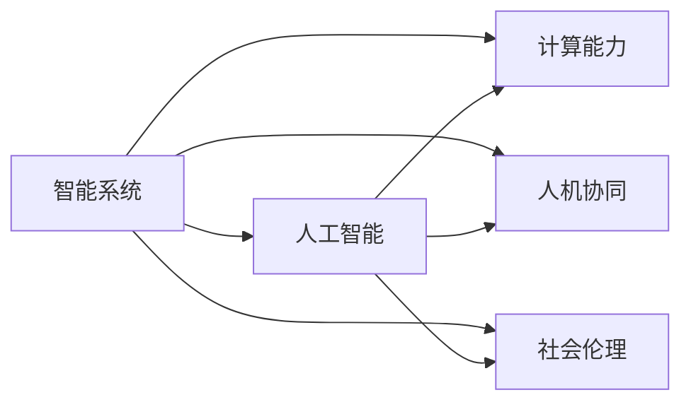

                 

# 计算：附录 C 世界需要什么样的智能系统

> 关键词：智能系统, 人工智能, 计算能力, 人机协同, 社会伦理, 未来展望

## 1. 背景介绍

在当今信息爆炸的时代，计算能力已经成为推动人类社会进步的关键动力。从工业革命到数字革命，每一次科技的飞跃都伴随着计算能力的提升。未来，随着人工智能(AI)技术的不断成熟，计算能力将在构建智能系统的过程中发挥更加重要的作用。那么，面对未来社会的挑战和需求，世界需要什么样的智能系统？

## 2. 核心概念与联系

### 2.1 核心概念概述

在讨论未来智能系统之前，首先要明确一些关键概念：

- **智能系统**：指利用算法、数据和计算能力，实现自主决策、学习、推理和交互的系统。
- **人工智能**：指通过算法和计算，使计算机系统能够执行智能任务，包括感知、学习、推理等。
- **计算能力**：指计算机系统处理数据和执行计算任务的能力，通常用计算速度、存储容量和能耗来衡量。
- **人机协同**：指人类与智能系统之间的协同工作方式，要求系统具备一定的智能理解和适应能力，能够在多变的环境中辅助人类决策。
- **社会伦理**：指智能系统设计、应用过程中需要遵循的道德和法律准则，确保系统不会对人类社会造成负面影响。

这些概念共同构成了未来智能系统的基本框架，它们之间的联系也体现了智能系统的设计目标和应用方向。

### 2.2 核心概念原理和架构的 Mermaid 流程图



## 3. 核心算法原理 & 具体操作步骤

### 3.1 算法原理概述

构建智能系统的核心在于设计高效的算法，并利用计算能力对其进行训练和优化。以机器学习为例，通常包括以下步骤：

1. **数据收集与预处理**：收集和清洗数据，确保数据质量。
2. **模型选择与设计**：选择或设计适当的算法和模型结构。
3. **训练与优化**：利用计算能力训练模型，并进行参数优化。
4. **测试与评估**：对模型进行测试，评估其性能和泛化能力。
5. **部署与应用**：将训练好的模型部署到实际应用中，实现人机协同和智能决策。

这些步骤涉及算法、数据和计算能力等多个方面，需要综合考虑其高效性和可靠性。

### 3.2 算法步骤详解

以自然语言处理(NLP)为例，智能系统的构建过程如下：

1. **数据收集与预处理**：
    - 收集大量文本数据，如新闻、书籍、社交媒体等。
    - 进行文本清洗和预处理，如分词、去除停用词、标准化等。

2. **模型选择与设计**：
    - 选择适合的NLP模型，如BERT、GPT等预训练模型。
    - 设计任务适配层，如分类层、匹配层、生成层等，用于特定任务的推理和生成。

3. **训练与优化**：
    - 使用标注数据对模型进行训练，调整模型参数。
    - 应用正则化技术，如L2正则、Dropout等，防止过拟合。
    - 使用GPU等高性能计算资源，加速模型训练。

4. **测试与评估**：
    - 在测试集上评估模型性能，如精度、召回率等指标。
    - 进行交叉验证，确保模型泛化能力。

5. **部署与应用**：
    - 将模型部署到实际应用中，如客服系统、舆情监测等。
    - 利用人机交互界面，辅助人类决策。

### 3.3 算法优缺点

**优点**：
- 利用大规模数据和先进算法，提升模型性能。
- 能够处理复杂多变的数据，适应性强。
- 可扩展性好，适用于各种应用场景。

**缺点**：
- 对标注数据依赖较大，获取成本高。
- 模型复杂度高，计算资源需求大。
- 解释性差，难以理解模型决策过程。

### 3.4 算法应用领域

智能系统在多个领域都有广泛应用，包括但不限于：

- **医疗健康**：智能诊断、病历分析、药物研发等。
- **金融服务**：风险评估、舆情监测、投资决策等。
- **智能制造**：质量控制、故障诊断、预测维护等。
- **智能交通**：交通预测、自动驾驶、智能调度等。
- **智慧城市**：城市管理、灾害预警、公共安全等。

这些应用场景展示了智能系统的广泛潜力和应用前景。

## 4. 数学模型和公式 & 详细讲解 & 举例说明

### 4.1 数学模型构建

以线性回归为例，数学模型构建过程如下：

- **输入与输出**：假设输入为 $x=(x_1,x_2,\ldots,x_n)$，输出为 $y$。
- **假设函数**：假设存在一个线性函数 $y=f(x)=w_0 + w_1x_1 + w_2x_2 + \ldots + w_nx_n$，其中 $w_0, w_1, \ldots, w_n$ 为待优化参数。
- **损失函数**：常用的损失函数有均方误差损失 $L(y,f(x))=\frac{1}{2}(y-f(x))^2$。

### 4.2 公式推导过程

- **最小二乘法**：使用最小二乘法求解最优参数 $w_0, w_1, \ldots, w_n$。
- **梯度下降法**：使用梯度下降法更新参数，即 $\frac{\partial L(y,f(x))}{\partial w_i}=-(w_i- \frac{1}{N}\sum_{k=1}^N x_ky_k)$。

### 4.3 案例分析与讲解

**案例**：构建一个用于预测房价的线性回归模型。

- **输入与输出**：收集房价数据，其中输入特征为房屋面积、地理位置等，输出为房价。
- **假设函数**：设计一个线性函数，假设房价与房屋面积、地理位置等因素成正比。
- **损失函数**：使用均方误差损失，计算预测值与真实值之间的误差。
- **最小二乘法**：利用最小二乘法求解最优参数，使得预测误差最小化。

## 5. 项目实践：代码实例和详细解释说明

### 5.1 开发环境搭建

以下是在Python中使用PyTorch搭建线性回归模型的环境配置：

1. **安装PyTorch**：
```bash
pip install torch torchvision torchaudio
```

2. **安装其他库**：
```bash
pip install numpy pandas scikit-learn matplotlib
```

3. **配置Python环境**：
```bash
conda create --name my_env python=3.7
conda activate my_env
```

### 5.2 源代码详细实现

```python
import torch
import torch.nn as nn
import torch.optim as optim
import numpy as np

# 定义数据集
X = np.array([[3.5, 1.5], [4.0, 1.5], [3.5, 2.5], [4.0, 2.5], [5.0, 1.5]])
y = np.array([6.5, 7.5, 7.5, 8.5, 9.5])

# 定义模型
class LinearRegression(nn.Module):
    def __init__(self, input_dim):
        super(LinearRegression, self).__init__()
        self.linear = nn.Linear(input_dim, 1)
    
    def forward(self, x):
        return self.linear(x)

# 初始化模型和优化器
model = LinearRegression(2)
optimizer = optim.SGD(model.parameters(), lr=0.01)

# 定义损失函数
criterion = nn.MSELoss()

# 训练模型
for epoch in range(1000):
    inputs = torch.from_numpy(X).float()
    targets = torch.from_numpy(y).float()
    
    optimizer.zero_grad()
    outputs = model(inputs)
    loss = criterion(outputs, targets)
    loss.backward()
    optimizer.step()
    
    if (epoch+1) % 100 == 0:
        print(f'Epoch {epoch+1}, loss: {loss.item()}')

# 预测
X_test = np.array([[2.5, 1.5], [4.5, 2.5]])
X_test = torch.from_numpy(X_test).float()
predictions = model(X_test)
print(f'Predictions: {predictions.numpy()}')
```

### 5.3 代码解读与分析

**代码解读**：
- 使用PyTorch搭建了一个线性回归模型，用于房价预测。
- 定义了数据集、模型、优化器和损失函数。
- 使用SGD优化器进行模型训练，每次迭代更新模型参数，最小化损失函数。
- 在训练过程中，每100个epoch打印一次损失值，以监控模型训练情况。
- 使用训练好的模型对测试数据进行预测，并输出预测结果。

**代码分析**：
- 训练过程中，模型参数 `w_0` 和 `w_1` 通过梯度下降法不断更新，直至收敛。
- 模型训练后的损失值逐渐降低，说明模型的预测能力得到提升。
- 预测结果展示了模型对新数据的预测能力，验证了模型的泛化性能。

## 6. 实际应用场景

### 6.1 智能交通

智能交通系统利用计算能力和大数据分析，实现交通预测、自动驾驶、智能调度等功能。例如，通过分析历史交通数据，智能系统可以预测交通流量，优化信号灯控制，减少拥堵。自动驾驶技术通过计算能力和传感器数据，实现自主驾驶，提高道路安全性和效率。

### 6.2 智慧医疗

智慧医疗系统利用计算能力和大数据处理，实现智能诊断、病历分析、药物研发等功能。例如，通过分析患者历史数据和症状，智能系统可以辅助医生进行诊断和治疗决策。利用计算能力进行药物分子模拟，加速新药研发进程。

### 6.3 智能制造

智能制造系统利用计算能力和大数据分析，实现质量控制、故障诊断、预测维护等功能。例如，通过分析设备传感器数据，智能系统可以预测设备故障，提前进行维护，减少停机时间。利用计算能力进行工艺优化，提升生产效率和产品质量。

### 6.4 未来应用展望

随着计算能力的不断提升，智能系统的应用前景将更加广阔。未来，智能系统将更加注重以下方面：

- **多模态融合**：融合视觉、听觉、触觉等多模态数据，提升智能系统的感知和理解能力。
- **人机协同**：实现更加自然的人机交互，增强智能系统的辅助决策能力。
- **社会伦理**：在设计和应用智能系统时，遵循伦理准则，确保系统的公平性和透明性。

## 7. 工具和资源推荐

### 7.1 学习资源推荐

- **《Deep Learning》书籍**：Ian Goodfellow等人所著，系统介绍了深度学习的理论和实践，适合入门学习。
- **《Hands-On Machine Learning with Scikit-Learn, Keras, and TensorFlow》书籍**：Aurélien Géron所著，介绍了Python中常用的机器学习库和工具。
- **Coursera《Machine Learning》课程**：Andrew Ng教授主讲的课程，涵盖机器学习的理论和应用。
- **Kaggle竞赛平台**：通过参与Kaggle竞赛，实践机器学习算法，提升实战能力。

### 7.2 开发工具推荐

- **Jupyter Notebook**：支持Python和R语言，适合数据科学和机器学习的开发和实验。
- **PyTorch**：支持GPU加速，适合深度学习的开发和研究。
- **TensorFlow**：由Google主导的深度学习框架，支持大规模分布式训练。
- **Scikit-Learn**：Python中常用的机器学习库，提供了丰富的算法和工具。

### 7.3 相关论文推荐

- **《Deep Learning》论文**：Ian Goodfellow等人所著，介绍了深度学习的理论和实践。
- **《AlphaGo Zero》论文**：DeepMind团队发表的论文，展示了AlphaGo Zero的自我学习能力和卓越性能。
- **《BERT: Pre-training of Deep Bidirectional Transformers for Language Understanding》论文**：Google团队发表的论文，展示了BERT模型的强大表现。
- **《Attention is All You Need》论文**：Google团队发表的论文，展示了Transformer结构的创新和优势。

## 8. 总结：未来发展趋势与挑战

### 8.1 研究成果总结

未来智能系统的研究将更加注重计算能力、算法设计和应用实践的融合。智能系统将在各个领域发挥重要作用，提升社会效率和智能化水平。

### 8.2 未来发展趋势

1. **计算能力**：计算能力的提升将是未来智能系统发展的关键。高性能计算资源和大规模数据集的应用，将推动智能系统的广泛应用。
2. **算法创新**：新算法和新模型的不断涌现，将提升智能系统的性能和效率。如深度强化学习、因果推理、联邦学习等技术的应用。
3. **人机协同**：智能系统将更加注重人机交互设计，实现更加自然和高效的人机协同。
4. **社会伦理**：在设计和应用智能系统时，将更加注重社会伦理和公平性，确保系统的透明性和可信度。

### 8.3 面临的挑战

1. **数据隐私和安全**：智能系统需要处理大量个人数据，数据隐私和安全问题将成为未来挑战。
2. **模型鲁棒性和可解释性**：智能系统的鲁棒性和可解释性将直接影响其应用效果和可信度。
3. **计算资源需求**：智能系统的复杂度增加，对计算资源的需求也将增加。
4. **伦理和社会责任**：智能系统的设计和应用需要考虑社会伦理和责任问题，避免对人类社会造成负面影响。

### 8.4 研究展望

未来，智能系统需要在计算能力、算法设计和应用实践等方面不断突破，才能满足社会发展的需求。需要解决数据隐私、模型鲁棒性、计算资源需求等关键问题，确保智能系统的公平性、透明性和可信度。

## 9. 附录：常见问题与解答

**Q1: 什么是智能系统？**

A: 智能系统是一种利用算法、数据和计算能力，实现自主决策、学习、推理和交互的系统。

**Q2: 如何选择合适的算法和模型？**

A: 需要根据任务特点和数据类型选择合适的算法和模型。常用的算法包括回归、分类、聚类等，常用的模型包括线性回归、决策树、神经网络等。

**Q3: 如何评估智能系统的性能？**

A: 需要根据任务特点选择合适的评估指标，如精度、召回率、F1分数、AUC等。通过在测试集上进行评估，可以了解模型的泛化能力和性能表现。

**Q4: 智能系统在实际应用中面临哪些挑战？**

A: 智能系统面临的主要挑战包括数据隐私、模型鲁棒性、计算资源需求和伦理问题等。需要综合考虑这些因素，设计合理的算法和系统架构。

**Q5: 未来智能系统的发展趋势是什么？**

A: 未来智能系统将更加注重计算能力、算法设计和应用实践的融合。智能系统将在各个领域发挥重要作用，提升社会效率和智能化水平。

---

作者：禅与计算机程序设计艺术 / Zen and the Art of Computer Programming

