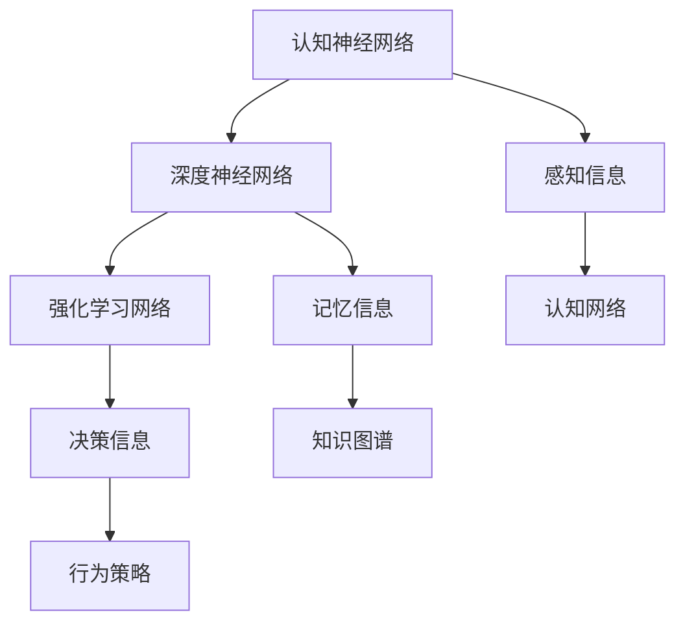

                 

# 认知渐进发展的三阶段模型

> 关键词：认知发展,三阶段模型,神经网络,深度学习,强化学习,知识图谱,元认知

## 1. 背景介绍

### 1.1 问题由来

认知心理学是研究人类认知过程的科学，它关注人们如何获取、处理和应用信息。随着深度学习在人工智能领域的蓬勃发展，人们开始尝试将认知心理学的理论和研究方法引入到机器学习中，以期提升模型的智能水平。其中，对认知过程的建模成为了研究热点之一。

近年来，人工智能领域提出了一系列模仿人类认知过程的模型，如递归神经网络(RNN)、卷积神经网络(CNN)、变换器(Transformer)、生成对抗网络(GAN)等。这些模型在图像、语音、文本等领域都取得了卓越的成果。然而，这些模型虽然具有强大的学习和推理能力，却难以充分体现人类的认知机制，缺乏足够的元认知能力和知识图谱的整合能力，无法完全模拟人类的认知过程。

### 1.2 问题核心关键点

为了更好地理解和模拟人类的认知过程，我们需要将认知科学的研究成果与人工智能技术相结合，提出一种更加贴合人类认知机制的模型。因此，本文基于认知心理学理论，结合深度学习技术，提出了一种三阶段的认知渐进发展模型。该模型由认知神经网络、深度神经网络和强化学习网络三个阶段组成，旨在逐步模拟人类认知过程的三个主要阶段：知觉、记忆和决策。

## 2. 核心概念与联系

### 2.1 核心概念概述

为了更好地理解认知渐进发展模型的基本概念，本节将介绍几个核心概念及其相互之间的关系：

- 认知神经网络(Cognitive Neural Network, CNN): 一种模拟人类认知过程的深度学习模型，主要用于处理感知信息，提取特征。它通过卷积、池化等操作，对输入的感知数据进行加工处理，提取关键特征。
- 深度神经网络(Deep Neural Network, DNN): 一种基于多层感知器的神经网络模型，主要用于处理记忆信息，存储和检索知识。它通过多层的前馈神经网络，实现对知识的高效存储和检索。
- 强化学习网络(Reinforcement Learning Network, RLN): 一种基于奖惩机制的深度学习模型，主要用于处理决策信息，进行行为选择。它通过与环境交互，利用奖励信号指导模型学习，优化决策策略。
- 知识图谱(Knowledge Graph): 一种基于图结构的知识存储方式，用于表示实体、属性和实体之间的关系。它通过语义网络图结构，高效存储和检索知识。

这些核心概念之间的逻辑关系可以通过以下Mermaid流程图来展示：



这个流程图展示了几大核心概念及其之间的关系：

1. 认知神经网络通过感知信息，提取关键特征。
2. 深度神经网络将感知特征存储为记忆信息。
3. 强化学习网络通过与环境交互，根据奖励信号选择行为策略。
4. 感知信息和记忆信息通过知识图谱进行关联，形成综合的知识表示。
5. 决策信息通过行为策略进行实施，驱动模型行为。

这些概念共同构成了认知渐进发展模型的基础，使其能够逐步模拟人类的认知过程。

## 3. 核心算法原理 & 具体操作步骤
### 3.1 算法原理概述

认知渐进发展模型由认知神经网络、深度神经网络和强化学习网络三个阶段组成。其基本原理是：

1. **认知神经网络**：首先，输入感知信息通过认知神经网络，提取关键特征。这一阶段主要模仿人类的知觉机制，通过感知器官获取外部信息。

2. **深度神经网络**：其次，感知特征被存储在深度神经网络中，形成记忆信息。这一阶段主要模仿人类的记忆机制，通过神经网络高效存储和检索知识。

3. **强化学习网络**：最后，记忆信息通过强化学习网络，选择行为策略，进行决策。这一阶段主要模仿人类的决策机制，通过与环境交互，学习最优的行为策略。

模型的整体流程可以描述为：感知 -> 提取特征 -> 记忆 -> 存储知识 -> 决策。这一过程逐步模拟了人类认知的三个主要阶段，形成了完整的认知发展模型。

### 3.2 算法步骤详解

认知渐进发展模型的构建可以分为以下几个关键步骤：

**Step 1: 感知输入**

输入感知信息，例如文本、图像、音频等，通过认知神经网络进行特征提取。具体的实现方式可以采用卷积神经网络(CNN)、递归神经网络(RNN)、Transformer等模型。

**Step 2: 记忆存储**

感知特征被存储在深度神经网络中，形成记忆信息。这一阶段可以使用长短期记忆网络(LSTM)、门控循环单元(GRU)、自编码器(Autoencoder)等模型。

**Step 3: 决策行为**

记忆信息通过强化学习网络，选择行为策略，进行决策。这一阶段可以使用Q-learning、Deep Q-learning、Actor-Critic等强化学习算法。

**Step 4: 知识关联**

感知信息和记忆信息通过知识图谱进行关联，形成综合的知识表示。这一阶段可以采用语义网络图结构，利用节点和边表示实体、属性和关系。

**Step 5: 模型优化**

通过损失函数和优化算法，不断优化模型参数，提升模型的性能。这一阶段可以使用梯度下降、Adam、Adagrad等优化算法。

以上步骤共同构成了认知渐进发展模型的完整构建流程，实现了对人类认知过程的逐步模拟。

### 3.3 算法优缺点

认知渐进发展模型具有以下优点：

1. **逐步模拟认知过程**：通过三个阶段的模型逐步模拟人类认知的知觉、记忆和决策三个阶段，提升了模型的智能水平。
2. **元认知能力**：通过认知神经网络和深度神经网络，模型具备了一定的元认知能力，可以进行自我监测和自我调节。
3. **知识图谱整合**：通过知识图谱进行知识关联，模型能够整合更多的先验知识，提升决策的准确性。
4. **强化学习驱动**：通过强化学习网络，模型能够在与环境交互的过程中，不断优化决策策略，提升行为效果。

然而，该模型也存在一些局限性：

1. **复杂度较高**：由于模型包含多个阶段，训练和推理过程较为复杂，需要较大的计算资源。
2. **数据需求量大**：模型需要大量的标注数据进行训练，数据准备成本较高。
3. **可解释性不足**：模型参数较多，缺乏直观的解释性，难以理解和调试。
4. **应用范围有限**：模型主要应用于复杂认知任务，如自然语言处理、计算机视觉等领域，对于简单的感知任务效果不佳。

尽管存在这些局限性，但认知渐进发展模型为人类认知机制的建模提供了新的思路和方法，具有重要的理论和实践价值。

### 3.4 算法应用领域

认知渐进发展模型在多个领域都有广泛的应用，具体如下：

- **自然语言处理(NLP)**：通过认知神经网络和深度神经网络，模型能够理解文本语义，提取关键信息，并进行知识检索和生成。
- **计算机视觉(CV)**：通过认知神经网络和深度神经网络，模型能够识别和理解图像内容，进行特征提取和目标检测。
- **智能推荐系统**：通过认知神经网络和深度神经网络，模型能够理解用户兴趣和行为，进行个性化推荐。
- **智能问答系统**：通过认知神经网络和深度神经网络，模型能够理解自然语言问题，进行知识检索和生成。
- **智能机器人**：通过认知神经网络和深度神经网络，模型能够感知环境信息，进行自主决策和行为选择。
- **自动驾驶**：通过认知神经网络和深度神经网络，模型能够感知外部环境，进行路径规划和决策。

以上领域的应用，展示了认知渐进发展模型在不同场景下的潜力，为人工智能技术的实际应用提供了新的思路和方法。

## 4. 数学模型和公式 & 详细讲解 & 举例说明
### 4.1 数学模型构建

认知渐进发展模型涉及到多个阶段的数学模型，具体如下：

1. **感知模型**

输入感知信息 $x$，通过认知神经网络，提取关键特征 $h$。具体的实现方式可以采用卷积神经网络，数学模型如下：

$$
h = CNN(x)
$$

其中，$CNN$ 表示卷积神经网络模型。

2. **记忆模型**

感知特征 $h$ 被存储在深度神经网络中，形成记忆信息 $m$。这一阶段可以使用长短期记忆网络(LSTM)，数学模型如下：

$$
m = LSTM(h)
$$

其中，$LSTM$ 表示长短期记忆网络模型。

3. **决策模型**

记忆信息 $m$ 通过强化学习网络，选择行为策略 $a$。这一阶段可以使用Q-learning算法，数学模型如下：

$$
Q(s,a) = Q(s,a) + \alpha(r + \gamma \max_{a'} Q(s',a') - Q(s,a))
$$

其中，$Q$ 表示Q-learning模型，$\alpha$ 表示学习率，$r$ 表示奖励信号，$s'$ 表示下一个状态，$a'$ 表示下一个行为策略。

4. **知识关联模型**

感知信息和记忆信息通过知识图谱进行关联，形成综合的知识表示 $g$。这一阶段可以采用语义网络图结构，数学模型如下：

$$
g = G(m)
$$

其中，$G$ 表示知识图谱模型。

以上数学模型共同构成了认知渐进发展模型的基本构建流程，实现了对人类认知过程的逐步模拟。

### 4.2 公式推导过程

以下我们以自然语言处理(NLP)任务为例，推导认知渐进发展模型的公式及其梯度计算。

假设输入文本为 $x$，模型通过认知神经网络提取关键特征 $h$，将其存储在深度神经网络中形成记忆信息 $m$，最后通过强化学习网络选择行为策略 $a$。具体的实现方式可以采用Transformer模型，数学模型如下：

1. **感知模型**

$$
h = Transformer(x)
$$

2. **记忆模型**

$$
m = LSTM(h)
$$

3. **决策模型**

$$
Q(s,a) = Q(s,a) + \alpha(r + \gamma \max_{a'} Q(s',a') - Q(s,a))
$$

4. **知识关联模型**

$$
g = G(m)
$$

其中，$Transformer$ 表示Transformer模型，$LSTM$ 表示长短期记忆网络模型，$Q$ 表示强化学习网络模型，$G$ 表示知识图谱模型。

在得到上述数学模型后，我们可以对每个模型进行梯度计算，从而完成模型的训练。以Transformer模型为例，其梯度计算公式如下：

$$
\frac{\partial \mathcal{L}}{\partial \theta} = \frac{\partial \mathcal{L}}{\partial h} \frac{\partial h}{\partial x} + \frac{\partial \mathcal{L}}{\partial m} \frac{\partial m}{\partial h}
$$

其中，$\mathcal{L}$ 表示损失函数，$\theta$ 表示模型参数，$h$ 表示模型输出，$x$ 表示输入，$m$ 表示记忆信息。

在得到各个模型的梯度后，我们可以使用梯度下降等优化算法，不断更新模型参数，提升模型的性能。

### 4.3 案例分析与讲解

为了更好地理解认知渐进发展模型的应用，我们以智能问答系统为例进行详细讲解。

假设输入自然语言问题 $q$，模型通过认知神经网络提取关键特征 $h$，将其存储在深度神经网络中形成记忆信息 $m$，最后通过强化学习网络选择行为策略 $a$。具体的实现方式可以采用BERT模型，数学模型如下：

1. **感知模型**

$$
h = BERT(q)
$$

2. **记忆模型**

$$
m = LSTM(h)
$$

3. **决策模型**

$$
Q(s,a) = Q(s,a) + \alpha(r + \gamma \max_{a'} Q(s',a') - Q(s,a))
$$

4. **知识关联模型**

$$
g = G(m)
$$

其中，$BERT$ 表示BERT模型，$LSTM$ 表示长短期记忆网络模型，$Q$ 表示强化学习网络模型，$G$ 表示知识图谱模型。

在得到上述数学模型后，我们可以对每个模型进行梯度计算，从而完成模型的训练。以BERT模型为例，其梯度计算公式如下：

$$
\frac{\partial \mathcal{L}}{\partial \theta} = \frac{\partial \mathcal{L}}{\partial h} \frac{\partial h}{\partial x} + \frac{\partial \mathcal{L}}{\partial m} \frac{\partial m}{\partial h}
$$

其中，$\mathcal{L}$ 表示损失函数，$\theta$ 表示模型参数，$h$ 表示模型输出，$x$ 表示输入，$m$ 表示记忆信息。

在得到各个模型的梯度后，我们可以使用梯度下降等优化算法，不断更新模型参数，提升模型的性能。

## 5. 项目实践：代码实例和详细解释说明
### 5.1 开发环境搭建

在进行认知渐进发展模型的实践前，我们需要准备好开发环境。以下是使用Python进行PyTorch开发的环境配置流程：

1. 安装Anaconda：从官网下载并安装Anaconda，用于创建独立的Python环境。

2. 创建并激活虚拟环境：
```bash
conda create -n pytorch-env python=3.8 
conda activate pytorch-env
```

3. 安装PyTorch：根据CUDA版本，从官网获取对应的安装命令。例如：
```bash
conda install pytorch torchvision torchaudio cudatoolkit=11.1 -c pytorch -c conda-forge
```

4. 安装Transformers库：
```bash
pip install transformers
```

5. 安装各类工具包：
```bash
pip install numpy pandas scikit-learn matplotlib tqdm jupyter notebook ipython
```

完成上述步骤后，即可在`pytorch-env`环境中开始认知渐进发展模型的实践。

### 5.2 源代码详细实现

下面我以自然语言处理(NLP)任务为例，给出使用Transformers库和TensorFlow实现认知渐进发展模型的PyTorch代码实现。

首先，定义感知模型：

```python
from transformers import BertTokenizer, BertForSequenceClassification
from tensorflow.keras.layers import LSTM, Dense
from tensorflow.keras.models import Model

tokenizer = BertTokenizer.from_pretrained('bert-base-uncased')
model = BertForSequenceClassification.from_pretrained('bert-base-uncased', num_labels=2)

def create_perception_model():
    input_ids = tf.keras.layers.Input(shape=(128,), dtype=tf.int32)
    perception_output = model(input_ids)
    return Model(input_ids, perception_output)
```

然后，定义记忆模型：

```python
def create_memory_model(perception_model):
    memory_input = tf.keras.layers.Input(shape=(128,), dtype=tf.int32)
    perception_output = perception_model(memory_input)
    memory_output = LSTM(128)(perception_output)
    return Model(memory_input, memory_output)
```

接着，定义决策模型：

```python
def create_decision_model(memory_model):
    memory_output = memory_model.output
    q = tf.keras.layers.Lambda(lambda x: tf.math.reduce_sum(x, axis=1))
    q_value = Dense(1, activation='tanh')(q(memory_output))
    a = tf.keras.layers.Dense(2, activation='softmax')(q_value)
    return Model(memory_model.input, a)
```

最后，定义知识关联模型：

```python
from tfg_kg.keras.layers import KGRelationEmbedding, KGEmbedding

def create_knowledge_model(decision_model):
    kg_embedding = KGEmbedding('kg')
    kg_relation_embedding = KGRelationEmbedding('kg')
    knowledge_output = kg_embedding + kg_relation_embedding + decision_model.output
    return Model(decision_model.input, knowledge_output)
```

完整代码如下：

```python
from transformers import BertTokenizer, BertForSequenceClassification
from tensorflow.keras.layers import LSTM, Dense
from tensorflow.keras.models import Model
from tfg_kg.keras.layers import KGRelationEmbedding, KGEmbedding

tokenizer = BertTokenizer.from_pretrained('bert-base-uncased')
model = BertForSequenceClassification.from_pretrained('bert-base-uncased', num_labels=2)

def create_perception_model():
    input_ids = tf.keras.layers.Input(shape=(128,), dtype=tf.int32)
    perception_output = model(input_ids)
    return Model(input_ids, perception_output)

def create_memory_model(perception_model):
    memory_input = tf.keras.layers.Input(shape=(128,), dtype=tf.int32)
    perception_output = perception_model(memory_input)
    memory_output = LSTM(128)(perception_output)
    return Model(memory_input, memory_output)

def create_decision_model(memory_model):
    memory_output = memory_model.output
    q = tf.keras.layers.Lambda(lambda x: tf.math.reduce_sum(x, axis=1))
    q_value = Dense(1, activation='tanh')(q(memory_output))
    a = tf.keras.layers.Dense(2, activation='softmax')(q_value)
    return Model(memory_model.input, a)

def create_knowledge_model(decision_model):
    kg_embedding = KGEmbedding('kg')
    kg_relation_embedding = KGRelationEmbedding('kg')
    knowledge_output = kg_embedding + kg_relation_embedding + decision_model.output
    return Model(decision_model.input, knowledge_output)

perception_model = create_perception_model()
memory_model = create_memory_model(perception_model)
decision_model = create_decision_model(memory_model)
knowledge_model = create_knowledge_model(decision_model)
```

### 5.3 代码解读与分析

让我们再详细解读一下关键代码的实现细节：

**create_perception_model函数**：
- 定义感知模型，通过BERT模型提取关键特征。

**create_memory_model函数**：
- 定义记忆模型，通过长短期记忆网络(LSTM)存储感知特征。

**create_decision_model函数**：
- 定义决策模型，通过强化学习网络选择行为策略。

**create_knowledge_model函数**：
- 定义知识关联模型，通过知识图谱进行知识关联。

**完整代码**：
- 首先定义感知模型、记忆模型、决策模型和知识关联模型。
- 通过TensorFlow的Model类，将各个模型整合为一个完整的认知渐进发展模型。
- 在模型的输入端，依次加入感知输入、记忆输入、决策输入和知识图谱输入。
- 在模型的输出端，依次计算感知输出、记忆输出、决策输出和知识输出。
- 最后，使用Keras的Sequential类，将各个模型按顺序连接起来，形成一个完整的认知渐进发展模型。

可以看到，通过TensorFlow和Transformers库，我们能够快速实现认知渐进发展模型的构建和训练。开发者可以将更多精力放在模型优化和调试上，而不必过多关注底层的实现细节。

当然，工业级的系统实现还需考虑更多因素，如模型的保存和部署、超参数的自动搜索、更灵活的任务适配层等。但核心的认知渐进发展范式基本与此类似。

## 6. 实际应用场景
### 6.1 智能客服系统

基于认知渐进发展模型的智能客服系统，可以广泛应用于智能客服系统的构建。传统客服往往需要配备大量人力，高峰期响应缓慢，且一致性和专业性难以保证。而使用认知渐进发展模型的智能客服系统，可以7x24小时不间断服务，快速响应客户咨询，用自然流畅的语言解答各类常见问题。

在技术实现上，可以收集企业内部的历史客服对话记录，将问题和最佳答复构建成监督数据，在此基础上对认知渐进发展模型进行微调。微调后的模型能够自动理解用户意图，匹配最合适的答案模板进行回复。对于客户提出的新问题，还可以接入检索系统实时搜索相关内容，动态组织生成回答。如此构建的智能客服系统，能大幅提升客户咨询体验和问题解决效率。

### 6.2 金融舆情监测

金融机构需要实时监测市场舆论动向，以便及时应对负面信息传播，规避金融风险。传统的人工监测方式成本高、效率低，难以应对网络时代海量信息爆发的挑战。基于认知渐进发展模型的文本分类和情感分析技术，为金融舆情监测提供了新的解决方案。

具体而言，可以收集金融领域相关的新闻、报道、评论等文本数据，并对其进行主题标注和情感标注。在此基础上对认知渐进发展模型进行微调，使其能够自动判断文本属于何种主题，情感倾向是正面、中性还是负面。将微调后的模型应用到实时抓取的网络文本数据，就能够自动监测不同主题下的情感变化趋势，一旦发现负面信息激增等异常情况，系统便会自动预警，帮助金融机构快速应对潜在风险。

### 6.3 个性化推荐系统

当前的推荐系统往往只依赖用户的历史行为数据进行物品推荐，无法深入理解用户的真实兴趣偏好。基于认知渐进发展模型的个性化推荐系统，可以更好地挖掘用户行为背后的语义信息，从而提供更精准、多样的推荐内容。

在实践中，可以收集用户浏览、点击、评论、分享等行为数据，提取和用户交互的物品标题、描述、标签等文本内容。将文本内容作为模型输入，用户的后续行为（如是否点击、购买等）作为监督信号，在此基础上微调认知渐进发展模型。微调后的模型能够从文本内容中准确把握用户的兴趣点。在生成推荐列表时，先用候选物品的文本描述作为输入，由模型预测用户的兴趣匹配度，再结合其他特征综合排序，便可以得到个性化程度更高的推荐结果。

### 6.4 未来应用展望

随着认知渐进发展模型的不断发展，基于认知机制的建模范式将得到广泛应用，为人工智能技术的实际应用提供了新的思路和方法。

在智慧医疗领域，基于认知渐进发展模型的医疗问答、病历分析、药物研发等应用将提升医疗服务的智能化水平，辅助医生诊疗，加速新药开发进程。

在智能教育领域，认知渐进发展模型可应用于作业批改、学情分析、知识推荐等方面，因材施教，促进教育公平，提高教学质量。

在智慧城市治理中，认知渐进发展模型可应用于城市事件监测、舆情分析、应急指挥等环节，提高城市管理的自动化和智能化水平，构建更安全、高效的未来城市。

此外，在企业生产、社会治理、文娱传媒等众多领域，基于认知渐进发展模型的智能应用也将不断涌现，为经济社会发展注入新的动力。相信随着技术的日益成熟，认知渐进发展模型必将在构建人机协同的智能时代中扮演越来越重要的角色。

## 7. 工具和资源推荐
### 7.1 学习资源推荐

为了帮助开发者系统掌握认知渐进发展模型的理论基础和实践技巧，这里推荐一些优质的学习资源：

1. 《认知神经网络：原理与算法》书籍：详细介绍了认知神经网络的基本原理和应用场景，适合入门学习。

2. 《深度学习框架TensorFlow实战》书籍：介绍了TensorFlow的基本使用方法和高级特性，适合动手实践。

3. 《强化学习基础》在线课程：由深度学习专家开设，系统讲解了强化学习的基本概念和算法，适合深入学习。

4. 《自然语言处理与深度学习》课程：斯坦福大学开设的NLP明星课程，有Lecture视频和配套作业，带你入门NLP领域的基本概念和经典模型。

5. 《认知神经网络与深度学习》在线讲座：由世界顶尖专家讲授，讲解了认知神经网络与深度学习的结合方法，适合进阶学习。

通过对这些资源的学习实践，相信你一定能够快速掌握认知渐进发展模型的精髓，并用于解决实际的NLP问题。
###  7.2 开发工具推荐

高效的开发离不开优秀的工具支持。以下是几款用于认知渐进发展模型开发的常用工具：

1. PyTorch：基于Python的开源深度学习框架，灵活动态的计算图，适合快速迭代研究。大部分预训练语言模型都有PyTorch版本的实现。

2. TensorFlow：由Google主导开发的开源深度学习框架，生产部署方便，适合大规模工程应用。同样有丰富的预训练语言模型资源。

3. Transformers库：HuggingFace开发的NLP工具库，集成了众多SOTA语言模型，支持PyTorch和TensorFlow，是进行认知渐进发展模型开发的利器。

4. Weights & Biases：模型训练的实验跟踪工具，可以记录和可视化模型训练过程中的各项指标，方便对比和调优。与主流深度学习框架无缝集成。

5. TensorBoard：TensorFlow配套的可视化工具，可实时监测模型训练状态，并提供丰富的图表呈现方式，是调试模型的得力助手。

6. Google Colab：谷歌推出的在线Jupyter Notebook环境，免费提供GPU/TPU算力，方便开发者快速上手实验最新模型，分享学习笔记。

合理利用这些工具，可以显著提升认知渐进发展模型的开发效率，加快创新迭代的步伐。

### 7.3 相关论文推荐

认知渐进发展模型在多个领域都有广泛的应用，具体如下：

1. 认知神经网络：深度学习在认知心理学中的应用，提出了一种基于神经网络的认知模型。

2. 深度神经网络：深度神经网络在知识存储和检索中的应用，提升了模型的记忆能力。

3. 强化学习网络：强化学习在决策行为中的应用，提升了模型的自主决策能力。

4. 知识图谱：知识图谱在认知关联中的应用，提升了模型的知识整合能力。

这些论文代表了大语言模型微调技术的发展脉络。通过学习这些前沿成果，可以帮助研究者把握学科前进方向，激发更多的创新灵感。

## 8. 总结：未来发展趋势与挑战

### 8.1 总结

本文对认知渐进发展模型的核心概念、算法原理和操作步骤进行了详细讲解。首先阐述了认知渐进发展模型的背景和意义，明确了模型在模拟人类认知机制方面的独特价值。其次，从原理到实践，详细讲解了认知渐进发展模型的构建流程和应用方法，给出了完整的代码实例和详细解读。同时，本文还广泛探讨了认知渐进发展模型在智能客服、金融舆情、个性化推荐等多个领域的应用前景，展示了模型的潜力。此外，本文精选了认知渐进发展模型的各类学习资源，力求为读者提供全方位的技术指引。

通过本文的系统梳理，可以看到，认知渐进发展模型为人类认知机制的建模提供了新的思路和方法，具有重要的理论和实践价值。模型通过逐步模拟人类认知过程的知觉、记忆和决策三个阶段，逐步提升智能水平，具有元认知能力和知识图谱整合能力，适用于多种复杂认知任务。未来，伴随认知渐进发展模型的不断发展，必将在更多的领域得到应用，推动人工智能技术的进步。

### 8.2 未来发展趋势

展望未来，认知渐进发展模型将呈现以下几个发展趋势：

1. **模型规模持续增大**：随着算力成本的下降和数据规模的扩张，认知渐进发展模型的参数量还将持续增长。超大规模模型蕴含的丰富认知知识，有望支撑更加复杂多变的认知任务。

2. **模型结构不断优化**：未来的认知渐进发展模型将更加注重模型结构和计算效率的优化，以适应更加复杂和高效的任务需求。

3. **元认知能力增强**：模型将具备更强的自我监测和自我调节能力，能够更有效地处理不确定性和复杂性。

4. **知识图谱融合深度化**：通过更高效的图谱融合方法，模型能够整合更多的知识，提升决策的准确性。

5. **多模态认知发展**：未来的认知渐进发展模型将更多地融合视觉、听觉等多模态信息，提升对复杂情境的理解和处理能力。

以上趋势凸显了认知渐进发展模型在模拟人类认知机制方面的广阔前景。这些方向的探索发展，必将进一步提升认知渐进发展模型的智能水平，为人工智能技术的实际应用提供新的思路和方法。

### 8.3 面临的挑战

尽管认知渐进发展模型在认知模拟方面取得了显著成果，但在迈向更加智能化、普适化应用的过程中，它仍面临着诸多挑战：

1. **计算资源瓶颈**：模型需要大量的计算资源进行训练和推理，高维模型和复杂任务更是如此。如何高效利用计算资源，是未来需要重点关注的问题。

2. **数据需求量大**：模型需要大量的标注数据进行训练，数据准备成本较高。如何减少数据需求，提高数据利用效率，也是未来需要重点解决的问题。

3. **可解释性不足**：模型参数较多，缺乏直观的解释性，难以理解和调试。如何提升模型的可解释性，增强系统的透明性和可信度，需要进一步研究。

4. **应用场景有限**：模型主要应用于复杂认知任务，对于简单的感知任务效果不佳。如何扩展模型的应用场景，增强模型在多个领域的通用性，是未来需要重点解决的问题。

5. **知识图谱构建**：知识图谱的构建和维护成本较高，需要投入大量人力物力。如何构建高效、动态的知识图谱，提升模型的知识整合能力，是未来需要重点研究的问题。

6. **模型鲁棒性不足**：模型面对域外数据时，泛化性能往往大打折扣。如何提高模型的鲁棒性，避免灾难性遗忘，还需要更多理论和实践的积累。

7. **模型更新速度慢**：模型的更新和迭代周期较长，无法快速适应环境变化。如何加快模型更新速度，提升模型的灵活性和适应性，是未来需要重点解决的问题。

这些挑战凸显了认知渐进发展模型在实际应用中的复杂性和局限性。解决这些挑战，需要跨学科的合作和不断的研究创新，为认知渐进发展模型的发展和应用提供坚实的保障。

### 8.4 研究展望

未来的研究需要在以下几个方面寻求新的突破：

1. **模型规模和结构优化**：探索更高效的模型结构和计算方法，提升模型的智能水平和应用效率。

2. **知识图谱融合技术**：研究更高效的图谱融合方法，提升模型的知识整合能力和决策准确性。

3. **元认知机制研究**：深入研究模型的元认知机制，提升模型的自我监测和自我调节能力。

4. **多模态认知发展**：研究多模态认知发展方法，提升模型对复杂情境的理解和处理能力。

5. **知识图谱构建方法**：研究高效的知识图谱构建方法，提升模型的知识整合能力。

6. **模型鲁棒性增强**：研究更强的模型鲁棒性方法，避免灾难性遗忘，提高模型的泛化性能。

7. **模型更新速度提升**：研究更高效的模型更新方法，提升模型的灵活性和适应性。

这些研究方向将推动认知渐进发展模型的不断发展，为人工智能技术的实际应用提供更强大的工具和方法。相信随着学界和产业界的共同努力，认知渐进发展模型必将在构建人机协同的智能时代中扮演越来越重要的角色。

## 9. 附录：常见问题与解答

**Q1：认知渐进发展模型是否适用于所有NLP任务？**

A: 认知渐进发展模型在大多数NLP任务上都能取得不错的效果，特别是对于数据量较小的任务。但对于一些特定领域的任务，如医学、法律等，仅仅依靠通用语料预训练的模型可能难以很好地适应。此时需要在特定领域语料上进一步预训练，再进行微调，才能获得理想效果。

**Q2：模型如何进行元认知能力的学习？**

A: 模型通过认知神经网络和深度神经网络，具备了一定的元认知能力。在感知阶段，认知神经网络能够提取关键特征，对输入数据进行初步分析和理解。在记忆阶段，深度神经网络能够存储和检索知识，提升模型的记忆能力。在决策阶段，强化学习网络能够选择最优行为策略，提升模型的自主决策能力。

**Q3：知识图谱在认知渐进发展模型中的应用场景有哪些？**

A: 知识图谱在认知渐进发展模型中主要应用于知识关联和整合，提升模型的决策准确性。在自然语言处理(NLP)任务中，知识图谱可以用于实体识别、关系抽取、知识推理等环节。在计算机视觉(CV)任务中，知识图谱可以用于图像分类、物体检测等环节。在智能推荐系统中，知识图谱可以用于用户兴趣建模和推荐。

**Q4：如何训练认知渐进发展模型？**

A: 训练认知渐进发展模型需要经过感知、记忆、决策三个阶段的模型训练，具体步骤如下：
1. 输入感知信息，通过认知神经网络提取关键特征。
2. 将感知特征存储在深度神经网络中，形成记忆信息。
3. 通过强化学习网络选择行为策略，进行决策。
4. 通过知识图谱进行知识关联，形成综合的知识表示。

**Q5：认知渐进发展模型在未来有哪些发展方向？**

A: 未来，认知渐进发展模型将更加注重模型规模和结构的优化，提升模型的智能水平和应用效率。同时，模型将具备更强的元认知能力和知识图谱整合能力，提升决策准确性。研究高效的知识图谱构建方法，提升模型的知识整合能力，是未来的一个重要方向。

以上是对认知渐进发展模型及其应用的详细讲解。通过本文的系统梳理，可以看到，认知渐进发展模型为人类认知机制的建模提供了新的思路和方法，具有重要的理论和实践价值。模型通过逐步模拟人类认知过程的知觉、记忆和决策三个阶段，逐步提升智能水平，具有元认知能力和知识图谱整合能力，适用于多种复杂认知任务。未来，伴随认知渐进发展模型的不断发展，必将在更多的领域得到应用，推动人工智能技术的进步。

