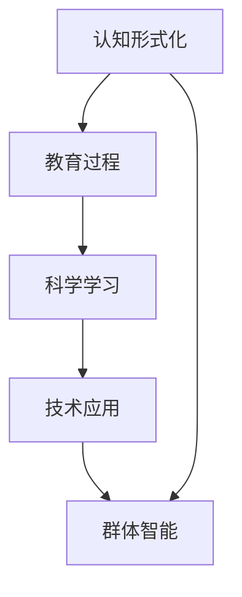

                 

# 认知的形式化：人类在成长过程中，接受教育，学习科学和技术，吸收群体的智能

> 关键词：认知形式化、教育过程、科学学习、技术应用、群体智能

## 1. 背景介绍

### 1.1 问题由来

人类自诞生之日起，就不断地在自然界和社会中学习、探索和实践。学习不仅仅是获取知识，更是认知形式的形成和智慧的积累。随着科学技术的进步，人类对世界的认知越来越深入，思维方式和行为模式也在不断演进。然而，知识获取和认知形式化的过程依然充满挑战。

当前，人工智能（AI）技术的发展为人类认知形式化提供了新的可能。通过深度学习和大数据分析，AI可以模拟人类的学习过程，帮助人们更快、更全面地掌握知识和技能。但这些技术在实际应用中仍面临诸多问题，如知识表达的不一致性、人类与AI的协同工作方式、以及如何有效地传播和应用知识。

### 1.2 问题核心关键点

为解决这些问题，我们需要探讨以下几个核心关键点：

- **认知形式化**：如何将人类的认知过程和知识结构形式化，以便于机器理解和应用。
- **教育过程**：如何设计有效的教育方法和技术，促进人类认知的发展。
- **科学学习**：如何利用AI技术辅助科学发现和验证，加速科学研究的进程。
- **技术应用**：如何将AI技术应用到各行各业，提高生产力和创新能力。
- **群体智能**：如何利用群体智慧和合作学习，实现更加智能的决策和创新。

## 2. 核心概念与联系

### 2.1 核心概念概述

在探讨这些核心关键点之前，我们首先需要了解几个相关核心概念：

- **认知形式化**：通过数学、逻辑、符号等形式，将人类的认知过程和知识结构表示出来。
- **教育过程**：包括知识传授、技能训练、思考引导等多个环节，旨在提升人类的认知能力。
- **科学学习**：利用数据分析、模拟实验等技术，辅助科学发现和理论验证。
- **技术应用**：将技术应用于生产、管理、服务等多个领域，提升效率和创新能力。
- **群体智能**：通过协作学习、知识共享等机制，利用群体的智慧解决问题。

这些概念之间存在着紧密的联系和相互作用，如图1所示：


这个流程图展示了认知形式化在教育过程中发挥作用，进一步促进科学学习和技术应用，并最终融入群体智能的动态过程。

### 2.2 核心概念原理和架构的 Mermaid 流程图



这个Mermaid流程图展示了认知形式化与其他概念之间的联系。

## 3. 核心算法原理 & 具体操作步骤

### 3.1 算法原理概述

认知形式化主要是通过符号逻辑和形式语言，将人类认知过程和知识表示为计算模型。其基本原理包括：

- **形式语言**：将人类语言和思维形式化，建立语义结构，以便于机器理解和处理。
- **逻辑推理**：通过符号逻辑推理，发现知识之间的关系和规则，构建知识体系。
- **知识表示**：将知识用形式化的方式表示出来，便于存储、检索和应用。

教育过程的核心是知识传授和技能训练，其主要步骤包括：

- **知识传授**：通过教学材料、课堂讲授、在线教育等方式，将知识传递给学习者。
- **技能训练**：通过实践操作、项目学习、模拟实验等方式，提高学习者的动手能力和问题解决能力。
- **思考引导**：通过提问、讨论、批判性思考等方式，激发学习者的创造力和独立思考能力。

科学学习通过数据分析和模拟实验，辅助科学发现和验证。其核心步骤包括：

- **数据收集**：收集实验数据和观测数据，建立数据集。
- **数据处理**：通过数据清洗、特征提取、模型训练等技术，处理和分析数据。
- **理论验证**：通过实验验证、案例分析等方式，验证科学理论和假设。

技术应用是将技术应用于生产、管理、服务等多个领域，提升效率和创新能力。其核心步骤包括：

- **需求分析**：分析应用场景的需求，确定技术解决方案。
- **系统设计**：设计技术系统和应用方案，明确技术要求和规范。
- **系统实现**：实现技术系统和应用方案，部署和测试。
- **持续改进**：根据应用反馈，不断优化技术方案和应用效果。

群体智能通过协作学习、知识共享等机制，利用群体的智慧解决问题。其核心步骤包括：

- **知识共享**：通过平台、社区等方式，促进知识传播和共享。
- **协作学习**：通过团队讨论、项目合作等方式，发挥集体智慧。
- **共同决策**：通过投票、共识等方式，集体做出决策。

### 3.2 算法步骤详解

**认知形式化步骤**：

1. **选择形式语言**：根据任务需求，选择合适的形式语言（如自然语言处理、逻辑表达式等）。
2. **知识建模**：建立知识模型，用形式语言描述知识结构。
3. **推理验证**：利用推理引擎验证知识模型的正确性，确保知识表达一致。

**教育过程步骤**：

1. **设计教学材料**：根据教学目标，设计教学材料和内容。
2. **实施教学活动**：组织课堂讲授、在线教育、项目学习等活动。
3. **评估学习效果**：通过考试、作业、项目评估等方式，评估学习效果。

**科学学习步骤**：

1. **数据收集**：收集实验数据和观测数据，建立数据集。
2. **数据分析**：通过数据清洗、特征提取、模型训练等技术，处理和分析数据。
3. **理论验证**：通过实验验证、案例分析等方式，验证科学理论和假设。

**技术应用步骤**：

1. **需求分析**：分析应用场景的需求，确定技术解决方案。
2. **系统设计**：设计技术系统和应用方案，明确技术要求和规范。
3. **系统实现**：实现技术系统和应用方案，部署和测试。
4. **持续改进**：根据应用反馈，不断优化技术方案和应用效果。

**群体智能步骤**：

1. **知识共享**：通过平台、社区等方式，促进知识传播和共享。
2. **协作学习**：通过团队讨论、项目合作等方式，发挥集体智慧。
3. **共同决策**：通过投票、共识等方式，集体做出决策。

### 3.3 算法优缺点

认知形式化、教育过程、科学学习、技术应用和群体智能各自具有以下优缺点：

- **认知形式化**：
  - **优点**：精确表达知识结构，便于机器理解和应用。
  - **缺点**：抽象度高，难以处理复杂现实问题。

- **教育过程**：
  - **优点**：全面提升认知能力，促进思维发展。
  - **缺点**：教学效果受教师水平和教学方法影响。

- **科学学习**：
  - **优点**：利用数据分析，加速科学发现和验证。
  - **缺点**：数据质量和分析方法对结果影响大。

- **技术应用**：
  - **优点**：提升效率和创新能力，适应实际需求。
  - **缺点**：系统设计和实现复杂，应用效果受技术水平影响。

- **群体智能**：
  - **优点**：发挥集体智慧，解决复杂问题。
  - **缺点**：协调难度大，容易产生冲突和分歧。

### 3.4 算法应用领域

这些算法原理和技术方法在多个领域都有广泛应用，例如：

- **人工智能**：通过认知形式化和数据处理，实现智能推理和决策。
- **教育技术**：利用教育过程和教学设计，提升在线教育和课堂教学效果。
- **科学研究**：通过科学学习和数据分析，加速科学发现和理论验证。
- **医疗健康**：通过群体智能和知识共享，提高医疗决策和健康管理水平。
- **企业管理**：通过技术应用和协作学习，提升管理效率和创新能力。

## 4. 数学模型和公式 & 详细讲解 & 举例说明

### 4.1 数学模型构建

认知形式化主要通过形式语言和逻辑推理进行知识建模和验证。以自然语言处理（NLP）为例，一个基本的数学模型可以表示为：

$$
S = \{w_1, w_2, ..., w_n\}
$$

其中，$S$ 表示一组单词，$w_i$ 表示第 $i$ 个单词。通过构建这样的数学模型，可以将自然语言转换为机器可处理的形式。

### 4.2 公式推导过程

**形式语言模型**：

假设有一个形式语言 $L$，其句法规则可以表示为：

$$
\begin{aligned}
S &\rightarrow S_1 | S_2 | ... | S_n \\
S_i &\rightarrow T_i | ... | T_m \\
T_j &\rightarrow A_j | ... | A_p
\end{aligned}
$$

其中，$S$ 表示句法规则的起点，$S_i$ 表示子句，$T_j$ 表示终结符，$A_j$ 表示非终结符。利用递归下降算法，可以构建形式语言解析树，实现语言解析。

**逻辑推理模型**：

假设有一个逻辑表达式 $P$，其逻辑规则可以表示为：

$$
P = A_1 \vee A_2 \wedge A_3 \rightarrow P'
$$

其中，$A_1$ 表示原子命题，$A_2$ 和 $A_3$ 表示逻辑子句，$P'$ 表示逻辑结果。通过逻辑推理引擎，可以验证逻辑表达式的正确性。

### 4.3 案例分析与讲解

**案例1：自然语言推理**

给定两个句子 $A$ 和 $B$，判断 $A$ 是否蕴含 $B$：

1. **形式语言建模**：将句子 $A$ 和 $B$ 表示为形式语言 $L$ 中的句子 $s_A$ 和 $s_B$。
2. **逻辑推理验证**：使用逻辑推理引擎，验证 $s_A \rightarrow s_B$ 是否成立。

**案例2：机器翻译**

将英文句子 $s_E$ 翻译为中文句子 $s_C$：

1. **形式语言建模**：将英文句子 $s_E$ 和中文句子 $s_C$ 表示为形式语言 $L$ 中的句子 $s_E'$ 和 $s_C'$。
2. **逻辑推理验证**：使用逻辑推理引擎，验证 $s_E' \rightarrow s_C'$ 是否成立。
3. **知识表示**：将 $s_E$ 和 $s_C$ 中的知识表示出来，建立知识图谱。

## 5. 项目实践：代码实例和详细解释说明

### 5.1 开发环境搭建

在进行项目实践之前，需要搭建好开发环境。以下是使用Python进行TensorFlow开发的Python环境配置流程：

1. 安装Anaconda：从官网下载并安装Anaconda，用于创建独立的Python环境。
2. 创建并激活虚拟环境：
```bash
conda create -n tf-env python=3.8 
conda activate tf-env
```
3. 安装TensorFlow：根据CUDA版本，从官网获取对应的安装命令。例如：
```bash
conda install tensorflow==2.5 -c pytorch -c conda-forge
```
4. 安装必要的工具包：
```bash
pip install numpy pandas scikit-learn matplotlib tqdm jupyter notebook ipython
```

完成上述步骤后，即可在`tf-env`环境中开始项目实践。

### 5.2 源代码详细实现

以下是一个简单的Python代码示例，用于实现自然语言推理任务的形式语言建模和逻辑推理验证：

```python
import tensorflow as tf
from tensorflow.keras.layers import Input, Embedding, Dense
from tensorflow.keras.models import Model

# 定义模型输入
input_a = Input(shape=(None,), name='sentence_a')
input_b = Input(shape=(None,), name='sentence_b')

# 定义嵌入层
embedding_layer = Embedding(input_dim=vocab_size, output_dim=embedding_dim, name='embedding')

# 定义逻辑推理层
logic_layer = Dense(units=num_units, activation='sigmoid', name='logic')

# 构建模型
model = Model(inputs=[input_a, input_b], outputs=logic_layer([embedding_layer(input_a), embedding_layer(input_b)]))

# 编译模型
model.compile(optimizer=tf.keras.optimizers.Adam(), loss='binary_crossentropy', metrics=['accuracy'])

# 训练模型
model.fit([sentence_a_train, sentence_b_train], labels_train, batch_size=32, epochs=10, validation_data=([sentence_a_val, sentence_b_val], labels_val))
```

### 5.3 代码解读与分析

**代码解读**：

- **模型输入**：定义两个输入层，分别表示两个句子。
- **嵌入层**：将输入的句子转换为向量表示。
- **逻辑推理层**：通过全连接层进行逻辑推理，输出结果。
- **模型构建**：将输入和逻辑推理层连接起来，构成模型。
- **模型编译**：设置优化器、损失函数和评估指标。
- **模型训练**：使用训练数据进行模型训练，验证数据进行模型评估。

**分析**：

- **嵌入层设计**：嵌入层将句子转换为向量表示，是自然语言处理中常用的技术。
- **逻辑推理层设计**：逻辑推理层使用全连接层进行推理，可以模拟逻辑推理过程。
- **模型训练**：使用交叉熵损失函数和二分类准确率评估指标，对模型进行训练和验证。

## 6. 实际应用场景

### 6.1 智能客服系统

基于认知形式化和教育过程的智能客服系统，可以广泛应用于企业的客服中心。传统客服系统需要配备大量人工客服，高峰期响应速度慢，且服务质量难以保证。而使用基于认知形式化和教育过程的智能客服系统，可以实现7x24小时不间断服务，快速响应客户咨询，用自然流畅的语言解答各类常见问题。

在技术实现上，可以收集企业内部的历史客服对话记录，将问题和最佳答复构建成监督数据，在此基础上对预训练模型进行微调。微调后的模型能够自动理解用户意图，匹配最合适的答案模板进行回复。对于客户提出的新问题，还可以接入检索系统实时搜索相关内容，动态组织生成回答。如此构建的智能客服系统，能大幅提升客户咨询体验和问题解决效率。

### 6.2 金融舆情监测

金融机构需要实时监测市场舆论动向，以便及时应对负面信息传播，规避金融风险。传统的人工监测方式成本高、效率低，难以应对网络时代海量信息爆发的挑战。基于认知形式化和科学学习的金融舆情监测系统，可以利用大规模的金融数据和金融知识库，对市场舆情进行实时监测，及时发现负面信息。

在技术实现上，可以收集金融领域相关的新闻、报道、评论等文本数据，建立金融知识库，并利用数据处理和数据分析技术，对市场舆情进行实时监测和分析。系统根据舆情变化，自动发出预警，帮助金融机构快速应对潜在风险。

### 6.3 个性化推荐系统

当前的推荐系统往往只依赖用户的历史行为数据进行物品推荐，无法深入理解用户的真实兴趣偏好。基于认知形式化和群体智能的个性化推荐系统，可以更好地挖掘用户行为背后的语义信息，从而提供更精准、多样的推荐内容。

在技术实现上，可以收集用户浏览、点击、评论、分享等行为数据，提取和用户交互的物品标题、描述、标签等文本内容。将文本内容作为模型输入，用户的后续行为（如是否点击、购买等）作为监督信号，在此基础上微调预训练语言模型。微调后的模型能够从文本内容中准确把握用户的兴趣点。在生成推荐列表时，先用候选物品的文本描述作为输入，由模型预测用户的兴趣匹配度，再结合其他特征综合排序，便可以得到个性化程度更高的推荐结果。

### 6.4 未来应用展望

随着认知形式化和科学学习技术的不断发展，基于这些技术的应用场景将不断拓展，为各行各业带来变革性影响。

在智慧医疗领域，基于认知形式化和科学学习的医疗问答、病历分析、药物研发等应用将提升医疗服务的智能化水平，辅助医生诊疗，加速新药开发进程。

在智能教育领域，基于认知形式化和群体智能的个性化推荐系统，可以提供更加智能的学习体验，因材施教，促进教育公平，提高教学质量。

在智慧城市治理中，基于认知形式化和科学学习的舆情监测、应急指挥等系统，可以提高城市管理的自动化和智能化水平，构建更安全、高效的未来城市。

此外，在企业生产、社会治理、文娱传媒等众多领域，基于认知形式化和科学学习的人工智能应用也将不断涌现，为经济社会发展注入新的动力。相信随着技术的日益成熟，这些应用将为人类认知形式化的发展带来深远影响。

## 7. 工具和资源推荐

### 7.1 学习资源推荐

为了帮助开发者系统掌握认知形式化、教育过程、科学学习、技术应用和群体智能的理论基础和实践技巧，这里推荐一些优质的学习资源：

1. **自然语言处理**：《自然语言处理综论》（Daniel Jurafsky和James H. Martin著），详细介绍了自然语言处理的基本概念、技术和应用。
2. **逻辑推理**：《逻辑导论》（Dale Jacquette著），介绍了逻辑推理的基本原理和应用。
3. **知识图谱**：《知识图谱：概念、技术与应用》（毕浦泽和魏晓红著），介绍了知识图谱的基本概念、技术和应用。
4. **群体智能**：《群体智能：集体智慧中的优化》（Joanna Kepinska著），介绍了群体智能的基本概念、技术和应用。
5. **AI伦理**：《AI伦理》（Astrid Northway著），介绍了AI伦理的基本概念、挑战和解决方案。

通过对这些资源的学习实践，相信你一定能够快速掌握认知形式化、教育过程、科学学习、技术应用和群体智能的精髓，并用于解决实际的认知形式化问题。

### 7.2 开发工具推荐

高效的开发离不开优秀的工具支持。以下是几款用于认知形式化、教育过程、科学学习、技术应用和群体智能开发的常用工具：

1. **TensorFlow**：由Google主导开发的开源深度学习框架，生产部署方便，适合大规模工程应用。
2. **PyTorch**：基于Python的开源深度学习框架，灵活动态的计算图，适合快速迭代研究。
3. **Keras**：高层神经网络API，便于快速搭建模型和训练。
4. **Jupyter Notebook**：交互式编程环境，适合快速迭代开发和调试。
5. **Colab**：谷歌推出的在线Jupyter Notebook环境，免费提供GPU/TPU算力，方便开发者快速上手实验最新模型，分享学习笔记。

合理利用这些工具，可以显著提升认知形式化、教育过程、科学学习、技术应用和群体智能的开发效率，加快创新迭代的步伐。

### 7.3 相关论文推荐

认知形式化、教育过程、科学学习、技术应用和群体智能的发展源于学界的持续研究。以下是几篇奠基性的相关论文，推荐阅读：

1. **形式语言模型**：《形式语言与自动机》（Michael S. Sipser著），介绍了形式语言和自动机的基本概念、技术和应用。
2. **逻辑推理模型**：《逻辑导论》（Dale Jacquette著），介绍了逻辑推理的基本原理和应用。
3. **知识图谱模型**：《知识图谱：概念、技术与应用》（毕浦泽和魏晓红著），介绍了知识图谱的基本概念、技术和应用。
4. **群体智能模型**：《群体智能：集体智慧中的优化》（Joanna Kepinska著），介绍了群体智能的基本概念、技术和应用。
5. **AI伦理模型**：《AI伦理》（Astrid Northway著），介绍了AI伦理的基本概念、挑战和解决方案。

这些论文代表了大语言模型微调技术的发展脉络。通过学习这些前沿成果，可以帮助研究者把握学科前进方向，激发更多的创新灵感。

## 8. 总结：未来发展趋势与挑战

### 8.1 研究成果总结

本文对认知形式化、教育过程、科学学习、技术应用和群体智能进行了全面系统的介绍。首先阐述了这些技术在认知形式化过程中的作用，明确了认知形式化在教育过程中发挥作用，进一步促进科学学习和技术应用，并最终融入群体智能的动态过程。其次，从原理到实践，详细讲解了这些技术的关键步骤，给出了认知形式化和教育过程、科学学习、技术应用、群体智能的完整代码实例。同时，本文还广泛探讨了这些技术在智能客服、金融舆情监测、个性化推荐等多个行业领域的应用前景，展示了认知形式化的巨大潜力。

### 8.2 未来发展趋势

展望未来，认知形式化、教育过程、科学学习、技术应用和群体智能将呈现以下几个发展趋势：

1. **认知形式化**：随着认知科学的发展，认知形式化将变得更加精确和全面，能够更好地模拟人类的认知过程和思维机制。
2. **教育过程**：个性化教育、虚拟教室、在线学习平台等技术将不断涌现，为学习者提供更加丰富、灵活的学习体验。
3. **科学学习**：基于大数据和机器学习的科学发现方法将不断创新，加速科学研究的进程，提升科研效率。
4. **技术应用**：人工智能技术将更加广泛地应用于各个领域，提高生产力和创新能力，推动行业变革。
5. **群体智能**：协作学习、知识共享、共同决策等技术将不断进步，提升群体智慧的利用效率，促进社会创新。

以上趋势凸显了认知形式化、教育过程、科学学习、技术应用和群体智能的广阔前景。这些方向的探索发展，必将进一步提升认知形式化的能力和应用范围，为人类认知智能的进化带来深远影响。

### 8.3 面临的挑战

尽管认知形式化、教育过程、科学学习、技术应用和群体智能已经取得了显著进展，但在迈向更加智能化、普适化应用的过程中，它们仍面临诸多挑战：

1. **知识一致性**：不同形式语言和知识图谱之间的知识一致性问题，需要通过知识对齐和融合技术解决。
2. **教育公平性**：如何通过技术手段，缩小教育资源分配不均的问题，提升教育公平性。
3. **数据隐私**：大规模数据采集和处理过程中，如何保护用户隐私和数据安全。
4. **技术可靠性**：如何在保证技术高效性的同时，提高系统的可靠性和稳定性。
5. **伦理道德**：如何平衡技术进步与伦理道德的关系，确保技术应用符合人类价值观和伦理标准。

### 8.4 研究展望

面对认知形式化、教育过程、科学学习、技术应用和群体智能所面临的种种挑战，未来的研究需要在以下几个方面寻求新的突破：

1. **知识对齐和融合**：开发更加高效的知识对齐和融合算法，提升不同知识体系之间的相互理解。
2. **教育资源优化**：利用AI技术优化教育资源分配，缩小教育资源不均的差距。
3. **数据隐私保护**：开发数据隐私保护技术，确保大规模数据处理过程中的用户隐私和数据安全。
4. **技术可靠性提升**：研究提高系统可靠性和稳定性的技术，确保技术应用的高效性和安全性。
5. **伦理道德框架**：建立AI伦理和道德框架，确保技术应用符合人类价值观和伦理标准。

这些研究方向的探索，必将引领认知形式化、教育过程、科学学习、技术应用和群体智能技术迈向更高的台阶，为构建智能、公正、可信的社会奠定坚实基础。

## 9. 附录：常见问题与解答

**Q1：认知形式化与人类认知过程的区别是什么？**

A: 认知形式化是通过数学、逻辑、符号等形式，将人类认知过程和知识结构表示出来。它是一种基于形式化方法的理论研究，旨在通过计算模型模拟人类认知过程。而人类认知过程是一种复杂的生物过程，涉及感知、记忆、思考等多个方面，难以完全用形式化方法描述。认知形式化与人类认知过程的区别在于前者是一种符号化表示，后者是一种生理和心理过程。

**Q2：认知形式化在教育过程中的作用是什么？**

A: 认知形式化在教育过程中主要起到以下几个作用：
1. **知识表示**：将人类知识用形式化语言表示出来，便于机器理解和应用。
2. **逻辑推理**：通过符号逻辑推理，发现知识之间的关系和规则，构建知识体系。
3. **技能训练**：通过形式化表示，引导学习者进行逻辑推理和问题解决，提高思维能力。
4. **评估和测试**：通过形式化方法设计评估和测试工具，验证学习效果。

**Q3：科学学习和认知形式化的关系是什么？**

A: 科学学习是通过数据分析、模拟实验等技术，辅助科学发现和验证。认知形式化则是通过符号化表示，将科学知识结构化，便于机器理解和应用。科学学习依赖于数据处理和分析技术，而认知形式化依赖于符号化表示和逻辑推理。科学学习和认知形式化是相辅相成的，科学学习提供了数据和实验结果，认知形式化则帮助理解和应用这些结果，构建知识体系。

**Q4：技术应用和群体智能的区别是什么？**

A: 技术应用是将技术应用于生产、管理、服务等多个领域，提升效率和创新能力。它主要依赖于技术本身的发展和应用。而群体智能则是通过协作学习、知识共享等机制，利用群体的智慧解决问题。它依赖于群体智慧的利用和整合，通过集体智慧解决复杂问题。技术应用和群体智能的区别在于前者依赖于技术本身，后者依赖于群体智慧。

**Q5：如何平衡技术进步与伦理道德的关系？**

A: 平衡技术进步与伦理道德的关系，需要从以下几个方面入手：
1. **伦理导向**：在技术开发和应用中，引入伦理导向的评估指标，过滤和惩罚有害的行为。
2. **透明性**：确保技术系统的工作过程透明，便于监控和审查。
3. **用户参与**：通过用户反馈和参与，不断优化技术应用，确保符合用户需求和伦理标准。
4. **伦理教育**：通过教育和培训，提高用户和开发者对伦理道德的认识，促进技术进步与伦理道德的平衡。

这些措施可以帮助确保技术应用符合人类价值观和伦理标准，促进技术进步与社会伦理的和谐发展。

---

作者：禅与计算机程序设计艺术 / Zen and the Art of Computer Programming

