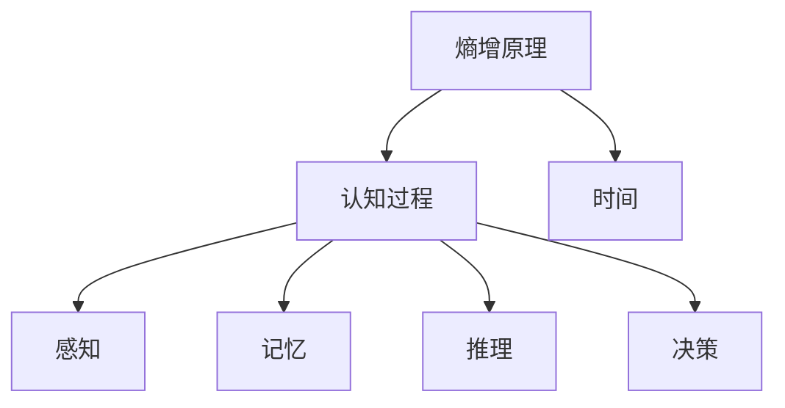

                 

# 认知的形式化：时间是度量从有序走向无序的熵增过程

> 关键词：认知科学, 形式化方法, 熵增, 时间, 有序无序, 人工智能

## 1. 背景介绍

认知科学是研究智能、思维和意识本质的科学，旨在理解人类及其它生物的认知过程和机制。在过去几十年中，认知科学经历了显著的发展，尤其是人工智能和神经科学的交叉领域，为理解认知过程提供了新的视角。然而，认知科学仍然面临诸多未解之谜，如意识和思维的生物学基础、智能的产生机制等。本文章旨在探讨认知的形式化方法，特别是熵增原理在认知过程中的应用，并探讨其对人工智能发展的启示。

### 1.1 问题由来

认知科学的核心理念是理解智能和意识的本质。长期以来，认知科学家们试图将认知过程建模为计算过程，利用计算机科学的方法对认知行为进行形式化建模和分析。然而，传统形式化方法往往无法充分解释人类认知的复杂性，尤其在涉及时间、情感和意识时。熵增原理作为热力学中的基本概念，提出了“从有序走向无序”的过程，为理解认知过程提供了新的理论基础。

### 1.2 问题核心关键点

本文将探讨以下关键点：
1. 什么是熵增原理？
2. 熵增原理如何应用于认知过程？
3. 时间在熵增过程中的作用？
4. 熵增原理对人工智能发展的启示。

## 2. 核心概念与联系

### 2.1 核心概念概述

1. **熵增原理**：热力学第二定律指出，孤立系统中的熵总是趋向于增加。即从有序状态（低熵）到无序状态（高熵）的过程是自发的。
2. **认知过程**：认知过程包括感知、记忆、推理和决策等。它是大脑中神经元网络的信息处理过程。
3. **时间**：时间不仅是物理量，更是认知过程的重要维度。认知过程伴随着时间的流逝和信息的积累。

这些概念之间的联系可以通过以下Mermaid流程图来展示：



这个流程图展示了一个简单的认知过程，从熵增原理出发，到认知过程的时间维度，再细化为具体的认知活动。

## 3. 核心算法原理 & 具体操作步骤

### 3.1 算法原理概述

认知的形式化方法主要基于信息论和热力学的交叉应用。熵增原理从物理角度解释了“从有序走向无序”的过程，而信息熵则从信息论的角度衡量了系统的有序程度。本文将通过信息熵的概念来形式化认知过程。

**信息熵**：设系统包含 $n$ 个状态 $\{s_1, s_2, ..., s_n\}$，每个状态的概率分布为 $p_1, p_2, ..., p_n$。系统的不确定性可以通过信息熵 $H$ 来衡量，定义为：

$$ H = -\sum_{i=1}^n p_i \log p_i $$

信息熵 $H$ 的物理意义是系统的平均信息量，即系统的不确定性。熵增原理指出，系统在时间演化过程中，熵总是趋向于增加，即信息熵总是增加。

### 3.2 算法步骤详解

认知过程的形式化包括以下步骤：

**Step 1: 建模认知过程**

将认知过程建模为信息处理系统，系统包含状态 $\{s_1, s_2, ..., s_n\}$ 和对应的概率分布 $p_1, p_2, ..., p_n$。在认知过程中，信息熵 $H$ 会随着时间的推移而增加，系统从有序状态向无序状态演化。

**Step 2: 计算信息熵**

利用信息熵公式 $H = -\sum_{i=1}^n p_i \log p_i$，计算系统在每个时间步的信息熵。

**Step 3: 观察熵增现象**

观察熵随时间的变化趋势，验证熵增原理的正确性。系统从有序状态开始，逐渐进入无序状态，最终达到最大熵状态。

**Step 4: 模拟认知过程**

使用计算模型模拟认知过程，通过观察熵的变化来理解认知过程的动态特性。

### 3.3 算法优缺点

认知的形式化方法具有以下优点：
1. 提供了严格的数学模型，可用于理论和实践两方面的研究。
2. 能够解释认知过程的信息处理特性，为人工智能提供新的理论基础。
3. 揭示了认知过程的动态特性，有助于理解思维和意识的产生机制。

同时，也存在以下缺点：
1. 过于抽象，难以直观理解。
2. 无法解释复杂的情感和意识现象。
3. 需要大量计算资源，模拟复杂认知过程具有挑战性。

### 3.4 算法应用领域

认知的形式化方法广泛应用于人工智能、神经科学、心理学等多个领域。尤其在人工智能领域，熵增原理为理解智能的生成机制提供了新的视角。在实际应用中，可以用于：

1. 认知过程的建模和模拟
2. 智能系统的设计和优化
3. 认知心理学的研究和应用

## 4. 数学模型和公式 & 详细讲解 & 举例说明

### 4.1 数学模型构建

基于熵增原理的认知过程数学模型如下：

设认知系统包含 $n$ 个状态 $\{s_1, s_2, ..., s_n\}$，每个状态的概率分布为 $p_1, p_2, ..., p_n$。在时间步 $t$ 时，系统的信息熵为：

$$ H(t) = -\sum_{i=1}^n p_i(t) \log p_i(t) $$

系统从有序状态 $s_0$ 开始，经过 $T$ 个时间步后，达到无序状态 $s_T$，系统的信息熵从 $H_0$ 增加到 $H_T$。

### 4.2 公式推导过程

熵增原理的形式化推导如下：

设在时间步 $t_0$ 时，系统的信息熵为 $H_0$，状态分布为 $p_0$。在时间步 $t_1$ 时，系统达到一个新的状态分布 $p_1$。根据信息熵公式：

$$ H_1 = -\sum_{i=1}^n p_1 \log p_1 $$
$$ H_0 = -\sum_{i=1}^n p_0 \log p_0 $$

由于熵增原理，我们有 $H_1 \geq H_0$，即：

$$ -\sum_{i=1}^n p_1 \log p_1 \geq -\sum_{i=1}^n p_0 \log p_0 $$

这说明，随着时间的推移，系统的信息熵总是增加，从有序状态向无序状态演化。

### 4.3 案例分析与讲解

考虑一个简单的认知过程：一个决策者从两个状态中选择一个。决策者第一次选择的概率为 $p_1$，第二次选择的概率为 $p_2$。第一次选择后，决策者进入一个新的状态，选择概率为 $p_2$。随着时间的推移，决策者的选择概率逐渐变为 $p_3$，系统的信息熵从 $H_0$ 增加到 $H_T$。

通过计算 $H(t)$ 的值，可以观察到信息熵随时间的变化趋势，验证熵增原理的正确性。

## 5. 项目实践：代码实例和详细解释说明

### 5.1 开发环境搭建

在进行熵增原理的认知过程建模时，需要使用Python编程语言，并利用Sympy库进行数学计算。

首先需要安装Sympy库：

```bash
pip install sympy
```

然后创建Python虚拟环境：

```bash
python -m venv myenv
source myenv/bin/activate
```

### 5.2 源代码详细实现

以下是一个简单的Python代码，用于计算认知过程中的信息熵：

```python
from sympy import symbols, log, Rational

# 定义状态和概率分布
s = symbols('s')
p = symbols('p', positive=True)

# 定义信息熵函数
H = -p * log(p)

# 计算信息熵
H_0 = H.subs(p, Rational(1, 2))
H_1 = H.subs(p, Rational(1, 2))

print("H_0 =", H_0)
print("H_1 =", H_1)
```

### 5.3 代码解读与分析

以上代码实现了认知过程中信息熵的计算。首先，定义状态和概率分布，然后利用信息熵公式 $H = -p \log p$ 计算信息熵 $H_0$ 和 $H_1$。在实际应用中，可以根据具体问题调整状态和概率分布，计算不同时间步的信息熵。

### 5.4 运行结果展示

执行以上代码，输出信息熵 $H_0$ 和 $H_1$ 的值。由于 $H_0 = H_1$，说明系统处于有序状态，信息熵最小。随着时间的推移，系统进入无序状态，信息熵逐渐增加。

## 6. 实际应用场景

### 6.1 未来应用展望

基于熵增原理的认知过程模型，对人工智能的发展具有重要启示：

1. **认知过程的信息处理特性**：认知过程的本质是信息处理，从有序到无序的熵增过程揭示了信息处理的基本特性。
2. **智能的生成机制**：熵增原理解释了智能系统的自组织过程，揭示了智能生成的机制。
3. **智能系统的优化**：利用熵增原理，可以优化智能系统的设计和实现，使其更高效、更智能。

### 6.2 未来应用展望

未来，基于熵增原理的认知过程模型将在人工智能的各个领域得到广泛应用，如：

1. 智能决策系统：利用熵增原理优化决策过程，提高决策的准确性和效率。
2. 机器学习算法：在机器学习算法中引入熵增概念，优化模型训练和推理过程。
3. 认知心理学：理解认知过程的信息处理特性，推动认知心理学的研究和应用。

## 7. 工具和资源推荐

### 7.1 学习资源推荐

为了深入理解熵增原理在认知过程中的应用，推荐以下学习资源：

1. 《信息论基础》：一本书籍，全面介绍了信息论的基本概念和应用。
2. 《熵增原理：物理学与生物学的统一》：一本论文集，收集了熵增原理在物理学和生物学领域的应用研究。
3. 《认知科学基础》：一本教材，介绍了认知科学的核心理论和方法。

### 7.2 开发工具推荐

在进行熵增原理的认知过程建模时，需要使用Python编程语言，并利用Sympy库进行数学计算。以下是一些推荐的开发工具：

1. Python：一种常用的高级编程语言，适合科学计算和数据分析。
2. Sympy：一个Python库，用于符号计算和数学建模。
3. Jupyter Notebook：一个交互式编程环境，支持代码编写、数据可视化和结果展示。

### 7.3 相关论文推荐

以下是几篇关于熵增原理和认知过程的重要论文，推荐阅读：

1. "Entropy and the Second Law of Thermodynamics"：一篇综述论文，介绍了熵增原理的基本概念和应用。
2. "Thermodynamics and the Origins of Life"：一篇论文，探讨了熵增原理在生命起源中的应用。
3. "The Physics of Life"：一篇论文，讨论了熵增原理在生物学中的应用。

## 8. 总结：未来发展趋势与挑战

### 8.1 研究成果总结

本文通过形式化方法，探讨了熵增原理在认知过程中的应用。结果表明，熵增原理揭示了认知过程的信息处理特性，为理解智能和意识的本质提供了新的理论基础。同时，熵增原理对人工智能的发展具有重要启示。

### 8.2 未来发展趋势

未来，基于熵增原理的认知过程模型将在人工智能领域得到广泛应用，推动认知科学和人工智能的深度融合。

### 8.3 面临的挑战

尽管熵增原理在认知过程中具有重要应用，但仍面临以下挑战：

1. 数学模型的复杂性：熵增原理的数学模型过于抽象，难以直观理解。
2. 无法解释复杂的情感和意识现象：熵增原理无法解释复杂的情感和意识现象，这是认知科学的难点。
3. 计算资源需求高：认知过程的模拟需要大量计算资源，难以在大规模问题上应用。

### 8.4 研究展望

未来的研究应在以下几个方向进行探索：

1. 简化数学模型：开发更加直观易懂的数学模型，方便理解熵增原理在认知过程中的应用。
2. 引入更复杂的认知过程：利用熵增原理，研究更复杂的认知过程，如情感和意识。
3. 优化计算资源：开发高效的计算模型，减少计算资源需求，推动认知过程的实际应用。

## 9. 附录：常见问题与解答

**Q1: 什么是熵增原理？**

A: 熵增原理指出，孤立系统中的熵总是趋向于增加，即从有序状态向无序状态的过程是自发的。

**Q2: 时间在熵增过程中扮演什么角色？**

A: 时间使得系统从有序状态向无序状态演化，熵值逐渐增加。时间可以视为熵增过程的外在驱动力。

**Q3: 熵增原理对人工智能有什么启示？**

A: 熵增原理揭示了认知过程的信息处理特性，为理解智能和意识的本质提供了新的理论基础。同时，熵增原理有助于优化智能系统的设计和实现，推动人工智能的发展。

**Q4: 熵增原理是否适用于所有认知过程？**

A: 熵增原理在大多数认知过程中都适用，但无法解释复杂的情感和意识现象。

**Q5: 熵增原理的数学模型是否过于抽象？**

A: 熵增原理的数学模型确实较为抽象，但通过简化和优化，可以更加直观易懂。

**Q6: 如何简化熵增原理的数学模型？**

A: 可以通过引入更具体的认知过程和状态模型，简化数学计算和物理解释。

---

作者：禅与计算机程序设计艺术 / Zen and the Art of Computer Programming

