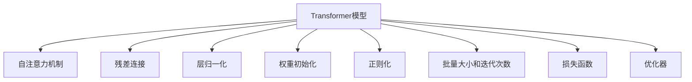

                 

# 训练Transformer模型

## 1. 背景介绍

### 1.1 问题由来

Transformer是近年来在自然语言处理（NLP）领域中最成功的神经网络架构之一。Transformer能够高效地进行序列数据的建模，相较于传统循环神经网络（RNN）具有更少的计算成本和更高的训练速度。随着预训练大语言模型的兴起，Transformer逐渐成为了主流的大模型架构，并广泛应用于机器翻译、文本分类、问答系统、对话生成等NLP任务。

Transformer的成功，得益于其自注意力机制（Self-Attention）的设计，可以并行计算不同位置之间的依赖关系，避免了传统RNN中的序列计算瓶颈。此外，Transformer还利用了残差连接（Residual Connection）和层归一化（Layer Normalization）等技术，有效解决了梯度消失和梯度爆炸的问题，显著提升了模型的稳定性和收敛性。

### 1.2 问题核心关键点

要训练一个Transformer模型，需要深入理解其自注意力机制、残差连接和层归一化等核心组件的原理和作用，掌握其训练流程和优化策略。此外，还需要关注模型的初始化、正则化、批量大小和迭代次数等超参数设置，确保模型能够在有限的数据和计算资源下，最大化性能和泛化能力。

## 2. 核心概念与联系

### 2.1 核心概念概述

为更好地理解Transformer的训练过程，本节将介绍几个密切相关的核心概念：

- **Transformer模型**：一种基于自注意力机制的神经网络架构，用于处理序列数据。Transformer模型由编码器和解码器两部分组成，能够高效地进行序列数据的并行计算和依赖关系建模。
- **自注意力机制**：Transformer模型的核心组件，用于计算不同位置之间的依赖关系，可以并行计算，大大提升了计算效率。
- **残差连接**：一种用于提升模型训练稳定性和收敛性的技术，可以缓解梯度消失和梯度爆炸的问题。
- **层归一化**：一种用于提升模型训练稳定性的技术，可以缓解梯度消失和梯度爆炸的问题，同时加速模型的收敛。
- **权重初始化**：用于设置模型参数的初始值，好的权重初始化能够显著提高模型的训练效果。
- **正则化**：用于避免过拟合和提升模型泛化能力的技术，常见的正则化方法包括L2正则、Dropout等。
- **批量大小和迭代次数**：训练过程中的关键超参数，决定模型每次前向传播和反向传播的样本数，以及训练轮数。
- **损失函数**：用于衡量模型预测输出与真实标签之间的差异，常见的损失函数包括交叉熵损失、均方误差损失等。
- **优化器**：用于更新模型参数的算法，常见的优化器包括SGD、Adam等。

这些核心概念之间的逻辑关系可以通过以下Mermaid流程图来展示：



这个流程图展示了我Transformer模型的核心组件和训练过程的各个环节：

1. 编码器由多层的Transformer块组成，其中包含自注意力机制和残差连接等组件。
2. 解码器同样由多层的Transformer块组成，输出经过层归一化和softmax操作后，得到最终的预测结果。
3. 权重初始化决定了模型参数的初始值，正则化避免过拟合，批量大小和迭代次数决定了模型的训练流程，损失函数和优化器用于模型参数的更新。

## 3. 核心算法原理 & 具体操作步骤
### 3.1 算法原理概述

Transformer模型的训练过程可以分为以下几个步骤：

1. **数据预处理**：将原始文本数据转换为模型所需的格式，包括分词、编码、填充等操作。
2. **模型初始化**：随机初始化模型参数，包括权重、偏置等。
3. **前向传播**：将输入数据通过编码器进行编码，得到编码器输出。将编码器输出和解码器输入拼接，通过解码器得到输出。
4. **损失计算**：将模型输出与真实标签计算损失函数，衡量模型预测的准确性。
5. **反向传播**：通过反向传播计算梯度，更新模型参数。
6. **迭代训练**：重复进行前向传播、损失计算、反向传播和参数更新，直到收敛或达到预设的迭代次数。

### 3.2 算法步骤详解

**步骤1：数据预处理**

```python
from transformers import BertTokenizer

tokenizer = BertTokenizer.from_pretrained('bert-base-uncased')

# 将文本转换为token ids和attention mask
texts = ["Hello, world!", "I am learning to use Transformers."]
tokenized_texts = [tokenizer.encode(text) for text in texts]
attention_masks = [[1.0] * len(tokens) for tokens in tokenized_texts]
```

**步骤2：模型初始化**

```python
from transformers import BertForSequenceClassification

model = BertForSequenceClassification.from_pretrained('bert-base-uncased', num_labels=2)
```

**步骤3：前向传播**

```python
inputs = tokenizer(texts[0], return_tensors='pt')
outputs = model(**inputs)
```

**步骤4：损失计算**

```python
from torch import nn

criterion = nn.CrossEntropyLoss()
labels = torch.tensor([1]).unsqueeze(0)
loss = criterion(outputs.logits, labels)
```

**步骤5：反向传播**

```python
optimizer = AdamW(model.parameters(), lr=2e-5)
loss.backward()
optimizer.step()
```

**步骤6：迭代训练**

```python
for epoch in range(10):
    for i, (texts, labels) in enumerate(train_dataset):
        inputs = tokenizer(texts, return_tensors='pt')
        outputs = model(**inputs)
        loss = criterion(outputs.logits, labels)
        loss.backward()
        optimizer.step()
```

### 3.3 算法优缺点

Transformer模型的训练方法具有以下优点：

- **并行计算**：自注意力机制可以并行计算不同位置之间的依赖关系，大大提升了计算效率。
- **稳定性和收敛性**：残差连接和层归一化技术可以缓解梯度消失和梯度爆炸的问题，提升模型的稳定性和收敛性。
- **易用性**：使用预训练模型进行微调，可以显著减少从头训练所需的时间和计算资源。

同时，Transformer模型的训练方法也存在一些缺点：

- **内存占用大**：由于Transformer模型的参数量较大，训练过程中需要占用较多的内存资源。
- **计算复杂度高**：尽管并行计算效率高，但在实际应用中，仍需要较高的计算资源。
- **可解释性不足**：Transformer模型是一个"黑盒"系统，难以解释其内部工作机制和决策逻辑。

## 4. 数学模型和公式 & 详细讲解 & 举例说明

### 4.1 数学模型构建

Transformer模型的核心组件包括编码器和解码器，其中自注意力机制是其核心。我们以文本分类任务为例，展示Transformer模型的数学模型构建过程。

记输入序列为 $x_1, x_2, ..., x_n$，编码器输出序列为 $h_1, h_2, ..., h_n$，解码器输出序列为 $y_1, y_2, ..., y_n$。设模型参数为 $\theta$，包括权重矩阵和偏置向量。

自注意力机制的计算公式如下：

$$
\text{Attention}(Q, K, V) = \text{softmax}\left(\frac{QK^T}{\sqrt{d_k}}\right)V
$$

其中，$Q, K, V$ 分别为查询向量、键向量和值向量，$d_k$ 为向量维度。

Transformer模型中的残差连接和层归一化公式如下：

$$
\text{LayerNorm}(x) = \frac{x - \mu}{\sigma} \cdot \sqrt{d} + \beta
$$

$$
x = \text{LayerNorm}(x + F(x))
$$

其中，$F(x)$ 表示残差连接操作，$d$ 为向量维度。

### 4.2 公式推导过程

以文本分类任务为例，我们推导Transformer模型的损失函数和优化器更新公式。

假设模型预测输出为 $y = [y_1, y_2, ..., y_n]$，真实标签为 $t = [t_1, t_2, ..., t_n]$。设交叉熵损失函数为 $L = -\frac{1}{N} \sum_{i=1}^N \log P(y_i|x_i)$，其中 $P$ 表示模型的预测概率。

通过反向传播计算梯度，得到模型参数 $\theta$ 的更新公式为：

$$
\theta \leftarrow \theta - \eta \nabla_{\theta}L(\theta)
$$

其中，$\eta$ 为学习率，$\nabla_{\theta}L(\theta)$ 为损失函数对参数 $\theta$ 的梯度，可通过反向传播算法高效计算。

### 4.3 案例分析与讲解

以BERT模型为例，展示其微调过程的案例分析。

假设我们要对BERT模型进行二分类任务的微调，使用预训练模型 `bert-base-uncased` 和微调数据集 `imdb`。

首先，准备微调数据集：

```python
from transformers import ImdbDataset, AutoTokenizer

tokenizer = AutoTokenizer.from_pretrained('bert-base-uncased')
train_dataset = ImdbDataset.from_imdb('train')
test_dataset = ImdbDataset.from_imdb('test')
```

然后，加载预训练模型：

```python
from transformers import BertForSequenceClassification

model = BertForSequenceClassification.from_pretrained('bert-base-uncased', num_labels=2)
```

接着，进行微调训练：

```python
from transformers import AdamW

optimizer = AdamW(model.parameters(), lr=2e-5)
epochs = 3
for epoch in range(epochs):
    total_loss = 0
    for inputs, labels in train_dataset:
        outputs = model(**inputs)
        loss = outputs.loss
        total_loss += loss.item()
        loss.backward()
        optimizer.step()
```

最后，在测试集上评估微调后的模型：

```python
from sklearn.metrics import accuracy_score

predictions = []
targets = []
for inputs, labels in test_dataset:
    outputs = model(**inputs)
    predictions.append(outputs.logits.argmax(dim=1))
    targets.append(labels)

accuracy = accuracy_score(targets, predictions)
print(f"Accuracy: {accuracy}")
```

## 5. 项目实践：代码实例和详细解释说明

### 5.1 开发环境搭建

在进行Transformer模型训练前，我们需要准备好开发环境。以下是使用Python进行PyTorch开发的环境配置流程：

1. 安装Anaconda：从官网下载并安装Anaconda，用于创建独立的Python环境。

2. 创建并激活虚拟环境：
```bash
conda create -n pytorch-env python=3.8 
conda activate pytorch-env
```

3. 安装PyTorch：根据CUDA版本，从官网获取对应的安装命令。例如：
```bash
conda install pytorch torchvision torchaudio cudatoolkit=11.1 -c pytorch -c conda-forge
```

4. 安装Transformers库：
```bash
pip install transformers
```

5. 安装各类工具包：
```bash
pip install numpy pandas scikit-learn matplotlib tqdm jupyter notebook ipython
```

完成上述步骤后，即可在`pytorch-env`环境中开始Transformer模型训练。

### 5.2 源代码详细实现

下面以BERT模型为例，展示使用PyTorch进行Transformer模型微调的完整代码实现。

首先，定义数据处理函数：

```python
from transformers import BertTokenizer

tokenizer = BertTokenizer.from_pretrained('bert-base-cased')

def tokenize(texts):
    return tokenizer(texts, padding='max_length', truncation=True, max_length=128, return_tensors='pt')
```

然后，定义模型和优化器：

```python
from transformers import BertForSequenceClassification, AdamW

model = BertForSequenceClassification.from_pretrained('bert-base-cased', num_labels=2)
optimizer = AdamW(model.parameters(), lr=2e-5)
```

接着，定义训练和评估函数：

```python
from torch.utils.data import DataLoader
from tqdm import tqdm

device = torch.device('cuda') if torch.cuda.is_available() else torch.device('cpu')
model.to(device)

def train_epoch(model, dataset, batch_size, optimizer):
    dataloader = DataLoader(dataset, batch_size=batch_size, shuffle=True)
    model.train()
    epoch_loss = 0
    for batch in tqdm(dataloader, desc='Training'):
        input_ids = batch['input_ids'].to(device)
        attention_mask = batch['attention_mask'].to(device)
        labels = batch['labels'].to(device)
        model.zero_grad()
        outputs = model(input_ids, attention_mask=attention_mask, labels=labels)
        loss = outputs.loss
        epoch_loss += loss.item()
        loss.backward()
        optimizer.step()
    return epoch_loss / len(dataloader)

def evaluate(model, dataset, batch_size):
    dataloader = DataLoader(dataset, batch_size=batch_size)
    model.eval()
    preds, labels = [], []
    with torch.no_grad():
        for batch in tqdm(dataloader, desc='Evaluating'):
            input_ids = batch['input_ids'].to(device)
            attention_mask = batch['attention_mask'].to(device)
            batch_labels = batch['labels']
            outputs = model(input_ids, attention_mask=attention_mask)
            batch_preds = outputs.logits.argmax(dim=1).to('cpu').tolist()
            batch_labels = batch_labels.to('cpu').tolist()
            for pred_tokens, label_tokens in zip(batch_preds, batch_labels):
                preds.append(pred_tokens)
                labels.append(label_tokens)
                
    print(f"Accuracy: {accuracy_score(labels, preds)}")
```

最后，启动训练流程并在测试集上评估：

```python
epochs = 3
batch_size = 16

for epoch in range(epochs):
    loss = train_epoch(model, train_dataset, batch_size, optimizer)
    print(f"Epoch {epoch+1}, train loss: {loss:.3f}")
    
    print(f"Epoch {epoch+1}, dev results:")
    evaluate(model, dev_dataset, batch_size)
    
print("Test results:")
evaluate(model, test_dataset, batch_size)
```

以上就是使用PyTorch对BERT模型进行微调的完整代码实现。可以看到，得益于Transformers库的强大封装，我们可以用相对简洁的代码完成BERT模型的加载和微调。

### 5.3 代码解读与分析

让我们再详细解读一下关键代码的实现细节：

**tokenize函数**：
- `tokenizer`：使用预训练的BERT分词器。
- `padding`：对序列进行填充，使得所有序列长度相同。
- `truncation`：对序列进行截断，超过最大长度限制的序列会被截断。
- `max_length`：定义序列的最大长度。
- `return_tensors`：指定返回的Tensor格式。

**train_epoch函数**：
- `dataloader`：使用DataLoader对数据集进行批处理。
- `model.train()`：将模型设置为训练模式。
- `epoch_loss`：计算整个epoch的平均损失。
- `batch`：依次取出训练集中的每个批次数据。
- `input_ids`：输入数据的token ids。
- `attention_mask`：用于控制注意力机制。
- `labels`：标签数据。
- `model.zero_grad()`：将梯度清零。
- `outputs`：模型的前向传播输出。
- `loss`：计算损失。
- `loss.backward()`：反向传播计算梯度。
- `optimizer.step()`：更新模型参数。

**evaluate函数**：
- `dataloader`：使用DataLoader对数据集进行批处理。
- `model.eval()`：将模型设置为评估模式。
- `preds`：存储预测结果。
- `labels`：存储标签结果。
- `with torch.no_grad()`：关闭梯度计算，避免内存占用。
- `batch_preds`：从模型输出中提取预测结果。
- `batch_labels`：从数据集中提取标签结果。
- `for pred_tokens, label_tokens in zip(batch_preds, batch_labels)`：遍历预测结果和标签结果，计算准确率。

可以看到，PyTorch配合Transformers库使得BERT微调的代码实现变得简洁高效。开发者可以将更多精力放在数据处理、模型改进等高层逻辑上，而不必过多关注底层的实现细节。

当然，工业级的系统实现还需考虑更多因素，如模型的保存和部署、超参数的自动搜索、更灵活的任务适配层等。但核心的微调范式基本与此类似。

## 6. 实际应用场景

### 6.1 智能客服系统

基于BERT模型的智能客服系统，可以广泛应用于企业内部的客服对话。传统客服往往需要配备大量人力，高峰期响应缓慢，且一致性和专业性难以保证。而使用BERT微调的客服对话模型，可以7x24小时不间断服务，快速响应客户咨询，用自然流畅的语言解答各类常见问题。

在技术实现上，可以收集企业内部的历史客服对话记录，将问题和最佳答复构建成监督数据，在此基础上对预训练BERT模型进行微调。微调后的对话模型能够自动理解用户意图，匹配最合适的答案模板进行回复。对于客户提出的新问题，还可以接入检索系统实时搜索相关内容，动态组织生成回答。如此构建的智能客服系统，能大幅提升客户咨询体验和问题解决效率。

### 6.2 金融舆情监测

金融机构需要实时监测市场舆论动向，以便及时应对负面信息传播，规避金融风险。传统的人工监测方式成本高、效率低，难以应对网络时代海量信息爆发的挑战。基于BERT模型的文本分类和情感分析技术，为金融舆情监测提供了新的解决方案。

具体而言，可以收集金融领域相关的新闻、报道、评论等文本数据，并对其进行主题标注和情感标注。在此基础上对预训练BERT模型进行微调，使其能够自动判断文本属于何种主题，情感倾向是正面、中性还是负面。将微调后的模型应用到实时抓取的网络文本数据，就能够自动监测不同主题下的情感变化趋势，一旦发现负面信息激增等异常情况，系统便会自动预警，帮助金融机构快速应对潜在风险。

### 6.3 个性化推荐系统

当前的推荐系统往往只依赖用户的历史行为数据进行物品推荐，无法深入理解用户的真实兴趣偏好。基于BERT模型的个性化推荐系统可以更好地挖掘用户行为背后的语义信息，从而提供更精准、多样的推荐内容。

在实践中，可以收集用户浏览、点击、评论、分享等行为数据，提取和用户交互的物品标题、描述、标签等文本内容。将文本内容作为模型输入，用户的后续行为（如是否点击、购买等）作为监督信号，在此基础上微调预训练BERT模型。微调后的模型能够从文本内容中准确把握用户的兴趣点。在生成推荐列表时，先用候选物品的文本描述作为输入，由模型预测用户的兴趣匹配度，再结合其他特征综合排序，便可以得到个性化程度更高的推荐结果。

### 6.4 未来应用展望

随着BERT模型和微调方法的不断发展，基于微调范式将在更多领域得到应用，为传统行业带来变革性影响。

在智慧医疗领域，基于BERT模型的问答、病历分析、药物研发等应用将提升医疗服务的智能化水平，辅助医生诊疗，加速新药开发进程。

在智能教育领域，微调技术可应用于作业批改、学情分析、知识推荐等方面，因材施教，促进教育公平，提高教学质量。

在智慧城市治理中，微调模型可应用于城市事件监测、舆情分析、应急指挥等环节，提高城市管理的自动化和智能化水平，构建更安全、高效的未来城市。

此外，在企业生产、社会治理、文娱传媒等众多领域，基于BERT模型的微调方法也将不断涌现，为NLP技术带来了全新的突破。随着预训练语言模型和微调方法的持续演进，相信NLP技术将在更广阔的应用领域大放异彩，深刻影响人类的生产生活方式。

## 7. 工具和资源推荐

### 7.1 学习资源推荐

为了帮助开发者系统掌握Transformer模型的训练理论基础和实践技巧，这里推荐一些优质的学习资源：

1. 《深度学习入门：基于Python的理论与实现》系列博文：由大模型技术专家撰写，深入浅出地介绍了深度学习的基本概念和原理，适合初学者入门。

2. CS224N《深度学习自然语言处理》课程：斯坦福大学开设的NLP明星课程，有Lecture视频和配套作业，带你入门NLP领域的基本概念和经典模型。

3. 《Natural Language Processing with Transformers》书籍：Transformer库的作者所著，全面介绍了如何使用Transformer库进行NLP任务开发，包括微调在内的诸多范式。

4. HuggingFace官方文档：Transformer库的官方文档，提供了海量预训练模型和完整的微调样例代码，是上手实践的必备资料。

5. CLUE开源项目：中文语言理解测评基准，涵盖大量不同类型的中文NLP数据集，并提供了基于BERT模型的baseline模型，助力中文NLP技术发展。

通过对这些资源的学习实践，相信你一定能够快速掌握Transformer模型的训练技巧，并用于解决实际的NLP问题。

### 7.2 开发工具推荐

高效的开发离不开优秀的工具支持。以下是几款用于Transformer模型训练开发的常用工具：

1. PyTorch：基于Python的开源深度学习框架，灵活动态的计算图，适合快速迭代研究。大部分预训练语言模型都有PyTorch版本的实现。

2. TensorFlow：由Google主导开发的开源深度学习框架，生产部署方便，适合大规模工程应用。同样有丰富的预训练语言模型资源。

3. Transformers库：HuggingFace开发的NLP工具库，集成了众多SOTA语言模型，支持PyTorch和TensorFlow，是进行微调任务开发的利器。

4. Weights & Biases：模型训练的实验跟踪工具，可以记录和可视化模型训练过程中的各项指标，方便对比和调优。与主流深度学习框架无缝集成。

5. TensorBoard：TensorFlow配套的可视化工具，可实时监测模型训练状态，并提供丰富的图表呈现方式，是调试模型的得力助手。

6. Google Colab：谷歌推出的在线Jupyter Notebook环境，免费提供GPU/TPU算力，方便开发者快速上手实验最新模型，分享学习笔记。

合理利用这些工具，可以显著提升Transformer模型训练的开发效率，加快创新迭代的步伐。

### 7.3 相关论文推荐

Transformer模型的训练过程源于学界的持续研究。以下是几篇奠基性的相关论文，推荐阅读：

1. Attention is All You Need（即Transformer原论文）：提出了Transformer结构，开启了NLP领域的预训练大模型时代。

2. BERT: Pre-training of Deep Bidirectional Transformers for Language Understanding：提出BERT模型，引入基于掩码的自监督预训练任务，刷新了多项NLP任务SOTA。

3. Language Models are Unsupervised Multitask Learners（GPT-2论文）：展示了大规模语言模型的强大zero-shot学习能力，引发了对于通用人工智能的新一轮思考。

4. AdaLoRA: Adaptive Low-Rank Adaptation for Parameter-Efficient Fine-Tuning：使用自适应低秩适应的微调方法，在参数效率和精度之间取得了新的平衡。

5. Beyond Multiple Choices: Training Neural Story Generation Models with Curriculum-Based Fine-Tuning：提出基于课程微调的神经故事生成模型，在模型训练过程中逐步提高微调任务的难度，提升生成质量。

这些论文代表了大模型训练过程的发展脉络。通过学习这些前沿成果，可以帮助研究者把握学科前进方向，激发更多的创新灵感。

## 8. 总结：未来发展趋势与挑战

### 8.1 总结

本文对Transformer模型的训练过程进行了全面系统的介绍。首先阐述了Transformer模型的背景和原理，明确了自注意力机制、残差连接和层归一化等核心组件的原理和作用。其次，从原理到实践，详细讲解了微调算法的步骤和优化策略，给出了微调任务开发的完整代码实例。同时，本文还探讨了Transformer模型在智能客服、金融舆情、个性化推荐等多个领域的应用前景，展示了Transformer模型的广阔应用空间。最后，本文精选了微调技术的各类学习资源，力求为读者提供全方位的技术指引。

通过本文的系统梳理，可以看到，基于BERT模型的微调方法在NLP任务训练中发挥了重要作用，极大地提升了模型的性能和泛化能力。随着Transformer模型和微调方法的不断演进，基于微调范式将在更多领域得到应用，为传统行业带来变革性影响。

### 8.2 未来发展趋势

展望未来，Transformer模型的训练方法将呈现以下几个发展趋势：

1. 模型规模持续增大。随着算力成本的下降和数据规模的扩张，预训练语言模型的参数量还将持续增长。超大规模语言模型蕴含的丰富语言知识，有望支撑更加复杂多变的下游任务微调。

2. 微调方法日趋多样。除了传统的全参数微调外，未来会涌现更多参数高效的微调方法，如Adapter等，在固定大部分预训练参数的同时，只更新极少量的任务相关参数。

3. 持续学习成为常态。随着数据分布的不断变化，微调模型也需要持续学习新知识以保持性能。如何在不遗忘原有知识的同时，高效吸收新样本信息，将成为重要的研究课题。

4. 标注样本需求降低。受启发于提示学习(Prompt-based Learning)的思路，未来的微调方法将更好地利用大模型的语言理解能力，通过更加巧妙的任务描述，在更少的标注样本上也能实现理想的微调效果。

5. 多模态微调崛起。当前的微调主要聚焦于纯文本数据，未来会进一步拓展到图像、视频、语音等多模态数据微调。多模态信息的融合，将显著提升语言模型对现实世界的理解和建模能力。

6. 模型通用性增强。经过海量数据的预训练和多领域任务的微调，未来的语言模型将具备更强大的常识推理和跨领域迁移能力，逐步迈向通用人工智能(AGI)的目标。

以上趋势凸显了Transformer模型训练技术的广阔前景。这些方向的探索发展，必将进一步提升语言模型的性能和应用范围，为构建人机协同的智能系统铺平道路。面向未来，Transformer模型训练技术还需要与其他人工智能技术进行更深入的融合，如知识表示、因果推理、强化学习等，多路径协同发力，共同推动自然语言理解和智能交互系统的进步。只有勇于创新、敢于突破，才能不断拓展语言模型的边界，让智能技术更好地造福人类社会。

### 8.3 面临的挑战

尽管Transformer模型训练技术已经取得了瞩目成就，但在迈向更加智能化、普适化应用的过程中，它仍面临着诸多挑战：

1. 标注成本瓶颈。虽然微调大大降低了标注数据的需求，但对于长尾应用场景，难以获得充足的高质量标注数据，成为制约微调性能的瓶颈。如何进一步降低微调对标注样本的依赖，将是一大难题。

2. 模型鲁棒性不足。当前微调模型面对域外数据时，泛化性能往往大打折扣。对于测试样本的微小扰动，微调模型的预测也容易发生波动。如何提高微调模型的鲁棒性，避免灾难性遗忘，还需要更多理论和实践的积累。

3. 推理效率有待提高。大规模语言模型虽然精度高，但在实际部署时往往面临推理速度慢、内存占用大等效率问题。如何在保证性能的同时，简化模型结构，提升推理速度，优化资源占用，将是重要的优化方向。

4. 可解释性亟需加强。当前微调模型更像是"黑盒"系统，难以解释其内部工作机制和决策逻辑。对于医疗、金融等高风险应用，算法的可解释性和可审计性尤为重要。如何赋予微调模型更强的可解释性，将是亟待攻克的难题。

5. 安全性有待保障。预训练语言模型难免会学习到有偏见、有害的信息，通过微调传递到下游任务，产生误导性、歧视性的输出，给实际应用带来安全隐患。如何从数据和算法层面消除模型偏见，避免恶意用途，确保输出的安全性，也将是重要的研究课题。

6. 知识整合能力不足。现有的微调模型往往局限于任务内数据，难以灵活吸收和运用更广泛的先验知识。如何让微调过程更好地与外部知识库、规则库等专家知识结合，形成更加全面、准确的信息整合能力，还有很大的想象空间。

正视Transformer模型训练面临的这些挑战，积极应对并寻求突破，将是大规模语言模型训练走向成熟的必由之路。相信随着学界和产业界的共同努力，这些挑战终将一一被克服，Transformer模型训练必将在构建安全、可靠、可解释、可控的智能系统中扮演越来越重要的角色。

### 8.4 研究展望

面对Transformer模型训练所面临的种种挑战，未来的研究需要在以下几个方面寻求新的突破：

1. 探索无监督和半监督微调方法。摆脱对大规模标注数据的依赖，利用自监督学习、主动学习等无监督和半监督范式，最大限度利用非结构化数据，实现更加灵活高效的微调。

2. 研究参数高效和计算高效的微调范式。开发更加参数高效的微调方法，在固定大部分预训练参数的同时，只更新极少量的任务相关参数。同时优化微调模型的计算图，减少前向传播和反向传播的资源消耗，实现更加轻量级、实时性的部署。

3. 融合因果和对比学习范式。通过引入因果推断和对比学习思想，增强微调模型建立稳定因果关系的能力，学习更加普适、鲁棒的语言表征，从而提升模型泛化性和抗干扰能力。

4. 引入更多先验知识。将符号化的先验知识，如知识图谱、逻辑规则等，与神经网络模型进行巧妙融合，引导微调过程学习更准确、合理的语言模型。同时加强不同模态数据的整合，实现视觉、语音等多模态信息与文本信息的协同建模。

5. 结合因果分析和博弈论工具。将因果分析方法引入微调模型，识别出模型决策的关键特征，增强输出解释的因果性和逻辑性。借助博弈论工具刻画人机交互过程，主动探索并规避模型的脆弱点，提高系统稳定性。

6. 纳入伦理道德约束。在模型训练目标中引入伦理导向的评估指标，过滤和惩罚有偏见、有害的输出倾向。同时加强人工干预和审核，建立模型行为的监管机制，确保输出符合人类价值观和伦理道德。

这些研究方向的探索，必将引领Transformer模型训练技术迈向更高的台阶，为构建安全、可靠、可解释、可控的智能系统铺平道路。面向未来，Transformer模型训练技术还需要与其他人工智能技术进行更深入的融合，如知识表示、因果推理、强化学习等，多路径协同发力，共同推动自然语言理解和智能交互系统的进步。只有勇于创新、敢于突破，才能不断拓展语言模型的边界，让智能技术更好地造福人类社会。

## 9. 附录：常见问题与解答

**Q1：Transformer模型的自注意力机制是什么原理？**

A: Transformer模型的自注意力机制用于计算不同位置之间的依赖关系，可以并行计算，大大提升了计算效率。自注意力机制的核心在于查询向量、键向量和值向量的计算，通过点积计算相似度，得到不同位置的依赖关系权重。

**Q2：Transformer模型的残差连接和层归一化技术分别有什么作用？**

A: Transformer模型的残差连接和层归一化技术可以缓解梯度消失和梯度爆炸的问题，提升模型的稳定性和收敛性。残差连接通过将前一层的输出与当前层的输出相加，可以避免信息在网络中的丢失。层归一化通过标准化每一层的输入，可以避免梯度消失和梯度爆炸的问题，加速模型的收敛。

**Q3：Transformer模型如何进行微调？**

A: 微调Transformer模型的关键在于选择合适的损失函数和优化器，并设置合适的超参数。常用的损失函数包括交叉熵损失、均方误差损失等。常用的优化器包括Adam、SGD等。在微调过程中，可以使用正则化技术如L2正则、Dropout等，避免过拟合。此外，可以通过冻结部分预训练参数，只微调顶层参数，减少需优化的参数量，提升微调效率。

**Q4：Transformer模型在实际应用中存在哪些效率问题？**

A: 尽管Transformer模型在性能上有显著优势，但在实际应用中仍面临推理速度慢、内存占用大等效率问题。主要原因在于模型参数量较大，计算复杂度高。为了提高效率，可以采用模型压缩、稀疏化存储、梯度积累等方法，减少前向传播和反向传播的资源消耗，实现更加轻量级、实时性的部署。

**Q5：Transformer模型如何进行参数高效的微调？**

A: 参数高效的微调方法包括 Adapter、Prefix等技术，可以在固定大部分预训练参数的同时，只更新极少量的任务相关参数。Adapter方法通过添加可微调的跨层连接，只更新少量层的参数，避免了全参数微调带来的计算资源浪费。Prefix方法通过在输入序列中加入任务标识，引导模型输出特定格式的输出，减少了微调模型的参数量。

**Q6：Transformer模型在多模态微调中需要注意什么？**

A: 多模态微调需要将视觉、语音等多模态信息与文本信息进行协同建模。在多模态微调中，需要注意以下几点：
1. 多模态数据的融合方式，如拼接、注意力机制等。
2. 不同模态数据的对齐方式，如时间对齐、空间对齐等。
3. 多模态数据的标注方式，如联合标注、独立标注等。
4. 多模态数据的一致性，如语义一致性、情感一致性等。

通过合理设计和优化多模态微调方法，可以提升Transformer模型在多模态数据上的建模能力，实现更加全面、准确的信息整合。

以上是Transformer模型训练过程中的一些常见问题及其解答。通过对这些问题的深入理解，相信你一定能够更好地掌握Transformer模型的训练技巧，并用于解决实际的NLP问题。

