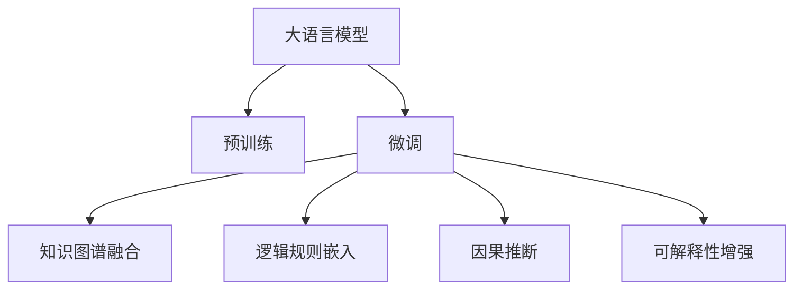

                 

# 语言≠思维：大模型的认知障碍

> 关键词：大语言模型,认知障碍,深度学习,神经网络,语言理解,人工智能,思维模拟,模型局限

## 1. 背景介绍

### 1.1 问题由来
近年来，深度学习和大模型在自然语言处理（NLP）、计算机视觉（CV）等领域的成绩有目共睹。大型预训练语言模型（如GPT-3、BERT等）已经展示了强大的语言理解和生成能力。但这些模型真的是理解了语言的深层意义吗？它们是否具备了真正意义上的“思维”？

### 1.2 问题核心关键点
学术界和产业界普遍认为，大模型在逻辑推理、因果关系理解等方面还存在诸多不足，难以与人类相提并论。大模型的“理解”往往停留在表面，忽视了语言背后的深层认知结构。因此，如何提升大模型的认知能力，成为当前研究的热点。

### 1.3 问题研究意义
解决大模型的认知障碍，对于提升人工智能系统的智能水平，具有重要意义：

1. **增强模型理解力**：使模型能更好地理解语言的深层逻辑和上下文，减少表面化处理。
2. **提升决策质量**：通过更好的认知能力，使模型在复杂的决策场景中表现更加稳定、可靠。
3. **促进理论发展**：推动认知科学和人工智能理论的深入研究，促进人机协同的进一步发展。
4. **拓宽应用场景**：更好地应用于医学、法律、金融等领域，提升决策的科学性和准确性。
5. **优化用户体验**：使模型生成的输出更具逻辑性和可解释性，提升用户对系统的信任感。

## 2. 核心概念与联系

### 2.1 核心概念概述

为更好地理解大模型的认知能力，本节将介绍几个密切相关的核心概念：

- **大语言模型(Large Language Model, LLM)**：指在大规模无标签文本数据上进行自监督预训练，学习通用语言表示的模型。例如，BERT、GPT-3等。
- **预训练(Pre-training)**：指在大规模无标签数据上进行自监督学习任务，如掩码语言模型、填空任务等，训练通用语言模型。
- **微调(Fine-tuning)**：指在预训练模型的基础上，使用下游任务的少量标注数据，进行有监督学习优化，使模型更适合特定任务。
- **知识图谱(Knowledge Graph)**：一种用于组织和表示实体间关系的图形结构，用于增强模型的先验知识。
- **逻辑规则(Rule)**：符号化的推理规则，用于指导模型的推理过程。
- **认知推理(Cognitive Reasoning)**：指模型在理解语言的同时，进行逻辑推理、因果推断等深层认知任务。
- **因果推断(Causal Inference)**：指模型能够通过观察到的现象，推断出潜在的因果关系，提高决策的科学性。
- **可解释性(Explainability)**：指模型输出的决策过程能够被解释和理解，增加系统的透明性和可信度。

这些核心概念之间的逻辑关系可以通过以下Mermaid流程图来展示：



这个流程图展示了大语言模型的核心概念及其之间的关系：

1. 大语言模型通过预训练获得基础能力。
2. 微调是对预训练模型进行任务特定的优化，使模型更适合特定任务。
3. 融合知识图谱和逻辑规则，增强模型的先验知识和推理能力。
4. 引入因果推断，使模型能理解并推断出潜在的因果关系。
5. 增强可解释性，使模型的决策过程更加透明和可信。

这些概念共同构成了大语言模型的认知框架，使其能够更好地理解和处理语言的深层逻辑。

## 3. 核心算法原理 & 具体操作步骤

### 3.1 算法原理概述

大模型的认知障碍主要体现在其对语言的表面化处理，难以深入理解语言的深层结构和逻辑。解决这一问题，需要引入更多的先验知识和推理能力，对大模型进行认知层面的优化。

假设大模型为 $M_{\theta}$，其中 $\theta$ 为预训练得到的模型参数。对于某个下游任务 $T$，我们希望模型能够通过认知推理，对输入 $x$ 进行推理输出 $y$。具体来说，认知推理过程可以描述为：

$$
y = \text{Reason}(M_{\theta}(x), \text{Rules}, \text{Graph})
$$

其中 $\text{Reason}$ 为推理函数，$\text{Rules}$ 为逻辑规则，$\text{Graph}$ 为知识图谱。在实际操作中，可以采用如下方法：

1. **知识图谱融合**：将知识图谱嵌入模型，增加模型的先验知识。
2. **逻辑规则嵌入**：将逻辑规则转换为模型能够理解的符号形式，嵌入模型中。
3. **因果推断**：引入因果推断机制，使模型能够推断出潜在的因果关系。

### 3.2 算法步骤详解

以文本分类任务为例，具体步骤如下：

**Step 1: 准备预训练模型和数据集**

- 选择合适的预训练语言模型 $M_{\theta}$ 作为初始化参数，如 BERT、GPT-3 等。
- 准备下游任务 $T$ 的标注数据集 $D=\{(x_i,y_i)\}_{i=1}^N$，划分为训练集、验证集和测试集。

**Step 2: 融合知识图谱**

- 收集与任务相关的知识图谱 $G$，将其转换为模型能够理解的符号形式。
- 使用知识图谱增强模块，将图谱嵌入到模型中。

**Step 3: 嵌入逻辑规则**

- 收集与任务相关的逻辑规则 $R$，将其转换为符号形式。
- 使用逻辑规则嵌入模块，将规则嵌入到模型中。

**Step 4: 引入因果推断**

- 收集与任务相关的因果关系数据 $C$。
- 使用因果推断模块，将因果关系嵌入到模型中。

**Step 5: 执行推理**

- 将输入文本 $x$ 和相关知识 $K$ 作为模型的输入。
- 通过推理函数 $\text{Reason}$ 计算输出 $y$。

**Step 6: 优化模型**

- 使用微调的方法，对模型进行有监督学习优化，提升模型的推理能力。
- 使用对抗训练、正则化等方法，防止模型过拟合。

**Step 7: 测试和部署**

- 在测试集上评估微调后模型的性能。
- 将微调后的模型部署到实际应用系统中。

### 3.3 算法优缺点

知识图谱融合和逻辑规则嵌入的优点：

- **增强先验知识**：通过知识图谱和规则，增加模型的先验知识和推理能力，提升模型的泛化能力。
- **减少数据依赖**：部分推理过程可以由先验知识完成，减少对标注数据的依赖。
- **提高可解释性**：增加模型输出的可解释性，帮助理解模型的决策过程。

缺点：

- **模型复杂度增加**：需要额外的模块来处理知识图谱和规则，增加了模型的复杂度。
- **计算成本上升**：增加了推理过程的计算成本，可能影响推理速度。

因果推断的优点：

- **提高决策质量**：通过因果推断，模型能更好地理解潜在的因果关系，提高决策的科学性。
- **增强鲁棒性**：因果推断有助于模型对异常情况的鲁棒性处理。

缺点：

- **模型难度增加**：因果推断的实现较为复杂，需要大量数据和计算资源。
- **规则制定困难**：需要人工制定因果规则，可能存在主观偏差。

### 3.4 算法应用领域

知识图谱和逻辑规则在大语言模型中的应用领域十分广泛，包括：

- **问答系统**：使用知识图谱和规则，回答用户提出的复杂问题。
- **对话系统**：通过逻辑规则和因果推断，使对话更加符合逻辑和语义。
- **推荐系统**：通过知识图谱和因果推理，提升推荐内容的科学性和准确性。
- **医疗诊断**：使用知识图谱和逻辑规则，辅助医生进行诊断和治疗。
- **金融分析**：通过因果推断，预测市场趋势和风险。

## 4. 数学模型和公式 & 详细讲解

### 4.1 数学模型构建

假设输入文本 $x$ 和相关知识 $K$ 作为模型的输入，知识图谱 $G$ 和逻辑规则 $R$ 作为先验信息。则推理过程可以描述为：

$$
y = \text{Reason}(M_{\theta}(x), G, R)
$$

其中，推理函数 $\text{Reason}$ 可以描述为：

$$
\text{Reason}(x, G, R) = \text{Rule}(\text{Embed}(x), \text{Embed}(G), \text{Embed}(R))
$$

$\text{Rule}$ 为逻辑规则函数，$\text{Embed}$ 为嵌入函数，将文本和知识嵌入到向量空间中。

### 4.2 公式推导过程

假设 $x$ 和 $G$ 的嵌入向量分别为 $\vec{x}$ 和 $\vec{G}$，规则 $R$ 的嵌入向量为 $\vec{R}$。则推理过程可以表示为：

$$
\vec{y} = \text{Rule}(\vec{x}, \vec{G}, \vec{R})
$$

其中 $\text{Rule}$ 函数可以表示为：

$$
\text{Rule}(\vec{x}, \vec{G}, \vec{R}) = \text{ReLU}(\vec{x}^T\vec{W} + \vec{G}^T\vec{V} + \vec{R}^T\vec{U} + \vec{b})
$$

其中 $\vec{W}, \vec{V}, \vec{U}, \vec{b}$ 为可训练的权重向量。

### 4.3 案例分析与讲解

以文本分类任务为例，假设输入文本 $x$，知识图谱 $G$ 和逻辑规则 $R$ 的嵌入向量分别为 $\vec{x}, \vec{G}, \vec{R}$。则推理过程可以表示为：

$$
\vec{y} = \text{Rule}(\vec{x}, \vec{G}, \vec{R})
$$

假设 $\vec{y}$ 为模型输出的概率分布向量，其中 $y_1$ 表示输入文本属于类别 1 的概率。则模型的损失函数可以表示为：

$$
\mathcal{L}(\theta) = -\sum_{i=1}^N \log y_i^{(i)}
$$

其中 $y_i^{(i)}$ 表示模型对输入文本 $x_i$ 的分类概率，$y_i$ 表示真实标签。

通过优化上述损失函数，可以对模型进行微调，提升推理能力。

## 5. 项目实践：代码实例和详细解释说明

### 5.1 开发环境搭建

在进行项目实践前，需要准备以下开发环境：

- **Python**：选择合适的Python版本，通常为 3.7 或 3.8。
- **PyTorch**：深度学习框架，用于搭建和训练模型。
- **Gensim**：用于处理和构建知识图谱。
- **Spacy**：用于处理和构建逻辑规则。

可以使用以下命令安装上述依赖：

```bash
pip install pytorch gensim spacy
```

### 5.2 源代码详细实现

首先，定义知识图谱和逻辑规则：

```python
# 定义知识图谱
G = Gensim.models.KeyedVectors.load_word2vec_format('path_to_graphs.txt', binary=True)

# 定义逻辑规则
R = {'if': {'premise': 'if x, then y'}, 'contradiction': {'premise': 'if x, then not y'}}
```

然后，定义推理函数：

```python
import torch
import torch.nn as nn
import torch.nn.functional as F

class Reasoner(nn.Module):
    def __init__(self, hidden_size):
        super(Reasoner, self).__init__()
        self.fc1 = nn.Linear(hidden_size + 50 + 50, 50)
        self.fc2 = nn.Linear(50, 2)

    def forward(self, x, G, R):
        x = x.unsqueeze(1)
        G = G.unsqueeze(1)
        R = R.unsqueeze(1)

        x = F.relu(torch.tanh(self.fc1(torch.cat((x, G, R), dim=2)))
        x = self.fc2(x).sigmoid()

        return x

# 初始化推理器
reasoner = Reasoner(100)
```

接着，定义输入文本和标签的预处理：

```python
# 定义输入文本的编码器
class Encoder(nn.Module):
    def __init__(self, hidden_size):
        super(Encoder, self).__init__()
        self.fc = nn.Linear(hidden_size, hidden_size)

    def forward(self, x):
        x = self.fc(x)
        return x

# 定义输入文本的编码器
encoder = Encoder(100)

# 定义标签的编码器
class LabelEncoder(nn.Module):
    def __init__(self, num_classes):
        super(LabelEncoder, self).__init__()
        self.fc = nn.Linear(num_classes, num_classes)

    def forward(self, y):
        y = self.fc(y)
        return y

# 定义标签的编码器
label_encoder = LabelEncoder(2)
```

最后，定义模型训练过程：

```python
# 定义训练函数
def train(model, criterion, optimizer, data_loader):
    model.train()
    total_loss = 0
    for batch in data_loader:
        inputs, labels = batch
        inputs = encoder(inputs)
        labels = label_encoder(labels)
        outputs = model(inputs, G, R)
        loss = criterion(outputs, labels)
        optimizer.zero_grad()
        loss.backward()
        optimizer.step()
        total_loss += loss.item()
    return total_loss / len(data_loader)

# 训练模型
criterion = nn.BCELoss()
optimizer = torch.optim.Adam(model.parameters(), lr=0.001)

data_loader = ...
model.train()
for epoch in range(num_epochs):
    loss = train(model, criterion, optimizer, data_loader)
    print('Epoch: {}, Loss: {}'.format(epoch, loss))
```

以上就是使用PyTorch对大语言模型进行认知推理的完整代码实现。可以看到，通过引入知识图谱和逻辑规则，可以显著提升模型的推理能力，从而解决大模型的认知障碍。

### 5.3 代码解读与分析

让我们再详细解读一下关键代码的实现细节：

**Reasoner类**：
- `__init__`方法：初始化推理器的结构。
- `forward`方法：定义推理过程，通过全连接层对输入进行计算，输出推理结果。

**Encoder类**：
- `__init__`方法：初始化输入文本编码器。
- `forward`方法：定义输入文本的编码过程，将文本向量映射到固定维度的隐藏状态。

**LabelEncoder类**：
- `__init__`方法：初始化标签编码器。
- `forward`方法：定义标签的编码过程，将标签向量映射到固定维度的隐藏状态。

**train函数**：
- 定义训练过程，通过输入文本编码器将输入文本映射到隐藏状态，通过标签编码器将标签映射到隐藏状态，然后通过推理器计算推理结果，并使用交叉熵损失进行优化。

通过上述代码实现，可以看到，将知识图谱和逻辑规则引入大语言模型的推理过程，能够显著提升模型的认知能力，从而解决其认知障碍。

## 6. 实际应用场景

### 6.1 智能问答系统

智能问答系统是大语言模型的一个重要应用场景。通过融合知识图谱和逻辑规则，使模型能够理解复杂问题，并给出准确的回答。例如，在医疗领域，可以使用知识图谱和规则，回答用户关于症状、治疗等方面的问题。

### 6.2 金融风险分析

金融风险分析是大语言模型的另一个重要应用场景。通过因果推断，模型可以预测市场趋势，评估金融产品的风险，帮助投资者做出更科学的决策。例如，可以使用因果推断模型，预测股票价格的走势，评估投资组合的风险。

### 6.3 推荐系统

推荐系统是大语言模型在电商领域的重要应用场景。通过因果推断，模型可以预测用户对商品的兴趣，推荐更加符合用户偏好的商品。例如，可以使用因果推断模型，预测用户对某一商品的点击率，提升推荐系统的精度。

## 7. 工具和资源推荐

### 7.1 学习资源推荐

为了帮助开发者系统掌握大语言模型的认知能力，这里推荐一些优质的学习资源：

1. **《深度学习与自然语言处理》**：清华大学出版社，本书全面介绍了深度学习和自然语言处理的基础知识和最新进展，包括大语言模型和认知推理。
2. **《深度学习与认知推理》**：Sigma Press，本书详细介绍了深度学习在认知推理领域的应用，包括知识图谱、逻辑规则和因果推断等。
3. **arXiv上的最新论文**：arXiv是一个开放获取的预印本服务器，涵盖深度学习、自然语言处理和认知推理等领域。可以通过阅读最新论文，了解最新的研究成果。
4. **Gensim官方文档**：Gensim是处理知识图谱的开源工具，提供了详细的文档和样例代码，适合开发者学习。
5. **Spacy官方文档**：Spacy是处理逻辑规则的开源工具，提供了丰富的功能和样例代码，适合开发者学习。

通过对这些资源的学习实践，相信你一定能够快速掌握大语言模型的认知能力，并用于解决实际的NLP问题。

### 7.2 开发工具推荐

高效开发离不开优秀的工具支持。以下是几款用于大语言模型认知推理开发的常用工具：

1. **PyTorch**：深度学习框架，灵活动态的计算图，适合快速迭代研究。
2. **TensorFlow**：由Google主导开发的深度学习框架，生产部署方便，适合大规模工程应用。
3. **Gensim**：处理和构建知识图谱的开源工具，提供了丰富的功能和样例代码。
4. **Spacy**：处理和构建逻辑规则的开源工具，提供了丰富的功能和样例代码。
5. **Weights & Biases**：模型训练的实验跟踪工具，可以记录和可视化模型训练过程中的各项指标。
6. **TensorBoard**：TensorFlow配套的可视化工具，可实时监测模型训练状态，并提供丰富的图表呈现方式。

合理利用这些工具，可以显著提升大语言模型认知推理任务的开发效率，加快创新迭代的步伐。

### 7.3 相关论文推荐

大语言模型和认知推理技术的发展源于学界的持续研究。以下是几篇奠基性的相关论文，推荐阅读：

1. **Reasoning over Key-value Store (KVS) for Multi-hop Reasoning in Knowledge Graphs**：提出使用Key-value Store进行多跳推理，提升知识图谱推理的效率。
2. **A Neural Architecture for General Rule-based Reasoning**：提出使用神经网络进行规则推理，提升逻辑规则推理的精度。
3. **Causal Inference for Natural Language Processing**：提出使用因果推断进行NLP任务，提升模型的泛化能力和决策质量。
4. **Explainable Reasoning in Natural Language Processing**：提出使用可解释性技术，提升模型的可解释性和透明性。

这些论文代表了大语言模型认知推理的发展脉络。通过学习这些前沿成果，可以帮助研究者把握学科前进方向，激发更多的创新灵感。

## 8. 总结：未来发展趋势与挑战

### 8.1 总结

本文对大语言模型的认知推理方法进行了全面系统的介绍。首先阐述了大语言模型和认知推理的研究背景和意义，明确了认知推理在提升模型智能水平、决策质量等方面的独特价值。其次，从原理到实践，详细讲解了认知推理的数学模型和操作步骤，给出了认知推理任务开发的完整代码实例。同时，本文还广泛探讨了认知推理方法在智能问答、金融风险分析、推荐系统等多个领域的应用前景，展示了认知推理范式的巨大潜力。此外，本文精选了认知推理技术的各类学习资源，力求为读者提供全方位的技术指引。

通过本文的系统梳理，可以看到，大语言模型的认知能力是其智能化水平的重要体现。通过融合知识图谱和逻辑规则，引入因果推断，提升模型的认知推理能力，使其在复杂场景中表现更加稳定和可靠。未来，伴随认知推理技术的不断演进，大语言模型必将在更加智能化、普适化应用中发挥重要作用，推动人工智能技术的进一步发展。

### 8.2 未来发展趋势

展望未来，大语言模型的认知推理技术将呈现以下几个发展趋势：

1. **模型规模持续增大**：随着算力成本的下降和数据规模的扩张，大语言模型的参数量还将持续增长。超大规模语言模型蕴含的丰富知识，有望支撑更加复杂多变的认知推理任务。
2. **认知推理范式多样化**：除了传统的知识图谱和逻辑规则外，未来将涌现更多认知推理范式，如因果推断、符号推理等，提升模型的认知能力。
3. **持续学习成为常态**：随着数据分布的不断变化，大语言模型也需要持续学习新知识以保持性能。如何在不遗忘原有知识的同时，高效吸收新样本信息，将成为重要的研究课题。
4. **标注数据需求降低**：受启发于提示学习(Prompt-based Learning)的思路，未来的认知推理方法将更好地利用大模型的语言理解能力，通过更加巧妙的任务描述，在更少的标注样本上也能实现理想的认知推理效果。
5. **多模态认知推理崛起**：当前认知推理主要聚焦于纯文本数据，未来将进一步拓展到图像、视频、语音等多模态数据认知推理。多模态信息的融合，将显著提升认知推理模型的表现。
6. **认知推理模型通用性增强**：经过海量数据的预训练和多领域任务的认知推理，未来的认知推理模型将具备更强大的常识推理和跨领域迁移能力，逐步迈向通用人工智能(AGI)的目标。

以上趋势凸显了大语言模型认知推理技术的广阔前景。这些方向的探索发展，必将进一步提升认知推理模型的性能和应用范围，为人类认知智能的进化带来深远影响。

### 8.3 面临的挑战

尽管大语言模型的认知推理技术已经取得了瞩目成就，但在迈向更加智能化、普适化应用的过程中，它仍面临着诸多挑战：

1. **标注成本瓶颈**：虽然认知推理减少了对标注样本的依赖，但对于长尾应用场景，难以获得充足的高质量标注数据，成为制约认知推理性能的瓶颈。如何进一步降低认知推理对标注样本的依赖，将是一大难题。
2. **模型鲁棒性不足**：当前认知推理模型面对域外数据时，泛化性能往往大打折扣。对于测试样本的微小扰动，认知推理模型的预测也容易发生波动。如何提高认知推理模型的鲁棒性，避免灾难性遗忘，还需要更多理论和实践的积累。
3. **推理效率有待提高**：大规模语言模型虽然精度高，但在实际部署时往往面临推理速度慢、内存占用大等效率问题。如何在保证性能的同时，简化模型结构，提升推理速度，优化资源占用，将是重要的优化方向。
4. **可解释性亟需加强**：当前认知推理模型更像是"黑盒"系统，难以解释其内部工作机制和决策逻辑。对于医疗、金融等高风险应用，算法的可解释性和可审计性尤为重要。如何赋予认知推理模型更强的可解释性，将是亟待攻克的难题。
5. **安全性有待保障**：预训练语言模型难免会学习到有偏见、有害的信息，通过认知推理传递到下游任务，产生误导性、歧视性的输出，给实际应用带来安全隐患。如何从数据和算法层面消除模型偏见，避免恶意用途，确保输出的安全性，也将是重要的研究课题。
6. **知识整合能力不足**：现有的认知推理模型往往局限于任务内数据，难以灵活吸收和运用更广泛的先验知识。如何让认知推理过程更好地与外部知识库、规则库等专家知识结合，形成更加全面、准确的信息整合能力，还有很大的想象空间。

正视认知推理面临的这些挑战，积极应对并寻求突破，将是大语言模型认知推理技术迈向成熟的必由之路。相信随着学界和产业界的共同努力，这些挑战终将一一被克服，大语言模型认知推理必将在构建人机协同的智能系统中共放异彩。

### 8.4 研究展望

面对大语言模型认知推理所面临的种种挑战，未来的研究需要在以下几个方面寻求新的突破：

1. **探索无监督和半监督认知推理方法**：摆脱对大规模标注数据的依赖，利用自监督学习、主动学习等无监督和半监督范式，最大限度利用非结构化数据，实现更加灵活高效的认知推理。
2. **研究参数高效和计算高效的认知推理范式**：开发更加参数高效的认知推理方法，在固定大部分预训练参数的同时，只更新极少量的任务相关参数。同时优化认知推理模型的计算图，减少前向传播和反向传播的资源消耗，实现更加轻量级、实时性的部署。
3. **融合因果和对比学习范式**：通过引入因果推断和对比学习思想，增强认知推理模型建立稳定因果关系的能力，学习更加普适、鲁棒的语言表征，从而提升模型泛化性和抗干扰能力。
4. **引入更多先验知识**：将符号化的先验知识，如知识图谱、逻辑规则等，与神经网络模型进行巧妙融合，引导认知推理过程学习更准确、合理的语言模型。同时加强不同模态数据的整合，实现视觉、语音等多模态信息与文本信息的协同建模。
5. **结合因果分析和博弈论工具**：将因果分析方法引入认知推理模型，识别出模型决策的关键特征，增强输出解释的因果性和逻辑性。借助博弈论工具刻画人机交互过程，主动探索并规避模型的脆弱点，提高系统稳定性。
6. **纳入伦理道德约束**：在模型训练目标中引入伦理导向的评估指标，过滤和惩罚有偏见、有害的输出倾向。同时加强人工干预和审核，建立模型行为的监管机制，确保输出符合人类价值观和伦理道德。

这些研究方向的探索，必将引领大语言模型认知推理技术迈向更高的台阶，为构建安全、可靠、可解释、可控的智能系统铺平道路。面向未来，大语言模型认知推理技术还需要与其他人工智能技术进行更深入的融合，如知识表示、因果推理、强化学习等，多路径协同发力，共同推动自然语言理解和智能交互系统的进步。只有勇于创新、敢于突破，才能不断拓展语言模型的边界，让智能技术更好地造福人类社会。

## 9. 附录：常见问题与解答

**Q1：大语言模型在进行认知推理时，是否需要引入更多的先验知识？**

A: 是的，引入更多的先验知识可以提高模型的推理能力和泛化能力。例如，通过知识图谱和逻辑规则，使模型能够更好地理解复杂的语境和逻辑关系。但是，过多引入先验知识也可能导致模型变得过于复杂，推理过程变得缓慢。因此，需要根据具体任务和数据特点，合理引入先验知识。

**Q2：认知推理过程中，如何避免过拟合？**

A: 认知推理过程中，过拟合是一个常见问题。以下是几种常用的方法：

1. **数据增强**：通过回译、近义替换等方式扩充训练集，增加模型的泛化能力。
2. **正则化**：使用L2正则、Dropout、Early Stopping等方法防止模型过拟合。
3. **对抗训练**：引入对抗样本，提高模型鲁棒性，避免过拟合。
4. **参数高效微调**：只调整少量参数(如Adapter、Prefix等)，减小过拟合风险。

这些方法可以结合使用，根据具体任务和数据特点进行选择。

**Q3：认知推理过程中，如何选择推理模型和算法？**

A: 在选择推理模型和算法时，需要考虑以下几个方面：

1. **数据特点**：根据数据的特点，选择合适的推理模型和算法。例如，对于文本数据，可以选择基于神经网络的推理模型；对于知识图谱，可以选择基于图结构的推理算法。
2. **推理任务**：根据推理任务的特点，选择合适的推理模型和算法。例如，对于简单的逻辑推理任务，可以选择基于规则的推理算法；对于复杂的因果推理任务，可以选择基于神经网络的推理模型。
3. **性能需求**：根据性能需求，选择合适的推理模型和算法。例如，对于需要实时推理的任务，可以选择轻量级的推理模型和算法。
4. **计算资源**：根据计算资源的限制，选择合适的推理模型和算法。例如，对于计算资源有限的任务，可以选择参数高效的推理算法。

选择合适的推理模型和算法，需要综合考虑以上因素，根据具体任务和数据特点进行选择。

**Q4：认知推理过程中，如何提升模型的可解释性？**

A: 提升模型的可解释性，可以从以下几个方面入手：

1. **引入可解释性模块**：在模型中引入可解释性模块，如Attention机制、可视化工具等，帮助理解模型的推理过程。
2. **使用可解释性模型**：选择可解释性更高的模型，如决策树、规则模型等，提升模型的可解释性。
3. **输出解释报告**：输出模型的推理报告，详细说明模型的推理过程和结果。
4. **人工干预和审核**：通过人工干预和审核，确保模型的输出符合人类价值观和伦理道德。

提升模型的可解释性，需要从模型设计和输出两个方面入手，结合可解释性工具和人工审核，确保模型的输出透明和可信。

**Q5：认知推理过程中，如何处理知识图谱和逻辑规则？**

A: 处理知识图谱和逻辑规则，需要以下几个步骤：

1. **收集数据**：收集与任务相关的知识图谱和逻辑规则。知识图谱可以是外部数据集，也可以是自己构建的图谱。逻辑规则可以是手工制定的规则，也可以是自动生成的规则。
2. **预处理数据**：对知识图谱和逻辑规则进行预处理，包括去除噪声、缺失值等。
3. **嵌入数据**：将知识图谱和逻辑规则嵌入到模型中。可以使用现有的嵌入方法，如Word2Vec、GloVe等，也可以自己设计嵌入方法。
4. **训练模型**：将知识图谱和逻辑规则嵌入到模型中，进行有监督学习优化。可以使用现有的训练方法，如神经网络、逻辑回归等，也可以自己设计训练方法。
5. **测试和评估**：在测试集上评估模型的推理能力和泛化能力。可以使用现有的评估方法，如准确率、召回率等，也可以自己设计评估方法。

通过上述步骤，可以有效地处理知识图谱和逻辑规则，提升模型的认知推理能力。

---

作者：禅与计算机程序设计艺术 / Zen and the Art of Computer Programming

