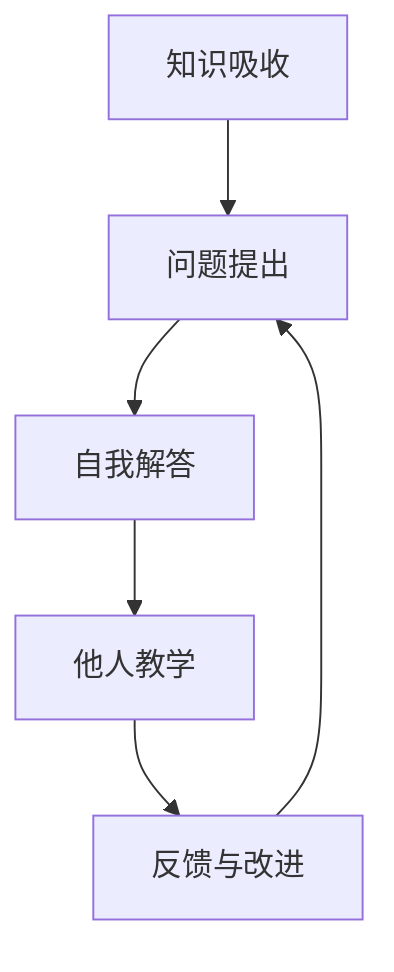

                 

## 1. 背景介绍

管理思维的提升是每一位管理者追求的永恒主题。然而，在复杂的商业环境中，信息庞杂、任务繁重、人员多样化，管理者往往难以在短时间内洞悉全局，做出明智的决策。费曼提问法（Feynman Technique），一种深度理解和掌握知识的思维方法，为管理者提供了一种行之有效的方式，帮助他们提升思维层次，应对挑战，实现质的飞跃。

### 1.1 问题由来

费曼提问法源于著名物理学家理查德·费曼（Richard Feynman）的故事。费曼在一次物理课上解释复杂的量子力学时，发现自己对所讲内容难以理解。于是他决定以教的方式进行复习，即用自己的话来讲述所学知识，以此测试自己对知识的掌握程度。通过这一过程，费曼不仅加深了对量子力学的理解，也发现了一种有效的学习方法。

在现代社会，费曼提问法被广泛应用到各个领域，包括教育、科研、工程等。对于管理者来说，费曼提问法提供了一种深入思考和知识掌握的工具，帮助他们提升思维深度，增强决策能力，从而在复杂多变的商业环境中游刃有余。

## 2. 核心概念与联系

### 2.1 核心概念概述

费曼提问法是一种基于深度理解和知识传授的学习方法。其核心思想是通过不断提问和回答，不断深入理解知识，并尝试以简洁、易懂的方式传授给他人。管理者的思维升级，同样需要这种深度理解与传授的过程，不断提升自身的专业素养和决策能力。

核心概念包括：

- **知识吸收**：通过深度阅读、调研和思考，掌握相关领域的基础知识。
- **问题提出**：基于对知识点的理解，提出具有挑战性和启发性问题。
- **自我解答**：通过深入探讨，尝试自己解答所提出的问题，验证知识的掌握程度。
- **他人教学**：将所学知识传授给他人，检验自己对知识的理解是否全面、准确。

这些概念通过一个持续的反馈循环，帮助管理者不断提升思维水平，实现自我超越。

### 2.2 核心概念原理和架构的 Mermaid 流程图



这个流程图展示了费曼提问法的核心流程：从知识吸收开始，通过问题提出和自我解答，进一步向他人教学反馈，形成不断改进的知识掌握和思维升级循环。

## 3. 核心算法原理 & 具体操作步骤

### 3.1 算法原理概述

费曼提问法本质上是一种知识传递和自我反思的过程。其核心算法原理可以概括为：

- 深入理解：通过阅读、研究、实践，掌握某一领域的核心概念、方法论和应用场景。
- 问题设定：基于对领域的深刻理解，提出具有挑战性和启发性的问题。
- 自我解答：尝试回答所提问题，验证自己对知识的掌握程度。
- 他人教学：通过向他人传授知识，进一步巩固自己的理解，并接受他人的反馈，持续改进。

### 3.2 算法步骤详解

#### 3.2.1 深入理解

1. **阅读与调研**：选择与自己工作或感兴趣的领域相关的书籍、论文、报告等资料，进行深度阅读和调研。
2. **实践应用**：通过项目实践、案例分析等方式，将所学知识应用于实际工作，加深理解。

#### 3.2.2 问题提出

1. **自问自答**：在理解基础知识的基础上，提出一些具体的、具有挑战性的问题。这些问题应该能够促使自己思考和深入理解。
2. **启发式问题**：从不同角度出发，提出一些启发式问题，引导自己进行深入思考。

#### 3.2.3 自我解答

1. **尝试回答**：在提出的问题上，尝试自己进行解答，验证自己对知识的理解是否准确、全面。
2. **反思总结**：在回答过程中，不断反思和总结，找到知识盲点和理解误区。

#### 3.2.4 他人教学

1. **教学准备**：选择一位听众，准备将所学知识以简单易懂的方式传授给他人。
2. **知识传递**：通过讲解、演示、案例分享等方式，向听众传授知识。
3. **接受反馈**：在教学过程中，鼓励听众提问和反馈，不断改进和完善自己的讲解。

### 3.3 算法优缺点

#### 3.3.1 优点

- **深入理解**：通过不断提问和回答，能够深入理解知识的本质和应用，提升专业素养。
- **自我反思**：通过自我解答和他人教学，能够及时发现知识盲点，进行反思和改进。
- **知识传播**：通过教学过程，将所学知识传递给他人，加深自己的理解，同时也帮助他人提升。

#### 3.3.2 缺点

- **时间成本**：深度学习和知识传授需要大量时间投入，对于忙碌的管理者来说，可能难以兼顾。
- **知识难度**：某些领域的问题可能过于复杂，难以短时间内掌握和解答。
- **听众反馈**：如果听众不够专业，反馈质量可能不高，影响教学效果。

### 3.4 算法应用领域

费曼提问法不仅适用于个人学习和自我提升，还广泛应用于企业培训、项目管理、团队协作等领域。

#### 3.4.1 企业培训

企业可以采用费曼提问法，通过内部培训和知识分享，提升员工的知识水平和专业素养，增强团队的协作能力和创新能力。

#### 3.4.2 项目管理

在项目管理中，费曼提问法可以帮助项目经理深入理解项目需求和技术难点，制定更有效的项目计划和解决方案。

#### 3.4.3 团队协作

通过团队内部的知识分享和交流，费曼提问法可以促进成员之间的沟通和协作，提升团队整体的思维水平和工作效率。

## 4. 数学模型和公式 & 详细讲解 & 举例说明

### 4.1 数学模型构建

费曼提问法主要关注知识掌握和思维提升的过程，其数学模型构建相对简单。以下以项目管理为例，构建一个基于费曼提问法的项目管理模型：

1. **任务理解**：将项目任务分解为若干子任务，每个子任务对应一个知识点。
2. **问题设定**：对每个子任务，提出一些具有挑战性和启发性的问题。
3. **自我解答**：在提出的问题上，尝试自己进行解答，验证对知识点的理解。
4. **他人教学**：通过团队会议或知识分享会，向团队成员传授所学知识，接受反馈，不断改进。

### 4.2 公式推导过程

以项目管理为例，假设一个项目任务被分解为 $n$ 个子任务，每个子任务对应的知识点为 $k_i$，其中 $i \in [1,n]$。每个子任务提出 $m_i$ 个问题，问题编号为 $j \in [1,m_i]$。

1. **任务理解**：将项目任务分解为子任务 $A_i = \{k_i\}$。
2. **问题设定**：对每个子任务 $A_i$，提出问题 $P_{ij}$，其中 $j \in [1,m_i]$。
3. **自我解答**：对于每个问题 $P_{ij}$，尝试自己进行解答 $D_{ij}$。
4. **他人教学**：通过团队会议或知识分享会，向团队成员传授知识，接受反馈 $F_{ij}$。

### 4.3 案例分析与讲解

假设一个软件开发项目需要管理多个模块，每个模块对应的知识点如下：

- 模块 A：面向对象编程、软件架构设计、代码风格规范
- 模块 B：数据库设计、接口设计、异常处理
- 模块 C：性能优化、单元测试、代码重构

针对每个模块，提出以下问题：

- 模块 A：如何设计一个良好的软件架构？如何遵循代码风格规范？
- 模块 B：如何设计一个高效的数据库？如何处理异常情况？
- 模块 C：如何进行代码性能优化？如何进行单元测试？

在这些问题上，尝试自己进行解答，并接受团队成员的反馈，不断改进。通过这一过程，可以全面提升团队的知识水平和项目管理能力。

## 5. 项目实践：代码实例和详细解释说明

### 5.1 开发环境搭建

要使用费曼提问法进行项目管理，首先需要搭建一个合适的开发环境。以下是一些建议：

1. **项目管理工具**：选择一款适合自己团队的项目管理工具，如Trello、JIRA等。
2. **协作平台**：使用Slack、Microsoft Teams等协作平台，方便团队成员进行实时沟通和知识分享。
3. **文档管理**：使用Google Docs、Confluence等文档管理系统，集中管理项目文档和知识库。

### 5.2 源代码详细实现

以下是一个简化的项目管理代码实现，用于记录每个任务的问题和解答：

```python
class Task:
    def __init__(self, name, knowledge_points):
        self.name = name
        self.knowledge_points = knowledge_points
        self.questions = {}
        self.answers = {}
        
    def add_question(self, question):
        self.questions[question] = None
        
    def set_answer(self, question, answer):
        self.answers[question] = answer
        
    def display_learning(self):
        print(f"Task: {self.name}")
        print("Knowledge Points:")
        for k_point in self.knowledge_points:
            print(f"- {k_point}")
        print("\nQuestions and Answers:")
        for question, answer in self.questions.items():
            if answer:
                print(f"Question: {question}")
                print(f"Answer: {answer}")
            else:
                print(f"Question: {question}")
                print("No Answer")
```

### 5.3 代码解读与分析

这段代码定义了一个Task类，用于记录任务的名称、知识点、问题和解答。通过add_question和set_answer方法，可以添加问题和解答。display_learning方法用于展示任务的学习进度和知识点掌握情况。

通过这样的代码实现，管理者和团队成员可以方便地记录和管理每个任务的学习进度，不断积累和共享知识，提升团队整体的专业素养和项目管理能力。

### 5.4 运行结果展示

假设我们有一个软件开发项目，其中包含三个模块，每个模块对应的知识点和问题如下：

```python
module_a = Task("Module A", ["面向对象编程", "软件架构设计", "代码风格规范"])
module_a.add_question("如何设计一个良好的软件架构？")
module_a.add_question("如何遵循代码风格规范？")
module_a.set_answer("如何设计一个良好的软件架构？", "设计良好的软件架构需要遵循清晰、简洁、可扩展的原则，使用设计模式和设计原则来优化系统结构。")
module_a.set_answer("如何遵循代码风格规范？", "遵循一致的代码风格规范可以提升代码的可读性和可维护性，使用PEP 8等规范来指导代码编写。")

module_b = Task("Module B", ["数据库设计", "接口设计", "异常处理"])
module_b.add_question("如何设计一个高效的数据库？")
module_b.add_question("如何处理异常情况？")
module_b.set_answer("如何设计一个高效的数据库？", "设计高效的数据库需要考虑索引、分区、缓存等技术手段，优化查询性能。")
module_b.set_answer("如何处理异常情况？", "使用try-except语句捕获异常，提供友好的错误信息和日志记录，确保系统稳定运行。")

module_c = Task("Module C", ["性能优化", "单元测试", "代码重构"])
module_c.add_question("如何进行代码性能优化？")
module_c.add_question("如何进行单元测试？")
module_c.set_answer("如何进行代码性能优化？", "使用代码分析工具识别性能瓶颈，优化算法和数据结构，使用缓存和异步处理提升性能。")
module_c.set_answer("如何进行单元测试？", "编写单元测试用例，确保代码模块的正确性和稳定性，使用测试框架如unittest等工具进行自动化测试。")

module_a.display_learning()
module_b.display_learning()
module_c.display_learning()
```

运行结果如下：

```
Task: Module A
Knowledge Points:
- 面向对象编程
- 软件架构设计
- 代码风格规范

Questions and Answers:
Question: 如何设计一个良好的软件架构？
Answer: 设计良好的软件架构需要遵循清晰、简洁、可扩展的原则，使用设计模式和设计原则来优化系统结构。
Question: 如何遵循代码风格规范？
Answer: 遵循一致的代码风格规范可以提升代码的可读性和可维护性，使用PEP 8等规范来指导代码编写。

Task: Module B
Knowledge Points:
- 数据库设计
- 接口设计
- 异常处理

Questions and Answers:
Question: 如何设计一个高效的数据库？
Answer: 设计高效的数据库需要考虑索引、分区、缓存等技术手段，优化查询性能。
Question: 如何处理异常情况？
Answer: 使用try-except语句捕获异常，提供友好的错误信息和日志记录，确保系统稳定运行。

Task: Module C
Knowledge Points:
- 性能优化
- 单元测试
- 代码重构

Questions and Answers:
Question: 如何进行代码性能优化？
Answer: 使用代码分析工具识别性能瓶颈，优化算法和数据结构，使用缓存和异步处理提升性能。
Question: 如何进行单元测试？
Answer: 编写单元测试用例，确保代码模块的正确性和稳定性，使用测试框架如unittest等工具进行自动化测试。
```

通过以上代码实现，管理者和团队成员可以方便地记录和展示每个任务的学习进度和知识点掌握情况，提升团队的专业素养和项目管理能力。

## 6. 实际应用场景

费曼提问法在实际应用中具有广泛的应用场景，以下是一些具体案例：

### 6.1 智能客服系统

智能客服系统通过自然语言处理技术，实现自动回答用户问题，提升客户服务效率和体验。使用费曼提问法，客服团队可以深入理解客户常见问题和系统功能，不断优化问答策略和系统设计。

### 6.2 金融风险管理

金融风险管理需要分析市场数据和历史案例，识别风险因素和风险趋势。通过费曼提问法，金融分析师可以深入理解市场变化和风险特征，制定更有效的风险管理策略。

### 6.3 产品开发

产品开发过程中，需要不断测试和优化产品功能，提升用户体验。使用费曼提问法，产品团队可以深入理解用户需求和技术难点，制定更有效的产品开发计划和解决方案。

## 7. 工具和资源推荐

### 7.1 学习资源推荐

为了帮助管理者系统掌握费曼提问法的应用，这里推荐一些优质的学习资源：

1. **《费曼学习法：终极思考指南》**：详细介绍了费曼学习法的原理和应用方法，适合初学者和进阶者。
2. **《深度学习与费曼学习法》**：结合深度学习和费曼学习法，探讨如何通过深度理解掌握复杂知识。
3. **《费曼学习法：如何高效掌握知识》**：介绍了费曼学习法的具体步骤和实践案例，适合职场管理者参考。

### 7.2 开发工具推荐

以下是几款常用的费曼提问法相关工具：

1. **Khan Academy**：提供在线课程和练习，帮助用户通过费曼学习法掌握知识。
2. **Duolingo**：通过游戏化的方式，让用户通过费曼学习法学习外语。
3. **Quizlet**：提供卡片式复习和测试，帮助用户巩固和检验所学知识。

### 7.3 相关论文推荐

以下是一些费曼提问法相关的经典论文，推荐阅读：

1. **《费曼学习法：如何高效掌握知识》**：介绍了费曼学习法的理论基础和应用案例，适合研究者参考。
2. **《基于费曼学习法的知识管理模型》**：提出了基于费曼学习法的知识管理模型，探讨如何通过费曼学习法提升团队知识共享和协作能力。
3. **《费曼学习法在项目管理中的应用》**：探讨了费曼学习法在项目管理中的应用，提出了项目管理知识点的设定和问题解答的框架。

## 8. 总结：未来发展趋势与挑战

### 8.1 研究成果总结

费曼提问法作为一种深度理解和知识传授的方法，具有广泛的应用价值。通过不断提问和回答，管理者可以提升思维层次，增强决策能力，提升团队整体的专业素养和协作能力。

### 8.2 未来发展趋势

展望未来，费曼提问法将继续在各个领域发挥重要作用。以下是一些发展趋势：

1. **数字化应用**：随着数字化转型的深入，费曼提问法将更多应用于数字化工具和平台，提升数字化应用的专业素养和协作能力。
2. **跨学科融合**：费曼提问法将更多应用于跨学科领域，帮助不同领域的专家更好地理解和掌握专业知识，促进跨学科合作。
3. **智能化提升**：随着人工智能技术的不断发展，费曼提问法将更多与智能化技术结合，提升知识获取和传播的效率和效果。

### 8.3 面临的挑战

尽管费曼提问法在应用中取得了显著成效，但也面临一些挑战：

1. **时间成本**：深度学习和知识传授需要大量时间投入，对于忙碌的管理者来说，可能难以兼顾。
2. **知识难度**：某些领域的问题可能过于复杂，难以短时间内掌握和解答。
3. **反馈质量**：如果听众不够专业，反馈质量可能不高，影响教学效果。

### 8.4 研究展望

为了应对这些挑战，未来的研究需要在以下几个方面寻求新的突破：

1. **时间管理**：开发更多高效的时间管理工具和方法，帮助管理者在忙碌的工作中抽出时间进行深度学习和知识传授。
2. **知识图谱**：利用知识图谱等工具，帮助管理者快速定位和理解复杂的知识点。
3. **自动化教学**：开发智能教学系统，自动生成和更新问题库，辅助管理者的知识传授过程。

## 9. 附录：常见问题与解答

**Q1: 费曼提问法如何帮助管理者提升思维层次？**

A: 费曼提问法通过不断提问和回答，深入理解知识，促进知识的掌握和应用。管理者通过这一过程，可以提升思维层次，增强决策能力，提升团队整体的专业素养和协作能力。

**Q2: 费曼提问法的优点和缺点是什么？**

A: 费曼提问法的优点包括深入理解知识、自我反思、知识传播等，帮助管理者不断提升思维层次和专业素养。缺点包括时间成本高、知识难度大、反馈质量不高等，需要管理者灵活运用和有效应对。

**Q3: 费曼提问法适用于哪些领域？**

A: 费曼提问法适用于知识密集型领域，如教育、科研、工程等。在企业管理、项目管理、团队协作等领域，费曼提问法同样具有广泛的应用价值。

通过深入理解费曼提问法的原理和操作步骤，管理者可以不断提升思维层次和决策能力，在复杂的商业环境中游刃有余。费曼提问法作为一种深度理解和知识传授的方法，将在各个领域继续发挥重要作用，助力企业的数字化转型和智能化升级。

