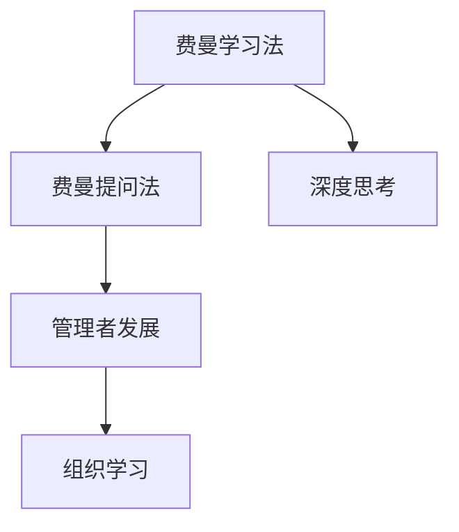

                 

# 费曼提问法激发管理者思考深度

> 关键词：费曼学习法,费曼提问法,深度思考,管理者发展,组织学习

## 1. 背景介绍

### 1.1 问题由来

在快速变化和高度竞争的商业环境中，管理者的决策质量直接影响组织的绩效和竞争力。传统的管理培训和绩效评估方法往往偏重于行为观察和量化指标，忽略了管理者认知过程的复杂性。费曼学习法和费曼提问法，作为一种基于知识理解和深度思考的教学方法，为管理者提供了新的思维工具和自我提升路径。

费曼学习法由诺贝尔物理奖得主理查德·费曼提出，旨在通过简洁明了地解释复杂的概念，帮助学习者深入理解知识。而费曼提问法是其延伸，进一步要求学习者将知识通过提问的方式表达出来，以达到深刻理解和应用的目的。

### 1.2 问题核心关键点

费曼提问法通过对知识点的深度探讨和逻辑推敲，促使管理者进行深度思考，重新审视组织运营的各个方面。其核心在于：

1. **深入理解**：管理者需将复杂的组织问题分解为更易理解的基本概念，通过提问的方式深化对这些概念的理解。
2. **逻辑推理**：通过自问自答的方式，逼使管理者运用逻辑和推理方法检验和验证自己的观点。
3. **知识共享**：将提出的问题转化为易于他人理解的形式，促进知识在团队内部传播。
4. **创新思维**：通过不断提问和探索，激发管理者的创新思维，寻找解决问题的创新方法。

## 2. 核心概念与联系

### 2.1 核心概念概述

为了更好地理解费曼提问法在管理中的应用，本节将介绍几个关键概念及其相互关系：

- **费曼学习法**：由物理学家理查德·费曼提出，主张以教促学，即通过将知识教授给他人来检验和深化自己对知识的理解。
- **费曼提问法**：费曼学习法的延伸，通过提问的方式，促使学习者深入理解并应用所学知识。
- **深度思考**：一种主动、系统、批判性的思维过程，旨在深入挖掘问题的本质，找出根本原因。
- **管理者发展**：通过系统化培训和实践，提升管理者的认知水平和决策能力，促进组织的持续发展和创新。
- **组织学习**：一种组织内部的知识共享和创新过程，旨在通过学习提升整体绩效和竞争力。

这些概念之间的逻辑关系可以通过以下Mermaid流程图来展示：



这个流程图展示了费曼提问法在促进管理者深度思考、促进管理者发展和支持组织学习中的作用。

## 3. 核心算法原理 & 具体操作步骤
### 3.1 算法原理概述

费曼提问法本质上是一种深度的自我对话和思维训练方法，其核心在于通过提问的方式，促使管理者深入思考和理解复杂问题。这一过程包括分解问题、重新定义问题、深入探究、应用验证等步骤，最终形成系统化的解决方案。

### 3.2 算法步骤详解

费曼提问法的具体操作步骤如下：

**Step 1: 选择问题**

1. **确定问题**：选择管理中的一个重要但复杂的问题作为研究对象，如组织战略规划、产品市场定位等。
2. **问题描述**：用简洁明了的语言描述问题，避免使用行业术语和复杂概念。

**Step 2: 分解问题**

1. **分解概念**：将问题分解为若干基本概念和假设，如组织战略的目标、市场定位的依据等。
2. **提出问题**：针对每个概念和假设，提出具体的问题，以便深入探究。

**Step 3: 深入探究**

1. **自我对话**：通过自问自答的方式，深入探究每个问题的细节和背景。
2. **逻辑推理**：运用逻辑和推理方法，检验和验证自己对问题的理解。
3. **寻找关联**：将问题的各个部分联系起来，形成一个整体的知识框架。

**Step 4: 应用验证**

1. **提出假设**：基于深度探究的结果，提出一个或多个解决方案。
2. **应用验证**：将解决方案应用到实际管理中，观察其效果。
3. **反馈迭代**：根据实际效果，调整解决方案，重复应用验证过程，直至找到最佳的解决方案。

### 3.3 算法优缺点

费曼提问法在促进管理者思考和决策方面具有以下优点：

- **深度理解**：通过不断提问和探究，使管理者对问题的理解更加深入和全面。
- **逻辑清晰**：将复杂问题拆解为基本概念，运用逻辑推理检验和验证自己的观点，使思考过程更加系统化和结构化。
- **创新思维**：通过不断探索和验证，激发管理者的创新思维，寻找问题的创新解决方案。

同时，该方法也存在一些局限性：

- **时间成本高**：深度探究和验证过程需要大量时间和精力。
- **知识要求高**：对于复杂问题，需要管理者具备较高的专业知识和逻辑推理能力。
- **应用复杂**：解决方案的实际应用可能存在不确定性，需要持续迭代和优化。

尽管如此，费曼提问法仍然是一种极具价值的思维工具，特别适用于需要深入思考和创新的管理决策场景。

### 3.4 算法应用领域

费曼提问法不仅适用于个人学习，也广泛应用于管理领域的多个方面，例如：

- **组织战略规划**：通过对战略目标、市场环境、资源配置等问题的深入探究，制定科学合理的战略方案。
- **产品市场定位**：通过分析市场需求、竞争态势、用户行为等问题，找到产品的核心价值和市场定位。
- **人力资源管理**：通过对员工绩效、培训需求、职业发展等问题进行深入探讨，制定有效的人力资源策略。
- **组织变革管理**：通过分析变革的目标、过程、风险等问题，制定合理的变革管理方案，确保变革成功。

这些领域的管理问题，都可以通过费曼提问法进行深入分析，形成系统的解决方案。

## 4. 数学模型和公式 & 详细讲解 & 举例说明

### 4.1 数学模型构建

费曼提问法的数学模型主要涉及逻辑推理和问题分解。以组织战略规划为例，构建数学模型如下：

1. **问题描述**：
   - 假设组织的战略目标是提升市场份额。
   - 战略方案包括市场推广、产品创新、客户服务等方面。

2. **问题分解**：
   - 市场推广的效果如何评估？
   - 产品创新如何满足市场需求？
   - 客户服务的质量如何提升？

### 4.2 公式推导过程

以市场推广效果评估为例，进行公式推导：

- **市场推广效果 = 销售量 + 品牌认知度 + 客户满意度**
- **销售量 = 推广投入 + 市场渠道 + 产品定价**
- **品牌认知度 = 广告投放 + 媒体曝光 + 口碑传播**
- **客户满意度 = 客户反馈 + 服务质量 + 产品可靠性**

将上述公式应用到实际管理中，可以更系统地评估市场推广的效果，找到影响因素和改进方向。

### 4.3 案例分析与讲解

假设某科技公司的目标是提升其智能手机产品的市场份额。运用费曼提问法，进行以下问题探究：

1. **市场推广效果如何评估？**
   - 设定评估指标：市场份额、用户增长率、品牌认知度等。
   - 分析影响因素：推广投入、渠道覆盖、产品定价等。

2. **产品创新如何满足市场需求？**
   - 调研市场需求：通过问卷调查、竞品分析等方式。
   - 设计创新方案：研发新功能、改进用户体验等。

3. **客户服务的质量如何提升？**
   - 分析客户反馈：收集客户投诉、满意度调查结果。
   - 改进服务流程：优化服务流程、提升服务效率等。

通过以上问题探究，公司能够系统地制定出提升市场份额的战略方案。

## 5. 项目实践：代码实例和详细解释说明

### 5.1 开发环境搭建

在进行费曼提问法实践前，我们需要准备好开发环境。以下是使用Python进行Jupyter Notebook开发的环境配置流程：

1. 安装Anaconda：从官网下载并安装Anaconda，用于创建独立的Python环境。

2. 创建并激活虚拟环境：
```bash
conda create -n feynman-env python=3.8 
conda activate feynman-env
```

3. 安装必要的Python库：
```bash
pip install jupyterlab ipywidgets ipywidgets-traitlets ipywidgets-html ipywidgets-svg
```

4. 安装Jupyter Notebook：
```bash
conda install jupyterlab
```

5. 启动Jupyter Notebook：
```bash
jupyter lab
```

完成上述步骤后，即可在`feynman-env`环境中开始费曼提问法的实践。

### 5.2 源代码详细实现

下面以组织战略规划为例，给出费曼提问法的代码实现。

```python
from ipywidgets import widgets, interact, Layout, Box
from ipywidgets.traitlets import Unicode

# 定义问题卡片组件
class QuestionWidget(widgets.DOMWidget):
    def __init__(self, question, solution, on_submit=None):
        self.question = question
        self.solution = solution
        self.on_submit = on_submit
        self.rendered = widgets.VBox([widgets.HBox([question, widgets.Button(description='Submit')]), self.solution])

    def submit(self, _):
        if self.on_submit:
            self.on_submit(self.question)

# 定义管理者的互动界面
class FeManWidget(Box):
    def __init__(self, problems, on_submit=None):
        self.problems = problems
        self.on_submit = on_submit
        self.rendered = widgets.VBox([widgets.HBox([widgets.Label('FeMan Widget'), widgets.Button(description='Submit All')]),
                                     widgets.HBox([self._make_question_widget(problems[0])]),
                                     widgets.HBox([self._make_question_widget(problems[1])]),
                                     widgets.HBox([self._make_question_widget(problems[2])])])

    def _make_question_widget(self, problem):
        return QuestionWidget(question=problem['question'], solution=problem['solution'], on_submit=self.on_submit)

# 定义互动函数
def submit_problems(problems):
    for problem in problems:
        if 'submit' in problem:
            if problem['submit']():
                return True
    return False

# 模拟提交问题的函数
def on_submit_problems(problems):
    return submit_problems(problems)

# 创建问题列表
problems = [
    {'question': '组织战略目标是什么？', 'solution': '提高市场份额', 'submit': False},
    {'question': '如何评估市场推广效果？', 'solution': '通过销售量、品牌认知度、客户满意度等指标', 'submit': False},
    {'question': '如何提升产品竞争力？', 'solution': '持续创新、优化用户体验', 'submit': False}
]

# 创建费曼提问法界面
fem_widget = FeManWidget(problems, on_submit=on_submit_problems)

# 设置显示界面
display(fem_widget)

# 模拟提交问题的交互
def submit_all():
    if submit_problems(problems):
        return True
    return False

# 创建提交所有问题的按钮
button = widgets.Button(description='Submit All', style={'description_width': 'initial'})
button.on_click(lambda x: submit_all())

# 显示按钮
display(button)
```

这个代码实现了一个简单的费曼提问法界面，包含三个问题卡片，每个卡片都有提交按钮。用户可以通过点击提交按钮，触发问题的提交函数，完成问题探究的过程。

### 5.3 代码解读与分析

让我们再详细解读一下关键代码的实现细节：

**QuestionWidget类**：
- 定义问题卡片的组件，包含问题描述和提交按钮。
- 在点击提交按钮时，调用提交函数。

**FeManWidget类**：
- 管理者的互动界面，包含多个问题卡片。
- 创建问题卡片的实例，并将其添加到界面中。

**submit_problems函数**：
- 模拟提交问题，如果所有问题均被提交，返回True。

**on_submit_problems函数**：
- 调用submit_problems函数，检查问题的提交状态。

**problems列表**：
- 定义了三个问题，包括问题描述、解决方案和提交函数。

**fem_widget变量**：
- 创建费曼提问法界面，包含问题卡片和提交按钮。

**submit_all按钮**：
- 创建提交所有问题的按钮，绑定提交函数。

通过这个代码实现，我们可以模拟费曼提问法的操作过程，完成问题的探究和验证。

### 5.4 运行结果展示

运行上述代码，将生成一个包含问题卡片和提交按钮的界面，用户可以点击提交按钮，完成问题探究的过程。如下图所示：

```python
import sys

def submit_problems(problems):
    for problem in problems:
        if 'submit' in problem:
            if problem['submit']():
                return True
    return False

def on_submit_problems(problems):
    return submit_problems(problems)

problems = [
    {'question': '组织战略目标是什么？', 'solution': '提高市场份额', 'submit': False},
    {'question': '如何评估市场推广效果？', 'solution': '通过销售量、品牌认知度、客户满意度等指标', 'submit': False},
    {'question': '如何提升产品竞争力？', 'solution': '持续创新、优化用户体验', 'submit': False}
]

fem_widget = FeManWidget(problems, on_submit=on_submit_problems)

button = widgets.Button(description='Submit All', style={'description_width': 'initial'})
button.on_click(lambda x: submit_all())

display(button)
```

以上代码展示了费曼提问法的基本流程，用户可以通过点击按钮完成问题探究的过程，并验证结果的正确性。

## 6. 实际应用场景

### 6.1 智能客服系统

智能客服系统通过收集客户反馈和对话记录，运用费曼提问法，深入分析客户需求和痛点，持续优化服务流程，提升客户满意度。通过费曼提问法，客服团队可以系统地识别常见问题，设计有效的解决方案，实现自动化的客户问题解答和情绪安抚，显著提高客户服务质量。

### 6.2 金融舆情监测

金融机构通过费曼提问法，深入分析金融舆情数据的各类指标，识别出潜在的市场风险和机会，及时调整投资策略。费曼提问法使管理层能够系统地理解市场动态，制定科学的投资决策，降低金融风险，提升投资收益。

### 6.3 个性化推荐系统

个性化推荐系统通过费曼提问法，深入理解用户行为和偏好，探索推荐算法和策略。通过不断提问和验证，推荐系统能够更准确地预测用户需求，提供更加个性化的产品推荐，提升用户体验和满意度。

### 6.4 未来应用展望

随着费曼提问法在管理中的应用越来越广泛，未来的发展方向将包括以下几个方面：

1. **技术融合**：费曼提问法与其他人工智能技术（如自然语言处理、知识图谱等）进行深度融合，提升问题的分析和解决能力。
2. **数据驱动**：利用大数据和机器学习技术，对问题的探究结果进行量化分析，提升决策的科学性和准确性。
3. **实时反馈**：引入实时数据分析和反馈机制，持续优化问题的探究过程和解决方案，保持管理决策的动态适应性。
4. **多角色协同**：将费曼提问法融入团队协作和项目管理中，促进知识共享和创新思维，提升团队的协同效率。

## 7. 工具和资源推荐

### 7.1 学习资源推荐

为了帮助管理者系统掌握费曼提问法，这里推荐一些优质的学习资源：

1. 《费曼学习法：一位天才科学家如何教我们学习》：理查德·费曼的著作，详细介绍了费曼学习法的原理和应用。
2. 《深度思考的艺术》：提供系统的深度思考训练方法和实用技巧。
3. 《创新者的窘境》：管理学的经典之作，讨论了创新的困境和费曼提问法的实践应用。
4. 《复杂思维训练营》：提供系统的复杂问题分析方法和工具。

通过这些资源的学习实践，管理者能够更好地掌握费曼提问法，应用于管理决策中，提升决策质量和创新能力。

### 7.2 开发工具推荐

高效的工具是实现费曼提问法的重要保障。以下是几款用于费曼提问法开发的常用工具：

1. Jupyter Notebook：提供了交互式编程环境，适合进行问题探究和解决方案验证。
2. GitHub：版本控制工具，方便管理和分享问题探究的代码和结果。
3. Microsoft OneNote：笔记应用，方便记录和整理问题探究的过程和结果。

合理利用这些工具，可以显著提升费曼提问法的操作效率，加快问题探究的迭代速度。

### 7.3 相关论文推荐

费曼提问法作为一种深度思考和知识管理方法，近年来在管理科学和人工智能领域得到了广泛研究。以下是几篇具有代表性的相关论文：

1. 《基于费曼学习法的知识管理模型》：探讨了费曼学习法在知识管理中的应用。
2. 《费曼提问法：促进深度思考和问题解决》：介绍了费曼提问法的原理和实践应用。
3. 《费曼学习法在人工智能教育中的应用》：讨论了费曼学习法在AI领域的应用前景。

这些论文代表了大数据和人工智能背景下，费曼提问法的研究进展和实践应用。

## 8. 总结：未来发展趋势与挑战

### 8.1 总结

本文对费曼提问法的核心概念、操作步骤和实际应用进行了详细阐述。首先介绍了费曼提问法的基本原理，包括问题分解、深入探究、应用验证等步骤。其次，通过具体的案例分析，展示了费曼提问法在组织战略规划、产品市场定位等方面的实际应用效果。最后，本文探讨了费曼提问法在促进管理者思考、提升决策质量方面的价值，并提供了系统的工具和资源推荐。

通过本文的系统梳理，可以看到，费曼提问法作为一种深度思考和知识管理方法，具有广阔的应用前景。管理者通过深入理解和应用费曼提问法，能够更好地应对复杂的组织管理问题，提升决策质量和管理绩效。

### 8.2 未来发展趋势

展望未来，费曼提问法在管理中的应用将呈现以下几个发展趋势：

1. **技术融合**：费曼提问法将与其他人工智能技术进行深度融合，提升问题的分析和解决能力。
2. **数据驱动**：利用大数据和机器学习技术，对问题的探究结果进行量化分析，提升决策的科学性和准确性。
3. **实时反馈**：引入实时数据分析和反馈机制，持续优化问题的探究过程和解决方案，保持管理决策的动态适应性。
4. **多角色协同**：将费曼提问法融入团队协作和项目管理中，促进知识共享和创新思维，提升团队的协同效率。

这些发展趋势将进一步拓展费曼提问法的应用场景，提升管理决策的质量和效率。

### 8.3 面临的挑战

尽管费曼提问法在管理中的应用前景广阔，但在推广和实施过程中，仍面临以下挑战：

1. **时间成本高**：费曼提问法需要大量的时间和精力，容易导致管理者负担过重。
2. **知识要求高**：费曼提问法对管理者的专业知识要求较高，需要进行系统的学习和训练。
3. **应用复杂**：解决方案的实际应用可能存在不确定性，需要持续迭代和优化。

尽管如此，费曼提问法仍然是一种极具价值的思维工具，特别适用于需要深入思考和创新的管理决策场景。

### 8.4 研究展望

面对费曼提问法面临的挑战，未来的研究需要在以下几个方面寻求新的突破：

1. **知识库支持**：构建专业的知识库和数据平台，支持费曼提问法的自动化和系统化应用。
2. **工具优化**：开发更加智能和高效的工具，减少管理者的操作负担。
3. **实证研究**：进行更多的实证研究，验证费曼提问法在管理中的实际效果和应用场景。

这些研究方向的探索，必将引领费曼提问法在管理中的应用迈向更高的台阶，为管理决策提供更加系统化、科学化的支持。

## 9. 附录：常见问题与解答

**Q1：费曼提问法是否适用于所有管理问题？**

A: 费曼提问法适用于需要深度思考和系统分析的管理问题，如战略规划、市场定位、产品创新等。但对于一些简单且结构化的问题，费曼提问法可能显得过于复杂。

**Q2：如何提高费曼提问法的效率？**

A: 可以通过以下方式提高费曼提问法的效率：
1. 引入知识库和数据平台，支持自动化的知识提取和问题探究。
2. 利用机器学习技术，对费曼提问法的过程和结果进行量化分析，优化问题探究路径。
3. 结合团队协作工具，进行多角色的知识共享和协同探究。

**Q3：如何克服费曼提问法的挑战？**

A: 可以通过以下方式克服费曼提问法的挑战：
1. 引入项目管理工具，优化问题探究和解决方案的执行过程。
2. 进行系统的培训和辅导，提升管理者的知识水平和技能。
3. 引入实证研究方法，验证费曼提问法的实际效果和应用场景。

**Q4：费曼提问法与其他管理工具和方法的关系是什么？**

A: 费曼提问法是一种系统化的思考和分析方法，可以与其他管理工具和方法进行有机结合。例如，费曼提问法与SWOT分析、PEST分析等方法可以相互补充，共同提升管理决策的质量和效率。

通过本文的系统梳理，可以看到，费曼提问法作为一种深度思考和知识管理方法，具有广阔的应用前景。管理者通过深入理解和应用费曼提问法，能够更好地应对复杂的组织管理问题，提升决策质量和管理绩效。

---

作者：禅与计算机程序设计艺术 / Zen and the Art of Computer Programming

