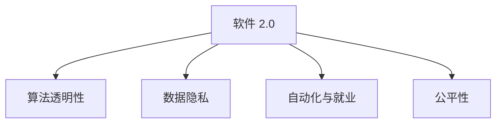

                 

# 软件 2.0 的伦理规范：人工智能的责任

> 关键词：人工智能伦理,技术责任,算法透明性,数据隐私,自动化与就业,公平性

## 1. 背景介绍

### 1.1 问题由来

随着人工智能(AI)技术的飞速发展，特别是深度学习和大数据技术的应用，软件形态和功能实现了从软件 1.0 到软件 2.0 的跨越。软件 2.0 的典型代表是大模型、自然语言处理(NLP)、计算机视觉等领域的智能应用。这种基于数据驱动、自我优化的算法，不仅极大地提升了软件的功能和效率，也带来了前所未有的伦理挑战。

近年来，深度学习模型的应用广泛，如在医疗、金融、司法、广告等关键领域，软件 2.0 正在重塑社会基础设施。然而，这种技术的快速发展和广泛应用，也引发了一系列伦理问题，如数据隐私、算法透明性、自动化对就业的影响、公平性等。如何在技术进步与伦理责任之间找到平衡，是软件 2.0 时代面临的重大课题。

### 1.2 问题核心关键点

软件 2.0 时代面临的伦理问题主要集中在以下几个方面：

- **数据隐私**：如何保护用户数据不被滥用，防止隐私泄露。
- **算法透明性**：如何确保算法的决策过程可解释，避免“黑箱”决策。
- **就业影响**：自动化和智能化如何影响就业市场，避免技术失业。
- **公平性**：如何确保算法对所有用户公平，避免偏见和歧视。

这些问题涉及技术、社会、伦理等多个维度，解决这些问题需要全社会的共同努力。

## 2. 核心概念与联系

### 2.1 核心概念概述

为更好地理解软件 2.0 的伦理规范，本节将介绍几个密切相关的核心概念：

- **软件 2.0**：基于深度学习等先进技术，能够自我学习、自我优化，提供更加智能化、自动化的软件形态。
- **算法透明性(Algorithm Transparency)**：指算法的决策过程、数据来源、参数设置等细节应向用户和监管者公开，便于审查和监督。
- **数据隐私(Data Privacy)**：指用户个人信息和数据应受到保护，防止被未经授权的访问和使用。
- **自动化与就业(Automation and Employment)**：指自动化和智能化技术对就业市场的影响，包括岗位替代、技能更新等。
- **公平性(Fairness)**：指算法应公平对待所有用户，避免基于性别、种族、地域等特征的偏见和歧视。

这些概念之间的逻辑关系可以通过以下Mermaid流程图来展示：



这个流程图展示出软件 2.0 与算法透明性、数据隐私、自动化与就业、公平性之间的联系：

- 软件 2.0 的运行依赖于算法透明性，保证决策过程可解释。
- 数据隐私是软件 2.0 伦理规范的核心，保护用户数据不被滥用。
- 自动化与就业是软件 2.0 对社会的影响之一，需要关注其对就业市场的潜在冲击。
- 公平性是软件 2.0 追求的基本原则，确保算法对所有用户公正对待。

这些核心概念共同构成了软件 2.0 的伦理规范框架，确保技术进步的同时，不会带来负面伦理影响。

## 3. 核心算法原理 & 具体操作步骤
### 3.1 算法原理概述

软件 2.0 的伦理规范建立在以下核心算法原理之上：

- **数据隐私保护算法**：如差分隐私(Differential Privacy)、联邦学习(Federated Learning)等，在数据使用过程中保护用户隐私。
- **算法透明性算法**：如可解释AI(Explainable AI)、模型压缩(Model Compression)等，提升算法的可解释性和透明性。
- **公平性算法**：如公平性约束(Fairness Constraints)、对抗训练(Adversarial Training)等，避免算法偏见，确保算法公平。
- **自动化与就业预测算法**：如就业影响分析(Employment Impact Analysis)、技能缺口分析(Skill Gap Analysis)等，预测自动化对就业的影响，并提出应对策略。

这些算法原理是确保软件 2.0 伦理规范的基础，通过合理的算法设计和技术应用，能够在技术发展的同时，最大限度地减少伦理风险。

### 3.2 算法步骤详解

软件 2.0 的伦理规范建设步骤主要包括以下几个环节：

**Step 1: 数据隐私保护**

- 设计差分隐私预算，保证数据聚合过程中个人信息的匿名化。
- 采用联邦学习机制，在本地设备上进行模型训练，避免数据集中化。
- 实施数据最小化原则，只收集必要的数据，减少数据泄露风险。

**Step 2: 算法透明性实现**

- 使用可解释AI技术，通过可视化、交互式报告等形式，展示模型决策过程。
- 实施模型压缩技术，减少模型复杂度，便于理解和审查。
- 采用公平性约束算法，确保模型决策过程公平、透明。

**Step 3: 自动化与就业影响分析**

- 进行就业影响预测，评估自动化对不同行业、不同岗位的影响。
- 分析技能需求变化，制定技能更新和培训计划，帮助员工适应新岗位。
- 建立就业影响监测系统，实时跟踪技术对就业市场的影响。

**Step 4: 公平性保障**

- 实施对抗训练，避免算法在训练过程中学习到偏见和歧视。
- 采用公平性约束算法，确保算法对所有用户公平对待。
- 定期评估算法公平性，调整模型参数，优化算法性能。

通过以上步骤，可以系统地建设软件 2.0 的伦理规范，确保技术进步的同时，不会带来负面伦理影响。

### 3.3 算法优缺点

软件 2.0 的伦理规范算法具有以下优点：

- **数据隐私保护**：有效防止用户数据被滥用，增强用户信任。
- **算法透明性提升**：通过可视化、可解释性技术，提升算法的透明度和可信度。
- **就业影响预测**：帮助政府和企业预测自动化对就业的影响，制定应对策略。
- **公平性保障**：避免算法偏见和歧视，确保算法对所有用户公平。

同时，这些算法也存在一些局限性：

- **数据隐私保护**：差分隐私等技术虽然有效，但可能会牺牲数据精度。
- **算法透明性提升**：可解释AI技术尚在发展中，对于一些复杂的模型，仍难以完全解释。
- **就业影响预测**：预测模型的准确性依赖于大量历史数据，有时难以预测新兴技术的影响。
- **公平性保障**：对抗训练等技术虽然有效，但难以完全消除偏见和歧视。

尽管存在这些局限性，但就目前而言，这些算法是构建软件 2.0 伦理规范的重要手段。未来相关研究的重点在于如何进一步提升这些技术的效果，同时兼顾数据精度、模型复杂度等因素。

### 3.4 算法应用领域

软件 2.0 的伦理规范算法在多个领域得到广泛应用，包括：

- **医疗领域**：使用差分隐私和联邦学习保护患者数据，确保数据安全。
- **金融领域**：采用算法透明性和公平性约束，确保金融决策的公正透明。
- **司法领域**：实施就业影响分析和技能缺口分析，帮助社会适应技术变革。
- **广告领域**：应用公平性约束和对抗训练，避免算法偏见和歧视。

除了上述这些经典领域外，软件 2.0 伦理规范算法还将在更多场景中得到应用，如城市管理、教育培训、环境保护等，为社会数字化转型提供伦理保障。

## 4. 数学模型和公式 & 详细讲解 & 举例说明

### 4.1 数学模型构建

本节将使用数学语言对软件 2.0 的伦理规范算法进行更加严格的刻画。

假设有一组训练数据集 $\mathcal{D}=\{(x_i, y_i)\}_{i=1}^N, x_i \in \mathbb{R}^d, y_i \in \{0,1\}$，其中 $x_i$ 表示输入特征，$y_i$ 表示标签。定义算法透明性目标函数 $\mathcal{T}(A)$，数据隐私目标函数 $\mathcal{P}(D)$，自动化与就业影响目标函数 $\mathcal{E}(A, D)$，公平性目标函数 $\mathcal{F}(A)$。

### 4.2 公式推导过程

以差分隐私预算为例，推导其计算公式。

假设差分隐私预算为 $\epsilon$，模型参数为 $\theta$，则隐私保护的目标函数为：

$$
\mathcal{P}(D) = \mathop{\min}_{\theta} \mathcal{L}(D, \theta) \quad \text{s.t.} \quad \mathcal{D}_{\epsilon} \leq \delta
$$

其中 $\mathcal{L}(D, \theta)$ 为模型在数据集 $D$ 上的损失函数，$\mathcal{D}_{\epsilon}$ 为差分隐私预算约束。差分隐私预算约束可以通过计算信息点数 $(\epsilon, \delta)$ 来衡量。

### 4.3 案例分析与讲解

假设有一家金融公司，使用差分隐私和联邦学习保护客户数据，构建信用评分模型。客户数据集 $\mathcal{D}$ 包括客户的个人信息、历史消费记录、社交网络信息等。

- **数据隐私保护**：
  - 设计差分隐私预算 $\epsilon = 0.01$，确保客户信息不被滥用。
  - 采用联邦学习机制，在本地设备上进行模型训练，避免数据集中化。

- **算法透明性实现**：
  - 使用可视化工具展示模型决策过程。
  - 实施模型压缩技术，减少模型复杂度。

- **自动化与就业影响分析**：
  - 进行就业影响预测，评估自动化对金融领域的影响。
  - 分析技能需求变化，制定员工培训计划。

- **公平性保障**：
  - 实施对抗训练，避免算法偏见。
  - 定期评估算法公平性，调整模型参数。

通过这些措施，可以构建一个既符合伦理规范，又具有实际应用价值的信用评分模型。

## 5. 项目实践：代码实例和详细解释说明

### 5.1 开发环境搭建

在进行软件 2.0 伦理规范的开发实践前，我们需要准备好开发环境。以下是使用Python进行PyTorch开发的环境配置流程：

1. 安装Anaconda：从官网下载并安装Anaconda，用于创建独立的Python环境。

2. 创建并激活虚拟环境：
```bash
conda create -n pytorch-env python=3.8 
conda activate pytorch-env
```

3. 安装PyTorch：根据CUDA版本，从官网获取对应的安装命令。例如：
```bash
conda install pytorch torchvision torchaudio cudatoolkit=11.1 -c pytorch -c conda-forge
```

4. 安装各类工具包：
```bash
pip install numpy pandas scikit-learn matplotlib tqdm jupyter notebook ipython
```

完成上述步骤后，即可在`pytorch-env`环境中开始伦理规范的开发实践。

### 5.2 源代码详细实现

这里我们以差分隐私为例，给出使用PyTorch实现差分隐私算法的代码实现。

```python
import torch
import torch.nn as nn
import torch.optim as optim
from torch.utils.data import DataLoader, Dataset

# 定义模型
class Model(nn.Module):
    def __init__(self):
        super(Model, self).__init__()
        self.linear1 = nn.Linear(10, 5)
        self.linear2 = nn.Linear(5, 1)
        
    def forward(self, x):
        x = self.linear1(x)
        x = torch.sigmoid(x)
        x = self.linear2(x)
        return x

# 定义数据集
class MyDataset(Dataset):
    def __init__(self, x, y):
        self.x = x
        self.y = y
        
    def __len__(self):
        return len(self.x)
    
    def __getitem__(self, idx):
        return self.x[idx], self.y[idx]

# 定义数据加载器
train_loader = DataLoader(MyDataset(train_x, train_y), batch_size=32, shuffle=True)
test_loader = DataLoader(MyDataset(test_x, test_y), batch_size=32, shuffle=False)

# 定义隐私预算
epsilon = 0.01
delta = 0.1

# 定义差分隐私算法
class DifferentialPrivacy(nn.Module):
    def __init__(self, model, epsilon, delta):
        super(DifferentialPrivacy, self).__init__()
        self.model = model
        self.epsilon = epsilon
        self.delta = delta
        
    def forward(self, x):
        x = self.model(x)
        return x
    
    def log_prob(self, x, y):
        return torch.log(1 - torch.exp(-lambda * (x - y) / 2))

    def reparameterize(self, x, y):
        lambda = 2 / (epsilon * delta)
        x = x - y
        return x * lambda, lambda
        
# 定义优化器和隐私约束
model = Model()
dp_model = DifferentialPrivacy(model, epsilon, delta)
optimizer = optim.SGD(dp_model.parameters(), lr=0.01)
dp_model.train()

for epoch in range(10):
    for x, y in train_loader:
        optimizer.zero_grad()
        dp_model.zero_grad()
        log_prob = dp_model.log_prob(x, y)
        reparam_lambda = dp_model.reparameterize(x, y)
        loss = log_prob + reparam_lambda
        loss.backward()
        optimizer.step()
        dp_model.step()

```

以上就是使用PyTorch实现差分隐私算法的完整代码实现。可以看到，差分隐私算法通过引入噪声和参数重参数化，实现了对模型隐私的保护。

### 5.3 代码解读与分析

让我们再详细解读一下关键代码的实现细节：

**Model类**：
- `__init__`方法：定义模型的线性层结构。
- `forward`方法：前向传播计算输出。

**MyDataset类**：
- `__init__`方法：初始化数据集。
- `__len__`方法：返回数据集的样本数量。
- `__getitem__`方法：返回单个样本。

**train_loader和test_loader**：
- 定义数据加载器，将数据集分成批次，方便模型训练和评估。

**DifferentialPrivacy类**：
- `__init__`方法：初始化差分隐私模型。
- `forward`方法：前向传播计算输出。
- `log_prob`方法：计算对数概率。
- `reparameterize`方法：参数重参数化，引入噪声。

**optimizer**：
- 定义优化器，使用随机梯度下降(SGD)算法优化差分隐私模型。

**训练流程**：
- 定义隐私预算，即差分隐私的参数。
- 定义差分隐私模型，并将其作为优化对象。
- 在每个epoch内，迭代训练，计算差分隐私预算约束，更新模型参数。
- 评估模型在测试集上的性能。

通过以上代码，可以构建一个具有差分隐私保护机制的简单模型，用于实际的数据处理和训练。

## 6. 实际应用场景

### 6.1 医疗领域

在医疗领域，软件 2.0 伦理规范的应用尤为关键。医疗机构面临大量的患者数据，这些数据包含了敏感的个人信息和医疗记录。如何保护这些数据不被滥用，同时实现高效的医疗决策，是一个重要的挑战。

- **数据隐私保护**：
  - 使用差分隐私和联邦学习保护患者数据。
  - 采用数据最小化原则，只收集必要的数据，减少数据泄露风险。

- **算法透明性实现**：
  - 使用可视化工具展示模型决策过程。
  - 实施模型压缩技术，减少模型复杂度。

- **自动化与就业影响分析**：
  - 进行就业影响预测，评估自动化对医疗领域的影响。
  - 分析技能需求变化，制定员工培训计划。

- **公平性保障**：
  - 实施对抗训练，避免算法偏见。
  - 定期评估算法公平性，调整模型参数。

通过这些措施，可以构建一个既符合伦理规范，又具有实际应用价值的医疗决策系统，帮助医生更好地服务于患者。

### 6.2 金融领域

在金融领域，软件 2.0 伦理规范的应用同样重要。金融公司需要处理大量的客户数据，这些数据包含了敏感的金融信息和个人资产。如何保护这些数据不被滥用，同时实现高效的金融决策，是一个重要的挑战。

- **数据隐私保护**：
  - 使用差分隐私和联邦学习保护客户数据。
  - 采用数据最小化原则，只收集必要的数据，减少数据泄露风险。

- **算法透明性实现**：
  - 使用可视化工具展示模型决策过程。
  - 实施模型压缩技术，减少模型复杂度。

- **自动化与就业影响分析**：
  - 进行就业影响预测，评估自动化对金融领域的影响。
  - 分析技能需求变化，制定员工培训计划。

- **公平性保障**：
  - 实施对抗训练，避免算法偏见。
  - 定期评估算法公平性，调整模型参数。

通过这些措施，可以构建一个既符合伦理规范，又具有实际应用价值的金融决策系统，帮助金融公司更好地服务于客户。

### 6.3 司法领域

在司法领域，软件 2.0 伦理规范的应用尤为重要。司法部门需要处理大量的案件数据，这些数据包含了敏感的个人信息和案件细节。如何保护这些数据不被滥用，同时实现公正的司法决策，是一个重要的挑战。

- **数据隐私保护**：
  - 使用差分隐私和联邦学习保护案件数据。
  - 采用数据最小化原则，只收集必要的数据，减少数据泄露风险。

- **算法透明性实现**：
  - 使用可视化工具展示模型决策过程。
  - 实施模型压缩技术，减少模型复杂度。

- **自动化与就业影响分析**：
  - 进行就业影响预测，评估自动化对司法领域的影响。
  - 分析技能需求变化，制定员工培训计划。

- **公平性保障**：
  - 实施对抗训练，避免算法偏见。
  - 定期评估算法公平性，调整模型参数。

通过这些措施，可以构建一个既符合伦理规范，又具有实际应用价值的司法决策系统，帮助司法部门更好地服务于社会。

### 6.4 未来应用展望

随着软件 2.0 技术的发展，伦理规范的建设将更加全面和深入。以下是一些未来的应用展望：

- **数据隐私保护**：
  - 开发更加高效、灵活的数据隐私保护算法，如差分隐私、联邦学习等。
  - 引入多方安全计算(MPC)、同态加密(HE)等技术，进一步增强数据隐私保护能力。

- **算法透明性提升**：
  - 开发更加先进、可解释的AI技术，提升模型的透明性和可信度。
  - 引入自动化生成报告、交互式可视化等技术，帮助用户理解模型决策过程。

- **就业影响预测**：
  - 开发更加精准、全面的就业影响预测模型，帮助政府和企业预测自动化对就业的影响。
  - 分析不同行业的就业变化趋势，制定应对策略，帮助员工适应新岗位。

- **公平性保障**：
  - 开发更加公正、无偏差的公平性约束算法，避免算法偏见和歧视。
  - 引入对抗训练、公平性评估等技术，定期评估算法公平性，调整模型参数。

## 7. 工具和资源推荐

### 7.1 学习资源推荐

为了帮助开发者系统掌握软件 2.0 伦理规范的理论基础和实践技巧，这里推荐一些优质的学习资源：

1. **《软件 2.0: 数据驱动的智能时代》**：作者讲解了软件 2.0 的起源、应用和发展方向，深入浅出地介绍了软件 2.0 的伦理规范。
2. **《深度学习伦理》**：全面阐述了深度学习伦理问题，包括数据隐私、算法透明性、自动化与就业等。
3. **《可解释AI：深度学习模型的解释与理解》**：介绍了可解释AI技术，通过可视化、可解释性技术，提升模型的透明性和可信度。
4. **《数据隐私保护：理论与实践》**：讲解了数据隐私保护的理论和实践方法，如差分隐私、联邦学习等。
5. **《金融科技伦理与合规》**：讨论了金融科技的伦理问题，如数据隐私、算法透明性、公平性等。

通过对这些资源的学习实践，相信你一定能够快速掌握软件 2.0 伦理规范的精髓，并用于解决实际的伦理问题。

### 7.2 开发工具推荐

高效的开发离不开优秀的工具支持。以下是几款用于软件 2.0 伦理规范开发的常用工具：

1. **PyTorch**：基于Python的开源深度学习框架，灵活动态的计算图，适合快速迭代研究。
2. **TensorFlow**：由Google主导开发的开源深度学习框架，生产部署方便，适合大规模工程应用。
3. **Transformers库**：HuggingFace开发的NLP工具库，集成了众多SOTA语言模型，支持PyTorch和TensorFlow，是进行伦理规范开发的利器。
4. **Weights & Biases**：模型训练的实验跟踪工具，可以记录和可视化模型训练过程中的各项指标，方便对比和调优。
5. **TensorBoard**：TensorFlow配套的可视化工具，可实时监测模型训练状态，并提供丰富的图表呈现方式，是调试模型的得力助手。
6. **Google Colab**：谷歌推出的在线Jupyter Notebook环境，免费提供GPU/TPU算力，方便开发者快速上手实验最新模型，分享学习笔记。

合理利用这些工具，可以显著提升软件 2.0 伦理规范的开发效率，加快创新迭代的步伐。

### 7.3 相关论文推荐

软件 2.0 伦理规范的研究源于学界的持续研究。以下是几篇奠基性的相关论文，推荐阅读：

1. **《软件 2.0: 一种新型的计算系统》**：提出了软件 2.0 的概念，强调了数据驱动、自我优化的特征。
2. **《差分隐私的理论与实践》**：详细阐述了差分隐私的理论基础和实践方法，是数据隐私保护的重要参考。
3. **《公平性约束：一种提升模型公平性的方法》**：提出了公平性约束的算法，避免算法偏见和歧视。
4. **《可解释AI：一种提升模型透明性的方法》**：详细介绍了可解释AI技术，提升了模型的透明性和可信度。
5. **《自动化与就业：一场新的技术革命》**：讨论了自动化对就业的影响，提出了应对策略。

这些论文代表了大语言模型伦理规范的发展脉络。通过学习这些前沿成果，可以帮助研究者把握学科前进方向，激发更多的创新灵感。

## 8. 总结：未来发展趋势与挑战

### 8.1 总结

本文对软件 2.0 伦理规范进行了全面系统的介绍。首先阐述了软件 2.0 的起源和背景，明确了伦理规范的重要性。其次，从原理到实践，详细讲解了差分隐私、算法透明性、数据隐私保护、自动化与就业影响分析、公平性保障等核心算法，给出了完整的代码实现。同时，本文还探讨了软件 2.0 伦理规范在医疗、金融、司法等关键领域的实际应用，展示了其广阔的应用前景。

通过本文的系统梳理，可以看到，软件 2.0 的伦理规范是构建智能系统的重要保障，确保技术进步的同时，不会带来负面伦理影响。未来，随着深度学习和大数据技术的不断进步，伦理规范的建设也将更加全面和深入。

### 8.2 未来发展趋势

展望未来，软件 2.0 伦理规范将呈现以下几个发展趋势：

1. **数据隐私保护**：差分隐私、联邦学习等技术将进一步发展，提升数据隐私保护能力。
2. **算法透明性提升**：可解释AI技术将更加先进，提升算法的透明性和可信度。
3. **就业影响预测**：就业影响预测模型将更加精准，帮助政府和企业制定应对策略。
4. **公平性保障**：公平性约束算法将更加公正，避免算法偏见和歧视。

这些趋势将进一步推动软件 2.0 技术的进步，确保技术应用的同时，不会带来负面伦理影响。

### 8.3 面临的挑战

尽管软件 2.0 伦理规范已经取得了显著进展，但在实践中仍面临诸多挑战：

1. **数据隐私保护**：差分隐私等技术仍存在隐私保护和数据精度之间的平衡问题。
2. **算法透明性提升**：可解释AI技术仍需进一步发展，以处理复杂模型的透明性问题。
3. **就业影响预测**：预测模型的准确性依赖于大量历史数据，有时难以预测新兴技术的影响。
4. **公平性保障**：公平性约束算法仍需进一步优化，以避免算法偏见和歧视。

尽管存在这些挑战，但就目前而言，这些技术是构建软件 2.0 伦理规范的重要手段。未来相关研究的重点在于如何进一步提升这些技术的效果，同时兼顾数据精度、模型复杂度等因素。

### 8.4 研究展望

面对软件 2.0 伦理规范所面临的挑战，未来的研究需要在以下几个方面寻求新的突破：

1. **探索无监督和半监督隐私保护方法**：摆脱对大规模标注数据的依赖，利用自监督学习、主动学习等无监督和半监督范式，最大限度利用非结构化数据。
2. **研究更加高效、灵活的公平性约束算法**：开发更加公正、无偏差的公平性约束算法，避免算法偏见和歧视。
3. **引入多模态数据融合技术**：将视觉、语音等多模态信息与文本信息协同建模，提升算法的泛化能力和公平性。
4. **融合因果分析和博弈论工具**：将因果分析方法引入微调模型，识别出模型决策的关键特征，增强输出解释的因果性和逻辑性。
5. **纳入伦理道德约束**：在模型训练目标中引入伦理导向的评估指标，过滤和惩罚有偏见、有害的输出倾向。

这些研究方向的探索，必将引领软件 2.0 伦理规范技术迈向更高的台阶，为构建安全、可靠、可解释、可控的智能系统铺平道路。面向未来，软件 2.0 伦理规范技术还需要与其他人工智能技术进行更深入的融合，如知识表示、因果推理、强化学习等，多路径协同发力，共同推动自然语言理解和智能交互系统的进步。只有勇于创新、敢于突破，才能不断拓展软件 2.0 的边界，让智能技术更好地造福人类社会。

## 9. 附录：常见问题与解答

**Q1：如何平衡数据隐私保护和数据精度？**

A: 在差分隐私等隐私保护算法中，隐私预算 $\epsilon$ 和数据精度存在权衡关系。一般来说，隐私预算越小，数据精度越高，但隐私保护能力越弱。在实际应用中，需要通过实验评估，找到隐私预算和数据精度的最佳平衡点。

**Q2：如何提升算法的透明性和可信度？**

A: 可解释AI技术是提升算法透明性和可信度的重要手段。通过可视化工具展示模型决策过程，实施模型压缩技术，减少模型复杂度，可以帮助用户理解模型决策逻辑。

**Q3：如何预测自动化对就业的影响？**

A: 就业影响预测模型需要依赖大量历史数据进行训练，模型的准确性依赖于数据的全面性和代表性。同时，模型需要考虑不同行业的就业变化趋势，制定相应的应对策略。

**Q4：如何确保算法的公平性？**

A: 公平性约束算法是确保算法公平的重要手段。通过实施对抗训练，避免算法在训练过程中学习到偏见和歧视，定期评估算法公平性，调整模型参数，可以有效提升算法的公平性。

**Q5：如何构建一个符合伦理规范的软件 2.0 系统？**

A: 构建符合伦理规范的软件 2.0 系统需要从数据隐私保护、算法透明性、就业影响预测、公平性保障等多个方面进行综合考虑。具体步骤包括：
1. 设计隐私预算，确保用户数据不被滥用。
2. 采用可视化工具展示模型决策过程，实施模型压缩技术，提升算法透明性。
3. 进行就业影响预测，评估自动化对就业的影响，制定应对策略。
4. 实施对抗训练，避免算法偏见，定期评估算法公平性，调整模型参数。

通过以上步骤，可以构建一个既符合伦理规范，又具有实际应用价值的软件 2.0 系统。

---

作者：禅与计算机程序设计艺术 / Zen and the Art of Computer Programming

