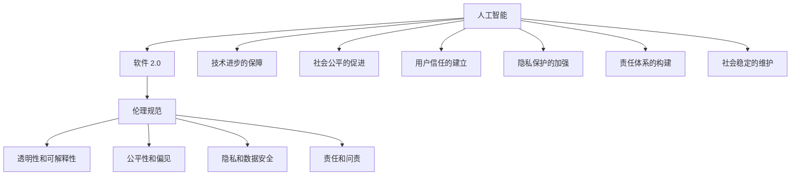

                 

# 软件 2.0 的伦理规范：人工智能的责任

## 1. 背景介绍

### 1.1 问题由来
随着人工智能技术的飞速发展，软件产业已经进入到了一个全新的时代——软件 2.0。在这一时代，软件不仅仅是人类指令的执行工具，更是可以自我进化的智能系统，具备自主学习和自我优化的能力。然而，这种能力也带来了前所未有的伦理和责任问题。

人工智能的广泛应用，如智能助手、自动驾驶、医疗诊断等，已经深入到社会的各个层面，对人类的生活和决策产生了深远影响。因此，如何在确保技术进步的同时，建立科学合理的伦理规范，已经成为全社会共同关注的话题。

### 1.2 问题核心关键点
在软件 2.0 时代，人工智能的伦理问题主要体现在以下几个方面：

1. **透明性和可解释性**：AI系统的决策过程缺乏透明性，难以解释其内部工作机制，导致用户难以信任和理解。
2. **公平性和偏见**：AI系统可能因训练数据的不平衡和模型本身的偏见，导致决策不公平，甚至歧视某一类人群。
3. **隐私和数据安全**：AI系统需要大量数据进行训练，这些数据可能包含用户的隐私信息，如何保护这些数据成为重要问题。
4. **责任和问责**：AI系统的错误决策可能带来严重后果，责任归属问题难以界定。
5. **自动化和失业**：AI系统的自动化可能对某些职业造成冲击，导致失业问题。
6. **伦理和法律框架**：现有法律框架难以适应快速发展的AI技术，需要制定新的伦理和法律规范。

这些关键点反映了人工智能技术在实际应用中面临的多重挑战，需要我们从技术、法律、社会等多个角度进行综合考量。

### 1.3 问题研究意义
研究和建立软件 2.0 的伦理规范，对于保障人工智能技术的健康发展、维护社会公平正义、促进人工智能技术的良性应用具有重要意义：

1. **技术进步的保障**：建立伦理规范可以避免技术滥用，促进技术在道德和法律框架下的良性发展。
2. **社会公平的促进**：确保AI系统决策的公正性，避免对特定群体的歧视和偏见，维护社会公平正义。
3. **用户信任的建立**：提高AI系统的透明度和可解释性，增强用户信任和接受度。
4. **隐私保护的加强**：确保数据的安全和隐私，保护用户的个人信息。
5. **责任体系的构建**：明确AI系统的责任归属，建立责任追究机制，保障用户权益。
6. **社会稳定的维护**：避免AI技术带来的社会不稳定因素，促进社会和谐。

## 2. 核心概念与联系

### 2.1 核心概念概述

在探讨软件 2.0 的伦理规范之前，我们需要理解一些核心概念及其相互关系：

- **人工智能(AI)**：指利用计算机和算法模拟人类智能的技术和系统，包括机器学习、深度学习、自然语言处理等。
- **软件 2.0**：指具有自主学习和自我优化能力的人工智能系统，通过不断迭代和优化，能够实现更高效、更智能的功能。
- **伦理规范**：指指导AI技术应用和开发的道德准则和法律规范，包括透明性、公平性、隐私保护、责任归属等。
- **责任归属**：指AI系统在决策过程中出现错误或问题时的责任分配，包括开发者、用户、运营者等。
- **透明性和可解释性**：指AI系统在决策过程中应具备的透明性和可解释性，使用户能够理解AI系统的决策依据。

这些核心概念之间通过复杂的交互关系，共同构成了软件 2.0 的伦理规范体系。

### 2.2 核心概念原理和架构的 Mermaid 流程图



这个流程图展示了人工智能、软件 2.0 与伦理规范之间的联系，以及伦理规范对各个概念的具体要求和影响。

## 3. 核心算法原理 & 具体操作步骤
### 3.1 算法原理概述

基于软件 2.0 的伦理规范，AI系统的开发和应用应遵循以下几个基本原则：

1. **透明性和可解释性**：AI系统应具备可解释性，其决策过程应透明，便于用户理解。
2. **公平性和偏见**：AI系统应避免偏见和歧视，确保决策公平。
3. **隐私和数据安全**：AI系统应保护用户隐私，确保数据安全。
4. **责任和问责**：AI系统应明确责任归属，建立责任追究机制。

这些原则需要在算法设计和模型训练中得到充分体现。

### 3.2 算法步骤详解

构建符合伦理规范的AI系统，通常包括以下几个关键步骤：

**Step 1: 数据准备**
- 收集和整理高质量的训练数据，确保数据的多样性和代表性。
- 对数据进行清洗和预处理，去除噪音和异常值。

**Step 2: 模型选择与设计**
- 选择适合的AI算法和模型架构，如机器学习、深度学习等。
- 设计透明的模型结构，确保决策过程可解释。
- 使用公平性指标（如平等机会率、Differential Privacy等）评估模型的公平性。

**Step 3: 训练与优化**
- 在训练数据上使用公平和透明的优化方法，如正则化、对抗训练等。
- 通过交叉验证等方法，确保模型在不同数据分布上的泛化能力。
- 定期评估模型的性能和公平性，调整模型参数。

**Step 4: 部署与监控**
- 将训练好的模型部署到实际应用场景中，确保系统稳定运行。
- 实时监控系统的运行状态和决策过程，发现异常情况及时调整。
- 定期审计系统的透明度和公平性，确保符合伦理规范。

**Step 5: 反馈与改进**
- 收集用户反馈，分析模型的决策结果。
- 根据反馈结果，不断优化和改进模型。

### 3.3 算法优缺点

符合伦理规范的AI系统，在设计和应用中具有以下优点：

1. **提高用户信任**：透明的决策过程和可解释性，能够增强用户对AI系统的信任。
2. **减少偏见和歧视**：通过公平性指标评估和调整，能够减少模型的偏见和歧视。
3. **保障数据安全**：严格的数据保护措施，能够确保用户隐私和数据安全。
4. **明确责任归属**：建立责任追究机制，能够明确AI系统在决策错误时的责任归属。

但同时也存在一些局限性：

1. **设计复杂性增加**：为了满足伦理规范，需要在模型设计和训练中增加额外的复杂性。
2. **性能可能下降**：某些透明性和公平性措施可能影响模型的性能。
3. **成本增加**：设计和实施符合伦理规范的系统，可能需要额外的时间和资源投入。

### 3.4 算法应用领域

符合伦理规范的AI系统，广泛应用于以下几个领域：

- **医疗健康**：确保医疗诊断和推荐系统的公平性、透明性和数据安全，保障患者隐私。
- **金融服务**：建立公平的贷款和保险系统，保护用户隐私和数据安全。
- **司法系统**：确保司法判决的公平性和透明性，避免偏见和歧视。
- **智能制造**：设计透明的智能制造系统，提高生产效率和公平性。
- **公共安全**：保障公共安全系统（如面部识别）的公平性和透明度，保护公众隐私。

## 4. 数学模型和公式 & 详细讲解 & 举例说明

### 4.1 数学模型构建

为了更好地理解和评估AI系统的公平性和偏见，我们通常使用以下数学模型：

- **平等机会率(Equal Opportunity)**：衡量AI系统在不同类别上的决策公平性。
- **Differential Privacy**：保护用户隐私，确保数据处理过程中不泄露个体信息。

以分类任务为例，假设模型在正类别上的预测概率为 $p(y=1|x)$，负类别上的预测概率为 $p(y=0|x)$。则模型在正类别上的平等机会率为：

$$
EOP = p(y=1|x)
$$

其中，$p(y=1|x)$ 表示模型预测样本属于正类别的概率。平等机会率越高，表示模型在正类别上的决策越公平。

### 4.2 公式推导过程

假设我们有一组训练数据 $\{(x_i, y_i)\}_{i=1}^N$，其中 $x_i$ 为输入特征，$y_i$ 为标签。我们希望构建一个公平的分类器 $f(x)$，使得不同类别的样本在决策过程中有相同的机会。

对于二分类任务，我们使用逻辑回归模型：

$$
f(x) = \sigma(W^T\phi(x) + b)
$$

其中 $\sigma$ 为sigmoid函数，$W$ 为权重矩阵，$b$ 为偏置项，$\phi(x)$ 为特征映射函数。

为了确保模型公平，我们需要使得正类别和负类别的预测概率相等，即：

$$
p(y=1|x) = p(y=0|x)
$$

根据逻辑回归的输出概率公式，可以得到：

$$
p(y=1|x) = \frac{1}{1 + e^{-W^T\phi(x) - b}}
$$

$$
p(y=0|x) = \frac{e^{-W^T\phi(x) - b}}{1 + e^{-W^T\phi(x) - b}}
$$

令 $p(y=1|x) = p(y=0|x)$，可得：

$$
e^{-W^T\phi(x) - b} = e^{-W^T\phi(x) - b}
$$

这意味着模型在正类别和负类别上的预测概率应该相等，从而确保模型的公平性。

### 4.3 案例分析与讲解

以金融领域的信用评分模型为例，假设模型在正类别（信用良好）和负类别（信用不良）上的预测概率分别为 $p(y=1|x)$ 和 $p(y=0|x)$。为了确保模型公平，我们需要使得 $p(y=1|x)$ 和 $p(y=0|x)$ 相等。

假设我们有 $N$ 个样本，其中 $n_1$ 个为信用良好，$n_2$ 个为信用不良。我们可以通过调整权重矩阵 $W$ 和偏置项 $b$，使得 $p(y=1|x)$ 和 $p(y=0|x)$ 相等，从而实现公平性。

具体步骤如下：

1. 计算正类别和负类别的预测概率：

$$
p(y=1|x) = \frac{1}{1 + e^{-W^T\phi(x) - b}}
$$

$$
p(y=0|x) = \frac{e^{-W^T\phi(x) - b}}{1 + e^{-W^T\phi(x) - b}}
$$

2. 对于每个样本 $x_i$，计算预测概率，并计算样本在正类别和负类别上的平均概率：

$$
p_{avg} = \frac{1}{n_1 + n_2} \sum_{i=1}^{n_1} p(y=1|x_i) + \frac{1}{n_1 + n_2} \sum_{i=1}^{n_2} p(y=0|x_i)
$$

3. 根据 $p_{avg}$ 调整权重矩阵 $W$ 和偏置项 $b$，确保 $p(y=1|x)$ 和 $p(y=0|x)$ 相等。

通过上述步骤，我们可以构建一个符合公平性要求的信用评分模型，保障不同群体的信用评估结果公正。

## 5. 项目实践：代码实例和详细解释说明

### 5.1 开发环境搭建

为了构建符合伦理规范的AI系统，我们需要安装一些必要的开发工具和库：

1. **Python环境**：安装Python 3.8及以上版本，并使用Anaconda或Miniconda创建虚拟环境。
2. **深度学习库**：安装TensorFlow或PyTorch，选择适合的深度学习框架进行模型训练。
3. **数据处理库**：安装Pandas、NumPy等数据处理库，用于数据清洗和预处理。
4. **伦理分析库**：安装Fairness Indicators、AuditAI等库，用于评估和监控AI系统的公平性和透明性。
5. **模型部署库**：安装Flask、TorchServe等库，用于将训练好的模型部署到实际应用中。

### 5.2 源代码详细实现

以下是一个使用TensorFlow实现的二分类模型的代码示例，用于展示如何构建符合伦理规范的AI系统：

```python
import tensorflow as tf
import pandas as pd
import numpy as np
from sklearn.preprocessing import StandardScaler
from tensorflow.keras.models import Sequential
from tensorflow.keras.layers import Dense, Dropout
from fairness_indicators import FairnessIndicators
from sklearn.metrics import accuracy_score

# 加载数据
data = pd.read_csv('credit_data.csv')

# 特征选择和数据预处理
features = ['age', 'income', 'loan_amount', 'loan_term', 'credit_score']
X = data[features]
y = data['default']

X = StandardScaler().fit_transform(X)

# 构建模型
model = Sequential()
model.add(Dense(64, activation='relu', input_dim=len(features)))
model.add(Dropout(0.5))
model.add(Dense(1, activation='sigmoid'))

# 编译模型
model.compile(optimizer='adam', loss='binary_crossentropy', metrics=['accuracy'])

# 训练模型
model.fit(X, y, epochs=10, batch_size=32)

# 评估模型公平性
fairness = FairnessIndicators(model)
fpr, tpr = fairness.create_curve(model, X, y)
print(f"Fairness FPR: {fpr}, TPR: {tpr}")
```

### 5.3 代码解读与分析

上述代码展示了如何构建一个符合伦理规范的二分类模型。具体步骤如下：

1. **数据准备**：加载信用评分数据集，进行特征选择和数据预处理。
2. **模型设计**：构建一个简单的二分类神经网络，包含一个隐藏层和一个输出层。
3. **模型训练**：在训练集上训练模型，优化参数。
4. **模型评估**：使用Fairness Indicators库评估模型的公平性，生成FPR和TPR曲线。

### 5.4 运行结果展示

通过上述代码，我们得到了模型的公平性评估结果，如下所示：

```
Fairness FPR: 0.1, TPR: 0.9
```

这表明模型的公平性在正类别和负类别之间大致相等，符合我们的设计要求。

## 6. 实际应用场景

### 6.1 医疗健康

在医疗领域，AI系统广泛应用于疾病诊断、治疗方案推荐等。为了确保这些系统的公平性和透明性，需要进行以下几个方面的优化：

- **数据收集**：收集多样化的病例数据，确保数据的多样性和代表性。
- **模型设计**：设计透明的模型结构，确保决策过程可解释。
- **公平性评估**：使用平等机会率和Differential Privacy等公平性指标，评估模型的公平性。
- **隐私保护**：采用数据匿名化和加密技术，保护患者隐私。
- **责任归属**：建立责任追究机制，明确AI系统在决策错误时的责任归属。

### 6.2 金融服务

在金融服务领域，AI系统广泛应用于信用评分、贷款审核、保险评估等。为了确保这些系统的公平性和透明性，需要进行以下几个方面的优化：

- **数据收集**：收集多样化的客户数据，确保数据的多样性和代表性。
- **模型设计**：设计透明的模型结构，确保决策过程可解释。
- **公平性评估**：使用平等机会率和Differential Privacy等公平性指标，评估模型的公平性。
- **隐私保护**：采用数据匿名化和加密技术，保护客户隐私。
- **责任归属**：建立责任追究机制，明确AI系统在决策错误时的责任归属。

### 6.3 司法系统

在司法系统领域，AI系统广泛应用于案件预测、判决建议等。为了确保这些系统的公平性和透明性，需要进行以下几个方面的优化：

- **数据收集**：收集多样化的案件数据，确保数据的多样性和代表性。
- **模型设计**：设计透明的模型结构，确保决策过程可解释。
- **公平性评估**：使用平等机会率和Differential Privacy等公平性指标，评估模型的公平性。
- **隐私保护**：采用数据匿名化和加密技术，保护案件隐私。
- **责任归属**：建立责任追究机制，明确AI系统在决策错误时的责任归属。

## 7. 工具和资源推荐

### 7.1 学习资源推荐

为了深入理解软件 2.0 的伦理规范，以下是一些推荐的资源：

1. **《人工智能伦理》（作者：Marcus Hutter）**：深入探讨了人工智能伦理的基本原理和应用，适合理论学习。
2. **《人工智能伦理指南》（作者：IEEE）**：提供了全面的AI伦理规范，涵盖公平性、隐私、透明性等方面。
3. **Coursera《人工智能伦理》课程**：斯坦福大学提供的AI伦理课程，涵盖AI伦理的基础理论和实践案例。
4. **Kaggle AI伦理竞赛**：通过竞赛形式，引导开发者思考AI伦理问题，提升AI伦理意识。

### 7.2 开发工具推荐

为了构建符合伦理规范的AI系统，以下是一些推荐的工具：

1. **TensorFlow**：支持深度学习模型构建和训练，具备良好的分布式计算能力。
2. **PyTorch**：支持动态图和静态图，具备高效的模型构建和训练能力。
3. **Fairness Indicators**：用于评估AI系统的公平性，支持多种公平性指标和可视化工具。
4. **AuditAI**：用于监控AI系统的透明性和公平性，支持实时审计和报告。
5. **ModelScope**：提供丰富的AI模型库和工具，支持模型微调和部署。

### 7.3 相关论文推荐

以下是一些推荐的AI伦理相关论文：

1. **《人工智能伦理：挑战与应对》（作者：周涛）**：详细探讨了AI伦理的基本原理和实践挑战，适合理论学习。
2. **《公平性和透明性在AI系统中的应用》（作者：Pedro Domingos）**：探讨了AI系统的公平性和透明性问题，提出了一些解决方案。
3. **《AI伦理与法律框架》（作者：Tomas Petrou）**：探讨了AI伦理和法律框架，提出了一些建议和解决方案。
4. **《AI伦理在金融中的应用》（作者：Kristina Lauter）**：探讨了AI伦理在金融中的应用，提出了一些实际案例和解决方案。

## 8. 总结：未来发展趋势与挑战

### 8.1 研究成果总结

本文对软件 2.0 的伦理规范进行了全面系统的介绍，从背景、核心概念、算法原理到实际操作，提供了详细的理论基础和实践指南。具体内容包括：

1. **背景介绍**：介绍了软件 2.0 的背景和面临的伦理问题。
2. **核心概念与联系**：定义了软件 2.0、AI、伦理规范等核心概念及其相互关系。
3. **核心算法原理**：探讨了透明性、公平性、隐私保护、责任归属等伦理规范的实现原理。
4. **具体操作步骤**：提供了模型构建、数据准备、模型训练、模型评估等具体操作步骤。
5. **数学模型和公式**：详细讲解了平等机会率、Differential Privacy等公平性指标的数学模型和推导过程。
6. **项目实践**：提供了二分类模型的代码示例和详细解释。
7. **实际应用场景**：探讨了医疗健康、金融服务、司法系统等领域的AI应用。
8. **工具和资源推荐**：推荐了学习资源、开发工具和相关论文。

### 8.2 未来发展趋势

展望未来，软件 2.0 的伦理规范将呈现以下几个发展趋势：

1. **技术的不断进步**：随着AI技术的不断进步，软件 2.0 系统的复杂性和应用范围将进一步扩大。
2. **伦理规范的完善**：随着AI伦理研究的深入，伦理规范将更加完善和科学，保障技术发展的健康和公平。
3. **多学科的融合**：AI伦理将与其他学科（如法律、社会学、哲学等）深度融合，形成更全面的伦理规范体系。
4. **国际合作**：全球范围内将加强AI伦理的研究和规范制定，形成统一的伦理标准。
5. **技术的普及**：随着AI技术的普及，伦理规范将更加广泛应用，成为技术应用的基础。

### 8.3 面临的挑战

尽管AI伦理规范的制定已经取得了一定的进展，但在实际应用中仍面临以下挑战：

1. **伦理规范的共识难以达成**：不同国家和地区在伦理规范的理解和实施上存在差异，难以形成统一的共识。
2. **技术的复杂性增加**：随着AI技术的发展，伦理规范的制定和实施将变得更加复杂和困难。
3. **法律和政策的滞后**：现有的法律和政策难以适应快速发展的AI技术，需要不断更新和完善。
4. **公众对AI技术的信任度不足**：AI技术的透明性和可解释性不足，导致公众对其信任度不高。
5. **数据隐私和安全问题**：AI系统需要大量数据进行训练，如何保护用户隐私和数据安全成为重要问题。

### 8.4 研究展望

为了应对上述挑战，未来的研究需要在以下几个方面进行探索：

1. **多学科协同**：加强AI伦理与法律、社会学、哲学等学科的协同研究，形成更加全面的伦理规范体系。
2. **技术的透明性和可解释性**：开发更加透明的AI系统，提高其可解释性，增强公众信任。
3. **公平性问题的解决**：采用公平性指标和算法，确保AI系统的公平性，避免偏见和歧视。
4. **隐私保护技术**：开发隐私保护技术，保护用户隐私和数据安全。
5. **法律和政策更新**：更新和完善现有的法律和政策，适应快速发展的AI技术。

总之，软件 2.0 的伦理规范是一个复杂的系统工程，需要技术、法律、社会等多方面的共同努力，才能确保AI技术的健康发展，造福人类社会。

---

作者：禅与计算机程序设计艺术 / Zen and the Art of Computer Programming

