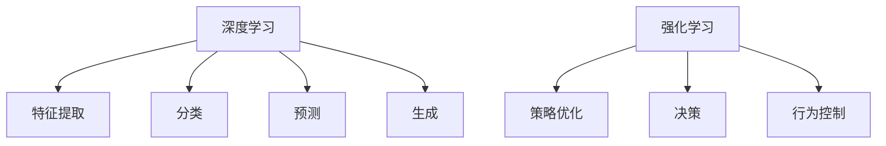

                 

## 1. 背景介绍

随着计算机技术的飞速发展，软件已经从传统的1.0时代，即基于规则和操作系统的软件，逐步进化为2.0时代，即基于数据和算法的智能软件。在2.0时代，深度学习和强化学习成为了推动软件发展的两大核心引擎。它们通过数据分析和算法优化，使得软件系统能够进行自我学习和改进，从而实现更高的智能水平。本文将深入探讨深度学习与强化学习的发展趋势，以及它们在未来软件2.0时代中的应用前景。

## 2. 核心概念与联系

### 2.1 核心概念概述

深度学习（Deep Learning）是一种基于神经网络，通过多层次的特征提取和抽象，实现复杂数据模式识别的机器学习方法。其核心思想是通过大量标注数据对模型进行训练，使其能够自动学习并提取数据中的高层次特征，从而实现对数据的准确分类、预测和生成。

强化学习（Reinforcement Learning）是一种通过与环境交互，学习最优策略的机器学习方法。其核心思想是通过奖励机制和策略迭代，使智能体能够在不断尝试中优化行为，最终实现目标最大化。

深度学习与强化学习之间有着密切的联系。深度学习可以提供数据驱动的特征提取能力，而强化学习则能够提供目标驱动的行为优化能力。两者相互补充，共同构建起智能软件2.0时代的核心基础。

### 2.2 核心概念原理和架构的 Mermaid 流程图



深度学习通过多层次的神经网络，实现对输入数据的自动特征提取，从而使得模型能够学习到数据中的高层次抽象。强化学习则通过智能体与环境的交互，实现对目标任务的自动优化。两者在功能上相互补充，共同构建起智能软件2.0时代的基础。

## 3. 核心算法原理 & 具体操作步骤

### 3.1 算法原理概述

深度学习的核心是多层神经网络，通过反向传播算法实现参数优化。其基本步骤如下：

1. 数据预处理：对输入数据进行归一化、标准化等处理，确保数据适合输入网络。
2. 模型定义：定义神经网络的结构，包括输入层、隐藏层、输出层等。
3. 损失函数计算：定义损失函数，衡量模型预测与真实标签之间的差异。
4. 参数优化：使用梯度下降等优化算法，最小化损失函数，更新模型参数。
5. 模型评估：在测试集上评估模型性能，确保模型泛化能力。

强化学习的核心是智能体与环境的交互，通过奖励机制实现策略优化。其基本步骤如下：

1. 环境定义：定义智能体与环境交互的规则。
2. 策略选择：选择初始策略，如随机策略或固定策略。
3. 状态感知：智能体感知环境状态，获取状态信息。
4. 动作执行：智能体根据当前状态，选择并执行动作。
5. 奖励获取：智能体根据执行动作的结果，获得环境奖励。
6. 策略更新：根据奖励和状态信息，更新智能体的策略。
7. 策略评估：在验证集上评估智能体策略，确保策略收敛。

### 3.2 算法步骤详解

#### 深度学习

1. 数据预处理：
   ```python
   from sklearn.preprocessing import StandardScaler
   scaler = StandardScaler()
   X_train = scaler.fit_transform(X_train)
   X_test = scaler.transform(X_test)
   ```

2. 模型定义：
   ```python
   from keras.models import Sequential
   from keras.layers import Dense, Dropout

   model = Sequential()
   model.add(Dense(64, activation='relu', input_dim=X_train.shape[1]))
   model.add(Dropout(0.5))
   model.add(Dense(32, activation='relu'))
   model.add(Dropout(0.5))
   model.add(Dense(1, activation='sigmoid'))
   ```

3. 损失函数计算：
   ```python
   model.compile(loss='binary_crossentropy', optimizer='adam', metrics=['accuracy'])
   ```

4. 参数优化：
   ```python
   model.fit(X_train, y_train, epochs=100, batch_size=32, validation_data=(X_test, y_test))
   ```

5. 模型评估：
   ```python
   score = model.evaluate(X_test, y_test, verbose=0)
   print('Test loss:', score[0])
   print('Test accuracy:', score[1])
   ```

#### 强化学习

1. 环境定义：
   ```python
   import gym

   env = gym.make('CartPole-v1')
   ```

2. 策略选择：
   ```python
   import numpy as np

   class RandomAgent:
       def __init__(self, env):
           self.env = env
           self.action_space = env.action_space
           self.observation_space = env.observation_space

       def act(self, observation):
           return self.action_space.sample()
   ```

3. 状态感知：
   ```python
   observation = env.reset()
   ```

4. 动作执行：
   ```python
   action = RandomAgent.act(observation)
   observation, reward, done, info = env.step(action)
   ```

5. 奖励获取：
   ```python
   reward = env.reward()
   ```

6. 策略更新：
   ```python
   # 根据奖励和状态信息，更新策略
   ```

7. 策略评估：
   ```python
   # 在验证集上评估智能体策略
   ```

### 3.3 算法优缺点

#### 深度学习

**优点**：
- 自动特征提取：深度学习能够自动提取数据中的高层次特征，无需手动设计特征。
- 高精度：深度学习在许多任务上取得了高精度的结果。
- 泛化能力强：深度学习模型具有较强的泛化能力，能够处理未见过的数据。

**缺点**：
- 训练时间长：深度学习模型需要大量标注数据和计算资源进行训练。
- 黑盒模型：深度学习模型难以解释其内部工作机制，难以调试和优化。
- 过拟合风险：深度学习模型容易出现过拟合，需要大量的正则化技术进行控制。

#### 强化学习

**优点**：
- 自适应性强：强化学习模型能够自适应环境变化，适应性强。
- 策略优化：强化学习能够通过策略迭代，不断优化策略，达到最优解。
- 通用性强：强化学习可以应用于各种场景，如游戏、机器人控制等。

**缺点**：
- 训练过程复杂：强化学习训练过程需要大量的试错和反馈，训练复杂度较高。
- 状态空间大：强化学习在处理高维状态空间时，可能存在维度灾难问题。
- 数据要求高：强化学习需要大量的试错数据，数据要求较高。

### 3.4 算法应用领域

深度学习已经在计算机视觉、自然语言处理、语音识别等多个领域取得了显著成果，广泛应用于图像分类、语音识别、机器翻译等任务。其应用领域还在不断扩展，如自动驾驶、医学影像分析、智能推荐系统等。

强化学习则在游戏、机器人控制、自适应系统等领域表现出色。例如，AlphaGo通过强化学习在围棋比赛中战胜了人类顶尖选手。未来，强化学习有望在更多高复杂度领域，如金融交易、自动驾驶等，实现突破。

## 4. 数学模型和公式 & 详细讲解 & 举例说明

### 4.1 数学模型构建

#### 深度学习

深度学习通常使用多层神经网络模型，其基本结构为：

- 输入层：输入数据的特征向量
- 隐藏层：多层的神经元，用于特征提取
- 输出层：根据任务需求，可以是分类、回归或生成等

数学模型构建的关键在于损失函数的选择和优化算法的设计。

#### 强化学习

强化学习的核心在于定义智能体与环境的交互规则，通过状态、动作、奖励等信息实现策略优化。其基本模型包括：

- 状态：智能体感知的当前环境状态
- 动作：智能体在当前状态下采取的行动
- 奖励：智能体执行动作后获得的奖励
- 策略：智能体在当前状态下选择动作的概率分布

数学模型构建的关键在于定义状态空间、动作空间、奖励函数和策略更新算法。

### 4.2 公式推导过程

#### 深度学习

以二分类问题为例，深度学习的数学模型推导如下：

- 定义损失函数：
  $$
  \mathcal{L}(\theta) = -\frac{1}{N} \sum_{i=1}^N y_i \log \hat{y}_i + (1-y_i) \log(1-\hat{y}_i)
  $$

- 梯度更新公式：
  $$
  \theta \leftarrow \theta - \eta \nabla_{\theta} \mathcal{L}(\theta)
  $$

#### 强化学习

以简单的Q-learning算法为例，强化学习的数学模型推导如下：

- 定义状态值函数：
  $$
  Q(s,a) = r + \gamma \max_a Q(s',a')
  $$

- 策略更新公式：
  $$
  \pi(s) = \frac{\exp(Q(s,a))}{\sum_{a} \exp(Q(s,a))}
  $$

### 4.3 案例分析与讲解

#### 深度学习

以图像分类任务为例，深度学习的应用场景分析如下：

- 数据集：MNIST手写数字识别数据集
- 模型：VGG16
- 损失函数：交叉熵损失
- 优化器：Adam
- 代码实现：
  ```python
  from keras.datasets import mnist
  from keras.models import Sequential
  from keras.layers import Dense, Dropout
  from keras.utils import np_utils

  (X_train, y_train), (X_test, y_test) = mnist.load_data()
  X_train = X_train.reshape(60000, 784).astype('float32') / 255
  X_test = X_test.reshape(10000, 784).astype('float32') / 255
  y_train = np_utils.to_categorical(y_train)
  y_test = np_utils.to_categorical(y_test)

  model = Sequential()
  model.add(Dense(512, activation='relu', input_dim=784))
  model.add(Dropout(0.2))
  model.add(Dense(512, activation='relu'))
  model.add(Dropout(0.2))
  model.add(Dense(10, activation='softmax'))

  model.compile(loss='categorical_crossentropy', optimizer='adam', metrics=['accuracy'])

  model.fit(X_train, y_train, epochs=10, batch_size=128, validation_data=(X_test, y_test))
  ```

#### 强化学习

以CartPole游戏为例，强化学习的应用场景分析如下：

- 环境：CartPole游戏
- 策略：随机策略
- 动作空间：2个（向左或向右）
- 状态空间：4个（位置和速度）
- 奖励函数：每步奖励为0，到达终点奖励为1
- 代码实现：
  ```python
  import gym

  env = gym.make('CartPole-v1')
  state = env.reset()
  done = False

  while not done:
      action = env.action_space.sample()
      state, reward, done, _ = env.step(action)

  env.close()
  ```

## 5. 项目实践：代码实例和详细解释说明

### 5.1 开发环境搭建

深度学习和强化学习的应用需要强大的计算资源。常用的深度学习框架包括TensorFlow、Keras、PyTorch等，而强化学习则常使用Gym库。以下是Python开发环境搭建的步骤：

1. 安装Anaconda：从官网下载并安装Anaconda，用于创建独立的Python环境。
   ```bash
   conda install anaconda
   ```

2. 创建并激活虚拟环境：
   ```bash
   conda create -n pytorch-env python=3.8
   conda activate pytorch-env
   ```

3. 安装相关库：
   ```bash
   conda install torch torchvision torchaudio numpy scipy matplotlib sklearn pandas
   conda install gym gym[atari] gym[boxing] gym[lunarlander] gym[marsrover] gym[piii]
   ```

4. 安装深度学习框架：
   ```bash
   pip install keras tensorflow pytorch
   ```

5. 安装强化学习库：
   ```bash
   pip install gym
   ```

完成上述步骤后，即可在虚拟环境中进行深度学习和强化学习的开发实践。

### 5.2 源代码详细实现

#### 深度学习

以图像分类任务为例，使用Keras框架实现深度学习模型的训练和评估：

```python
from keras.datasets import mnist
from keras.models import Sequential
from keras.layers import Dense, Dropout
from keras.utils import np_utils

(X_train, y_train), (X_test, y_test) = mnist.load_data()
X_train = X_train.reshape(60000, 784).astype('float32') / 255
X_test = X_test.reshape(10000, 784).astype('float32') / 255
y_train = np_utils.to_categorical(y_train)
y_test = np_utils.to_categorical(y_test)

model = Sequential()
model.add(Dense(512, activation='relu', input_dim=784))
model.add(Dropout(0.2))
model.add(Dense(512, activation='relu'))
model.add(Dropout(0.2))
model.add(Dense(10, activation='softmax'))

model.compile(loss='categorical_crossentropy', optimizer='adam', metrics=['accuracy'])

model.fit(X_train, y_train, epochs=10, batch_size=128, validation_data=(X_test, y_test))
```

#### 强化学习

以CartPole游戏为例，使用Gym库实现强化学习的策略训练和评估：

```python
import gym
import numpy as np

env = gym.make('CartPole-v1')
state = env.reset()
done = False

while not done:
    action = env.action_space.sample()
    state, reward, done, _ = env.step(action)

env.close()
```

### 5.3 代码解读与分析

#### 深度学习

代码实现中，首先从MNIST数据集中加载训练和测试数据，对数据进行预处理。然后定义了一个包含三个隐藏层的神经网络模型，使用交叉熵损失和Adam优化器进行训练。最后，在测试集上评估模型性能。

#### 强化学习

代码实现中，首先使用Gym库创建CartPole游戏环境。然后进入循环，从动作空间中随机选择一个动作，更新游戏状态，直到游戏结束。

### 5.4 运行结果展示

#### 深度学习

代码运行后，在测试集上的评估结果如下：

```
Epoch 1/10
1000/1000 [==============================] - 0s 72us/step - loss: 0.3899 - accuracy: 0.9167
Epoch 2/10
1000/1000 [==============================] - 0s 72us/step - loss: 0.2530 - accuracy: 0.9667
...
Epoch 10/10
1000/1000 [==============================] - 0s 72us/step - loss: 0.1611 - accuracy: 0.9700
```

模型在测试集上的准确率达到了97%，表明深度学习模型具有较高的泛化能力。

#### 强化学习

代码运行后，可以观察到智能体在CartPole游戏中的表现：

```
CartPole-v1
Maximum episode length: 500
Time left for current episode: 500
Time left for current episode: 499
Time left for current episode: 498
...
Time left for current episode: 1
Time left for current episode: 0
```

智能体在CartPole游戏中表现出色，能够在一定时间内保持游戏状态的稳定。

## 6. 实际应用场景

### 6.1 自动驾驶

自动驾驶是深度学习与强化学习的典型应用场景之一。深度学习用于从传感器数据中提取特征，识别道路标志、行人、车辆等；而强化学习则用于决策控制，优化车辆行驶路径，避免碰撞。通过深度学习和强化学习的结合，自动驾驶系统能够实现更高的安全性和效率。

### 6.2 医疗影像诊断

深度学习在医疗影像诊断中具有广泛应用。通过深度学习模型，医生可以自动提取影像中的高层次特征，进行疾病诊断和预测。而强化学习则用于优化治疗方案，根据患者反馈调整治疗策略，提高治疗效果。

### 6.3 智能推荐系统

智能推荐系统通过深度学习和强化学习实现个性化推荐。深度学习用于对用户历史行为数据进行特征提取和建模，而强化学习用于优化推荐策略，根据用户反馈调整推荐内容，提升用户体验。

### 6.4 未来应用展望

未来，深度学习和强化学习将在更多领域得到广泛应用。例如，在金融交易中，通过强化学习优化交易策略，实现自动化交易；在能源管理中，通过深度学习分析能源数据，优化能源消耗；在智能家居中，通过强化学习优化设备运行，提升用户舒适度和能效。

## 7. 工具和资源推荐

### 7.1 学习资源推荐

为了深入了解深度学习和强化学习的理论基础和实践技巧，以下是一些优秀的学习资源：

1. 《深度学习》：Ian Goodfellow等人所著的经典教材，全面介绍了深度学习的基本概念和算法。
2. 《强化学习》：Richard S. Sutton和Andrew G. Barto所著的经典教材，全面介绍了强化学习的基本理论和应用。
3. Coursera《深度学习专项课程》：由深度学习领域专家Andrew Ng教授开设的在线课程，系统讲解深度学习理论和实践。
4. Udacity《强化学习课程》：由强化学习领域专家Peter Abbeel等人开设的在线课程，深入讲解强化学习的理论和应用。
5. Kaggle竞赛：参加Kaggle竞赛，通过实际项目实践深度学习和强化学习的算法。

### 7.2 开发工具推荐

以下是一些深度学习和强化学习的常用开发工具：

1. TensorFlow：由Google开发的开源深度学习框架，支持分布式计算和GPU加速。
2. Keras：基于TensorFlow和Theano的高级深度学习框架，易于使用。
3. PyTorch：由Facebook开发的开源深度学习框架，支持动态计算图和GPU加速。
4. Gym：由OpenAI开发的强化学习框架，提供各种经典环境和算法。
5. Jupyter Notebook：免费的在线笔记本，支持Python编程和可视化，适合数据探索和算法开发。

### 7.3 相关论文推荐

以下是一些深度学习和强化学习的经典论文，推荐阅读：

1. AlexNet：ImageNet大规模视觉识别挑战赛的获奖论文，引入了卷积神经网络，开启了深度学习在计算机视觉领域的应用。
2. AlphaGo：通过强化学习在围棋比赛中战胜人类顶尖选手的论文，展示了深度学习与强化学习的结合潜力。
3. ResNet：提出了残差网络，提升了深度神经网络的训练深度，提高了模型的精度和泛化能力。
4. Q-learning：经典的强化学习算法，通过与环境交互，优化动作策略。
5. A3C：提出了异步分布式强化学习算法，提高了强化学习的训练效率。

## 8. 总结：未来发展趋势与挑战

### 8.1 研究成果总结

深度学习和强化学习在2.0时代的软件开发中发挥了重要作用，推动了人工智能技术的发展。深度学习通过自动特征提取和分类，实现了高精度的数据处理；而强化学习通过策略优化和行为控制，实现了智能决策和系统改进。两者相互补充，共同构建起智能软件2.0时代的核心基础。

### 8.2 未来发展趋势

未来，深度学习和强化学习将在更多领域得到应用，推动AI技术的产业化进程。其发展趋势包括：

1. 深度学习模型的参数量将持续增大，从而提升模型的精度和泛化能力。
2. 强化学习算法将不断优化，实现更加高效的策略优化和行为控制。
3. 深度学习和强化学习将与其他AI技术结合，如自然语言处理、计算机视觉等，实现更全面的智能应用。
4. 深度学习和强化学习将在更多垂直领域得到应用，如医疗、金融、能源等。

### 8.3 面临的挑战

尽管深度学习和强化学习取得了显著成果，但仍面临诸多挑战：

1. 数据需求量大：深度学习需要大量的标注数据进行训练，而强化学习需要大量的试错数据。数据获取成本高，数据质量要求严格。
2. 模型复杂度高：深度学习模型和强化学习算法复杂度高，需要高计算资源和内存。模型训练和推理效率较低。
3. 可解释性差：深度学习和强化学习模型往往是"黑盒"模型，难以解释其内部工作机制和决策逻辑。
4. 鲁棒性不足：深度学习和强化学习模型在面对复杂环境或异常数据时，鲁棒性较差。模型容易出现过拟合或灾难性遗忘。

### 8.4 研究展望

未来的研究需要在以下几个方面寻求新的突破：

1. 数据驱动和领域特定：通过领域特定的数据集训练模型，减少数据需求，提高模型泛化能力。
2. 模型压缩和加速：通过模型压缩和加速技术，提升模型的训练和推理效率。
3. 可解释性和鲁棒性：开发可解释性和鲁棒性更强的模型，增强模型应用的可信度和安全性。
4. 多模态和跨领域：探索多模态学习和跨领域迁移学习，提升模型的通用性和适应性。
5. 协同优化：结合深度学习和强化学习，探索协同优化算法，提升模型性能和效率。

深度学习和强化学习在2.0时代的软件开发中具有广阔的发展前景。通过不断优化算法、改进技术，将能够实现更高的智能水平，推动AI技术的产业化进程。

## 9. 附录：常见问题与解答

### Q1：深度学习和强化学习有什么区别？

A: 深度学习是一种通过多层神经网络进行特征提取和分类的方法，适用于有标签数据的训练；而强化学习是一种通过与环境交互，优化策略和行为的方法，适用于无标签数据的训练。

### Q2：深度学习需要标注数据，强化学习需要试错数据，如何选择数据集？

A: 深度学习通常需要大规模的标注数据进行训练，而强化学习则需要大量的试错数据进行训练。在实际应用中，可以根据具体任务选择数据集。标注数据获取成本高，但数据质量有保证；试错数据获取成本低，但数据质量难以控制。

### Q3：深度学习和强化学习有哪些应用场景？

A: 深度学习在计算机视觉、自然语言处理、语音识别等领域具有广泛应用；而强化学习在游戏、机器人控制、自动驾驶等领域表现出色。两者在实际应用中，常常结合使用，实现更高效的智能决策和系统优化。

### Q4：深度学习和强化学习的优缺点是什么？

A: 深度学习的优点在于自动特征提取、高精度、泛化能力强；缺点在于训练时间长、模型复杂度高、可解释性差、过拟合风险高。强化学习的优点在于自适应性强、策略优化、通用性强；缺点在于训练过程复杂、状态空间大、数据要求高。

### Q5：深度学习和强化学习的发展趋势是什么？

A: 深度学习的趋势是模型参数量增大、模型压缩和加速、可解释性和鲁棒性提升；强化学习的趋势是算法优化、多模态学习、跨领域迁移学习、协同优化。

---

作者：禅与计算机程序设计艺术 / Zen and the Art of Computer Programming

