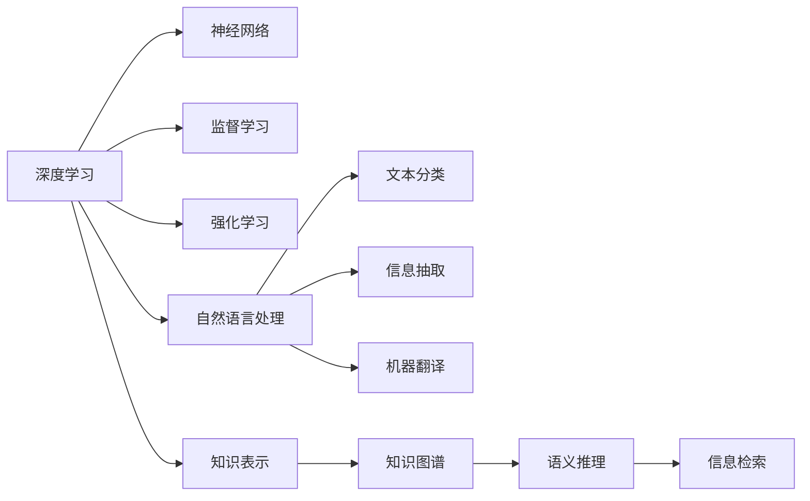

                 

# 软件 2.0 的哲学思考：人工智能的本质

## 1. 背景介绍

在人类历史的长河中，软件作为信息时代的关键产物，其发展已经经历了三个阶段：第一代软件基于用户需求的手工编码，第二代软件依赖专业的软件开发团队，而当前我们正处于软件 2.0 的时代。软件 2.0 不仅具备了自动化的编码能力，还能够利用先进的算法和数据驱动，形成自我学习和优化。这一转变标志着软件从一个依赖人类智慧的工具，转变为一种可以自我进化的智能实体。

在这一背景下，人工智能（AI）作为推动软件 2.0 发展的核心技术，其本质和哲学思考也显得愈发重要。本文将从人工智能的基本概念、算法原理、操作步骤、数学模型、项目实践、应用场景以及未来展望等多个维度，深入探讨人工智能的本质，并结合实例分析，帮助读者更好地理解和应用这一领域的知识。

## 2. 核心概念与联系

### 2.1 核心概念概述

1. **人工智能**：指计算机系统通过算法和数据驱动，能够模拟人类智能活动，如感知、理解、学习、推理和决策等。

2. **深度学习**：一种基于神经网络的人工智能技术，通过多层非线性变换，学习输入数据的高层次抽象表示，解决复杂的模式识别和预测问题。

3. **机器学习**：指通过数据训练模型，使得模型能够自动学习并提高性能，而无需明确编程指令。

4. **强化学习**：一种通过与环境交互，利用奖励信号不断优化策略的人工智能技术。

5. **知识表示**：指将人类知识结构化、形式化，使得计算机能够理解和处理。

6. **知识图谱**：一种基于图形结构的知识库，用于表示实体之间的关系，支持语义推理和信息检索。

7. **自然语言处理（NLP）**：利用计算机处理、理解和生成自然语言的技术，涉及文本分类、信息抽取、机器翻译等任务。

### 2.2 核心概念原理和架构的 Mermaid 流程图



这个 Mermaid 流程图展示了人工智能领域的几个核心概念及其相互关系。深度学习通过神经网络实现，机器学习通过监督学习和强化学习驱动，知识表示与自然语言处理紧密相连，知识图谱则用于语义推理和信息检索。

## 3. 核心算法原理 & 具体操作步骤

### 3.1 算法原理概述

人工智能的核心算法包括深度学习、强化学习、迁移学习等，这些算法通过不同的原理和方法，实现对数据的分析和处理。深度学习通过多层次的神经网络，从原始数据中学习特征表示，进而进行分类、回归等任务；强化学习通过与环境的交互，不断调整策略，以最大化奖励；迁移学习则是通过预训练模型，将在大规模数据上学习到的知识迁移到特定任务上，提升模型性能。

### 3.2 算法步骤详解

以深度学习为例，其操作步骤一般包括以下几个步骤：

1. **数据准备**：收集和预处理数据集，包括清洗、归一化、标注等。

2. **模型选择**：选择合适的神经网络结构，如卷积神经网络（CNN）、循环神经网络（RNN）、深度卷积神经网络（DCNN）等。

3. **模型训练**：使用训练数据集对模型进行前向传播和反向传播，调整权重和偏置，优化损失函数。

4. **模型评估**：使用测试数据集对模型进行评估，计算准确率、召回率、F1值等指标，判断模型性能。

5. **模型优化**：根据评估结果，调整模型参数，如学习率、正则化参数等，进行多次迭代，提升模型效果。

6. **模型部署**：将训练好的模型应用于实际场景中，进行推理和预测。

### 3.3 算法优缺点

深度学习的优点包括：

1. **自动特征提取**：能够自动从原始数据中提取高层次的特征表示，减少手动特征工程的工作量。

2. **泛化能力强**：在大规模数据集上进行预训练，能够在不同任务上表现优异。

3. **可扩展性高**：可以通过增加神经网络层数和节点数，提升模型的表达能力。

缺点包括：

1. **模型复杂度高**：神经网络参数量庞大，需要大量计算资源。

2. **数据依赖性强**：需要高质量的数据集进行训练，否则容易过拟合。

3. **可解释性差**：黑箱模型，难以理解内部工作机制。

### 3.4 算法应用领域

深度学习已经被广泛应用于计算机视觉、自然语言处理、语音识别、推荐系统等多个领域。在计算机视觉领域，深度学习能够自动提取图像特征，实现图像分类、目标检测、图像生成等任务；在自然语言处理领域，深度学习能够处理语言数据，实现文本分类、机器翻译、情感分析等任务；在语音识别领域，深度学习能够实现语音转文本、说话人识别等任务；在推荐系统领域，深度学习能够分析用户行为数据，实现个性化推荐。

## 4. 数学模型和公式 & 详细讲解 & 举例说明

### 4.1 数学模型构建

以卷积神经网络（CNN）为例，其数学模型包括卷积层、池化层、全连接层等。卷积层通过卷积操作提取局部特征，池化层通过降维操作减少计算量，全连接层将特征映射到输出空间。以图像分类任务为例，数学模型可以表示为：

$$
y = h(Wx + b)
$$

其中，$x$ 为输入图像，$y$ 为输出类别，$h$ 为非线性激活函数，$W$ 和 $b$ 为模型参数。

### 4.2 公式推导过程

以卷积神经网络的卷积操作为例，假设输入图像的大小为 $m \times n \times c$，卷积核的大小为 $k \times k$，步长为 $s$，则卷积操作的输出大小为：

$$
o = (m - k + 2p) / s + 1
$$

其中，$p$ 为填充大小，用于补全输入图像的边缘。

### 4.3 案例分析与讲解

以图像分类任务为例，通过使用卷积神经网络，可以从原始图像数据中提取高层次的特征表示，并通过分类器进行分类。具体步骤如下：

1. **数据准备**：将图像数据进行归一化、扩充等预处理，生成训练集和测试集。

2. **模型选择**：选择卷积神经网络作为模型架构。

3. **模型训练**：使用训练集对卷积神经网络进行前向传播和反向传播，调整权重和偏置，优化损失函数。

4. **模型评估**：使用测试集对模型进行评估，计算准确率、召回率、F1值等指标。

5. **模型优化**：根据评估结果，调整模型参数，如学习率、正则化参数等。

6. **模型部署**：将训练好的模型应用于实际场景中，进行图像分类。

## 5. 项目实践：代码实例和详细解释说明

### 5.1 开发环境搭建

在项目实践前，需要准备以下开发环境：

1. **Python 环境**：选择 Python 3.x 版本，安装必要的第三方库，如 TensorFlow、Keras、Pillow 等。

2. **GPU 环境**：安装 CUDA、cuDNN 等 GPU 加速工具，提升模型训练速度。

3. **数据集准备**：下载 MNIST 数据集，并进行预处理和标注。

### 5.2 源代码详细实现

以下是一个简单的图像分类项目的代码实现：

```python
import tensorflow as tf
from tensorflow.keras import datasets, layers, models

# 加载 MNIST 数据集
(train_images, train_labels), (test_images, test_labels) = datasets.mnist.load_data()

# 预处理数据集
train_images = train_images / 255.0
test_images = test_images / 255.0

# 构建模型
model = models.Sequential()
model.add(layers.Conv2D(32, (3, 3), activation='relu', input_shape=(28, 28, 1)))
model.add(layers.MaxPooling2D((2, 2)))
model.add(layers.Conv2D(64, (3, 3), activation='relu'))
model.add(layers.MaxPooling2D((2, 2)))
model.add(layers.Conv2D(64, (3, 3), activation='relu'))
model.add(layers.Flatten())
model.add(layers.Dense(64, activation='relu'))
model.add(layers.Dense(10))

# 编译模型
model.compile(optimizer='adam',
              loss=tf.keras.losses.SparseCategoricalCrossentropy(from_logits=True),
              metrics=['accuracy'])

# 训练模型
model.fit(train_images, train_labels, epochs=10, 
          validation_data=(test_images, test_labels))

# 评估模型
test_loss, test_acc = model.evaluate(test_images, test_labels, verbose=2)
print('\nTest accuracy:', test_acc)
```

### 5.3 代码解读与分析

上述代码实现了使用卷积神经网络进行 MNIST 数据集的图像分类任务。首先，使用 TensorFlow 库加载和预处理数据集；然后，构建卷积神经网络模型，包括卷积层、池化层和全连接层；接着，编译模型，选择 Adam 优化器和交叉熵损失函数；最后，训练和评估模型，输出测试集的准确率。

## 6. 实际应用场景

### 6.1 智能安防

在智能安防领域，人工智能技术可以用于人脸识别、行为分析、异常检测等任务。通过深度学习模型，可以从监控摄像头获取的图像数据中，识别出特定人物，并根据行为特征进行异常检测。此外，还可以结合知识图谱，实现实体关系推理，进一步提升安防系统的智能化水平。

### 6.2 智慧医疗

在智慧医疗领域，人工智能技术可以用于医学影像分析、疾病预测、个性化治疗等任务。通过深度学习模型，可以从医疗影像数据中提取病灶特征，辅助医生进行诊断；通过强化学习模型，可以根据患者的病历数据，制定个性化治疗方案；通过知识图谱，可以实现医学知识的管理和检索，支持医生进行知识更新和共享。

### 6.3 智能制造

在智能制造领域，人工智能技术可以用于质量检测、设备维护、生产调度等任务。通过深度学习模型，可以从生产线的传感器数据中，检测产品的质量问题，进行故障预测和预防维护；通过强化学习模型，可以优化生产线的调度方案，提高生产效率；通过知识图谱，可以实现设备维护知识的积累和管理，支持维修人员进行故障诊断和维护。

### 6.4 未来应用展望

未来，人工智能技术将在更多领域得到应用，为各行各业带来变革性影响。在智能交通、智能农业、智能教育等领域，人工智能技术将发挥更加重要的作用，提升生产效率，改善生活质量。随着技术的不断进步，人工智能将逐步向通用人工智能（AGI）迈进，实现更加全面、智能的认知和决策能力。

## 7. 工具和资源推荐

### 7.1 学习资源推荐

1. **《深度学习》（Goodfellow 等著）**：深度学习领域的经典教材，详细介绍了深度学习的原理和应用。

2. **Coursera 深度学习课程**：由斯坦福大学吴恩达教授主讲的深度学习课程，内容全面、系统。

3. **Kaggle**：数据科学和机器学习竞赛平台，提供丰富的数据集和算法实现。

4. **GitHub**：开源社区，可以找到众多优秀的人工智能项目和代码实现。

### 7.2 开发工具推荐

1. **TensorFlow**：谷歌开源的深度学习框架，支持分布式计算和GPU加速。

2. **PyTorch**：Facebook开源的深度学习框架，支持动态图和GPU加速。

3. **Keras**：高层次的深度学习框架，使用简单，易于上手。

4. **Jupyter Notebook**：交互式编程工具，适合数据科学和机器学习开发。

### 7.3 相关论文推荐

1. **ImageNet Classification with Deep Convolutional Neural Networks**：AlexNet 论文，开创了深度卷积神经网络的先河。

2. **DenseNet: A Dense Convolutional Network**：DenseNet 论文，提出密集连接网络，提升特征重用能力。

3. **Rethinking the Inception Architecture for Computer Vision**：Inception 论文，提出 Inception 网络，提升模型表达能力。

4. **Attention Is All You Need**：Transformer 论文，提出自注意力机制，提升模型推理能力。

5. **AlphaGo Zero: Mastering the Game of Go without Human Knowledge**：AlphaGo Zero 论文，实现零样本学习的 AlphaGo。

## 8. 总结：未来发展趋势与挑战

### 8.1 研究成果总结

人工智能技术已经取得了巨大的进展，从深度学习到强化学习，再到知识图谱和自然语言处理，技术不断突破，应用场景不断扩展。深度学习通过神经网络实现，强化学习通过与环境交互，迁移学习通过预训练模型，知识图谱通过图形结构表示知识，自然语言处理通过处理和生成自然语言。

### 8.2 未来发展趋势

1. **技术融合**：未来人工智能技术将与其他技术不断融合，如量子计算、生物计算、人机交互等，形成更加全面、智能的技术体系。

2. **跨领域应用**：人工智能技术将广泛应用于各行各业，提升生产效率，改善生活质量。

3. **通用人工智能**：未来人工智能将逐步向通用人工智能迈进，实现更加全面、智能的认知和决策能力。

### 8.3 面临的挑战

1. **数据隐私和安全**：人工智能技术需要大量的数据进行训练，如何保护数据隐私和安全是一个重大挑战。

2. **伦理和道德**：人工智能技术在决策过程中，如何确保公平、公正，避免歧视和偏见是一个需要解决的问题。

3. **可解释性**：人工智能技术往往具有黑箱性质，如何提高模型的可解释性，确保其决策过程透明、可信，是一个重要的研究方向。

### 8.4 研究展望

未来人工智能技术的研究方向将集中在以下几个方面：

1. **隐私保护技术**：研究如何在保证数据隐私的前提下，训练和使用人工智能模型。

2. **公平性算法**：研究如何设计公平、公正的算法，避免歧视和偏见。

3. **可解释性技术**：研究如何提高人工智能模型的可解释性，确保其决策过程透明、可信。

4. **跨领域应用**：研究如何将人工智能技术应用于更多领域，提升各行各业的智能化水平。

5. **通用人工智能**：研究如何构建通用人工智能模型，实现全面、智能的认知和决策能力。

## 9. 附录：常见问题与解答

**Q1: 人工智能的算法原理是什么？**

A: 人工智能的算法原理主要包括深度学习、强化学习和迁移学习等。深度学习通过多层神经网络，自动从原始数据中提取特征表示；强化学习通过与环境的交互，不断优化策略，以最大化奖励；迁移学习则是通过预训练模型，将在大规模数据上学习到的知识迁移到特定任务上，提升模型性能。

**Q2: 如何选择合适的算法？**

A: 选择合适的算法需要考虑以下几个方面：

1. 数据类型：如结构化数据、非结构化数据、图像数据等。

2. 任务类型：如分类、回归、聚类、生成等。

3. 计算资源：如GPU、TPU等。

4. 实际需求：如实时性、可解释性、安全性等。

**Q3: 人工智能的应用场景有哪些？**

A: 人工智能的应用场景非常广泛，包括计算机视觉、自然语言处理、语音识别、推荐系统、安防、医疗、制造等。

**Q4: 人工智能技术的发展趋势是什么？**

A: 人工智能技术的发展趋势包括技术融合、跨领域应用、通用人工智能等。未来人工智能将与其他技术不断融合，形成更加全面、智能的技术体系；将广泛应用于各行各业，提升生产效率和改善生活质量；将逐步向通用人工智能迈进，实现全面、智能的认知和决策能力。

**Q5: 如何应对人工智能的挑战？**

A: 应对人工智能的挑战需要从多个方面入手：

1. 保护数据隐私和安全。

2. 设计公平、公正的算法。

3. 提高模型的可解释性。

4. 研究跨领域应用，提升各行各业的智能化水平。

5. 构建通用人工智能模型，实现全面、智能的认知和决策能力。

作者：禅与计算机程序设计艺术 / Zen and the Art of Computer Programming

