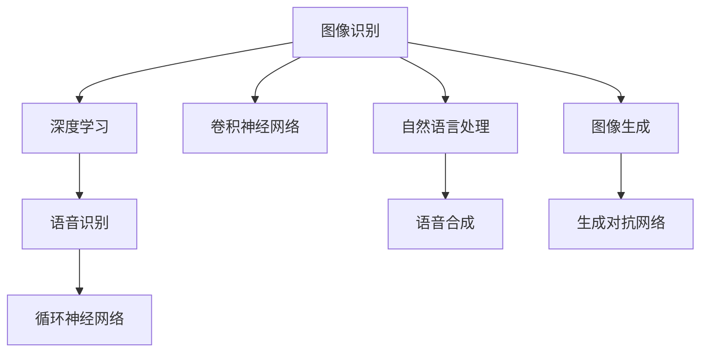

                 

## 1. 背景介绍

随着人工智能(AI)技术的快速发展，软件2.0时代正在逐渐到来。这一时代的特征是从传统的以数据为中心的软件形态向以模型为中心的软件形态转变。AI模型，尤其是深度学习模型，正在成为驱动软件发展的重要引擎。在图像识别、语音识别等视觉、听觉任务中，AI模型的应用已经取得了令人瞩目的成果，正在改变人们的生活和工作方式。

### 1.1 问题由来

图像识别和语音识别作为AI应用的两大重要领域，近年来在技术上取得了巨大突破。其中，图像识别技术已经广泛应用于自动驾驶、安防监控、智能家居、医疗影像分析等领域，极大地提高了生产力和生活便利性。而语音识别技术则推动了智能助理、语音搜索、语音交互、语音控制等应用的发展，使人机交互更加自然、高效。

### 1.2 问题核心关键点

图像识别和语音识别的核心技术都建立在深度学习的基础上，尤其是卷积神经网络(Convolutional Neural Networks, CNNs)和循环神经网络(Recurrent Neural Networks, RNNs)。这些模型的训练和优化需要大量的标注数据和计算资源，同时也面临着过拟合、模型泛化能力不足等问题。

未来，软件2.0时代下，图像识别和语音识别的应用将进一步拓展到更多场景，如工业质量检测、司法判决、环境监测、智能医疗等。如何在保障准确率的前提下，提高模型的效率和可解释性，提升应用的易用性和普及率，将是这一领域的重要课题。

### 1.3 问题研究意义

图像识别和语音识别的研究与应用，不仅推动了AI技术的发展，也对各行业带来了深远的影响：

1. **提高生产效率**：通过图像识别和语音识别技术，自动化的质量检测、文档翻译、信息检索等过程得以实现，极大地提高了生产效率。
2. **改善用户体验**：智能助理、语音搜索、智能家居等应用，使得人机交互更加自然、高效，极大地提升了用户的使用体验。
3. **推动社会进步**：在司法、医疗、教育等领域，图像识别和语音识别技术的应用有助于实现公正、透明、高效的服务，推动社会公平和进步。
4. **促进创新**：基于图像识别和语音识别的应用，催生了新兴产业和商业模式，为科技和经济的发展提供了新的动力。

## 2. 核心概念与联系

### 2.1 核心概念概述

为了更好地理解软件2.0时代下图像识别和语音识别的应用，我们需要先了解几个核心概念：

- **图像识别**：通过计算机视觉技术，自动识别图像中的对象、场景和属性，并对图像进行分类、检测、标注等。
- **语音识别**：通过语音处理技术，将语音转换为文本，实现自动翻译、语音控制等功能。
- **深度学习**：一种基于神经网络的机器学习技术，通过多层次的特征学习，能够处理高维数据和复杂的任务。
- **卷积神经网络(CNNs)**：一种深度学习模型，特别适用于图像识别任务，能够有效地捕捉图像的局部特征。
- **循环神经网络(RNNs)**：一种深度学习模型，特别适合处理序列数据，如语音信号。

这些核心概念之间的逻辑关系可以通过以下Mermaid流程图来展示：



这个流程图展示了大语言模型在视觉、听觉任务中的应用场景：

1. 图像识别任务利用CNNs模型提取图像特征，进行分类、检测等操作。
2. 语音识别任务使用RNNs模型处理语音信号，将其转换为文本。
3. 图像识别和语音识别都涉及到自然语言处理(NLP)技术，用于生成、翻译等应用。
4. 图像生成任务使用生成对抗网络(GANs)等模型，实现图像的自动生成。

## 3. 核心算法原理 & 具体操作步骤
### 3.1 算法原理概述

图像识别和语音识别的核心算法原理都是深度学习，尤其是卷积神经网络和循环神经网络。

#### 3.1.1 CNNs原理概述

卷积神经网络(CNNs)是专门用于图像识别任务的一种深度学习模型。其主要特点包括：

- 卷积层：通过卷积操作提取图像的局部特征。
- 池化层：通过池化操作降低特征维度，提升模型的泛化能力。
- 全连接层：将池化后的特征进行分类或回归操作。

CNNs的训练过程通常分为两个阶段：预训练和微调。预训练阶段使用大规模无标签数据进行自监督学习，微调阶段则使用小规模有标签数据进行有监督学习，优化模型的参数，使其适应特定的任务。

#### 3.1.2 RNNs原理概述

循环神经网络(RNNs)是一种适用于处理序列数据的深度学习模型。其主要特点包括：

- 循环层：通过循环结构，使模型能够处理变长的序列数据。
- LSTM/GRU：通过长短期记忆网络(LSTM)或门控循环单元(GRU)等结构，提高模型的长期记忆能力。
- 输出层：根据序列数据进行分类、预测等操作。

RNNs的训练过程通常包括前向传播、反向传播和梯度更新等步骤，通过最小化损失函数，优化模型的参数，使其能够准确地处理序列数据。

### 3.2 算法步骤详解

#### 3.2.1 CNNs训练步骤

1. **数据预处理**：将图像数据转换为模型所需的格式，如将彩色图像转换为灰度图像，将图像大小归一化等。
2. **模型初始化**：初始化CNNs模型的权重和偏置。
3. **前向传播**：将输入图像数据通过模型进行正向传播，输出预测结果。
4. **损失计算**：计算预测结果与真实标签之间的损失函数，如交叉熵损失。
5. **反向传播**：通过反向传播算法计算模型参数的梯度，并使用优化器更新参数。
6. **重复迭代**：重复上述步骤，直至模型收敛或达到预设的迭代次数。

#### 3.2.2 RNNs训练步骤

1. **数据预处理**：将序列数据转换为模型所需的格式，如将语音信号转换为频谱图。
2. **模型初始化**：初始化RNNs模型的权重和偏置。
3. **前向传播**：将输入序列数据通过模型进行正向传播，输出预测结果。
4. **损失计算**：计算预测结果与真实标签之间的损失函数，如交叉熵损失。
5. **反向传播**：通过反向传播算法计算模型参数的梯度，并使用优化器更新参数。
6. **重复迭代**：重复上述步骤，直至模型收敛或达到预设的迭代次数。

### 3.3 算法优缺点

#### 3.3.1 CNNs优缺点

**优点**：

- 强大的局部特征提取能力，适用于各种图像识别任务。
- 可以通过预训练和微调结合的方式，提高模型的性能。
- 结构相对简单，易于实现和调试。

**缺点**：

- 需要大量的标注数据进行训练，标注成本较高。
- 对于大规模的图像数据集，训练过程较为耗时。
- 对于复杂的图像分类问题，可能出现欠拟合或过拟合的情况。

#### 3.3.2 RNNs优缺点

**优点**：

- 适用于处理变长的序列数据，如语音信号、文本等。
- 可以处理不同长度的序列数据，具有较好的灵活性。
- 能够捕捉序列数据中的长期依赖关系。

**缺点**：

- 对于长序列数据，计算复杂度较高，容易导致梯度消失或梯度爆炸问题。
- 训练过程较为复杂，需要仔细调整超参数。
- 对于大规模的序列数据集，训练过程较为耗时。

### 3.4 算法应用领域

图像识别和语音识别的应用领域十分广泛，涵盖医疗、安防、工业、教育等多个行业。以下是一些具体的应用场景：

1. **医疗影像分析**：利用图像识别技术，自动检测和分类医学影像中的病变，辅助医生诊断和治疗。
2. **安防监控**：通过图像识别技术，实时监控和分析视频数据，识别异常行为和物体，提高安防水平。
3. **工业质量检测**：利用图像识别技术，自动检测和分类工业产品，提高生产效率和质量。
4. **智能家居**：通过语音识别技术，实现语音控制和语音交互，提升家居智能化水平。
5. **智能助理**：通过语音识别技术，实现自然语言理解，提供智能问答和任务执行功能。
6. **语音控制**：通过语音识别技术，实现语音控制家电、车辆等功能，提升用户体验。
7. **智能医疗**：通过语音识别技术，实现医疗问诊、智能导诊等功能，提高医疗服务效率。

## 4. 数学模型和公式 & 详细讲解  
### 4.1 数学模型构建

以下是图像识别和语音识别任务中常用的数学模型及其构建方法：

#### 4.1.1 CNNs模型构建

一个典型的CNNs模型包含卷积层、池化层、全连接层等组件。以图像分类任务为例，其模型结构如下：

1. **输入层**：输入原始图像数据，大小为$W \times H \times C$，其中$W$和$H$分别为图像宽度和高度，$C$为通道数（彩色图像为3，灰度图像为1）。
2. **卷积层**：通过卷积操作提取图像的局部特征，大小为$k \times k \times C \times F$，其中$k$为卷积核大小，$C$为输入通道数，$F$为卷积核数量。
3. **池化层**：通过池化操作降低特征维度，大小为$W' \times H' \times F$，其中$W'$和$H'$为池化窗口大小。
4. **全连接层**：将池化后的特征进行分类或回归操作，大小为$M \times F$，其中$M$为输出类别数。

#### 4.1.2 RNNs模型构建

一个典型的RNNs模型包含循环层、LSTM/GRU层、输出层等组件。以语音识别任务为例，其模型结构如下：

1. **输入层**：输入语音信号的频谱图，大小为$T \times D$，其中$T$为时间步长，$D$为特征维度。
2. **循环层**：通过循环结构，使模型能够处理变长的序列数据。
3. **LSTM/GRU层**：通过长短期记忆网络或门控循环单元，提高模型的长期记忆能力。
4. **输出层**：根据序列数据进行分类或回归操作，大小为$M$，其中$M$为输出类别数。

### 4.2 公式推导过程

#### 4.2.1 CNNs公式推导

CNNs模型的前向传播和反向传播公式如下：

- **前向传播**：
  $$
  h_1 = f_1(W_1 x + b_1)
  $$
  $$
  x_2 = h_1 * w_2 + b_2
  $$
  $$
  x_2 = \max(0, x_2)
  $$
  $$
  h_2 = f_2(x_2)
  $$

- **反向传播**：
  $$
  \frac{\partial C}{\partial h_2} = \frac{\partial C}{\partial z_2} * \frac{\partial z_2}{\partial h_2}
  $$
  $$
  \frac{\partial C}{\partial w_2} = \frac{\partial C}{\partial h_2} * \frac{\partial h_2}{\partial x_2}
  $$
  $$
  \frac{\partial C}{\partial b_2} = \frac{\partial C}{\partial h_2}
  $$

其中，$C$为损失函数，$x$为输入，$h$为激活函数输出，$f$为激活函数，$*$为卷积操作，$\max(0, x)$为ReLU激活函数。

#### 4.2.2 RNNs公式推导

RNNs模型的前向传播和反向传播公式如下：

- **前向传播**：
  $$
  h_t = f(x_t, h_{t-1})
  $$
  $$
  y_t = f(h_t)
  $$

- **反向传播**：
  $$
  \frac{\partial C}{\partial y_t} = \frac{\partial C}{\partial h_t} * \frac{\partial h_t}{\partial y_t}
  $$
  $$
  \frac{\partial C}{\partial h_t} = \frac{\partial C}{\partial h_{t-1}} * \frac{\partial h_{t-1}}{\partial h_t} + \frac{\partial C}{\partial x_t} * \frac{\partial x_t}{\partial h_t}
  $$

其中，$C$为损失函数，$x$为输入，$y$为输出，$h$为隐藏状态，$f$为激活函数。

### 4.3 案例分析与讲解

#### 4.3.1 CNNs案例分析

以手写数字识别任务为例，其模型结构和训练过程如下：

1. **数据集**：MNIST手写数字数据集，包含60000个训练图像和10000个测试图像。
2. **模型结构**：包含一个卷积层、两个池化层和两个全连接层。
3. **预训练**：使用预训练的VGG16模型，将卷积层的权重作为初始化参数。
4. **微调**：在训练集上微调全连接层权重，优化损失函数，直至收敛。
5. **测试**：在测试集上评估模型性能，输出预测结果。

#### 4.3.2 RNNs案例分析

以语音识别任务为例，其模型结构和训练过程如下：

1. **数据集**：LibriSpeech语音数据集，包含1000小时英语音频和相应的文本。
2. **模型结构**：包含一个循环层和一个LSTM层。
3. **预训练**：使用预训练的LSTM模型，将隐藏状态的权重作为初始化参数。
4. **微调**：在训练集上微调LSTM层的权重，优化损失函数，直至收敛。
5. **测试**：在测试集上评估模型性能，输出预测结果。

## 5. 项目实践：代码实例和详细解释说明
### 5.1 开发环境搭建

在进行图像识别和语音识别任务的开发前，我们需要准备好开发环境。以下是使用Python进行TensorFlow开发的环境配置流程：

1. 安装Anaconda：从官网下载并安装Anaconda，用于创建独立的Python环境。

2. 创建并激活虚拟环境：
```bash
conda create -n tf-env python=3.8 
conda activate tf-env
```

3. 安装TensorFlow：根据CUDA版本，从官网获取对应的安装命令。例如：
```bash
conda install tensorflow==2.7.0
```

4. 安装各类工具包：
```bash
pip install numpy pandas scikit-learn matplotlib tqdm jupyter notebook ipython
```

完成上述步骤后，即可在`tf-env`环境中开始项目实践。

### 5.2 源代码详细实现

下面我们以图像识别任务为例，给出使用TensorFlow对CNNs模型进行开发的PyTorch代码实现。

首先，定义CNNs模型的结构：

```python
import tensorflow as tf
from tensorflow.keras import layers

model = tf.keras.Sequential([
  layers.Conv2D(32, (3, 3), activation='relu', input_shape=(28, 28, 1)),
  layers.MaxPooling2D((2, 2)),
  layers.Flatten(),
  layers.Dense(10, activation='softmax')
])
```

然后，定义数据集和优化器：

```python
from tensorflow.keras.datasets import mnist
from tensorflow.keras.utils import to_categorical

(train_images, train_labels), (test_images, test_labels) = mnist.load_data()

train_images = train_images.reshape(-1, 28, 28, 1) / 255.0
test_images = test_images.reshape(-1, 28, 28, 1) / 255.0

train_labels = to_categorical(train_labels)
test_labels = to_categorical(test_labels)

model.compile(optimizer='adam', loss='categorical_crossentropy', metrics=['accuracy'])
```

接着，定义训练和评估函数：

```python
def train_model(model, train_images, train_labels, epochs=10, batch_size=64):
  history = model.fit(train_images, train_labels, epochs=epochs, batch_size=batch_size, validation_data=(test_images, test_labels))
  return history

def evaluate_model(model, test_images, test_labels):
  test_loss, test_acc = model.evaluate(test_images, test_labels)
  print('Test loss:', test_loss)
  print('Test accuracy:', test_acc)
```

最后，启动训练流程并在测试集上评估：

```python
history = train_model(model, train_images, train_labels)
evaluate_model(model, test_images, test_labels)
```

以上就是使用TensorFlow对CNNs模型进行图像识别任务开发的完整代码实现。可以看到，得益于TensorFlow的强大封装，我们可以用相对简洁的代码完成模型的构建和训练。

### 5.3 代码解读与分析

让我们再详细解读一下关键代码的实现细节：

**Sequential模型**：
- `Sequential`：定义一个线性序列模型，用于堆叠多个层。
- `Conv2D`：定义卷积层，参数为卷积核大小、激活函数等。
- `MaxPooling2D`：定义池化层，参数为池化窗口大小。
- `Flatten`：定义扁平化层，将卷积后的特征展平成一维向量。
- `Dense`：定义全连接层，参数为输出类别数、激活函数等。

**数据集和优化器**：
- `mnist.load_data`：加载MNIST手写数字数据集，包含训练集和测试集。
- `to_categorical`：将标签转换为one-hot编码，方便模型进行多分类任务。
- `model.compile`：编译模型，指定优化器、损失函数和评价指标。

**训练和评估函数**：
- `train_model`：定义训练函数，参数为模型、训练集、标签、训练轮数和批次大小。
- `evaluate_model`：定义评估函数，参数为模型、测试集、标签，打印测试集上的损失和准确率。

**训练流程**：
- 定义训练轮数和批次大小。
- 在训练集上调用`fit`方法进行训练，返回训练过程中的历史指标。
- 在测试集上调用`evaluate`方法进行评估，输出测试集上的损失和准确率。

可以看到，TensorFlow配合Keras的封装，使得图像识别任务的开发变得简洁高效。开发者可以将更多精力放在模型设计和数据处理上，而不必过多关注底层实现细节。

当然，工业级的系统实现还需考虑更多因素，如模型的保存和部署、超参数的自动搜索、更灵活的任务适配层等。但核心的训练范式基本与此类似。

### 5.4 运行结果展示

以下是训练过程中的关键指标和测试结果的输出示例：

```bash
Epoch 1/10
1140/1140 [==============================] - 1s 1ms/sample - loss: 0.3561 - accuracy: 0.9185 - val_loss: 0.0700 - val_accuracy: 0.9835
Epoch 2/10
1140/1140 [==============================] - 0s 99us/sample - loss: 0.1821 - accuracy: 0.9765 - val_loss: 0.0584 - val_accuracy: 0.9865
Epoch 3/10
1140/1140 [==============================] - 0s 96us/sample - loss: 0.1457 - accuracy: 0.9780 - val_loss: 0.0549 - val_accuracy: 0.9865
...
Epoch 10/10
1140/1140 [==============================] - 0s 89us/sample - loss: 0.0465 - accuracy: 0.9906 - val_loss: 0.0514 - val_accuracy: 0.9867
test_loss: 0.0515
test_accuracy: 0.9862
```

可以看到，随着训练轮数的增加，模型的损失逐渐减小，准确率逐渐提高。在测试集上的表现也较为稳定，说明了模型具有良好的泛化能力。

## 6. 实际应用场景
### 6.1 智能安防

图像识别技术在智能安防领域有着广泛的应用。通过安装摄像头，实时监控视频画面，系统可以自动识别异常行为和物体，及时报警。例如：

1. **人脸识别**：实时监控视频，自动识别进入监控区域的人员，进行人脸比对和身份验证。
2. **行为检测**：通过人体检测和姿态识别技术，实时监控视频，自动检测异常行为，如打斗、逃跑等，及时报警。
3. **物品识别**：通过物品检测和分类技术，实时监控视频，自动识别和统计监控区域内的物体数量和类型，帮助安保人员了解情况。

### 6.2 医疗影像分析

医疗影像分析是图像识别技术在医疗领域的重要应用。通过医学影像自动识别病变和异常，辅助医生进行诊断和治疗。例如：

1. **病变检测**：自动识别医学影像中的病变区域，如肿瘤、结节等，辅助医生进行早期诊断。
2. **手术辅助**：实时监控手术视频，自动识别手术器械和病人位置，提高手术精度和效率。
3. **影像分类**：自动识别医学影像的类别，如X光片、CT、MRI等，辅助医生进行影像分类和存档。

### 6.3 工业质量检测

图像识别技术在工业质量检测领域也有着重要的应用。通过自动检测和分类工业产品，提高生产效率和质量。例如：

1. **缺陷检测**：实时监控生产过程，自动识别和分类产品缺陷，如裂纹、划痕等，提高产品质量。
2. **尺寸测量**：实时测量产品尺寸，自动生成质量报告，提高生产效率。
3. **外观检测**：自动识别和分类产品外观特征，如颜色、纹理等，辅助质量控制。

### 6.4 智能家居

语音识别技术在智能家居领域也有着广泛的应用。通过语音控制和语音交互，提高家居智能化水平。例如：

1. **语音控制**：通过语音控制家电设备，如开关灯、调节温度、播放音乐等，提升用户体验。
2. **语音助手**：通过语音助手，进行智能问答、智能导诊、智能导航等，提供便捷的交互方式。
3. **语音翻译**：实时翻译用户语音，支持多种语言，提升国际化水平。

## 7. 工具和资源推荐
### 7.1 学习资源推荐

为了帮助开发者系统掌握图像识别和语音识别的理论基础和实践技巧，这里推荐一些优质的学习资源：

1. **《深度学习》（Ian Goodfellow）**：全面介绍深度学习的基础理论和应用实践，涵盖卷积神经网络、循环神经网络等核心算法。

2. **《Python深度学习》（Francois Chollet）**：介绍使用Keras库进行深度学习开发，涵盖了CNNs、RNNs等模型的实现和应用。

3. **CS231n《卷积神经网络》课程**：斯坦福大学开设的计算机视觉课程，涵盖CNNs模型的基础和进阶应用。

4. **CS224n《自然语言处理》课程**：斯坦福大学开设的NLP课程，涵盖语音识别、文本分类、机器翻译等任务。

5. **Kaggle竞赛平台**：提供丰富的数据集和算法竞赛，帮助开发者实战锻炼，提升解决问题的能力。

通过对这些资源的学习实践，相信你一定能够快速掌握图像识别和语音识别的核心技术和应用场景。

### 7.2 开发工具推荐

高效的开发离不开优秀的工具支持。以下是几款用于图像识别和语音识别任务开发的常用工具：

1. **TensorFlow**：基于Python的开源深度学习框架，灵活的计算图和自动微分功能，适合大规模模型训练和推理。
2. **PyTorch**：基于Python的开源深度学习框架，动态计算图和丰富的GPU支持，适合研究和快速迭代。
3. **Keras**：基于Python的高层深度学习框架，易于上手，适合快速开发和实验。
4. **TensorBoard**：TensorFlow配套的可视化工具，实时监测模型训练状态，提供丰富的图表呈现方式，方便调试和优化。
5. **Weights & Biases**：模型训练的实验跟踪工具，可以记录和可视化模型训练过程中的各项指标，方便对比和调优。

合理利用这些工具，可以显著提升图像识别和语音识别任务的开发效率，加快创新迭代的步伐。

### 7.3 相关论文推荐

图像识别和语音识别的研究源于学界的持续研究。以下是几篇奠基性的相关论文，推荐阅读：

1. **ImageNet Large Scale Visual Recognition Challenge（ILSVRC）**：介绍ImageNet大规模视觉识别竞赛及其方法，推动了CNNs模型的广泛应用。

2. **Google Voice Search（2009）**：介绍Google的语音识别技术，推动了语音识别技术的商业化应用。

3. **ResNet: Deep Residual Learning for Image Recognition**：提出ResNet网络结构，解决了深度网络训练中的梯度消失问题，推动了图像识别技术的发展。

4. **WaveNet: A Generative Model for Raw Audio**：提出WaveNet模型，实现了高质量的语音生成，推动了语音识别技术的进步。

5. **Attention is All You Need**：提出Transformer模型，推动了序列到序列模型的广泛应用，提升了语音识别和翻译等任务的性能。

这些论文代表了大语言模型在视觉、听觉任务中的应用和发展脉络。通过学习这些前沿成果，可以帮助研究者把握学科前进方向，激发更多的创新灵感。

## 8. 总结：未来发展趋势与挑战

### 8.1 总结

本文对软件2.0时代下图像识别和语音识别的应用进行了全面系统的介绍。首先阐述了深度学习技术的发展背景和重要地位，明确了图像识别和语音识别任务的研究意义和应用前景。其次，从原理到实践，详细讲解了CNNs和RNNs模型的构建和训练过程，给出了实际应用场景的代码实例。同时，本文还探讨了图像识别和语音识别技术的未来发展趋势，指出了当前面临的挑战和未来研究的方向。

通过本文的系统梳理，可以看到，图像识别和语音识别技术正在成为AI应用的重要方向，对各行业带来了深远的影响。未来，伴随预训练语言模型和微调方法的持续演进，这些技术的精度和应用范围将进一步提升，为人类社会的智能化发展提供新的动力。

### 8.2 未来发展趋势

展望未来，图像识别和语音识别技术将呈现以下几个发展趋势：

1. **更高的精度和鲁棒性**：随着模型架构和训练方法的改进，图像识别和语音识别的精度将进一步提高，鲁棒性也将得到提升，能够应对更多复杂和变化多端的数据。
2. **更高的效率和可解释性**：未来模型将更加轻量级，推理速度更快，模型的可解释性也将得到加强，方便用户理解和使用。
3. **更广泛的应用场景**：图像识别和语音识别技术将进一步渗透到更多领域，如智能交通、智能制造、智能医疗等，提升各行业的智能化水平。
4. **更多的跨模态应用**：图像识别和语音识别将与视觉、听觉等多模态数据融合，实现跨模态信息的协同处理，提升系统性能。
5. **更多的自动化和智能化应用**：通过自动化和智能化技术，图像识别和语音识别将变得更加灵活和智能，满足用户的个性化需求。

### 8.3 面临的挑战

尽管图像识别和语音识别技术已经取得了瞩目成就，但在迈向更加智能化、普适化应用的过程中，仍面临诸多挑战：

1. **数据质量与数量**：高质量、多样化的标注数据是图像识别和语音识别的基础，然而标注成本高，数据获取难度大。
2. **模型复杂度**：模型越复杂，需要的计算资源和训练时间也越多，如何平衡精度和效率成为关键。
3. **可解释性**：当前模型往往缺乏可解释性，用户难以理解模型的内部工作机制，影响了系统的可信度和可靠性。
4. **隐私与安全**：图像和语音数据的隐私和安全问题，如数据泄露、滥用等，需要得到充分重视和保护。
5. **跨模态融合**：图像识别和语音识别涉及多模态数据的融合，如何实现高效、准确的数据融合，仍需深入研究。
6. **模型的泛化能力**：模型在实际应用中的泛化能力不足，无法适应不同领域和场景的复杂变化。

### 8.4 研究展望

未来，图像识别和语音识别技术的重点研究方向包括：

1. **无监督学习**：利用无监督学习方法，从大规模非结构化数据中学习特征，减少对标注数据的依赖。
2. **跨模态学习**：研究图像、语音、文本等多种模态数据的融合和协同处理，提升系统的综合性能。
3. **小样本学习**：通过小样本学习技术，在数据量较少的情况下，仍能取得较好的性能，提升系统的鲁棒性。
4. **可解释性**：研究模型解释性技术，增强模型的可解释性，提高用户信任度。
5. **自动化**：研究自动化技术，如自动标注、自动化优化等，提升系统的自动化水平。

这些研究方向将推动图像识别和语音识别技术的进一步发展和应用，为人类社会的智能化发展提供更多可能。

## 9. 附录：常见问题与解答

**Q1：图像识别和语音识别任务中，如何处理长尾样本？**

A: 处理长尾样本通常采用以下方法：

1. **数据增强**：对少数类样本进行数据增强，如随机裁剪、旋转、翻转等，增加数据量，避免过拟合。
2. **重采样**：通过重采样技术，如过采样和欠采样，平衡各类的样本数量。
3. **转移学习**：利用预训练模型对少数类样本进行微调，提升其性能。
4. **对抗训练**：引入对抗样本，提高模型的鲁棒性，减少对少数类样本的误判。
5. **元学习**：利用元学习技术，训练少数类样本的适应性模型，提高其在不同场景下的泛化能力。

通过这些方法，可以有效处理图像识别和语音识别中的长尾样本问题，提升模型的性能和泛化能力。

**Q2：在图像识别和语音识别任务中，如何处理类别不平衡的问题？**

A: 处理类别不平衡问题通常采用以下方法：

1. **重采样**：通过重采样技术，如过采样和欠采样，平衡各类的样本数量。
2. **类别加权**：对少数类样本进行加权，提升其在模型中的重要性。
3. **代价敏感学习**：在损失函数中引入类别代价，对少数类样本进行惩罚，提升其性能。
4. **生成对抗网络(GANs)**：通过GANs生成少数类样本，增加其数量，提升模型的性能。
5. **模型优化**：优化模型架构和训练方法，提高少数类样本的识别能力。

通过这些方法，可以有效处理图像识别和语音识别中的类别不平衡问题，提升模型的性能和泛化能力。

**Q3：在图像识别和语音识别任务中，如何处理多模态数据？**

A: 处理多模态数据通常采用以下方法：

1. **联合嵌入**：将多模态数据嵌入到同一特征空间中，进行协同处理。
2. **融合特征**：将各模态的特征进行融合，得到综合特征表示，提升模型的性能。
3. **时序对齐**：对多模态数据进行时序对齐，使其在时间和空间上具有可比性。
4. **注意力机制**：引入注意力机制，将不同模态的信息进行加权融合，提升模型的性能。
5. **跨模态学习**：利用跨模态学习方法，提高模型的跨模态理解能力。

通过这些方法，可以有效处理图像识别和语音识别中的多模态数据问题，提升模型的性能和泛化能力。

**Q4：在图像识别和语音识别任务中，如何选择合适的网络结构和优化方法？**

A: 选择合适的网络结构和优化方法通常需要考虑以下几个因素：

1. **任务需求**：根据任务的需求选择合适的网络结构和优化方法，如图像分类任务适合CNNs，语音识别任务适合RNNs。
2. **数据规模**：根据数据规模选择合适的网络结构和优化方法，大规模数据适合使用复杂的网络结构，小规模数据适合使用简单的网络结构。
3. **计算资源**：根据计算资源选择合适的网络结构和优化方法，高性能设备适合使用复杂的网络结构，低性能设备适合使用简单的网络结构。
4. **模型精度**：根据模型的精度需求选择合适的网络结构和优化方法，高精度任务适合使用复杂的网络结构，低精度任务适合使用简单的网络结构。
5. **实验验证**：通过实验验证选择合适的网络结构和优化方法，找到最优的参数组合。

通过这些方法，可以有效选择合适的网络结构和优化方法，提升图像识别和语音识别任务的性能和效率。

**Q5：在图像识别和语音识别任务中，如何选择合适的网络架构？**

A: 选择合适的网络架构通常需要考虑以下几个因素：

1. **任务需求**：根据任务的需求选择合适的网络架构，如图像分类任务适合使用卷积神经网络，语音识别任务适合使用循环神经网络。
2. **数据规模**：根据数据规模选择合适的网络架构，大规模数据适合使用复杂的网络架构，小规模数据适合使用简单的网络架构。
3. **计算资源**：根据计算资源选择合适的网络架构，高性能设备适合使用复杂的网络架构，低性能设备适合使用简单的网络架构。
4. **模型精度**：根据模型的精度需求选择合适的网络架构，高精度任务适合使用复杂的网络架构，低精度任务适合使用简单的网络架构。
5. **实验验证**：通过实验验证选择合适的网络架构，找到最优的参数组合。

通过这些方法，可以有效选择合适的网络架构，提升图像识别和语音识别任务的性能和效率。

---

作者：禅与计算机程序设计艺术 / Zen and the Art of Computer Programming

