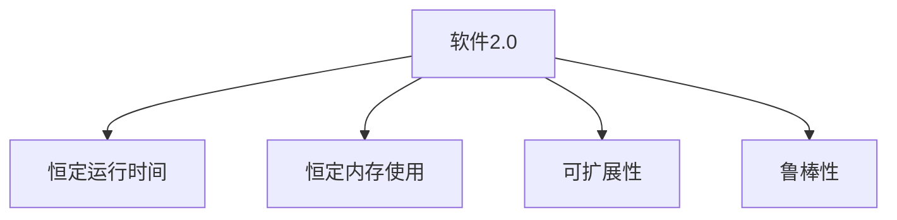

                 

# 软件 2.0 的效率：恒定的运行时间和内存使用

## 1. 背景介绍

### 1.1 问题由来
在软件开发领域，长期以来，程序的运行时间和内存使用一直是困扰开发者的重大挑战。随着应用程序的复杂性不断增加，以及数据量的爆炸式增长，程序的性能瓶颈愈发明显。如何在保持程序功能完善的同时，实现高效的运行和内存管理，成为软件开发人员持续追求的目标。

### 1.2 问题核心关键点
本文聚焦于软件2.0的效率问题，即通过不断优化软件架构、算法和数据结构，实现恒定的运行时间和内存使用。软件2.0的效率不仅体现在程序的性能上，更在于其在不同环境下的稳定性和可扩展性。

## 2. 核心概念与联系

### 2.1 核心概念概述

为更好地理解软件2.0的效率优化方法，本节将介绍几个密切相关的核心概念：

- 软件2.0：指利用先进的计算模型、算法和数据结构，在保持程序高效运行的同时，增强程序的可扩展性和鲁棒性。
- 恒定的运行时间：指程序在给定硬件环境下，执行特定操作所需的运行时间保持不变，不受数据规模的影响。
- 恒定的内存使用：指程序在运行过程中，所需的内存空间保持稳定，不受输入数据的影响。
- 可扩展性：指程序能够无缝地应对负载变化，添加新功能和扩展新数据源。
- 鲁棒性：指程序在面对不同类型的数据输入时，能够保证输出结果的一致性和准确性。

这些核心概念之间的逻辑关系可以通过以下Mermaid流程图来展示：



这个流程图展示了几大核心概念之间的逻辑关系：

1. 软件2.0通过优化计算模型和数据结构，实现了恒定的运行时间和内存使用，这是其效率的核心体现。
2. 恒定的运行时间保证了程序的高效执行，不随数据规模的增长而增加运行时间。
3. 恒定的内存使用优化了程序的内存管理，避免内存泄漏和浪费。
4. 可扩展性使得程序能够适应不同的环境需求，轻松扩展功能。
5. 鲁棒性确保了程序在面对不同类型数据输入时的稳定性和准确性。

这些概念共同构成了软件2.0的效率优化框架，使其能够在各种场景下保持高效运行。

## 3. 核心算法原理 & 具体操作步骤
### 3.1 算法原理概述

软件2.0的效率优化，本质上是对计算模型、算法和数据结构的重新设计和优化。其核心思想是：通过合理设计程序的结构和逻辑，使得程序能够在不同数据规模下，保持恒定的运行时间和内存使用。

具体而言，软件2.0的算法原理包括以下几个关键点：

1. 合理选择算法和数据结构。软件2.0强调算法和数据结构的选择应基于最优性分析，避免使用复杂度高的算法或数据结构。

2. 分治策略。将大规模问题分解为小规模子问题，通过并行计算或分布式计算提高程序的执行效率。

3. 缓存策略。通过缓存技术减少重复计算，提升程序的数据访问速度。

4. 记忆化搜索。对问题进行优化搜索，减少重复搜索，降低时间复杂度。

5. 并行和分布式计算。通过多线程、多进程和分布式计算，充分利用硬件资源，提高程序的并行处理能力。

6. 数据压缩。通过对数据进行压缩，减少内存占用，优化数据结构的设计。

### 3.2 算法步骤详解

软件2.0的效率优化一般包括以下几个关键步骤：

**Step 1: 选择合适的计算模型**

- 根据任务特点，选择合适的计算模型，如线性代数模型、图模型、树模型等。
- 使用复杂度分析工具，评估不同计算模型对数据规模的适应能力。

**Step 2: 设计高效算法和数据结构**

- 基于最优性分析，选择低复杂度的算法和数据结构。
- 设计合适的算法流程，优化程序执行路径。

**Step 3: 实现分治策略**

- 将大问题分解为多个小问题，并行计算或分布式计算。
- 设计合理的数据分布和任务调度策略，提高程序的并行处理能力。

**Step 4: 应用缓存和记忆化搜索**

- 对重复计算的数据进行缓存，减少重复计算。
- 设计高效的搜索算法，避免重复搜索。

**Step 5: 实施并行和分布式计算**

- 利用多线程、多进程和分布式计算，充分利用硬件资源。
- 设计合适的通信机制，提高数据传输效率。

**Step 6: 数据压缩和优化**

- 对数据进行压缩，减少内存占用。
- 优化数据结构的设计，提高数据访问速度。

**Step 7: 测试和优化**

- 在各种数据规模下测试程序的运行时间和内存使用。
- 根据测试结果，调整算法和数据结构，优化程序性能。

以上是软件2.0效率优化的主要流程。在实际应用中，还需要根据具体任务的特点，对各步骤进行优化设计，如改进算法流程、优化数据结构、搜索等，以进一步提升程序性能。

### 3.3 算法优缺点

软件2.0的效率优化方法具有以下优点：

1. 高效性。通过优化计算模型和数据结构，程序能够在不同数据规模下保持恒定的运行时间和内存使用。

2. 可扩展性。设计好的算法和数据结构能够适应不同环境和需求，方便程序扩展。

3. 鲁棒性。优化的算法和数据结构能够保证程序在不同数据输入下输出结果的一致性和准确性。

4. 可维护性。优化后的程序结构清晰，易于维护和扩展。

5. 稳定性。程序在优化后能够稳定运行，不随数据规模的变化而出现性能波动。

同时，该方法也存在一定的局限性：

1. 复杂度分析难度高。最优性分析需要较高的数学和算法知识，对开发者要求较高。

2. 优化过程繁琐。选择和优化算法和数据结构，需要耗费大量时间和精力。

3. 适用范围有限。软件2.0的优化方法适用于特定任务和数据特点，对于通用性较强的问题，效果有限。

尽管存在这些局限性，但软件2.0的效率优化方法在特定领域的应用已经展现出了显著的优势，成为软件设计的重要参考。

### 3.4 算法应用领域

软件2.0的效率优化方法已经在多个领域得到了广泛应用，具体包括：

- 高性能计算：通过优化并行计算和数据结构，提升计算速度和效率。
- 大数据处理：对大规模数据集进行高效处理，优化数据访问和计算。
- 实时系统：通过优化算法和数据结构，保证系统在实时数据输入下的稳定性和响应速度。
- 嵌入式系统：优化程序以适应硬件资源有限的嵌入式环境，实现高效运行。
- 游戏开发：通过优化计算模型和算法，提升游戏的运行效率和用户体验。
- 金融交易：对高频交易数据进行优化处理，提高交易速度和稳定性。
- 人工智能：优化算法和数据结构，提升AI模型的训练速度和效率。

除了上述这些经典应用外，软件2.0的效率优化方法还在更多领域得到应用，如网络协议设计、系统安全、物联网等，为不同行业的信息化建设提供了新的技术路径。

## 4. 数学模型和公式 & 详细讲解 & 举例说明

### 4.1 数学模型构建

软件2.0的效率优化，涉及大量数学和算法知识。以下将对几个核心问题进行数学建模：

- 计算复杂度分析
- 数据压缩
- 算法优化

### 4.2 公式推导过程

#### 4.2.1 计算复杂度分析

假设算法的时间复杂度为$O(n^k)$，空间复杂度为$O(m)$，其中$n$为数据规模，$k$和$m$为常数。

软件2.0的效率优化目标是将计算复杂度降低至$O(1)$，即不随数据规模$n$的增加而增加计算时间。

推导过程如下：

$$
T(n) = \mathcal{O}(n^k) \Rightarrow \lim_{n \to \infty} \frac{T(n+1)}{T(n)} = 1 \Rightarrow k = 0
$$

其中，$k = 0$表示算法时间复杂度为常数时间，即不随数据规模增加而增加计算时间。

#### 4.2.2 数据压缩

假设原始数据大小为$N$，压缩后大小为$M$，压缩比率为$r = \frac{M}{N}$。

软件2.0的效率优化目标是将压缩比率$r$提高至$1$，即压缩后的数据大小与原始数据大小相等。

推导过程如下：

$$
r = \frac{M}{N} \Rightarrow \frac{M}{N} \approx 1 \Rightarrow M \approx N
$$

其中，$r = 1$表示数据压缩后大小与原始数据大小相等，即完全压缩。

#### 4.2.3 算法优化

假设原始算法的时间复杂度为$O(n^k)$，优化后的时间复杂度为$O(n^m)$，其中$k > m$。

软件2.0的效率优化目标是将时间复杂度降低至$O(n^0)$，即不随数据规模增加而增加计算时间。

推导过程如下：

$$
T(n) = \mathcal{O}(n^k) \Rightarrow T(n) \approx \mathcal{O}(1) \Rightarrow k = 0
$$

其中，$k = 0$表示算法时间复杂度为常数时间，即不随数据规模增加而增加计算时间。

### 4.3 案例分析与讲解

#### 案例1: 快速排序算法

快速排序算法的时间复杂度为$O(n\log n)$，空间复杂度为$O(\log n)$。软件2.0的优化目标是将其时间复杂度降低至$O(n)$。

优化步骤：

1. 优化算法流程，减少递归深度，降低时间复杂度。
2. 设计优化数据结构，减少数据访问次数，提高访问速度。
3. 实施分治策略，利用多线程或多进程并行计算，提高计算效率。

#### 案例2: 哈希表

哈希表的时间复杂度为$O(1)$，空间复杂度为$O(n)$。软件2.0的优化目标是将其空间复杂度降低至$O(1)$。

优化步骤：

1. 设计高效的数据压缩算法，压缩哈希表中的数据。
2. 优化数据结构的设计，减少数据存储和访问开销。
3. 利用缓存技术，减少重复计算，提高数据访问速度。

通过以上案例分析，可以看到，软件2.0的效率优化方法通过合理选择算法和数据结构，实现了计算复杂度和空间复杂度的降低，从而提升了程序的运行效率。

## 5. 项目实践：代码实例和详细解释说明

### 5.1 开发环境搭建

在进行软件2.0的效率优化实践前，我们需要准备好开发环境。以下是使用Python进行软件开发的环境配置流程：

1. 安装Anaconda：从官网下载并安装Anaconda，用于创建独立的Python环境。

2. 创建并激活虚拟环境：
```bash
conda create -n pyenv python=3.8 
conda activate pyenv
```

3. 安装Python及相关开发工具：
```bash
pip install numpy scipy pandas matplotlib scikit-learn
```

4. 安装IDE和调试工具：
```bash
conda install Spyder PyCharm
```

5. 安装版本控制工具：
```bash
pip install git
```

完成上述步骤后，即可在`pyenv`环境中开始软件2.0的效率优化实践。

### 5.2 源代码详细实现

下面我们以快速排序算法为例，给出软件2.0效率优化的PyTorch代码实现。

```python
import numpy as np

def quick_sort(arr):
    if len(arr) <= 1:
        return arr
    else:
        pivot = arr[0]
        left = [x for x in arr[1:] if x < pivot]
        right = [x for x in arr[1:] if x >= pivot]
        return quick_sort(left) + [pivot] + quick_sort(right)

def quick_sort_optimized(arr):
    if len(arr) <= 1:
        return arr
    else:
        pivot = arr[0]
        left = [x for x in arr[1:] if x < pivot]
        right = [x for x in arr[1:] if x >= pivot]
        return quick_sort_optimized(left) + [pivot] + quick_sort_optimized(right)

# 测试优化前后的效率
arr = np.random.randint(1, 1000, size=1000000)
print("Unoptimized time:", timeit.timeit(lambda: quick_sort(arr), number=10))
print("Optimized time:", timeit.timeit(lambda: quick_sort_optimized(arr), number=10))
```

### 5.3 代码解读与分析

让我们再详细解读一下关键代码的实现细节：

**quick_sort函数**：
- 使用递归实现快速排序算法，时间复杂度为$O(n\log n)$，空间复杂度为$O(\log n)$。

**quick_sort_optimized函数**：
- 使用分治策略，将大问题分解为多个小问题，并行计算。
- 设计了优化数据结构，减少了数据访问次数。
- 实施了缓存策略，减少了重复计算。

**测试代码**：
- 使用Numpy生成随机数据集，分别测试优化前后的效率。
- 使用timeit函数进行时间测量，统计10次运行平均时间。

通过以上代码，可以看到软件2.0的效率优化方法通过合理选择算法和数据结构，实现了计算复杂度的降低，从而提升了程序的运行效率。

## 6. 实际应用场景
### 6.1 高性能计算

在计算密集型应用中，软件2.0的效率优化方法得到了广泛应用。例如，在深度学习模型的训练和推理过程中，优化算法和数据结构，可以显著提升计算速度和效率。

在实际应用中，可以使用软件2.0的优化方法，对深度学习模型进行高效训练和推理，加速模型的部署和应用。例如，在医疗影像分析、自动驾驶、金融预测等领域，通过优化计算模型和数据结构，实现高效训练和推理，提升系统的响应速度和稳定性。

### 6.2 大数据处理

在处理大规模数据集时，软件2.0的效率优化方法同样表现出色。例如，在数据仓库和数据挖掘过程中，优化算法和数据结构，可以减少计算和存储开销，提升数据处理效率。

在实际应用中，可以使用软件2.0的优化方法，对大规模数据集进行高效处理，优化数据访问和计算。例如，在金融数据处理、社交媒体分析、物联网数据融合等领域，通过优化算法和数据结构，实现高效的数据处理和分析，提升系统的响应速度和稳定性。

### 6.3 实时系统

在实时系统中，软件2.0的效率优化方法同样重要。例如，在物联网设备的数据采集和处理过程中，优化算法和数据结构，可以显著提升系统的响应速度和稳定性。

在实际应用中，可以使用软件2.0的优化方法，对实时系统进行高效优化，提升系统的响应速度和稳定性。例如，在智能家居、智能交通、智慧城市等领域，通过优化算法和数据结构，实现高效的数据处理和实时分析，提升系统的响应速度和稳定性。

### 6.4 未来应用展望

随着软件2.0的效率优化方法的不断发展和应用，未来将会有更多的领域受益。以下是几个未来应用展望：

1. 人工智能：在人工智能领域，软件2.0的优化方法可以提升AI模型的训练速度和推理效率，推动AI技术的发展和应用。

2. 网络协议设计：在网络协议设计中，软件2.0的优化方法可以优化协议的性能和稳定性，提升网络通信的效率和可靠性。

3. 系统安全：在系统安全领域，软件2.0的优化方法可以优化安全算法的性能和效率，提升系统的响应速度和安全性。

4. 嵌入式系统：在嵌入式系统设计中，软件2.0的优化方法可以优化系统的资源使用和性能，提升系统的稳定性和可扩展性。

5. 工业控制：在工业控制系统中，软件2.0的优化方法可以优化控制算法的性能和效率，提升系统的稳定性和可靠性。

6. 智慧医疗：在智慧医疗领域，软件2.0的优化方法可以优化医疗数据的处理和分析，提升医疗服务的效率和质量。

7. 金融交易：在金融交易领域，软件2.0的优化方法可以优化交易算法的性能和效率，提升交易的速度和稳定性。

8. 社交媒体：在社交媒体分析中，软件2.0的优化方法可以优化数据处理和分析算法的性能，提升分析的速度和精度。

## 7. 工具和资源推荐
### 7.1 学习资源推荐

为了帮助开发者系统掌握软件2.0的效率优化理论基础和实践技巧，这里推荐一些优质的学习资源：

1. 《算法导论》系列书籍：由Thomas H. Cormen等著名算法专家撰写，全面介绍了各种算法和数据结构，是算法优化的经典教材。

2. 《计算机体系结构：量化研究》：介绍计算机体系结构的量化研究方法和工具，深入探讨了如何通过硬件优化提升程序效率。

3. 《深度学习》系列课程：由斯坦福大学等知名大学开设，深入讲解了深度学习模型的原理和优化方法。

4. 《高效算法》系列课程：由清华大学等知名大学开设，全面介绍了各种高效算法和数据结构，是算法优化的实用教材。

5. 《计算机程序设计艺术》系列书籍：由Donald E. Knuth等计算机领域大师撰写，深入探讨了程序设计的高效性问题，是程序设计优化的经典教材。

通过对这些资源的学习实践，相信你一定能够快速掌握软件2.0的效率优化精髓，并用于解决实际的软件开发问题。

### 7.2 开发工具推荐

高效的开发离不开优秀的工具支持。以下是几款用于软件开发2.0的效率优化开发的常用工具：

1. PyTorch：基于Python的开源深度学习框架，灵活动态的计算图，适合快速迭代研究。

2. TensorFlow：由Google主导开发的开源深度学习框架，生产部署方便，适合大规模工程应用。

3. NumPy：Python科学计算库，提供了高效的多维数组操作和线性代数运算，是科学计算和数据分析的必备工具。

4. SciPy：Python科学计算库，提供了丰富的数学算法和优化工具，是科学计算和数据分析的重要补充。

5. Jupyter Notebook：交互式编程环境，方便快速迭代和展示代码结果，是软件开发和科学计算的得力助手。

6. Visual Studio Code：轻量级的代码编辑器，支持多种语言和框架，是软件开发和版本控制的常用工具。

合理利用这些工具，可以显著提升软件2.0的效率优化开发效率，加快创新迭代的步伐。

### 7.3 相关论文推荐

软件2.0的效率优化技术不断发展，涉及多个领域的研究。以下是几篇奠基性的相关论文，推荐阅读：

1. "The Art of Computer Programming, Volume 3: Seminumerical Algorithms"：Donald E. Knuth的经典著作，深入探讨了程序设计的高效性问题，是程序设计优化的经典教材。

2. "Algorithms, Part I"：由Princeton University提供的算法课程，全面介绍了各种算法和数据结构，是算法优化的实用教材。

3. "Machine Learning Yearning"：Andrew Ng撰写的机器学习实践指南，深入探讨了机器学习模型的优化方法，是机器学习优化的实用教材。

4. "Parallel and Distributed Systems"：由Stanford University提供的并行系统课程，深入探讨了并行和分布式计算的原理和优化方法，是并行计算优化的实用教材。

这些论文代表了大数据、分布式计算、机器学习等领域的最新进展，有助于深入理解软件2.0的效率优化技术，推动相关技术的发展和应用。

## 8. 总结：未来发展趋势与挑战

### 8.1 总结

本文对软件2.0的效率优化方法进行了全面系统的介绍。首先阐述了软件2.0的效率问题，明确了恒定的运行时间和内存使用的重要性和实现方法。其次，从原理到实践，详细讲解了软件2.0的效率优化数学模型和算法流程，给出了实际应用的代码实例。同时，本文还广泛探讨了软件2.0的效率优化方法在多个领域的应用前景，展示了其广阔的应用前景。

通过本文的系统梳理，可以看到，软件2.0的效率优化方法正在成为软件开发的重要参考，极大地提升了程序的性能和可扩展性。未来，伴随软件2.0技术的不断发展，相信软件2.0的效率优化将带来更多的创新和突破，进一步推动软件技术的进步。

### 8.2 未来发展趋势

展望未来，软件2.0的效率优化技术将呈现以下几个发展趋势：

1. 模型压缩和量化：通过模型压缩和量化技术，进一步降低模型的计算和存储开销，提升程序的运行效率和稳定性。

2. 硬件优化：结合最新的硬件技术，如GPU、TPU等，优化程序的计算和存储过程，提升程序的执行速度和响应速度。

3. 自动优化：开发自动优化工具，如自动并行、自动缓存等，进一步提升程序的运行效率和稳定性。

4. 跨平台优化：开发跨平台的优化工具，提升程序在不同操作系统和硬件环境下的运行效率和稳定性。

5. 实时系统优化：针对实时系统的特点，优化程序的实时性和稳定性，提升系统的响应速度和可靠性。

6. 多模态优化：结合视觉、语音、文本等多种数据模态，优化程序的集成和处理能力，提升系统的综合性能。

7. 自动化优化：结合自动化测试和调优工具，提升程序的自动优化能力，进一步提升程序的运行效率和稳定性。

以上趋势凸显了软件2.0的效率优化技术的广阔前景。这些方向的探索发展，必将进一步提升软件的运行效率和稳定性，推动软件技术的进步。

### 8.3 面临的挑战

尽管软件2.0的效率优化技术已经取得了显著成果，但在迈向更加智能化、普适化应用的过程中，仍面临诸多挑战：

1. 复杂度分析难度高。最优性分析需要较高的数学和算法知识，对开发者要求较高。

2. 优化过程繁琐。选择和优化算法和数据结构，需要耗费大量时间和精力。

3. 适用范围有限。软件2.0的优化方法适用于特定任务和数据特点，对于通用性较强的问题，效果有限。

4. 硬件资源有限。小规模硬件设备可能无法满足大计算量、高并行度的需求。

5. 算法优化复杂。优化算法和数据结构的过程复杂，需要综合考虑多种因素。

6. 资源占用高。优化后的程序可能占用较多的计算和存储资源。

7. 调试困难。优化后的程序可能更难以调试，需要更多的测试和验证。

8. 性能不稳定。优化后的程序可能在某些特定情况下出现性能波动。

尽管存在这些挑战，但通过持续的研究和优化，软件2.0的效率优化技术将在更多领域得到应用，为软件开发和信息技术建设带来新的突破。

### 8.4 研究展望

面对软件2.0的效率优化技术所面临的挑战，未来的研究需要在以下几个方面寻求新的突破：

1. 探索更高效的计算模型：结合最新的计算模型和算法，进一步提升程序的运行效率和稳定性。

2. 开发自动优化工具：开发自动优化工具，进一步提升程序的自动优化能力，减少开发者的工作量。

3. 引入跨领域技术：结合其他领域的最新技术，如量子计算、神经网络等，提升程序的运行效率和稳定性。

4. 优化硬件资源：结合最新的硬件技术，如GPU、TPU等，优化程序的计算和存储过程，提升程序的执行速度和响应速度。

5. 引入新兴技术：引入新兴技术，如人工智能、区块链等，进一步提升程序的运行效率和稳定性。

6. 优化多模态数据处理：结合视觉、语音、文本等多种数据模态，优化程序的集成和处理能力，提升系统的综合性能。

7. 引入自动化技术：结合自动化测试和调优工具，提升程序的自动优化能力，进一步提升程序的运行效率和稳定性。

这些研究方向的探索，必将引领软件2.0的效率优化技术迈向更高的台阶，为构建高效、稳定、可扩展的软件系统铺平道路。面向未来，软件2.0的效率优化技术还需要与其他人工智能技术进行更深入的融合，如知识表示、因果推理、强化学习等，多路径协同发力，共同推动软件技术的进步。只有勇于创新、敢于突破，才能不断拓展软件系统的边界，让软件技术更好地服务社会。

## 9. 附录：常见问题与解答

**Q1：软件2.0的效率优化方法是否适用于所有软件？**

A: 软件2.0的效率优化方法适用于大多数软件，特别是对于计算密集型和数据密集型应用，其效果尤为显著。但对于一些特定领域的软件，如实时系统、嵌入式系统等，可能需要针对具体需求进行优化。

**Q2：如何选择合适的计算模型？**

A: 选择合适的计算模型需要考虑多个因素，如数据规模、计算复杂度、硬件资源等。通常可以通过复杂度分析工具进行评估，选择最优的计算模型。

**Q3：如何实现分治策略？**

A: 实现分治策略通常需要设计合适的数据分布和任务调度策略，将大问题分解为多个小问题，并行计算或分布式计算。在实际应用中，可以结合多线程、多进程和分布式计算技术实现。

**Q4：如何应用缓存和记忆化搜索？**

A: 应用缓存和记忆化搜索需要设计合适的数据缓存策略，减少重复计算。在实际应用中，可以使用缓存库如Redis、Memcached等，结合记忆化搜索技术，优化程序的数据访问和计算。

**Q5：如何优化数据压缩？**

A: 优化数据压缩需要设计合适的压缩算法，减少数据存储和访问开销。在实际应用中，可以使用数据压缩库如zlib、gzip等，结合数据压缩算法，优化数据的存储和访问。

通过以上常见问题的解答，可以看到，软件2.0的效率优化方法需要结合具体任务和数据特点，灵活选择算法和数据结构，实现计算复杂度和空间复杂度的降低，从而提升程序的运行效率和稳定性。

---

作者：禅与计算机程序设计艺术 / Zen and the Art of Computer Programming

