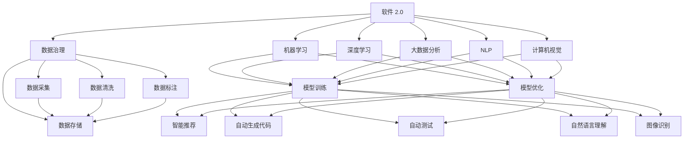

                 

# 软件 2.0 的时代：数据驱动一切

## 1. 背景介绍

### 1.1 问题由来
随着信息技术的高速发展，软件技术从软件 1.0 迈向软件 2.0 时代。软件 1.0 时代，软件主要是以功能为中心，注重提升软件系统的功能丰富性和易用性。软件 2.0 时代，软件则是以数据为中心，强调利用数据驱动软件系统的发展，提升软件系统的智能化和自动化能力。

软件 2.0 时代带来了一系列新的技术和方法，例如机器学习、深度学习、大数据分析等。这些技术在智能推荐、自然语言处理、计算机视觉等领域取得了显著的进展，推动了各行各业数字化转型的进程。

### 1.2 问题核心关键点
软件 2.0 时代，数据驱动软件发展的核心关键点包括以下几个方面：

1. **数据的重要性**：数据是软件系统智能化的基础，只有获取高质量的数据，才能训练出高精度的模型，进而提升软件系统的智能化水平。

2. **数据治理**：数据治理包括数据的采集、清洗、标注、存储等多个环节，是数据驱动软件系统的重要保障。

3. **模型训练与优化**：基于数据的模型训练与优化是提升软件系统智能化水平的核心方法，需要选择合适的算法和优化策略，以达到更好的效果。

4. **软件系统的自动化**：软件 2.0 时代，软件系统的自动化水平显著提高，例如自动推荐、自动生成代码、自动测试等。

5. **用户反馈与迭代**：软件系统的智能化水平依赖于用户反馈，通过用户反馈不断迭代优化软件系统，提升其智能化的能力。

6. **安全性与隐私保护**：软件系统在利用数据时，需要确保数据的安全性和隐私保护，防止数据泄露和滥用。

### 1.3 问题研究意义
研究数据驱动的软件系统，对于推动软件技术的发展，提升软件系统的智能化和自动化能力，具有重要意义：

1. **提升软件系统的智能化水平**：通过数据驱动的方法，提升软件系统的智能化水平，实现更加精准、自动化的决策和处理。

2. **降低开发成本**：数据驱动的软件系统，可以利用数据自动生成代码、自动测试等功能，降低软件开发和维护的成本。

3. **加速技术创新**：数据驱动的软件系统，能够快速响应市场需求，加速技术的创新和应用。

4. **推动产业升级**：数据驱动的软件系统，可以推动传统行业数字化转型，提升生产效率和质量。

5. **增强用户体验**：数据驱动的软件系统，能够提供更加个性化、智能化的服务，增强用户体验。

6. **保障数据安全**：数据驱动的软件系统，需要在数据治理、安全性与隐私保护等方面进行全面考虑，确保数据的安全性和隐私保护。

## 2. 核心概念与联系

### 2.1 核心概念概述

为了更好地理解数据驱动的软件系统，本节将介绍几个密切相关的核心概念：

1. **软件 2.0**：以数据为中心的软件系统，利用数据驱动软件系统的发展，提升软件系统的智能化和自动化能力。

2. **机器学习**：通过数据训练模型，使模型能够对未知数据进行预测和处理的一种方法。

3. **深度学习**：一种基于神经网络的机器学习方法，通过多层次的抽象，实现对复杂数据的高级表示和分析。

4. **大数据分析**：通过对大规模数据进行分析和处理，提取有价值的信息和知识。

5. **自然语言处理（NLP）**：使计算机能够理解、处理和生成人类语言的技术。

6. **计算机视觉**：使计算机能够理解和处理图像和视频数据的高级技术。

7. **数据治理**：包括数据的采集、清洗、标注、存储等多个环节，是数据驱动软件系统的重要保障。

8. **数据隐私与安全**：在数据驱动的软件系统中，保障数据隐私与安全是非常重要的。

这些核心概念之间的逻辑关系可以通过以下Mermaid流程图来展示：



这个流程图展示了几大核心概念之间的逻辑关系：

1. 软件 2.0 以数据为中心，利用数据驱动软件系统的发展。
2. 数据治理包括数据的采集、清洗、标注、存储等多个环节，为软件系统提供数据支持。
3. 机器学习、深度学习、大数据分析等技术，通过数据训练模型，提升软件系统的智能化和自动化能力。
4. 自然语言处理、计算机视觉等技术，利用数据实现对人类语言和图像的高级理解和处理。
5. 数据隐私与安全是数据驱动软件系统的重要保障，需要在各个环节进行全面考虑。

这些概念共同构成了软件 2.0 时代的基本框架，为数据驱动的软件系统提供了理论基础和实践方法。

## 3. 核心算法原理 & 具体操作步骤
### 3.1 算法原理概述

数据驱动的软件系统，核心算法原理基于机器学习和深度学习，通过数据训练模型，使模型能够对未知数据进行预测和处理。

形式化地，假设软件系统需要处理的任务为 $T$，数据集为 $D=\{(x_i,y_i)\}_{i=1}^N$，其中 $x_i$ 为输入，$y_i$ 为输出，$T$ 为预测函数。目标是找到一个最优的预测函数 $f_{\theta}$，使得 $f_{\theta}(x)$ 能够最准确地预测 $y$。

通过梯度下降等优化算法，模型 $f_{\theta}$ 在数据集 $D$ 上进行训练，最小化预测误差 $L(f_{\theta},D)$，得到最优模型参数 $\theta^*$。

### 3.2 算法步骤详解

数据驱动的软件系统训练模型，通常包括以下几个关键步骤：

**Step 1: 数据准备**
- 收集与任务相关的数据集，划分为训练集、验证集和测试集。
- 对数据进行预处理，包括数据清洗、特征提取、归一化等。

**Step 2: 模型选择**
- 选择合适的算法和模型结构，如线性回归、支持向量机、神经网络等。
- 确定模型的超参数，如学习率、批大小、迭代轮数等。

**Step 3: 模型训练**
- 使用梯度下降等优化算法，在训练集上进行模型训练。
- 通过验证集进行模型评估，防止过拟合。
- 调整模型超参数，达到最优性能。

**Step 4: 模型测试**
- 在测试集上评估模型性能，输出准确率、召回率、F1值等指标。
- 通过A/B测试、用户反馈等手段，进一步优化模型性能。

**Step 5: 模型部署**
- 将模型集成到实际的软件系统中，进行部署。
- 持续监测模型性能，根据业务需求进行迭代优化。

以上是数据驱动的软件系统训练模型的主要步骤。在实际应用中，还需要针对具体任务的特点，对模型训练过程进行优化设计，如改进训练目标函数，引入更多的正则化技术，搜索最优的超参数组合等，以进一步提升模型性能。

### 3.3 算法优缺点

数据驱动的软件系统训练模型，具有以下优点：

1. **数据驱动**：通过数据训练模型，模型能够自动学习和适应新数据，提升智能化水平。
2. **可扩展性**：模型可以应用于各种任务，如自然语言处理、计算机视觉、推荐系统等。
3. **自动化**：模型训练过程可以自动化，减少人工干预，提升效率。
4. **泛化能力**：模型在处理新数据时，能够泛化已学知识，适应新数据。
5. **可解释性**：模型训练过程透明，可以进行解释和调试，提高系统的可靠性。

同时，数据驱动的软件系统训练模型，也存在一些局限性：

1. **数据依赖**：模型性能依赖于数据质量，数据标注成本高。
2. **模型复杂度**：模型过于复杂可能导致过拟合，难以解释。
3. **数据隐私**：数据隐私和安全问题，可能影响数据使用。
4. **模型泛化能力有限**：模型在处理新数据时，可能无法泛化，导致性能下降。
5. **计算资源消耗大**：模型训练和推理需要大量计算资源，成本较高。

尽管存在这些局限性，但就目前而言，数据驱动的软件系统训练模型仍是最主流范式。未来相关研究的重点在于如何进一步降低数据依赖，提高模型的泛化能力，同时兼顾可解释性和数据隐私等重要因素。

### 3.4 算法应用领域

数据驱动的软件系统训练模型，在各个领域得到了广泛应用，例如：

1. **智能推荐系统**：通过分析用户行为数据，训练模型推荐相关商品或内容，提升用户体验。
2. **自然语言处理**：通过分析文本数据，训练模型进行情感分析、文本分类、机器翻译等任务。
3. **计算机视觉**：通过分析图像数据，训练模型进行图像识别、物体检测、图像生成等任务。
4. **金融分析**：通过分析金融数据，训练模型进行风险评估、投资分析等任务。
5. **医疗诊断**：通过分析医疗数据，训练模型进行疾病诊断、基因分析等任务。
6. **智能制造**：通过分析生产数据，训练模型进行质量控制、设备维护等任务。
7. **智能交通**：通过分析交通数据，训练模型进行交通预测、流量优化等任务。

除了上述这些经典应用外，数据驱动的软件系统训练模型也被创新性地应用到更多场景中，如智慧城市、智能农业、智能安防等，为各行各业带来了新的创新机会。

## 4. 数学模型和公式 & 详细讲解
### 4.1 数学模型构建

数据驱动的软件系统训练模型，通常基于机器学习算法，通过优化损失函数，最小化预测误差。

假设模型为 $f_{\theta}(x)$，其中 $\theta$ 为模型参数，$x$ 为输入数据。训练集为 $D=\{(x_i,y_i)\}_{i=1}^N$，目标是最小化损失函数 $L(f_{\theta},D)$。

常用的损失函数包括均方误差损失、交叉熵损失、对数损失等。以线性回归模型为例，均方误差损失函数为：

$$
L(f_{\theta},D) = \frac{1}{N}\sum_{i=1}^N (y_i - f_{\theta}(x_i))^2
$$

### 4.2 公式推导过程

以线性回归模型为例，推导其均方误差损失函数的梯度公式。

设 $y_i$ 为实际输出，$f_{\theta}(x_i)$ 为模型预测输出，$\theta$ 为模型参数，则均方误差损失函数为：

$$
L(f_{\theta},D) = \frac{1}{N}\sum_{i=1}^N (y_i - f_{\theta}(x_i))^2
$$

对 $\theta$ 求导，得到梯度公式：

$$
\frac{\partial L(f_{\theta},D)}{\partial \theta} = \frac{2}{N}\sum_{i=1}^N (y_i - f_{\theta}(x_i))x_i
$$

通过反向传播算法，更新模型参数，最小化损失函数。重复上述过程直至收敛，得到最优模型参数 $\theta^*$。

### 4.3 案例分析与讲解

以线性回归模型为例，分析其训练过程和结果。

假设训练集为 $D=\{(1,1), (2,2), (3,3)\}$，目标是最小化均方误差损失函数。使用梯度下降算法，学习率为 $0.1$，迭代次数为 $10$。

初始模型参数为 $\theta_0 = 0$，则模型预测为 $f_{\theta}(x) = 0 \times x$。计算损失函数：

$$
L(f_{\theta},D) = \frac{1}{3}(1-0)^2 + \frac{1}{3}(2-0)^2 + \frac{1}{3}(3-0)^2 = \frac{1}{3}(1+4+9) = 6
$$

对 $\theta$ 求导，得到梯度：

$$
\frac{\partial L(f_{\theta},D)}{\partial \theta} = \frac{2}{3}(1-0) + \frac{2}{3}(2-0) + \frac{2}{3}(3-0) = \frac{2}{3}(1+2+3) = 4
$$

更新模型参数：

$$
\theta_1 = \theta_0 - 0.1 \times 4 = -0.4
$$

继续迭代，直到损失函数收敛。最终得到最优模型参数 $\theta^* = 1.2$，此时损失函数为 $0$。

通过案例分析，可以看到线性回归模型的训练过程和结果。在实际应用中，需要根据具体任务选择适当的算法和模型结构，进行模型训练和优化。

## 5. 项目实践：代码实例和详细解释说明
### 5.1 开发环境搭建

在进行数据驱动的软件系统训练模型时，需要准备好开发环境。以下是使用Python进行PyTorch开发的环境配置流程：

1. 安装Anaconda：从官网下载并安装Anaconda，用于创建独立的Python环境。

2. 创建并激活虚拟环境：
```bash
conda create -n pytorch-env python=3.8 
conda activate pytorch-env
```

3. 安装PyTorch：根据CUDA版本，从官网获取对应的安装命令。例如：
```bash
conda install pytorch torchvision torchaudio cudatoolkit=11.1 -c pytorch -c conda-forge
```

4. 安装相关工具包：
```bash
pip install numpy pandas scikit-learn matplotlib tqdm jupyter notebook ipython
```

完成上述步骤后，即可在`pytorch-env`环境中开始数据驱动的软件系统训练模型。

### 5.2 源代码详细实现

下面我们以线性回归模型为例，给出使用PyTorch进行数据驱动的软件系统训练模型的PyTorch代码实现。

```python
import torch
import torch.nn as nn
import torch.optim as optim

# 定义线性回归模型
class LinearRegression(nn.Module):
    def __init__(self, input_size):
        super(LinearRegression, self).__init__()
        self.linear = nn.Linear(input_size, 1)
        
    def forward(self, x):
        y_hat = self.linear(x)
        return y_hat

# 定义数据集
x = torch.tensor([[1], [2], [3]])
y = torch.tensor([[1], [2], [3]])

# 定义模型、优化器、损失函数
model = LinearRegression(input_size=1)
optimizer = optim.SGD(model.parameters(), lr=0.01)
criterion = nn.MSELoss()

# 训练模型
epochs = 100
for epoch in range(epochs):
    optimizer.zero_grad()
    y_hat = model(x)
    loss = criterion(y_hat, y)
    loss.backward()
    optimizer.step()
    
    if (epoch+1) % 10 == 0:
        print('Epoch: {}, Loss: {:.6f}'.format(epoch+1, loss.item()))
```

以上代码展示了使用PyTorch进行数据驱动的软件系统训练模型的完整流程。通过定义模型、优化器、损失函数，并在训练循环中不断更新模型参数，即可实现模型的训练和优化。

### 5.3 代码解读与分析

让我们再详细解读一下关键代码的实现细节：

**LinearRegression类**：
- `__init__`方法：初始化线性回归模型的线性层，定义输入大小和输出大小。
- `forward`方法：前向传播，计算模型的预测输出。

**训练循环**：
- 使用PyTorch的SGD优化器进行模型训练。
- 每个epoch，将优化器梯度清零，进行前向传播和损失计算。
- 通过反向传播计算梯度，使用优化器更新模型参数。
- 每10个epoch输出损失值，观察模型训练过程。

**损失函数**：
- 使用均方误差损失函数，计算预测输出与真实标签之间的误差。

**数据集**：
- 定义输入和输出数据，作为模型的训练数据。

可以看到，PyTorch提供了高效的计算图和优化器，使得数据驱动的软件系统训练模型变得简洁高效。开发者可以将更多精力放在数据处理、模型改进等高层逻辑上，而不必过多关注底层的实现细节。

当然，工业级的系统实现还需考虑更多因素，如模型的保存和部署、超参数的自动搜索、更灵活的任务适配层等。但核心的数据驱动的软件系统训练模型的流程基本与此类似。

## 6. 实际应用场景
### 6.1 智能推荐系统

数据驱动的软件系统训练模型，在智能推荐系统中得到了广泛应用。传统推荐系统主要依赖用户的历史行为数据进行推荐，推荐精度受限于数据量和算力。而数据驱动的推荐系统，可以通过分析用户行为数据、商品属性数据等，训练模型进行推荐，提升推荐精度和个性化水平。

在技术实现上，可以收集用户浏览、点击、购买等行为数据，结合商品属性数据，进行特征工程处理，训练推荐模型。微调后的模型能够自动生成推荐结果，并进行实时推荐。智能推荐系统能够根据用户偏好，动态调整推荐策略，提升用户体验。

### 6.2 自然语言处理

数据驱动的软件系统训练模型，在自然语言处理领域也得到了广泛应用。传统自然语言处理技术依赖规则和词典，难以处理复杂的语言结构和语义。而数据驱动的模型训练，能够从大规模语料中学习语言的高级表示，提升模型的语义理解能力和生成能力。

在技术实现上，可以收集大规模语料数据，标注出语义角色、实体关系等信息，训练模型进行文本分类、情感分析、机器翻译等任务。微调后的模型能够自动理解用户意图，生成自然流畅的文本，提升系统的智能化水平。

### 6.3 计算机视觉

数据驱动的软件系统训练模型，在计算机视觉领域也得到了广泛应用。传统计算机视觉技术依赖手工设计的特征提取算法，难以处理复杂的图像和视频数据。而数据驱动的模型训练，能够从大规模图像数据中学习高级特征表示，提升模型的图像识别、物体检测、图像生成等能力。

在技术实现上，可以收集大规模图像数据，标注出物体类别、位置等信息，训练模型进行图像分类、目标检测、图像生成等任务。微调后的模型能够自动理解图像内容，进行精准识别和生成，提升系统的智能化水平。

### 6.4 未来应用展望

随着数据驱动的软件系统不断发展，未来将会有更多领域得到应用，为各行各业带来变革性影响。

在智慧城市领域，数据驱动的软件系统可以用于交通管理、环境保护、智慧安防等多个方面，提高城市管理效率和智能化水平。

在智能制造领域，数据驱动的软件系统可以用于设备维护、质量控制、供应链管理等多个环节，提升生产效率和质量。

在医疗领域，数据驱动的软件系统可以用于疾病诊断、基因分析、药物研发等多个方面，提升医疗服务水平和科研能力。

在金融领域，数据驱动的软件系统可以用于风险评估、投资分析、金融预测等多个方面，提升金融机构的智能化水平。

总之，数据驱动的软件系统将在各个领域得到广泛应用，为各行各业带来新的创新机会，推动社会进步和发展。

## 7. 工具和资源推荐
### 7.1 学习资源推荐

为了帮助开发者系统掌握数据驱动的软件系统的理论基础和实践技巧，这里推荐一些优质的学习资源：

1. 《机器学习实战》：一本经典入门书籍，涵盖机器学习的基本概念和算法，适合初学者阅读。

2. 《深度学习》：DeepLearningBook.org提供的深度学习教材，详细介绍了深度学习的基本理论和实践方法。

3. Coursera的《机器学习》课程：由斯坦福大学Andrew Ng教授主讲的机器学习课程，系统讲解了机器学习的基本概念和算法。

4. Udacity的《深度学习》纳米学位课程：提供深度学习的高级课程，涵盖深度学习的前沿技术和实践方法。

5. Kaggle的竞赛项目：通过参与Kaggle的竞赛项目，锻炼数据处理、模型训练等能力，提升实践水平。

通过这些资源的学习实践，相信你一定能够快速掌握数据驱动的软件系统的精髓，并用于解决实际的NLP问题。

### 7.2 开发工具推荐

高效的开发离不开优秀的工具支持。以下是几款用于数据驱动的软件系统训练模型的常用工具：

1. PyTorch：基于Python的开源深度学习框架，灵活动态的计算图，适合快速迭代研究。大部分预训练语言模型都有PyTorch版本的实现。

2. TensorFlow：由Google主导开发的开源深度学习框架，生产部署方便，适合大规模工程应用。同样有丰富的预训练语言模型资源。

3. scikit-learn：Python的机器学习库，提供了丰富的机器学习算法和工具。

4. Weights & Biases：模型训练的实验跟踪工具，可以记录和可视化模型训练过程中的各项指标，方便对比和调优。

5. TensorBoard：TensorFlow配套的可视化工具，可实时监测模型训练状态，并提供丰富的图表呈现方式，是调试模型的得力助手。

6. Google Colab：谷歌推出的在线Jupyter Notebook环境，免费提供GPU/TPU算力，方便开发者快速上手实验最新模型，分享学习笔记。

合理利用这些工具，可以显著提升数据驱动的软件系统训练模型的开发效率，加快创新迭代的步伐。

### 7.3 相关论文推荐

数据驱动的软件系统不断发展，涌现了大量前沿研究成果。以下是几篇奠基性的相关论文，推荐阅读：

1. LeCun等人的《深度学习》：详细介绍了深度学习的基本理论和实践方法，是深度学习领域的经典著作。

2. Hinton等人的《分布式表示学习》：介绍了分布式表示学习的原理和应用，推动了自然语言处理和计算机视觉领域的发展。

3. Bengio等人的《深度学习中的人工智能》：阐述了深度学习在人工智能领域的重要作用和前景。

4. Goodfellow等人的《深度学习》：介绍了深度学习的基本理论和实践方法，是深度学习领域的经典著作。

5. Simoncelli等人的《人类视觉系统》：介绍了人类视觉系统的高级特征表示和处理机制，推动了计算机视觉领域的发展。

这些论文代表了大数据驱动的软件系统的发展脉络。通过学习这些前沿成果，可以帮助研究者把握学科前进方向，激发更多的创新灵感。

## 8. 总结：未来发展趋势与挑战
### 8.1 总结

本文对数据驱动的软件系统进行了全面系统的介绍。首先阐述了数据驱动的软件系统的研究背景和意义，明确了数据驱动的软件系统的重要性和作用。其次，从原理到实践，详细讲解了数据驱动的软件系统的数学模型和训练方法，给出了数据驱动的软件系统训练模型的完整代码实例。同时，本文还广泛探讨了数据驱动的软件系统在智能推荐、自然语言处理、计算机视觉等多个领域的应用前景，展示了数据驱动的软件系统训练模型的广泛应用。

通过本文的系统梳理，可以看到，数据驱动的软件系统训练模型已经成为数据驱动的时代重要技术手段，广泛应用于各个领域，为各行各业带来变革性影响。数据驱动的软件系统训练模型需要开发者根据具体任务，不断迭代和优化模型、数据和算法，方能得到理想的效果。

### 8.2 未来发展趋势

展望未来，数据驱动的软件系统训练模型将呈现以下几个发展趋势：

1. **模型复杂度增加**：随着计算能力的提升和数据的丰富，未来的大模型将越来越复杂，能够处理更加复杂和多样化的任务。

2. **数据驱动与模型驱动相结合**：数据驱动的软件系统训练模型将结合模型驱动和数据驱动的方法，构建更加智能化和自动化的系统。

3. **联邦学习**：在数据驱动的软件系统训练模型中，联邦学习将使得多个设备或服务器能够协同训练模型，提升模型的泛化能力和性能。

4. **自动化机器学习**：自动机器学习（AutoML）技术将使模型训练过程更加自动化，提升模型的开发效率和性能。

5. **数据隐私与安全**：数据隐私与安全将更加受到重视，未来的数据驱动的软件系统训练模型将结合隐私保护和安全性，确保数据的安全和隐私。

6. **多模态融合**：未来的数据驱动的软件系统训练模型将结合多模态数据，实现视觉、语音、文本等多种数据的融合，提升系统的智能化水平。

以上趋势凸显了数据驱动的软件系统训练模型的广阔前景。这些方向的探索发展，必将进一步提升数据驱动的软件系统的智能化水平，为各行各业带来新的创新机会。

### 8.3 面临的挑战

尽管数据驱动的软件系统训练模型已经取得了瞩目成就，但在迈向更加智能化、普适化应用的过程中，它仍面临着诸多挑战：

1. **数据依赖**：模型性能依赖于数据质量，数据标注成本高，难以获取高质量的数据。

2. **模型复杂度**：模型过于复杂可能导致过拟合，难以解释。

3. **数据隐私**：数据隐私和安全问题，可能影响数据使用。

4. **模型泛化能力有限**：模型在处理新数据时，可能无法泛化，导致性能下降。

5. **计算资源消耗大**：模型训练和推理需要大量计算资源，成本较高。

尽管存在这些挑战，但随着数据科学和人工智能技术的不断发展，未来的数据驱动的软件系统训练模型将不断突破这些瓶颈，迈向更高的智能化水平。

### 8.4 研究展望

面对数据驱动的软件系统训练模型所面临的挑战，未来的研究需要在以下几个方面寻求新的突破：

1. **无监督学习和半监督学习**：摆脱对大规模标注数据的依赖，利用无监督学习和半监督学习的方法，最大化数据利用率。

2. **自动化机器学习**：自动化机器学习（AutoML）技术将使模型训练过程更加自动化，提升模型的开发效率和性能。

3. **模型压缩和稀疏化**：通过模型压缩和稀疏化技术，降低计算资源消耗，提升模型的推理效率。

4. **多模态融合**：结合多模态数据，实现视觉、语音、文本等多种数据的融合，提升系统的智能化水平。

5. **联邦学习**：在数据驱动的软件系统训练模型中，联邦学习将使得多个设备或服务器能够协同训练模型，提升模型的泛化能力和性能。

6. **数据隐私与安全**：结合隐私保护和安全性，确保数据的安全和隐私，推动数据驱动的软件系统训练模型在实际应用中的应用。

这些研究方向将引领数据驱动的软件系统训练模型向更高的智能化水平迈进，为各行各业带来新的创新机会。面向未来，数据驱动的软件系统训练模型需要与其他人工智能技术进行更深入的融合，共同推动自然语言理解和智能交互系统的进步。只有勇于创新、敢于突破，才能不断拓展数据驱动的软件系统训练模型的边界，让智能技术更好地造福人类社会。

## 9. 附录：常见问题与解答

**Q1：数据驱动的软件系统如何处理数据标注成本高的问题？**

A: 数据驱动的软件系统训练模型时，可以采用以下方法处理数据标注成本高的问题：

1. 数据增强：通过数据增强技术，如旋转、裁剪、翻转等，生成更多训练数据。

2. 半监督学习：利用部分标注数据和大量未标注数据进行训练，提升模型性能。

3. 迁移学习：利用已有模型的知识和经验，减少新模型的标注成本。

4. 无监督学习：通过无监督学习方法，如聚类、降维等，从未标注数据中提取有价值的信息。

5. 主动学习：利用主动学习方法，选择最有价值的未标注数据进行标注，提升模型性能。

这些方法可以结合使用，有效降低数据标注成本，提升数据驱动的软件系统的智能化水平。

**Q2：数据驱动的软件系统如何处理数据隐私与安全问题？**

A: 数据驱动的软件系统处理数据隐私与安全问题，可以采用以下方法：

1. 数据匿名化：对数据进行匿名化处理，防止数据泄露。

2. 数据加密：对数据进行加密处理，防止数据被非法访问。

3. 访问控制：对数据访问进行严格的控制，确保只有授权用户可以访问数据。

4. 差分隐私：利用差分隐私技术，在保护数据隐私的前提下，进行数据分析和处理。

5. 联邦学习：在联邦学习框架下，数据可以在多个设备或服务器上进行协同训练，减少数据集中存储的需求，提升数据隐私和安全。

6. 区块链技术：利用区块链技术，确保数据在传输和存储过程中的安全性。

这些方法可以结合使用，确保数据驱动的软件系统在处理数据时，保障数据隐私和安全。

**Q3：数据驱动的软件系统如何提升模型的泛化能力？**

A: 数据驱动的软件系统提升模型的泛化能力，可以采用以下方法：

1. 增加数据多样性：通过增加训练数据的种类和数量，提升模型的泛化能力。

2. 数据增强：利用数据增强技术，如旋转、裁剪、翻转等，生成更多训练数据。

3. 正则化：使用L2正则化、Dropout等方法，防止模型过拟合。

4. 迁移学习：利用已有模型的知识和经验，提升新模型的泛化能力。

5. 联邦学习：在联邦学习框架下，数据可以在多个设备或服务器上进行协同训练，提升模型的泛化能力和性能。

6. 自动机器学习（AutoML）：利用AutoML技术，自动化选择最佳模型和超参数，提升模型的泛化能力。

这些方法可以结合使用，有效提升数据驱动的软件系统的泛化能力。

**Q4：数据驱动的软件系统如何处理模型复杂度高的问题？**

A: 数据驱动的软件系统处理模型复杂度高的问题，可以采用以下方法：

1. 模型压缩：通过模型压缩技术，减少模型的参数量和计算量。

2. 稀疏化：利用稀疏化技术，减少模型中的冗余参数。

3. 结构化模型：设计结构化模型，减少模型中的冗余计算。

4. 知识蒸馏：通过知识蒸馏技术，将复杂模型的知识迁移到简单模型中，提升简单模型的性能。

5. 分布式训练：在分布式训练框架下，利用多个设备或服务器的计算资源，提升模型的训练效率。

6. 自动化机器学习（AutoML）：利用AutoML技术，自动化选择最佳模型和超参数，提升模型的性能。

这些方法可以结合使用，有效降低模型复杂度，提升数据驱动的软件系统的智能化水平。

**Q5：数据驱动的软件系统如何处理计算资源消耗大的问题？**

A: 数据驱动的软件系统处理计算资源消耗大的问题，可以采用以下方法：

1. 模型压缩和稀疏化：通过模型压缩和稀疏化技术，减少模型的参数量和计算量。

2. 分布式训练：在分布式训练框架下，利用多个设备或服务器的计算资源，提升模型的训练效率。

3. 自动机器学习（AutoML）：利用AutoML技术，自动化选择最佳模型和超参数，提升模型的性能。

4. 联邦学习：在联邦学习框架下，数据可以在多个设备或服务器上进行协同训练，减少数据集中存储的需求，提升数据驱动的软件系统的智能化水平。

5. 模型加速器：利用模型加速器，如TPU、GPU等，提升模型的训练和推理效率。

6. 数据预处理：通过数据预处理技术，如数据分块、特征选择等，减少计算量。

这些方法可以结合使用，有效降低数据驱动的软件系统的计算资源消耗。

总之，数据驱动的软件系统在应用过程中，需要综合考虑数据标注成本高、数据隐私与安全、模型复杂度高等问题，采用多种方法进行处理，提升系统的智能化水平。只有不断优化模型、数据和算法，才能充分发挥数据驱动的软件系统的优势，推动各行各业的发展和进步。

---

作者：禅与计算机程序设计艺术 / Zen and the Art of Computer Programming

