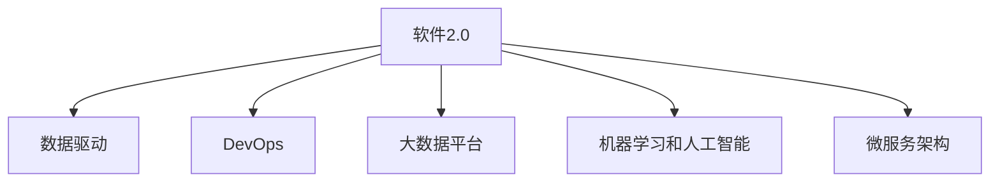

                 

# 软件 2.0 的时代：数据驱动一切

> 关键词：软件2.0,数据驱动,人工智能,大数据,自动化,DevOps

## 1. 背景介绍

### 1.1 问题由来

随着计算机技术的发展和数字化时代的来临，软件行业发生了翻天覆地的变化。从最初的基于编码的软件 1.0 时代，到如今基于数据的软件 2.0 时代，软件行业正逐步进入一个全新的发展阶段。这一转变不仅仅是技术层面的革新，更是思想和理念的深刻变革。

在软件 2.0 时代，数据成为了驱动软件发展的核心引擎。通过对数据的深度挖掘和分析，可以驱动软件开发、测试、运维、优化等各个环节，提升软件的质量和效率。这一转变不仅改变了软件开发的流程和方式，也对软件开发人员的思维方式和技术栈提出了新的要求。

### 1.2 问题核心关键点

在软件 2.0 时代，数据驱动的核心在于以下几个方面：

- **数据为王**：软件的发展离不开数据，数据的获取、存储、处理、分析等成为软件开发的重中之重。
- **自动化技术**：自动化技术的应用，如DevOps、AI辅助开发、代码生成工具等，极大地提高了软件开发的效率和质量。
- **云计算和大数据平台**：云计算和大数据平台提供了强大的计算和存储能力，支持大规模数据的处理和分析，为软件发展提供了坚实的基础。
- **机器学习和人工智能**：机器学习和人工智能技术在软件开发中的应用，使得软件具备了更加智能化的能力，可以自动完成许多复杂任务。
- **可视化技术**：可视化技术的应用，使得数据的展示更加直观，帮助开发者更好地理解数据和进行决策。
- **微服务架构**：微服务架构的引入，使得软件系统更加灵活、可扩展，适应大规模复杂系统的需求。

这些关键点的综合作用，推动了软件 2.0 时代的到来，也为软件行业的发展带来了新的机遇和挑战。

## 2. 核心概念与联系

### 2.1 核心概念概述

为了更好地理解软件 2.0 时代的数据驱动理念，本节将介绍几个关键概念及其之间的联系：

- **软件 2.0**：基于数据的软件开发模式，强调数据的收集、存储、分析和应用。
- **数据驱动**：通过数据的收集和分析，驱动软件的开发、测试、运维等各个环节，提升软件的质量和效率。
- **DevOps**：开发与运维的集成化管理，强调自动化、持续集成和持续部署，提高软件的交付速度和质量。
- **大数据平台**：通过大数据平台，支持大规模数据的存储、处理和分析，提供强大的计算和存储能力。
- **机器学习和人工智能**：利用机器学习和人工智能技术，提升软件的智能分析和决策能力。
- **微服务架构**：通过微服务架构，将复杂的系统拆分成多个小的、独立的服务，提升系统的灵活性和可扩展性。

这些概念之间的联系可以通过以下Mermaid流程图来展示：



这个流程图展示了大数据驱动的软件2.0时代，各个关键概念之间的内在联系。数据驱动是核心，DevOps、大数据平台、机器学习和人工智能等技术为数据驱动提供了强有力的支持，微服务架构则为软件系统的灵活性和可扩展性提供了保障。

## 3. 核心算法原理 & 具体操作步骤
### 3.1 算法原理概述

在软件 2.0 时代，数据驱动的软件开发模式离不开以下几个核心算法原理：

- **数据收集和清洗**：通过自动化工具和流程，从不同来源收集数据，并进行清洗和处理，确保数据的质量和可用性。
- **数据分析和建模**：利用机器学习和数据分析技术，对收集到的数据进行深度分析和建模，提取有价值的信息和规律。
- **决策和优化**：根据数据分析的结果，进行决策和优化，驱动软件开发、测试、运维等各个环节，提升软件的质量和效率。

### 3.2 算法步骤详解

以下是基于数据驱动的软件 2.0 时代，数据驱动软件开发的详细算法步骤：

**Step 1: 数据收集和清洗**

1. **数据收集**：通过自动化工具和流程，从不同来源收集数据，如日志、监控数据、用户行为数据等。
2. **数据清洗**：对收集到的数据进行清洗和处理，去除噪声和异常值，确保数据的质量和可用性。

**Step 2: 数据分析和建模**

1. **特征提取**：从清洗后的数据中提取有意义的特征，如用户行为、日志信息等。
2. **模型训练**：利用机器学习和数据分析技术，对提取的特征进行建模，训练出预测模型。
3. **模型评估**：对训练出的模型进行评估，确保模型的准确性和可靠性。

**Step 3: 决策和优化**

1. **决策驱动**：根据分析结果，进行决策和优化，如自动化测试、自动化部署、持续集成等。
2. **持续改进**：通过持续收集数据和分析，不断改进和优化软件系统，提高软件的质量和效率。

### 3.3 算法优缺点

数据驱动的软件 2.0 开发模式具有以下优点：

- **提升效率**：通过自动化工具和流程，大大提升了软件开发的效率，减少了人工干预。
- **提高质量**：数据驱动的决策和优化，使得软件系统更加可靠和稳定，减少了人为错误。
- **灵活扩展**：微服务架构和数据驱动的开发模式，使得系统更加灵活和可扩展，适应复杂环境的需求。

同时，该模式也存在一定的局限性：

- **数据质量**：数据的质量和完整性直接影响决策的准确性，需要投入大量时间和资源进行数据收集和清洗。
- **技术门槛**：机器学习和数据分析技术的应用，需要具备相应的技术背景和知识，对开发人员提出了较高的要求。
- **隐私和安全**：数据的收集和分析可能涉及用户的隐私信息，需要采取严格的隐私保护措施。

尽管存在这些局限性，但就目前而言，数据驱动的软件 2.0 开发模式仍是大规模软件系统开发的重要手段。未来相关研究的重点在于如何进一步降低技术门槛，提高数据的质量和可用性，同时兼顾隐私和安全等因素。

### 3.4 算法应用领域

数据驱动的软件 2.0 开发模式已经在许多领域得到了广泛的应用，如：

- **金融科技**：通过数据分析和建模，预测市场趋势，进行风险控制和投资决策。
- **医疗健康**：利用患者数据和医疗设备数据，进行疾病预测和诊断，提升医疗服务的质量和效率。
- **智慧城市**：通过城市数据和监控设备数据，进行交通流量预测、环境监测、应急管理等，提升城市管理的智能化水平。
- **工业互联网**：利用物联网设备和生产数据，进行生产优化、质量控制、设备维护等，提升工业生产的自动化和智能化水平。
- **电子商务**：通过用户行为数据和交易数据，进行用户画像分析、推荐系统优化、库存管理等，提升用户体验和运营效率。
- **智能制造**：利用传感器和设备数据，进行生产过程监控、质量检测、设备维护等，提升生产效率和产品质量。
- **自动驾驶**：通过车辆传感器和交通数据，进行路径规划、安全预警、行为预测等，提升驾驶安全和智能化水平。

除了上述这些经典领域，数据驱动的软件 2.0 开发模式还将广泛应用于更多场景中，如智慧能源、智能家居、农业生产等，为各行各业带来全新的变革。

## 4. 数学模型和公式 & 详细讲解 & 举例说明

### 4.1 数学模型构建

在软件 2.0 时代，数据驱动的核心在于对数据的深度分析和建模。以下是一个简单的数据驱动决策模型的数学模型构建过程。

假设我们有一个二分类问题，需要根据用户的历史行为数据，判断其是否会购买某个产品。设 $x$ 为特征向量， $y$ 为标签， $f(x;\theta)$ 为模型， $\theta$ 为模型参数。模型的目标是最小化预测误差 $L(f(x;\theta),y)$。

**Step 1: 构建模型**

1. **特征工程**：从用户行为数据中提取有意义的特征 $x$。
2. **模型选择**：选择合适的模型 $f(x;\theta)$，如逻辑回归、支持向量机等。

**Step 2: 损失函数设计**

1. **损失函数**：根据预测结果和真实标签，设计合适的损失函数 $L(f(x;\theta),y)$，如交叉熵损失、均方误差损失等。
2. **目标函数**：将损失函数转化为目标函数 $J(\theta)$，即最小化损失函数。

**Step 3: 优化算法**

1. **优化算法**：选择适合的优化算法，如梯度下降、随机梯度下降、Adam等，更新模型参数 $\theta$。
2. **参数更新**：根据目标函数和优化算法，更新模型参数，迭代优化模型。

### 4.2 公式推导过程

以逻辑回归模型为例，推导目标函数的优化过程。

设 $f(x;\theta) = \frac{1}{1+e^{-z(x;\theta)}}$，其中 $z(x;\theta) = \theta^Tx$， $\theta$ 为模型参数。交叉熵损失函数为：

$$
L(y,f(x;\theta)) = -y\log f(x;\theta) - (1-y)\log(1-f(x;\theta))
$$

目标函数为：

$$
J(\theta) = \frac{1}{N}\sum_{i=1}^N L(y_i,f(x_i;\theta))
$$

目标函数的梯度为：

$$
\nabla_{\theta}J(\theta) = -\frac{1}{N}\sum_{i=1}^N f(x_i;\theta)(1-y_i)\frac{\partial f(x_i;\theta)}{\partial \theta} - (1-f(x_i;\theta))y_i\frac{\partial f(x_i;\theta)}{\partial \theta}
$$

根据链式法则，梯度更新公式为：

$$
\theta \leftarrow \theta - \eta \nabla_{\theta}J(\theta)
$$

其中 $\eta$ 为学习率。

### 4.3 案例分析与讲解

以推荐系统为例，介绍基于数据驱动的推荐算法。

推荐系统的目标是根据用户的历史行为和兴趣，推荐可能感兴趣的商品。假设我们有一个用户-商品矩阵 $U$，其中 $U_{i,j}$ 表示用户 $i$ 对商品 $j$ 的评分。我们的目标是学习一个推荐模型 $f(x;\theta)$，根据用户特征 $x$ 和商品特征 $y$，预测用户对商品的评分 $y_j=f(x;\theta)$。

**Step 1: 特征工程**

1. **用户特征**：从用户行为数据中提取用户特征 $x_i$，如用户年龄、性别、浏览历史等。
2. **商品特征**：从商品数据中提取商品特征 $y_j$，如商品类别、价格、评论等。

**Step 2: 模型选择**

1. **模型选择**：选择合适的模型 $f(x;\theta)$，如矩阵分解模型、深度神经网络等。

**Step 3: 损失函数设计**

1. **损失函数**：根据预测结果和真实评分，设计合适的损失函数 $L(y,f(x;\theta))$，如均方误差损失、交叉熵损失等。
2. **目标函数**：将损失函数转化为目标函数 $J(\theta)$，即最小化损失函数。

**Step 4: 优化算法**

1. **优化算法**：选择适合的优化算法，如梯度下降、随机梯度下降、Adam等，更新模型参数 $\theta$。
2. **参数更新**：根据目标函数和优化算法，更新模型参数，迭代优化模型。

在实践中，推荐系统会根据用户的实时行为数据，动态调整推荐结果，提升推荐的个性化和精准度。

## 5. 项目实践：代码实例和详细解释说明

### 5.1 开发环境搭建

在进行数据驱动的软件 2.0 开发实践前，我们需要准备好开发环境。以下是使用Python进行PyTorch开发的环境配置流程：

1. 安装Anaconda：从官网下载并安装Anaconda，用于创建独立的Python环境。

2. 创建并激活虚拟环境：
```bash
conda create -n pytorch-env python=3.8 
conda activate pytorch-env
```

3. 安装PyTorch：根据CUDA版本，从官网获取对应的安装命令。例如：
```bash
conda install pytorch torchvision torchaudio cudatoolkit=11.1 -c pytorch -c conda-forge
```

4. 安装TensorFlow：
```bash
pip install tensorflow
```

5. 安装TensorBoard：
```bash
pip install tensorboard
```

6. 安装PyTorch Lightning：
```bash
pip install pytorch-lightning
```

7. 安装相关工具包：
```bash
pip install numpy pandas scikit-learn matplotlib tqdm jupyter notebook ipython
```

完成上述步骤后，即可在`pytorch-env`环境中开始数据驱动的实践。

### 5.2 源代码详细实现

以下是使用PyTorch进行推荐系统开发的一个完整代码实现。

```python
import torch
import torch.nn as nn
import torch.nn.functional as F
import torch.optim as optim
from torch.utils.data import DataLoader, Dataset
from sklearn.model_selection import train_test_split

class RecommendationSystem(nn.Module):
    def __init__(self, hidden_dim, output_dim):
        super(RecommendationSystem, self).__init__()
        self.hidden_dim = hidden_dim
        self.fc1 = nn.Linear(hidden_dim, hidden_dim)
        self.fc2 = nn.Linear(hidden_dim, output_dim)
    
    def forward(self, x):
        x = F.relu(self.fc1(x))
        x = self.fc2(x)
        return x

# 定义推荐系统模型
model = RecommendationSystem(hidden_dim=64, output_dim=1)

# 定义损失函数
loss_fn = nn.MSELoss()

# 定义优化器
optimizer = optim.Adam(model.parameters(), lr=0.001)

# 加载数据集
train_data, test_data = train_test_split(train_data, test_size=0.2)
train_loader = DataLoader(train_data, batch_size=64, shuffle=True)
test_loader = DataLoader(test_data, batch_size=64, shuffle=False)

# 定义训练函数
def train(model, loader, loss_fn, optimizer):
    model.train()
    for batch in loader:
        inputs, labels = batch
        optimizer.zero_grad()
        outputs = model(inputs)
        loss = loss_fn(outputs, labels)
        loss.backward()
        optimizer.step()

# 训练模型
num_epochs = 10
for epoch in range(num_epochs):
    train(model, train_loader, loss_fn, optimizer)
    
# 评估模型
model.eval()
with torch.no_grad():
    predictions = []
    targets = []
    for batch in test_loader:
        inputs, labels = batch
        outputs = model(inputs)
        predictions.append(outputs.data.numpy())
        targets.append(labels.data.numpy())
    predictions = np.concatenate(predictions, axis=0)
    targets = np.concatenate(targets, axis=0)
    mse = np.mean((predictions - targets)**2)
    print('Mean Squared Error:', mse)
```

### 5.3 代码解读与分析

让我们再详细解读一下关键代码的实现细节：

**RecommendationSystem类**：
- `__init__`方法：初始化模型参数，定义全连接层。
- `forward`方法：定义前向传播过程，输入数据经过两组全连接层，输出预测结果。

**train函数**：
- 在训练过程中，首先设置模型为训练模式，将输入数据和标签作为输入，计算损失函数。
- 使用反向传播算法更新模型参数，并返回损失值。

**训练流程**：
- 定义总的epoch数，循环迭代
- 每个epoch内，先在训练集上进行训练，输出平均loss
- 在测试集上评估模型性能，输出最终测试结果

可以看到，PyTorch配合TensorBoard使得推荐系统的代码实现变得简洁高效。开发者可以将更多精力放在数据处理、模型改进等高层逻辑上，而不必过多关注底层的实现细节。

当然，工业级的系统实现还需考虑更多因素，如模型的保存和部署、超参数的自动搜索、更灵活的任务适配层等。但核心的数据驱动范式基本与此类似。

## 6. 实际应用场景

### 6.1 智能推荐系统

基于数据驱动的软件 2.0 开发模式，智能推荐系统在电商、视频、音乐等领域得到了广泛应用。推荐系统可以根据用户的历史行为和偏好，推荐个性化的商品、视频、音乐等，提升用户体验和满意度。

在技术实现上，推荐系统通常通过分析用户的历史行为数据，提取用户特征和商品特征，训练推荐模型，并在实时数据上动态调整推荐结果。推荐的个性化和精准度直接依赖于数据的收集和处理质量。

### 6.2 风险预测和控制系统

金融和医疗领域对风险预测和控制系统有很高的需求。通过数据驱动的开发模式，可以构建精准的风险预测和控制系统，提升决策的准确性和可靠性。

在金融领域，风险控制系统可以实时监控市场波动，预测风险事件，及时进行风险预警和控制。在医疗领域，风险预测系统可以预测患者疾病风险，进行个性化的健康管理。这些系统依赖于大规模数据的收集和分析，数据的质量和完整性直接影响系统的性能。

### 6.3 工业自动化系统

工业自动化系统通过数据驱动的开发模式，可以实现设备状态监测、生产过程优化、质量控制等。通过物联网设备和传感器数据的收集和分析，可以实现智能化的生产过程，提升生产效率和产品质量。

在技术实现上，工业自动化系统通常通过实时数据流的分析和建模，构建智能化的决策和控制系统，提升系统的自动化水平和智能化程度。数据驱动的开发模式为工业自动化的发展提供了强有力的支持。

### 6.4 未来应用展望

随着数据驱动的软件 2.0 开发模式的不断发展，未来将有更多行业和领域引入这一模式，带来全新的变革：

- **智慧城市**：通过城市数据和监控设备数据，构建智能化的城市管理系统，提升城市的智能化水平。
- **智能制造**：通过传感器和设备数据，构建智能化的生产管理系统，提升生产效率和产品质量。
- **智能家居**：通过家庭设备数据，构建智能化的家居管理系统，提升家庭生活的便利性和舒适性。
- **智能交通**：通过车辆传感器和交通数据，构建智能化的交通管理系统，提升交通的智能化水平。
- **智慧农业**：通过农业设备和环境数据，构建智能化的农业管理系统，提升农业生产的智能化水平。
- **智能能源**：通过能源设备和环境数据，构建智能化的能源管理系统，提升能源的利用效率和智能化水平。

这些应用场景将进一步推动数据驱动的软件 2.0 开发模式的普及和应用，为各行各业带来更多的创新和变革。

## 7. 工具和资源推荐

### 7.1 学习资源推荐

为了帮助开发者系统掌握数据驱动的软件 2.0 开发技术，这里推荐一些优质的学习资源：

1. **《Python数据科学手册》**：介绍Python在数据科学中的应用，涵盖数据收集、清洗、处理、分析等各个环节。
2. **《深度学习入门》**：介绍深度学习的基本概念和实现方法，涵盖神经网络、卷积神经网络、循环神经网络等。
3. **《机器学习实战》**：介绍机器学习的基本概念和实现方法，涵盖回归、分类、聚类等算法。
4. **《数据科学实战》**：介绍数据科学的基本概念和实现方法，涵盖数据清洗、特征工程、模型选择等。
5. **《TensorFlow实战》**：介绍TensorFlow的实现方法和应用场景，涵盖深度学习、分布式计算、自动化开发等。
6. **《PyTorch实战》**：介绍PyTorch的实现方法和应用场景，涵盖深度学习、模型优化、自动微分等。
7. **Kaggle**：数据科学和机器学习的竞赛平台，提供丰富的数据集和挑战，帮助开发者提升技能。

通过对这些资源的学习实践，相信你一定能够快速掌握数据驱动的软件 2.0 开发技术，并用于解决实际的业务问题。

### 7.2 开发工具推荐

高效的开发离不开优秀的工具支持。以下是几款用于数据驱动软件开发的重要工具：

1. **Jupyter Notebook**：交互式编程环境，支持Python、R、Scala等多种语言，方便开发者进行实验和记录。
2. **Anaconda**：Python的包管理工具，支持虚拟环境创建和管理，方便开发者进行项目管理和资源共享。
3. **TensorBoard**：TensorFlow的可视化工具，支持模型训练过程的实时监控和可视化，方便开发者进行模型调试和优化。
4. **PyTorch Lightning**：PyTorch的快速开发框架，支持模型分布式训练、自动微分、自动日志记录等，方便开发者进行模型构建和优化。
5. **Hadoop和Spark**：大数据平台，支持大规模数据的存储、处理和分析，提供强大的计算和存储能力。
6. **Elastic Stack**：大数据分析平台，支持数据的实时收集、存储、处理和分析，提供丰富的数据可视化工具。

合理利用这些工具，可以显著提升数据驱动的开发效率，加快创新迭代的步伐。

### 7.3 相关论文推荐

数据驱动的软件 2.0 开发模式的发展源于学界的持续研究。以下是几篇奠基性的相关论文，推荐阅读：

1. **《Data-Driven Machine Learning》**：介绍数据驱动机器学习的原理和应用，涵盖特征工程、模型选择、数据清洗等。
2. **《Data Mining and Statistical Learning》**：介绍数据挖掘和统计学习的原理和应用，涵盖分类、聚类、回归等算法。
3. **《Advances in Neural Information Processing Systems》**：介绍神经网络在数据驱动开发中的应用，涵盖深度学习、强化学习、迁移学习等技术。
4. **《Big Data: Principles and Best Practices of Scalable Realtime Data Systems》**：介绍大数据技术的基本概念和实现方法，涵盖Hadoop、Spark、Flink等大数据框架。
5. **《TensorFlow: A System for Large-Scale Machine Learning》**：介绍TensorFlow的实现方法和应用场景，涵盖深度学习、分布式计算、自动化开发等。
6. **《Deep Learning for Coders with fastai, Advanced IPython Notebooks, and PyTorch》**：介绍深度学习的基本概念和实现方法，涵盖深度学习、自动微分、模型优化等技术。

这些论文代表了大数据驱动的开发模式的最新研究成果，帮助开发者理解其理论基础和应用实践。

## 8. 总结：未来发展趋势与挑战

### 8.1 总结

本文对基于数据驱动的软件 2.0 开发模式进行了全面系统的介绍。首先阐述了数据驱动的核心思想和应用场景，明确了数据驱动在软件开发中的重要性和应用前景。其次，从原理到实践，详细讲解了数据驱动软件开发的关键算法和技术，给出了实际应用场景的代码实现。同时，本文还广泛探讨了数据驱动软件开发的多样化应用领域，展示了数据驱动开发模式的广阔前景。最后，本文精选了相关的学习资源和开发工具，力求为开发者提供全方位的技术指引。

通过本文的系统梳理，可以看到，基于数据驱动的软件 2.0 开发模式正在成为软件开发的重要手段，极大地提升了软件的质量和效率。数据驱动开发模式不仅改变了软件的开发流程和方式，也为软件开发人员的思维方式和技术栈提出了新的要求。未来，随着数据驱动技术的不断演进，数据驱动的软件 2.0 开发模式必将进一步拓展其应用范围，带来更多的创新和变革。

### 8.2 未来发展趋势

展望未来，数据驱动的软件 2.0 开发模式将呈现以下几个发展趋势：

1. **数据智能自动化**：通过自动化工具和流程，实现数据的智能收集、清洗和分析，提高数据处理效率和质量。
2. **大数据与AI的融合**：大数据技术与人工智能技术的深度融合，提供更强大的计算和分析能力，支持复杂系统的开发和优化。
3. **微服务和DevOps的结合**：通过微服务和DevOps的结合，实现系统的高度灵活性和自动化部署，提高系统的交付速度和质量。
4. **数据治理和隐私保护**：建立完善的数据治理机制，保护用户隐私和数据安全，提升系统的可信度和合规性。
5. **实时数据驱动**：通过实时数据流的分析和建模，实现动态化的决策和优化，提升系统的实时性和响应速度。
6. **多模态数据的融合**：实现文本、图像、视频、音频等多模态数据的融合，提升系统的感知和决策能力。

以上趋势凸显了数据驱动的开发模式在软件开发中的重要性和应用前景。这些方向的探索发展，必将进一步推动软件开发的智能化和自动化，为软件行业带来更多的创新和变革。

### 8.3 面临的挑战

尽管数据驱动的软件 2.0 开发模式已经取得了显著成果，但在实现其潜力时仍面临诸多挑战：

1. **数据获取与处理**：大规模数据的获取和处理需要投入大量时间和资源，数据质量和完整性直接影响系统的性能。
2. **技术门槛**：数据驱动的开发模式需要具备相应的技术背景和知识，对开发人员提出了较高的要求。
3. **隐私和安全**：数据的收集和分析可能涉及用户的隐私信息，需要采取严格的隐私保护措施。
4. **计算资源**：大规模数据的处理和分析需要强大的计算资源，这对硬件设备和计算能力提出了更高的要求。
5. **模型复杂性**：复杂的模型需要更多的计算资源和时间，优化模型的复杂度和计算效率是未来的挑战之一。
6. **数据的多样性和异构性**：不同领域的数据具有多样性和异构性，如何统一和融合数据是一个重要问题。

正视数据驱动的开发模式所面临的这些挑战，积极应对并寻求突破，将是大数据驱动开发模式走向成熟的必由之路。相信随着学界和产业界的共同努力，这些挑战终将一一被克服，数据驱动的软件 2.0 开发模式必将在构建智能软件系统中发挥重要作用。

### 8.4 研究展望

面向未来，数据驱动的软件 2.0 开发模式需要在以下几个方面寻求新的突破：

1. **数据驱动的自动化开发**：探索数据驱动的自动化开发技术，实现数据收集、清洗、建模和应用的全自动化流程，提高开发效率和质量。
2. **数据驱动的模型优化**：探索数据驱动的模型优化技术，优化模型的计算效率和准确性，降低计算资源和时间消耗。
3. **数据驱动的跨领域应用**：探索数据驱动的跨领域应用，实现不同领域数据的融合和应用，提升系统的综合能力。
4. **数据驱动的持续学习**：探索数据驱动的持续学习技术，实现系统的动态更新和优化，提升系统的实时性和灵活性。
5. **数据驱动的伦理和道德**：建立数据驱动的伦理和道德框架，确保数据的使用符合人类价值观和伦理道德，提升系统的可信度和安全性。

这些研究方向的探索，必将引领数据驱动的软件 2.0 开发模式迈向更高的台阶，为构建安全、可靠、可解释、可控的智能软件系统铺平道路。面向未来，数据驱动的软件 2.0 开发模式还需要与其他人工智能技术进行更深入的融合，如知识表示、因果推理、强化学习等，多路径协同发力，共同推动数据驱动技术的发展和应用。

## 9. 附录：常见问题与解答

**Q1：数据驱动的软件 2.0 开发模式是否适用于所有软件开发场景？**

A: 数据驱动的软件 2.0 开发模式在大多数软件开发场景中都能取得显著效果，但不适合某些依赖于领域知识和专家经验的场景，如医学诊断、法律咨询等。在这些领域，数据驱动的开发模式需要结合领域知识和专家经验，才能得到更好的效果。

**Q2：如何提高数据驱动开发模式的数据质量？**

A: 提高数据驱动开发模式的数据质量，可以从以下几个方面入手：
1. **数据收集**：确保数据收集的全面性和准确性，覆盖不同领域和场景的数据。
2. **数据清洗**：去除噪声和异常值，保证数据的一致性和完整性。
3. **数据标注**：确保数据标注的准确性和一致性，提升标注数据的质量。
4. **数据融合**：实现不同数据源的数据融合，提升数据的综合能力和应用价值。
5. **数据治理**：建立完善的数据治理机制，保护数据隐私和安全，提升数据的可信度。

**Q3：数据驱动开发模式的技术门槛较高，如何降低技术门槛？**

A: 降低数据驱动开发模式的技术门槛，可以从以下几个方面入手：
1. **自动化工具**：使用自动化工具和流程，实现数据收集、清洗、建模和应用的自动化，减少人工干预。
2. **开源项目**：利用开源项目和工具，加速数据驱动开发模式的实践和应用，降低开发成本和复杂度。
3. **学习资源**：提供丰富的学习资源和培训材料，帮助开发者快速掌握数据驱动开发技术，提升开发能力。
4. **跨学科合作**：结合不同学科领域的知识和技能，推动数据驱动开发模式的创新和发展。

**Q4：数据驱动开发模式在实际应用中如何保护用户隐私？**

A: 数据驱动开发模式在实际应用中保护用户隐私，可以从以下几个方面入手：
1. **数据匿名化**：在数据收集和处理过程中，对用户身份信息进行匿名化处理，确保用户隐私得到保护。
2. **数据加密**：对数据进行加密存储和传输，防止数据泄露和恶意攻击。
3. **数据访问控制**：建立严格的数据访问控制机制，确保只有授权人员可以访问和使用数据。
4. **隐私保护算法**：使用隐私保护算法，如差分隐私、联邦学习等，保护用户隐私和数据安全。

**Q5：数据驱动开发模式如何应对大规模数据的处理和分析？**

A: 数据驱动开发模式应对大规模数据的处理和分析，可以从以下几个方面入手：
1. **分布式计算**：利用分布式计算框架，如Hadoop、Spark等，实现大规模数据的分布式处理和分析，提高处理效率和能力。
2. **数据压缩**：对大规模数据进行压缩和存储，减少存储和传输成本，提升数据处理效率。
3. **数据采样**：对大规模数据进行采样和抽样，减少数据量，提升处理速度和效率。
4. **模型优化**：优化模型的计算效率和准确性，降低计算资源和时间消耗。

---

作者：禅与计算机程序设计艺术 / Zen and the Art of Computer Programming

