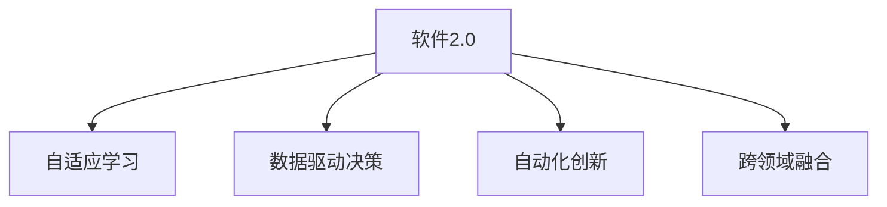

                 

## 1. 背景介绍

### 1.1 问题由来

近年来，随着AI、大数据、云计算等技术的发展，软件行业迎来了前所未有的变革。软件2.0时代，软件不再仅是实现特定功能，而是成为集成了大量人工智能能力的智能应用系统。

软件2.0的本质是将大数据、机器学习和人类智慧深度结合，实现真正意义上的智能应用。它通过数据分析、模型训练和自动化决策，赋予软件系统更为强大的理解、推理和创造能力，成为驱动现代社会进步的关键力量。

### 1.2 问题核心关键点

软件2.0的关键在于以下几个方面：

1. **数据驱动决策**：基于大规模数据分析，软件2.0系统可以发现数据中的隐藏模式和关联，做出更科学的决策。
2. **自适应学习**：软件2.0系统具备学习能力，通过不断积累数据和经验，自动优化其功能和性能。
3. **自动化创新**：软件2.0能够自动化地进行技术创新，如自动代码生成、模型优化等，缩短软件开发周期。
4. **智能化交互**：软件2.0系统通过自然语言理解和生成技术，与用户进行自然流畅的交互，提升用户体验。
5. **跨领域融合**：软件2.0系统能够跨领域融合多种技术，实现多模态数据的协同处理和智能分析。

### 1.3 问题研究意义

研究软件2.0技术，对于推动软件行业的发展、提升社会生产效率、促进智慧社会建设具有重要意义：

1. **提升软件效率**：软件2.0通过自动化和智能化，大幅提升软件开发和运行效率，缩短市场响应时间。
2. **优化决策质量**：基于数据分析和模型训练，软件2.0能够提供更精准的决策支持，提升决策科学性。
3. **促进跨领域融合**：软件2.0系统能够跨领域融合数据和知识，为医疗、教育、交通等垂直领域带来创新变革。
4. **增强用户体验**：通过智能化交互，软件2.0系统能够提供更人性化的用户体验，提升用户满意度和粘性。
5. **推动社会进步**：软件2.0在各个行业的应用，将大幅提升生产力，加速社会进步，改善人民生活。

## 2. 核心概念与联系

### 2.1 核心概念概述

为更好地理解软件2.0技术，本节将介绍几个密切相关的核心概念：

- **软件2.0**：一种基于人工智能的软件形态，通过融合大数据、机器学习和自然语言处理技术，实现更加智能、高效和人性化的软件应用。
- **自适应学习**：软件2.0系统通过持续学习和自优化，不断适应新环境和新需求，提升自身的性能和功能。
- **数据驱动决策**：软件2.0系统基于大规模数据分析，实现自动化的决策支持，提供科学的决策依据。
- **自动化创新**：软件2.0系统能够自动化地进行技术创新，如自动代码生成、模型优化等，加速软件开发进程。
- **跨领域融合**：软件2.0系统能够跨领域融合多种技术，实现多模态数据的协同处理和智能分析。

这些核心概念之间的逻辑关系可以通过以下Mermaid流程图来展示：



这个流程图展示了自己驱动决策、自适应学习、自动化创新和跨领域融合四个关键能力，它们共同构成了软件2.0系统的核心。

## 3. 核心算法原理 & 具体操作步骤
### 3.1 算法原理概述

软件2.0的核心算法原理主要基于以下几个方面：

- **机器学习**：通过构建和训练各种机器学习模型，实现数据驱动的决策和预测。
- **自然语言处理(NLP)**：实现自然语言理解和生成，提升系统的人性化交互能力。
- **自动化运维**：通过持续学习和自我优化，提升系统的可靠性和稳定性。

这些核心技术共同构成了软件2.0系统的技术基础，使其能够在多个领域中发挥作用。

### 3.2 算法步骤详解

软件2.0的实现通常包括以下关键步骤：

**Step 1: 数据收集与预处理**
- 收集目标领域的数据，如用户行为数据、文本数据、图像数据等。
- 进行数据清洗、标注和归一化，为后续分析和训练提供高质量数据。

**Step 2: 构建和训练模型**
- 选择合适的机器学习模型，如决策树、神经网络、深度学习等，构建目标任务模型。
- 使用大规模数据集对模型进行训练，优化模型参数，提高模型性能。

**Step 3: 自动化决策和预测**
- 将训练好的模型应用到实际场景中，进行数据驱动的决策和预测。
- 根据预测结果，自动执行相应的操作，如推荐、报警、优化等。

**Step 4: 持续学习和优化**
- 定期收集新数据，对模型进行微调和优化，提升模型性能。
- 引入自适应学习算法，如强化学习、迁移学习等，提升系统的自我优化能力。

**Step 5: 跨领域融合和协同分析**
- 实现多模态数据的融合和协同分析，提高系统的综合分析能力。
- 通过跨领域融合技术，实现不同系统之间的协作和信息共享。

### 3.3 算法优缺点

软件2.0技术具有以下优点：
1. **高效性**：通过机器学习和自动化技术，大幅提升数据处理和决策速度。
2. **智能化**：通过自然语言处理和自动化决策，提升系统的智能化水平，提供更好的用户体验。
3. **可扩展性**：通过模块化设计和跨领域融合，系统能够灵活扩展，适应不同应用场景。
4. **自适应能力**：通过持续学习和自优化，系统能够不断适应新环境和需求。

同时，软件2.0技术也存在一些局限性：
1. **数据质量依赖**：模型的性能很大程度上取决于数据的质量和多样性，数据不足或数据质量差会影响模型效果。
2. **模型复杂性**：构建和训练大规模模型需要较高的计算资源和时间，模型过于复杂可能导致过拟合和资源浪费。
3. **隐私和安全风险**：大量数据的收集和处理可能带来隐私泄露和安全风险，需要建立完善的数据保护机制。
4. **模型解释性不足**：复杂模型的决策过程难以解释，增加了系统的复杂性和透明度问题。

尽管存在这些局限性，但软件2.0技术通过大数据、机器学习和自然语言处理技术的深度融合，已经实现了在多个领域中的突破性应用，展示了强大的生命力和潜力。

### 3.4 算法应用领域

软件2.0技术在以下几个领域中得到了广泛应用：

- **医疗健康**：通过数据分析和自然语言处理，提供个性化的医疗建议、疾病预测和健康管理。
- **金融服务**：利用机器学习和数据驱动技术，实现风险评估、欺诈检测和投资策略优化。
- **智能交通**：通过数据融合和自动化决策，优化交通流量、提高行车安全、减少拥堵。
- **教育培训**：基于数据分析和自适应学习，提供个性化的学习推荐、评估和反馈。
- **智慧城市**：通过数据驱动的决策和智能分析，提升城市管理效率和居民生活质量。

此外，软件2.0技术还在智能家居、智能制造、智能农业等多个领域中得到应用，推动了各行各业的数字化转型和智能化升级。

## 4. 数学模型和公式 & 详细讲解 & 举例说明
### 4.1 数学模型构建

软件2.0的核心数学模型通常包括如下几个部分：

- **回归模型**：用于预测连续型数值数据，如房价、销售额等。常见的回归模型包括线性回归、多项式回归、决策树回归等。
- **分类模型**：用于分类离散型数据，如客户分类、疾病分类等。常见的分类模型包括逻辑回归、决策树分类、支持向量机等。
- **聚类模型**：用于对数据进行无监督聚类，如市场细分、客户分类等。常见的聚类模型包括K-means、层次聚类等。
- **推荐模型**：用于个性化推荐，如商品推荐、内容推荐等。常见的推荐模型包括协同过滤、基于矩阵分解的推荐、基于深度学习的推荐等。
- **时序模型**：用于时间序列预测和分析，如股票价格预测、交通流量预测等。常见的时间序列模型包括ARIMA、LSTM等。

### 4.2 公式推导过程

以线性回归模型为例，其公式推导过程如下：

假设输入数据为 $X$，输出数据为 $Y$，回归模型的预测函数为 $f(X)$，目标是最小化预测值与真实值之间的均方误差：

$$
\text{MSE} = \frac{1}{n} \sum_{i=1}^n (Y_i - f(X_i))^2
$$

通过最小二乘法，得到最优的回归系数 $\beta$：

$$
\beta = (X^TX)^{-1}X^TY
$$

其中 $X^TX$ 是自变量矩阵的转置乘积，$X^TY$ 是自变量矩阵与目标向量相乘的结果。

在线性回归模型中，通过对大量历史数据的拟合，可以建立自变量与目标变量之间的关系，从而实现预测和决策。

### 4.3 案例分析与讲解

假设我们要构建一个基于线性回归的房价预测模型。收集历史房价数据和相关影响因素数据，如地理位置、房屋面积、房屋状况等。使用线性回归模型进行训练和预测，得到以下公式：

$$
Y = \beta_0 + \beta_1X_1 + \beta_2X_2 + \cdots + \beta_kX_k + \epsilon
$$

其中 $Y$ 表示预测的房价，$X_i$ 表示第 $i$ 个影响因素，$\beta_i$ 表示第 $i$ 个影响因素的系数，$\epsilon$ 表示随机误差。

通过对大量历史数据进行拟合，可以得到最优的回归系数 $\beta$，从而实现对房价的预测和分析。

## 5. 项目实践：代码实例和详细解释说明
### 5.1 开发环境搭建

在进行软件2.0项目开发前，我们需要准备好开发环境。以下是使用Python进行项目开发的常用环境配置：

1. 安装Anaconda：从官网下载并安装Anaconda，用于创建独立的Python环境。
2. 创建并激活虚拟环境：
```bash
conda create -n py2env python=3.8
conda activate py2env
```
3. 安装必要的工具包：
```bash
pip install numpy pandas scikit-learn statsmodels matplotlib
```
4. 安装相关的库和框架：
```bash
pip install scikit-learn-glmnet statsmodels
```

完成上述步骤后，即可在`py2env`环境中进行项目开发。

### 5.2 源代码详细实现

下面以房价预测项目为例，给出使用Python进行线性回归模型构建和训练的代码实现。

首先，导入必要的库和数据：

```python
import pandas as pd
import numpy as np
import matplotlib.pyplot as plt
import statsmodels.api as sm

# 导入数据
data = pd.read_csv('house_price.csv')

# 显示数据前5行
print(data.head())
```

然后，数据预处理和模型训练：

```python
# 数据清洗和处理
X = data.drop('price', axis=1)
y = data['price']

# 拆分训练集和测试集
X_train, X_test, y_train, y_test = train_test_split(X, y, test_size=0.2, random_state=42)

# 模型训练
X_train = sm.add_constant(X_train)
model = sm.GLM(y_train, X_train)
model.fit()

# 预测和评估
y_pred = model.predict(X_test)
plt.scatter(y_test, y_pred)
plt.xlabel('True Price')
plt.ylabel('Predicted Price')
plt.show()
```

最后，输出模型评估结果：

```python
# 输出模型参数
print(model.params)

# 输出模型评估结果
from sklearn.metrics import r2_score
print('R-squared:', r2_score(y_test, y_pred))
```

以上就是使用Python进行线性回归模型构建和训练的完整代码实现。可以看到，使用Python和相关库，可以轻松地进行模型训练和评估，完成软件2.0项目的开发。

### 5.3 代码解读与分析

让我们再详细解读一下关键代码的实现细节：

**数据导入和处理**：
- `data.read_csv()`方法用于读取CSV格式的数据文件。
- `drop()`方法用于删除不需要的列，`axis=1`表示删除列。

**模型训练**：
- `sm.add_constant()`方法用于添加常数项，保证模型拟合方程的线性。
- `sm.GLM()`方法用于构建一般线性模型。
- `fit()`方法用于拟合模型，并得到最优的回归系数。

**预测和评估**：
- `predict()`方法用于进行预测，返回预测结果。
- `r2_score()`方法用于计算模型的决定系数，衡量模型的拟合程度。

**模型评估**：
- `params`属性用于输出模型参数。

可以看到，Python和相关库提供了丰富的工具和函数，方便开发者进行模型训练和评估，完成软件2.0项目的开发。

## 6. 实际应用场景
### 6.1 医疗健康

基于软件2.0技术的医疗健康应用，可以实现智能化和个性化的医疗服务。

在实际应用中，可以收集患者的历史诊疗记录、体检数据、基因数据等，利用机器学习和大数据分析技术，构建预测模型和诊断模型，实现智能诊疗和个性化治疗。例如，通过分析患者的基因数据和病历信息，预测疾病的风险和发展趋势，提供个性化的治疗方案和健康管理建议。

### 6.2 金融服务

软件2.0技术在金融服务领域的应用，可以实现风险评估、欺诈检测和投资策略优化。

金融机构可以收集客户的历史交易记录、信用数据、社交媒体数据等，利用机器学习和数据驱动技术，构建风控模型和预测模型，实时监控客户的信用风险和欺诈行为，优化投资组合和风险管理策略。例如，通过分析客户的交易行为和社交媒体信息，预测客户的违约概率和欺诈风险，提前采取防范措施，保护金融资产安全。

### 6.3 智能交通

基于软件2.0技术的智能交通应用，可以实现交通流量优化和行车安全保障。

交通管理部门可以收集道路交通数据、车辆位置数据、天气数据等，利用数据驱动和自动化决策技术，构建交通流量预测模型和优化模型，实时监控交通流量和交通状况，优化交通信号和路线规划，保障行车安全。例如，通过分析历史交通数据和实时交通数据，预测未来的交通流量，调整交通信号灯的配时，减少交通拥堵和事故发生。

### 6.4 未来应用展望

随着软件2.0技术的不断发展和应用，其未来前景广阔，将在更多领域带来创新和变革。

在智慧城市建设中，软件2.0技术可以实现城市管理的智能化和高效化。通过融合多源数据和跨领域技术，提升城市运行的效率和质量，改善居民生活水平。例如，通过数据驱动的决策和智能分析，优化城市资源的配置和调度，提升城市的能源效率、环境质量和公共服务水平。

在教育和培训领域，软件2.0技术可以实现个性化学习和智能化评估。通过分析学生的学习行为和反馈数据，提供个性化的学习推荐和评估报告，提升学习效果和教育质量。例如，通过分析学生的在线学习数据，推荐适合的学习资源和练习题，提供个性化的学习路径和反馈，帮助学生更好地掌握知识。

在智能制造和智能农业中，软件2.0技术可以实现生产过程的自动化和智能化。通过融合物联网、大数据、机器学习等技术，提升生产效率和产品质量，降低生产成本和资源消耗。例如，通过分析生产设备和生产环境的数据，预测设备故障和生产瓶颈，优化生产计划和资源配置，提升生产效率和产品质量。

总之，软件2.0技术将在各个领域带来深刻的变革，推动社会进步和人类福祉。

## 7. 工具和资源推荐
### 7.1 学习资源推荐

为了帮助开发者系统掌握软件2.0技术，这里推荐一些优质的学习资源：

1. 《Python深度学习》系列书籍：由知名深度学习专家撰写，全面介绍了深度学习在Python中的实现和应用。
2. 《TensorFlow实战》系列书籍：由TensorFlow官方团队和知名开发者共同撰写，提供了丰富的代码示例和实战经验。
3. 《自然语言处理基础》课程：斯坦福大学开设的NLP入门课程，涵盖自然语言处理的基本概念和经典模型。
4. Kaggle竞赛平台：一个全球知名的数据科学竞赛平台，提供了大量的数据集和模型竞赛，帮助开发者提高实战能力。
5. 知乎社区：一个知识分享社区，汇集了大量的技术爱好者和专家，可以获取最新的技术动态和实践经验。

通过对这些资源的学习实践，相信你一定能够快速掌握软件2.0技术的精髓，并用于解决实际的业务问题。

### 7.2 开发工具推荐

高效的开发离不开优秀的工具支持。以下是几款用于软件2.0开发常用的工具：

1. Jupyter Notebook：一个交互式编程环境，支持Python、R、Julia等多种语言，方便开发者进行实验和演示。
2. PyCharm：一个集成了大量开发工具的IDE，支持Python、Java、Kotlin等多种语言，提供代码自动补全、调试等功能。
3. Visual Studio Code：一个轻量级的IDE，支持多种编程语言和开发工具，提供丰富的插件和扩展。
4. Git：一个版本控制工具，方便开发者进行代码管理、版本控制和协作开发。
5. Docker：一个容器化平台，方便开发者进行环境隔离、部署和管理。

合理利用这些工具，可以显著提升软件2.0项目的开发效率，加快创新迭代的步伐。

### 7.3 相关论文推荐

软件2.0技术的发展源于学界的持续研究。以下是几篇奠基性的相关论文，推荐阅读：

1. Neural Networks and Deep Learning：Ian Goodfellow、Yoshua Bengio、Aaron Courville合著的深度学习经典教材，涵盖了深度学习的基本概念和算法。
2. Deep Learning with Python：Francois Chollet合著的深度学习实战指南，提供了丰富的代码示例和实践经验。
3. TensorFlow: A System for Large-Scale Machine Learning：Jeffrey Dean等人的TensorFlow论文，介绍了TensorFlow的架构和设计思想。
4. AlphaGo Zero：DeepMind的AlphaGo Zero论文，展示了深度强化学习在围棋领域的突破性应用。
5. Attention is All You Need：Ashish Vaswani等人的Transformer论文，介绍了Transformer的架构和原理，推动了NLP领域的发展。

这些论文代表了大数据、机器学习和人工智能技术的发展脉络。通过学习这些前沿成果，可以帮助研究者把握学科前进方向，激发更多的创新灵感。

## 8. 总结：未来发展趋势与挑战
### 8.1 总结

本文对软件2.0技术进行了全面系统的介绍。首先阐述了软件2.0技术的研究背景和意义，明确了其在提升软件效率、优化决策质量、促进跨领域融合等方面的独特价值。其次，从原理到实践，详细讲解了软件2.0的核心算法原理和操作步骤，给出了实际项目开发的完整代码实现。同时，本文还广泛探讨了软件2.0技术在医疗健康、金融服务、智能交通等多个领域的应用前景，展示了其强大的生命力和潜力。此外，本文精选了软件2.0技术的各类学习资源，力求为读者提供全方位的技术指引。

通过本文的系统梳理，可以看到，软件2.0技术正在成为软件行业的重要趋势，极大地提升了软件系统的智能水平和运行效率，推动了各行各业的数字化转型和智能化升级。未来，伴随人工智能技术的不断演进，软件2.0技术还将带来更多创新应用，为社会进步和人类福祉做出更大贡献。

### 8.2 未来发展趋势

展望未来，软件2.0技术将呈现以下几个发展趋势：

1. **智能化程度提升**：随着深度学习和大数据技术的发展，软件2.0系统的智能化程度将不断提升，实现更高效、更精准的数据分析和决策支持。
2. **跨领域融合深入**：软件2.0系统将更加注重跨领域数据的融合和协同分析，实现不同系统之间的无缝协作和信息共享。
3. **自动化能力增强**：软件2.0系统将具备更强的自动化能力，实现更加快速、灵活和自适应的软件开发和运行。
4. **个性化定制增加**：基于数据分析和自适应学习，软件2.0系统将实现更加个性化的服务和体验，提升用户满意度和粘性。
5. **边缘计算和本地化处理**：随着物联网和边缘计算技术的发展，软件2.0系统将更多地部署在本地设备和边缘服务器上，实现更高效、更安全的数据处理和分析。

以上趋势凸显了软件2.0技术的广阔前景。这些方向的探索发展，必将进一步提升软件系统的性能和应用范围，为经济社会发展注入新的动力。

### 8.3 面临的挑战

尽管软件2.0技术已经取得了瞩目成就，但在迈向更加智能化、普适化应用的过程中，它仍面临着诸多挑战：

1. **数据质量问题**：软件2.0系统对数据质量要求较高，数据不完整、不准确或存在噪声，将影响系统的性能和可靠性。
2. **模型复杂性问题**：软件2.0系统需要构建和训练复杂的机器学习模型，模型过于复杂可能导致过拟合和资源浪费。
3. **隐私和安全问题**：软件2.0系统需要处理大量的敏感数据，数据隐私和安全问题不容忽视，需要建立完善的数据保护机制。
4. **可解释性和透明性问题**：复杂模型的决策过程难以解释，增加了系统的复杂性和透明度问题，需要加强模型的可解释性和透明性。
5. **跨领域融合问题**：不同领域的知识和数据存在异构性和复杂性，跨领域融合技术面临诸多挑战，需要更高效的融合机制和协同方法。

尽管存在这些挑战，但通过不断优化模型、改进算法、完善数据保护机制，软件2.0技术将不断克服这些困难，推动人工智能技术在各个领域的应用。

### 8.4 研究展望

未来，软件2.0技术需要在以下几个方面寻求新的突破：

1. **数据质量和多样性**：通过数据清洗、数据增强、数据融合等技术，提升数据质量，增加数据多样性，提高模型的泛化能力和鲁棒性。
2. **模型自动化和模块化**：通过自动化运维和模块化设计，提升模型的可扩展性和维护性，降低开发成本和错误率。
3. **跨领域知识融合**：通过跨领域知识图谱、多模态数据融合等技术，提升系统的综合分析和决策能力，实现更加全面和精准的分析和预测。
4. **安全性和隐私保护**：通过数据加密、数据匿名化、数据访问控制等技术，保护用户隐私和数据安全，增强系统的可信度和安全性。
5. **可解释性和透明性**：通过可解释性算法和透明性机制，增强模型的解释能力和可理解性，提升系统的透明度和可信度。

这些研究方向的探索，必将引领软件2.0技术的不断进步，推动人工智能技术在各个领域的应用和落地。

## 9. 附录：常见问题与解答

**Q1：软件2.0与传统软件系统有何区别？**

A: 软件2.0与传统软件系统的最大区别在于其智能化和数据驱动的决策能力。传统软件系统主要依赖人工设计和手动调试，缺乏自动化的决策和优化能力。而软件2.0系统通过融合大数据、机器学习和自然语言处理技术，实现更加智能、高效和人性化的软件应用。

**Q2：如何选择合适的机器学习模型？**

A: 选择合适的机器学习模型需要考虑多个因素，包括数据类型、任务类型、模型复杂度等。通常，数据类型和任务类型决定了模型选择的范围，模型复杂度决定了模型的训练难度和性能。例如，对于分类任务，可以使用决策树、逻辑回归、支持向量机等模型；对于回归任务，可以使用线性回归、多项式回归、LSTM等模型。

**Q3：如何提高软件2.0系统的安全性？**

A: 软件2.0系统需要处理大量的敏感数据，数据隐私和安全问题不容忽视。提高软件2.0系统的安全性，需要建立完善的数据保护机制，包括数据加密、数据匿名化、数据访问控制等。同时，需要加强安全监控和审计，及时发现和应对安全漏洞。

**Q4：软件2.0技术有哪些应用场景？**

A: 软件2.0技术在医疗健康、金融服务、智能交通、教育培训、智慧城市、智能制造等多个领域都有广泛的应用。例如，在医疗健康领域，可以实现智能诊疗和个性化治疗；在金融服务领域，可以实现风险评估和欺诈检测；在智能交通领域，可以实现交通流量优化和行车安全保障。

**Q5：如何优化软件2.0系统的性能？**

A: 优化软件2.0系统的性能需要从多个方面入手，包括数据预处理、模型选择、模型训练、模型评估等。数据预处理阶段，需要清洗和标注数据，提升数据质量；模型选择阶段，需要选择合适的算法和模型，减少复杂度和计算资源；模型训练阶段，需要优化超参数和正则化参数，防止过拟合；模型评估阶段，需要选择合适的评估指标，衡量模型性能。

这些问题的解答，可以帮助开发者更好地理解软件2.0技术，并用于解决实际的业务问题。

---

作者：禅与计算机程序设计艺术 / Zen and the Art of Computer Programming

