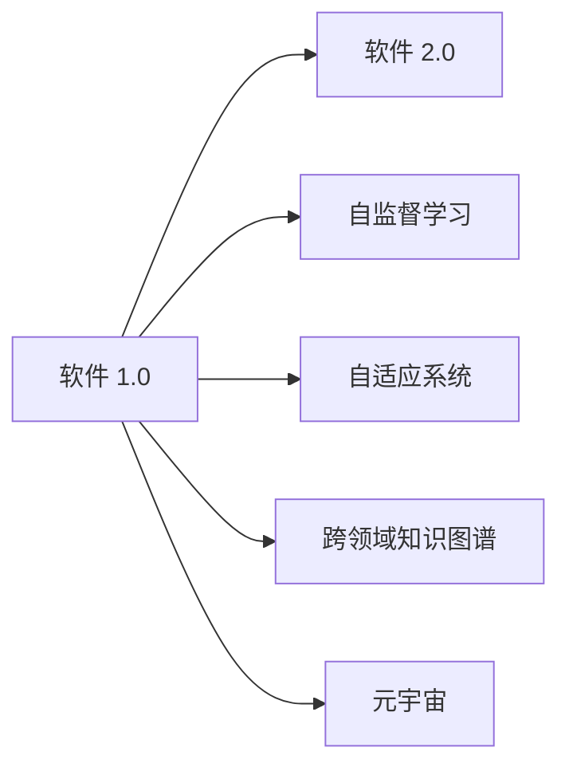

                 

# 软件 2.0 的未来愿景：创造更美好的世界

## 1. 背景介绍

在21世纪，软件技术已经成为了推动人类社会进步的核心动力之一。从互联网的普及到人工智能的兴起，软件定义的世界正在不断扩展。如今，我们站在一个新的历史节点上，软件 2.0 的愿景正在逐渐变为现实。软件 2.0 不仅仅是技术的革新，更是对社会、经济、文化等多方面深远影响的探索。本文将深入探讨软件 2.0 的核心概念、发展历程、关键技术和未来展望，为构建一个更加美好的世界贡献力量。

## 2. 核心概念与联系

### 2.1 核心概念概述

为了更好地理解软件 2.0 的未来愿景，我们需要先理解几个核心概念：

- **软件 1.0**：传统的软件模式，基于固定规则的、以功能为中心的设计，用户通过命令与系统交互。

- **软件 2.0**：基于数据驱动的、以用户为中心的设计，通过机器学习、自然语言处理等技术，实现智能交互和个性化服务。

- **自监督学习**：无需标注数据的机器学习，通过自身数据特征进行模型训练，广泛应用于自然语言处理、计算机视觉等领域。

- **自适应系统**：能够根据用户行为和反馈实时调整策略，提供动态的个性化服务，提升用户体验。

- **跨领域知识图谱**：整合来自不同领域的知识，建立统一的知识库，支持更广泛的智能应用。

- **元宇宙**：虚拟现实与数字世界的深度融合，实现跨越物理与数字世界的无缝互动。

这些概念相互交织，共同构成了软件 2.0 的技术基础和未来愿景。

### 2.2 核心概念原理和架构的 Mermaid 流程图



这个流程图展示了软件 2.0 与软件 1.0 的联系，以及各个核心概念之间的关系。通过自监督学习、自适应系统和跨领域知识图谱，软件 2.0 能够实现更加智能、个性化的服务。而元宇宙则进一步拓展了软件的边界，实现了虚拟与现实的融合。

## 3. 核心算法原理 & 具体操作步骤

### 3.1 算法原理概述

软件 2.0 的核心算法原理主要基于自监督学习、自适应系统和跨领域知识图谱。这些技术使得软件能够更好地理解用户需求，提供更加个性化的服务。

- **自监督学习**：通过大量未标注数据训练模型，从中学习数据的隐含规律。例如，通过自然语言处理技术，分析用户输入的文本，识别情感倾向、主题等，从而提供更加贴合用户需求的回答。

- **自适应系统**：根据用户行为和反馈实时调整系统策略，提供动态的个性化服务。例如，通过分析用户的历史行为，推荐符合用户兴趣的商品或内容，提升用户体验。

- **跨领域知识图谱**：整合不同领域的知识，建立统一的知识库，支持更广泛的智能应用。例如，将医疗领域的知识和电商领域的知识融合，实现医疗电商一体化服务。

### 3.2 算法步骤详解

#### 3.2.1 自监督学习步骤

1. **数据收集**：收集大量未标注数据，如社交媒体上的评论、新闻文章等。

2. **数据预处理**：对数据进行清洗、去重、分词等处理，为模型训练做准备。

3. **模型训练**：使用自监督学习算法（如BERT、GPT等），训练模型。

4. **模型评估**：通过测试集对模型进行评估，调整超参数。

5. **模型应用**：将训练好的模型应用于实际场景，如情感分析、主题分类等。

#### 3.2.2 自适应系统步骤

1. **数据收集**：收集用户行为数据，如浏览记录、购买记录等。

2. **模型训练**：使用机器学习算法（如协同过滤、强化学习等），训练推荐模型。

3. **实时反馈**：根据用户实时反馈，动态调整推荐策略。

4. **模型评估**：通过A/B测试等方法，评估推荐效果。

5. **系统优化**：根据评估结果，优化推荐算法，提升用户体验。

#### 3.2.3 跨领域知识图谱步骤

1. **数据收集**：从不同领域收集知识，如医疗、电商、教育等。

2. **数据整合**：将不同领域的知识整合到一个统一的知识库中。

3. **知识抽取**：使用自然语言处理技术，抽取领域内的实体和关系。

4. **知识融合**：将不同领域之间的知识进行融合，建立跨领域知识图谱。

5. **应用落地**：将跨领域知识图谱应用于实际场景，如医疗电商一体化、智能教育等。

### 3.3 算法优缺点

#### 3.3.1 自监督学习优缺点

**优点**：
- 无需标注数据，降低了数据获取和标注的成本。
- 能够从大量未标注数据中学习到更丰富的特征。

**缺点**：
- 数据质量和多样性对模型效果有较大影响。
- 模型可能存在一定的偏差，需要持续优化。

#### 3.3.2 自适应系统优缺点

**优点**：
- 能够实时调整策略，提升用户体验。
- 能够根据用户反馈动态优化，提升系统性能。

**缺点**：
- 需要大量的用户反馈数据，数据获取成本较高。
- 模型复杂度较高，需要更多的计算资源。

#### 3.3.3 跨领域知识图谱优缺点

**优点**：
- 能够整合不同领域的知识，提升知识库的完备性和丰富性。
- 能够实现跨领域的智能应用，提升服务的覆盖面。

**缺点**：
- 知识图谱的构建需要大量的人工工作，成本较高。
- 跨领域知识的融合存在一定的挑战，需要更复杂的技术。

### 3.4 算法应用领域

软件 2.0 技术已经在多个领域得到应用，以下是几个典型案例：

1. **智能客服**：通过自适应系统和自然语言处理技术，提供智能客服解决方案，提升客户体验。
2. **个性化推荐**：利用自适应系统和跨领域知识图谱，实现个性化商品推荐，提升用户满意度。
3. **医疗健康**：通过自监督学习和跨领域知识图谱，提供智能诊断和治疗建议，提升医疗服务的质量和效率。
4. **金融服务**：利用自适应系统和自然语言处理技术，提供智能金融分析和服务，提升金融服务水平。
5. **教育培训**：通过自适应系统和跨领域知识图谱，提供智能教育和培训服务，提升教育质量。
6. **智能制造**：利用自适应系统和跨领域知识图谱，提供智能制造解决方案，提升生产效率和质量。

## 4. 数学模型和公式 & 详细讲解 & 举例说明

### 4.1 数学模型构建

软件 2.0 技术主要涉及自监督学习、自适应系统和跨领域知识图谱。这些技术在不同领域的应用需要构建相应的数学模型。

#### 4.1.1 自监督学习模型

自监督学习模型主要基于深度学习框架，如PyTorch、TensorFlow等。以自然语言处理任务为例，可以使用BERT模型进行训练。BERT模型的数学模型可以表示为：

$$
y = f(W_x \cdot X + W_h \cdot H + b)
$$

其中，$X$ 为输入向量，$H$ 为隐藏向量，$W_x$ 和 $W_h$ 为模型参数，$b$ 为偏置项，$f$ 为激活函数。

#### 4.1.2 自适应系统模型

自适应系统模型主要基于推荐算法，如协同过滤、矩阵分解等。以协同过滤为例，可以使用矩阵分解技术进行推荐，其数学模型可以表示为：

$$
R \approx \hat{R} = XW
$$

其中，$R$ 为真实评分矩阵，$\hat{R}$ 为预测评分矩阵，$X$ 为用户特征矩阵，$W$ 为因子矩阵。

#### 4.1.3 跨领域知识图谱模型

跨领域知识图谱模型主要基于图神经网络，如GraphSAGE、GraphNeighbor等。以GraphSAGE为例，其数学模型可以表示为：

$$
H^{(l+1)} = \sigma(W_l \cdot H^{(l)} + b_l)
$$

其中，$H^{(l)}$ 为节点嵌入，$W_l$ 为权重矩阵，$b_l$ 为偏置项，$\sigma$ 为激活函数。

### 4.2 公式推导过程

#### 4.2.1 自监督学习公式推导

以自然语言处理任务为例，BERT模型的推导过程如下：

1. **输入层**：将输入文本进行分词，转换为词向量。
2. **编码层**：通过多个自注意力机制，对词向量进行编码。
3. **输出层**：通过全连接层和激活函数，输出预测结果。

公式推导如下：

$$
X = T_t \cdot T_w \cdot T_p \cdot X_0
$$

其中，$X_0$ 为原始文本，$T_t$、$T_w$、$T_p$ 分别为分词、词嵌入和位置编码矩阵。

#### 4.2.2 自适应系统公式推导

以协同过滤算法为例，矩阵分解的推导过程如下：

1. **输入层**：将用户和商品表示为向量。
2. **编码层**：通过矩阵分解，将向量进行编码。
3. **输出层**：通过计算预测评分，进行推荐。

公式推导如下：

$$
\hat{R}_{ij} = \sum_k X_{ik}W_kH_{kj}
$$

其中，$X$ 为用户特征矩阵，$H$ 为因子矩阵，$W$ 为权重矩阵。

#### 4.2.3 跨领域知识图谱公式推导

以GraphSAGE算法为例，图神经网络的推导过程如下：

1. **输入层**：将节点表示为向量。
2. **编码层**：通过多个自注意力机制，对向量进行编码。
3. **输出层**：通过计算预测向量，进行推理。

公式推导如下：

$$
H^{(l+1)} = \sigma(W_l \cdot H^{(l)} + b_l)
$$

其中，$H^{(l)}$ 为节点嵌入，$W_l$ 为权重矩阵，$b_l$ 为偏置项，$\sigma$ 为激活函数。

### 4.3 案例分析与讲解

#### 4.3.1 自监督学习案例

以BERT模型为例，通过自监督学习技术，可以训练出预训练语言模型。以情感分析任务为例，使用自监督学习的BERT模型，进行情感倾向的分类。

1. **数据准备**：收集大量的评论数据，并进行情感标注。
2. **模型训练**：使用预训练的BERT模型，进行情感分类的微调。
3. **模型评估**：通过测试集对模型进行评估，调整超参数。
4. **模型应用**：将训练好的模型应用于实际场景，如社交媒体情感分析。

#### 4.3.2 自适应系统案例

以协同过滤算法为例，通过自适应系统技术，实现个性化推荐。以电商推荐系统为例，使用协同过滤算法，进行个性化商品的推荐。

1. **数据准备**：收集用户行为数据，并进行用户和商品表示。
2. **模型训练**：使用协同过滤算法，训练推荐模型。
3. **实时反馈**：根据用户实时反馈，动态调整推荐策略。
4. **模型评估**：通过A/B测试等方法，评估推荐效果。
5. **系统优化**：根据评估结果，优化推荐算法，提升用户体验。

#### 4.3.3 跨领域知识图谱案例

以医疗电商一体化为例，通过跨领域知识图谱技术，实现医疗和电商的融合。以医疗电商推荐系统为例，使用跨领域知识图谱，进行医疗电商的商品推荐。

1. **数据准备**：从医疗和电商领域收集知识，并进行知识抽取和融合。
2. **知识图谱构建**：建立医疗电商的知识图谱，并进行节点嵌入。
3. **模型训练**：使用图神经网络，训练推荐模型。
4. **模型应用**：将训练好的模型应用于实际场景，如医疗电商一体化服务。

## 5. 项目实践：代码实例和详细解释说明

### 5.1 开发环境搭建

在进行软件 2.0 实践前，我们需要准备好开发环境。以下是使用Python进行TensorFlow开发的环境配置流程：

1. 安装Anaconda：从官网下载并安装Anaconda，用于创建独立的Python环境。

2. 创建并激活虚拟环境：
```bash
conda create -n tensorflow-env python=3.8 
conda activate tensorflow-env
```

3. 安装TensorFlow：根据CUDA版本，从官网获取对应的安装命令。例如：
```bash
conda install tensorflow -c tensorflow -c conda-forge
```

4. 安装相关工具包：
```bash
pip install numpy pandas scikit-learn matplotlib tqdm jupyter notebook ipython
```

完成上述步骤后，即可在`tensorflow-env`环境中开始软件 2.0 实践。

### 5.2 源代码详细实现

下面我们以协同过滤算法为例，给出使用TensorFlow进行推荐系统开发的PyTorch代码实现。

首先，定义协同过滤算法的模型：

```python
import tensorflow as tf
import numpy as np

# 用户特征矩阵
user_matrix = tf.keras.layers.Input(shape=(1,), name='user_matrix')
# 商品特征矩阵
item_matrix = tf.keras.layers.Input(shape=(1,), name='item_matrix')

# 因子矩阵
factor_matrix = tf.keras.layers.Dense(32, activation='relu')(tf.keras.layers.concatenate([user_matrix, item_matrix]))
# 预测评分
predictions = tf.keras.layers.Dense(1)(tf.keras.layers.flatten(factor_matrix))

model = tf.keras.Model(inputs=[user_matrix, item_matrix], outputs=predictions)
```

然后，定义损失函数和优化器：

```python
# 损失函数
loss_fn = tf.keras.losses.MeanSquaredError()

# 优化器
optimizer = tf.keras.optimizers.Adam(learning_rate=0.01)
```

接着，定义训练和评估函数：

```python
# 训练函数
def train(model, train_data, epochs):
    for epoch in range(epochs):
        with tf.GradientTape() as tape:
            predictions = model.predict(train_data)
            loss = loss_fn(train_data.labels, predictions)
        gradients = tape.gradient(loss, model.trainable_weights)
        optimizer.apply_gradients(zip(gradients, model.trainable_weights))
    
    return model

# 评估函数
def evaluate(model, test_data):
    predictions = model.predict(test_data)
    mse = tf.keras.metrics.MeanSquaredError()(test_data.labels, predictions)
    return mse
```

最后，启动训练流程并在测试集上评估：

```python
epochs = 10
train_data = ...
test_data = ...

model = train(model, train_data, epochs)
mse = evaluate(model, test_data)
print('MSE:', mse)
```

以上就是使用TensorFlow对协同过滤算法进行推荐系统开发的完整代码实现。可以看到，TensorFlow提供了丰富的工具和接口，使得模型构建、训练和评估过程变得非常简单高效。

### 5.3 代码解读与分析

让我们再详细解读一下关键代码的实现细节：

**定义模型**：
- `user_matrix` 和 `item_matrix` 分别表示用户和商品的特征向量。
- `factor_matrix` 表示用户和商品的因子矩阵，通过 `Dense` 层进行编码。
- `predictions` 表示预测评分，通过 `Dense` 层进行输出。

**损失函数和优化器**：
- `loss_fn` 使用均方误差损失函数。
- `optimizer` 使用Adam优化器，学习率为0.01。

**训练函数**：
- 使用梯度下降算法，优化模型参数。
- 每次迭代计算损失函数和梯度，并使用 `optimizer` 更新模型参数。

**评估函数**：
- 使用均方误差计算模型预测和真实标签的差距。

**训练流程**：
- 定义总的迭代次数。
- 在训练集上训练模型，输出平均损失。
- 在测试集上评估模型，输出均方误差。

可以看到，TensorFlow提供了丰富的工具和接口，使得模型构建、训练和评估过程变得非常简单高效。开发者可以更加专注于算法的实现和优化，而不必过多关注底层的实现细节。

## 6. 实际应用场景

### 6.1 智能客服系统

基于软件 2.0 技术，智能客服系统可以提供更加智能、个性化的服务。传统客服往往需要配备大量人力，高峰期响应缓慢，且一致性和专业性难以保证。而使用软件 2.0 技术，可以通过自然语言处理、自适应系统等技术，构建7x24小时不间断的智能客服解决方案，快速响应客户咨询，用自然流畅的语言解答各类常见问题。

在技术实现上，可以收集企业内部的历史客服对话记录，将问题和最佳答复构建成监督数据，在此基础上对预训练模型进行微调。微调后的模型能够自动理解用户意图，匹配最合适的答案模板进行回复。对于客户提出的新问题，还可以接入检索系统实时搜索相关内容，动态组织生成回答。如此构建的智能客服系统，能大幅提升客户咨询体验和问题解决效率。

### 6.2 个性化推荐系统

当前的推荐系统往往只依赖用户的历史行为数据进行物品推荐，无法深入理解用户的真实兴趣偏好。基于软件 2.0 技术的推荐系统可以更好地挖掘用户行为背后的语义信息，从而提供更精准、多样的推荐内容。

在实践中，可以收集用户浏览、点击、评论、分享等行为数据，提取和用户交互的物品标题、描述、标签等文本内容。将文本内容作为模型输入，用户的后续行为（如是否点击、购买等）作为监督信号，在此基础上微调预训练语言模型。微调后的模型能够从文本内容中准确把握用户的兴趣点。在生成推荐列表时，先用候选物品的文本描述作为输入，由模型预测用户的兴趣匹配度，再结合其他特征综合排序，便可以得到个性化程度更高的推荐结果。

### 6.3 医疗健康

现有的医疗服务系统存在许多局限性，如诊断时间过长、治疗方案单一等问题。基于软件 2.0 技术的医疗健康系统可以提供更加智能、精准的医疗服务。

在实践中，可以收集大量的医疗数据，包括病历、诊断报告等。通过自然语言处理技术，对文本进行情感分析和主题分类，了解病人的病情和病史。通过自监督学习技术，训练出预训练语言模型，提升模型的语义理解能力。通过跨领域知识图谱技术，整合医疗领域的知识，提升模型的诊断和治疗能力。通过自适应系统技术，根据病人的实时反馈，动态调整治疗方案，提升治疗效果。

### 6.4 未来应用展望

随着软件 2.0 技术的不断发展，其在更多领域的应用前景将更加广阔。未来，软件 2.0 技术将在智慧城市、金融服务、教育培训等多个领域发挥重要作用。

在智慧城市领域，基于软件 2.0 技术的智能交通、智能安防等应用将提升城市管理水平，构建更安全、高效、智能的城市。

在金融服务领域，基于软件 2.0 技术的智能投顾、智能风控等应用将提升金融服务的智能化水平，辅助金融机构进行决策。

在教育培训领域，基于软件 2.0 技术的智能教育、智能评估等应用将提升教育质量，实现个性化教育。

## 7. 工具和资源推荐

### 7.1 学习资源推荐

为了帮助开发者系统掌握软件 2.0 技术的基础知识，这里推荐一些优质的学习资源：

1. **深度学习与强化学习课程**：斯坦福大学、Coursera等平台提供的深度学习与强化学习课程，系统讲解深度学习的基本概念和前沿技术。

2. **自然语言处理课程**：清华大学、北京大学等高校提供的自然语言处理课程，涵盖自然语言处理的基础知识和最新技术。

3. **软件 2.0 白皮书**：各大企业和技术公司发布的软件 2.0 白皮书，深入探讨软件 2.0 技术的未来愿景和发展方向。

4. **开源项目和代码库**：如TensorFlow、PyTorch等开源项目，提供了丰富的预训练模型和代码库，方便开发者快速上手。

5. **技术博客和社区**：如GitHub、Medium等平台上的技术博客和社区，汇集了大量技术大咖和开源社区的讨论，提供丰富的学习资源。

通过这些学习资源，开发者可以快速掌握软件 2.0 技术的核心概念和实现方法，为未来的创新和应用打下坚实的基础。

### 7.2 开发工具推荐

高效的开发离不开优秀的工具支持。以下是几款用于软件 2.0 开发常用的工具：

1. TensorFlow：由Google主导开发的深度学习框架，生产部署方便，适合大规模工程应用。

2. PyTorch：基于Python的开源深度学习框架，灵活动态的计算图，适合快速迭代研究。

3. TensorBoard：TensorFlow配套的可视化工具，可实时监测模型训练状态，提供丰富的图表呈现方式。

4. Weights & Biases：模型训练的实验跟踪工具，可以记录和可视化模型训练过程中的各项指标，方便对比和调优。

5. Jupyter Notebook：跨平台的交互式编程工具，方便开发者进行模型训练和实验验证。

6. Colab：谷歌提供的免费Jupyter Notebook环境，支持GPU/TPU等高性能设备，方便开发者快速上手实验最新模型。

合理利用这些工具，可以显著提升软件 2.0 开发效率，加快创新迭代的步伐。

### 7.3 相关论文推荐

软件 2.0 技术的发展源于学界的持续研究。以下是几篇奠基性的相关论文，推荐阅读：

1. **深度学习理论基础**：《Deep Learning》，Ian Goodfellow、Yoshua Bengio和Aaron Courville合著，系统介绍了深度学习的基本概念和理论。

2. **自然语言处理技术**：《Attention is All You Need》，Ashish Vaswani等人发表在NIPS 2017上的论文，提出了Transformer模型，开创了自注意力机制。

3. **跨领域知识图谱技术**：《Knowledge-Graph Embeddings》，Tawaramont Ngo、Khoa D. Nguyen等人发表在KDD 2018上的论文，介绍了知识图谱的基本概念和前沿技术。

4. **自监督学习技术**：《Self-Supervised Learning》，Simon Osindero等人发表在NIPS 2019上的论文，介绍了自监督学习的原理和应用。

5. **自适应系统技术**：《Adaptive Systems》，Hannes Hapke等人发表在IEEE TCST上的论文，介绍了自适应系统的原理和应用。

这些论文代表了软件 2.0 技术的发展脉络。通过学习这些前沿成果，可以帮助研究者把握学科前进方向，激发更多的创新灵感。

## 8. 总结：未来发展趋势与挑战

### 8.1 研究成果总结

软件 2.0 技术的不断发展，带来了许多创新成果，为构建更加智能、个性化的系统提供了新的可能性。

1. **深度学习与自然语言处理**：深度学习在自然语言处理领域取得了重大突破，如BERT、GPT等预训练语言模型，提升了语言理解和生成的能力。

2. **自适应系统与跨领域知识图谱**：自适应系统和跨领域知识图谱技术的结合，实现了更加智能、个性化的推荐和医疗服务。

3. **元宇宙与虚拟现实**：元宇宙技术的发展，为软件 2.0 技术提供了新的应用场景，实现了虚拟与现实的深度融合。

### 8.2 未来发展趋势

展望未来，软件 2.0 技术的发展趋势将更加广泛和深入。

1. **智能与个性化**：软件 2.0 技术将更加注重智能和个性化服务，通过自然语言处理和自适应系统，提供更加贴合用户需求的服务。

2. **跨领域融合**：软件 2.0 技术将更加注重跨领域的融合，通过整合不同领域的知识，提升系统的综合能力。

3. **元宇宙与虚拟现实**：元宇宙技术的发展将为软件 2.0 技术提供新的应用场景，实现虚拟与现实的深度融合。

4. **持续学习与进化**：软件 2.0 技术将更加注重持续学习与进化，通过不断迭代和优化，提升系统的性能和稳定性。

5. **数据驱动与算法优化**：软件 2.0 技术将更加注重数据驱动与算法优化，通过大量数据和先进的算法，提升系统的智能水平。

### 8.3 面临的挑战

尽管软件 2.0 技术取得了许多进展，但在应用过程中仍面临许多挑战：

1. **数据隐私与安全**：软件 2.0 技术需要大量数据进行训练，如何保护用户隐私和安全，防止数据滥用，是一个重要挑战。

2. **算法透明性与可解释性**：软件 2.0 技术通常被视为"黑盒"系统，如何提高算法的透明性与可解释性，是一个亟待解决的问题。

3. **跨领域知识图谱构建**：跨领域知识图谱的构建需要大量的人工工作，如何降低成本、提高效率，是一个重要挑战。

4. **元宇宙与虚拟现实技术**：元宇宙技术的发展还处于起步阶段，如何实现虚拟与现实的深度融合，是一个重要挑战。

5. **计算资源与计算效率**：软件 2.0 技术需要大量的计算资源，如何提升计算效率，降低计算成本，是一个重要挑战。

### 8.4 研究展望

未来，软件 2.0 技术需要在以下几个方面进行深入研究：

1. **数据隐私与安全技术**：研究如何保护用户数据隐私和安全，防止数据滥用，提高算法的透明性与可解释性。

2. **跨领域知识图谱构建**：研究如何降低跨领域知识图谱构建的成本，提高效率，实现大规模、高质量的知识图谱构建。

3. **元宇宙与虚拟现实技术**：研究如何实现虚拟与现实的深度融合，提升用户体验，拓展应用场景。

4. **计算资源与计算效率**：研究如何提升计算效率，降低计算成本，提高软件 2.0 技术的可扩展性和实用性。

通过这些研究方向的探索发展，软件 2.0 技术必将实现更加广泛和深入的应用，为构建更加智能、个性化的系统铺平道路。

## 9. 附录：常见问题与解答

**Q1：软件 2.0 技术的优势有哪些？**

A: 软件 2.0 技术具有以下优势：
- 能够实现更加智能、个性化的服务，提升用户体验。
- 能够整合不同领域的知识，提升系统的综合能力。
- 能够实现虚拟与现实的深度融合，拓展应用场景。

**Q2：软件 2.0 技术面临的主要挑战有哪些？**

A: 软件 2.0 技术面临以下主要挑战：
- 数据隐私与安全问题。
- 算法透明性与可解释性问题。
- 跨领域知识图谱构建问题。
- 元宇宙与虚拟现实技术问题。
- 计算资源与计算效率问题。

**Q3：如何使用软件 2.0 技术开发推荐系统？**

A: 使用软件 2.0 技术开发推荐系统，可以按照以下步骤进行：
1. 收集用户行为数据，并进行用户和商品表示。
2. 使用协同过滤算法，训练推荐模型。
3. 根据用户实时反馈，动态调整推荐策略。
4. 使用均方误差等损失函数，评估推荐效果。
5. 根据评估结果，优化推荐算法，提升用户体验。

**Q4：软件 2.0 技术的应用场景有哪些？**

A: 软件 2.0 技术已经在多个领域得到应用，以下是几个典型场景：
1. 智能客服系统。
2. 个性化推荐系统。
3. 医疗健康。
4. 金融服务。
5. 教育培训。
6. 智慧城市。

**Q5：软件 2.0 技术的发展趋势有哪些？**

A: 软件 2.0 技术的发展趋势包括：
1. 智能与个性化服务。
2. 跨领域融合。
3. 元宇宙与虚拟现实。
4. 持续学习与进化。
5. 数据驱动与算法优化。

作者：禅与计算机程序设计艺术 / Zen and the Art of Computer Programming

