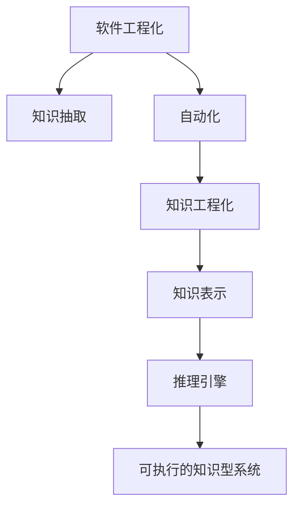

                 

# 软件 2.0 的未来愿景：创造更美好的世界

## 1. 背景介绍

### 1.1 问题由来
软件1.0时代，人类依赖程序员编写代码，通过计算机实现特定功能。这种方式依赖于经验丰富的开发者，开发周期长、成本高，难以适应复杂多变的业务需求。

### 1.2 问题核心关键点
软件2.0时代的核心在于将知识型任务（如开发、运维、测试等）自动化，使软件工程能够被更广泛、更高效地普及。这一过程也被称为“知识工程化”，即通过知识表示和自动化技术，让机器能够理解和执行复杂的知识型任务。

### 1.3 问题研究意义
软件2.0技术能够显著降低软件开发和运维成本，加速企业数字化转型。通过将人类的知识经验自动化，能够应对快速变化的市场需求，提高产品的创新速度和质量。

## 2. 核心概念与联系

### 2.1 核心概念概述

为更好地理解软件2.0的未来愿景，本节将介绍几个密切相关的核心概念：

- 软件工程化(Engineering)：将人类软件工程师的经验和知识转化为计算机可执行的程序的过程。
- 知识工程化(Knowledge Engineering)：通过人工智能技术，将人类知识自动化并使其可执行。
- 自动化(Automation)：将可编程问题转化为机器可以理解和执行的形式。
- 知识抽取(Extraction)：从文本、数据等非结构化信息中提取知识，供自动化系统使用。
- 知识表示(Knowledge Representation)：将知识表示为机器可理解的形式，如逻辑规则、图结构、向量空间等。
- 推理引擎(Inference Engine)：自动执行知识推理的引擎，如基于规则的推理、基于知识图谱的推理等。
- 可执行的知识型系统(Knowledge-Based Systems)：融合知识表示和推理引擎的系统，能够自动执行复杂任务。

这些核心概念之间的逻辑关系可以通过以下Mermaid流程图来展示：



这个流程图展示的知识工程化的核心概念及其之间的关系：

1. 软件工程化通过自动化，将人类的开发和运维经验转化为可执行程序。
2. 知识抽取通过处理非结构化信息，提取有用的知识。
3. 知识工程化将提取的知识自动表示为机器可理解的形式。
4. 知识表示将知识转化为推理引擎所需的表示方式。
5. 推理引擎自动执行知识推理，得出结论。
6. 可执行的知识型系统结合知识表示和推理引擎，实现自动化的知识执行。

## 3. 核心算法原理 & 具体操作步骤
### 3.1 算法原理概述

软件2.0的核心在于将知识自动化。这一过程通常分为两个步骤：知识抽取和知识表示。知识抽取通过自动化手段从非结构化信息中提取有用的知识，知识表示则将提取的知识转化为计算机可理解的形式，用于推理执行。

以自然语言处理(NLP)中的知识抽取为例，算法原理如下：

1. **知识抽取**：从文本中自动识别出实体、关系、属性等知识。这通常通过基于规则的方法、机器学习的方法或二者结合的方式实现。
2. **知识表示**：将抽取的知识表示为图结构、向量空间等形式，用于后续推理和执行。

### 3.2 算法步骤详解

以一个具体的知识抽取和表示流程为例：

**Step 1: 数据收集与预处理**
- 收集领域相关的非结构化数据，如文本、图片、音频等。
- 对数据进行预处理，如去噪、标准化等，确保数据质量。

**Step 2: 知识抽取**
- 使用NLP工具如BERT、GPT等，识别出文本中的实体、关系等知识。
- 对于具有特殊结构的领域数据，如知识图谱，可以采用更高级的算法如TransE、知识图嵌入等。
- 将抽取出的知识存储为结构化形式，如关系型数据库、图数据库等。

**Step 3: 知识表示**
- 将结构化的知识转化为向量表示。例如，使用Word2Vec、Glove等词向量工具将实体和属性表示为向量。
- 利用知识图嵌入方法，如TransE、D2L等，将实体和关系表示为向量空间中的点。
- 将表示好的知识上传到知识库，供后续推理使用。

**Step 4: 推理与执行**
- 构建推理引擎，如基于规则的推理、基于逻辑的推理等。
- 根据知识库中的知识，推理出新的结论。
- 将推理结果转化为可执行的命令或决策，供实际应用系统使用。

### 3.3 算法优缺点

软件2.0的知识自动化方法具有以下优点：
1. 提升开发效率：通过自动化将复杂知识编码为计算机可执行程序，大大缩短开发周期。
2. 降低成本：自动化知识抽取和表示，减少人工干预，降低开发和运维成本。
3. 增强决策能力：通过自动化知识推理，提高决策的准确性和及时性。
4. 提升安全性：自动化手段可以避免人为错误，提高系统的稳定性和安全性。

同时，该方法也存在一些局限性：
1. 依赖高质量数据：知识抽取和表示依赖于数据质量，低质量的数据可能影响结果准确性。
2. 计算资源消耗大：自动化处理复杂知识，对计算资源要求较高。
3. 可解释性不足：自动化知识表示和推理过程，难以解释和调试。
4. 模型泛化能力有限：自动化模型可能对新领域或新任务泛化效果不佳。

尽管存在这些局限性，但就目前而言，知识工程化是软件2.0发展的主流方向。未来相关研究的重点在于如何进一步降低知识抽取和表示的复杂度，提高自动化模型的泛化能力，同时兼顾可解释性和安全性等因素。

### 3.4 算法应用领域

软件2.0的知识自动化方法已经在多个领域得到应用，例如：

- 金融风控：使用自然语言处理技术自动抽取和表示金融领域的知识，用于风险评估和决策支持。
- 医疗诊断：通过自动化抽取和表示医学知识，辅助医生进行疾病诊断和个性化治疗。
- 智能客服：构建基于知识库的智能客服系统，自动解答用户咨询，提升服务质量。
- 工业运维：利用自动化技术抽取和表示工业领域的专业知识，提高设备运维的自动化和智能化水平。
- 教育辅助：通过自动抽取和表示教育领域的知识，实现个性化学习推荐和智能辅导。

这些领域展示了知识工程化在实际应用中的巨大潜力，为传统行业数字化转型提供了新的方向。

## 4. 数学模型和公式 & 详细讲解 & 举例说明

### 4.1 数学模型构建

以知识抽取中的命名实体识别(NER)任务为例，构建数学模型。

设文本序列为 $X=\{x_1,x_2,...,x_n\}$，其中 $x_i$ 为文本中的词语。定义实体类别集合为 $C=\{c_1,c_2,...,c_k\}$，其中 $c_i$ 表示第 $i$ 个实体类别。目标是从文本序列中识别出所有实体并标注其类别。

定义标注函数 $\pi:X\times C^n \rightarrow C^n$，其中 $n$ 为文本序列长度。

数学模型可以表示为：

$$
\pi(X,\theta) = \arg\max_\pi p(\pi|X,\theta)
$$

其中 $p(\pi|X,\theta)$ 为条件概率，表示在给定文本序列 $X$ 和模型参数 $\theta$ 的情况下，标注序列 $\pi$ 出现的概率。

### 4.2 公式推导过程

对于NER任务，可以使用条件随机场(Conditional Random Field, CRF)模型进行建模。

设标注序列为 $Y=\{y_1,y_2,...,y_n\}$，其中 $y_i$ 表示词语 $x_i$ 的实体标注。条件概率可以表示为：

$$
p(Y|X,\theta) = \frac{1}{Z}\prod_{i=1}^n p(y_i|x_i,Y_{<i},\theta)
$$

其中 $Z$ 为归一化因子，$Y_{<i}$ 表示 $y_1,...,y_{i-1}$ 的标注序列。$p(y_i|x_i,Y_{<i},\theta)$ 为条件概率，表示在给定前一个标注序列和当前词语的情况下，当前词语的标注为 $y_i$ 的概率。

根据CRF模型，$p(y_i|x_i,Y_{<i},\theta)$ 可以进一步表示为：

$$
p(y_i|x_i,Y_{<i},\theta) = \frac{e^{\sum_{j=1}^n A_{ij}y_j + B_iy_i}}{Z_i}
$$

其中 $A_{ij}$ 和 $B_i$ 为模型参数，$Z_i$ 为归一化因子。

### 4.3 案例分析与讲解

以一个简单的NER案例为例，说明知识抽取和表示的过程。

**数据准备**：
- 收集医疗领域的病历记录，包含医生诊断和病人情况。
- 提取文本中的所有名词和动词，作为实体候选。
- 定义实体类别集合，如姓名、性别、年龄、病情等。

**知识抽取**：
- 使用BERT模型对文本进行编码，得到每个词语的向量表示。
- 将向量输入到条件随机场模型中，计算每个词语被标注为某个实体的概率。
- 输出标注序列，将文本中的实体抽取出来。

**知识表示**：
- 将抽取出的实体存储为结构化形式，如字典或数据库。
- 使用向量空间模型将实体和属性表示为向量。
- 将表示好的知识上传到知识库，供后续推理使用。

## 5. 项目实践：代码实例和详细解释说明

### 5.1 开发环境搭建

在进行知识工程化实践前，我们需要准备好开发环境。以下是使用Python进行PyTorch开发的环境配置流程：

1. 安装Anaconda：从官网下载并安装Anaconda，用于创建独立的Python环境。

2. 创建并激活虚拟环境：
```bash
conda create -n pytorch-env python=3.8 
conda activate pytorch-env
```

3. 安装PyTorch：根据CUDA版本，从官网获取对应的安装命令。例如：
```bash
conda install pytorch torchvision torchaudio cudatoolkit=11.1 -c pytorch -c conda-forge
```

4. 安装transformers库：
```bash
pip install transformers
```

5. 安装各类工具包：
```bash
pip install numpy pandas scikit-learn matplotlib tqdm jupyter notebook ipython
```

完成上述步骤后，即可在`pytorch-env`环境中开始知识抽取实践。

### 5.2 源代码详细实现

下面以医疗领域的命名实体识别(NER)任务为例，给出使用Transformers库对BERT模型进行知识抽取的PyTorch代码实现。

首先，定义NER任务的数据处理函数：

```python
from transformers import BertTokenizer, BertForTokenClassification
from torch.utils.data import Dataset, DataLoader
from tqdm import tqdm
import torch
import numpy as np

class NERDataset(Dataset):
    def __init__(self, texts, tags, tokenizer):
        self.texts = texts
        self.tags = tags
        self.tokenizer = tokenizer
        self.max_len = 128
        
    def __len__(self):
        return len(self.texts)
    
    def __getitem__(self, item):
        text = self.texts[item]
        tags = self.tags[item]
        
        encoding = self.tokenizer(text, return_tensors='pt', max_length=self.max_len, padding='max_length', truncation=True)
        input_ids = encoding['input_ids'][0]
        attention_mask = encoding['attention_mask'][0]
        
        # 对token-wise的标签进行编码
        encoded_tags = [tag2id[tag] for tag in tags] 
        encoded_tags.extend([tag2id['O']] * (self.max_len - len(encoded_tags)))
        labels = torch.tensor(encoded_tags, dtype=torch.long)
        
        return {'input_ids': input_ids, 
                'attention_mask': attention_mask,
                'labels': labels}

# 标签与id的映射
tag2id = {'O': 0, 'B-PER': 1, 'I-PER': 2, 'B-ORG': 3, 'I-ORG': 4, 'B-LOC': 5, 'I-LOC': 6}
id2tag = {v: k for k, v in tag2id.items()}

# 创建dataset
tokenizer = BertTokenizer.from_pretrained('bert-base-cased')

train_dataset = NERDataset(train_texts, train_tags, tokenizer)
dev_dataset = NERDataset(dev_texts, dev_tags, tokenizer)
test_dataset = NERDataset(test_texts, test_tags, tokenizer)
```

然后，定义模型和优化器：

```python
from transformers import BertForTokenClassification, AdamW

model = BertForTokenClassification.from_pretrained('bert-base-cased', num_labels=len(tag2id))

optimizer = AdamW(model.parameters(), lr=2e-5)
```

接着，定义训练和评估函数：

```python
from torch.utils.data import DataLoader
from tqdm import tqdm
from sklearn.metrics import classification_report

device = torch.device('cuda') if torch.cuda.is_available() else torch.device('cpu')
model.to(device)

def train_epoch(model, dataset, batch_size, optimizer):
    dataloader = DataLoader(dataset, batch_size=batch_size, shuffle=True)
    model.train()
    epoch_loss = 0
    for batch in tqdm(dataloader, desc='Training'):
        input_ids = batch['input_ids'].to(device)
        attention_mask = batch['attention_mask'].to(device)
        labels = batch['labels'].to(device)
        model.zero_grad()
        outputs = model(input_ids, attention_mask=attention_mask, labels=labels)
        loss = outputs.loss
        epoch_loss += loss.item()
        loss.backward()
        optimizer.step()
    return epoch_loss / len(dataloader)

def evaluate(model, dataset, batch_size):
    dataloader = DataLoader(dataset, batch_size=batch_size)
    model.eval()
    preds, labels = [], []
    with torch.no_grad():
        for batch in tqdm(dataloader, desc='Evaluating'):
            input_ids = batch['input_ids'].to(device)
            attention_mask = batch['attention_mask'].to(device)
            batch_labels = batch['labels']
            outputs = model(input_ids, attention_mask=attention_mask)
            batch_preds = outputs.logits.argmax(dim=2).to('cpu').tolist()
            batch_labels = batch_labels.to('cpu').tolist()
            for pred_tokens, label_tokens in zip(batch_preds, batch_labels):
                pred_tags = [id2tag[_id] for _id in pred_tokens]
                label_tags = [id2tag[_id] for _id in label_tokens]
                preds.append(pred_tags[:len(label_tags)])
                labels.append(label_tags)
                
    print(classification_report(labels, preds))
```

最后，启动训练流程并在测试集上评估：

```python
epochs = 5
batch_size = 16

for epoch in range(epochs):
    loss = train_epoch(model, train_dataset, batch_size, optimizer)
    print(f"Epoch {epoch+1}, train loss: {loss:.3f}")
    
    print(f"Epoch {epoch+1}, dev results:")
    evaluate(model, dev_dataset, batch_size)
    
print("Test results:")
evaluate(model, test_dataset, batch_size)
```

以上就是使用PyTorch对BERT进行命名实体识别任务的知识抽取实践代码。可以看到，得益于Transformers库的强大封装，我们可以用相对简洁的代码完成BERT模型的加载和知识抽取。

### 5.3 代码解读与分析

让我们再详细解读一下关键代码的实现细节：

**NERDataset类**：
- `__init__`方法：初始化文本、标签、分词器等关键组件。
- `__len__`方法：返回数据集的样本数量。
- `__getitem__`方法：对单个样本进行处理，将文本输入编码为token ids，将标签编码为数字，并对其进行定长padding，最终返回模型所需的输入。

**tag2id和id2tag字典**：
- 定义了标签与数字id之间的映射关系，用于将token-wise的预测结果解码回真实的标签。

**训练和评估函数**：
- 使用PyTorch的DataLoader对数据集进行批次化加载，供模型训练和推理使用。
- 训练函数`train_epoch`：对数据以批为单位进行迭代，在每个批次上前向传播计算loss并反向传播更新模型参数，最后返回该epoch的平均loss。
- 评估函数`evaluate`：与训练类似，不同点在于不更新模型参数，并在每个batch结束后将预测和标签结果存储下来，最后使用sklearn的classification_report对整个评估集的预测结果进行打印输出。

**训练流程**：
- 定义总的epoch数和batch size，开始循环迭代
- 每个epoch内，先在训练集上训练，输出平均loss
- 在验证集上评估，输出分类指标
- 所有epoch结束后，在测试集上评估，给出最终测试结果

可以看到，PyTorch配合Transformers库使得BERT模型的加载和知识抽取变得简洁高效。开发者可以将更多精力放在数据处理、模型改进等高层逻辑上，而不必过多关注底层的实现细节。

当然，工业级的系统实现还需考虑更多因素，如模型的保存和部署、超参数的自动搜索、更灵活的任务适配层等。但核心的知识抽取范式基本与此类似。

## 6. 实际应用场景
### 6.1 智能客服系统

基于知识抽取的智能客服系统，可以广泛应用于各个行业，为客服部门提供智能化的服务。

在技术实现上，可以收集企业内部的历史客服对话记录，将问题和最佳答复构建成监督数据，在此基础上对预训练模型进行知识抽取。抽取出的知识存储在知识库中，供客服系统实时检索和使用。系统根据用户的问题，自动匹配最合适的知识片段，生成自然流畅的回答，实现7x24小时不间断服务，快速响应客户咨询。

### 6.2 金融风控

金融风控系统需要实时监测市场风险，及时发现异常交易和欺诈行为。传统的规则引擎往往难以应对复杂多变的市场变化。使用知识抽取技术自动提取金融领域的知识，构建知识库，实时分析客户交易行为，可以大大提高风控系统的智能化水平。

系统通过抽取历史交易记录中的实体、关系等知识，构建知识图谱，实时监测客户的交易行为。一旦发现异常交易或异常客户行为，系统便会自动预警，帮助金融机构及时采取措施，规避金融风险。

### 6.3 医疗诊断

医疗诊断系统需要准确理解病人的病情描述，自动提取关键信息，辅助医生进行诊断和治疗。传统的系统依赖医生的经验和知识，难以应对大量病人的复杂描述。

使用知识抽取技术，自动从病历记录中提取病人的姓名、性别、年龄、病情等信息，构建知识库。系统根据病人的描述，自动匹配最可能的情况，生成诊断报告，辅助医生进行诊断和治疗决策。

### 6.4 未来应用展望

随着知识抽取和表示技术的不断发展，基于软件2.0的知识型系统将得到广泛应用，为各行各业带来变革性影响。

在智慧城市治理中，知识型系统可以用于城市事件监测、舆情分析、应急指挥等环节，提高城市管理的自动化和智能化水平，构建更安全、高效的未来城市。

在教育领域，知识型系统可以用于个性化学习推荐和智能辅导，因材施教，促进教育公平，提高教学质量。

在农业领域，知识型系统可以用于病虫害预测和防治，提高农业生产的智能化水平。

此外，在工业生产、智能交通、智能制造等众多领域，知识型系统也将不断涌现，为传统行业数字化转型升级提供新的技术路径。相信随着技术的日益成熟，软件2.0知识型系统必将在更多领域大放异彩，深刻影响人类的生产生活方式。

## 7. 工具和资源推荐
### 7.1 学习资源推荐

为了帮助开发者系统掌握软件2.0的知识自动化技术，这里推荐一些优质的学习资源：

1. 《软件工程化实践》系列博文：由大模型技术专家撰写，深入浅出地介绍了软件2.0的核心概念和实现技术。

2. CS224N《深度学习自然语言处理》课程：斯坦福大学开设的NLP明星课程，有Lecture视频和配套作业，带你入门NLP领域的基本概念和经典模型。

3. 《自然语言处理与知识工程》书籍：全面介绍了自然语言处理和知识工程的理论基础和实践方法，适合进一步深入学习。

4. Kaggle上的知识抽取竞赛：通过参与比赛，可以了解实际应用中的知识抽取技术和模型架构。

5. CLUE开源项目：中文语言理解测评基准，涵盖大量不同类型的中文NLP数据集，并提供了基于知识抽取的baseline模型，助力中文NLP技术发展。

通过对这些资源的学习实践，相信你一定能够快速掌握软件2.0的知识自动化技术的精髓，并用于解决实际的NLP问题。
###  7.2 开发工具推荐

高效的开发离不开优秀的工具支持。以下是几款用于知识工程化开发的常用工具：

1. PyTorch：基于Python的开源深度学习框架，灵活动态的计算图，适合快速迭代研究。

2. TensorFlow：由Google主导开发的开源深度学习框架，生产部署方便，适合大规模工程应用。

3. Transformers库：HuggingFace开发的NLP工具库，集成了众多SOTA语言模型，支持PyTorch和TensorFlow，是进行知识抽取任务开发的利器。

4. Weights & Biases：模型训练的实验跟踪工具，可以记录和可视化模型训练过程中的各项指标，方便对比和调优。

5. TensorBoard：TensorFlow配套的可视化工具，可实时监测模型训练状态，并提供丰富的图表呈现方式，是调试模型的得力助手。

6. Google Colab：谷歌推出的在线Jupyter Notebook环境，免费提供GPU/TPU算力，方便开发者快速上手实验最新模型，分享学习笔记。

合理利用这些工具，可以显著提升知识抽取和表示任务的开发效率，加快创新迭代的步伐。

### 7.3 相关论文推荐

软件2.0的知识自动化技术的发展源于学界的持续研究。以下是几篇奠基性的相关论文，推荐阅读：

1. "Knowledge-Based Engineering: The Past, Present, and Future"：介绍知识工程化的发展历程和未来展望，适合全面了解知识工程化的全貌。

2. "Semantic Role Labeling: A Survey"：全面综述语义角色标注技术，展示了知识抽取的多种方法和应用场景。

3. "Knowledge Base Populating and Querying: A Survey"：综述知识图谱构建和查询技术，介绍了知识表示和推理的多种方法。

4. "Automated Natural Language Processing: A Survey"：综述自动化的自然语言处理技术，展示了知识抽取和表示的多种方法和应用场景。

5. "A Survey on Transfer Learning for Knowledge Graphs"：综述知识图谱的迁移学习方法，展示了知识抽取和表示的多种方法和应用场景。

这些论文代表了大语言模型微调技术的发展脉络。通过学习这些前沿成果，可以帮助研究者把握学科前进方向，激发更多的创新灵感。

## 8. 总结：未来发展趋势与挑战

### 8.1 总结

本文对软件2.0的知识自动化技术进行了全面系统的介绍。首先阐述了知识工程化的研究背景和意义，明确了知识自动化在降低开发成本、提高决策能力等方面的重要价值。其次，从原理到实践，详细讲解了知识抽取和表示的数学模型和算法流程，给出了知识抽取任务开发的完整代码实例。同时，本文还广泛探讨了知识自动化技术在智能客服、金融风控、医疗诊断等实际应用场景中的前景，展示了知识工程化在实际应用中的巨大潜力。此外，本文精选了知识自动化技术的各类学习资源，力求为读者提供全方位的技术指引。

通过本文的系统梳理，可以看到，知识工程化是软件2.0发展的主流方向。这一过程将大大降低软件开发的成本和周期，提升决策的准确性和及时性，为各行各业带来变革性影响。未来，伴随知识抽取和表示技术的不断演进，知识型系统必将在更多领域得到应用，为传统行业数字化转型提供新的方向。

### 8.2 未来发展趋势

展望未来，软件2.0的知识自动化技术将呈现以下几个发展趋势：

1. 模型规模持续增大。随着算力成本的下降和数据规模的扩张，知识抽取和表示的模型规模还将持续增长。超大规模模型蕴含的丰富知识，有望支撑更加复杂多变的知识抽取任务。

2. 自动化范式多样化。除了传统的基于规则和机器学习的方法外，未来将涌现更多自动化范式，如基于符号逻辑的推理、基于神经网络的推理等。这些方法将进一步提高知识抽取和表示的自动化程度和精度。

3. 知识表示更加结构化。未来的知识表示将更加结构化，能够更好地捕捉知识之间的关联性和层次性。例如，知识图谱将变得更加丰富和精细，用于支持更加复杂的推理和查询。

4. 多模态知识整合。未来的知识抽取系统将能够整合视觉、语音、文本等多模态信息，构建更加全面和智能的知识型系统。这将极大地提升知识抽取和表示的能力，应对更加复杂的实际应用需求。

5. 知识抽取模型的跨领域迁移。未来的知识抽取模型将更加通用，能够适应不同领域和任务的知识抽取需求。这将使知识抽取技术在更多领域得到应用，提高各行各业的智能化水平。

以上趋势凸显了软件2.0知识自动化技术的广阔前景。这些方向的探索发展，必将进一步提升知识抽取和表示的精度和效率，为知识型系统带来新的突破。

### 8.3 面临的挑战

尽管知识自动化技术已经取得了显著进展，但在迈向更加智能化、普适化应用的过程中，仍面临诸多挑战：

1. 数据质量和数量：知识抽取和表示依赖于高质量的数据，低质量的数据可能影响结果的准确性。如何提高数据质量和数量，获取更全面的领域知识，仍然是一大难题。

2. 计算资源消耗：知识抽取和表示的计算复杂度高，对计算资源要求较高。如何优化计算模型，提高推理速度，降低资源消耗，是未来需要解决的问题。

3. 可解释性不足：知识抽取和表示过程难以解释和调试，特别是在复杂多模态的情况下。如何提高知识抽取和表示的可解释性，提升系统可信度，将是重要的研究课题。

4. 知识图谱的构建和维护：知识图谱的构建和维护需要大量人工干预，成本较高。如何自动构建和维护知识图谱，减少人工干预，提高知识抽取的自动化程度，是未来需要解决的问题。

5. 知识整合的困难：不同领域的知识往往存在较大差异，如何将不同领域的知识整合在一起，构建统一的知识体系，是未来需要解决的问题。

6. 模型的泛化能力：知识抽取模型在特定领域和特定任务上表现较好，但在新领域和任务上泛化效果有限。如何提高知识抽取模型的泛化能力，使其适应更多领域和任务，是未来需要解决的问题。

这些挑战凸显了知识自动化技术在实际应用中的复杂性和局限性。未来相关研究需要在数据处理、计算优化、可解释性提升、知识图谱构建等方面进行更深入的探索和实践。

### 8.4 研究展望

面对知识自动化技术面临的诸多挑战，未来的研究需要在以下几个方面寻求新的突破：

1. 探索新的知识抽取方法。结合符号逻辑和神经网络，开发更加高效和灵活的知识抽取方法。

2. 引入更多先验知识。将符号化的先验知识，如知识图谱、逻辑规则等，与神经网络模型进行巧妙融合，引导知识抽取过程学习更准确、合理的语言模型。

3. 优化知识图谱的构建。采用自动构建、自动扩展等技术，降低知识图谱的构建和维护成本，提高知识图谱的覆盖范围和准确性。

4. 结合因果分析和博弈论工具。将因果分析方法引入知识抽取模型，识别出模型决策的关键特征，增强输出解释的因果性和逻辑性。

5. 引入更多多模态数据。将视觉、语音、文本等多模态信息整合，构建更加全面和智能的知识型系统。

6. 纳入伦理道德约束。在模型训练目标中引入伦理导向的评估指标，过滤和惩罚有偏见、有害的输出倾向，确保知识抽取和表示的公正性和安全性。

这些研究方向的探索，必将引领知识自动化技术迈向更高的台阶，为知识型系统带来新的突破。面向未来，知识自动化技术还需要与其他人工智能技术进行更深入的融合，如知识表示、因果推理、强化学习等，多路径协同发力，共同推动知识型系统的进步。只有勇于创新、敢于突破，才能不断拓展知识自动化技术的边界，让知识型系统更好地造福人类社会。

## 9. 附录：常见问题与解答

**Q1：知识抽取和表示是否适用于所有NLP任务？**

A: 知识抽取和表示技术在大多数NLP任务上都能取得不错的效果，特别是对于数据量较小的任务。但对于一些特定领域的任务，如医学、法律等，仅仅依靠通用语料预训练的模型可能难以很好地适应。此时需要在特定领域语料上进一步预训练，再进行知识抽取，才能获得理想效果。

**Q2：如何选择合适的知识表示方法？**

A: 知识表示方法的选择应根据任务需求和数据特征进行选择。常见的知识表示方法包括基于规则的表示、基于神经网络的表示、基于逻辑的表示等。对于复杂多模态任务，可以使用知识图谱等结构化表示方法。

**Q3：知识抽取和表示的过程是否需要大量标注数据？**

A: 知识抽取和表示的过程需要大量标注数据来训练模型，尤其是对于新的领域和任务。但随着知识图谱等先验知识的引入，部分知识抽取任务可以使用无监督或半监督方法进行。

**Q4：如何提高知识抽取模型的泛化能力？**

A: 提高知识抽取模型的泛化能力，可以从以下几个方面入手：
1. 使用多领域、多任务的数据集进行预训练。
2. 引入更多的先验知识，如知识图谱、逻辑规则等。
3. 采用迁移学习方法，将已有的知识抽取模型应用到新的任务中。

**Q5：知识抽取和表示的系统如何部署？**

A: 知识抽取和表示的系统通常需要部署到生产环境，保证实时性和稳定性。系统需要支持分布式计算，能够处理大规模数据和高并发请求。同时，需要考虑系统的可扩展性和弹性伸缩，确保系统在负载变化时仍能稳定运行。

以上是针对知识自动化技术的一些常见问题及其解答。通过这些问题的讨论，可以看到知识抽取和表示技术在实际应用中的复杂性和挑战。未来，伴随技术的不断演进和应用经验的积累，知识自动化技术必将不断完善，在更多领域和任务中得到应用，推动各行各业的数字化转型升级。

---

作者：禅与计算机程序设计艺术 / Zen and the Art of Computer Programming

