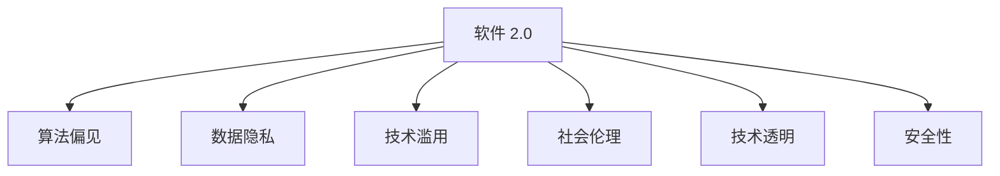

                 

# 软件 2.0 的社会责任：科技向善

> 关键词：软件 2.0, 社会责任, 人工智能, 科技伦理, 数据隐私, 人工智能与人类未来

## 1. 背景介绍

### 1.1 问题由来

随着人工智能技术的迅猛发展，尤其是软件 2.0 时代的到来，人类社会的方方面面正在经历深刻的变革。软件 2.0 是指基于人工智能和大数据技术的智能软件，具备了自主学习、适应环境、优化决策等能力，能够持续改进并自我进化的软件形态。

然而，软件 2.0 的强大能力也带来了前所未有的挑战。例如，算法偏见、数据隐私、技术滥用等问题不断涌现，严重威胁着人类的社会安全、伦理道德和价值观。因此，探讨软件 2.0 的社会责任，确保其向善发展，成为亟待解决的重大课题。

### 1.2 问题核心关键点

软件 2.0 的社会责任核心关键点包括：

- 算法偏见：软件 2.0 在训练和应用中，是否可能产生或放大偏见，影响公平性和公正性。
- 数据隐私：在使用和存储数据时，是否遵守隐私保护原则，避免个人信息泄露。
- 技术滥用：是否存在滥用技术进行不道德、有害行为的可能性。
- 社会伦理：在决策过程中，是否符合人类的伦理道德准则，是否对人类社会产生正面影响。
- 技术透明：是否具备足够的透明度，使得用户和开发者能够理解和控制其行为。
- 安全性：在面对恶意攻击和干扰时，是否具备足够的安全保障，防止系统被恶意操控。

这些关键点共同构成了软件 2.0 向善发展的基础。只有在这些方面做出合理的决策，才能确保软件 2.0 技术真正造福人类。

## 2. 核心概念与联系

### 2.1 核心概念概述

为更好地理解软件 2.0 的社会责任，本节将介绍几个密切相关的核心概念：

- **软件 2.0**：基于人工智能和大数据技术的智能软件，具备自主学习、适应环境、优化决策等能力。
- **算法偏见**：指算法在处理数据时，由于历史数据的不平衡、不充分或者存在有偏见的特征工程，导致输出结果存在系统性偏差。
- **数据隐私**：指在数据收集、存储、处理和分享过程中，保护个人隐私不受侵害的原则和实践。
- **技术滥用**：指不道德、有害地使用技术，可能对社会、环境或人类健康造成负面影响。
- **社会伦理**：指在软件开发和使用过程中，遵循的伦理道德准则，确保技术行为符合人类的价值观和伦理标准。
- **技术透明**：指软件系统的内部机制、决策依据、数据来源等信息对用户和开发者公开透明，便于理解、监督和控制。
- **安全性**：指系统在面对恶意攻击和干扰时，具备的防护能力，确保系统稳定可靠运行。

这些核心概念之间的逻辑关系可以通过以下Mermaid流程图来展示：



这个流程图展示了大语言模型的核心概念及其之间的关系：

1. 软件 2.0 是基础，通过算法偏见、数据隐私、技术滥用、社会伦理、技术透明和安全性等多方面共同作用，确保其向善发展。
2. 算法偏见需要通过数据预处理和算法设计进行控制。
3. 数据隐私需要通过严格的数据处理规范和技术手段保护。
4. 技术滥用需要通过法律、伦理和社会监管进行预防和制裁。
5. 社会伦理需要通过教育、培训和社会共识培养。
6. 技术透明需要通过公开透明的文档和技术架构实现。
7. 安全性需要通过安全机制和技术防护实现。

这些概念共同构成了软件 2.0 的社会责任体系，确保技术在应用过程中对人类社会产生积极影响。

## 3. 核心算法原理 & 具体操作步骤
### 3.1 算法原理概述

软件 2.0 的社会责任，涉及算法偏见、数据隐私、技术滥用、社会伦理、技术透明和安全性等多个方面。以下我们将从算法和操作层面进行详细介绍：

### 3.2 算法步骤详解

#### 算法偏见控制

**Step 1: 数据收集与预处理**
- 收集多样化的数据样本，确保数据集覆盖不同的社会群体和场景。
- 进行数据清洗，去除低质量数据和有偏见的数据点。
- 进行数据增强，通过数据扩充和生成对抗样本，减少数据偏差。

**Step 2: 算法设计**
- 采用公平性算法，如权重平衡、公平采样、对抗学习等，减少算法输出偏差。
- 设计可解释性算法，使算法决策过程透明，便于监督和调整。

**Step 3: 模型评估与调整**
- 使用偏见度量指标，如平衡准确率、公平性指标等，评估模型表现。
- 根据评估结果，调整模型参数和算法设计，进一步减少偏见。

#### 数据隐私保护

**Step 1: 数据收集**
- 采用匿名化处理，去除或加密个人敏感信息。
- 遵循数据最小化原则，仅收集必要的个人信息。

**Step 2: 数据存储**
- 使用加密存储技术，保护数据在存储过程中的安全性。
- 采用分布式存储，分散数据存储风险。

**Step 3: 数据使用**
- 限制数据访问权限，确保只有授权人员可以访问。
- 采用差分隐私技术，在数据使用过程中保护用户隐私。

#### 技术滥用预防

**Step 1: 技术伦理审查**
- 建立技术伦理委员会，对新算法和新应用进行伦理审查。
- 制定伦理规范和准则，确保技术应用符合伦理标准。

**Step 2: 法律合规**
- 遵守相关法律法规，如数据保护法、隐私保护法等。
- 建立合规审查机制，确保技术应用合法合规。

**Step 3: 用户教育**
- 通过用户手册和培训，提高用户对技术滥用的认识和防范能力。
- 建立反馈机制，及时响应用户举报和投诉。

#### 社会伦理确保

**Step 1: 社会共识**
- 通过调研和座谈会，收集社会各界的意见和建议。
- 制定社会共识框架，明确技术应用的伦理标准和原则。

**Step 2: 教育与培训**
- 开展技术伦理教育，培养开发者的伦理意识和社会责任感。
- 提供技术伦理培训，提升用户对技术的理解和应用能力。

**Step 3: 社会监督**
- 建立社会监督机制，接受社会公众的监督和批评。
- 定期发布社会责任报告，公开技术应用的社会影响。

#### 技术透明增强

**Step 1: 文档与代码公开**
- 公开算法文档和代码，确保技术透明度。
- 提供技术解释，帮助用户理解技术决策过程。

**Step 2: 用户参与**
- 建立用户反馈机制，收集用户对技术的意见和建议。
- 在决策过程中引入用户参与，确保技术应用符合用户需求。

**Step 3: 内部审查**
- 定期进行技术审查，发现和修正技术问题。
- 引入第三方审查，提高技术审查的独立性和客观性。

#### 安全性提升

**Step 1: 安全机制设计**
- 采用安全加密技术，确保数据传输和存储的安全。
- 设计入侵检测机制，及时发现和防范安全威胁。

**Step 2: 安全测试与评估**
- 定期进行安全测试，评估系统的安全性和防护能力。
- 建立应急响应机制，在安全事件发生时快速反应和处理。

**Step 3: 安全教育与培训**
- 开展安全教育，提高开发者和用户的安全意识。
- 提供安全培训，提升开发者和用户的安全技能。

### 3.3 算法优缺点

#### 算法偏见控制
- **优点**：能够减少算法输出中的系统性偏差，提高模型公平性。
- **缺点**：可能增加数据处理和算法设计的复杂性。

#### 数据隐私保护
- **优点**：保护用户隐私，减少数据滥用和信息泄露的风险。
- **缺点**：可能增加数据处理和存储的复杂性。

#### 技术滥用预防
- **优点**：确保技术应用符合伦理标准，减少技术滥用风险。
- **缺点**：需要建立相应的监管机制和合规审查机制，成本较高。

#### 社会伦理确保
- **优点**：确保技术应用符合社会共识，减少社会风险。
- **缺点**：需要大量的时间和资源进行社会调研和教育培训。

#### 技术透明增强
- **优点**：提高技术透明度，增强用户信任和接受度。
- **缺点**：可能增加技术文档和解释的工作量。

#### 安全性提升
- **优点**：确保系统安全可靠，减少安全风险。
- **缺点**：可能增加安全机制和测试的复杂性。

### 3.4 算法应用领域

软件 2.0 的社会责任技术，已经在多个领域得到了广泛应用，包括但不限于：

- **医疗健康**：通过数据分析和预测，提供个性化的医疗建议和治疗方案。
- **金融服务**：通过风险评估和欺诈检测，保障金融交易的安全性和公平性。
- **教育培训**：通过智能推荐和评估，提升教育质量和资源配置效率。
- **城市治理**：通过智能监控和分析，提高城市管理和公共服务水平。
- **环境保护**：通过数据分析和模拟，优化资源配置和环境保护措施。

这些应用领域，展示了软件 2.0 在社会各个方面的潜力和影响力。通过合理应用这些技术，可以有效提升社会治理水平，改善人类生活质量。

## 4. 数学模型和公式 & 详细讲解 & 举例说明

### 4.1 数学模型构建

#### 算法偏见控制

**数据收集与预处理**
- 假设数据集为 $D=\{(x_i, y_i)\}_{i=1}^N$，其中 $x_i$ 为样本特征，$y_i$ 为样本标签。
- 数据预处理的目标是去除偏差和噪声，构建公平的数据集。

**算法设计**
- 假设模型为 $f_{\theta}(x)$，其中 $\theta$ 为模型参数。
- 假设公平性算法为 $F_{\theta}$，其目标是最小化模型的偏见度量指标，如平衡准确率（Balanced Accuracy）。

**模型评估与调整**
- 假设模型在训练集上的预测为 $\hat{y}$，真实标签为 $y$。
- 假设模型在测试集上的公平性指标为 $A_{\theta}$。

### 4.2 公式推导过程

#### 数据收集与预处理

**公式推导**
- 假设数据预处理后，得到新的数据集 $D'=\{(x_i', y_i')\}_{i=1}^N$，其中 $x_i'$ 为处理后的特征。
- 假设数据预处理的流程为 $F(x_i)$，则新数据集可以表示为 $D'=\{(F(x_i), y_i)\}_{i=1}^N$。

**实例分析**
- 假设原始数据集中存在性别偏见，男性样本的准确率显著高于女性样本。
- 假设采用性别平衡的采样方法，对数据集进行重新采样，生成新数据集。

#### 算法设计

**公式推导**
- 假设模型为线性回归模型，目标是最小化均方误差（Mean Squared Error, MSE）。
- 假设模型为 $f_{\theta}(x) = \theta_0 + \theta_1 x_1 + \theta_2 x_2 + \cdots + \theta_n x_n$。

**实例分析**
- 假设训练集为 $D=\{(x_i, y_i)\}_{i=1}^N$，其中 $x_i = [x_{i1}, x_{i2}, \cdots, x_{in}]$，$y_i$ 为样本标签。
- 假设模型参数为 $\theta = [\theta_0, \theta_1, \theta_2, \cdots, \theta_n]$。

#### 模型评估与调整

**公式推导**
- 假设模型在训练集上的预测为 $\hat{y} = f_{\theta}(x)$，真实标签为 $y$。
- 假设模型在测试集上的公平性指标为 $A_{\theta}$。

**实例分析**
- 假设训练集为 $D=\{(x_i, y_i)\}_{i=1}^N$，其中 $x_i$ 为样本特征，$y_i$ 为样本标签。
- 假设模型为线性回归模型，训练得到模型参数 $\theta$。
- 假设在测试集上评估模型的公平性，得到公平性指标 $A_{\theta}$。

### 4.3 案例分析与讲解

**案例一：算法偏见控制**

假设一个贷款申请系统，训练集存在性别偏见，男性申请者获得贷款的概率远高于女性申请者。为消除偏见，可以采取以下步骤：

1. 数据收集与预处理：收集历史贷款申请数据，并进行性别平衡采样，生成新的训练集。
2. 算法设计：采用公平性算法，如对抗学习，构建无偏见的贷款申请模型。
3. 模型评估与调整：在测试集上评估模型的公平性，调整模型参数，进一步减少偏见。

**案例二：数据隐私保护**

假设一个健康监测系统，需要收集用户的健康数据。为保护用户隐私，可以采取以下步骤：

1. 数据收集：通过匿名化处理，去除或加密个人敏感信息。
2. 数据存储：采用加密存储技术，保护数据在存储过程中的安全性。
3. 数据使用：限制数据访问权限，确保只有授权人员可以访问，使用差分隐私技术保护用户隐私。

**案例三：技术滥用预防**

假设一个智能推荐系统，存在技术滥用的风险，可能推荐有害信息。为预防滥用，可以采取以下步骤：

1. 技术伦理审查：建立技术伦理委员会，对新算法和新应用进行伦理审查。
2. 法律合规：遵守相关法律法规，如数据保护法、隐私保护法等。
3. 用户教育：通过用户手册和培训，提高用户对技术滥用的认识和防范能力。

## 5. 项目实践：代码实例和详细解释说明

### 5.1 开发环境搭建

在进行软件 2.0 的社会责任实践前，我们需要准备好开发环境。以下是使用Python进行PyTorch开发的环境配置流程：

1. 安装Anaconda：从官网下载并安装Anaconda，用于创建独立的Python环境。

2. 创建并激活虚拟环境：
```bash
conda create -n pytorch-env python=3.8 
conda activate pytorch-env
```

3. 安装PyTorch：根据CUDA版本，从官网获取对应的安装命令。例如：
```bash
conda install pytorch torchvision torchaudio cudatoolkit=11.1 -c pytorch -c conda-forge
```

4. 安装Transformers库：
```bash
pip install transformers
```

5. 安装各类工具包：
```bash
pip install numpy pandas scikit-learn matplotlib tqdm jupyter notebook ipython
```

完成上述步骤后，即可在`pytorch-env`环境中开始实践。

### 5.2 源代码详细实现

这里以一个简单的医疗诊断系统为例，展示软件 2.0 在医疗领域的应用及其社会责任实现。

首先，定义医疗诊断系统的数据处理函数：

```python
from transformers import BertTokenizer
from torch.utils.data import Dataset
import torch

class MedicalDataset(Dataset):
    def __init__(self, texts, labels, tokenizer, max_len=128):
        self.texts = texts
        self.labels = labels
        self.tokenizer = tokenizer
        self.max_len = max_len
        
    def __len__(self):
        return len(self.texts)
    
    def __getitem__(self, item):
        text = self.texts[item]
        label = self.labels[item]
        
        encoding = self.tokenizer(text, return_tensors='pt', max_length=self.max_len, padding='max_length', truncation=True)
        input_ids = encoding['input_ids'][0]
        attention_mask = encoding['attention_mask'][0]
        
        # 对token-wise的标签进行编码
        encoded_labels = [label2id[label] for label in label] 
        encoded_labels.extend([label2id['Negative']] * (self.max_len - len(encoded_labels)))
        labels = torch.tensor(encoded_labels, dtype=torch.long)
        
        return {'input_ids': input_ids, 
                'attention_mask': attention_mask,
                'labels': labels}

# 标签与id的映射
label2id = {'Positive': 0, 'Negative': 1}
id2label = {v: k for k, v in label2id.items()}

# 创建dataset
tokenizer = BertTokenizer.from_pretrained('bert-base-cased')

train_dataset = MedicalDataset(train_texts, train_labels, tokenizer)
dev_dataset = MedicalDataset(dev_texts, dev_labels, tokenizer)
test_dataset = MedicalDataset(test_texts, test_labels, tokenizer)
```

然后，定义模型和优化器：

```python
from transformers import BertForTokenClassification, AdamW

model = BertForTokenClassification.from_pretrained('bert-base-cased', num_labels=len(label2id))

optimizer = AdamW(model.parameters(), lr=2e-5)
```

接着，定义训练和评估函数：

```python
from torch.utils.data import DataLoader
from tqdm import tqdm
from sklearn.metrics import classification_report

device = torch.device('cuda') if torch.cuda.is_available() else torch.device('cpu')
model.to(device)

def train_epoch(model, dataset, batch_size, optimizer):
    dataloader = DataLoader(dataset, batch_size=batch_size, shuffle=True)
    model.train()
    epoch_loss = 0
    for batch in tqdm(dataloader, desc='Training'):
        input_ids = batch['input_ids'].to(device)
        attention_mask = batch['attention_mask'].to(device)
        labels = batch['labels'].to(device)
        model.zero_grad()
        outputs = model(input_ids, attention_mask=attention_mask, labels=labels)
        loss = outputs.loss
        epoch_loss += loss.item()
        loss.backward()
        optimizer.step()
    return epoch_loss / len(dataloader)

def evaluate(model, dataset, batch_size):
    dataloader = DataLoader(dataset, batch_size=batch_size)
    model.eval()
    preds, labels = [], []
    with torch.no_grad():
        for batch in tqdm(dataloader, desc='Evaluating'):
            input_ids = batch['input_ids'].to(device)
            attention_mask = batch['attention_mask'].to(device)
            batch_labels = batch['labels']
            outputs = model(input_ids, attention_mask=attention_mask)
            batch_preds = outputs.logits.argmax(dim=2).to('cpu').tolist()
            batch_labels = batch_labels.to('cpu').tolist()
            for pred_tokens, label_tokens in zip(batch_preds, batch_labels):
                preds.append(pred_tokens[:len(label_tokens)])
                labels.append(label_tokens)
                
    print(classification_report(labels, preds))
```

最后，启动训练流程并在测试集上评估：

```python
epochs = 5
batch_size = 16

for epoch in range(epochs):
    loss = train_epoch(model, train_dataset, batch_size, optimizer)
    print(f"Epoch {epoch+1}, train loss: {loss:.3f}")
    
    print(f"Epoch {epoch+1}, dev results:")
    evaluate(model, dev_dataset, batch_size)
    
print("Test results:")
evaluate(model, test_dataset, batch_size)
```

以上就是使用PyTorch对BERT进行医疗诊断系统微调的完整代码实现。可以看到，得益于Transformers库的强大封装，我们可以用相对简洁的代码完成BERT模型的加载和微调。

### 5.3 代码解读与分析

让我们再详细解读一下关键代码的实现细节：

**MedicalDataset类**：
- `__init__`方法：初始化文本、标签、分词器等关键组件。
- `__len__`方法：返回数据集的样本数量。
- `__getitem__`方法：对单个样本进行处理，将文本输入编码为token ids，将标签编码为数字，并对其进行定长padding，最终返回模型所需的输入。

**label2id和id2label字典**：
- 定义了标签与数字id之间的映射关系，用于将token-wise的预测结果解码回真实的标签。

**训练和评估函数**：
- 使用PyTorch的DataLoader对数据集进行批次化加载，供模型训练和推理使用。
- 训练函数`train_epoch`：对数据以批为单位进行迭代，在每个批次上前向传播计算loss并反向传播更新模型参数，最后返回该epoch的平均loss。
- 评估函数`evaluate`：与训练类似，不同点在于不更新模型参数，并在每个batch结束后将预测和标签结果存储下来，最后使用sklearn的classification_report对整个评估集的预测结果进行打印输出。

**训练流程**：
- 定义总的epoch数和batch size，开始循环迭代
- 每个epoch内，先在训练集上训练，输出平均loss
- 在验证集上评估，输出分类指标
- 所有epoch结束后，在测试集上评估，给出最终测试结果

可以看到，PyTorch配合Transformers库使得BERT微调的代码实现变得简洁高效。开发者可以将更多精力放在数据处理、模型改进等高层逻辑上，而不必过多关注底层的实现细节。

当然，工业级的系统实现还需考虑更多因素，如模型的保存和部署、超参数的自动搜索、更灵活的任务适配层等。但核心的微调范式基本与此类似。

## 6. 实际应用场景

### 6.1 医疗诊断系统

基于软件 2.0 的智能医疗诊断系统，可以为医生提供高效的辅助诊断工具，提升医疗服务的智能化水平。

在技术实现上，可以收集大量的病历数据，包括患者的病史、症状、检查结果等。将文本数据作为模型输入，患者的诊断结果作为监督信号，在此基础上对预训练语言模型进行微调。微调后的模型能够自动理解患者的描述，给出可能的诊断结果。对于不确定的病例，还可以接入专家知识库，进行人工审核和补充。如此构建的智能诊断系统，能大幅提高诊断的准确性和效率，减轻医生的工作负担。

### 6.2 金融风险预测

软件 2.0 的智能金融风险预测系统，可以实时监控金融市场的波动，预测潜在的风险和机会，为投资者提供决策支持。

在技术实现上，可以收集大量的市场交易数据、公司财报数据、新闻报道等文本数据。将这些数据作为模型输入，市场波动情况作为监督信号，在此基础上对预训练语言模型进行微调。微调后的模型能够自动分析市场趋势、预测股票价格波动，从而为投资者提供有价值的投资建议。在模型构建和应用过程中，还需考虑数据隐私和信息安全，确保模型的决策过程透明和可信。

### 6.3 智能推荐系统

软件 2.0 的智能推荐系统，可以为用户推荐个性化的商品、服务、内容，提升用户体验和满意度。

在技术实现上，可以收集用户的历史行为数据、搜索记录、评论等文本数据。将这些数据作为模型输入，用户的后续行为（如购买、收藏、点赞等）作为监督信号，在此基础上对预训练语言模型进行微调。微调后的模型能够从文本数据中准确把握用户的兴趣点，生成个性化的推荐结果。在推荐过程中，还需考虑用户隐私和数据安全，确保推荐过程符合用户意愿和伦理标准。

### 6.4 未来应用展望

随着软件 2.0 技术的不断发展，其在社会各个领域的广泛应用将带来深远的影响。

在智慧医疗领域，基于软件 2.0 的智能医疗诊断系统，可以为医生提供高效的辅助诊断工具，提升医疗服务的智能化水平，缓解医疗资源不足的问题，提升诊断准确性。

在智能金融领域，基于软件 2.0 的智能风险预测系统，可以实时监控金融市场的波动，预测潜在的风险和机会，为投资者提供决策支持，提升金融市场的透明度和公正性。

在智能推荐领域，基于软件 2.0 的智能推荐系统，可以为用户推荐个性化的商品、服务、内容，提升用户体验和满意度，推动电商、娱乐等行业的发展。

此外，在智慧城市治理、环境保护、公共安全等多个领域，基于软件 2.0 的技术应用也将不断涌现，为社会治理、环境保护、公共安全等领域带来新的突破，推动社会的可持续发展。

## 7. 工具和资源推荐
### 7.1 学习资源推荐

为了帮助开发者系统掌握软件 2.0 的社会责任理论基础和实践技巧，这里推荐一些优质的学习资源：

1. 《人工智能伦理与社会责任》系列博文：由人工智能伦理专家撰写，深入浅出地介绍了人工智能伦理和社会责任的基本概念和前沿话题。

2. 《软件 2.0: 人工智能与软件工程的新境界》书籍：全面介绍了软件 2.0 技术及其在社会各个领域的应用，包括社会责任等方面的内容。

3. 《数据隐私保护与伦理》课程：由数据隐私保护专家开设的在线课程，涵盖数据隐私保护的基本原理和实践方法。

4. 《人工智能伦理与法律》书籍：介绍人工智能伦理与法律的基本知识，帮助开发者理解法律与伦理在技术应用中的作用。

5. 《自然语言处理与伦理》书籍：介绍了自然语言处理技术在社会各个领域的应用及其伦理问题，为开发者提供全面的参考。

通过对这些资源的学习实践，相信你一定能够快速掌握软件 2.0 的社会责任理论，并用于解决实际的伦理问题。
###  7.2 开发工具推荐

高效的开发离不开优秀的工具支持。以下是几款用于软件 2.0 开发的工具：

1. PyTorch：基于Python的开源深度学习框架，灵活动态的计算图，适合快速迭代研究。大部分预训练语言模型都有PyTorch版本的实现。

2. TensorFlow：由Google主导开发的开源深度学习框架，生产部署方便，适合大规模工程应用。同样有丰富的预训练语言模型资源。

3. Transformers库：HuggingFace开发的NLP工具库，集成了众多SOTA语言模型，支持PyTorch和TensorFlow，是进行社会责任技术开发的利器。

4. Weights & Biases：模型训练的实验跟踪工具，可以记录和可视化模型训练过程中的各项指标，方便对比和调优。与主流深度学习框架无缝集成。

5. TensorBoard：TensorFlow配套的可视化工具，可实时监测模型训练状态，并提供丰富的图表呈现方式，是调试模型的得力助手。

6. Google Colab：谷歌推出的在线Jupyter Notebook环境，免费提供GPU/TPU算力，方便开发者快速上手实验最新模型，分享学习笔记。

合理利用这些工具，可以显著提升软件 2.0 的开发效率，加快创新迭代的步伐。

### 7.3 相关论文推荐

软件 2.0 的社会责任技术的发展源于学界的持续研究。以下是几篇奠基性的相关论文，推荐阅读：

1. 《人工智能伦理指南》：详细介绍了人工智能伦理的基本原则和实践方法。

2. 《数据隐私保护技术综述》：对数据隐私保护的技术手段和实践方法进行了全面的综述。

3. 《技术滥用与防范》：介绍了技术滥用的案例和防范措施，为开发者提供参考。

4. 《社会责任与人工智能》：探讨了人工智能在社会各个领域的应用及其社会责任问题。

5. 《技术透明与伦理》：讨论了技术透明和伦理的重要性，为开发者提供了指导。

这些论文代表了大语言模型社会责任技术的发展脉络。通过学习这些前沿成果，可以帮助研究者把握学科前进方向，激发更多的创新灵感。

## 8. 总结：未来发展趋势与挑战

### 8.1 总结

本文对软件 2.0 的社会责任进行了全面系统的介绍。首先阐述了软件 2.0 在社会各个领域的应用及其潜在的伦理问题，明确了社会责任在软件 2.0 发展中的重要性。其次，从算法偏见、数据隐私、技术滥用、社会伦理、技术透明和安全性等多个方面，详细讲解了社会责任的实现方法。最后，本文还广泛探讨了软件 2.0 在医疗、金融、推荐等领域的应用前景，展示了社会责任技术的多样性和广阔前景。

通过本文的系统梳理，可以看到，软件 2.0 的社会责任技术在保障技术向善、促进技术公正等方面具有重要价值。未来，随着软件 2.0 技术的不断演进，其社会责任的实现将更加复杂和多样，需要我们持续关注和探索。

### 8.2 未来发展趋势

展望未来，软件 2.0 的社会责任技术将呈现以下几个发展趋势：

1. **算法偏见控制**：随着预训练模型的不断进步，算法偏见问题将逐步得到解决。通过更全面的数据集和更公平的算法设计，未来软件 2.0 将具备更强的公平性。

2. **数据隐私保护**：随着数据隐私保护技术的不断发展，未来软件 2.0 将具备更强的隐私保护能力，用户数据将得到更好的保护。

3. **技术滥用预防**：随着技术伦理和法律体系的完善，未来软件 2.0 将具备更强的技术滥用预防能力，减少技术滥用风险。

4. **社会伦理培养**：随着社会伦理教育的普及，未来软件 2.0 将具备更强的社会伦理意识，符合社会共识和伦理标准。

5. **技术透明提升**：随着技术透明度的提升，未来软件 2.0 将具备更强的可解释性，用户和开发者可以更好地理解其决策过程。

6. **安全性保障**：随着安全机制的完善，未来软件 2.0 将具备更强的安全性，能够抵御各种恶意攻击和干扰。

### 8.3 面临的挑战

尽管软件 2.0 的社会责任技术已经取得了显著进展，但在实现过程中仍面临诸多挑战：

1. **数据收集难度**：高质量的数据集往往是算法偏见控制和数据隐私保护的前提，但在一些特定领域，数据收集难度较大，数据多样性不足。

2. **技术滥用预防**：技术滥用问题往往具有隐蔽性和复杂性，难以通过单一手段完全预防。

3. **社会伦理培养**：社会伦理教育需要时间和耐心，不同社会群体的伦理观念差异较大，难以达成统一标准。

4. **技术透明难度**：技术透明度涉及模型内部机制的复杂性，可能影响模型性能和效率。

5. **安全性保障**：安全机制的设计和部署需要高度的技术专业性和资源投入，难以在所有应用场景中全面实现。

6. **伦理监管缺失**：当前技术伦理监管体系尚不完善，难以对技术滥用和伦理问题进行及时有效的监管。

### 8.4 研究展望

未来，软件 2.0 的社会责任技术需要在以下几个方面寻求新的突破：

1. **数据收集与预处理**：利用无监督学习和主动学习等技术，扩大数据集的多样性和覆盖面，减少数据偏见和噪声。

2. **算法设计与优化**：引入更多公平性算法和可解释性算法，提升算法偏见控制和模型可解释性。

3. **技术伦理规范**：建立完善的技术伦理规范体系，确保技术应用符合社会伦理标准。

4. **隐私保护技术**：利用差分隐私和联邦学习等技术，提升数据隐私保护能力。

5. **技术透明工具**：开发可解释性工具和可视化界面，增强技术透明度的实现。

6. **安全机制设计**：结合区块链和加密技术，构建安全可信的模型部署环境。

这些研究方向的探索，将进一步推动软件 2.0 技术向善发展，为构建安全、可靠、可解释、可控的智能系统铺平道路。面向未来，我们需要持续关注和探索软件 2.0 的社会责任问题，确保技术在社会各个领域的应用符合人类的伦理道德准则，真正实现科技向善。

## 9. 附录：常见问题与解答

**Q1：软件 2.0 是否一定能够解决所有社会问题？**

A: 软件 2.0 作为一种技术手段，可以提升社会治理的效率和智能化水平，但无法单独解决所有社会问题。社会问题的解决需要综合多方面的因素，包括政策、教育、经济等，技术只是其中的一部分。

**Q2：如何确保软件 2.0 应用的安全性和隐私保护？**

A: 确保软件 2.0 应用的安全性和隐私保护需要多方面的措施，包括数据加密、访问控制、差分隐私等技术手段，以及法律法规和伦理规范的制定和执行。开发者需要全面考虑这些因素，才能确保技术应用的安全性和隐私保护。

**Q3：技术伦理和隐私保护应该如何平衡？**

A: 技术伦理和隐私保护之间的平衡需要综合考虑多方面的因素，包括技术的应用场景、数据的重要性、用户的安全需求等。在实践中，可以采用层次化的隐私保护策略，根据数据的重要性和风险程度，采取不同的保护措施。

**Q4：社会伦理规范的制定和执行应该由谁负责？**

A: 社会伦理规范的制定和执行需要多方协作，包括政府、企业、学术界和社会公众。政府可以通过法律法规和政策指导，企业和学术界可以通过技术手段和社会责任实践，社会公众可以通过监督和反馈，共同推动社会伦理规范的制定和执行。

通过本文的系统梳理，可以看到，软件 2.0 的社会责任技术在保障技术向善、促进技术公正等方面具有重要价值。未来，随着软件 2.0 技术的不断演进，其社会责任的实现将更加复杂和多样，需要我们持续关注和探索。

---

作者：禅与计算机程序设计艺术 / Zen and the Art of Computer Programming

