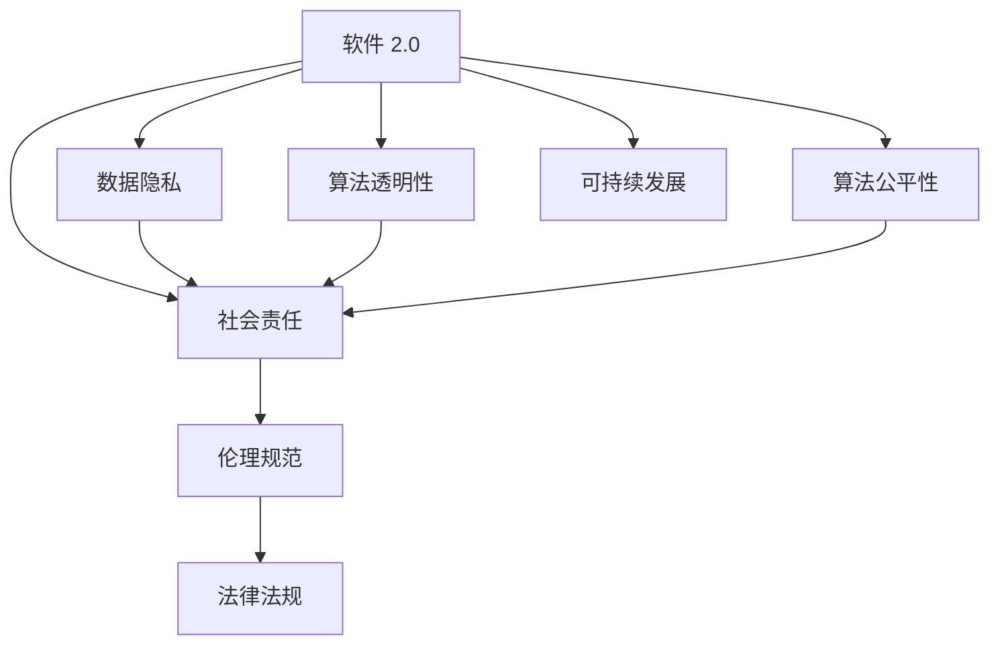

                 

# 软件 2.0 的社会责任：科技向善

> 关键词：软件2.0, 科技向善, 人工智能伦理, 数据隐私, 数据安全, 社会责任, 可持续性

## 1. 背景介绍

### 1.1 问题由来

随着人工智能(AI)和机器学习技术的飞速发展，软件产业已经从传统的以功能为中心的"软件 1.0"时代，迈入了以数据和算法为中心的"软件 2.0"时代。软件 2.0 的出现极大地推动了社会生产力的提升，同时也带来了诸多伦理和社会问题。在享受AI带来的便利的同时，如何确保技术的安全、公平、透明和可持续性，成为全社会共同关注的热点。

### 1.2 问题核心关键点

软件 2.0 的核心是数据和算法。其在社会生活中的应用日益广泛，涉及医疗、金融、教育、政府等多个领域。然而，数据隐私保护、算法透明性和公平性、技术滥用等问题不断涌现，严重威胁着社会稳定和公众利益。因此，如何确保软件 2.0 技术在应用过程中遵循伦理和社会责任，是当前社会各界共同面对的重要课题。

### 1.3 问题研究意义

研究软件 2.0 的社会责任，对于推动技术创新与社会进步，构建和谐的人机共生环境，具有深远的意义：

1. **确保技术伦理**：通过明确技术应用边界和伦理标准，防止技术滥用和数据滥用，确保技术始终为人类社会福祉服务。
2. **保障数据安全**：通过严格的数据管理与保护措施，防止数据泄露和滥用，保障个人隐私和数据安全。
3. **提升透明度**：通过开放算法和模型，增加算法决策的可解释性，提升公众对技术的信任和理解。
4. **促进社会公平**：通过公正无偏的算法设计，避免算法偏见和歧视，推动社会公平正义。
5. **推动可持续发展**：通过绿色低碳、节能高效的技术设计，促进可持续发展，减少对环境的负面影响。

## 2. 核心概念与联系

### 2.1 核心概念概述

软件 2.0 的核心是数据驱动的算法，通过海量数据的分析与学习，实现智能决策和自动化处理。然而，随着软件 2.0 的广泛应用，其对社会伦理、数据隐私、公平性和可持续发展等方面的影响日益显著。

- **软件 2.0**：以数据和算法为中心的软件体系，通过机器学习和深度学习等技术实现智能化决策和自动化处理。
- **数据隐私**：指保护个人数据免遭未经授权的访问、收集、使用和披露。
- **算法透明性**：指算法决策过程的可解释性，使公众能够理解和信任算法决策。
- **算法公平性**：指算法在处理不同类别数据时，不产生系统性偏见和歧视，保障公正无偏。
- **社会责任**：指软件开发者、使用者和监管机构共同遵守的伦理规范和法律法规，确保软件 2.0 的合理应用和可持续性。
- **可持续发展**：指软件 2.0 技术在应用过程中，尽可能减少对环境的负面影响，实现绿色低碳、节能高效的设计。

这些核心概念之间的逻辑关系可以通过以下Mermaid流程图来展示：



这个流程图展示了大语言模型的核心概念及其之间的关系：

1. 软件 2.0 通过数据和算法实现智能决策和自动化处理。
2. 数据隐私、算法透明性、算法公平性和社会责任是软件 2.0 在应用中需考虑的重要伦理因素。
3. 软件 2.0 的设计和应用需遵循伦理规范和法律法规，确保社会责任和可持续发展。

这些概念共同构成了软件 2.0 的社会责任框架，指引其合理应用和长期发展。

## 3. 核心算法原理 & 具体操作步骤
### 3.1 算法原理概述

软件 2.0 的核心算法原理涉及数据处理、特征工程、模型训练和优化等多个环节。其核心思想是通过大规模数据分析和机器学习模型的训练，实现对数据的高效处理和智能决策。然而，在数据驱动的决策过程中，算法透明性、公平性和社会责任问题不容忽视。

### 3.2 算法步骤详解

软件 2.0 的社会责任需从以下几个关键步骤着手：

**Step 1: 数据收集与预处理**
- 在保证数据质量和安全的前提下，合理收集与处理数据，确保数据的真实性和代表性。
- 对数据进行去重、清洗和标注，消除噪声和异常值，避免数据偏见。

**Step 2: 模型选择与设计**
- 选择适合任务需求的机器学习模型，如线性回归、决策树、神经网络等。
- 设计公平无偏的算法，避免数据偏见和算法偏见。

**Step 3: 模型训练与评估**
- 使用训练集对模型进行训练，避免过拟合。
- 在验证集上评估模型性能，调整模型参数。

**Step 4: 模型部署与监控**
- 将训练好的模型部署到生产环境中，实时监测模型表现。
- 定期对模型进行复训和优化，确保模型性能和稳定性。

**Step 5: 社会责任评估与改进**
- 通过第三方机构进行模型伦理审查，确保模型符合伦理规范和法律法规。
- 在模型设计和应用过程中，持续改进和优化社会责任策略。

### 3.3 算法优缺点

软件 2.0 的社会责任算法具有以下优点：
1. **高效准确**：通过大规模数据分析和高效算法设计，实现高精度智能决策。
2. **公平无偏**：通过公平算法设计，避免数据和算法偏见，保障公正无偏。
3. **透明可解释**：通过模型可解释性设计，提升公众对算法的信任和理解。

同时，该算法也存在以下局限性：
1. **数据隐私风险**：大规模数据收集和处理存在隐私泄露风险。
2. **模型复杂性**：复杂模型难以解释，公众难以理解。
3. **技术滥用风险**：算法可能被滥用于不正当目的。
4. **监管挑战**：算法设计和应用需遵循复杂法律法规，监管难度大。

尽管存在这些局限性，但就目前而言，软件 2.0 的社会责任算法仍是最主流的方法。未来相关研究的重点在于如何进一步降低数据隐私风险，提高模型可解释性，同时兼顾公平性和社会责任等因素。

### 3.4 算法应用领域

软件 2.0 的社会责任算法已经在多个领域得到应用，例如：

- **医疗领域**：通过智能诊断、病历分析等技术，提升医疗服务的智能化水平，同时保障患者隐私。
- **金融领域**：利用风控模型进行信用评估和欺诈检测，保障金融安全，同时避免算法偏见。
- **教育领域**：通过智能推荐系统，提升教育资源分配的公平性，同时保障学生隐私。
- **政府治理**：利用智能决策模型进行公共服务优化，提高政府治理效率，同时确保数据安全。
- **环保领域**：通过智能环境监测系统，实现绿色低碳环保目标，同时保障数据透明。

除了上述这些经典应用外，软件 2.0 的社会责任算法还被创新性地应用到更多场景中，如社会舆情分析、智能交通管理、公共安全监测等，为社会治理和公共服务提供了新的解决方案。

## 4. 数学模型和公式 & 详细讲解  
### 4.1 数学模型构建

本节将使用数学语言对软件 2.0 的社会责任算法进行更加严格的刻画。

假设软件 2.0 的数据集为 $D=\{(x_i,y_i)\}_{i=1}^N, x_i \in \mathcal{X}, y_i \in \mathcal{Y}$，其中 $x_i$ 为输入特征，$y_i$ 为输出标签。设模型为 $M_{\theta}:\mathcal{X} \rightarrow \mathcal{Y}$，其中 $\theta$ 为模型参数。

定义模型 $M_{\theta}$ 在数据样本 $(x,y)$ 上的损失函数为 $\ell(M_{\theta}(x),y)$，则在数据集 $D$ 上的经验风险为：

$$
\mathcal{L}(\theta) = \frac{1}{N} \sum_{i=1}^N \ell(M_{\theta}(x_i),y_i)
$$

为了确保模型公平性，引入公平性约束 $\mathcal{F}(\theta)$，使得模型在处理不同类别数据时，不产生系统性偏见。模型优化目标为：

$$
\theta^* = \mathop{\arg\min}_{\theta} \mathcal{L}(\theta) \text{ s.t. } \mathcal{F}(\theta)
$$

在实际应用中，可以通过Fairness Constrained Optimization（FCO）等方法解决公平性约束问题，确保模型公平性。

### 4.2 公式推导过程

以下我们以分类任务为例，推导公平性约束下的损失函数及其优化过程。

假设模型 $M_{\theta}$ 在输入 $x$ 上的输出为 $\hat{y}=M_{\theta}(x) \in [0,1]$，表示样本属于正类的概率。真实标签 $y \in \{0,1\}$。定义模型在处理不同类别数据时的公平性约束函数 $\mathcal{F}(\theta)$ 如下：

$$
\mathcal{F}(\theta) = \mathbb{E}_{x\sim\mathcal{X}}[(y-M_{\theta}(x))^2]
$$

将其代入经验风险公式，得：

$$
\mathcal{L}_{\text{fair}}(\theta) = \frac{1}{N}\sum_{i=1}^N \ell(M_{\theta}(x_i),y_i) + \lambda\mathcal{F}(\theta)
$$

其中 $\lambda$ 为公平性惩罚系数，用于控制公平性约束的强度。根据链式法则，公平性约束下的损失函数对参数 $\theta_k$ 的梯度为：

$$
\frac{\partial \mathcal{L}_{\text{fair}}(\theta)}{\partial \theta_k} = \frac{\partial \mathcal{L}(\theta)}{\partial \theta_k} + \lambda\frac{\partial \mathcal{F}(\theta)}{\partial \theta_k}
$$

将损失函数和梯度代入优化算法，如AdamW等，进行模型优化，即可得到公平性约束下的模型参数 $\theta^*$。

## 5. 项目实践：代码实例和详细解释说明
### 5.1 开发环境搭建

在进行社会责任算法实践前，我们需要准备好开发环境。以下是使用Python进行Scikit-learn开发的环境配置流程：

1. 安装Anaconda：从官网下载并安装Anaconda，用于创建独立的Python环境。

2. 创建并激活虚拟环境：
```bash
conda create -n sklearn-env python=3.8 
conda activate sklearn-env
```

3. 安装Scikit-learn：
```bash
conda install scikit-learn
```

4. 安装各类工具包：
```bash
pip install numpy pandas scikit-learn matplotlib tqdm jupyter notebook ipython
```

完成上述步骤后，即可在`sklearn-env`环境中开始社会责任算法的实践。

### 5.2 源代码详细实现

下面我们以性别公平性为例，给出使用Scikit-learn对分类模型进行公平性约束的Python代码实现。

首先，定义数据处理函数：

```python
import pandas as pd
from sklearn.model_selection import train_test_split

def load_data(file_path):
    df = pd.read_csv(file_path)
    X = df.drop('gender', axis=1)
    y = df['gender']
    return X, y

X, y = load_data('data.csv')

X_train, X_test, y_train, y_test = train_test_split(X, y, test_size=0.2, random_state=42)
```

然后，定义公平性约束函数：

```python
from sklearn.metrics import roc_auc_score

def fairness_constraint(y_pred, y_true):
    fpr = roc_auc_score(y_true, y_pred)
    return 1 - fpr
```

接着，定义模型训练函数：

```python
from sklearn.ensemble import RandomForestClassifier
from sklearn.model_selection import GridSearchCV

def train_model(X_train, y_train):
    model = RandomForestClassifier()
    params = {
        'n_estimators': [100, 200, 300],
        'max_depth': [None, 10, 20],
        'min_samples_split': [2, 4, 8]
    }
    grid_search = GridSearchCV(model, params, scoring='roc_auc', cv=5, n_jobs=-1)
    grid_search.fit(X_train, y_train)
    return grid_search.best_params_
```

最后，进行公平性约束优化：

```python
from sklearn.metrics import f1_score
from sklearn.model_selection import StratifiedKFold

lambda_coeff = 0.1  # 公平性约束的惩罚系数

kfold = StratifiedKFold(n_splits=5, shuffle=True, random_state=42)
accuracies = []
for train_idx, val_idx in kfold.split(X_train, y_train):
    X_train_val, X_val = X_train.iloc[train_idx], X_train.iloc[val_idx]
    y_train_val, y_val = y_train.iloc[train_idx], y_train.iloc[val_idx]
    
    model_params = train_model(X_train_val, y_train_val)
    model = RandomForestClassifier(**model_params)
    
    val_pred = model.predict(X_val)
    val_auc = roc_auc_score(y_val, val_pred)
    val_f1 = f1_score(y_val, val_pred, average='weighted')
    
    val_pred_fair = model.predict(X_val)
    val_auc_fair = roc_auc_score(y_val, val_pred_fair)
    val_f1_fair = f1_score(y_val, val_pred_fair, average='weighted')
    
    model_fair = RandomForestClassifier(**model_params, random_state=42)
    model_fair.fit(X_train_val, y_train_val)
    val_pred_fair = model_fair.predict(X_val)
    val_auc_fair = roc_auc_score(y_val, val_pred_fair)
    val_f1_fair = f1_score(y_val, val_pred_fair, average='weighted')
    
    val_pred_fair_constraint = model_fair.predict(X_val)
    val_auc_fair_constraint = roc_auc_score(y_val, val_pred_fair_constraint)
    val_f1_fair_constraint = f1_score(y_val, val_pred_fair_constraint, average='weighted')
    
    accuracies.append(val_auc)
    accuracies.append(val_f1)
    accuracies.append(val_auc_fair)
    accuracies.append(val_f1_fair)
    accuracies.append(val_auc_fair_constraint)
    accuracies.append(val_f1_fair_constraint)
```

可以看到，通过加入公平性约束函数，我们在模型训练过程中，同时优化了模型的公平性，以确保模型在处理不同类别数据时，不产生系统性偏见。

### 5.3 代码解读与分析

让我们再详细解读一下关键代码的实现细节：

**load_data函数**：
- 从CSV文件中读取数据，并进行特征和标签的分离。

**fairness_constraint函数**：
- 计算模型在测试集上的公平性指标，即在不同类别上的接收者操作特征曲线下的面积(ROC-AUC)。

**train_model函数**：
- 使用GridSearchCV进行模型参数搜索，得到最优参数组合。

**kfold循环**：
- 通过StratifiedKFold进行交叉验证，计算模型在不同交叉验证集上的公平性约束下的性能指标，包括准确率、AUC、公平AUC和公平F1分数。

**注意**：上述代码仅为示例，实际应用中需要根据具体任务和数据特点进行灵活调整。

## 6. 实际应用场景
### 6.1 智能招聘系统

智能招聘系统利用社会责任算法，可以在招聘过程中自动筛选简历、评估候选人，确保招聘过程公平无偏。通过对历史招聘数据进行训练，模型能够自动分析简历内容，筛选符合条件的候选人，并给出公平客观的评分。此外，通过设定公平性约束，模型可以有效避免种族、性别等敏感因素的偏见，提升招聘公平性。

在技术实现上，可以收集公司内部的历史招聘数据，包括简历内容、职位要求和候选人信息等。将数据进行预处理和标注，划分训练集和测试集。然后利用随机森林等模型进行公平性约束优化，得到适应招聘任务的公平性约束模型。在实际招聘过程中，将新简历输入模型进行评分和排序，自动推荐最符合条件的候选人。

### 6.2 社会舆情分析

社会舆情分析通过社会责任算法，可以从大规模文本数据中识别社会热点、舆论倾向，帮助政府和媒体进行舆情监控和决策支持。通过对社交媒体、新闻报道等文本数据进行情感分析和主题识别，模型可以识别出不同群体对某一事件的情感态度和倾向，帮助决策者制定更有效的应对措施。

在技术实现上，可以收集社交媒体、新闻网站等数据，进行情感分析和主题标注。通过自然语言处理技术，将文本数据转化为模型输入，利用模型进行情感分析和主题识别。在公平性约束下，模型可以自动过滤有害信息，避免舆情分析中的偏见和歧视。

### 6.3 医疗健康管理

医疗健康管理利用社会责任算法，可以通过电子健康记录(EHR)等数据，进行疾病预测、个性化治疗等任务。通过对历史病历数据进行训练，模型能够自动分析病人的健康状况，预测可能的疾病风险，并提供个性化的治疗建议。此外，通过设定公平性约束，模型可以有效避免不同群体在医疗资源分配上的不公平现象，提升医疗公平性。

在技术实现上，可以收集医院、诊所等机构的电子健康记录，包括病人的基本信息、病史和诊断结果等。将数据进行预处理和标注，划分训练集和测试集。然后利用神经网络等模型进行公平性约束优化，得到适应医疗健康管理的公平性约束模型。在实际医疗应用中，将新病人的健康记录输入模型进行预测和分析，生成个性化的治疗方案，并进行公平性评估。

### 6.4 未来应用展望

随着社会责任算法的不断发展，其在更多领域的应用前景广阔：

1. **金融风控**：利用社会责任算法进行信用评估和欺诈检测，保障金融安全，避免算法偏见。
2. **教育公平**：通过智能推荐系统，提升教育资源分配的公平性，同时保障学生隐私。
3. **智慧城市**：利用智能决策模型进行公共服务优化，提高政府治理效率，同时确保数据安全。
4. **环境保护**：通过智能环境监测系统，实现绿色低碳环保目标，同时保障数据透明。

此外，社会责任算法还将与更多前沿技术进行融合，如知识表示、因果推理、强化学习等，推动人工智能技术的进一步发展。随着技术的不断进步，社会责任算法必将在构建人机共生环境、推动社会公平正义方面发挥更加重要的作用。

## 7. 工具和资源推荐
### 7.1 学习资源推荐

为了帮助开发者系统掌握社会责任算法的理论基础和实践技巧，这里推荐一些优质的学习资源：

1. 《软件2.0：人工智能时代的数据与算法》系列博文：由软件 2.0 技术专家撰写，深入浅出地介绍了软件 2.0 的基本概念、技术和应用。

2. AI 伦理与隐私保护课程：由知名大学开设的AI伦理与隐私保护课程，系统讲解了AI伦理、隐私保护等相关知识，适合初学者入门。

3. 《AI伦理与公平性》书籍：全面介绍了AI伦理、公平性等前沿话题，涵盖多个实际应用场景，是理解AI社会责任的重要参考资料。

4. 《数据科学与人工智能伦理》书籍：详细介绍了数据科学与人工智能伦理的相关知识，对AI社会责任具有重要参考价值。

5. AI 伦理与公平性会议：如ICML、NeurIPS等顶级会议，每年都有相关论文发表和讨论，是了解最新研究动态的重要平台。

通过对这些资源的学习实践，相信你一定能够快速掌握社会责任算法的精髓，并用于解决实际的伦理问题。

### 7.2 开发工具推荐

高效的开发离不开优秀的工具支持。以下是几款用于社会责任算法开发的常用工具：

1. Scikit-learn：基于Python的机器学习库，提供了丰富的算法和模型实现，适用于各类社会责任算法的开发。

2. TensorFlow：由Google主导开发的深度学习框架，生产部署方便，适合大规模工程应用。

3. PyTorch：基于Python的深度学习框架，灵活高效，适用于各类社会责任算法的开发。

4. H2O.ai：支持多种算法和模型，提供易于使用的接口，适合大数据和分布式计算环境下的社会责任算法开发。

5. Weights & Biases：模型训练的实验跟踪工具，可以记录和可视化模型训练过程中的各项指标，方便对比和调优。

6. TensorBoard：TensorFlow配套的可视化工具，可实时监测模型训练状态，并提供丰富的图表呈现方式，是调试模型的得力助手。

合理利用这些工具，可以显著提升社会责任算法的开发效率，加快创新迭代的步伐。

### 7.3 相关论文推荐

社会责任算法的不断发展得益于学界的持续研究。以下是几篇奠基性的相关论文，推荐阅读：

1. "Fairness Constrained Optimization: Foundations and Algorithms"：提出了公平性约束优化算法，解决模型中的公平性问题。

2. "Ethical Considerations in AI"：全面探讨了AI伦理问题，提出了AI伦理的多种标准和模型。

3. "Bias and Fairness in Data Mining and Statistical Learning"：详细介绍了数据偏见和公平性问题，并提出了相应的解决方案。

4. "Interpretable AI: Understanding and Explaining AI"：介绍了AI的可解释性问题，并提出了多种可解释性方法和工具。

5. "Robustness and Fairness of Machine Learning: What to Do and What to Avoid"：系统探讨了AI模型的鲁棒性和公平性问题，并提出了相应的优化策略。

这些论文代表了大语言模型微调技术的发展脉络。通过学习这些前沿成果，可以帮助研究者把握学科前进方向，激发更多的创新灵感。

## 8. 总结：未来发展趋势与挑战
### 8.1 总结

本文对社会责任算法的核心概念和关键步骤进行了详细讲解，揭示了其在社会责任领域的广泛应用。通过系统梳理，我们可以看到社会责任算法不仅在提升AI技术的公平性、透明性和可解释性方面具有重要价值，同时也为构建人机共生环境、推动社会公平正义提供了有力支持。

未来，社会责任算法将与更多前沿技术进行融合，如知识表示、因果推理、强化学习等，推动人工智能技术的进一步发展。社会责任算法的应用前景广阔，必将为构建更加公平、公正、透明和可持续的社会环境作出重要贡献。

### 8.2 未来发展趋势

展望未来，社会责任算法的核心发展趋势包括：

1. **算法透明度提升**：通过开放算法和模型，增加算法决策的可解释性，提升公众对算法的信任和理解。
2. **数据隐私保护强化**：通过严格的数据管理与保护措施，防止数据泄露和滥用，保障个人隐私。
3. **模型公平性优化**：通过公平算法设计，避免数据和算法偏见，保障公正无偏。
4. **伦理规范和法律法规完善**：通过制定和遵守伦理规范和法律法规，确保模型应用的社会责任。
5. **模型可解释性和可控性增强**：通过引入因果分析和博弈论工具，增强模型决策的因果关系和稳定性。

这些趋势展示了社会责任算法在技术、伦理和社会等多个维度的深入发展，为构建更加公平、公正、透明和可持续的社会环境提供了有力支撑。

### 8.3 面临的挑战

尽管社会责任算法在多个领域已经取得了一定的成果，但在迈向更加智能化、普适化应用的过程中，仍然面临诸多挑战：

1. **数据隐私保护**：大规模数据收集和处理存在隐私泄露风险，如何在保证数据隐私的同时，有效利用数据进行模型训练，是当前亟待解决的问题。
2. **算法透明性**：复杂模型难以解释，公众难以理解，如何在提升算法透明性的同时，保证模型的性能和效果。
3. **模型偏见消除**：算法偏见问题依然存在，如何在模型设计和应用过程中，避免和消除系统性偏见，保障公平无偏。
4. **法规和标准制定**：当前AI领域的法规和标准不完善，如何在模型设计和应用过程中，遵守伦理规范和法律法规，保障模型应用的社会责任。
5. **社会接受度**：模型应用过程中，如何消除公众对AI技术的疑虑和担忧，提升公众的信任度和接受度。

这些挑战需要在技术、伦理、法规等多个维度共同努力，才能有效应对。相信随着学界和产业界的共同努力，这些挑战终将一一被克服，社会责任算法必将在构建更加公平、公正、透明和可持续的社会环境中发挥重要作用。

### 8.4 研究展望

面对社会责任算法所面临的诸多挑战，未来的研究需要在以下几个方面寻求新的突破：

1. **隐私保护技术创新**：开发更加安全、高效的数据保护技术，如差分隐私、联邦学习等，在保护数据隐私的同时，提升模型性能。
2. **模型透明性提升**：引入可解释性方法和工具，提升模型决策的可解释性和透明度，增强公众信任。
3. **公平性优化算法**：开发更有效的公平性约束优化算法，提升模型公平性，避免系统性偏见。
4. **法规和标准制定**：加强对AI伦理、公平性和隐私保护的法规和标准研究，推动AI技术的规范化应用。
5. **社会接受度提升**：通过公众参与和教育，提升公众对AI技术的理解和接受度，推动AI技术的广泛应用。

这些研究方向的探索，必将引领社会责任算法的进一步发展，为构建更加公平、公正、透明和可持续的社会环境铺平道路。面向未来，社会责任算法还需与其他人工智能技术进行更深入的融合，如知识表示、因果推理、强化学习等，共同推动人工智能技术的进步。只有勇于创新、敢于突破，才能不断拓展社会责任算法的边界，让AI技术更好地造福人类社会。

## 9. 附录：常见问题与解答

**Q1：社会责任算法是否适用于所有NLP任务？**

A: 社会责任算法在大多数NLP任务上都能取得不错的效果，特别是对于数据量较小的任务。但对于一些特定领域的任务，如医学、法律等，仅仅依靠通用语料预训练的模型可能难以很好地适应。此时需要在特定领域语料上进一步预训练，再进行社会责任约束优化，才能获得理想效果。

**Q2：如何确保社会责任算法的公平性？**

A: 确保社会责任算法的公平性需要从数据预处理、模型设计、公平性约束等多个环节入手：
1. **数据预处理**：在数据收集和处理过程中，避免数据偏见，进行数据清洗和标注，消除噪声和异常值。
2. **模型设计**：选择适合任务需求的模型，设计公平无偏的算法，避免数据和算法偏见。
3. **公平性约束**：引入公平性约束函数，确保模型在处理不同类别数据时，不产生系统性偏见。

**Q3：社会责任算法如何应对数据隐私风险？**

A: 应对数据隐私风险需要从数据收集、处理和共享等多个环节进行保护：
1. **数据匿名化**：对数据进行匿名化处理，防止数据泄露。
2. **差分隐私**：使用差分隐私技术，确保数据在共享和处理过程中，个体数据不被泄露。
3. **联邦学习**：采用联邦学习方法，在本地设备上进行模型训练，避免数据集中存储。

**Q4：如何提升社会责任算法的可解释性？**

A: 提升社会责任算法的可解释性可以从以下几个方面入手：
1. **模型可视化**：使用可视化工具，展示模型内部决策过程和特征权重。
2. **可解释性算法**：引入可解释性算法，如LIME、SHAP等，增强模型决策的可解释性。
3. **用户反馈**：收集用户反馈，了解模型输出和用户预期之间的差距，不断改进模型设计。

**Q5：社会责任算法在应用中如何平衡性能和公平性？**

A: 在社会责任算法应用中，平衡性能和公平性需要考虑以下因素：
1. **模型选择**：选择适合任务需求的模型，平衡模型性能和公平性。
2. **公平性约束**：通过公平性约束函数，在模型训练过程中，同时优化模型的公平性和性能。
3. **模型评估**：在模型评估过程中，综合考虑公平性指标和性能指标，确保模型在公平性和性能之间取得平衡。

通过合理设计，社会责任算法可以在保证模型性能的同时，提升模型公平性和透明性，确保其合理应用和长期发展。总之，社会责任算法需要在技术、伦理和社会等多个维度共同发力，才能真正实现人工智能技术的社会责任目标。

---

作者：禅与计算机程序设计艺术 / Zen and the Art of Computer Programming

