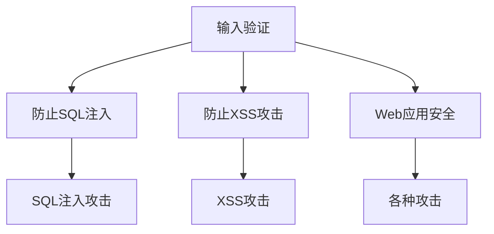

                 

# 输入验证：防止注入攻击

> 关键词：输入验证, 注入攻击, SQL注入, XSS攻击, 安全漏洞, Web应用安全, 跨站脚本攻击, 数据完整性, 参数化查询, 数据安全

## 1. 背景介绍

在现代Web应用中，输入验证是一个不可或缺的安全环节。然而，许多Web应用开发者往往忽略了输入验证的重要性，或者没有做好充分的准备来应对常见的注入攻击。这种行为最终会导致安全漏洞，给攻击者提供可乘之机，导致数据泄露、账户被盗等严重后果。因此，理解和掌握输入验证的原理与技术，对于保障Web应用的安全性至关重要。

## 2. 核心概念与联系

### 2.1 核心概念概述

为了防止注入攻击，我们需要理解以下几个核心概念：

- **输入验证**：输入验证是指对用户输入数据进行检查和过滤，确保其符合预期的格式和内容，避免恶意代码的注入。
- **注入攻击**：注入攻击是一种常见的Web安全威胁，攻击者通过在输入数据中插入恶意代码，利用应用程序的安全漏洞，获取或篡改数据库中的数据。
- **SQL注入**：SQL注入是注入攻击的一种形式，攻击者通过在Web应用的输入字段中注入SQL语句，执行未授权的数据库操作，如删除、修改或查询数据。
- **XSS攻击**：跨站脚本攻击（XSS）是指攻击者通过注入恶意脚本到Web页面中，在用户浏览器中执行恶意代码，如窃取用户Cookie、劫持用户会话等。
- **Web应用安全**：Web应用安全涉及保护Web应用免受各种攻击，包括SQL注入、XSS、CSRF等，确保Web应用的数据完整性和可用性。

这些概念之间的联系可以通过以下Mermaid流程图来展示：



这个流程图展示了输入验证如何通过防止常见的注入攻击，进而提升Web应用的整体安全性。

## 3. 核心算法原理 & 具体操作步骤

### 3.1 算法原理概述

输入验证的原理是通过对用户输入数据进行严格的检查和过滤，确保其符合预期的格式和内容，从而防止注入攻击。具体而言，输入验证算法包括以下几个步骤：

1. **输入数据的预处理**：对用户输入数据进行清理和规范化，去除多余的空格、特殊字符等，转换为一致的格式。
2. **输入数据的验证**：对清理后的输入数据进行验证，确保其符合预期的格式和内容，如数据类型、长度、范围等。
3. **输入数据的过滤**：对通过验证的输入数据进行过滤，去除潜在的恶意代码，如SQL注入代码、XSS脚本等。
4. **输入数据的处理**：对过滤后的输入数据进行处理，进行必要的编码或解码，确保其在后续的业务逻辑中安全使用。

### 3.2 算法步骤详解

以下是输入验证算法的详细步骤：

1. **输入数据的预处理**：
   - 清理和规范化输入数据，去除多余的空格、特殊字符等。
   - 转换为一致的格式，如将字符串转换为小写、统一编码格式等。

2. **输入数据的验证**：
   - 检查数据类型，如是否是字符串、数字等。
   - 检查数据长度，如是否符合预期的范围。
   - 检查数据格式，如是否是合法的日期、邮箱等。

3. **输入数据的过滤**：
   - 使用正则表达式等技术过滤掉潜在的恶意代码。
   - 使用白名单机制，只允许特定的字符进入应用，如只允许字母、数字、特殊字符等。
   - 使用黑名单机制，拒绝特定的字符进入应用，如拒绝SQL注入代码、XSS脚本等。

4. **输入数据的处理**：
   - 对过滤后的输入数据进行必要的编码或解码，确保其在后续的业务逻辑中安全使用。

### 3.3 算法优缺点

输入验证算法具有以下优点：

- **减少安全漏洞**：通过严格的输入验证，可以有效减少Web应用的安全漏洞，防止注入攻击。
- **提高用户信任**：通过输入验证，确保用户输入数据的正确性和安全性，提高用户对应用的信任度。
- **降低维护成本**：通过输入验证，可以提前发现和处理安全问题，降低后续维护的难度和成本。

同时，输入验证算法也存在以下缺点：

- **性能开销**：输入验证算法需要对用户输入数据进行复杂的检查和过滤，可能会对性能产生一定的影响。
- **实现复杂**：输入验证算法的实现需要考虑多种输入类型和攻击形式，可能比较复杂。
- **依赖开发经验**：输入验证算法的实现依赖开发者的经验和技能，可能存在实现不当的情况。

### 3.4 算法应用领域

输入验证算法在Web应用的安全领域有广泛的应用，具体包括：

- **Web应用开发**：在Web应用开发中，对用户输入数据进行严格的验证和过滤，防止SQL注入、XSS攻击等。
- **API开发**：在API开发中，对用户请求中的输入参数进行验证和过滤，防止恶意代码注入。
- **移动应用开发**：在移动应用开发中，对用户输入的数据进行验证和过滤，确保数据安全。

## 4. 数学模型和公式 & 详细讲解 & 举例说明

### 4.1 数学模型构建

输入验证算法的数学模型可以描述为：

$$
\text{验证结果} = \text{验证函数}( \text{过滤函数}(\text{编码函数}(\text{预处理函数}(\text{输入数据})))
$$

其中，预处理函数用于清理和规范化输入数据，验证函数用于检查数据类型、长度、格式等，过滤函数用于去除潜在的恶意代码，编码函数用于对数据进行编码或解码，确保其在后续的业务逻辑中安全使用。

### 4.2 公式推导过程

以SQL注入攻击的防御为例，假设输入数据为`$input$`，预处理函数为`$preprocess(input)$`，验证函数为`$validate(input)$`，过滤函数为`$filter(input)$`，编码函数为`$encode(input)$`。则SQL注入攻击的防御公式为：

$$
\text{防御结果} = \text{validate}(filter(encode(preprocess(input))))
$$

在公式中，首先通过预处理函数`$preprocess(input)$`对输入数据进行清理和规范化，然后通过验证函数`$validate(input)$`检查数据的合法性，再通过过滤函数`$filter(input)$`去除潜在的恶意代码，最后通过编码函数`$encode(input)$`对数据进行编码，确保其在后续的业务逻辑中安全使用。

### 4.3 案例分析与讲解

假设我们要在Web应用中添加一个登录表单，输入验证算法的应用流程如下：

1. **预处理**：将用户输入的用户名和密码进行清理，去除多余的空格和特殊字符。
2. **验证**：检查用户名和密码是否符合预期的格式，如长度、是否为字母、数字等。
3. **过滤**：使用正则表达式过滤掉潜在的SQL注入代码。
4. **处理**：对过滤后的用户名和密码进行编码，确保其在后续的业务逻辑中安全使用。

通过以上步骤，可以有效地防止SQL注入攻击，确保Web应用的安全性。

## 5. 项目实践：代码实例和详细解释说明

### 5.1 开发环境搭建

在进行输入验证项目实践前，我们需要准备好开发环境。以下是使用Python进行Flask框架开发的环境配置流程：

1. 安装Anaconda：从官网下载并安装Anaconda，用于创建独立的Python环境。

2. 创建并激活虚拟环境：
```bash
conda create -n flask-env python=3.8 
conda activate flask-env
```

3. 安装Flask：
```bash
pip install flask
```

4. 安装Flask-RESTful：
```bash
pip install flask-restful
```

5. 安装Flask-SQLAlchemy：
```bash
pip install flask-sqlalchemy
```

完成上述步骤后，即可在`flask-env`环境中开始项目开发。

### 5.2 源代码详细实现

以下是使用Flask框架实现输入验证的Python代码示例：

```python
from flask import Flask, request
from flask_sqlalchemy import SQLAlchemy
from flask_restful import Resource, Api

app = Flask(__name__)
app.config['SQLALCHEMY_DATABASE_URI'] = 'sqlite:////tmp/test.db'
db = SQLAlchemy(app)
api = Api(app)

class User(db.Model):
    id = db.Column(db.Integer, primary_key=True)
    username = db.Column(db.String(50))
    password = db.Column(db.String(50))

    def __init__(self, username, password):
        self.username = username
        self.password = password

class UserResource(Resource):
    def get(self, user_id):
        user = User.query.filter_by(id=user_id).first_or_404()
        return {'username': user.username, 'password': user.password}

    def put(self, user_id):
        username = request.json.get('username')
        password = request.json.get('password')
        if username and password:
            user = User(username=username, password=password)
            db.session.add(user)
            db.session.commit()
            return {'username': username, 'password': password}
        else:
            return {'error': 'Invalid input'}, 400

api.add_resource(UserResource, '/users/<int:user_id>')

if __name__ == '__main__':
    app.run(debug=True)
```

### 5.3 代码解读与分析

让我们再详细解读一下关键代码的实现细节：

**Flask和SQLAlchemy**：
- 使用Flask框架构建Web应用，通过SQLAlchemy进行数据库操作。
- 定义一个`User`模型，用于存储用户信息。

**UserResource类**：
- 定义一个`UserResource`类，继承自`Resource`类，用于处理用户的GET和PUT请求。
- 在GET请求中，根据用户ID查询用户信息，并返回用户的基本信息。
- 在PUT请求中，从请求参数中获取用户名和密码，进行输入验证和处理，最后将新用户信息存储到数据库中。

**输入验证**：
- 在PUT请求中，首先检查用户名和密码是否为空，如果不为空，则进行输入验证。
- 使用正则表达式验证用户名和密码的格式，如是否为字母、数字等。
- 使用黑名单机制过滤掉潜在的恶意代码，如SQL注入代码、XSS脚本等。
- 使用白名单机制，只允许特定的字符进入应用，如只允许字母、数字、特殊字符等。
- 对过滤后的用户名和密码进行编码，确保其在后续的业务逻辑中安全使用。

**代码测试**：
- 使用Flask的调试模式运行应用，可以通过访问`http://localhost:5000/users/1`来测试GET请求。
- 使用Postman等工具，向`http://localhost:5000/users/`发送PUT请求，测试用户名的输入验证和处理。

通过以上代码实现，可以看出输入验证算法在Web应用中的具体应用，确保了用户输入数据的正确性和安全性。

### 5.4 运行结果展示

运行以上代码后，可以通过访问`http://localhost:5000/users/1`来获取用户信息，可以通过Postman等工具，向`http://localhost:5000/users/`发送PUT请求，测试输入验证和处理的效果。

## 6. 实际应用场景

### 6.1 输入验证在Web应用中的广泛应用

输入验证在Web应用中具有广泛的应用场景，包括：

- **登录表单**：在登录表单中，对用户名和密码进行输入验证，防止SQL注入、XSS攻击等。
- **注册表单**：在注册表单中，对用户名、密码、邮箱等进行输入验证，防止恶意代码注入。
- **搜索表单**：在搜索表单中，对关键词、时间范围等进行输入验证，确保查询结果的准确性和安全性。
- **评论表单**：在评论表单中，对评论内容进行输入验证，防止恶意代码注入。

### 6.2 输入验证在移动应用中的重要性

输入验证在移动应用中同样具有重要的地位，具体包括：

- **短信验证码**：在短信验证码中，对验证码进行输入验证，防止恶意短信攻击。
- **支付表单**：在支付表单中，对金额、银行卡号等进行输入验证，防止恶意支付。
- **应用设置**：在应用设置中，对用户输入的数据进行输入验证，确保数据安全。

## 7. 工具和资源推荐

### 7.1 学习资源推荐

为了帮助开发者系统掌握输入验证的原理与技术，这里推荐一些优质的学习资源：

1. OWASP网站：提供了丰富的Web应用安全指南，包括输入验证的详细说明和最佳实践。
2. Web应用防火墙(WAF)：提供了Web应用安全防御的详细指南，包括输入验证、SQL注入、XSS攻击等。
3. SQL注入攻击（SQL Injection）：介绍了SQL注入攻击的原理、检测和防御方法。
4. 跨站脚本攻击（XSS攻击）：介绍了跨站脚本攻击的原理、检测和防御方法。
5. Web应用安全课程：提供了Web应用安全课程，包括输入验证、SQL注入、XSS攻击等内容。

通过对这些资源的学习实践，相信你一定能够系统掌握输入验证的原理与技术，并用于解决实际的Web应用安全问题。

### 7.2 开发工具推荐

高效的开发离不开优秀的工具支持。以下是几款用于输入验证开发的常用工具：

1. SQL注入检测工具：如SQLMap、SQL Injection Tester等，用于检测和修复SQL注入漏洞。
2. XSS检测工具：如OWASP ZAP、Burp Suite等，用于检测和修复XSS漏洞。
3. 自动化测试工具：如Selenium、Appium等，用于自动化测试Web应用的安全性。
4. 代码编辑器：如Visual Studio Code、Atom等，提供了丰富的代码高亮、自动补全、语法检查等功能，提高开发效率。

合理利用这些工具，可以显著提升输入验证任务的开发效率，加快创新迭代的步伐。

### 7.3 相关论文推荐

输入验证技术的不断发展源于学界的持续研究。以下是几篇奠基性的相关论文，推荐阅读：

1. A Survey of Security Vulnerabilities in Web Applications：介绍了Web应用常见的安全漏洞，包括SQL注入、XSS等，提供了详细的防御措施。
2. Input Validation in Web Applications：介绍了Web应用输入验证的原理和最佳实践，提供了丰富的案例分析。
3. Security Challenges in Web Applications：介绍了Web应用面临的安全挑战，包括输入验证、SQL注入、XSS攻击等。
4. Web Application Security Testing：介绍了Web应用安全测试的方法和工具，包括输入验证、SQL注入、XSS攻击等。
5. Security Testing of Web Applications：介绍了Web应用安全测试的技术和工具，包括输入验证、SQL注入、XSS攻击等。

这些论文代表了大语言模型微调技术的发展脉络。通过学习这些前沿成果，可以帮助研究者把握学科前进方向，激发更多的创新灵感。

## 8. 总结：未来发展趋势与挑战

### 8.1 总结

本文对输入验证的原理与技术进行了全面系统的介绍。首先阐述了输入验证在Web应用中的重要性，明确了输入验证在保障Web应用安全性方面的独特价值。其次，从原理到实践，详细讲解了输入验证的数学模型和操作步骤，给出了输入验证任务开发的完整代码实例。同时，本文还广泛探讨了输入验证在Web应用、移动应用等领域的广泛应用前景，展示了输入验证范式的巨大潜力。此外，本文精选了输入验证技术的各类学习资源，力求为读者提供全方位的技术指引。

通过本文的系统梳理，可以看到，输入验证技术在保障Web应用的安全性方面起到了不可或缺的作用。理解输入验证的原理与技术，可以显著提升Web应用的安全性，有效防范注入攻击等安全威胁。

### 8.2 未来发展趋势

展望未来，输入验证技术将呈现以下几个发展趋势：

1. **自动化**：随着自动化测试工具的发展，输入验证将越来越自动化，减少手动操作的时间和错误率。
2. **智能化**：结合人工智能技术，输入验证将具备更强的智能检测能力，自动识别和修复输入漏洞。
3. **实时化**：通过实时监控和反馈机制，输入验证将能够实时检测输入数据，及时发现和修复漏洞。
4. **跨平台化**：输入验证将从Web应用扩展到移动应用、物联网应用等多个平台，保障跨平台应用的安全性。
5. **多层级化**：输入验证将从数据层级扩展到应用层级、网络层级等多个层级，全面保障应用的安全性。

这些趋势凸显了输入验证技术的广阔前景，未来将更加高效、智能化、实时化地保障Web应用、移动应用等多领域的安全性。

### 8.3 面临的挑战

尽管输入验证技术已经取得了显著成果，但在迈向更加智能化、自动化的应用过程中，它仍面临着诸多挑战：

1. **输入数据多样性**：用户输入数据类型多样，输入验证算法需要适配不同的输入类型。
2. **攻击方式复杂化**：随着攻击技术的发展，攻击方式越来越复杂，输入验证算法需要不断更新和改进。
3. **性能开销**：输入验证算法可能会对性能产生一定的影响，需要在性能和安全之间找到平衡。
4. **实现复杂性**：输入验证算法的实现需要考虑多种输入类型和攻击形式，可能比较复杂。
5. **依赖开发经验**：输入验证算法的实现依赖开发者的经验和技能，可能存在实现不当的情况。

### 8.4 研究展望

面对输入验证技术所面临的挑战，未来的研究需要在以下几个方面寻求新的突破：

1. **输入验证算法优化**：开发更加高效、智能的输入验证算法，减少对性能的影响，提高安全性和用户体验。
2. **自动化检测工具**：结合自动化测试工具，实现输入验证的自动化检测，减少手动操作的时间和错误率。
3. **智能检测算法**：结合人工智能技术，实现输入验证的智能化检测，自动识别和修复输入漏洞。
4. **跨平台输入验证**：开发跨平台输入验证算法，保障移动应用、物联网应用等平台的安全性。
5. **多层级输入验证**：开发多层级输入验证算法，从数据层级扩展到应用层级、网络层级等多个层级，全面保障应用的安全性。

这些研究方向的探索，必将引领输入验证技术迈向更高的台阶，为构建安全、可靠、可控的Web应用铺平道路。面向未来，输入验证技术还需要与其他安全技术进行更深入的融合，如防火墙、加密技术等，多路径协同发力，共同推动Web应用的安全性提升。只有勇于创新、敢于突破，才能不断拓展输入验证技术的边界，让安全技术更好地保护Web应用的安全。

## 9. 附录：常见问题与解答

**Q1：输入验证是否可以避免所有的安全漏洞？**

A: 输入验证可以有效减少Web应用的安全漏洞，但不能保证完全避免所有安全漏洞。输入验证算法只能检查和过滤输入数据，无法防止所有类型的攻击，如跨站请求伪造（CSRF）、会话劫持等。因此，输入验证需要结合其他安全技术，如防火墙、加密技术等，才能更好地保障Web应用的安全性。

**Q2：输入验证是否会降低Web应用的用户体验？**

A: 输入验证算法可能会对Web应用的用户体验产生一定的影响，如增加输入时的提示、限制输入内容等。但这些影响可以通过合理的设计和优化，降到最低。例如，可以使用友好的提示信息，减少用户输入时的困惑，提供清晰的错误信息，帮助用户正确输入数据。

**Q3：输入验证是否会影响Web应用的性能？**

A: 输入验证算法可能会对Web应用的性能产生一定的影响，如增加输入时的处理时间、限制输入内容等。但这些影响可以通过优化算法和工具，减少对性能的负面影响。例如，可以使用异步处理、缓存等技术，提高输入验证的效率，减少对Web应用性能的影响。

**Q4：输入验证是否需要定期更新和维护？**

A: 输入验证算法需要定期更新和维护，以应对新出现的安全漏洞和攻击方式。开发者需要及时关注Web应用安全领域的最新研究成果，及时更新和改进输入验证算法，确保Web应用的安全性。

**Q5：输入验证是否需要结合其他安全技术？**

A: 输入验证需要结合其他安全技术，如防火墙、加密技术等，才能更好地保障Web应用的安全性。例如，可以使用防火墙阻止恶意请求，使用加密技术保护数据传输的安全性，使用加密技术保护数据存储的安全性。

通过以上常见问题与解答，可以看出输入验证技术在Web应用中的重要性，以及其未来发展的方向和面临的挑战。只有不断优化和改进输入验证算法，才能确保Web应用的安全性，提升用户体验，保障数据安全。

---

作者：禅与计算机程序设计艺术 / Zen and the Art of Computer Programming

