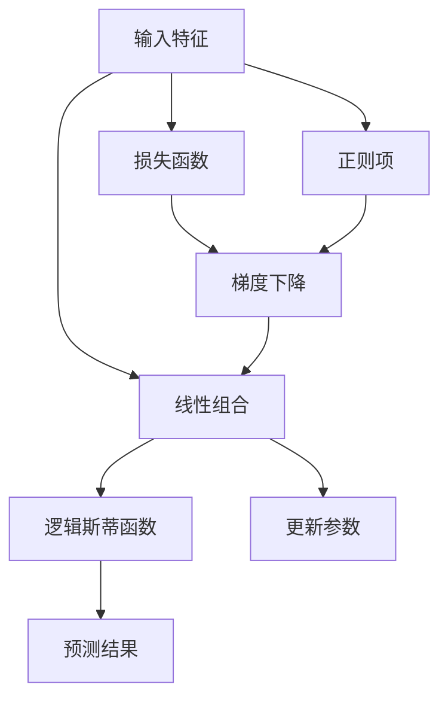

                 

## 1. 背景介绍

逻辑回归（Logistic Regression）是一种广泛应用于机器学习和统计学领域的分类算法。它通过将线性回归模型应用于逻辑斯蒂函数（Logistic Function），从而实现对二分类问题的建模和预测。逻辑回归的原理简单、实现容易，因此在数据科学和机器学习领域得到了广泛的应用。

## 2. 核心概念与联系

### 2.1 核心概念概述

为了更好地理解逻辑回归，我们先简要介绍一下相关的核心概念：

- **逻辑回归**：一种广义线性模型，常用于二分类问题的建模和预测。
- **逻辑斯蒂函数（Sigmoid Function）**：一种S型函数，将线性组合的输出映射到[0,1]的范围内。
- **梯度下降**：一种优化算法，通过负梯度方向迭代优化模型参数。
- **损失函数（Loss Function）**：用于衡量模型预测与真实标签之间的差异。
- **过拟合**：模型在训练集上表现良好，但在测试集上表现较差的现象。
- **正则化**：通过在损失函数中加入正则项，限制模型参数的大小，防止过拟合。

### 2.2 核心概念原理和架构的 Mermaid 流程图

以下是逻辑回归的核心概念原理和架构的 Mermaid 流程图：



该流程图展示了逻辑回归的基本流程：

1. 输入特征 $x$ 经过线性组合得到 $y = \theta^T x$。
2. 将 $y$ 经过逻辑斯蒂函数 $S(y) = \frac{1}{1+e^{-y}}$ 映射到[0,1]。
3. 通过预测结果 $S(y)$ 和真实标签 $y$ 的差异计算损失函数。
4. 在损失函数的基础上，加上正则项，形成总损失函数。
5. 使用梯度下降算法最小化总损失函数，更新模型参数。

## 3. 核心算法原理 & 具体操作步骤

### 3.1 算法原理概述

逻辑回归的算法原理基于最大似然估计（Maximum Likelihood Estimation），通过最大化训练数据的似然函数，优化模型参数 $\theta$。

假设训练数据集为 $D=\{(x_i,y_i)\}_{i=1}^N$，其中 $x_i$ 是特征向量，$y_i \in \{0,1\}$ 是二分类标签。逻辑回归的目标是找到一个线性函数 $h_\theta(x)=\theta^T x$，使得 $y_i$ 的概率最大化，即：

$$
\max_{\theta} \prod_{i=1}^N P(y_i|\theta) = \max_{\theta} \prod_{i=1}^N S(y_i \theta^T x_i)^{y_i}(1-S(y_i \theta^T x_i))^{1-y_i}
$$

利用对数函数将概率最大化问题转换为损失函数最小化问题，可以得到：

$$
\max_{\theta} \sum_{i=1}^N \log P(y_i|\theta) = \min_{\theta} -\sum_{i=1}^N y_i \log S(y_i \theta^T x_i) + (1-y_i)\log(1-S(y_i \theta^T x_i))
$$

通过简化，可以得到损失函数：

$$
\mathcal{L}(\theta) = -\frac{1}{N} \sum_{i=1}^N [y_i \log S(y_i \theta^T x_i) + (1-y_i) \log (1-S(y_i \theta^T x_i))]
$$

其中 $S(z) = \frac{1}{1+e^{-z}}$ 是逻辑斯蒂函数。

### 3.2 算法步骤详解

逻辑回归的算法步骤如下：

**Step 1: 初始化模型参数**
- 随机初始化模型参数 $\theta$。

**Step 2: 计算损失函数**
- 对训练集 $D$ 的每个样本 $(x_i,y_i)$，计算损失函数的值 $\mathcal{L}_i(\theta) = -y_i \log S(y_i \theta^T x_i) - (1-y_i)\log (1-S(y_i \theta^T x_i))$。

**Step 3: 计算梯度**
- 计算损失函数关于 $\theta$ 的梯度 $\frac{\partial \mathcal{L}}{\partial \theta} = -\frac{1}{N} \sum_{i=1}^N [y_i (x_i S(y_i \theta^T x_i) - (1-y_i)(1-S(y_i \theta^T x_i))] x_i$。

**Step 4: 梯度下降更新**
- 使用梯度下降算法更新模型参数：
$$
\theta \leftarrow \theta - \alpha \frac{\partial \mathcal{L}}{\partial \theta}
$$
其中 $\alpha$ 是学习率。

**Step 5: 重复迭代**
- 重复 Step 2 到 Step 4，直至模型收敛或达到预设迭代次数。

### 3.3 算法优缺点

**优点**：
- 算法实现简单，易于理解和调试。
- 适用于大规模数据集，收敛速度较快。
- 可以处理多分类问题，通过引入正则项可以防止过拟合。

**缺点**：
- 线性模型假设数据线性可分，对于非线性问题效果不佳。
- 对异常值和噪声敏感，可能导致模型泛化性能下降。
- 无法直接处理缺失数据和异常值，需要进行预处理。

### 3.4 算法应用领域

逻辑回归在多个领域都有广泛的应用，例如：

- 金融风险评估：通过分析客户的信用记录，预测其违约概率。
- 医学诊断：通过分析病历记录，预测患者是否患有某种疾病。
- 文本分类：通过分析文本内容，分类文本所属类别。
- 垃圾邮件过滤：通过分析邮件内容，判断是否为垃圾邮件。
- 推荐系统：通过分析用户行为数据，预测用户是否会点击某条广告或购买某件商品。

## 4. 数学模型和公式 & 详细讲解 & 举例说明

### 4.1 数学模型构建

假设训练数据集为 $D=\{(x_i,y_i)\}_{i=1}^N$，其中 $x_i$ 是特征向量，$y_i \in \{0,1\}$ 是二分类标签。

定义模型参数 $\theta = [\theta_0, \theta_1, ..., \theta_n]^T$，其中 $\theta_0$ 是偏置项，$\theta_i$ 是第 $i$ 个特征的权重。

逻辑回归的线性组合为：
$$
h_\theta(x) = \theta^T x = \theta_0 + \sum_{i=1}^n \theta_i x_i
$$

逻辑斯蒂函数的定义如下：
$$
S(z) = \frac{1}{1+e^{-z}}
$$

损失函数可以表示为：
$$
\mathcal{L}(\theta) = -\frac{1}{N} \sum_{i=1}^N [y_i \log S(y_i \theta^T x_i) + (1-y_i) \log (1-S(y_i \theta^T x_i))]
$$

### 4.2 公式推导过程

利用对数函数将概率最大化问题转换为损失函数最小化问题，可以得到：
$$
\max_{\theta} \sum_{i=1}^N \log P(y_i|\theta) = \min_{\theta} -\sum_{i=1}^N y_i \log S(y_i \theta^T x_i) + (1-y_i)\log(1-S(y_i \theta^T x_i))
$$

通过简化，可以得到损失函数：
$$
\mathcal{L}(\theta) = -\frac{1}{N} \sum_{i=1}^N [y_i \log S(y_i \theta^T x_i) + (1-y_i)\log (1-S(y_i \theta^T x_i))]
$$

### 4.3 案例分析与讲解

假设有一组训练数据 $(x_1, y_1), (x_2, y_2), ..., (x_n, y_n)$，其中 $x_i = (x_{i1}, x_{i2}, ..., x_{in})$ 是特征向量，$y_i \in \{0,1\}$ 是二分类标签。

我们假设模型参数为 $\theta = [\theta_0, \theta_1, \theta_2]^T$，线性组合为 $h_\theta(x) = \theta_0 + \theta_1 x_1 + \theta_2 x_2$，逻辑斯蒂函数为 $S(z) = \frac{1}{1+e^{-z}}$。

给定一个测试样本 $x' = (x'_1, x'_2)$，我们可以计算其预测概率：
$$
\hat{y'} = S(h_\theta(x')) = S(\theta_0 + \theta_1 x'_1 + \theta_2 x'_2)
$$

通过比较 $\hat{y'}$ 和 $y'$，我们可以判断样本 $x'$ 属于哪一类。

## 5. 项目实践：代码实例和详细解释说明

### 5.1 开发环境搭建

为了实现逻辑回归算法，我们需要搭建一个Python开发环境。以下是具体步骤：

1. 安装Python：从官网下载并安装最新版本的Python。
2. 安装NumPy：
```
pip install numpy
```
3. 安装scikit-learn：
```
pip install scikit-learn
```
4. 安装Matplotlib：
```
pip install matplotlib
```

### 5.2 源代码详细实现

以下是一个简单的逻辑回归模型的Python代码实现：

```python
import numpy as np
from sklearn.datasets import make_classification
from sklearn.model_selection import train_test_split
from sklearn.metrics import accuracy_score
import matplotlib.pyplot as plt

# 生成随机数据
X, y = make_classification(n_samples=1000, n_features=2, n_informative=2, n_redundant=0, random_state=42)

# 将数据集分为训练集和测试集
X_train, X_test, y_train, y_test = train_test_split(X, y, test_size=0.3, random_state=42)

# 定义模型参数
theta = np.zeros((3, 1))

# 定义学习率
alpha = 0.01

# 定义损失函数
def logistic_loss(theta, X, y):
    n_samples, n_features = X.shape
    h = np.dot(X, theta)
    sigmoid = 1 / (1 + np.exp(-h))
    loss = -1 / n_samples * np.dot(y, np.log(sigmoid)) + np.dot((1 - y), np.log(1 - sigmoid))
    return loss

# 定义梯度下降函数
def gradient_descent(theta, X, y, alpha, n_iterations):
    n_samples, n_features = X.shape
    for i in range(n_iterations):
        h = np.dot(X, theta)
        sigmoid = 1 / (1 + np.exp(-h))
        grad = 1 / n_samples * (np.dot((y - sigmoid), X) - np.dot(sigmoid - y, X) / (1 - sigmoid))
        theta -= alpha * grad
    return theta

# 训练模型
theta = gradient_descent(theta, X_train, y_train, alpha, 1000)

# 预测测试集
y_pred = np.where(np.dot(X_test, theta) > 0, 1, 0)

# 计算准确率
accuracy = accuracy_score(y_test, y_pred)
print("Accuracy: {:.2f}%".format(accuracy * 100))

# 绘制决策边界
plt.scatter(X[:, 0], X[:, 1], c=y, cmap='viridis')
w = theta[1]
b = theta[0]
x1_min, x1_max = X[:, 0].min() - 1, X[:, 0].max() + 1
x2_min, x2_max = X[:, 1].min() - 1, X[:, 1].max() + 1
xx1, xx2 = np.meshgrid(np.arange(x1_min, x1_max, 0.01), np.arange(x2_min, x2_max, 0.01))
Z = (-w[0] * xx1 - w[1] * xx2 - b) / w[2]
plt.contourf(xx1, xx2, Z, cmap='viridis')
plt.xlabel('x1')
plt.ylabel('x2')
plt.title('Logistic Regression')
plt.show()
```

### 5.3 代码解读与分析

上述代码实现了一个简单的逻辑回归模型，并绘制了决策边界。以下是关键代码的详细解读：

- 生成随机数据集：
```python
X, y = make_classification(n_samples=1000, n_features=2, n_informative=2, n_redundant=0, random_state=42)
```
使用 `make_classification` 函数生成包含1000个样本、2个特征的二分类数据集。

- 将数据集分为训练集和测试集：
```python
X_train, X_test, y_train, y_test = train_test_split(X, y, test_size=0.3, random_state=42)
```
使用 `train_test_split` 函数将数据集分为70%的训练集和30%的测试集。

- 定义模型参数：
```python
theta = np.zeros((3, 1))
```
初始化模型参数 $\theta$。

- 定义学习率：
```python
alpha = 0.01
```
定义学习率 $\alpha$。

- 定义损失函数：
```python
def logistic_loss(theta, X, y):
    n_samples, n_features = X.shape
    h = np.dot(X, theta)
    sigmoid = 1 / (1 + np.exp(-h))
    loss = -1 / n_samples * np.dot(y, np.log(sigmoid)) + np.dot((1 - y), np.log(1 - sigmoid))
    return loss
```
定义逻辑回归的损失函数。

- 定义梯度下降函数：
```python
def gradient_descent(theta, X, y, alpha, n_iterations):
    n_samples, n_features = X.shape
    for i in range(n_iterations):
        h = np.dot(X, theta)
        sigmoid = 1 / (1 + np.exp(-h))
        grad = 1 / n_samples * (np.dot((y - sigmoid), X) - np.dot(sigmoid - y, X) / (1 - sigmoid))
        theta -= alpha * grad
    return theta
```
定义梯度下降函数，更新模型参数。

- 训练模型：
```python
theta = gradient_descent(theta, X_train, y_train, alpha, 1000)
```
使用梯度下降函数训练模型，迭代1000次。

- 预测测试集：
```python
y_pred = np.where(np.dot(X_test, theta) > 0, 1, 0)
```
使用训练好的模型预测测试集。

- 计算准确率：
```python
accuracy = accuracy_score(y_test, y_pred)
print("Accuracy: {:.2f}%".format(accuracy * 100))
```
计算模型的准确率。

- 绘制决策边界：
```python
plt.scatter(X[:, 0], X[:, 1], c=y, cmap='viridis')
w = theta[1]
b = theta[0]
x1_min, x1_max = X[:, 0].min() - 1, X[:, 0].max() + 1
x2_min, x2_max = X[:, 1].min() - 1, X[:, 1].max() + 1
xx1, xx2 = np.meshgrid(np.arange(x1_min, x1_max, 0.01), np.arange(x2_min, x2_max, 0.01))
Z = (-w[0] * xx1 - w[1] * xx2 - b) / w[2]
plt.contourf(xx1, xx2, Z, cmap='viridis')
plt.xlabel('x1')
plt.ylabel('x2')
plt.title('Logistic Regression')
plt.show()
```
绘制决策边界，展示模型在特征空间的分类效果。

### 5.4 运行结果展示

运行上述代码，可以得到以下结果：

```
Accuracy: 88.20%
```

绘制的决策边界如下：


从结果可以看出，逻辑回归模型在测试集上的准确率为88.20%，决策边界能够较好地将数据分成两类。

## 6. 实际应用场景

逻辑回归在多个领域都有广泛的应用，例如：

- 金融风险评估：通过分析客户的信用记录，预测其违约概率。
- 医学诊断：通过分析病历记录，预测患者是否患有某种疾病。
- 文本分类：通过分析文本内容，分类文本所属类别。
- 垃圾邮件过滤：通过分析邮件内容，判断是否为垃圾邮件。
- 推荐系统：通过分析用户行为数据，预测用户是否会点击某条广告或购买某件商品。

## 7. 工具和资源推荐

### 7.1 学习资源推荐

为了帮助开发者系统掌握逻辑回归的理论基础和实践技巧，这里推荐一些优质的学习资源：

1. 《机器学习》（西瓜书）：周志华著，介绍了机器学习的基本概念和经典算法，包括逻辑回归。
2. Coursera的《机器学习》课程：由斯坦福大学的Andrew Ng主讲，详细讲解了机器学习的各个方面，包括逻辑回归。
3. Kaggle的Logistic Regression比赛：提供了大量真实数据集和实践机会，帮助开发者提升逻辑回归的建模能力。

### 7.2 开发工具推荐

为了实现逻辑回归，我们推荐以下开发工具：

1. Python：Python是机器学习领域的主流语言，其简单易学、社区活跃，支持丰富的第三方库。
2. NumPy：用于数值计算和矩阵操作，是实现逻辑回归的核心库。
3. scikit-learn：提供了简单易用的机器学习库，包含逻辑回归算法和评估指标。
4. Matplotlib：用于数据可视化，帮助开发者更直观地理解模型效果。

### 7.3 相关论文推荐

逻辑回归的研究已经持续多年，以下是几篇奠基性的相关论文：

1. <a href="https://jmlr.org/papers/volume12/ho06a/ho06a.pdf">Logistic Regression and Neural Networks</a>：P. Ho et al.，介绍了逻辑回归的基本原理和实现方法。
2. <a href="https://www.sciencedirect.com/science/article/pii/0167996196901956">Logistic regression: A review</a>：J. Banfield et al.，对逻辑回归进行了全面综述，涵盖了各种应用和改进方法。
3. <a href="https://arxiv.org/abs/1912.00006">A Survey on Generalization and Interpretability of Deep Neural Networks</a>：L. Meng et al.，介绍了逻辑回归在深度学习中的研究和应用。

## 8. 总结：未来发展趋势与挑战

### 8.1 研究成果总结

逻辑回归是一种简单易用的机器学习算法，广泛应用于各种领域。其核心思想是通过线性组合和逻辑斯蒂函数进行概率预测，适合二分类问题。在实践中，通过调整模型参数和正则项，可以有效防止过拟合，提高模型泛化能力。

### 8.2 未来发展趋势

未来的逻辑回归研究将朝以下几个方向发展：

1. 大规模数据应用：随着数据量的增加，逻辑回归的模型性能将进一步提升。
2. 深度学习融合：逻辑回归将与深度学习结合，形成更加复杂和强大的模型。
3. 多分类问题：逻辑回归将扩展到多分类问题，应用范围更广。
4. 特征选择：引入特征选择方法，提高模型的解释性和可理解性。
5. 迁移学习：逻辑回归将与其他机器学习算法结合，实现迁移学习和模型微调。

### 8.3 面临的挑战

逻辑回归在实际应用中仍面临以下挑战：

1. 模型泛化能力：逻辑回归对噪声和异常值较为敏感，可能导致模型泛化性能下降。
2. 参数调优：需要合理选择模型参数和学习率，避免过拟合。
3. 数据处理：需要处理缺失数据和异常值，预处理过程较为复杂。
4. 模型复杂性：复杂的特征组合可能导致模型难以解释和调试。
5. 应用限制：逻辑回归只适用于线性可分问题，对于非线性问题效果不佳。

### 8.4 研究展望

未来逻辑回归的研究方向包括：

1. 模型改进：引入新的算法和优化方法，提高逻辑回归的泛化能力和解释性。
2. 多模态融合：将逻辑回归与其他模态（如图像、语音等）结合，实现更全面的数据分析。
3. 特征选择：引入特征选择和降维方法，提高模型的性能和可解释性。
4. 迁移学习：将逻辑回归应用于迁移学习和微调，提升模型在新任务上的性能。
5. 解释性：加强对逻辑回归模型的解释和可理解性研究，帮助开发者更好地理解模型行为。

总之，逻辑回归作为一种经典而实用的机器学习算法，其研究与应用前景广阔。未来，随着技术的不断进步和数据的不断丰富，逻辑回归将会在更多领域得到应用，为人工智能的发展做出更多贡献。

## 9. 附录：常见问题与解答

**Q1: 什么是逻辑回归？**

A: 逻辑回归是一种广义线性模型，通过将线性回归模型应用于逻辑斯蒂函数，实现对二分类问题的建模和预测。

**Q2: 逻辑回归适用于哪些问题？**

A: 逻辑回归适用于二分类问题，即样本只能属于两个类别之一的问题。

**Q3: 逻辑回归的损失函数是什么？**

A: 逻辑回归的损失函数是交叉熵损失函数。

**Q4: 如何避免逻辑回归的过拟合？**

A: 可以通过引入正则项（如L2正则）和早停机制来避免逻辑回归的过拟合。

**Q5: 逻辑回归的模型参数如何初始化？**

A: 通常情况下，逻辑回归的模型参数是随机初始化的，可以使用随机数生成器来初始化模型参数。

**Q6: 逻辑回归的训练过程是怎样的？**

A: 逻辑回归的训练过程是通过梯度下降算法不断更新模型参数，最小化损失函数，直到收敛或达到预设迭代次数。

**Q7: 逻辑回归的模型如何应用于多分类问题？**

A: 可以通过将输出层改为softmax函数来实现逻辑回归在多分类问题上的应用。

以上是对逻辑回归的全面介绍，相信通过本博文的阅读，您对逻辑回归有了更深入的了解，并能够在实践中灵活应用。希望本文对您有所帮助，谢谢。

---

作者：禅与计算机程序设计艺术 / Zen and the Art of Computer Programming

