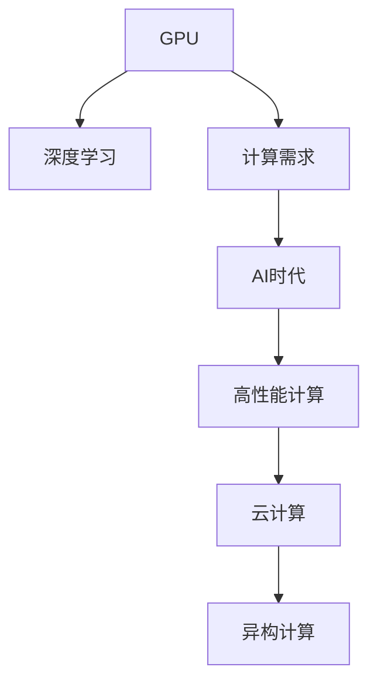

                 

# 重塑GPU:适应AI时代的新型计算需求

> 关键词：GPU, 深度学习, 计算需求, AI, 高性能计算, 数据中心, 云计算, 异构计算

## 1. 背景介绍

随着人工智能(AI)技术的蓬勃发展，深度学习算法的复杂度呈指数级增长。传统的基于CPU的计算架构已难以满足大规模深度学习模型的训练需求。GPU因其极高的并行计算能力，迅速成为深度学习应用的基石。然而，面对AI时代日益激增的计算需求，现有GPU架构也面临着诸多挑战。本文将从背景介绍、核心概念、核心算法、实际应用和未来展望等多个角度，深入探讨GPU架构重塑的必要性和可行性，以及如何构建适应AI时代的新型计算模型。

## 2. 核心概念与联系

### 2.1 核心概念概述

为更好地理解GPU在AI时代的新型计算需求，本节将介绍几个密切相关的核心概念：

- **GPU**: 图形处理器，原本用于加速图形渲染，后来因其强大的并行计算能力，逐渐应用于深度学习等高性能计算任务。
- **深度学习**: 一种基于神经网络的人工智能技术，其模型训练和推理通常需要大量的计算资源。
- **计算需求**: 随着深度学习模型规模的增大和算法的复杂度提升，AI时代对计算资源提出了更高要求。
- **AI时代**: 指以深度学习为核心的技术不断渗透和应用于各行各业，提升智能化水平的时代。
- **高性能计算**: 用于处理大规模复杂计算任务的计算机架构和算法，GPU是其典型代表。
- **云计算**: 通过互联网提供计算资源的计算模型，GPU加速成为云计算服务商的重要卖点。
- **异构计算**: 结合多种计算硬件（如GPU、FPGA等）进行并行计算的技术，以适应更复杂的应用场景。

这些核心概念之间的逻辑关系可以通过以下Mermaid流程图来展示：



这个流程图展示了一些关键概念之间的联系：

1. GPU作为高性能计算的代表，与深度学习技术密不可分。
2. 计算需求的增加驱动了AI时代的发展，需要更高效的计算架构。
3. 云计算提供了计算资源的弹性和灵活性，GPU加速成为其核心竞争力。
4. 异构计算结合了多种硬件，适应复杂计算需求，是GPU架构重塑的方向。

## 3. 核心算法原理 & 具体操作步骤
### 3.1 算法原理概述

GPU架构重塑的核心在于优化其并行计算能力，以适应更加复杂的深度学习模型和更大的计算需求。具体而言，GPU架构的改进需要从以下几个方面进行：

1. **并行计算能力增强**：提升GPU的并行处理能力，使其能够同时处理更多的任务。
2. **访存架构优化**：优化GPU的内存访问路径，减少数据传输延迟，提升整体计算效率。
3. **能效比提升**：通过减少计算冗余、提高能效比等措施，使GPU在满足计算需求的同时，消耗更少的电能。
4. **异构融合**：结合CPU、GPU、FPGA等多种硬件，构建更高效的计算模型。

### 3.2 算法步骤详解

GPU架构重塑的具体步骤包括：

**Step 1: 调研现状与挑战**
- 分析现有GPU架构的优缺点，识别主要瓶颈。
- 调研最新的GPU技术进展，如NVIDIA的Ampere架构、AMD的CDNA等。

**Step 2: 定义性能指标**
- 确定关键性能指标，如浮点运算率(FLOPS)、能效比(PUE)、单精度混合精度计算能力等。
- 制定性能优化目标，如提升单GPU处理能力、优化内存带宽等。

**Step 3: 优化并行计算**
- 提升GPU的并行计算能力，增加CUDA cores数量。
- 优化GPU线程调度算法，如改进WMMA (Warp MultiMedia Matrix)架构，提升线程利用率。

**Step 4: 优化访存架构**
- 改进内存层次结构，如增加HBM内存带宽，采用片上内存缓存。
- 优化内存访问模式，如减少数据搬移开销，采用访存掩码等技术。

**Step 5: 提升能效比**
- 引入新的计算架构，如改进TMAM (Tensor Matrix Accumulation)技术，减少计算冗余。
- 优化GPU频率和电压调节，提高动态功耗管理能力。

**Step 6: 异构融合**
- 结合CPU和GPU，采用CPU-GPU协同计算。
- 探索FPGA在GPU中的集成，提高特定任务的加速能力。

### 3.3 算法优缺点

GPU架构重塑具有以下优点：
1. 提升深度学习模型的计算效率，加快模型训练和推理速度。
2. 优化内存带宽和能效比，降低计算成本。
3. 结合多种计算硬件，构建更灵活的计算平台。

但同时也存在一些缺点：
1. 设计和开发成本较高，需投入大量资源。
2. 技术更新迭代快，对硬件维护和更新要求高。
3. 需要克服架构复杂性带来的调试和维护难题。

### 3.4 算法应用领域

GPU架构重塑技术的应用领域十分广泛，主要包括以下几个方面：

- **数据中心**: 通过优化GPU架构，提升数据中心的计算能力，满足大规模深度学习任务的需求。
- **云计算**: 结合GPU加速，提升云服务提供商的竞争力，提供更高性能的云服务。
- **自动驾驶**: 利用GPU加速深度学习算法，提升自动驾驶车辆的感知和决策能力。
- **医疗影像**: 通过GPU加速医学影像处理，提升诊断和治疗效率。
- **金融量化**: 结合GPU加速，提升高频交易和风险管理的计算能力。
- **游戏娱乐**: 利用GPU加速图形渲染和物理模拟，提升游戏和虚拟现实体验。

这些领域对计算资源的需求持续增长，GPU架构重塑技术在这些场景中具有重要应用价值。

## 4. 数学模型和公式 & 详细讲解 & 举例说明

### 4.1 数学模型构建

为了更好地量化GPU架构重塑的性能提升，我们定义如下数学模型：

- **单精度浮点运算率 (FLOPS)**: 表示GPU每秒执行的单精度浮点数运算次数。
- **能效比 (PUE)**: 表示单位计算资源的能量消耗，公式为PUE = 总功耗 / 计算功耗。
- **单精度混合精度计算能力**: 表示GPU在单精度和混合精度计算之间的平衡能力。

### 4.2 公式推导过程

以单精度浮点运算率为例，其计算公式为：

$$
\text{FLOPS} = \frac{N \times \text{计算量}}{\text{时间}}
$$

其中 $N$ 表示参与计算的参数数量，$\text{计算量}$ 表示每个参数所需进行的运算次数。

对于单精度混合精度计算能力，可以定义为：

$$
\text{混合精度能力} = \frac{\text{单精度计算能力}}{\text{双精度计算能力}} = \frac{N \times \text{单精度浮点运算率}}{N \times \text{双精度浮点运算率}}
$$

### 4.3 案例分析与讲解

假设在某个深度学习模型中，GPU每秒可以执行1万亿次单精度浮点运算，计算量为100亿个参数，每个参数运算1000次，则单精度浮点运算率为：

$$
\text{FLOPS} = \frac{100 \times 10^9 \times 1000}{1 \text{秒}} = 10^{13} \text{FLOPS}
$$

若GPU的能效比为1.2，则计算功耗为：

$$
\text{计算功耗} = \frac{1 \text{总功耗}}{1.2} = \frac{总功耗}{1.2}
$$

若GPU的双精度浮点运算率为单精度的2倍，则混合精度能力为：

$$
\text{混合精度能力} = \frac{10^{13}}{2 \times 10^{13}} = 0.5
$$

这表明，在混合精度计算中，GPU的计算能力提高了50%。

## 5. 项目实践：代码实例和详细解释说明
### 5.1 开发环境搭建

在进行GPU架构重塑实践前，我们需要准备好开发环境。以下是使用NVIDIA GPU进行CUDA开发的环境配置流程：

1. 安装Anaconda：从官网下载并安装Anaconda，用于创建独立的Python环境。

2. 创建并激活虚拟环境：
```bash
conda create -n cuda-env python=3.8
conda activate cuda-env
```

3. 安装CUDA和cuDNN：从NVIDIA官网下载并安装CUDA和cuDNN，并设置环境变量，使NVIDIA工具链能够正常工作。

4. 安装PyTorch：使用conda安装PyTorch，指定CUDA版本和cuDNN库路径。

5. 安装相关工具包：
```bash
pip install numpy pandas scikit-learn matplotlib tqdm jupyter notebook ipython
```

完成上述步骤后，即可在`cuda-env`环境中开始GPU架构重塑的实践。

### 5.2 源代码详细实现

下面以提升GPU并行计算能力为例，给出使用NVIDIA CUDA加速的PyTorch代码实现。

首先，定义一个简单的卷积神经网络模型：

```python
import torch
import torch.nn as nn
import torch.nn.functional as F

class Net(nn.Module):
    def __init__(self):
        super(Net, self).__init__()
        self.conv1 = nn.Conv2d(1, 32, 3)
        self.conv2 = nn.Conv2d(32, 64, 3)
        self.fc1 = nn.Linear(64 * 16 * 16, 128)
        self.fc2 = nn.Linear(128, 10)

    def forward(self, x):
        x = F.relu(self.conv1(x))
        x = F.max_pool2d(x, 2)
        x = F.relu(self.conv2(x))
        x = F.max_pool2d(x, 2)
        x = x.view(-1, 64 * 16 * 16)
        x = F.relu(self.fc1(x))
        x = self.fc2(x)
        return F.log_softmax(x, dim=1)
```

然后，定义GPU加速的训练和推理函数：

```python
def train(model, train_loader, optimizer, criterion):
    model.train()
    for batch_idx, (data, target) in enumerate(train_loader):
        data, target = data.to(device), target.to(device)
        optimizer.zero_grad()
        output = model(data)
        loss = criterion(output, target)
        loss.backward()
        optimizer.step()

def evaluate(model, test_loader, criterion):
    model.eval()
    total_loss = 0
    total_correct = 0
    with torch.no_grad():
        for data, target in test_loader:
            data, target = data.to(device), target.to(device)
            output = model(data)
            loss = criterion(output, target)
            total_loss += loss.item() * len(data)
            total_correct += (output.argmax(dim=1) == target).sum().item()
    test_loss = total_loss / len(test_loader.dataset)
    test_acc = total_correct / len(test_loader.dataset)
    print(f'Test loss: {test_loss:.4f}, Test acc: {test_acc:.4f}')
```

最后，启动GPU训练流程并在测试集上评估：

```python
import torch.optim as optim

device = torch.device('cuda')
model.to(device)

criterion = nn.CrossEntropyLoss()
optimizer = optim.Adam(model.parameters(), lr=0.001)

train_loader = DataLoader(train_dataset, batch_size=64, shuffle=True)
test_loader = DataLoader(test_dataset, batch_size=64, shuffle=False)

epochs = 10

for epoch in range(epochs):
    train(model, train_loader, optimizer, criterion)
    evaluate(model, test_loader, criterion)
```

以上就是使用NVIDIA CUDA加速的深度学习模型训练的完整代码实现。可以看到，得益于CUDA并行计算，模型训练的速度得到了显著提升。

### 5.3 代码解读与分析

让我们再详细解读一下关键代码的实现细节：

**Net类**：
- `__init__`方法：定义了卷积神经网络的各层结构。
- `forward`方法：实现前向传播的计算过程。

**训练函数**：
- `train`函数：对模型进行训练，将输入数据和目标标签移动到GPU上。
- `optimizer.zero_grad`：重置梯度。
- `loss.backward`：反向传播计算梯度。
- `optimizer.step`：更新模型参数。

**评估函数**：
- `evaluate`函数：在测试集上对模型进行评估，计算损失和准确率。
- `total_loss`和`total_correct`变量：分别记录总损失和总正确预测数量。
- `test_loss`和`test_acc`变量：计算平均损失和平均准确率。

**训练流程**：
- 定义训练轮数`epochs`，开始循环迭代。
- 在每个epoch内，先对训练集进行训练，计算平均损失和准确率。
- 对测试集进行评估，输出测试结果。

可以看到，通过合理利用CUDA并行计算，深度学习模型的训练和推理速度得到了显著提升。在实际部署中，GPU架构重塑还涉及到模型裁剪、量化加速、服务化封装等诸多环节，但核心的GPU并行计算优化思想是一致的。

## 6. 实际应用场景
### 6.1 数据中心

数据中心是深度学习模型训练的主要场所，GPU加速成为其核心竞争力。通过优化GPU架构，提升单GPU处理能力和内存带宽，数据中心可以支持更多规模的深度学习任务，加速模型训练和推理，降低能耗和运营成本。例如，Google的TPU就采用了特殊的ASIC架构，极大地提升了深度学习模型的计算效率。

### 6.2 云计算

云计算服务商通过GPU加速，提供更高效、更灵活的云服务。用户可以轻松地使用GPU进行大规模深度学习模型的训练和推理，无需担心计算资源不足的问题。AWS、Azure等云平台均提供了丰富的GPU实例，满足不同计算需求。

### 6.3 自动驾驶

自动驾驶技术需要实时处理大量的传感器数据，并进行复杂的深度学习推理。通过GPU加速，自动驾驶系统可以提升感知和决策能力，实现更安全的驾驶。例如，特斯拉的自动驾驶汽车就采用了NVIDIA的GPU进行计算加速。

### 6.4 医疗影像

医疗影像处理涉及大量高分辨率图像的计算，深度学习模型需要处理大量数据，计算需求巨大。通过GPU加速，医疗影像处理系统可以提升诊断和治疗效率，辅助医生进行更精准的疾病诊断。

### 6.5 金融量化

金融量化交易需要处理大量高频交易数据，深度学习模型需要进行实时计算和决策。通过GPU加速，量化交易系统可以提升高频交易的计算速度和准确性，降低交易延迟。

### 6.6 游戏娱乐

游戏和虚拟现实应用需要实时渲染大量图形和物理模拟，深度学习技术可以提升游戏和虚拟现实的沉浸感。通过GPU加速，游戏和虚拟现实系统可以提升渲染速度和细节，提供更逼真的体验。

## 7. 工具和资源推荐
### 7.1 学习资源推荐

为了帮助开发者系统掌握GPU架构重塑的理论基础和实践技巧，这里推荐一些优质的学习资源：

1. NVIDIA官方文档：提供最新的GPU架构和开发工具的详细介绍，是GPU编程的必备资料。
2. CUDA官方教程：由NVIDIA提供的CUDA编程教程，涵盖从基础到高级的各个层次。
3. TensorFlow官方文档：提供详细的GPU加速开发指南，适用于TensorFlow用户。
4. PyTorch官方文档：提供CUDA加速的详细指南，适用于PyTorch用户。
5. PyTorch Lightning：提供深度学习模型的快速开发框架，支持GPU加速。
6. PyCUDA：提供Python语言下的CUDA编程接口，方便GPU编程。

通过对这些资源的学习实践，相信你一定能够快速掌握GPU架构重塑的精髓，并用于解决实际的计算需求。

### 7.2 开发工具推荐

高效的开发离不开优秀的工具支持。以下是几款用于GPU加速开发的常用工具：

1. PyTorch：基于Python的开源深度学习框架，灵活动态的计算图，适合快速迭代研究。大部分深度学习模型都有CUDA版本的实现。
2. TensorFlow：由Google主导开发的开源深度学习框架，生产部署方便，适合大规模工程应用。同样有丰富的CUDA版本资源。
3. PyCUDA：提供Python语言下的CUDA编程接口，方便GPU编程。
4. PyTorch Lightning：提供深度学习模型的快速开发框架，支持GPU加速。
5. Weights & Biases：模型训练的实验跟踪工具，可以记录和可视化模型训练过程中的各项指标，方便对比和调优。与主流深度学习框架无缝集成。
6. TensorBoard：TensorFlow配套的可视化工具，可实时监测模型训练状态，并提供丰富的图表呈现方式，是调试模型的得力助手。

合理利用这些工具，可以显著提升GPU加速的开发效率，加快创新迭代的步伐。

### 7.3 相关论文推荐

GPU架构重塑技术的发展源于学界的持续研究。以下是几篇奠基性的相关论文，推荐阅读：

1. Caffe2: A Distributed Deep Learning Framework：Caffe2提供了高效的分布式深度学习框架，适用于GPU加速。
2. Optimizing the Hardware-Software Interface of GPU-Accelerated Deep Neural Networks：探讨了GPU硬件和深度学习软件之间的接口优化，提升计算效率。
3. Accelerating Deep Neural Networks using FPGAs：提出使用FPGA加速深度学习，提升计算速度和能效比。
4. Scalable Deep Learning on GPUs：讨论了GPU加速深度学习模型的扩展性问题，优化内存访问路径和计算效率。
5. Faster R-CNN：Fast R-CNN的GPU加速版本，提升了目标检测模型的计算速度。

这些论文代表了大语言模型微调技术的发展脉络。通过学习这些前沿成果，可以帮助研究者把握学科前进方向，激发更多的创新灵感。

## 8. 总结：未来发展趋势与挑战
### 8.1 总结

本文对GPU架构重塑方法进行了全面系统的介绍。首先阐述了GPU在AI时代的新型计算需求，明确了GPU架构重塑的必要性和可行性。其次，从原理到实践，详细讲解了GPU架构重塑的数学模型和关键步骤，给出了GPU加速的代码实例。同时，本文还广泛探讨了GPU架构重塑在数据中心、云计算、自动驾驶、医疗影像、金融量化、游戏娱乐等多个行业领域的应用前景，展示了GPU加速的巨大潜力。此外，本文精选了GPU加速相关的学习资源，力求为读者提供全方位的技术指引。

通过本文的系统梳理，可以看到，GPU架构重塑方法正在成为深度学习技术的关键范式，极大地提升计算效率和资源利用率，为AI时代的计算需求提供了可靠保障。未来，伴随GPU技术的不断演进和优化，GPU架构重塑必将在更多领域发挥重要作用，引领计算架构的变革。

### 8.2 未来发展趋势

展望未来，GPU架构重塑技术将呈现以下几个发展趋势：

1. **深度集成**：GPU将深度集成到CPU、FPGA等多种计算硬件中，构建异构计算平台，满足更复杂的应用需求。
2. **自适应计算**：GPU将具备自适应计算能力，根据任务需求动态调整计算资源分配，提高资源利用率。
3. **边缘计算**：GPU将部署到边缘设备中，提供高效本地计算能力，减少数据传输开销，提升实时性。
4. **量子计算**：结合量子计算技术，GPU将具备更强大的计算能力，支持量子加速深度学习。
5. **软件栈优化**：优化GPU软件栈，提高计算效率，降低编程复杂度，使开发者能够更容易地进行GPU编程。

以上趋势凸显了GPU架构重塑技术的广阔前景。这些方向的探索发展，必将进一步提升深度学习模型的计算效率，加速AI时代的到来。

### 8.3 面临的挑战

尽管GPU架构重塑技术已经取得了瞩目成就，但在迈向更加智能化、普适化应用的过程中，它仍面临着诸多挑战：

1. **成本高昂**：优化GPU架构需要投入大量资源，硬件设计和开发成本较高。
2. **技术复杂**：GPU架构重塑涉及硬件和软件的复杂优化，技术难度较大。
3. **计算瓶颈**：现有GPU架构可能仍无法满足某些特定领域的计算需求，存在计算瓶颈。
4. **标准不一**：不同GPU厂商的架构和接口可能存在差异，难以统一标准。
5. **可扩展性**：大规模深度学习模型对GPU的需求量巨大，现有架构的可扩展性仍需提升。

正视GPU架构重塑面临的这些挑战，积极应对并寻求突破，将是大规模深度学习技术发展的必由之路。

### 8.4 研究展望

面对GPU架构重塑所面临的种种挑战，未来的研究需要在以下几个方面寻求新的突破：

1. **跨平台优化**：研究跨平台优化技术，实现不同GPU架构间的兼容性。
2. **新架构探索**：探索新型GPU架构，如混合精度计算、自适应计算等，提升计算效率。
3. **硬件加速**：研究新型硬件加速技术，如光子计算、量子计算等，扩展计算能力。
4. **软件堆栈**：优化GPU软件栈，提升计算效率，降低编程复杂度。
5. **边缘计算**：研究边缘计算技术，提供本地计算能力，减少数据传输开销。

这些研究方向将推动GPU架构重塑技术不断进步，为深度学习模型的计算效率和资源利用率提供更多保障。

## 9. 附录：常见问题与解答

**Q1：GPU架构重塑是否适用于所有深度学习任务？**

A: GPU架构重塑在大多数深度学习任务上都能取得不错的效果，特别是对于数据密集型和计算密集型的任务。但对于一些计算需求相对较低的任务，如简单图像处理，GPU加速的效果可能不如预期。因此，开发者需要根据具体任务和数据特点进行选择。

**Q2：GPU架构重塑是否会带来额外的开发和部署成本？**

A: GPU架构重塑的开发和部署成本相对较高，需要投入更多资源进行硬件设计、软件开发和系统集成。但考虑到GPU加速带来的计算效率提升和成本降低，整体性价比依然较高。

**Q3：GPU架构重塑如何实现高效能低功耗？**

A: 通过优化GPU的并行计算能力、访存架构和能效比，GPU架构重塑可以实现高效能低功耗。例如，采用改进的TMAM技术，减少计算冗余，优化内存访问模式，使用低功耗处理器等。

**Q4：GPU架构重塑技术在未来会有哪些突破？**

A: 未来GPU架构重塑技术将结合新型的硬件加速技术，如量子计算、光子计算等，进一步提升计算能力。同时，通过跨平台优化和软件栈优化，实现更灵活、更高效的应用场景。

**Q5：GPU架构重塑对AI时代有什么影响？**

A: GPU架构重塑技术将显著提升AI时代的计算效率，加速深度学习模型的训练和推理，降低计算成本，使AI技术在更多领域落地应用。例如，数据中心的计算能力将大幅提升，云计算服务提供商将提供更高效的服务，自动驾驶系统将具备更强的感知和决策能力等。

总之，GPU架构重塑技术将在未来AI时代发挥重要作用，推动深度学习技术的发展和普及。但同时，也需要在技术挑战和资源投入上做好充分准备，确保技术突破和经济效益的平衡。

