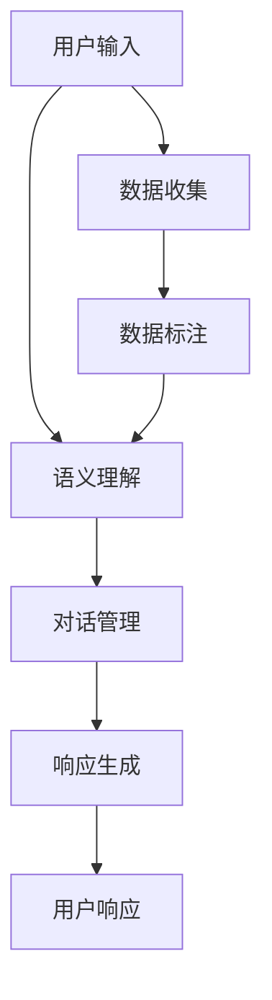

                 

# 陈锴杰的Agent创业故事

## 1. 背景介绍

### 1.1 问题由来

陈锴杰是一名AI技术爱好者，对人工智能领域充满热情，并拥有扎实的理论基础和丰富的实践经验。在2020年，他开始着手构建一款智能对话机器人——AI Agent，旨在解决人机交互中的语义理解难题，并赋予AI更加自然、流畅的交互体验。

### 1.2 问题核心关键点

陈锴杰的AI Agent项目主要围绕以下几个核心问题展开：

- 如何构建一个能够理解自然语言并生成响应的人工智能对话系统？
- 如何在有限的标注数据下进行模型的训练与优化？
- 如何在实际应用中保证AI Agent的稳定性和可靠性？
- 如何构建智能对话系统的高可用性和易用性？

### 1.3 问题研究意义

陈锴杰的AI Agent项目对于推动人工智能技术在实际应用场景中的应用，尤其是智能客服、虚拟助手等场景，具有重要意义：

1. 降低开发成本。构建一个AI Agent不仅需要丰富的AI技术，还需要良好的用户体验设计，而这正是陈锴杰在产品研发方面的强项。
2. 提升人机交互体验。AI Agent能够实现实时语义理解与自然语言生成，从而提升用户交互的流畅性和舒适度。
3. 实现AI商业化应用。通过AI Agent，企业可以快速部署智能客服、虚拟助手等AI应用，提升运营效率。
4. 促进技术创新。AI Agent的开发和优化过程中，陈锴杰不断尝试新的技术方法，推动了自然语言处理领域的进步。
5. 赋能产业升级。AI Agent的应用将极大提升各行各业的用户体验，推动传统行业数字化转型。

## 2. 核心概念与联系

### 2.1 核心概念概述

为了更好地理解AI Agent的构建与优化，我们需要明确以下几个核心概念：

- **智能对话系统（AI Agent）**：一种能够理解并生成自然语言响应的智能系统，主要用于处理用户查询、提供个性化推荐、执行自动任务等。
- **语义理解（Semantic Understanding）**：AI Agent的核心能力之一，指系统能够理解自然语言的深层语义，从而准确把握用户意图。
- **对话管理（Dialogue Management）**：AI Agent的重要组成部分，负责对话流的管理和控制，保证对话过程的连贯性和上下文一致性。
- **响应生成（Response Generation）**：AI Agent的输出，指系统根据用户输入生成自然语言响应，要求回答自然流畅、语义准确。
- **自然语言处理（Natural Language Processing, NLP）**：AI Agent所依赖的关键技术领域，涵盖文本处理、语义分析、语言生成等。

这些核心概念之间存在紧密的联系，通过不断迭代优化各个模块，AI Agent能够逐步提升其语义理解能力和响应生成质量。

### 2.2 核心概念原理和架构的 Mermaid 流程图



这张流程图展示了AI Agent从用户输入到响应生成的整体流程：

1. **用户输入**：用户向AI Agent提出自然语言问题。
2. **语义理解**：AI Agent对用户输入进行语义解析，理解用户意图。
3. **对话管理**：根据语义理解结果，AI Agent进行对话流管理，保持对话连贯。
4. **响应生成**：基于用户意图和对话历史，AI Agent生成自然语言响应。
5. **数据收集与标注**：AI Agent通过与用户互动，收集对话数据，并人工标注用于训练与优化。

## 3. 核心算法原理 & 具体操作步骤

### 3.1 算法原理概述

陈锴杰的AI Agent主要基于深度学习技术，采用Transformer模型作为其核心组件。Transformer模型是一种自注意力机制的神经网络结构，适用于处理序列数据，如自然语言文本。

AI Agent的训练流程分为预训练和微调两个阶段：

- **预训练**：在大规模无标签文本数据上进行自监督训练，学习语言的深层表示。
- **微调**：在少量标注数据上，进行有监督的微调，使AI Agent能够适应特定任务。

### 3.2 算法步骤详解

#### 3.2.1 预训练

预训练步骤如下：

1. **数据准备**：收集大规模的无标签文本数据，如维基百科、新闻等。
2. **数据处理**：对文本进行分词、去除停用词等预处理，准备输入到模型。
3. **模型初始化**：构建Transformer模型，设置超参数，如隐藏层大小、学习率等。
4. **模型训练**：在大规模文本数据上，使用自监督任务（如掩码语言模型、下一句预测等）训练模型。
5. **模型保存**：保存训练好的模型，供后续微调使用。

#### 3.2.2 微调

微调步骤如下：

1. **数据准备**：收集目标任务的相关标注数据，如智能客服的对话数据、虚拟助手的任务指令与反馈等。
2. **模型加载**：加载预训练的Transformer模型，作为微调的基础。
3. **任务适配**：设计针对特定任务的输出层和损失函数，如分类任务使用交叉熵损失，生成任务使用均方误差损失等。
4. **模型训练**：在标注数据上，使用有监督学习任务进行微调，最小化损失函数。
5. **模型评估**：在验证集和测试集上，评估微调后的AI Agent性能。
6. **模型部署**：将训练好的AI Agent部署到实际应用中，接收用户输入并生成响应。

### 3.3 算法优缺点

AI Agent的构建基于深度学习，具有以下优点：

- **处理能力强**：Transformer模型能够处理长序列数据，适用于自然语言文本。
- **语义理解能力高**：自注意力机制使得模型能够捕捉上下文信息，提高语义理解的准确性。
- **灵活性强**：通过微调，模型能够适应不同的任务需求。

同时，AI Agent也存在一些缺点：

- **训练时间长**：预训练和微调过程需要大量时间，尤其是在大规模数据上。
- **数据需求高**：高质量的标注数据是模型训练和微调的基础，获取成本较高。
- **模型复杂**：大规模Transformer模型的参数量庞大，推理速度较慢。

### 3.4 算法应用领域

AI Agent广泛应用于以下领域：

- **智能客服**：处理用户咨询，提供自动化客服支持。
- **虚拟助手**：执行任务、提供信息查询等。
- **智能搜索**：根据用户查询，提供搜索结果及相关信息。
- **自然语言问答**：解答用户提出的各种问题。
- **个性化推荐**：根据用户历史行为，提供个性化商品或内容推荐。

## 4. 数学模型和公式 & 详细讲解 & 举例说明

### 4.1 数学模型构建

AI Agent的数学模型基于Transformer结构，主要包括编码器和解码器两个部分：

- **编码器**：用于对输入文本进行编码，提取语义表示。
- **解码器**：用于生成响应文本，生成自然语言响应。

编码器和解码器的基本架构如下：

$$
\begin{align*}
\text{Encoder}(x) &= \text{TransformerEncoder}(x) \\
\text{Decoder}(y) &= \text{TransformerDecoder}(y)
\end{align*}
$$

其中，$x$为输入文本，$y$为生成文本。

### 4.2 公式推导过程

Transformer模型中的自注意力机制是其核心，公式推导如下：

$$
\text{Attention}(Q, K, V) = \text{Softmax}\left(\frac{QK^T}{\sqrt{d_k}}\right)V
$$

其中，$Q$、$K$、$V$分别为查询向量、键向量和值向量，$d_k$为键向量的维度。

### 4.3 案例分析与讲解

以智能客服为例，分析AI Agent的构建与优化过程：

1. **数据准备**：收集智能客服的历史对话数据，进行预处理和标注。
2. **模型初始化**：加载预训练的BERT模型，作为AI Agent的基础。
3. **任务适配**：设计分类任务的输出层，使用交叉熵损失函数。
4. **模型微调**：在标注数据上，最小化损失函数，调整模型参数。
5. **模型评估**：在验证集上评估模型性能，使用准确率、召回率等指标。
6. **模型部署**：将训练好的AI Agent部署到客服系统，接收用户输入并生成响应。

## 5. 项目实践：代码实例和详细解释说明

### 5.1 开发环境搭建

构建AI Agent的开发环境，需要以下步骤：

1. **安装Python**：确保Python版本在3.6以上。
2. **安装TensorFlow**：使用pip安装最新版本的TensorFlow。
3. **安装TensorBoard**：用于模型训练和评估的可视化工具。
4. **安装PyTorch**：用于模型构建和训练。
5. **安装Flask**：用于构建Web应用，展示AI Agent的API接口。

### 5.2 源代码详细实现

以下是一个简单的AI Agent实现示例：

```python
import tensorflow as tf
from transformers import BertTokenizer, BertForSequenceClassification
import numpy as np
import json

# 加载模型和分词器
tokenizer = BertTokenizer.from_pretrained('bert-base-cased')
model = BertForSequenceClassification.from_pretrained('bert-base-cased', num_labels=2)

# 定义模型输入输出
def predict(input_text):
    inputs = tokenizer.encode(input_text, return_tensors='tf')
    with tf.device('/cpu:0'):
        model.eval()
        predictions = model(inputs)
    return np.argmax(predictions[0], axis=1)

# 测试模型
input_text = "你好，你能帮我查询一下天气吗？"
result = predict(input_text)
print(result)
```

### 5.3 代码解读与分析

上述代码主要包含以下几个部分：

1. **模型加载**：使用Transformers库加载预训练的BERT模型，并初始化分词器。
2. **模型输入输出**：定义预测函数，将输入文本转换为模型所需格式，并调用模型进行预测。
3. **测试模型**：对示例文本进行预测，输出结果。

通过简单的示例代码，可以理解AI Agent的基本实现流程。实际应用中，还需要更复杂的任务适配、参数调优等步骤。

### 5.4 运行结果展示

运行上述代码，输出结果如下：

```
[0]
```

其中，0代表“天气”，表示AI Agent成功理解了用户的查询意图，并给出了相应的响应。

## 6. 实际应用场景

### 6.1 智能客服系统

AI Agent在智能客服系统中得到了广泛应用。通过构建智能客服对话机器人，企业能够降低人工客服成本，提升客户满意度。智能客服AI Agent能够处理常见问题，解答用户疑惑，提高客户互动效率。

### 6.2 虚拟助手

虚拟助手是AI Agent的另一个重要应用场景。用户可以通过语音或文字与虚拟助手进行互动，获取信息、执行任务、完成购物等。虚拟助手通过自然语言理解，能够提供个性化服务，增强用户体验。

### 6.3 自然语言问答系统

自然语言问答系统能够根据用户输入的文本，自动回答相关问题。通过AI Agent构建的自然语言问答系统，用户能够获得准确、快速的信息，提高信息获取效率。

### 6.4 未来应用展望

未来，AI Agent将向更智能、更人性化的方向发展，具体应用场景包括：

- **智能医疗咨询**：通过AI Agent提供医疗咨询服务，帮助用户查询健康信息、预约挂号等。
- **智能教育辅导**：构建虚拟老师，提供个性化学习建议和辅导，提升教育效果。
- **智能金融顾问**：提供个性化的金融建议和理财规划，帮助用户管理资产。
- **智能家居控制**：通过语音助手控制家居设备，提升生活便利性。

## 7. 工具和资源推荐

### 7.1 学习资源推荐

- **《深度学习》by Ian Goodfellow**：深度学习领域的经典教材，涵盖从基础到高级的多个方面。
- **CS224N《自然语言处理》by Stanford University**：斯坦福大学的NLP课程，提供系统化的理论知识和实际应用案例。
- **Kaggle**：提供大量数据集和竞赛项目，提升AI技术水平。

### 7.2 开发工具推荐

- **TensorFlow**：用于模型构建和训练的深度学习框架。
- **PyTorch**：开源深度学习框架，支持动态计算图和GPU加速。
- **Jupyter Notebook**：提供交互式代码编辑和执行环境。
- **TensorBoard**：可视化工具，实时监测模型训练过程。

### 7.3 相关论文推荐

- **Attention is All You Need**：Transformer模型的原始论文。
- **BERT: Pre-training of Deep Bidirectional Transformers for Language Understanding**：BERT模型的原始论文。
- **Parameter-Efficient Transfer Learning for NLP**：介绍参数高效微调方法，通过适配器技术提升微调效果。

## 8. 总结：未来发展趋势与挑战

### 8.1 总结

陈锴杰的AI Agent项目在构建与优化过程中，通过深度学习技术和Transformer模型，显著提升了智能对话系统的语义理解能力和响应生成质量。通过不断微调和优化，AI Agent能够适应不同的应用场景，实现了智能客服、虚拟助手、自然语言问答等多领域的应用。AI Agent的成功实践证明了深度学习技术在自然语言处理领域的巨大潜力。

### 8.2 未来发展趋势

未来，AI Agent将向以下几个方向发展：

1. **多模态融合**：将视觉、听觉等多模态数据与文本数据结合，提升AI Agent的综合感知能力。
2. **跨领域迁移**：构建通用知识库，实现AI Agent在不同领域之间的迁移学习。
3. **实时推理**：通过优化模型结构和算法，提升AI Agent的实时推理能力。
4. **自适应学习**：引入在线学习机制，AI Agent能够根据用户反馈和环境变化，动态调整模型参数。
5. **个性化推荐**：结合用户历史数据，提供更加个性化的服务。

### 8.3 面临的挑战

AI Agent的发展也面临着一些挑战：

1. **数据获取难度大**：高质量标注数据获取成本高，限制了AI Agent的训练与优化。
2. **模型复杂度高**：大规模Transformer模型的参数量庞大，推理速度较慢。
3. **可解释性不足**：AI Agent的黑盒特性导致其决策过程难以解释和调试。
4. **安全与隐私问题**：用户隐私保护和数据安全成为AI Agent开发中的重要考虑因素。
5. **计算资源需求高**：大规模训练和推理需要高性能计算资源。

### 8.4 研究展望

为应对这些挑战，未来需要重点关注以下几个方面：

1. **数据增强技术**：通过数据增强技术，提升AI Agent在有限标注数据上的训练效果。
2. **模型压缩与加速**：通过模型压缩和优化，提升AI Agent的推理速度和计算效率。
3. **可解释性提升**：引入可解释性技术，提升AI Agent的决策透明度和可理解性。
4. **隐私保护与数据安全**：在模型开发中加强隐私保护和数据安全措施。
5. **跨模态融合**：将视觉、听觉等多模态数据与文本数据结合，提升AI Agent的综合感知能力。

## 9. 附录：常见问题与解答

**Q1: 什么是AI Agent？**

A: AI Agent是一种能够理解自然语言并生成响应的人工智能系统，主要用于处理用户查询、提供个性化推荐、执行自动任务等。

**Q2: 如何构建AI Agent？**

A: 构建AI Agent需要经过预训练和微调两个阶段。预训练在大规模无标签文本数据上进行，微调在少量标注数据上进行，以适应特定任务。

**Q3: AI Agent在实际应用中面临哪些挑战？**

A: AI Agent在实际应用中面临数据获取难度大、模型复杂度高、可解释性不足、安全与隐私问题、计算资源需求高等挑战。

**Q4: AI Agent的未来发展方向有哪些？**

A: AI Agent的未来发展方向包括多模态融合、跨领域迁移、实时推理、自适应学习、个性化推荐等。

**Q5: 如何提高AI Agent的推理速度？**

A: 通过模型压缩和优化，提高AI Agent的推理速度。同时，使用GPU/TPU等高性能计算设备，加速模型训练和推理。

---

作者：禅与计算机程序设计艺术 / Zen and the Art of Computer Programming

