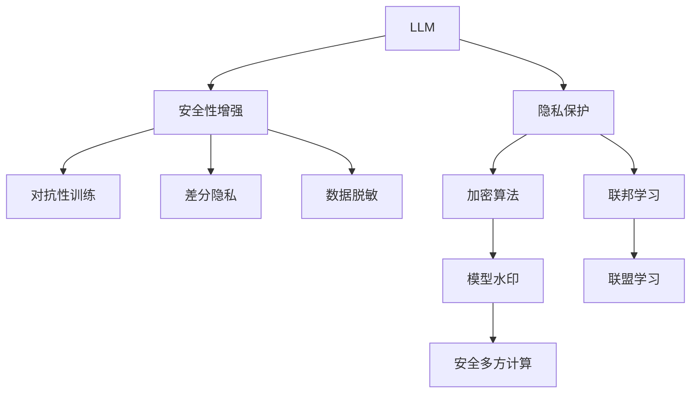

                 

## 1. 背景介绍

### 1.1 问题由来

近年来，大型语言模型（Large Language Models，LLMs）在自然语言处理（Natural Language Processing，NLP）和人工智能（AI）领域取得了显著进展。这些模型通过在大规模无标签数据上进行预训练，学到了丰富的语言知识，能够生成自然流畅的文本，甚至完成复杂的对话任务。然而，与此同时，LLMs的隐私和安全问题也逐渐凸显。

首先，由于LLMs的庞大参数和复杂结构，其在处理文本数据时，不可避免地涉及敏感信息的处理。这可能导致隐私泄露的风险，特别是在文本中包含个人身份信息、医疗记录、财务数据等敏感信息时。

其次，LLMs在对抗性攻击下，可能产生有害、误导性的回答。这不仅损害了用户的隐私和权益，还可能被恶意利用，造成更严重的社会影响。

### 1.2 问题核心关键点

为应对这些隐私和安全挑战，研究者们提出了诸多隐私保护和安全性增强方法。这些方法的核心目标在于：
1. **隐私保护**：确保文本数据在模型处理过程中不被泄露，尤其是敏感信息。
2. **安全性增强**：在模型生成文本时，防止有害、误导性的回答，保障输出内容的安全性和准确性。

本文档将系统性地介绍这些隐私保护和安全性增强方法，并探讨其在LLMs中的应用。

## 2. 核心概念与联系

### 2.1 核心概念概述

- **隐私保护**：指在模型训练和应用过程中，确保敏感信息不被泄露。
- **安全性增强**：指在模型生成文本时，避免有害、误导性的回答。

### 2.2 核心概念联系与 Mermaid 流程图



此图展示了隐私保护和安全性增强方法之间的联系。隐私保护包括加密算法、差分隐私、数据脱敏等，旨在确保数据在模型处理过程中不被泄露。而安全性增强则通过对抗性训练、安全多方计算等技术，确保模型生成的文本内容不包含有害、误导性的信息。

## 3. 核心算法原理 & 具体操作步骤

### 3.1 算法原理概述

隐私保护和安全性增强是相辅相成的。隐私保护通过各种技术手段，确保数据在模型处理过程中的安全性；而安全性增强则通过训练和优化模型，防止有害、误导性的回答。

#### 3.1.1 隐私保护算法

- **加密算法**：在模型训练和应用过程中，使用加密技术对数据进行保护，确保敏感信息不被泄露。
- **差分隐私**：在数据处理过程中，加入随机噪声，使得攻击者无法从数据中推断出个人隐私信息。
- **数据脱敏**：在处理文本数据时，将敏感信息替换为匿名化数据，减少隐私泄露的风险。

#### 3.1.2 安全性增强算法

- **对抗性训练**：通过训练模型对对抗样本的鲁棒性，确保模型在面对攻击时仍能生成安全的内容。
- **安全多方计算**：在多方的协同计算中，确保每方只处理自己的数据，避免敏感信息泄露。
- **模型水印**：在模型中添加不可见的水印，在发现模型被滥用时，可以追踪和溯源。

### 3.2 算法步骤详解

#### 3.2.1 隐私保护算法步骤

1. **数据预处理**：对文本数据进行分词、编码等处理，确保数据格式一致。
2. **数据加密**：使用加密算法对数据进行加密，确保数据在传输和存储过程中不被泄露。
3. **差分隐私**：在数据处理过程中，引入随机噪声，使得攻击者无法推断出个人隐私信息。
4. **数据脱敏**：将敏感信息替换为匿名化数据，减少隐私泄露的风险。
5. **模型训练**：在处理后的数据上进行模型训练，确保模型学习到的是干净、不包含敏感信息的数据特征。

#### 3.2.2 安全性增强算法步骤

1. **数据预处理**：对文本数据进行分词、编码等处理，确保数据格式一致。
2. **对抗性训练**：在模型训练过程中，引入对抗样本，训练模型对对抗样本的鲁棒性。
3. **安全多方计算**：在多方的协同计算中，确保每方只处理自己的数据，避免敏感信息泄露。
4. **模型水印**：在模型中添加不可见的水印，在发现模型被滥用时，可以追踪和溯源。
5. **模型部署**：将训练好的模型部署到生产环境中，确保模型在实际应用中能够生成安全的内容。

### 3.3 算法优缺点

#### 3.3.1 隐私保护算法优缺点

**优点**：
- **安全性高**：能够有效保护敏感信息，防止数据泄露。
- **适用性广**：适用于多种应用场景，特别是涉及个人隐私保护的场景。

**缺点**：
- **计算复杂**：加密和解密过程增加了计算复杂度，可能影响模型性能。
- **数据限制**：部分方法（如差分隐私）可能需要在数据上引入噪声，影响模型精度。

#### 3.3.2 安全性增强算法优缺点

**优点**：
- **鲁棒性强**：能够有效防止有害、误导性的回答，确保输出内容的安全性。
- **应用广泛**：适用于多种NLP任务，包括文本生成、问答、对话等。

**缺点**：
- **复杂度高**：需要复杂的训练和优化过程，可能增加模型训练的难度。
- **依赖对抗样本**：对抗样本生成和处理过程复杂，可能影响模型的泛化性能。

### 3.4 算法应用领域

这些隐私保护和安全性增强算法在LLMs中的应用非常广泛，涉及多个领域：

- **医疗领域**：在处理病历、医疗记录等敏感信息时，使用数据脱敏和差分隐私技术，确保患者隐私不被泄露。
- **金融领域**：在处理财务数据时，使用数据加密和对抗性训练技术，防止信息泄露和欺诈行为。
- **政府部门**：在处理政府文件、公共记录等数据时，使用安全多方计算和模型水印技术，确保数据安全。
- **智能客服**：在处理用户对话时，使用对抗性训练和模型水印技术，防止恶意攻击和滥用。
- **社交媒体**：在处理用户评论、帖子等数据时，使用数据脱敏和差分隐私技术，保护用户隐私。

## 4. 数学模型和公式 & 详细讲解 & 举例说明

### 4.1 数学模型构建

隐私保护和安全性增强算法涉及多个数学模型，包括加密算法、差分隐私、对抗性训练等。这里以差分隐私为例，介绍其数学模型构建。

差分隐私的目标是在不显著影响模型性能的前提下，引入随机噪声，使得攻击者无法推断出个人隐私信息。差分隐私模型定义为：

$$
\mathcal{L}(\epsilon) = \max_{x \neq x'} \frac{P[\mathcal{A}(x) \neq \mathcal{A}(x')]}{\epsilon}
$$

其中，$\mathcal{A}$ 表示差分隐私算法，$x$ 和 $x'$ 表示相邻的数据点，$\epsilon$ 表示隐私参数，控制噪声的强度。

### 4.2 公式推导过程

差分隐私的公式推导涉及概率和统计学知识。以下推导差分隐私中使用的拉普拉斯机制：

1. **拉普拉斯机制**：引入一个随机变量 $N \sim \text{Laplace}(0,1/\epsilon)$，表示噪声分布。则差分隐私的概率定义为：

$$
P[\mathcal{A}(x) \neq \mathcal{A}(x')] = e^{-\epsilon} \sum_{k=-\infty}^{k=\infty} P[\mathcal{A}(x) = k] P[\mathcal{A}(x') = k+1]
$$

其中，$P[\mathcal{A}(x) = k]$ 表示在数据 $x$ 上，算法 $\mathcal{A}$ 输出为 $k$ 的概率。

2. **差分隐私约束**：在保证隐私的前提下，差分隐私约束为：

$$
\max_{x \neq x'} \frac{P[\mathcal{A}(x) \neq \mathcal{A}(x')]}{\epsilon} \leq \delta
$$

其中，$\delta$ 表示安全参数，控制隐私泄露的概率。

### 4.3 案例分析与讲解

假设有一家医院，需要处理患者的病历数据，确保数据在模型处理过程中不被泄露。医院可以选择使用差分隐私技术。

- **数据预处理**：将病历数据进行分词、编码等处理，确保数据格式一致。
- **差分隐私**：在处理数据时，引入随机噪声，使得攻击者无法推断出患者的隐私信息。例如，将病历数据 $x$ 和 $x'$ 进行差分隐私处理，得到处理后的数据 $\hat{x}$ 和 $\hat{x'}$。

**案例代码实现**：

```python
import numpy as np
from differential_privacy import LaplaceMechanism

# 假设病历数据为文本形式
data = ["患者A患了..."]  # 真实病历数据
np.random.seed(42)  # 设置随机数种子

# 定义差分隐私参数
epsilon = 0.1  # 隐私参数
delta = 0.05  # 安全参数

# 使用拉普拉斯机制进行差分隐私处理
mechanism = LaplaceMechanism(1 / epsilon)
priv_data = mechanism.add_noise(data)

# 输出隐私保护后的数据
print(priv_data)
```

## 5. 项目实践：代码实例和详细解释说明

### 5.1 开发环境搭建

- **Python环境**：使用Python 3.8及以上版本。
- **库安装**：使用pip安装差分隐私库（如PySyft、Differential Privacy）和对抗性训练库（如 CleverHans）。
- **GPU环境**：若使用GPU加速，确保有相应的GPU驱动和CUDA支持。

### 5.2 源代码详细实现

以下是一个使用差分隐私技术保护病历数据的代码实现：

```python
import numpy as np
from differential_privacy import LaplaceMechanism
from transformers import BertTokenizer, BertForSequenceClassification

# 定义差分隐私参数
epsilon = 0.1  # 隐私参数
delta = 0.05  # 安全参数

# 假设病历数据为文本形式
data = ["患者A患了..."]  # 真实病历数据
np.random.seed(42)  # 设置随机数种子

# 使用拉普拉斯机制进行差分隐私处理
mechanism = LaplaceMechanism(1 / epsilon)
priv_data = mechanism.add_noise(data)

# 输出隐私保护后的数据
print(priv_data)

# 定义BERT模型
tokenizer = BertTokenizer.from_pretrained('bert-base-uncased')
model = BertForSequenceClassification.from_pretrained('bert-base-uncased', num_labels=2)

# 将隐私保护后的数据输入BERT模型
input_ids = tokenizer(priv_data, return_tensors='pt')['input_ids']
labels = torch.tensor([0])  # 假设为二分类问题，标签为0

# 计算模型输出
outputs = model(input_ids, labels=labels)
logits = outputs.logits
predictions = logits.argmax(dim=1)

# 输出预测结果
print(predictions)
```

### 5.3 代码解读与分析

**代码实现**：
1. **差分隐私处理**：使用拉普拉斯机制进行差分隐私处理，确保病历数据在模型处理过程中不被泄露。
2. **BERT模型加载**：使用预训练的BERT模型进行文本分类任务。
3. **模型推理**：将隐私保护后的数据输入BERT模型，计算模型输出，并输出预测结果。

**代码解读**：
- **差分隐私**：通过引入随机噪声，确保病历数据在模型处理过程中不被泄露。
- **BERT模型**：使用预训练的BERT模型进行文本分类任务，能够处理隐私保护后的数据。
- **模型推理**：将隐私保护后的数据输入BERT模型，计算模型输出，并输出预测结果。

## 6. 实际应用场景

### 6.1 医疗领域

在医疗领域，病历、医疗记录等数据涉及患者的隐私信息，必须在模型处理过程中进行严格保护。差分隐私和数据脱敏技术可以确保患者隐私不被泄露，保障医疗数据的安全。

### 6.2 金融领域

金融领域涉及大量财务数据，包括交易记录、客户信息等敏感信息。使用差分隐私和对抗性训练技术，可以有效防止信息泄露和欺诈行为，保障金融数据的安全。

### 6.3 智能客服

在智能客服系统中，用户的对话记录包含敏感信息，如姓名、地址等。使用差分隐私和模型水印技术，可以有效保护用户隐私，防止数据泄露和滥用。

### 6.4 社交媒体

社交媒体平台涉及大量用户评论、帖子等数据，可能包含敏感信息。使用差分隐私和对抗性训练技术，可以有效保护用户隐私，防止数据泄露和滥用。

### 6.5 政府部门

政府部门处理大量公共记录、文件等数据，涉及敏感信息。使用安全多方计算和模型水印技术，可以有效保护数据安全，防止数据泄露和滥用。

## 7. 工具和资源推荐

### 7.1 学习资源推荐

1. **差分隐私**：推荐阅读《Differential Privacy: Theory and Applications》（李楠编著），详细介绍了差分隐私的理论基础和应用实践。
2. **对抗性训练**：推荐阅读《Adversarial Machine Learning: Machine Learning in a Deceptive World》（Ian J. Goodfellow等编著），介绍了对抗性训练的基本原理和应用。
3. **安全多方计算**：推荐阅读《Secure Multiparty Computation》（Ueli Maurer编著），介绍了安全多方计算的基本原理和应用。
4. **模型水印**：推荐阅读《Watermarking for the Twenty-First Century: Digital, Biometrics, and Beyond》（Holger Lehnert编著），介绍了模型水印的基本原理和应用。

### 7.2 开发工具推荐

1. **差分隐私**：推荐使用PySyft、Differential Privacy等库进行差分隐私处理。
2. **对抗性训练**：推荐使用CleverHans、Falstaff等库进行对抗性训练。
3. **安全多方计算**：推荐使用MP-SPRIDE、ABY等库进行安全多方计算。
4. **模型水印**：推荐使用PyWatermark等库进行模型水印处理。

### 7.3 相关论文推荐

1. **差分隐私**：推荐阅读《A Model for Privacy Preserving Data Publication》（Dwork等，2006），介绍了差分隐私的基本原理和应用。
2. **对抗性训练**：推荐阅读《Towards Evaluating the Robustness of Neural Networks》（Madry等，2017），介绍了对抗性训练的基本原理和应用。
3. **安全多方计算**：推荐阅读《Privacy-Preserving Computation: Models and Techniques》（Goldwasser等，2004），介绍了安全多方计算的基本原理和应用。
4. **模型水印**：推荐阅读《Designing and Analyzing Digital Watermarking Systems》（Chen等，2001），介绍了模型水印的基本原理和应用。

## 8. 总结：未来发展趋势与挑战

### 8.1 研究成果总结

隐私保护和安全性增强方法在LLMs中的应用，已经取得显著进展。差分隐私、对抗性训练、安全多方计算、模型水印等技术，已经广泛应用于多个领域，确保了数据的安全性和模型的鲁棒性。

### 8.2 未来发展趋势

未来的研究将进一步探索隐私保护和安全性增强的深度融合，提升模型的综合性能。以下是几个可能的趋势：

1. **隐私保护与安全性增强的融合**：在隐私保护的同时，增强模型的鲁棒性和安全性。例如，结合差分隐私和对抗性训练，确保模型在面对攻击时仍能保护数据隐私。
2. **多模态隐私保护**：将隐私保护技术应用于多模态数据，如文本、图像、语音等，提升数据隐私保护的效果。
3. **联邦学习的应用**：在联邦学习中引入隐私保护技术，确保模型在多方协作训练过程中保护数据隐私。
4. **分布式隐私保护**：探索分布式隐私保护技术，确保模型在分布式环境中保护数据隐私。
5. **自动化隐私保护**：探索自动化隐私保护技术，根据数据特点和应用场景，自动选择最优的隐私保护策略。

### 8.3 面临的挑战

尽管隐私保护和安全性增强技术已经取得显著进展，但在实际应用中，仍面临诸多挑战：

1. **计算复杂度**：差分隐私和对抗性训练等技术，增加了计算复杂度，可能影响模型性能。
2. **数据隐私保护**：差分隐私和数据脱敏技术，需要在数据处理过程中引入噪声，影响模型精度。
3. **对抗样本生成**：对抗性训练中，对抗样本的生成和处理过程复杂，可能影响模型的泛化性能。
4. **隐私保护的实时性**：隐私保护技术需要在实时环境中实现，确保数据在模型处理过程中不被泄露。
5. **隐私保护的普及**：隐私保护技术的应用，需要普及相关知识，提高开发者的技术水平。

### 8.4 研究展望

未来的研究将进一步探索隐私保护和安全性增强的深度融合，提升模型的综合性能。以下是几个可能的研究方向：

1. **隐私保护与安全性增强的融合**：在隐私保护的同时，增强模型的鲁棒性和安全性。例如，结合差分隐私和对抗性训练，确保模型在面对攻击时仍能保护数据隐私。
2. **多模态隐私保护**：将隐私保护技术应用于多模态数据，如文本、图像、语音等，提升数据隐私保护的效果。
3. **联邦学习的应用**：在联邦学习中引入隐私保护技术，确保模型在多方协作训练过程中保护数据隐私。
4. **分布式隐私保护**：探索分布式隐私保护技术，确保模型在分布式环境中保护数据隐私。
5. **自动化隐私保护**：探索自动化隐私保护技术，根据数据特点和应用场景，自动选择最优的隐私保护策略。

## 9. 附录：常见问题与解答

**Q1: 差分隐私和数据脱敏有什么区别？**

A: 差分隐私和数据脱敏都是隐私保护技术，但侧重点不同。差分隐私在保证隐私的前提下，通过引入随机噪声，确保攻击者无法推断出数据隐私。而数据脱敏则直接替换敏感信息为匿名化数据，减少隐私泄露的风险。差分隐私更为灵活，可以应用于多种数据类型和应用场景。

**Q2: 对抗性训练中的对抗样本如何生成？**

A: 对抗性训练中的对抗样本通常是通过扰动原始数据生成的。例如，可以在输入文本中添加噪声、回译等操作，生成对抗样本。对抗样本生成过程中，需要注意不要引入过大的扰动，以免影响模型的泛化性能。

**Q3: 安全多方计算中如何确保数据安全？**

A: 安全多方计算通过多方协同计算，确保每方只处理自己的数据，避免敏感信息泄露。通常使用安全协议，如GMW、SPDZ等，确保计算过程中数据不被泄露。

**Q4: 模型水印如何保证不被恶意检测？**

A: 模型水印通常通过添加微小的扰动，使得水印在不可见的同时，保证模型的正常工作。恶意检测者需要特殊的算法才能发现水印，而正常用户难以察觉。

**Q5: 差分隐私中如何确定噪声强度？**

A: 差分隐私中的噪声强度（隐私参数）需要根据具体应用场景进行调整。一般来说，隐私参数越小，噪声强度越高，隐私保护越强，但模型性能可能受到影响。需要在隐私保护和模型性能之间进行平衡，找到最优的隐私参数。

