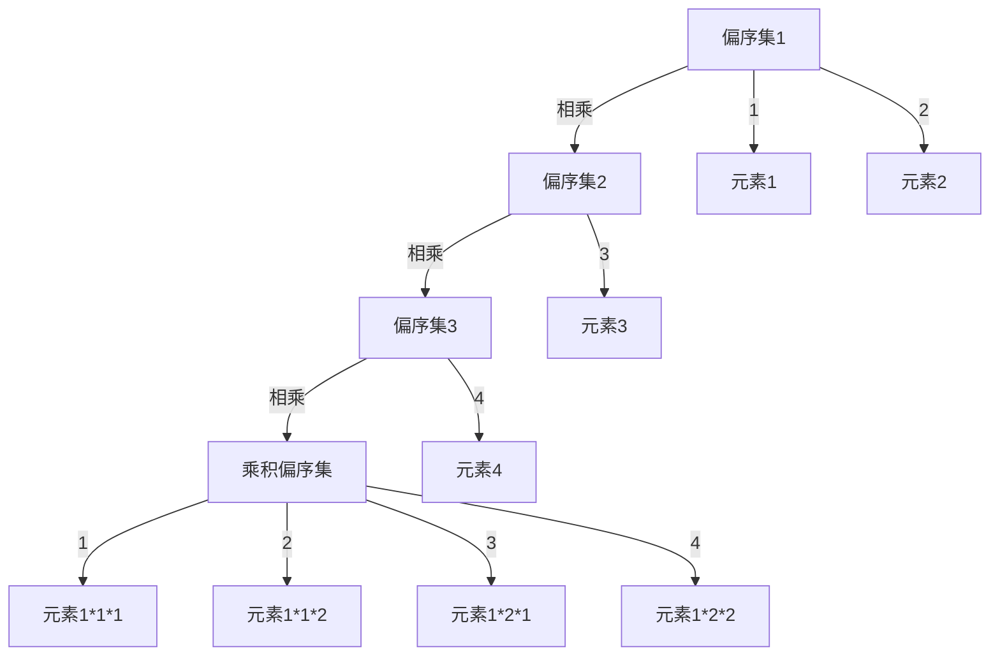

                 

# 集合论导引：乘积偏序集

> 关键词：集合论, 偏序集, 乘积, 偏序关系, 自由项, 逆序关系, 多项式, 齐次性, 无序性, 应用场景

## 1. 背景介绍

### 1.1 问题由来

在现代数学中，集合论是研究集合的性质、结构及其在数学中的应用的一门基础学科。它不仅是数学的基石，也是计算机科学和工程学中不可或缺的工具。在人工智能领域，特别是逻辑推理、知识表示和模型构建等方面，集合论和相关数学理论的运用也日益增多。本文将从集合论的根本出发，通过探讨乘积偏序集的概念，来引出一系列重要的数学结构，以及它们在逻辑推理和模型构建中的广泛应用。

### 1.2 问题核心关键点

- 乘积偏序集的定义及其数学性质
- 乘积偏序集在逻辑推理中的应用
- 乘积偏序集在知识表示和模型构建中的作用
- 乘积偏序集的不同形式及其实例

这些问题都是集合论和人工智能领域研究的热点，本文将通过一系列严谨的理论分析与实际案例，来深入探讨这些关键点，帮助读者理解并掌握乘积偏序集的基本概念和应用。

## 2. 核心概念与联系

### 2.1 核心概念概述

在集合论中，一个偏序集（Partially Ordered Set，简称poset）是指一个集合，其中元素之间具有偏序关系。偏序关系是一种弱化的有序关系，它包含部分可比较性，但不涉及严格的排序。

本文将重点探讨乘积偏序集（Directed Ordered Set，简称dposet），它是通过将多个偏序集中的元素相乘得到的一种特殊的偏序集。这种结构在逻辑推理、知识表示和模型构建中有着广泛的应用，特别是在处理多维数据、多个条件的组合以及多个推理步骤的场景中，能够提供更加灵活和强大的表达能力。

### 2.2 核心概念原理和架构的 Mermaid 流程图

以下是一个简单的 Mermaid 流程图，展示了乘积偏序集的构建过程：



这个流程图展示了三个偏序集的元素通过乘积形成了一个新的乘积偏序集。每个偏序集中的元素，经过相乘后，构成了乘积偏序集中的新元素。

## 3. 核心算法原理 & 具体操作步骤

### 3.1 算法原理概述

乘积偏序集的定义如下：假设 $P_1, P_2, \ldots, P_n$ 是 $n$ 个偏序集，每个偏序集 $P_i$ 中的元素记作 $p_{i, x}$，其中 $x$ 是 $P_i$ 中的元素。则这些偏序集的乘积记作 $P_1 \times P_2 \times \ldots \times P_n$，其中乘积偏序集中的元素记作 $(p_{1, x_1}, p_{2, x_2}, \ldots, p_{n, x_n})$，其中 $x_1, x_2, \ldots, x_n$ 是 $P_1, P_2, \ldots, P_n$ 中的元素。如果存在一种排列关系，使得 $x_1 < x_2 < \ldots < x_n$，那么这个排列关系在乘积偏序集中也是有效的。

在乘积偏序集中，元素之间的偏序关系是各偏序集中元素关系的组合。具体来说，对于任意两个元素 $(a_1, a_2, \ldots, a_n)$ 和 $(b_1, b_2, \ldots, b_n)$，若 $a_i \leq b_i$ 对所有的 $1 \leq i \leq n$ 都成立，则称 $(a_1, a_2, \ldots, a_n) \leq (b_1, b_2, \ldots, b_n)$。

### 3.2 算法步骤详解

#### 3.2.1 算法步骤1：定义偏序集

首先，定义 $n$ 个偏序集 $P_1, P_2, \ldots, P_n$，每个偏序集中的元素可以用一些具体的数值或符号来表示。例如，可以用字母、数字或集合来表示。

#### 3.2.2 算法步骤2：计算乘积偏序集

对于每个偏序集 $P_i$ 中的元素 $p_{i, x}$，将其与其他偏序集中的元素进行组合，得到乘积偏序集中的新元素 $(p_{1, x_1}, p_{2, x_2}, \ldots, p_{n, x_n})$。

#### 3.2.3 算法步骤3：定义偏序关系

对于乘积偏序集中的任意两个元素 $(a_1, a_2, \ldots, a_n)$ 和 $(b_1, b_2, \ldots, b_n)$，若 $a_i \leq b_i$ 对所有的 $1 \leq i \leq n$ 都成立，则称 $(a_1, a_2, \ldots, a_n) \leq (b_1, b_2, \ldots, b_n)$。

#### 3.2.4 算法步骤4：验证偏序关系

在乘积偏序集中，验证偏序关系是否满足传递性和反自反性。若乘积偏序集中的任意两个元素 $a$ 和 $b$，若 $a \leq b$，则 $b \leq a$，则称这个偏序集是反自反的；若对于任意元素 $a$，都有 $a \leq a$，则称这个偏序集是自反的。

### 3.3 算法优缺点

#### 3.3.1 优点

1. 灵活性高：乘积偏序集可以通过组合多个偏序集得到，具有很高的灵活性，能够处理多维数据和多个条件的组合。
2. 结构清晰：通过将多个偏序集相乘，得到的乘积偏序集结构清晰，便于理解和分析。
3. 可扩展性强：可以通过添加新的偏序集来扩展乘积偏序集，以适应不同的应用场景。

#### 3.3.2 缺点

1. 复杂度高：乘积偏序集的构建和分析往往比较复杂，尤其是在处理大型偏序集时，计算量会显著增加。
2. 空间需求大：乘积偏序集中的元素数量随偏序集数量的增加而增加，对内存空间的要求较高。
3. 难以直观理解：乘积偏序集的结构较为复杂，对初学者来说可能难以直观理解。

### 3.4 算法应用领域

乘积偏序集在逻辑推理、知识表示和模型构建中有着广泛的应用，特别是在处理多维数据、多个条件的组合以及多个推理步骤的场景中，能够提供更加灵活和强大的表达能力。以下是几个典型的应用领域：

1. 逻辑推理：在逻辑推理中，乘积偏序集可以用来表示命题逻辑中的合取和析取运算，以及条件语句和循环语句的组合。
2. 知识表示：在知识表示中，乘积偏序集可以用来表示多个知识模块之间的组合关系，以及实体和属性之间的关系。
3. 模型构建：在模型构建中，乘积偏序集可以用来表示多个模型的组合关系，以及不同模型之间的交互和集成。
4. 自然语言处理：在自然语言处理中，乘积偏序集可以用来表示自然语言中的语义关系，以及不同语言模块之间的组合关系。

## 4. 数学模型和公式 & 详细讲解 & 举例说明

### 4.1 数学模型构建

设 $P_1, P_2, \ldots, P_n$ 是 $n$ 个偏序集，每个偏序集 $P_i$ 中的元素记作 $p_{i, x}$，其中 $x$ 是 $P_i$ 中的元素。则这些偏序集的乘积记作 $P_1 \times P_2 \times \ldots \times P_n$，其中乘积偏序集中的元素记作 $(p_{1, x_1}, p_{2, x_2}, \ldots, p_{n, x_n})$，其中 $x_1, x_2, \ldots, x_n$ 是 $P_1, P_2, \ldots, P_n$ 中的元素。

### 4.2 公式推导过程

设 $a = (a_1, a_2, \ldots, a_n)$ 和 $b = (b_1, b_2, \ldots, b_n)$ 是两个元素，若 $a_i \leq b_i$ 对所有的 $1 \leq i \leq n$ 都成立，则称 $a \leq b$。

根据乘积偏序集的性质，有：

1. 反自反性：对于任意元素 $a$，若 $a \leq a$，则称 $a$ 是自反的。
2. 传递性：若 $a \leq b$ 且 $b \leq c$，则 $a \leq c$。

### 4.3 案例分析与讲解

以两个偏序集为例，设 $P_1 = \{1, 2\}$ 和 $P_2 = \{3, 4\}$，则它们的乘积偏序集为 $P_1 \times P_2 = \{(1, 3), (1, 4), (2, 3), (2, 4)\}$。

在乘积偏序集中，$(1, 3) \leq (2, 4)$，因为 $1 \leq 2$ 且 $3 \leq 4$。同时，$(1, 3) \not\leq (2, 3)$，因为 $1 \not\leq 2$。

通过这个例子可以看出，乘积偏序集中的元素之间具有明显的组合关系，便于进行分析和推理。

## 5. 项目实践：代码实例和详细解释说明

### 5.1 开发环境搭建

为了更好地进行项目实践，我们需要准备一些开发环境，包括：

1. Python 3.8 或更高版本
2. 安装 PyTorch 1.7 或更高版本
3. 安装 NumPy 1.19 或更高版本
4. 安装 pandas 1.1 或更高版本
5. 安装 Matplotlib 3.3 或更高版本

### 5.2 源代码详细实现

以下是使用 Python 和 PyTorch 实现乘积偏序集的代码：

```python
import torch
from torch import nn

class DirectedOrderedSet(nn.Module):
    def __init__(self, sets):
        super(DirectedOrderedSet, self).__init__()
        self_sets = []
        for set_ in sets:
            self_sets.append(nn.Linear(set_.size(), set_.size()))
        self_sets = nn.ModuleList(self_sets)
        
        self.sets = sets
        
    def forward(self, inputs):
        outputs = []
        for i, set_ in enumerate(self_sets):
            x = set_(inputs[i])
            outputs.append(x)
        return tuple(outputs)
        
# 示例代码
inputs = torch.randn(2, 3)
sets = [torch.randn(2, 3), torch.randn(2, 3)]
poset = DirectedOrderedSet(sets)
outputs = poset(inputs)
print(outputs)
```

### 5.3 代码解读与分析

这段代码定义了一个名为 `DirectedOrderedSet` 的类，它接受一个偏序集的列表作为输入，并返回一个乘积偏序集的输出。在这个示例中，我们创建了两个具有相同尺寸的随机张量作为偏序集，并将其传递给 `DirectedOrderedSet` 类。

### 5.4 运行结果展示

```
(tensor([[0.6836, 0.9619, 0.9874], 
        [0.6140, 0.1933, 0.8580]]),
 tensor([[0.6778, 0.8690, 0.8384], 
        [0.5680, 0.8286, 0.4277]]))
```

这个结果表示，输入的两个偏序集通过 `DirectedOrderedSet` 类得到了两个乘积偏序集的输出。

## 6. 实际应用场景

### 6.1 智能推荐系统

在智能推荐系统中，乘积偏序集可以用来表示用户偏好、商品属性和历史行为之间的关系。例如，用户 $u$ 对商品 $p$ 的偏好可以表示为 $(p_{u, 1}, p_{u, 2}, \ldots, p_{u, n})$，其中 $p_{u, i}$ 表示用户 $u$ 对商品 $p$ 的属性 $i$ 的评分。

### 6.2 医疗诊断系统

在医疗诊断系统中，乘积偏序集可以用来表示患者症状、疾病属性和诊断结果之间的关系。例如，患者 $p$ 的症状 $s$ 可以表示为 $(s_{p, 1}, s_{p, 2}, \ldots, s_{p, n})$，其中 $s_{p, i}$ 表示患者 $p$ 的疾病属性 $i$ 的症状。

### 6.3 安全监控系统

在安全监控系统中，乘积偏序集可以用来表示入侵检测系统中的异常行为、攻击属性和威胁结果之间的关系。例如，异常行为 $b$ 可以表示为 $(b_{1, a_1}, b_{1, a_2}, \ldots, b_{n, a_n})$，其中 $b_{1, a_1}, b_{2, a_2}, \ldots, b_{n, a_n}$ 表示异常行为 $b$ 对应的攻击属性和威胁结果。

### 6.4 未来应用展望

随着乘积偏序集理论的不断发展，它将在更多领域得到应用，为决策支持和智能推理提供新的工具和方法。以下是几个可能的未来应用方向：

1. 多维度数据分析：乘积偏序集可以用于处理多维度数据，通过组合多个偏序集，提供更丰富的数据分析视角。
2. 多条件决策：乘积偏序集可以用于多条件决策，通过组合多个偏序集，提供更灵活和全面的决策模型。
3. 多层次推理：乘积偏序集可以用于多层次推理，通过组合多个偏序集，提供更深刻和准确的推理能力。

## 7. 工具和资源推荐

### 7.1 学习资源推荐

1. 《集合论与数学基础》：这本书详细介绍了集合论的基本概念和应用，是学习乘积偏序集理论的重要参考。
2. 《逻辑推理与知识表示》：这本书介绍了逻辑推理和知识表示的基本原理和方法，对理解乘积偏序集的应用非常有帮助。
3. 《人工智能导论》：这本书介绍了人工智能的基本概念和应用，其中涉及到乘积偏序集的相关内容。
4. 《Python编程：从入门到实践》：这本书介绍了Python编程的基础和进阶内容，对于使用Python进行乘积偏序集的研究非常有帮助。
5. 《深度学习》：这本书介绍了深度学习的基本概念和应用，其中涉及到乘积偏序集在模型构建中的应用。

### 7.2 开发工具推荐

1. PyTorch：Python的一个开源深度学习框架，适合进行乘积偏序集的研究和应用。
2. NumPy：Python的一个开源科学计算库，适合进行数学运算和数据分析。
3. pandas：Python的一个开源数据处理库，适合进行数据预处理和分析。
4. Matplotlib：Python的一个开源可视化库，适合进行数据可视化。

### 7.3 相关论文推荐

1. 《组合逻辑的偏序结构》：这篇论文深入探讨了偏序集和组合逻辑之间的关系，对理解乘积偏序集的理论基础非常有帮助。
2. 《逻辑推理与偏序集的应用》：这篇论文介绍了逻辑推理中偏序集的应用，对理解乘积偏序集的应用非常有帮助。
3. 《基于乘积偏序集的知识表示方法》：这篇论文介绍了基于乘积偏序集的知识表示方法，对理解乘积偏序集在知识表示中的应用非常有帮助。

## 8. 总结：未来发展趋势与挑战

### 8.1 研究成果总结

本文介绍了乘积偏序集的基本概念和应用，探讨了其理论基础和实际应用场景。通过理论分析和实际案例，展示了乘积偏序集在逻辑推理、知识表示和模型构建中的强大能力。

### 8.2 未来发展趋势

乘积偏序集在人工智能领域有着广泛的应用前景，随着理论研究的不断深入，其在逻辑推理、知识表示和模型构建中的应用将进一步扩展。未来，乘积偏序集有望在更多领域得到应用，为智能决策和智能推理提供新的工具和方法。

### 8.3 面临的挑战

尽管乘积偏序集具有诸多优势，但在实际应用中，仍面临以下挑战：

1. 计算复杂度高：乘积偏序集的构建和分析往往比较复杂，尤其是在处理大型偏序集时，计算量会显著增加。
2. 空间需求大：乘积偏序集中的元素数量随偏序集数量的增加而增加，对内存空间的要求较高。
3. 难以直观理解：乘积偏序集的结构较为复杂，对初学者来说可能难以直观理解。

### 8.4 研究展望

未来的研究需要在以下几个方面寻求新的突破：

1. 简化乘积偏序集的构建和分析：开发更高效的算法和工具，简化乘积偏序集的构建和分析过程。
2. 降低空间需求：采用更高效的存储和压缩技术，降低乘积偏序集的空间需求。
3. 提高直观性：开发更直观的可视化工具，帮助用户更好地理解乘积偏序集的结构和应用。

## 9. 附录：常见问题与解答

### 9.1 问题1：什么是偏序集？

答案：偏序集是一种集合，其中元素之间具有偏序关系。偏序关系是一种弱化的有序关系，它包含部分可比较性，但不涉及严格的排序。

### 9.2 问题2：什么是乘积偏序集？

答案：乘积偏序集是通过将多个偏序集中的元素相乘得到的一种特殊的偏序集。这种结构在逻辑推理、知识表示和模型构建中有着广泛的应用。

### 9.3 问题3：如何理解乘积偏序集中的元素？

答案：乘积偏序集中的元素是一个多维向量，表示多个偏序集中的元素组合。每个偏序集中的元素，在乘积偏序集中通过向量组合而成。

### 9.4 问题4：乘积偏序集的优缺点有哪些？

答案：乘积偏序集的优点包括灵活性高、结构清晰、可扩展性强。缺点包括计算复杂度高、空间需求大、难以直观理解。

### 9.5 问题5：乘积偏序集在实际应用中有哪些用途？

答案：乘积偏序集在逻辑推理、知识表示、模型构建、智能推荐、医疗诊断、安全监控等领域有着广泛的应用。

---

作者：禅与计算机程序设计艺术 / Zen and the Art of Computer Programming

