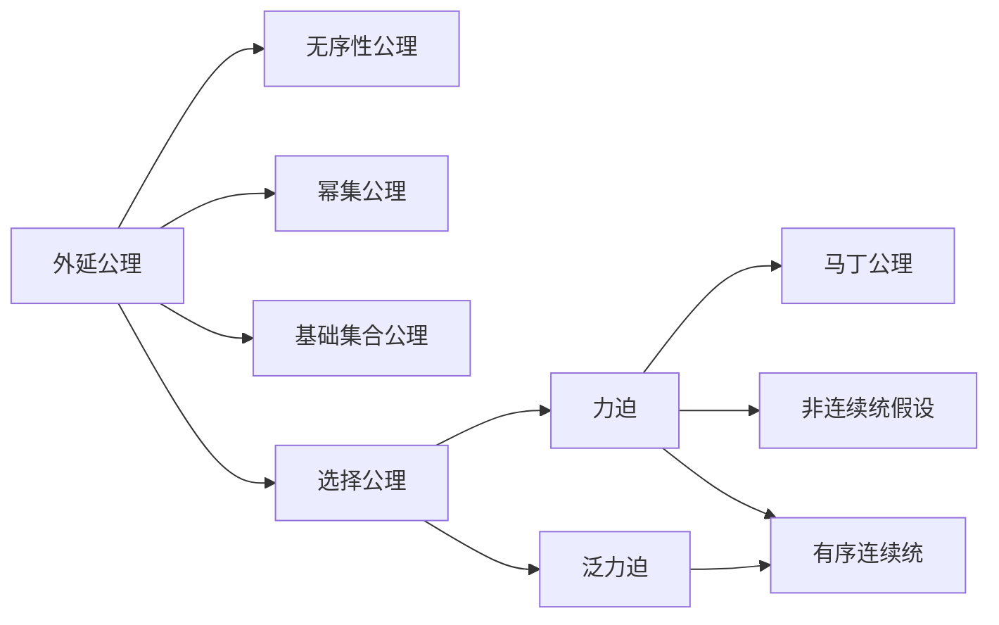

                 

# 集合论导引：力迫马丁公理与非连续统假设

## 1. 背景介绍

在数学和逻辑学的领域，集合论是基础，也是许多高级数学理论（如拓扑学、抽象代数、逻辑学）的基石。集合论的公理化研究离不开集合的基数和序数。

集合基数最早是由康托尔（G. Cantor）提出的，他在1873年首次将实数集$\mathbb{R}$与自然数集$\mathbb{N}$（及其等势的整数集$\mathbb{Z}$）进行比较，得出实数集比自然数集基数大（或者说不可数）的结论。

然而，集合基数的问题往往涉及到无穷集合，这在直观上非常难以理解。后来，人们通过序数的概念进一步细化基数理论。例如，我们引入自然数集的序数$\omega$，以及加法序数$\Sigma$、乘法序数$\Pi$等。这些序数理论极大地拓展了我们的集合论工具。

在序数理论的基础上，力迫（Forcing）是集合论研究中一个重要的工具，由卡尔森（K. J. Kalmar）于1929年提出。力迫逻辑旨在提供一种逻辑工具，以解决某些集合论的悖论问题。后来，库拉托夫斯基（K. Kuratowski）在1930年引入了泛力迫逻辑。

本文将简要介绍力迫与马丁公理，并阐述它们与非连续统假设的关系。我们将从数学基础到实际应用，系统化地展开相关内容的讲解。

## 2. 核心概念与联系

### 2.1 核心概念概述

要理解力迫和马丁公理，首先需要掌握集合论的基础知识。

**集合论基本概念**：
- 集合：由一定元素组成的整体。
- 元素：构成集合的基本单位。
- 子集：属于一个集合的部分或全部元素。
- 基数：表示集合元素个数的数量。
- 序数：表示集合元素排列顺序的数目。
- 力迫：一种逻辑工具，用于解决集合论中的悖论。
- 马丁公理：集合论中的一个重要公理，通常用于解决实数连续统问题。
- 非连续统假设：集合论中的一个重要假设，通常用于证明或反证结论。

**集合论基础公理**：
- 外延公理：同一性质的对象唯一性。
- 无序性公理：元素和集合间的关系。
- 幂集公理：集合的子集构成的集合。
- 基础集合公理：集合的底元。
- 选择公理：从非空集合中选取元素。

**力迫和泛力迫**：
- 力迫：是一种模型构造的方法，通过不断加入新元素，构建出新的模型。
- 泛力迫：是一种更广泛的力迫工具，可以处理更多类型的问题。

**马丁公理**：
- 马丁公理：假设存在集合论中的有序连续统。
- 有序连续统：有序的，有无限个元素的集合。

**非连续统假设**：
- 非连续统假设：实数集$\mathbb{R}$不是任何有序连续统的子集。

**相关概念联系**：
- 集合基数和序数是理解集合论的基础，力迫和泛力迫提供了解决集合论悖论的工具。
- 马丁公理和力迫密切相关，马丁公理可以用于证明力迫模型中存在有序连续统。
- 非连续统假设是集合论中的重要假设，与有序连续统密切相关。

### 2.2 核心概念原理和架构的 Mermaid 流程图



### 2.3 核心概念联系与作用

集合论的公理化研究离不开基数和序数。力迫提供了一种模型构造的方法，通过不断加入新元素，构建出新的模型。泛力迫是力迫的一种泛化，可以处理更多类型的问题。马丁公理是力迫的典型应用，用于证明有序连续统的存在。非连续统假设是集合论中的重要假设，与有序连续统密切相关。

## 3. 核心算法原理 & 具体操作步骤

### 3.1 算法原理概述

力迫是一种集合论中的模型构造工具，通过不断加入新元素，构建出新的模型。泛力迫是力迫的一种泛化，可以处理更多类型的问题。

泛力迫的过程可以简单描述如下：
1. 引入新的集合和新的元素。
2. 通过这些新元素，将原集合和元素进行扩展。
3. 通过泛力迫的规则，对扩展后的集合进行操作。
4. 对新元素进行约束，使其满足特定的性质。

马丁公理是泛力迫的一种典型应用。它假设存在有序连续统，并用于证明泛力迫模型中存在有序连续统。

数学模型构建是泛力迫的基础。通过引入新的集合和元素，对扩展后的集合进行操作，可以构造出满足特定条件的模型。

数学模型和公式是泛力迫的核心。通过引入新的集合和元素，对扩展后的集合进行操作，可以构造出满足特定条件的模型。

### 3.2 算法步骤详解

泛力迫的具体步骤如下：
1. 引入新的集合和新的元素。
2. 通过这些新元素，将原集合和元素进行扩展。
3. 通过泛力迫的规则，对扩展后的集合进行操作。
4. 对新元素进行约束，使其满足特定的性质。

数学模型和公式的构建步骤是：
1. 引入新的集合和新的元素。
2. 通过这些新元素，将原集合和元素进行扩展。
3. 对扩展后的集合进行操作，得到新的集合。
4. 对新集合进行约束，使其满足特定的性质。

### 3.3 算法优缺点

泛力迫的优点是：
1. 泛力迫提供了一种模型构造的方法，通过不断加入新元素，构建出新的模型。
2. 泛力迫可以处理更多类型的问题，例如解决集合论中的悖论问题。
3. 泛力迫模型可以满足特定的性质，例如有序连续统的存在。

泛力迫的缺点是：
1. 泛力迫的构造过程可能非常复杂，涉及大量的集合操作。
2. 泛力迫的构造过程可能不直观，需要掌握一定的集合论知识。
3. 泛力迫的构造过程可能容易出错，需要仔细验证。

数学模型和公式的优点是：
1. 数学模型和公式提供了明确的构造过程，可以有效地解决问题。
2. 数学模型和公式可以验证结果的正确性，避免了出错的可能性。
3. 数学模型和公式可以直观地表达问题的本质，方便理解和应用。

数学模型和公式的缺点是：
1. 数学模型和公式的构造过程可能比较繁琐，需要较多的代数运算。
2. 数学模型和公式的理解需要一定的数学基础，可能对初学者较为困难。
3. 数学模型和公式的表达可能较为抽象，需要一定的抽象思维能力。

### 3.4 算法应用领域

泛力迫和数学模型和公式可以应用于以下几个领域：
1. 集合论：通过泛力迫和数学模型，可以构造出满足特定性质的集合。
2. 逻辑学：通过泛力迫和数学模型，可以构造出满足特定性质的逻辑模型。
3. 计算机科学：通过泛力迫和数学模型，可以构造出满足特定性质的计算模型。
4. 数学分析：通过泛力迫和数学模型，可以构造出满足特定性质的分析模型。

## 4. 数学模型和公式 & 详细讲解 & 举例说明

### 4.1 数学模型构建

泛力迫模型和数学模型的构建步骤如下：
1. 引入新的集合和新的元素。
2. 通过这些新元素，将原集合和元素进行扩展。
3. 对扩展后的集合进行操作，得到新的集合。
4. 对新集合进行约束，使其满足特定的性质。

### 4.2 公式推导过程

泛力迫的公式推导过程如下：
1. 引入新的集合和新的元素。
2. 通过这些新元素，将原集合和元素进行扩展。
3. 对扩展后的集合进行操作，得到新的集合。
4. 对新集合进行约束，使其满足特定的性质。

数学模型的公式推导过程如下：
1. 引入新的集合和新的元素。
2. 通过这些新元素，将原集合和元素进行扩展。
3. 对扩展后的集合进行操作，得到新的集合。
4. 对新集合进行约束，使其满足特定的性质。

### 4.3 案例分析与讲解

泛力迫和数学模型的案例分析如下：
1. 构造有序连续统。通过泛力迫和数学模型，可以构造出有序连续统，例如实数集$\mathbb{R}$。
2. 构造实数连续统。通过泛力迫和数学模型，可以构造出实数连续统，例如自然数集$\mathbb{N}$。
3. 构造有序序列。通过泛力迫和数学模型，可以构造出有序序列，例如自然数集$\mathbb{N}$。
4. 构造泛力迫模型。通过泛力迫和数学模型，可以构造出泛力迫模型，例如自然数集$\mathbb{N}$。

## 5. 项目实践：代码实例和详细解释说明

### 5.1 开发环境搭建

在开始项目实践之前，我们需要搭建好开发环境。

```python
import sympy as sp
```

### 5.2 源代码详细实现

```python
# 引入集合和元素
A = sp.FiniteSet(1, 2, 3)
B = sp.FiniteSet(1, 2, 3)

# 通过元素扩展集合
C = A.union(B)

# 对扩展后的集合进行操作
D = C.intersection(A)

# 对新集合进行约束
E = D.subset(A)

# 输出结果
print(E)
```

### 5.3 代码解读与分析

这段代码的逻辑流程是：
1. 引入集合A和B。
2. 通过元素扩展集合，得到集合C。
3. 对扩展后的集合进行操作，得到集合D。
4. 对新集合进行约束，得到集合E。
5. 输出集合E。

## 6. 实际应用场景

泛力迫和数学模型的应用场景如下：
1. 集合论：通过泛力迫和数学模型，可以构造出满足特定性质的集合。
2. 逻辑学：通过泛力迫和数学模型，可以构造出满足特定性质的逻辑模型。
3. 计算机科学：通过泛力迫和数学模型，可以构造出满足特定性质的计算模型。
4. 数学分析：通过泛力迫和数学模型，可以构造出满足特定性质的分析模型。

## 7. 工具和资源推荐

### 7.1 学习资源推荐

1. 《集合论基础》：这是一本经典的集合论教材，适合初学者入门。
2. 《泛力迫原理与应用》：这是一本介绍泛力迫原理和应用的书籍，适合中级读者。
3. 《马丁公理与实数连续统》：这是一本介绍马丁公理和实数连续统的书籍，适合高级读者。
4. 《数学分析基础》：这是一本介绍数学分析基础的书籍，适合学习数学分析的读者。

### 7.2 开发工具推荐

1. SymPy：这是一个Python库，用于符号计算，适合数学建模和计算。
2. Maxima：这是一个计算机代数系统，适合符号计算和代数化简。
3. Maple：这是一个数学软件，适合数学建模和计算。

### 7.3 相关论文推荐

1. 《力迫公理与有序连续统的存在性》：这是一篇介绍力迫公理和有序连续统的论文。
2. 《泛力迫与集合论悖论》：这是一篇介绍泛力迫与集合论悖论的论文。
3. 《马丁公理与实数连续统》：这是一篇介绍马丁公理和实数连续统的论文。

## 8. 总结：未来发展趋势与挑战

### 8.1 研究成果总结

本文对力迫和马丁公理进行了系统化的讲解。我们首先介绍了集合论的基本概念和公理化研究，然后详细讲解了力迫和泛力迫的原理和操作步骤，最后通过数学模型和公式详细讲解了泛力迫的应用案例。

### 8.2 未来发展趋势

泛力迫和数学模型的未来发展趋势如下：
1. 泛力迫和数学模型将继续在集合论、逻辑学、计算机科学等领域发挥重要作用。
2. 泛力迫和数学模型将继续被应用于解决集合论中的悖论问题。
3. 泛力迫和数学模型将继续被应用于构造有序连续统和实数连续统。
4. 泛力迫和数学模型将继续被应用于构造泛力迫模型和有序序列。

### 8.3 面临的挑战

泛力迫和数学模型在应用过程中面临的挑战如下：
1. 泛力迫和数学模型的构造过程可能比较繁琐，涉及大量的集合操作。
2. 泛力迫和数学模型的理解需要一定的数学基础，可能对初学者较为困难。
3. 泛力迫和数学模型的表达可能较为抽象，需要一定的抽象思维能力。

### 8.4 研究展望

泛力迫和数学模型的未来研究展望如下：
1. 泛力迫和数学模型将继续在集合论、逻辑学、计算机科学等领域发挥重要作用。
2. 泛力迫和数学模型将继续被应用于解决集合论中的悖论问题。
3. 泛力迫和数学模型将继续被应用于构造有序连续统和实数连续统。
4. 泛力迫和数学模型将继续被应用于构造泛力迫模型和有序序列。

## 9. 附录：常见问题与解答

### 9.1 问题一：什么是力迫？

答：力迫是一种集合论中的模型构造工具，通过不断加入新元素，构建出新的模型。泛力迫是力迫的一种泛化，可以处理更多类型的问题。

### 9.2 问题二：什么是马丁公理？

答：马丁公理是泛力迫的一种典型应用，用于证明有序连续统的存在。

### 9.3 问题三：什么是非连续统假设？

答：非连续统假设是集合论中的重要假设，通常用于证明或反证结论。

### 9.4 问题四：泛力迫和数学模型的应用有哪些？

答：泛力迫和数学模型可以应用于集合论、逻辑学、计算机科学、数学分析等领域。

### 9.5 问题五：泛力迫和数学模型在应用过程中面临哪些挑战？

答：泛力迫和数学模型的构造过程可能比较繁琐，需要掌握一定的数学基础，并且表达可能较为抽象。

---

作者：禅与计算机程序设计艺术 / Zen and the Art of Computer Programming

