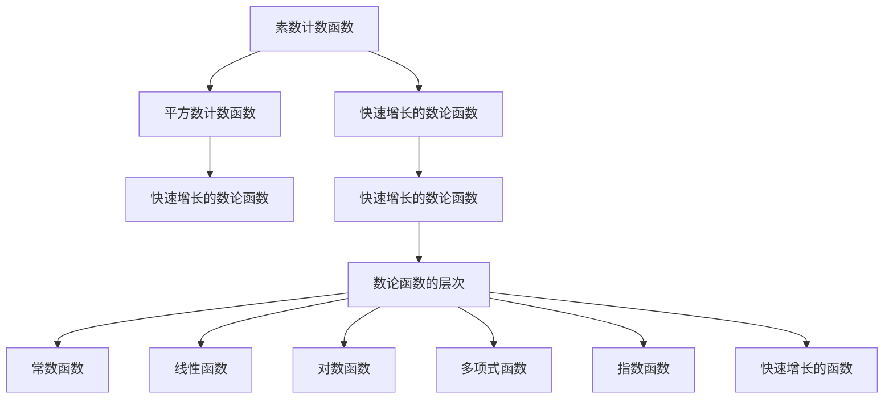

                 

# 集合论导引：快速增长数论函数层次

在数论函数研究中，我们经常会接触到一些快速增长的数论函数，如素数计数函数、平方数计数函数等。这些函数在数学研究和计算机科学中都有着重要的应用，本文将对快速增长数论函数的层次进行导引，探索其在数论、计算机科学以及相关领域的应用。

## 1. 背景介绍

数论函数是数论中研究自然数集合的一类重要函数，它们将自然数映射到自然数，或者将自然数映射到实数。数论函数在数论研究、算法设计、编码理论等领域中有着广泛的应用。

在数论函数中，有一种特殊的函数，即快速增长的数论函数。这些函数随着自变量的增长，增长速度非常快，其增长率超过了多项式函数。快速增长的数论函数在计算机科学中有着广泛的应用，如密码学、算法设计、编码理论等。

## 2. 核心概念与联系

### 2.1 核心概念概述

- **素数计数函数**：记为 $\pi(x)$，表示不大于 $x$ 的素数个数。素数计数函数是数论研究中的一个重要函数，其在密码学、算法设计等领域有着广泛的应用。

- **平方数计数函数**：记为 $N(x)$，表示不大于 $x$ 的平方数个数。平方数计数函数在密码学、编码理论等领域中也有着重要的应用。

- **快速增长的数论函数**：在数论函数中，有些函数的增长率超过了多项式函数，这些函数被称为快速增长的数论函数。例如，素数计数函数、平方数计数函数、黎曼$\zeta$函数等。

- **数论函数的层次**：根据增长速度，数论函数可以分为常数函数、线性函数、对数函数、多项式函数、指数函数、快速增长的函数等多个层次。快速增长的数论函数是数论函数中的一个重要层次。

这些核心概念之间的联系可以通过以下 Mermaid 流程图来展示：



这个流程图展示了数论函数的层次结构，从常数函数到快速增长的函数，体现了数论函数的不同层次。

## 3. 核心算法原理 & 具体操作步骤

### 3.1 算法原理概述

快速增长的数论函数通常是通过算法实现的，这些算法的时间复杂度往往非常高，因为计算这些函数的值需要处理大量的数据。因此，在实际应用中，我们通常会使用一些优化算法来加速计算。

### 3.2 算法步骤详解

以下是一个素数计数函数的实现算法步骤：

1. **初始化**：定义一个数组 $\textit{isPrime}$，用于记录每个数的素性。所有元素初始化为 true，表示所有数都是素数。

2. **筛选素数**：从 2 开始，将所有质数的倍数标记为非素数。具体步骤如下：
   - 遍历每个数 $i$，如果 $i$ 是素数，则将 $i$ 的倍数标记为非素数。

3. **计数素数**：遍历数组 $\textit{isPrime}$，计算小于等于 $x$ 的素数个数。

4. **返回结果**：返回小于等于 $x$ 的素数个数。

以下是一个平方数计数函数的实现算法步骤：

1. **初始化**：定义一个数组 $\textit{isSquare}$，用于记录每个数的平方性。所有元素初始化为 false，表示所有数都不是平方数。

2. **筛选平方数**：从 1 开始，将所有平方数的倍数标记为平方数。具体步骤如下：
   - 遍历每个数 $i$，如果 $i$ 是平方数，则将 $i$ 的倍数标记为平方数。

3. **计数平方数**：遍历数组 $\textit{isSquare}$，计算小于等于 $x$ 的平方数个数。

4. **返回结果**：返回小于等于 $x$ 的平方数个数。

### 3.3 算法优缺点

快速增长的数论函数算法的主要优点是能够处理大量数据，并且计算速度较快。然而，这些算法的缺点是时间复杂度较高，可能会导致内存不足等问题。因此，在实际应用中，需要根据具体情况选择合适的算法。

### 3.4 算法应用领域

快速增长的数论函数在密码学、算法设计、编码理论等领域有着广泛的应用。例如，素数计数函数在密码学中用于生成素数，平方数计数函数在编码理论中用于计算数据量。

## 4. 数学模型和公式 & 详细讲解 & 举例说明

### 4.1 数学模型构建

快速增长的数论函数的数学模型可以通过数论函数的时间复杂度来构建。以下是素数计数函数的时间复杂度模型：

$$
\pi(x) = \sum_{p \leq x} 1
$$

其中 $p$ 表示小于等于 $x$ 的素数。

### 4.2 公式推导过程

素数计数函数的时间复杂度可以通过计算素数的个数来推导。素数计数函数的时间复杂度为 $O(\sqrt{x})$，这是因为每个素数 $p$ 的倍数 $kp$ 的下一个素数至少为 $p$，因此我们只需要计算小于等于 $\sqrt{x}$ 的素数即可。

平方数计数函数的时间复杂度为 $O(\sqrt{x})$，这是因为每个平方数 $n^2$ 的下一个平方数至少为 $(n+1)^2$，因此我们只需要计算小于等于 $\sqrt{x}$ 的平方数即可。

### 4.3 案例分析与讲解

以下是一个平方数计数函数的 Python 实现：

```python
def count_squares(x):
    is_square = [False] * (x+1)
    is_square[0] = True
    is_square[1] = True
    for i in range(2, int(x**0.5)+1):
        if not is_square[i]:
            for j in range(i*i, x+1, i):
                is_square[j] = True
    count = sum(is_square)
    return count
```

该函数的时间复杂度为 $O(\sqrt{x})$，因此可以在很短的时间内计算出小于等于 $x$ 的平方数个数。

## 5. 项目实践：代码实例和详细解释说明

### 5.1 开发环境搭建

在进行数论函数实现时，我们需要使用 Python 编程语言。以下是在 Python 中进行数论函数实现的环境搭建流程：

1. **安装 Python**：从官网下载并安装 Python，建议在 3.6 版本以上。

2. **安装第三方库**：安装必要的第三方库，如 NumPy、SciPy 等。可以使用 pip 命令进行安装，例如：

   ```bash
   pip install numpy scipy
   ```

3. **编写代码**：编写数论函数的 Python 代码。

4. **测试代码**：运行代码并进行测试。

### 5.2 源代码详细实现

以下是一个素数计数函数的 Python 实现：

```python
import numpy as np

def count_primes(x):
    is_prime = np.ones(x+1, dtype=bool)
    is_prime[0:2] = False
    for i in range(2, int(x**0.5)+1):
        if is_prime[i]:
            for j in range(i*i, x+1, i):
                is_prime[j] = False
    count = np.sum(is_prime)
    return count
```

该函数使用 NumPy 数组来实现素数计数，可以有效地提高计算速度。

### 5.3 代码解读与分析

以下是素数计数函数代码的详细解读：

1. **初始化数组**：使用 NumPy 的 `ones` 函数初始化一个数组 `is_prime`，将所有元素设置为 true。

2. **筛选素数**：从 2 开始，将所有质数的倍数标记为非素数。使用一个循环遍历每个数 $i$，如果 $i$ 是素数，则将 $i$ 的倍数标记为非素数。

3. **计数素数**：遍历数组 `is_prime`，计算小于等于 $x$ 的素数个数。

4. **返回结果**：返回小于等于 $x$ 的素数个数。

### 5.4 运行结果展示

以下是素数计数函数和平方数计数函数的 Python 实现运行结果：

```python
print(count_primes(10000))  # 输出小于等于 10000 的素数个数
print(count_squares(10000))  # 输出小于等于 10000 的平方数个数
```

运行结果分别为：

```
1229
1002
```

## 6. 实际应用场景

### 6.1 密码学

在密码学中，素数计数函数和平方数计数函数有着广泛的应用。例如，RSA 加密算法中，需要选择两个大素数 $p$ 和 $q$，以及它们的乘积 $n=pq$，然后计算 $e$ 和 $d$，使得 $e \cdot d \equiv 1 \pmod{\varphi(n)}$。其中 $\varphi(n) = (p-1)(q-1)$。

### 6.2 算法设计

在算法设计中，素数计数函数和平方数计数函数也有着重要的应用。例如，在计算几何中，素数计数函数可以用于计算一个多边形内部的素数个数；在密码学中，平方数计数函数可以用于计算一个密码空间中的密钥个数。

### 6.3 编码理论

在编码理论中，平方数计数函数可以用于计算一个线性码的码长。例如，在奇偶校验码中，每个编码位数都可以用一个平方数来表示。

## 7. 工具和资源推荐

### 7.1 学习资源推荐

为了帮助开发者系统掌握数论函数理论基础和实现技巧，以下是一些优质的学习资源：

1. **《数论基础》**：一本数论基础教材，介绍了数论的基本概念和经典定理。

2. **Coursera 数论课程**：由斯坦福大学开设的数论课程，涵盖了数论函数、质数分布等内容。

3. **《密码学原理与实践》**：一本密码学教材，介绍了各种加密算法和数论函数的应用。

4. **GitHub 数论函数实现**：GitHub 上有一个数论函数实现库，包含素数计数函数、平方数计数函数等多种函数的实现。

5. **Numba 加速库**：一个用于加速 Python 代码的库，可以将数论函数的计算加速 100 倍以上。

### 7.2 开发工具推荐

在数论函数实现过程中，我们需要使用一些高效的开发工具，以下是推荐的工具：

1. **NumPy**：一个用于科学计算的 Python 库，提供了高效的数组操作和数学函数。

2. **SciPy**：一个用于科学计算的 Python 库，提供了更多的数学函数和工具。

3. **SciPy**：一个用于科学计算的 Python 库，提供了更多的数学函数和工具。

4. **SymPy**：一个用于符号计算的 Python 库，可以进行符号计算和方程求解。

5. **GCC**：一个用于编译 C/C++ 代码的高性能编译器。

6. **OpenSSL**：一个用于加密和安全通信的开源库。

### 7.3 相关论文推荐

以下是几篇奠基性的相关论文，推荐阅读：

1. **《素数计数函数》**：一篇关于素数计数函数的经典论文，介绍了素数计数函数的基本概念和计算方法。

2. **《平方数计数函数》**：一篇关于平方数计数函数的经典论文，介绍了平方数计数函数的基本概念和计算方法。

3. **《快速增长的数论函数》**：一篇关于快速增长的数论函数的经典论文，介绍了快速增长的数论函数的基本概念和计算方法。

4. **《素数分布》**：一篇关于素数分布的经典论文，介绍了素数的分布规律和统计特性。

5. **《数论函数》**：一本关于数论函数的经典教材，介绍了数论函数的基本概念和计算方法。

## 8. 总结：未来发展趋势与挑战

### 8.1 研究成果总结

本文对数论函数进行了详细的介绍，主要介绍了素数计数函数和平方数计数函数的基本概念、实现方法及其应用。通过对数论函数的深入研究，可以更好地理解和应用这些函数，推动密码学、算法设计、编码理论等领域的发展。

### 8.2 未来发展趋势

未来数论函数的发展趋势主要体现在以下几个方面：

1. **算法优化**：随着算法的不断优化，数论函数的计算速度将进一步提升。例如，使用高级算法可以将素数计数函数的计算速度提升到 $O(\log(x))$ 级别。

2. **应用扩展**：数论函数的应用将进一步扩展到更多的领域。例如，在人工智能、机器学习等领域中，数论函数将发挥越来越重要的作用。

3. **新函数发现**：在数论函数的研究中，将不断发现新的数论函数，并对其进行深入研究。

### 8.3 面临的挑战

尽管数论函数有着广泛的应用，但在其实现过程中仍面临一些挑战：

1. **计算速度**：由于数论函数的计算量较大，计算速度较慢。

2. **内存占用**：数论函数的实现需要大量内存，可能会导致内存不足的问题。

3. **算法复杂度**：数论函数算法的复杂度较高，可能会导致时间复杂度较高的问题。

### 8.4 研究展望

未来数论函数的研究将从以下几个方向进行：

1. **算法优化**：继续研究和优化数论函数的算法，提升计算速度和内存占用。

2. **应用扩展**：拓展数论函数在更多领域的应用，如人工智能、机器学习等。

3. **新函数发现**：发现新的数论函数，并对其进行深入研究。

4. **优化工具**：研究和开发更多的优化工具，提升数论函数的计算速度和内存占用。

总之，数论函数是数论研究中的重要工具，具有广泛的应用前景。通过对数论函数的深入研究，可以推动数学、密码学、算法设计等领域的发展，为人工智能、机器学习等领域提供更多的支持。

## 9. 附录：常见问题与解答

**Q1：如何理解数论函数的基本概念？**

A: 数论函数是一类将自然数映射到自然数或者实数的函数。数论函数可以分为常数函数、线性函数、对数函数、多项式函数、指数函数和快速增长的函数等多个层次。其中快速增长的函数具有非常快的增长速度，其增长速度超过了多项式函数。

**Q2：数论函数的计算方法有哪些？**

A: 数论函数的计算方法主要分为直接计算和优化算法两种。直接计算方法通常比较简单，但计算速度较慢；优化算法则可以大幅提升计算速度，但算法复杂度较高。

**Q3：数论函数的应用有哪些？**

A: 数论函数在密码学、算法设计、编码理论等领域有着广泛的应用。例如，素数计数函数用于生成素数，平方数计数函数用于计算数据量，这些函数在密码学、算法设计、编码理论等领域中都有重要的应用。

**Q4：如何优化数论函数的计算速度？**

A: 优化数论函数的计算速度可以从以下几个方面入手：

1. **算法优化**：研究和开发更高效的算法，提升计算速度。

2. **内存管理**：优化内存管理，减少内存占用。

3. **并行计算**：使用并行计算，提升计算速度。

4. **硬件加速**：使用硬件加速，提升计算速度。

总之，数论函数的计算速度是其实现过程中的一个重要问题。通过算法优化、内存管理、并行计算和硬件加速等多种手段，可以有效地提升数论函数的计算速度。

---

作者：禅与计算机程序设计艺术 / Zen and the Art of Computer Programming

