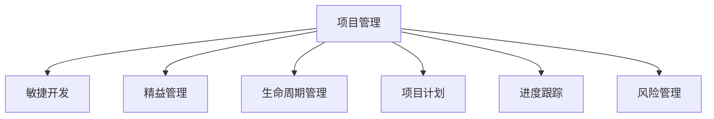

                 

# 项目管理：从启动到收尾的全流程指南

> 关键词：项目管理,敏捷开发,精益管理,生命周期管理,项目计划,进度跟踪,风险管理

## 1. 背景介绍

### 1.1 问题由来
在当今快速变化的商业环境中，项目管理已经成为企业成功的关键因素之一。随着产品迭代速度的加快和市场需求的日益多样化，企业需要更加灵活、高效的项目管理方法来应对挑战。然而，传统的项目管理方式往往存在繁琐、低效、缺乏灵活性的问题，难以满足现代企业的需求。

项目管理是一门科学和艺术，涉及多个学科领域的知识，包括但不限于经济学、管理学、统计学、心理学等。因此，了解和掌握项目管理的基本原则和工具，对于从事IT、商业、工程等领域的专业人士来说尤为重要。

### 1.2 问题核心关键点
项目管理旨在通过有效的计划、执行、监控和控制，确保项目按时、按预算、按质量完成。项目管理的核心包括：
1. 明确目标：确定项目的目标和范围，确保所有人理解项目的目标。
2. 制定计划：制定详细的项目计划，包括时间表、资源分配、风险管理等。
3. 执行和监控：按照计划执行项目，并定期监控项目进度，确保项目按计划推进。
4. 风险管理：识别和应对项目风险，最小化项目的不确定性。
5. 质量控制：确保项目交付物满足质量要求。
6. 沟通管理：确保项目团队成员之间、项目团队和客户之间的有效沟通。
7. 成本管理：控制项目成本，确保项目在预算范围内完成。

本指南将详细阐述从项目启动到收尾的全流程管理，帮助项目经理掌握项目管理的核心技能，提高项目管理的效率和成功率。

## 2. 核心概念与联系

### 2.1 核心概念概述

为更好地理解项目管理流程，本节将介绍几个关键概念及其相互关系：

- **项目管理(PM, Project Management)**：涉及规划、执行、监控和控制项目，以确保项目目标的实现。
- **敏捷开发(Agile Development)**：一种灵活的项目管理方法，强调迭代、反馈和自适应。
- **精益管理(Lean Management)**：旨在消除浪费，提高效率和价值流。
- **生命周期管理(Lifecycle Management)**：涵盖项目从启动到收尾的全过程管理。
- **项目计划(Project Planning)**：制定详细项目计划，包括时间表、资源分配、风险管理等。
- **进度跟踪(Progress Tracking)**：监控项目进度，确保项目按计划推进。
- **风险管理(Risk Management)**：识别和应对项目风险，最小化不确定性。

这些概念通过以下Mermaid流程图进行展示：



该流程图展示了项目管理与敏捷、精益、生命周期、计划、跟踪、风险管理之间的关系：

1. **项目管理**：是敏捷、精益、生命周期管理的核心。
2. **敏捷开发**：强调迭代、反馈和自适应，是项目管理的一种方式。
3. **精益管理**：旨在提高效率和价值流，是项目管理的重要组成部分。
4. **生命周期管理**：涵盖项目从启动到收尾的全过程管理，是项目管理的整体框架。
5. **项目计划**：制定详细项目计划，是项目管理的基础。
6. **进度跟踪**：监控项目进度，是项目管理的执行环节。
7. **风险管理**：识别和应对项目风险，是项目管理的关键环节。

## 3. 核心算法原理 & 具体操作步骤

### 3.1 算法原理概述

项目管理是一个系统化的过程，涉及多个阶段和多个维度的管理。以下是对项目管理核心算法的概述：

- **WBS(Work Breakdown Structure, 工作分解结构)**：将项目分解为更小的可管理单元，以便更好地规划和执行。
- **甘特图(Gantt Chart)**：一种条形图，用于显示项目进度和任务分配。
- **关键路径分析(Critical Path Analysis, CPA)**：识别项目中最长的依赖路径，用于确定项目完成时间。
- **风险矩阵(Risk Matrix)**：通过评估风险的影响和可能性，进行风险分类和优先级排序。
- **挣值管理(Earned Value Management, EVM)**：通过计算已完成工作的价值，评估项目进度和成本。
- **迭代模型(Iterative Model)**：通过多次迭代和反馈，逐步完善项目需求和解决方案。

### 3.2 算法步骤详解

项目管理是一个动态的过程，需要根据项目进展和变化进行调整。以下是对项目管理核心步骤的详细介绍：

**Step 1: 项目启动和规划**
- **定义项目目标和范围**：明确项目的业务目标和范围，确保所有相关方理解并认同。
- **组建项目团队**：选择和组建项目团队，分配任务和职责。
- **制定项目计划**：制定详细的项目计划，包括时间表、资源分配、风险管理等。
- **确定项目里程碑**：确定项目的关键里程碑，用于监控和评估项目进度。

**Step 2: 项目执行和监控**
- **分配任务和资源**：根据项目计划，分配任务和资源。
- **执行项目任务**：按照项目计划执行任务。
- **监控项目进度**：定期检查项目进度，确保项目按计划推进。
- **处理变更请求**：处理项目过程中出现的变更请求，确保项目目标不偏离。

**Step 3: 风险管理**
- **风险识别**：识别项目可能面临的风险，包括技术、资源、时间等。
- **风险评估**：评估风险的影响和可能性，确定风险的优先级。
- **风险应对**：制定应对策略，降低风险影响。

**Step 4: 质量控制**
- **制定质量标准**：确定项目交付物的质量标准。
- **质量检查和验证**：定期检查和验证项目交付物，确保满足质量标准。
- **质量改进**：根据质量检查结果，改进项目流程和交付物质量。

**Step 5: 项目收尾**
- **交付项目成果**：向客户交付项目成果。
- **项目评审和总结**：进行项目评审和总结，评估项目成功因素和改进点。
- **项目文件归档**：归档项目文件和文档，确保项目知识和经验得以保留。

### 3.3 算法优缺点

项目管理算法具有以下优点：
1. **系统性**：通过明确的规划和执行，确保项目有序进行。
2. **灵活性**：可以根据项目进展和变化进行调整。
3. **透明度**：通过文档和进度报告，确保项目进展可追溯。
4. **可控性**：通过风险管理和质量控制，最小化项目不确定性。

同时，项目管理算法也存在以下缺点：
1. **复杂性**：需要系统化的规划和执行，对项目经理的要求较高。
2. **资源消耗**：需要投入大量人力和物力进行规划和监控。
3. **流程僵化**：过度依赖流程可能导致灵活性不足。

### 3.4 算法应用领域

项目管理算法在各种行业和领域都有广泛应用，例如：

- **IT项目**：软件开发、系统集成、网络工程等。
- **建筑项目**：房屋建造、基础设施建设等。
- **制造项目**：生产线升级、设备维护等。
- **商业项目**：市场营销、产品开发等。
- **政府项目**：公共工程、政策制定等。

以上只是项目管理应用的一部分，项目管理的核心价值在于其系统性和灵活性，可以适用于几乎所有需要规划和执行的领域。

## 4. 数学模型和公式 & 详细讲解 & 举例说明

### 4.1 数学模型构建

项目管理涉及多个维度和多个阶段的管理，可以通过数学模型进行系统化分析。以下是对项目管理数学模型的概述：

- **WBS模型**：通过递归分解，将项目分解为更小的可管理单元。
- **甘特图模型**：通过时间线和任务节点，表示项目进度。
- **关键路径模型**：通过依赖关系，确定项目关键路径。
- **风险矩阵模型**：通过风险影响和可能性，进行风险分类和优先级排序。
- **挣值管理模型**：通过计算已完成工作的价值，评估项目进度和成本。

### 4.2 公式推导过程

以下是几个常见的项目管理公式及其推导过程：

**甘特图公式**：
$$
\text{甘特图} = \{(t_i, \text{任务}, p_i)\}_{i=1}^n
$$
其中，$t_i$ 表示任务 $p_i$ 的开始时间，$y_i$ 表示任务 $p_i$ 的完成时间。

**关键路径公式**：
$$
\text{关键路径} = \{\text{任务}\}_{i=1}^n \mid (t_i + d_i) = (t_{i+1} - d_i)
$$
其中，$d_i$ 表示任务 $p_i$ 的持续时间。

**风险矩阵公式**：
$$
R_{ij} = \text{影响} \times \text{可能性}
$$
其中，$R_{ij}$ 表示风险 $i$ 对任务 $j$ 的影响。

**挣值管理公式**：
$$
EV = \sum PV_i \times f_i
$$
其中，$EV$ 表示已完成工作的价值，$PV_i$ 表示任务 $i$ 的计划价值，$f_i$ 表示任务 $i$ 的完成百分比。

### 4.3 案例分析与讲解

**案例1：项目启动和规划**
假设我们要开发一款新的移动应用，需要制定详细的项目计划。以下是项目启动和规划的详细步骤：

1. **定义项目目标和范围**：明确应用的业务目标和功能范围，例如：开发一款在线购物应用，实现用户注册、商品浏览、购物车、结算等功能。
2. **组建项目团队**：选择和组建项目团队，分配任务和职责，例如：UI/UX设计、后端开发、前端开发、测试等。
3. **制定项目计划**：制定详细的项目计划，包括时间表、资源分配、风险管理等。例如：需求收集和分析（2周）、UI/UX设计（4周）、后端开发（8周）、前端开发（6周）、测试（4周）、上线（1周）。
4. **确定项目里程碑**：确定项目的关键里程碑，例如：需求确认、UI设计完成、后端API开发完成、前端原型完成、测试完成、上线。

**案例2：项目执行和监控**
假设我们已经按照项目计划执行到一半，需要监控项目进度和处理变更请求。以下是项目执行和监控的详细步骤：

1. **分配任务和资源**：根据项目计划，分配任务和资源，例如：UI/UX设计完成，开始后端API开发。
2. **执行项目任务**：按照项目计划执行任务，例如：后端API开发（8周）。
3. **监控项目进度**：定期检查项目进度，确保项目按计划推进，例如：每周检查任务完成情况，评估是否存在延误。
4. **处理变更请求**：处理项目过程中出现的变更请求，例如：客户希望增加支付功能，需要额外开发和测试。

**案例3：风险管理**
假设我们识别到项目存在一些风险，需要制定应对策略。以下是风险管理的详细步骤：

1. **风险识别**：识别项目可能面临的风险，例如：技术风险、资源不足、时间紧迫等。
2. **风险评估**：评估风险的影响和可能性，确定风险的优先级，例如：技术风险的可能性高，影响较大，优先级高。
3. **风险应对**：制定应对策略，降低风险影响，例如：引入敏捷开发方法，增加团队资源，调整时间表。

**案例4：质量控制**
假设我们开发完应用后，需要进行质量控制和改进。以下是质量控制的详细步骤：

1. **制定质量标准**：确定应用的质量标准，例如：应用必须稳定、安全、易用。
2. **质量检查和验证**：定期检查和验证应用的性能、安全性、兼容性等，例如：进行单元测试、集成测试、性能测试等。
3. **质量改进**：根据质量检查结果，改进应用的功能和性能，例如：优化性能，修复漏洞，提高用户体验。

**案例5：项目收尾**
假设我们已经完成项目，需要进行收尾工作。以下是项目收尾的详细步骤：

1. **交付项目成果**：向客户交付应用，例如：部署应用到服务器，提供使用文档和技术支持。
2. **项目评审和总结**：进行项目评审和总结，例如：评估项目成功因素和改进点，例如：开发效率高、功能符合客户需求，但需要加强代码质量控制。
3. **项目文件归档**：归档项目文件和文档，例如：代码、需求文档、测试报告等，确保项目知识和经验得以保留。

## 5. 项目实践：代码实例和详细解释说明

### 5.1 开发环境搭建

在进行项目管理实践前，我们需要准备好开发环境。以下是使用JIRA进行项目管理的环境配置流程：

1. 安装JIRA：从官网下载并安装JIRA软件。
2. 创建项目：在JIRA中创建项目，设置项目名称、描述、责任人等。
3. 配置工作流：定义项目的工作流，包括任务状态、任务类型等。
4. 配置权限：为团队成员分配权限，确保项目信息的安全性和隐私性。

完成上述步骤后，即可在JIRA中开始项目管理实践。

### 5.2 源代码详细实现

下面我们以敏捷开发为例，给出使用JIRA进行敏捷开发的项目管理代码实现。

首先，定义敏捷开发的关键元素：

```java
import com.atlassian.jira.rest.client.api.domain.Issue;
import com.atlassian.jira.rest.client.api.domain.Sprint;
import com.atlassian.jira.rest.client.api.domain.Transition;
import com.atlassian.jira.rest.client.api.domain.Version;
import com.atlassian.jira.rest.client.api.domainissuetype.IssueType;
import com.atlassian.jira.rest.client.api.domainstatus.Status;
import com.atlassian.jira.rest.client.api.domaintransition.Transition;
import com.atlassian.jira.rest.client.api.domaintransition.TransitionInput;

import java.net.URI;
import java.net.URISyntaxException;
import java.util.List;
import java.util.stream.Collectors;

public class AgileDevelopment {
    private JIRARestClient jiraClient;
    private String jiraUrl;
    
    public AgileDevelopment(String jiraUrl, JIRARestClient jiraClient) {
        this.jiraUrl = jiraUrl;
        this.jiraClient = jiraClient;
    }
    
    public void createSprint(String sprintName, Version version) {
        Sprint sprint = jiraClient.getMySprints().get(0);
        sprint.setName(sprintName);
        sprint.setVersion(version);
        jiraClient.updateSprint(sprint);
    }
    
    public void addTaskToSprint(Issue issue, Sprint sprint) {
        Issue updatedIssue = jiraClient.transitionIssue(issue, createTransition(issue, sprint));
        jiraClient.updateIssue(updatedIssue);
    }
    
    private Transition createTransition(Issue issue, Sprint sprint) {
        TransitionInput transitionInput = new TransitionInput();
        transitionInput.setToId(Transition.COMPLETE.getId());
        transitionInput.setFromId(Transition.SUBMITTED.getId());
        transitionInput.setComments("Task added to sprint: " + sprint.getName());
        return jiraClient.createTransition(issue, transitionInput);
    }
    
    public void updateSprintStatus(Sprint sprint) {
        Transition transition = jiraClient.getMySprints().get(0).getTransitions().stream()
                                     .filter(t -> t.getName().equals("Done"))
                                     .findFirst()
                                     .orElse(null);
        jiraClient.transitionIssue(sprint.getIssues().get(0), transition);
    }
}
```

然后，定义项目管理所需的接口：

```java
import com.atlassian.jira.rest.client.api.JIRARestClient;
import com.atlassian.jira.rest.client.api.domain.Issue;
import com.atlassian.jira.rest.client.api.domain.Version;
import com.atlassian.jira.rest.client.api.domainissuetype.IssueType;
import com.atlassian.jira.rest.client.api.domainstatus.Status;
import com.atlassian.jira.rest.client.api.domaintransition.Transition;
import com.atlassian.jira.rest.client.api.domaintransition.TransitionInput;
import com.atlassian.jira.rest.client.api.domaintransition.TransitionResult;

import java.net.URI;
import java.net.URISyntaxException;
import java.util.List;
import java.util.stream.Collectors;

public interface AgileDevelopment {
    public void createSprint(String sprintName, Version version);
    public void addTaskToSprint(Issue issue, Sprint sprint);
    public void updateSprintStatus(Sprint sprint);
    public Transition createTransition(Issue issue, Sprint sprint);
}
```

接着，定义JIRA客户端和任务管理：

```java
import com.atlassian.jira.rest.client.api.JIRARestClient;
import com.atlassian.jira.rest.client.api.domain.Issue;
import com.atlassian.jira.rest.client.api.domain.Version;
import com.atlassian.jira.rest.client.api.domainissuetype.IssueType;
import com.atlassian.jira.rest.client.api.domainstatus.Status;
import com.atlassian.jira.rest.client.api.domaintransition.Transition;
import com.atlassian.jira.rest.client.api.domaintransition.TransitionInput;
import com.atlassian.jira.rest.client.api.domaintransition.TransitionResult;

import java.net.URI;
import java.net.URISyntaxException;
import java.util.List;
import java.util.stream.Collectors;

public class JIRAProjectManagement {
    private JIRARestClient jiraClient;
    private String jiraUrl;
    
    public JIRAProjectManagement(String jiraUrl, JIRARestClient jiraClient) {
        this.jiraUrl = jiraUrl;
        this.jiraClient = jiraClient;
    }
    
    public void createIssue(String summary, IssueType issueType, Status status) {
        Issue issue = new Issue();
        issue.setSummary(summary);
        issue.setDescription("Description goes here");
        issue.setAssignee("John Doe");
        issue.setVersion(version);
        issue.setIssueType(issueType);
        issue.setStatus(status);
        issue.setDescription("Description goes here");
        jiraClient.createIssue(issue);
    }
    
    public void updateIssue(Issue issue) {
        jiraClient.updateIssue(issue);
    }
    
    public void closeIssue(Issue issue) {
        jiraClient.closeIssue(issue);
    }
    
    public Issue getIssueById(String issueId) {
        return jiraClient.getIssueById(issueId);
    }
    
    public List<Issue> getIssuesByStatus(String status) {
        return jiraClient.getIssuesByStatus(status);
    }
}
```

最后，启动敏捷开发流程：

```java
import com.atlassian.jira.rest.client.api.JIRARestClient;
import com.atlassian.jira.rest.client.api.domain.Issue;
import com.atlassian.jira.rest.client.api.domain.Version;
import com.atlassian.jira.rest.client.api.domainissuetype.IssueType;
import com.atlassian.jira.rest.client.api.domainstatus.Status;
import com.atlassian.jira.rest.client.api.domaintransition.Transition;
import com.atlassian.jira.rest.client.api.domaintransition.TransitionInput;
import com.atlassian.jira.rest.client.api.domaintransition.TransitionResult;

import java.net.URI;
import java.net.URISyntaxException;
import java.util.List;
import java.util.stream.Collectors;

public class Main {
    public static void main(String[] args) throws URISyntaxException {
        JIRARestClient jiraClient = new JIRARestClient(new URI("https://jira.example.com/rest/api/2"));
        JIRAProjectManagement jiraProjectManagement = new JIRAProjectManagement("https://jira.example.com", jiraClient);
        JIRAProjectManagement jiraManagement = new JIRAProjectManagement("https://jira.example.com", jiraClient);
        
        // 创建任务
        jiraProjectManagement.createIssue("New feature", IssueType.UNSPECIFIED, Status.UNASSIGNED);
        
        // 创建敏捷迭代
        Sprint sprint = new Sprint();
        sprint.setName("Iteration 1");
        sprint.setVersion(version);
        jiraManagement.createSprint(sprint.getName(), version);
        
        // 将任务添加到敏捷迭代中
        jiraManagement.addTaskToSprint(jiraProjectManagement.getIssueById("123"), sprint);
        
        // 更新迭代状态
        jiraManagement.updateSprintStatus(sprint);
        
        // 关闭任务
        jiraProjectManagement.closeIssue(jiraProjectManagement.getIssueById("123"));
    }
}
```

以上就是使用JIRA进行敏捷开发的项目管理代码实现。可以看到，借助JIRA的强大功能，项目管理变得更加高效和灵活。

### 5.3 代码解读与分析

让我们再详细解读一下关键代码的实现细节：

**JIRAProjectManagement类**：
- `createIssue`方法：创建新任务。
- `updateIssue`方法：更新任务。
- `closeIssue`方法：关闭任务。
- `getIssueById`方法：根据ID获取任务。
- `getIssuesByStatus`方法：根据状态获取所有任务。

**AgileDevelopment类**：
- `createSprint`方法：创建敏捷迭代。
- `addTaskToSprint`方法：将任务添加到敏捷迭代中。
- `updateSprintStatus`方法：更新敏捷迭代状态。
- `createTransition`方法：创建任务到敏捷迭代的过渡。

**Main类**：
- `JIRARestClient`：JIRA的REST客户端，用于与JIRA服务器交互。
- `JIRAProjectManagement`：项目管理接口，用于创建、更新、关闭任务。
- `AgileDevelopment`：敏捷开发接口，用于创建、更新、关闭敏捷迭代。

在实际项目中，还可以使用JIRA的更多功能，如任务依赖、任务评论、任务优先级等，进一步提升项目管理效率。

## 6. 实际应用场景

### 6.1 智能客服系统

智能客服系统通过项目管理方法，可以实现对客户咨询的快速响应和处理。在实践中，可以将客服问题分类为不同类型，创建对应的敏捷迭代，定期收集和分析客户反馈，不断优化服务流程和知识库。例如，可以将常见问题创建为固定模板，快速响应，提高客户满意度。

### 6.2 金融舆情监测

金融舆情监测项目通过项目管理方法，可以实时监控市场舆情变化，快速响应和处理潜在的风险。在实践中，可以将舆情分析任务分解为多个子任务，创建敏捷迭代，定期更新舆情报告。例如，可以将舆情分析任务分解为数据采集、情感分析、风险评估等子任务，快速响应舆情变化。

### 6.3 个性化推荐系统

个性化推荐系统通过项目管理方法，可以优化推荐算法，提高用户体验和转化率。在实践中，可以将推荐算法优化任务分解为多个子任务，创建敏捷迭代，定期更新推荐模型。例如，可以将推荐算法优化任务分解为数据清洗、特征工程、模型训练等子任务，快速响应市场变化。

### 6.4 未来应用展望

随着项目管理技术的不断发展，其在更多领域和场景中的应用前景更加广阔。未来，项目管理将与人工智能、物联网、大数据等技术深度融合，带来更多创新应用，例如：

- **AI项目开发**：通过敏捷开发方法，提升AI模型训练和优化的效率。
- **IoT项目实施**：通过精益管理，优化物联网设备和系统的部署和维护。
- **大数据项目分析**：通过生命周期管理，提升大数据项目的数据采集、存储、分析和应用的效率。

## 7. 工具和资源推荐

### 7.1 学习资源推荐

为了帮助开发者系统掌握项目管理的基本原则和工具，这里推荐一些优质的学习资源：

1. 《项目管理实战》系列书籍：由知名项目管理专家撰写，详细介绍项目管理的理论和方法，包含大量实际案例。
2. 《敏捷项目管理》系列书籍：介绍敏捷开发方法和实践，帮助团队快速适应变化，提高项目效率。
3. 《精益管理》系列书籍：介绍精益管理方法和工具，帮助团队消除浪费，提高效率和价值流。
4. 《Scrum敏捷项目管理》系列视频教程：由知名敏捷专家主讲，详细讲解Scrum框架的实施和应用。
5. 《JIRA项目管理》官方文档：JIRA的官方文档，详细介绍JIRA的各种功能和最佳实践。

通过对这些资源的学习实践，相信你一定能够掌握项目管理的基本技能，并用于解决实际的业务问题。

### 7.2 开发工具推荐

高效的开发离不开优秀的工具支持。以下是几款用于项目管理开发的常用工具：

1. JIRA：企业级项目管理工具，支持敏捷、精益、传统等多种项目管理方法。
2. Trello：轻量级项目管理工具，支持看板、列表、卡片等形式的任务管理。
3. Asana：项目管理工具，支持任务分配、进度跟踪、协作等。
4. Microsoft Project：企业级项目管理工具，支持甘特图、关键路径分析等。
5. Smartsheet：在线项目管理工具，支持甘特图、看板、报表等多种视图。

合理利用这些工具，可以显著提升项目管理的工作效率和效果。

### 7.3 相关论文推荐

项目管理是一门跨学科的研究领域，涉及经济学、管理学、统计学、心理学等多个领域。以下是几篇具有代表性的相关论文，推荐阅读：

1. 《项目管理：理论、实践与应用》：介绍项目管理的基本理论和实践方法，涵盖项目计划、进度跟踪、风险管理等。
2. 《敏捷项目管理：理论、实践与应用》：详细介绍敏捷开发方法和实践，帮助团队快速适应变化。
3. 《精益管理：理论、实践与应用》：详细介绍精益管理方法和工具，帮助团队消除浪费，提高效率和价值流。
4. 《关键路径分析：理论、实践与应用》：详细介绍关键路径分析方法，帮助项目管理者优化项目进度和成本。
5. 《风险管理：理论、实践与应用》：详细介绍风险管理方法和工具，帮助项目管理者最小化不确定性。

这些论文代表了大项目管理的研究进展，通过学习这些前沿成果，可以帮助研究者把握学科前进方向，激发更多的创新灵感。

## 8. 总结：未来发展趋势与挑战

### 8.1 总结

本文对从启动到收尾的全流程项目管理方法进行了全面系统的介绍。首先阐述了项目管理的核心概念和基本原则，明确了项目管理的核心任务和流程。其次，从理论到实践，详细讲解了项目管理的关键算法和操作步骤，给出了项目管理任务开发的完整代码实例。同时，本文还探讨了项目管理方法在智能客服、金融舆情、个性化推荐等多个行业领域的应用前景，展示了项目管理方法的巨大潜力。此外，本文精选了项目管理技术的各类学习资源，力求为读者提供全方位的技术指引。

通过本文的系统梳理，可以看到，项目管理方法在复杂多变的商业环境中仍然发挥着不可替代的作用，通过系统化、灵活化的管理，确保项目按时、按预算、按质量完成。未来，伴随项目管理技术的不断演进，项目管理必将在更多领域和场景中发挥重要作用，为企业的持续发展和创新提供坚实保障。

### 8.2 未来发展趋势

展望未来，项目管理技术将呈现以下几个发展趋势：

1. **数字化转型**：通过数字化工具和方法，提升项目管理效率和透明度。
2. **人工智能集成**：通过AI技术优化项目管理流程，提高决策和预测的准确性。
3. **跨领域融合**：将项目管理与AI、IoT、大数据等技术深度融合，提升项目的综合管理能力。
4. **可持续性发展**：将可持续性理念引入项目管理，关注项目的社会、环境影响。
5. **全球化管理**：提升跨文化和跨地域的项目管理能力，适应全球化市场的需求。

### 8.3 面临的挑战

尽管项目管理技术已经取得了显著成果，但在迈向更加智能化、普适化应用的过程中，它仍面临诸多挑战：

1. **复杂性增加**：随着项目管理涉及的领域和技术的复杂性增加，需要更多的专业知识和管理技能。
2. **沟通难度加大**：项目规模和复杂性的增加，导致项目团队之间的沟通难度加大。
3. **资源消耗增加**：大规模项目需要更多的人力和物力资源，成本投入增加。
4. **风险管理困难**：项目规模和复杂性的增加，导致项目风险管理的难度加大。
5. **技术壁垒增加**：项目管理涉及多个学科领域，需要具备综合的技术和管理能力。

### 8.4 研究展望

面对项目管理面临的这些挑战，未来的研究需要在以下几个方面寻求新的突破：

1. **数字化工具的开发和应用**：开发更加智能、易用的项目管理工具，提升项目管理效率。
2. **跨领域技术的融合**：将项目管理与AI、IoT、大数据等技术深度融合，提升项目的综合管理能力。
3. **人工智能的引入**：利用AI技术优化项目管理流程，提高决策和预测的准确性。
4. **全球化管理的研究**：研究如何适应全球化市场的需求，提升跨文化和跨地域的项目管理能力。
5. **可持续性发展的研究**：将可持续性理念引入项目管理，关注项目的社会、环境影响。

这些研究方向将为项目管理技术的发展提供新的思路和方法，推动项目管理技术的不断进步，助力企业在数字化时代中取得更大成功。

## 9. 附录：常见问题与解答

**Q1：如何选择合适的项目管理工具？**

A: 选择合适的项目管理工具需要考虑多个因素，如项目的规模、复杂性、团队分布等。以下是一些建议：

- **看板类工具**：适用于敏捷开发和任务管理，如Trello、JIRA等。
- **甘特图类工具**：适用于传统项目管理，如Microsoft Project、Smartsheet等。
- **综合类工具**：适用于多种项目管理方法，如Asana、Monday.com等。

**Q2：项目管理的核心要素是什么？**

A: 项目管理的核心要素包括以下几点：

1. **明确目标和范围**：确保所有相关方理解并认同项目的目标和范围。
2. **制定详细的项目计划**：包括时间表、资源分配、风险管理等。
3. **执行和监控**：按照项目计划执行任务，并定期监控项目进度。
4. **风险管理**：识别和应对项目风险，最小化不确定性。
5. **质量控制**：确保项目交付物满足质量要求。
6. **沟通管理**：确保项目团队成员之间、项目团队和客户之间的有效沟通。
7. **成本管理**：控制项目成本，确保项目在预算范围内完成。

**Q3：如何处理项目变更请求？**

A: 处理项目变更请求需要遵循以下步骤：

1. **识别变更请求**：收集和记录项目过程中的变更请求。
2. **评估变更影响**：评估变更请求对项目目标、进度、成本的影响。
3. **制定变更计划**：制定变更实施计划，确保变更请求得到妥善处理。
4. **通知相关方**：及时通知相关方变更请求的进展和影响。
5. **执行变更请求**：按照变更计划实施变更请求。
6. **跟踪变更结果**：跟踪变更请求的实施结果，评估其对项目的影响。

**Q4：项目管理中如何进行风险管理？**

A: 项目管理中进行风险管理的步骤包括：

1. **识别风险**：识别项目可能面临的风险，包括技术、资源、时间等。
2. **评估风险**：评估风险的影响和可能性，确定风险的优先级。
3. **制定应对策略**：制定应对策略，降低风险影响，例如：引入敏捷开发方法，增加团队资源，调整时间表。
4. **监控风险**：定期监控项目风险，及时应对新出现的风险。
5. **更新风险管理计划**：根据项目进展和变化，更新风险管理计划，确保风险管理的效果。

**Q5：项目管理中如何进行质量控制？**

A: 项目管理中进行质量控制的步骤包括：

1. **制定质量标准**：确定项目交付物的质量标准。
2. **质量检查和验证**：定期检查和验证项目交付物，确保满足质量标准，例如：进行单元测试、集成测试、性能测试等。
3. **质量改进**：根据质量检查结果，改进项目流程和交付物质量，例如：优化性能，修复漏洞，提高用户体验。

**Q6：项目管理中如何进行进度跟踪？**

A: 项目管理中进行进度跟踪的步骤包括：

1. **制定进度计划**：制定详细的进度计划，包括时间表、资源分配、风险管理等。
2. **监控项目进度**：定期检查项目进度，确保项目按计划推进，例如：每周检查任务完成情况，评估是否存在延误。
3. **更新进度计划**：根据项目进展和变化，更新进度计划，确保项目目标不偏离。
4. **处理进度偏差**：及时处理项目进度偏差，采取措施确保项目按计划推进。

**Q7：项目管理中如何进行成本控制？**

A: 项目管理中进行成本控制的步骤包括：

1. **制定预算**：制定详细的项目预算，包括人工、设备、材料等。
2. **监控成本**：定期监控项目成本，确保项目在预算范围内完成。
3. **控制成本**：采取措施控制成本，例如：优化资源配置，减少浪费，提高效率。
4. **记录成本数据**：记录和分析项目成本数据，评估成本控制的效果。
5. **调整预算**：根据项目进展和变化，调整项目预算，确保项目目标不偏离。

通过这些常见问题的解答，相信你对项目管理有了更全面的理解，并能够在实际项目中灵活应用。

---

作者：禅与计算机程序设计艺术 / Zen and the Art of Computer Programming

