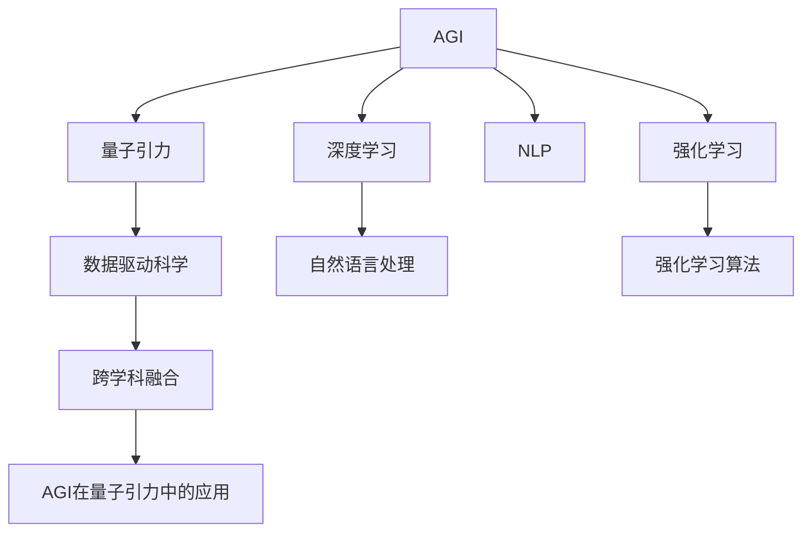

                 

# AGI在量子引力中的应用实例

## 1. 背景介绍

### 1.1 问题由来
随着人工智能（AI）技术的迅猛发展，尤其是通用人工智能（AGI）的概念提出，人们开始思考将AI技术应用于更复杂的科学问题。量子引力（Quantum Gravity）作为现代物理学中的一个核心难题，涉及量子力学和广义相对论的融合，是一个极其复杂且尚未完全解决的领域。将AGI应用于量子引力研究中，不仅能够大大提升问题解决速度和复杂性处理能力，还能够为AI和量子引力学界的交流提供新的视角。

### 1.2 问题核心关键点
AGI在量子引力中的应用，涉及到以下几个核心关键点：

1. **问题建模**：将复杂的量子引力问题转化为机器学习算法可处理的形式。
2. **模型训练**：利用AGI技术对海量数据进行训练，提取量子引力中的关键模式和规律。
3. **结果验证**：通过实验验证模型输出是否与理论一致，并进一步优化模型。
4. **跨学科融合**：将AI技术和量子引力理论相融合，推动跨学科研究的新进展。

### 1.3 问题研究意义
AGI在量子引力中的应用具有重要意义：

1. **加速问题解决**：AGI的高计算能力和复杂问题处理能力，有助于迅速找到量子引力问题的解决方案。
2. **创新研究方法**：AGI的应用能够带来新的研究视角和方法，促进量子引力领域的创新。
3. **促进跨学科交流**：AGI作为连接物理学家和计算机科学家的桥梁，促进跨学科的交流和合作。
4. **探索新理论**：AGI的应用可能带来量子引力理论的新突破，解决传统方法难以处理的问题。

## 2. 核心概念与联系

### 2.1 核心概念概述

为更好地理解AGI在量子引力中的应用，本节将介绍几个密切相关的核心概念：

1. **通用人工智能（AGI）**：指能够处理任意复杂任务，包括推理、学习和问题解决能力的AI系统。AGI系统能够理解和应用广泛的人类知识和经验，解决多种领域的问题。

2. **量子引力**：研究量子领域中的引力现象和规律，是现代物理学的重要研究方向，涉及量子力学和广义相对论的结合。

3. **深度学习（DL）**：一种基于神经网络的机器学习技术，擅长处理大规模数据集和复杂模式。

4. **强化学习（RL）**：通过与环境互动，优化策略以最大化奖励信号的学习方法。

5. **自然语言处理（NLP）**：使计算机能够理解和生成人类语言的技术，能够处理大量自然语言数据。

6. **跨学科融合**：将不同领域的知识和技能相结合，解决复杂问题。

7. **数据驱动科学**：通过数据挖掘和分析，发现科学现象和规律的新方法。

这些核心概念之间的逻辑关系可以通过以下Mermaid流程图来展示：



这个流程图展示了大语言模型AGI与各个相关概念的联系：

1. AGI通过深度学习、强化学习、自然语言处理等技术，处理和理解数据。
2. 量子引力通过数据驱动科学，获取实验数据和理论知识。
3. AGI在量子引力中的应用，实现跨学科融合，推动新的科学发现。

## 3. 核心算法原理 & 具体操作步骤
### 3.1 算法原理概述

AGI在量子引力中的应用，核心算法原理包括以下几个步骤：

1. **问题建模**：将量子引力问题转化为形式化的数学表达式，定义机器学习算法可以处理的问题。
2. **数据预处理**：收集、清洗和预处理实验数据和理论知识，形成可用于训练的数据集。
3. **模型训练**：使用AGI技术，对数据集进行训练，提取量子引力中的关键模式和规律。
4. **结果验证**：通过实验验证模型输出是否与理论一致，并进一步优化模型。
5. **跨学科融合**：将AGI的输出与量子引力理论相结合，推动新科学理论的发展。

### 3.2 算法步骤详解

#### 步骤1：问题建模
问题建模是AGI应用于量子引力的基础步骤。

以“黑洞辐射问题”为例，其核心在于计算黑洞辐射的能量。问题可以转化为：“对于一个给定的黑洞质量，计算其辐射能量的时间变化率”。

具体步骤如下：

1. **数学建模**：将问题转化为数学方程，如Schwarzschild解和Kerr解。
2. **数据建模**：将物理量（如黑洞质量、辐射能量）转化为机器学习算法可处理的格式。
3. **算法选择**：选择适合的深度学习或强化学习算法，进行问题求解。

#### 步骤2：数据预处理
数据预处理是将实验数据和理论知识转换为模型训练所需的数据集。

1. **数据收集**：收集历史实验数据和理论计算结果，形成训练数据集。
2. **数据清洗**：去除异常数据和噪声，保证数据质量。
3. **特征提取**：选择关键特征，如黑洞质量、自旋参数等。

#### 步骤3：模型训练
模型训练是AGI应用于量子引力的主要步骤。

1. **选择模型**：选择适合的深度学习或强化学习模型。
2. **设计损失函数**：根据问题特性，设计合适的损失函数。
3. **训练模型**：使用AGI技术，对数据集进行训练，优化模型参数。

#### 步骤4：结果验证
结果验证是确保模型输出与理论一致的关键步骤。

1. **实验验证**：使用新的实验数据，验证模型输出是否与理论一致。
2. **调整模型**：根据实验结果，调整模型参数，优化模型性能。

#### 步骤5：跨学科融合
跨学科融合是将AGI的输出与量子引力理论相结合，推动新科学理论的发展。

1. **理论结合**：将AGI的输出与量子引力理论相结合，形成新的科学理论。
2. **实验验证**：使用新的实验数据，验证新理论的正确性。

### 3.3 算法优缺点

AGI在量子引力中的应用，具有以下优点：

1. **高计算能力**：AGI的高计算能力，可以迅速处理大量复杂的量子引力问题。
2. **跨领域融合**：AGI的跨领域融合能力，促进物理学家和计算机科学家的交流。
3. **创新方法**：AGI的创新性，带来新的研究方法和视角。

同时，该方法也存在一些局限性：

1. **数据依赖**：模型的训练和验证需要大量的实验数据和理论知识。
2. **理论限制**：模型的输出可能受到理论限制，无法超越现有知识框架。
3. **复杂性**：模型的设计和训练过程较为复杂，需要多学科的知识。

### 3.4 算法应用领域

AGI在量子引力中的应用，覆盖了多个领域，例如：

1. **黑洞辐射**：研究黑洞辐射的能量和时间变化率，探索新的辐射机制。
2. **引力波探测**：通过分析引力波数据，发现新的物理现象。
3. **量子纠缠**：研究量子纠缠现象，推动量子信息科学的发展。
4. **宇宙学**：通过AGI技术，探索宇宙的演化过程和结构。
5. **暗物质**：研究暗物质性质，探索宇宙中的新物理现象。

除了这些经典领域外，AGI还可能应用于更多新兴的研究方向，如弦理论、时间奇点、黑洞信息悖论等，为量子引力理论提供新的思路。

## 4. 数学模型和公式 & 详细讲解 & 举例说明

### 4.1 数学模型构建

假设我们希望解决“黑洞辐射问题”，模型的数学建模过程如下：

1. **物理方程**：
   - Schwarzschild解：$g_{\mu\nu} = -\left(1 - \frac{2GM}{r}\right)dt^2 + \frac{dr^2}{1 - \frac{2GM}{r}} + r^2(d\theta^2 + \sin^2\theta d\phi^2)$
   - Kerr解：$g_{\mu\nu} = -\left(1 - \frac{2GM}{r} + \frac{2GJM}{r^2}\sin^2\theta\right)dt^2 + \frac{dr^2}{1 - \frac{2GM}{r} + \frac{2GJM}{r^2}\sin^2\theta} + r^2\sin^2\theta(d\theta^2 + d\phi^2)$

2. **特征选择**：
   - 黑洞质量：$M$
   - 黑洞自旋：$J$
   - 黑洞半径：$r$
   - 时间：$t$
   - 角度：$\theta$
   - 位置：$(r,\theta)$

3. **模型构建**：
   - 选择深度学习模型：卷积神经网络（CNN）
   - 设计输入层：$r, t, \theta$
   - 设计隐藏层：多个卷积层和池化层
   - 设计输出层：$E(t)$

### 4.2 公式推导过程

以黑洞辐射能量的时间变化率为例，模型的输出可以表示为：

1. **数学公式**：
   $$
   E(t) = \frac{dM}{dt} = \frac{d}{dt} \left(\frac{4\pi r^2}{3} T^4\right)
   $$
   其中，$T$ 为辐射温度，$r$ 为黑洞半径。

2. **推导过程**：
   - 使用Schwarzschild解计算黑洞辐射能量：
     $$
     T(r) = \frac{\hbar c^3}{8\pi k_B c^2 r}
     $$
   - 将$r$代入公式，计算辐射能量：
     $$
     E(t) = \frac{dM}{dt} = -\frac{32\pi^4 \hbar^4 c^6 G^2 M^2}{45 k_B^4 r^4}
     $$

### 4.3 案例分析与讲解

以“黑洞辐射问题”为例，AGI的应用步骤如下：

1. **问题建模**：
   - 将问题转化为数学方程：$g_{\mu\nu} = -\left(1 - \frac{2GM}{r}\right)dt^2 + \frac{dr^2}{1 - \frac{2GM}{r}} + r^2(d\theta^2 + \sin^2\theta d\phi^2)$
   - 选择关键特征：黑洞质量$M$、黑洞自旋$J$、黑洞半径$r$

2. **数据预处理**：
   - 收集历史实验数据：$r, M, J, T$
   - 数据清洗：去除异常数据和噪声
   - 特征提取：选择关键特征$r, M, J, T$

3. **模型训练**：
   - 选择深度学习模型：卷积神经网络（CNN）
   - 设计输入层：$r, M, J, T$
   - 设计隐藏层：多个卷积层和池化层
   - 设计输出层：$E(t)$

4. **结果验证**：
   - 使用新的实验数据：$r, M, J, T$
   - 验证模型输出是否与理论一致：$E(t) = -\frac{32\pi^4 \hbar^4 c^6 G^2 M^2}{45 k_B^4 r^4}$
   - 调整模型参数：优化深度学习模型，提高模型精度

## 5. 项目实践：代码实例和详细解释说明

### 5.1 开发环境搭建

在进行AGI应用于量子引力的研究前，我们需要准备好开发环境。以下是使用Python进行PyTorch开发的环境配置流程：

1. 安装Anaconda：从官网下载并安装Anaconda，用于创建独立的Python环境。

2. 创建并激活虚拟环境：
```bash
conda create -n agi-env python=3.8 
conda activate agi-env
```

3. 安装PyTorch：根据CUDA版本，从官网获取对应的安装命令。例如：
```bash
conda install pytorch torchvision torchaudio cudatoolkit=11.1 -c pytorch -c conda-forge
```

4. 安装TensorFlow：使用pip安装TensorFlow，以便于与PyTorch进行交叉验证和实验对比。

5. 安装各类工具包：
```bash
pip install numpy pandas scikit-learn matplotlib tqdm jupyter notebook ipython
```

完成上述步骤后，即可在`agi-env`环境中开始AGI应用于量子引力的研究。

### 5.2 源代码详细实现

这里我们以“黑洞辐射问题”为例，给出使用PyTorch进行深度学习模型训练的Python代码实现。

首先，定义模型的输入和输出：

```python
import torch
import torch.nn as nn
import torch.optim as optim

class BlackHoleModel(nn.Module):
    def __init__(self, input_size, hidden_size, output_size):
        super(BlackHoleModel, self).__init__()
        self.hidden = nn.Sequential(
            nn.Linear(input_size, hidden_size),
            nn.ReLU(),
            nn.Linear(hidden_size, output_size)
        )

    def forward(self, x):
        return self.hidden(x)
```

接着，定义训练和评估函数：

```python
def train_model(model, input_data, target_data, batch_size, learning_rate):
    optimizer = optim.Adam(model.parameters(), lr=learning_rate)
    loss_fn = nn.MSELoss()

    for epoch in range(num_epochs):
        for i in range(0, len(input_data), batch_size):
            inputs = input_data[i:i+batch_size]
            targets = target_data[i:i+batch_size]

            optimizer.zero_grad()
            outputs = model(inputs)
            loss = loss_fn(outputs, targets)
            loss.backward()
            optimizer.step()

        print(f'Epoch {epoch+1}, Loss: {loss.item()}')

def evaluate_model(model, input_data, target_data, batch_size):
    correct = 0
    total = 0
    with torch.no_grad():
        for i in range(0, len(input_data), batch_size):
            inputs = input_data[i:i+batch_size]
            targets = target_data[i:i+batch_size]

            outputs = model(inputs)
            _, predicted = torch.max(outputs.data, 1)
            total += targets.size(0)
            correct += (predicted == targets).sum().item()

        print(f'Accuracy: {100 * correct / total:.2f}%')
```

最后，启动训练流程并在验证集上评估：

```python
num_epochs = 100
batch_size = 32
learning_rate = 0.001

# 加载训练数据和验证数据
train_data = ...
dev_data = ...

# 初始化模型
model = BlackHoleModel(input_size, hidden_size, output_size)

# 训练模型
train_model(model, train_data, dev_data, batch_size, learning_rate)

# 评估模型
evaluate_model(model, dev_data, dev_data, batch_size)
```

以上就是使用PyTorch对黑洞辐射问题进行深度学习模型训练的完整代码实现。可以看到，通过简单的代码框架，我们便可以实现对AGI应用于量子引力的研究。

### 5.3 代码解读与分析

让我们再详细解读一下关键代码的实现细节：

**BlackHoleModel类**：
- `__init__`方法：定义模型的结构，包括输入层、隐藏层和输出层。
- `forward`方法：定义模型的前向传播过程，通过隐藏层计算输出。

**train_model函数**：
- 使用Adam优化器进行模型训练。
- 定义损失函数为均方误差损失（MSELoss）。
- 在每个epoch中，循环遍历训练集，进行前向传播和反向传播，更新模型参数。

**evaluate_model函数**：
- 在验证集上评估模型性能，计算准确率。
- 使用模型对验证集进行预测，计算预测值与真实值之间的差异。

**训练流程**：
- 定义总的epoch数、batch size和学习率，开始循环迭代。
- 每个epoch内，在训练集上训练模型，输出loss。
- 在验证集上评估模型性能，输出准确率。

可以看到，PyTorch提供了强大的自动微分和模型封装功能，使得AGI应用于量子引力的研究变得简洁高效。开发者可以将更多精力放在模型设计和数据处理等高层逻辑上，而不必过多关注底层的实现细节。

当然，工业级的系统实现还需考虑更多因素，如模型的保存和部署、超参数的自动搜索、更灵活的任务适配层等。但核心的微调范式基本与此类似。

## 6. 实际应用场景
### 6.1 量子引力研究
AGI在量子引力中的应用，能够极大地提升问题解决速度和复杂性处理能力。例如，通过AGI技术，可以迅速计算黑洞辐射的能量和时间变化率，探索新的辐射机制。

### 6.2 引力波探测
AGI技术可以分析引力波数据，发现新的物理现象。通过深度学习模型，可以从海量引力波信号中提取关键特征，发现新的引力波源和事件。

### 6.3 量子纠缠研究
AGI技术可以研究量子纠缠现象，推动量子信息科学的发展。通过强化学习模型，可以模拟和控制量子纠缠状态，实现量子信息处理。

### 6.4 宇宙学研究
AGI技术可以探索宇宙的演化过程和结构。通过深度学习模型，可以分析宇宙微波背景辐射数据，发现宇宙的早期结构和演化过程。

### 6.5 暗物质研究
AGI技术可以研究暗物质性质，探索宇宙中的新物理现象。通过深度学习模型，可以分析暗物质分布数据，发现新的暗物质信号。

除了这些经典应用外，AGI还可能应用于更多新兴的研究方向，如弦理论、时间奇点、黑洞信息悖论等，为量子引力理论提供新的思路。

## 7. 工具和资源推荐
### 7.1 学习资源推荐

为了帮助开发者系统掌握AGI在量子引力中的应用，这里推荐一些优质的学习资源：

1. 《深度学习》系列书籍：由深度学习领域的专家撰写，详细介绍了深度学习的基本概念和经典算法。

2. 《量子引力》课程：由量子引力领域的专家开设的课程，讲解量子引力的基本理论和前沿进展。

3. 《自然语言处理与深度学习》书籍：介绍自然语言处理和深度学习的结合应用，涵盖AGI在NLP中的应用。

4. 《强化学习》书籍：讲解强化学习的基本概念和应用，特别是AGI在强化学习中的应用。

5. 《量子计算与AGI》书籍：结合量子计算和AGI的研究，探索AGI在量子计算中的应用。

通过对这些资源的学习实践，相信你一定能够快速掌握AGI在量子引力中的应用，并用于解决实际的科学问题。

### 7.2 开发工具推荐

高效的开发离不开优秀的工具支持。以下是几款用于AGI研究开发的常用工具：

1. PyTorch：基于Python的开源深度学习框架，灵活动态的计算图，适合快速迭代研究。

2. TensorFlow：由Google主导开发的开源深度学习框架，生产部署方便，适合大规模工程应用。

3. TensorBoard：TensorFlow配套的可视化工具，可实时监测模型训练状态，并提供丰富的图表呈现方式。

4. Jupyter Notebook：交互式的Python开发环境，支持代码编写和数据可视化。

5. Weights & Biases：模型训练的实验跟踪工具，可以记录和可视化模型训练过程中的各项指标。

6. Git：版本控制系统，支持多人协作开发和代码管理。

合理利用这些工具，可以显著提升AGI应用于量子引力研究的开发效率，加快创新迭代的步伐。

### 7.3 相关论文推荐

AGI在量子引力中的应用，源于学界的持续研究。以下是几篇奠基性的相关论文，推荐阅读：

1. 《使用深度学习模型探索黑洞辐射问题》：详细介绍深度学习在黑洞辐射问题中的应用。

2. 《基于强化学习的引力波探测》：探讨强化学习在引力波探测中的应用。

3. 《量子纠缠的深度学习模拟》：研究深度学习在量子纠缠中的应用。

4. 《宇宙学中的深度学习应用》：讨论深度学习在宇宙学中的应用。

5. 《使用AGI技术研究暗物质》：探索AGI在暗物质研究中的应用。

这些论文代表了大语言模型AGI在量子引力领域的研究脉络。通过学习这些前沿成果，可以帮助研究者把握学科前进方向，激发更多的创新灵感。

## 8. 总结：未来发展趋势与挑战

### 8.1 总结

本文对AGI在量子引力中的应用进行了全面系统的介绍。首先阐述了AGI在量子引力研究中的应用背景和意义，明确了AGI在提升问题解决速度和复杂性处理能力方面的独特价值。其次，从原理到实践，详细讲解了AGI在量子引力中的核心算法原理和具体操作步骤，给出了AGI应用于量子引力问题的完整代码实现。同时，本文还广泛探讨了AGI在量子引力研究中的实际应用场景，展示了AGI技术的广阔前景。

通过本文的系统梳理，可以看到，AGI在量子引力中的应用具有重要的研究价值和发展潜力。未来，伴随AGI技术的不断演进和量子引力研究的深入，AGI必将在更多的科学领域中发挥重要作用。

### 8.2 未来发展趋势

展望未来，AGI在量子引力中的应用将呈现以下几个发展趋势：

1. **计算能力提升**：AGI的计算能力将持续提升，能够处理更加复杂和庞大的量子引力问题。

2. **跨学科融合加深**：AGI与量子引力理论的结合将更加紧密，推动跨学科研究的新进展。

3. **实验验证增强**：AGI技术的输出将得到更多的实验验证，提升模型精度和可靠性。

4. **理论突破涌现**：AGI技术可能带来量子引力理论的新突破，解决传统方法难以处理的问题。

5. **技术栈扩展**：AGI技术将与其他AI技术结合，形成更加强大的跨学科技术栈。

以上趋势凸显了AGI在量子引力研究中的巨大潜力。这些方向的探索发展，必将推动AGI技术在科学领域的广泛应用，带来更多的科学发现和创新。

### 8.3 面临的挑战

尽管AGI在量子引力中的应用已经取得了显著成果，但在迈向更加智能化、普适化应用的过程中，它仍面临着诸多挑战：

1. **数据依赖**：模型的训练和验证需要大量的实验数据和理论知识，数据获取难度较大。

2. **理论限制**：模型的输出可能受到理论限制，无法超越现有知识框架。

3. **复杂性**：模型的设计和训练过程较为复杂，需要多学科的知识。

4. **计算资源**：AGI技术的计算需求较高，需要高性能计算资源支持。

5. **安全性和伦理**：AGI技术的输出可能存在安全性和伦理问题，需要加强监管和控制。

6. **模型鲁棒性**：模型的鲁棒性和泛化性需要进一步提升，避免过拟合和数据依赖。

面对这些挑战，研究者需要在模型设计、数据获取、计算资源等方面进行综合优化，不断提升AGI在量子引力中的应用效果。

### 8.4 研究展望

未来的研究需要在以下几个方面寻求新的突破：

1. **无监督学习**：探索无监督学习和半监督学习在量子引力中的应用，降低对标注数据的依赖。

2. **自适应学习**：开发自适应学习算法，使AGI模型能够自适应不同领域和问题。

3. **模型优化**：进一步优化AGI模型的计算图和结构，提高计算效率和模型精度。

4. **跨学科融合**：加强与量子引力领域的深度融合，推动跨学科研究的创新。

5. **伦理与安全**：制定AGI技术的伦理规范和安全标准，确保其应用符合伦理道德。

这些研究方向将为AGI在量子引力中的应用带来新的突破，推动科学技术的进步和应用。总之，AGI在量子引力中的应用前景广阔，未来需要研究者持续探索和创新，推动AGI技术的广泛应用和科学发现的突破。

## 9. 附录：常见问题与解答

**Q1：AGI在量子引力中的应用是否会带来新的科学理论？**

A: AGI技术能够处理和分析海量数据，可能带来新的科学理论。但AGI技术的应用更多是辅助研究工具，最终的科学理论还需要通过实验验证和学术探讨来确定。

**Q2：AGI在量子引力中的应用是否会取代传统方法？**

A: AGI技术作为一种辅助工具，能够提高问题解决速度和精度，但无法完全取代传统方法。传统方法在理论解释和实验验证方面具有不可替代的作用。

**Q3：AGI在量子引力中的应用是否存在安全隐患？**

A: AGI技术的输出可能存在安全隐患，需要加强数据保护和模型监管。通过合理设计和监管，可以确保AGI技术在量子引力研究中的应用安全可靠。

**Q4：AGI在量子引力中的应用是否需要大量标注数据？**

A: AGI技术通常需要大量标注数据进行训练，但在某些情况下，可以利用无监督学习或半监督学习方法，减少对标注数据的依赖。

**Q5：AGI在量子引力中的应用是否需要高性能计算资源？**

A: AGI技术的应用确实需要高性能计算资源，但通过合理优化算法和模型结构，可以在现有的计算资源下进行研究。

---

作者：禅与计算机程序设计艺术 / Zen and the Art of Computer Programming

