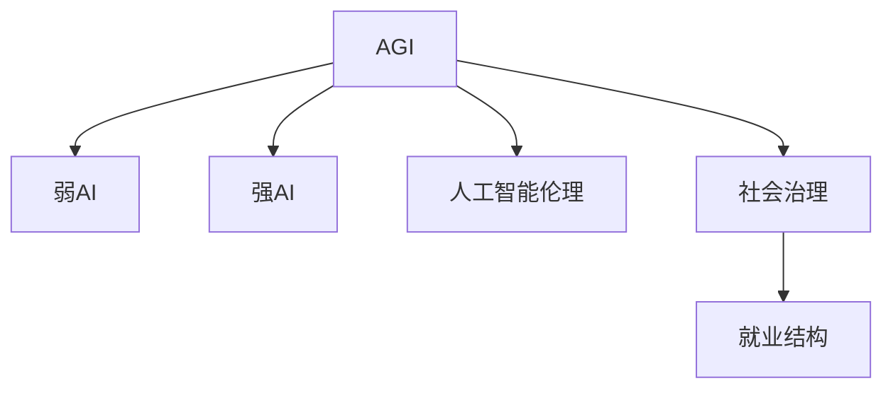

                 

# AGI对社会结构的潜在影响探讨

## 1. 背景介绍

### 1.1 问题由来

随着人工智能(AI)技术的迅猛发展，特别是通用人工智能(AGI)的概念提出，人类社会的各个层面都可能迎来颠覆性的变革。AGI是指具备通用智能、能够解决各种复杂问题的人工智能系统。它的出现将彻底改变我们的工作方式、生活方式、教育方式，甚至是价值观和伦理观。因此，研究AGI对社会结构的潜在影响变得尤为重要。

### 1.2 问题核心关键点

1. **AGI的定义与目标**：AGI的目标是构建能够像人类一样在各种领域（包括科学、艺术、工程等）表现出色的人工智能系统。
2. **AGI的潜力与挑战**：AGI有望带来巨大的经济效益、社会变革，但也面临着伦理、安全、隐私等诸多挑战。
3. **AGI的应用领域**：AGI技术可能在医疗、教育、交通、金融等领域产生深远影响。
4. **社会结构的变化**：AGI的普及将重塑就业结构、教育体系、社会治理等社会结构要素。

## 2. 核心概念与联系

### 2.1 核心概念概述

为更好地理解AGI对社会结构的潜在影响，本节将介绍几个密切相关的核心概念：

- **通用人工智能(AGI)**：指具备通用智能、能够在任何领域进行自主学习和推理的人工智能系统。
- **弱人工智能(Weak AI)**：指专用于特定任务的人工智能系统，如语音识别、图像处理等。
- **强人工智能(Strong AI)**：指与人类智力相当的智能，具有自我意识和创造力。
- **人工智能伦理**：涉及AI技术应用中的道德规范、法律问题、隐私保护等。
- **社会治理**：指政府、企业、个人在共同解决社会问题、维护社会秩序中的协调合作。
- **就业结构**：指不同职业的劳动市场分布，受技术进步和社会需求变化的影响。

这些核心概念之间的逻辑关系可以通过以下Mermaid流程图来展示：



这个流程图展示了一系列概念之间的逻辑关系：

1. AGI是通过弱AI技术逐步发展而来的高级阶段，具备更强的通用智能。
2. 强AI是AGI的终极目标，具有自我意识和创造力。
3. AGI伦理是研究AGI技术应用中可能引发的道德、法律等问题的学科。
4. AGI技术的应用可能影响社会治理结构，改变就业结构，从而重塑社会结构。

## 3. 核心算法原理 & 具体操作步骤

### 3.1 算法原理概述

AGI的构建涉及多个领域的知识，包括计算机科学、认知科学、神经科学、伦理学等。它的算法原理可以概括为：

1. **符号逻辑**：通过逻辑推理和符号计算，实现对复杂问题的解析和解决。
2. **机器学习**：利用大量数据进行训练，学习规则和模式，提升智能水平。
3. **强化学习**：通过试错，不断优化行为策略，提升适应环境的能力。
4. **迁移学习**：在不同领域之间迁移知识，提升AI的通用性。
5. **常识推理**：利用先验知识进行推理和判断，增强智能系统的泛化能力。

### 3.2 算法步骤详解

AGI的构建步骤如下：

**Step 1: 数据获取与预处理**

- 收集大量的多模态数据，包括文本、图像、音频等。
- 对数据进行清洗、标注，构建数据集。

**Step 2: 模型选择与设计**

- 选择合适的AGI框架，如DeepMind的AlphaZero、OpenAI的GPT系列等。
- 设计模块化、可扩展的模型架构，支持多领域应用。

**Step 3: 知识库构建**

- 建立包含知识图谱、规则库等先验知识的知识库。
- 引入领域专家的知识，增强AI的理解和推理能力。

**Step 4: 训练与优化**

- 使用大规模数据进行训练，提升模型的泛化能力。
- 应用先进的优化算法，如梯度下降、遗传算法等，不断优化模型性能。

**Step 5: 测试与验证**

- 在模拟环境中测试AGI系统，评估其智能水平。
- 在实际应用中验证系统的稳定性和鲁棒性。

**Step 6: 部署与应用**

- 将AGI系统集成到生产环境中，进行实际应用。
- 定期更新知识库和模型，保持系统的持续进步。

### 3.3 算法优缺点

AGI的构建面临以下优缺点：

**优点**：
1. **高效智能**：AGI能够处理大规模复杂问题，提高生产效率。
2. **泛化能力强**：能够在多个领域之间迁移知识，具备较高的适应性。
3. **创造力**：具备自我意识和创造力，能够进行创新性思考。

**缺点**：
1. **伦理风险**：AGI可能做出违背人类价值观和道德规范的决策。
2. **安全性**：AGI可能被黑客攻击或滥用，带来安全风险。
3. **就业影响**：AGI可能替代部分工作岗位，导致失业问题。

### 3.4 算法应用领域

AGI技术在多个领域具有广泛的应用前景：

- **医疗**：AGI可用于疾病诊断、药物研发、患者护理等。
- **教育**：AGI可以个性化教学、辅助教师、自动评估等。
- **交通**：AGI可用于自动驾驶、交通管理、智能调度等。
- **金融**：AGI可用于风险评估、投资分析、智能投顾等。
- **制造**：AGI可用于生产优化、故障预测、质量控制等。

## 4. 数学模型和公式 & 详细讲解 & 举例说明

### 4.1 数学模型构建

AGI的构建过程涉及复杂的数学模型，下面简要介绍其中几个关键模型：

1. **神经网络模型**：
   - 神经网络是AGI中最常用的模型，包括前馈神经网络、卷积神经网络、循环神经网络等。
   - 神经网络通过反向传播算法进行训练，最小化损失函数。

2. **强化学习模型**：
   - 强化学习模型通过试错不断优化策略，最大化累积奖励。
   - 常用的强化学习算法包括Q-learning、策略梯度、Actor-Critic等。

3. **知识图谱模型**：
   - 知识图谱模型用于表示和推理知识，常用的模型包括RDF、OWL、Neo4j等。
   - 知识图谱模型能够将知识和逻辑规则融入AI的推理过程中。

### 4.2 公式推导过程

以神经网络模型为例，其基本的训练过程可以表示为：

$$
\min_{\theta} \frac{1}{N} \sum_{i=1}^N \ell(\hat{y}_i, y_i)
$$

其中 $\hat{y}_i$ 表示模型预测的输出，$y_i$ 表示真实标签，$\ell$ 表示损失函数（如均方误差、交叉熵等）。

通过反向传播算法，计算梯度并更新模型参数：

$$
\theta \leftarrow \theta - \eta \nabla_{\theta} \mathcal{L}(\theta)
$$

其中 $\eta$ 为学习率，$\nabla_{\theta} \mathcal{L}(\theta)$ 为损失函数对参数 $\theta$ 的梯度。

### 4.3 案例分析与讲解

以医疗领域的AGI系统为例，其构建过程如下：

1. **数据准备**：收集临床数据、患者记录、医学文献等。
2. **模型选择**：选择适合的神经网络模型，如卷积神经网络用于图像识别，循环神经网络用于序列数据处理。
3. **知识库构建**：建立医学知识图谱，包含疾病、症状、治疗等信息。
4. **训练与优化**：使用大量标注数据进行训练，应用正则化、dropout等技术避免过拟合。
5. **测试与验证**：在模拟环境中测试系统性能，评估其诊断准确率和效率。

## 5. 项目实践：代码实例和详细解释说明

### 5.1 开发环境搭建

在进行AGI项目实践前，我们需要准备好开发环境。以下是使用Python进行PyTorch开发的环境配置流程：

1. 安装Anaconda：从官网下载并安装Anaconda，用于创建独立的Python环境。

2. 创建并激活虚拟环境：
```bash
conda create -n agi-env python=3.8 
conda activate agi-env
```

3. 安装PyTorch：根据CUDA版本，从官网获取对应的安装命令。例如：
```bash
conda install pytorch torchvision torchaudio cudatoolkit=11.1 -c pytorch -c conda-forge
```

4. 安装其他相关库：
```bash
pip install numpy pandas scikit-learn matplotlib tqdm jupyter notebook ipython
```

完成上述步骤后，即可在`agi-env`环境中开始AGI项目实践。

### 5.2 源代码详细实现

下面我们以医疗领域AGI系统为例，给出使用PyTorch进行AGI模型训练的代码实现。

```python
import torch
import torch.nn as nn
import torch.optim as optim
from torch.utils.data import Dataset, DataLoader
from torchvision.transforms import transforms
from torchvision.datasets import CIFAR10

# 定义数据集
class MedicalDataset(Dataset):
    def __init__(self, data, labels, transform=None):
        self.data = data
        self.labels = labels
        self.transform = transform

    def __len__(self):
        return len(self.data)

    def __getitem__(self, idx):
        x = self.data[idx]
        y = self.labels[idx]
        
        if self.transform:
            x = self.transform(x)
            
        return x, y

# 定义模型
class MedicalModel(nn.Module):
    def __init__(self):
        super(MedicalModel, self).__init__()
        self.conv1 = nn.Conv2d(3, 32, kernel_size=3, stride=1, padding=1)
        self.pool = nn.MaxPool2d(kernel_size=2, stride=2)
        self.fc1 = nn.Linear(32 * 8 * 8, 256)
        self.fc2 = nn.Linear(256, 10)

    def forward(self, x):
        x = self.pool(nn.functional.relu(self.conv1(x)))
        x = x.view(x.size(0), -1)
        x = nn.functional.relu(self.fc1(x))
        x = self.fc2(x)
        return x

# 定义损失函数和优化器
model = MedicalModel()
criterion = nn.CrossEntropyLoss()
optimizer = optim.Adam(model.parameters(), lr=0.001)

# 加载数据集
train_dataset = MedicalDataset(train_data, train_labels)
val_dataset = MedicalDataset(val_data, val_labels)

# 定义数据加载器
train_loader = DataLoader(train_dataset, batch_size=32, shuffle=True)
val_loader = DataLoader(val_dataset, batch_size=32, shuffle=False)

# 训练模型
epochs = 10
for epoch in range(epochs):
    model.train()
    train_loss = 0
    train_correct = 0
    for data, target in train_loader:
        data, target = data.to(device), target.to(device)
        optimizer.zero_grad()
        output = model(data)
        loss = criterion(output, target)
        loss.backward()
        optimizer.step()
        train_loss += loss.item()
        _, predicted = torch.max(output.data, 1)
        train_correct += (predicted == target).sum().item()
    train_acc = 100 * train_correct / len(train_loader.dataset)

    model.eval()
    val_loss = 0
    val_correct = 0
    with torch.no_grad():
        for data, target in val_loader:
            data, target = data.to(device), target.to(device)
            output = model(data)
            loss = criterion(output, target)
            val_loss += loss.item()
            _, predicted = torch.max(output.data, 1)
            val_correct += (predicted == target).sum().item()
    val_acc = 100 * val_correct / len(val_loader.dataset)

    print(f'Epoch {epoch+1}, train loss: {train_loss/len(train_loader):.4f}, train acc: {train_acc:.2f}%')
    print(f'Epoch {epoch+1}, val loss: {val_loss/len(val_loader):.4f}, val acc: {val_acc:.2f}%')
```

### 5.3 代码解读与分析

让我们再详细解读一下关键代码的实现细节：

**MedicalDataset类**：
- `__init__`方法：初始化数据和标签，并进行数据增强（如缩放、旋转、裁剪等）。
- `__len__`方法：返回数据集的样本数量。
- `__getitem__`方法：对单个样本进行处理，返回数据和标签。

**MedicalModel类**：
- `__init__`方法：定义模型结构，包括卷积层、池化层、全连接层等。
- `forward`方法：定义前向传播过程，包括卷积、激活、池化、全连接等操作。

**训练函数**：
- 在每个epoch中，对数据集进行前向传播、损失计算、反向传播和参数更新。
- 计算并输出训练集和验证集的损失和准确率。

**代码执行结果**：
- 输出每个epoch的训练和验证集损失及准确率，评估模型性能。

## 6. 实际应用场景

### 6.1 医疗领域

AGI技术在医疗领域具有广泛的应用前景，可以帮助医生诊断疾病、制定治疗方案、辅助手术等。例如，AGI可以通过分析病人的病历、影像数据等，快速识别出患者的病情和可能的病因，并给出诊断建议和治疗方案。AGI还可以在手术过程中辅助医生，提供实时建议和指导，提高手术成功率和安全性。

### 6.2 教育领域

AGI在教育领域的应用主要包括个性化学习、智能评估、知识生成等。通过AGI技术，可以构建智能教学系统，根据学生的学习情况和兴趣，提供个性化的学习内容和进度安排。AGI还可以用于自动化评估学生的作业和考试，提供及时反馈，提升学习效果。此外，AGI还可以生成教学内容，帮助教师准备和优化课程。

### 6.3 交通领域

AGI在交通领域的应用主要包括自动驾驶、智能交通管理、路径规划等。通过AGI技术，可以实现自动驾驶车辆的安全导航和避障，优化交通流量，减少交通拥堵。AGI还可以用于智能交通管理，预测交通状况，优化信号灯控制，提高交通效率。

### 6.4 金融领域

AGI在金融领域的应用主要包括风险评估、投资分析、智能投顾等。通过AGI技术，可以分析市场数据，预测股票、期货等金融产品的走势，提供投资建议。AGI还可以用于风险评估，识别潜在的金融风险，制定风险控制策略。此外，AGI还可以用于智能投顾，帮助客户制定投资组合，优化投资收益。

## 7. 工具和资源推荐

### 7.1 学习资源推荐

为了帮助开发者系统掌握AGI的理论基础和实践技巧，这里推荐一些优质的学习资源：

1. 《Deep Learning》书籍：由Ian Goodfellow、Yoshua Bengio和Aaron Courville合著，全面介绍了深度学习的基本原理和应用。
2. 《Human-AI Collaboration》系列文章：由AI专家讨论AGI对人类社会的影响，涵盖伦理、法律、隐私等多个方面。
3. 《Superintelligence》书籍：由Nick Bostrom撰写，探讨了AGI技术的潜在风险和应对策略。
4. Stanford AI Lab的AGI课程：介绍了AGI技术的各个方面，包括符号逻辑、知识图谱、自然语言处理等。
5. AI for Everyone：由Andrew Ng教授主讲的在线课程，适合初学者了解AI的基础知识和应用场景。

通过对这些资源的学习实践，相信你一定能够快速掌握AGI的精髓，并用于解决实际的AI问题。

### 7.2 开发工具推荐

高效的开发离不开优秀的工具支持。以下是几款用于AGI开发的常用工具：

1. PyTorch：基于Python的开源深度学习框架，灵活动态的计算图，适合快速迭代研究。
2. TensorFlow：由Google主导开发的开源深度学习框架，生产部署方便，适合大规模工程应用。
3. TensorFlow Probability：TensorFlow的分布式统计计算库，适用于概率图模型和统计推断。
4. JAX：基于JIT编译和自动微分技术的深度学习框架，支持可重构计算，适用于高效模型训练。
5. HuggingFace Transformers：提供了包括BERT、GPT、T5等在内的SOTA预训练模型，方便进行AGI项目开发。

合理利用这些工具，可以显著提升AGI项目的开发效率，加快创新迭代的步伐。

### 7.3 相关论文推荐

AGI技术的发展源于学界的持续研究。以下是几篇奠基性的相关论文，推荐阅读：

1. AlphaZero：DeepMind开发的AGI系统，通过强化学习在多个游戏中战胜人类顶尖选手。
2. ELIZA：早期开发的AGI系统，通过规则和知识库实现自然语言对话。
3. BERT：Google开发的预训练语言模型，为AGI系统提供了强大的自然语言处理能力。
4. GPT-3：OpenAI发布的超大规模预训练语言模型，展示了AGI系统的潜力。
5. GPT-3与GPT-2的对比：探讨了预训练模型规模与性能的关系，指出了大模型在AGI构建中的重要性。

这些论文代表了大AI技术的发展脉络。通过学习这些前沿成果，可以帮助研究者把握学科前进方向，激发更多的创新灵感。

## 8. 总结：未来发展趋势与挑战

### 8.1 总结

本文对AGI对社会结构的潜在影响进行了全面系统的探讨。首先阐述了AGI的定义、目标和应用领域，明确了AGI技术在医疗、教育、交通、金融等多个领域的前景。其次，从原理到实践，详细讲解了AGI构建的数学模型和算法步骤，给出了AGI模型训练的代码实现。同时，本文还探讨了AGI技术在实际应用中的诸多场景，展示了AGI技术在现实世界中的巨大潜力。

通过本文的系统梳理，可以看到，AGI技术在构建人机协同的智能时代中扮演越来越重要的角色，其广泛应用将带来深刻的经济和社会变革。未来，伴随AGI技术的不断进步，我们有望看到更多智能系统在各个领域的大规模落地，为人类的生产生活方式带来革命性的影响。

### 8.2 未来发展趋势

展望未来，AGI技术的发展趋势如下：

1. **多模态融合**：AGI系统将越来越多地融合视觉、听觉、触觉等多种模态数据，提升智能系统的感知和理解能力。
2. **知识图谱构建**：知识图谱将成为AGI系统的重要组成部分，帮助AGI系统理解复杂的世界知识和逻辑关系。
3. **泛化能力提升**：AGI系统将具备更强的泛化能力，能够适应不同的环境和任务，提升智能系统的适应性和通用性。
4. **自我学习**：AGI系统将具备自我学习和自我改进的能力，能够在实际应用中不断优化性能。
5. **伦理与安全**：AGI系统将面临更多的伦理和安全性挑战，需要建立更加完善的技术标准和监管机制。

### 8.3 面临的挑战

尽管AGI技术具有巨大的潜力，但在迈向广泛应用的过程中，仍面临诸多挑战：

1. **伦理问题**：AGI系统可能会做出违背人类价值观和伦理规范的决策，如隐私泄露、歧视等问题。
2. **安全问题**：AGI系统可能被黑客攻击或滥用，带来严重的安全风险。
3. **技术复杂性**：AGI系统的构建涉及多个领域的知识，需要跨学科的协同合作。
4. **数据隐私**：AGI系统的训练和应用需要大量的数据，涉及隐私保护问题。
5. **社会适应**：AGI系统可能会带来就业结构的变化，导致部分人群的失业问题。

### 8.4 研究展望

面向未来，AGI技术的研究展望如下：

1. **跨领域知识融合**：AGI系统将更多地融合不同领域知识，提升跨领域迁移能力。
2. **智能系统协作**：AGI系统将与人类和其他AI系统进行协同合作，提升整体系统的智能水平。
3. **人机共生**：AGI系统将成为人类社会的辅助工具，提升工作效率和生产力。
4. **伦理与法规**：建立AGI技术的伦理和法规标准，确保其应用符合社会价值观和法律要求。

这些研究方向的探索发展，必将引领AGI技术迈向更高的台阶，为构建安全、可靠、可解释、可控的智能系统铺平道路。面向未来，AGI技术还需要与其他人工智能技术进行更深入的融合，如知识表示、因果推理、强化学习等，多路径协同发力，共同推动自然语言理解和智能交互系统的进步。

## 9. 附录：常见问题与解答

**Q1：AGI的定义是什么？**

A: AGI是指具备通用智能、能够在任何领域进行自主学习和推理的人工智能系统。

**Q2：AGI的应用领域有哪些？**

A: AGI技术在医疗、教育、交通、金融等多个领域具有广泛的应用前景，可以帮助医生诊断疾病、辅助教学、优化交通、进行投资分析等。

**Q3：AGI的构建过程中需要注意哪些问题？**

A: 在构建AGI系统时，需要注意伦理、安全、隐私等问题。同时，需要引入领域专家的知识，建立知识图谱，进行多模态融合，提高系统的智能水平。

**Q4：AGI的构建过程中如何使用数据？**

A: AGI的构建需要大量的标注数据，通过数据增强、迁移学习等技术，提升系统的泛化能力和适应性。

**Q5：AGI的伦理问题有哪些？**

A: AGI系统可能会做出违背人类价值观和伦理规范的决策，如隐私泄露、歧视等问题。因此，需要建立伦理和法规标准，确保其应用符合社会价值观和法律要求。

---

作者：禅与计算机程序设计艺术 / Zen and the Art of Computer Programming

