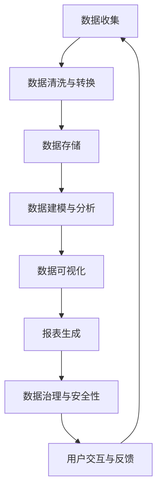

                 

# AI DMP 数据基建：数据可视化与报表

> 关键词：AI DMP, 数据可视化, 报表, 数据基础设施, 数据分析, 大市场营销, 个性化营销, 用户行为分析

## 1. 背景介绍

### 1.1 问题由来

在数字化营销领域，数据驱动决策变得越来越重要。随着消费者行为日益数字化，数据成为企业洞察用户、优化营销策略的关键资产。然而，数据量的爆炸式增长和多样性，使得数据管理和分析变得异常复杂。AI DMP（AI Data Management Platform）作为数据基建的一部分，旨在通过自动化、智能化手段，管理和分析海量数据，提供个性化的营销洞察和决策支持。

数据可视化与报表作为AI DMP的重要功能，能够将复杂的数据转换为直观、易懂的图表和报告，帮助企业、营销人员和数据分析师快速理解和利用数据。本文章旨在介绍基于数据可视化和报表构建的AI DMP数据基建，涵盖其原理、操作步骤、应用案例及未来趋势。

### 1.2 问题核心关键点

数据可视化和报表的核心关键点包括：
- 数据收集与处理：从各种数据源收集原始数据，并进行清洗、转换和标准化处理。
- 数据建模与分析：利用机器学习、统计分析等方法，对数据进行建模和分析，提取有价值的洞察。
- 报表生成与展示：将分析结果转化为易于理解的图表、报告，支持决策。
- 数据治理与安全性：确保数据质量、完整性、隐私保护和合规性。
- 用户交互与反馈：提供用户友好的界面，支持用户互动和反馈，迭代改进系统。

这些关键点共同构成了数据可视化和报表系统的核心功能，使其能够有效支持个性化营销策略的制定和实施。

### 1.3 问题研究意义

AI DMP数据基建中的数据可视化和报表功能，对企业运营具有重要意义：

1. **提高决策效率**：通过直观的数据展示和分析，帮助决策者快速理解和利用数据，提升决策速度和准确性。
2. **增强洞察能力**：报表和可视化工具能够揭示数据中的潜在模式和趋势，提供深入的洞察，支持战略规划和战术执行。
3. **优化营销效果**：数据可视化可以帮助营销人员理解用户行为，识别目标群体，制定更加精准的营销策略。
4. **促进数据治理**：通过规范化和自动化数据处理流程，提高数据质量，保护用户隐私，确保数据合规。
5. **推动业务创新**：可视化和报表功能提供实时的数据支持，助力企业在竞争激烈的市场中保持创新和领先。

## 2. 核心概念与联系

### 2.1 核心概念概述

AI DMP 数据基建中的数据可视化与报表功能，涉及多个核心概念：

- **AI DMP**：人工智能驱动的数据管理平台，通过自动化、智能化的手段管理和分析用户数据。
- **数据可视化**：将数据转换为图形、图表等形式，帮助用户直观理解数据。
- **报表生成**：利用数据可视化技术生成结构化的报告，支持决策支持。
- **数据基础设施**：包括数据收集、存储、处理、治理等，支持数据可视化和报表功能的实现。

这些概念之间通过数据流动和技术手段相互连接，共同构成数据可视化和报表系统的完整架构。

### 2.2 核心概念原理和架构的 Mermaid 流程图



这个流程图展示了数据从收集到处理，再到分析和展示的完整流程。每个环节通过技术手段相互连接，支持数据可视化和报表功能的实现。

## 3. 核心算法原理 & 具体操作步骤

### 3.1 算法原理概述

AI DMP数据基建中的数据可视化和报表功能，基于以下算法原理：

- **数据清洗与转换**：使用ETL（Extract, Transform, Load）工具，对原始数据进行清洗、转换和标准化处理，确保数据质量。
- **数据建模与分析**：利用机器学习、统计分析等方法，对清洗后的数据进行建模和分析，提取有价值的洞察。
- **数据可视化**：使用图表、仪表盘等可视化工具，将分析结果转化为直观易懂的图形。
- **报表生成**：将可视化图表和分析结果整合到结构化的报告中，支持决策支持。

### 3.2 算法步骤详解

#### 3.2.1 数据收集与清洗

1. **数据收集**：
   - 收集各种数据源的数据，如Web行为、社交媒体数据、交易数据等。
   - 使用API、爬虫等工具从不同平台抓取数据。

2. **数据清洗**：
   - 去除重复、缺失、异常数据。
   - 标准化数据格式，如日期格式、单位统一等。

3. **数据转换**：
   - 将原始数据转换为适合分析的格式。
   - 如将文本数据转换为数值型特征，使用编码等方法。

#### 3.2.2 数据建模与分析

1. **数据预处理**：
   - 进行特征工程，提取、选择、转换特征。
   - 使用数据增强技术，如填充缺失值、生成合成样本等。

2. **数据建模**：
   - 使用机器学习算法，如线性回归、决策树、随机森林等，进行建模。
   - 使用深度学习算法，如神经网络、卷积神经网络等，进行复杂分析。

3. **数据分析**：
   - 利用统计分析方法，如聚类、关联规则等，发现数据中的模式和趋势。

#### 3.2.3 数据可视化

1. **选择合适的可视化工具**：
   - 根据数据类型和分析目标，选择适合的数据可视化工具，如Tableau、Power BI、Matplotlib等。

2. **创建可视化图表**：
   - 利用可视化工具创建图形、仪表盘等可视化图表。
   - 如使用折线图展示时间序列变化，使用柱状图展示数据分布等。

3. **交互式可视化**：
   - 支持用户交互，通过拖动、选择等方式，动态展示和分析数据。

#### 3.2.4 报表生成

1. **生成结构化报告**：
   - 将可视化图表和分析结果整合到结构化报告中，如PDF、Excel等。
   - 使用模板或自定义方式，生成格式统一的报告。

2. **自动化报告生成**：
   - 设置自动化生成报表的流程，如定期生成、触发生成等。
   - 集成到自动化工作流中，支持系统化的决策支持。

### 3.3 算法优缺点

#### 3.3.1 优点

1. **提高决策效率**：直观的数据展示和分析，帮助快速理解数据，提升决策速度和准确性。
2. **增强洞察能力**：揭示数据中的潜在模式和趋势，提供深入的洞察，支持战略规划和战术执行。
3. **优化营销效果**：帮助营销人员理解用户行为，识别目标群体，制定更加精准的营销策略。
4. **推动业务创新**：提供实时的数据支持，助力企业在竞争激烈的市场中保持创新和领先。

#### 3.3.2 缺点

1. **数据质量依赖**：数据质量直接影响分析和展示结果，数据清洗和转换需要花费大量时间和精力。
2. **分析复杂度高**：数据量大、结构复杂，进行深入分析需要高水平的专业知识和技能。
3. **用户交互复杂**：交互式可视化需要开发复杂的交互功能，提高系统复杂度。
4. **安全性问题**：处理大量敏感数据，需要严格的数据治理和隐私保护措施。

### 3.4 算法应用领域

AI DMP数据基建中的数据可视化和报表功能，适用于多个应用领域：

1. **大市场营销**：帮助企业制定和优化营销策略，提升广告投放效果和ROI。
2. **个性化营销**：利用用户行为数据，提供个性化的产品推荐和广告推送。
3. **用户行为分析**：分析用户行为数据，识别用户偏好和需求，提升用户体验和满意度。
4. **市场趋势预测**：通过历史数据和实时数据，预测市场趋势和用户行为变化，支持决策支持。
5. **企业运营优化**：支持企业运营的各个环节，如库存管理、供应链优化等。

## 4. 数学模型和公式 & 详细讲解 & 举例说明

### 4.1 数学模型构建

#### 4.1.1 数据预处理

1. **数据清洗**：
   - 去除重复、缺失、异常数据。
   - 使用Python的Pandas库进行数据清洗和转换。

   ```python
   import pandas as pd

   # 读取数据
   df = pd.read_csv('data.csv')
   
   # 去除重复数据
   df.drop_duplicates(inplace=True)
   
   # 处理缺失值
   df.fillna(method='ffill', inplace=True)
   ```

2. **数据转换**：
   - 将原始数据转换为适合分析的格式。
   - 使用数据增强技术，如填充缺失值、生成合成样本等。

   ```python
   # 数据类型转换
   df['date'] = pd.to_datetime(df['date'], format='%Y-%m-%d')
   
   # 生成合成样本
   df = df.dropna().drop_duplicates().reset_index(drop=True)
   df = df.append(pd.DataFrame([df.iloc[-1]] * 100), ignore_index=True)
   ```

#### 4.1.2 数据建模

1. **特征工程**：
   - 提取、选择、转换特征。
   - 使用Python的Scikit-learn库进行特征工程。

   ```python
   from sklearn.preprocessing import StandardScaler, OneHotEncoder
   
   # 特征选择
   features = ['date', 'city', 'age', 'gender', 'income', 'click_rate']
   X = df[features]
   
   # 数据标准化
   scaler = StandardScaler()
   X_scaled = scaler.fit_transform(X)
   
   # 数据编码
   encoder = OneHotEncoder(sparse=False)
   X_encoded = encoder.fit_transform(df[['city', 'gender']])
   ```

2. **模型选择**：
   - 使用机器学习算法，如线性回归、决策树、随机森林等。
   - 使用深度学习算法，如神经网络、卷积神经网络等。

   ```python
   from sklearn.linear_model import LinearRegression
   from sklearn.ensemble import RandomForestRegressor
   from sklearn.model_selection import train_test_split
   
   # 划分训练集和测试集
   X_train, X_test, y_train, y_test = train_test_split(X_scaled, df['conversion_rate'], test_size=0.2, random_state=42)
   
   # 线性回归模型
   lr = LinearRegression()
   lr.fit(X_train, y_train)
   ```

### 4.2 公式推导过程

#### 4.2.1 线性回归模型

1. **线性回归模型公式**：
   - 线性回归模型用于预测目标变量 $y$，基于自变量 $x$ 的线性组合。
   - 公式为：$y = w_0 + w_1 x_1 + w_2 x_2 + ... + w_n x_n + \epsilon$，其中 $w$ 为模型权重，$\epsilon$ 为误差项。

2. **求解权重**：
   - 使用最小二乘法求解权重 $w$，最小化误差 $\epsilon$。
   - 公式为：$w = (X^T X)^{-1} X^T y$，其中 $X$ 为自变量矩阵，$y$ 为目标变量向量。

   ```python
   import numpy as np
   
   # 线性回归模型求解
   w = np.linalg.inv(X_train.T @ X_train) @ X_train.T @ y_train
   ```

#### 4.2.2 决策树模型

1. **决策树模型公式**：
   - 决策树模型用于分类或回归问题，基于特征分割构建树形结构。
   - 公式为：$T = \{(t_1, T_1), (t_2, T_2), ..., (t_n, T_n)\}$，其中 $t_i$ 为节点，$T_i$ 为子树。

2. **构建决策树**：
   - 使用CART算法构建决策树。
   - 公式为：$T = \{(t_1, T_1), (t_2, T_2), ..., (t_n, T_n)\}$，其中 $t_i$ 为节点，$T_i$ 为子树。

   ```python
   from sklearn.tree import DecisionTreeRegressor
   
   # 决策树模型
   tree = DecisionTreeRegressor()
   tree.fit(X_train, y_train)
   ```

### 4.3 案例分析与讲解

#### 4.3.1 案例背景

某电商公司希望通过分析用户行为数据，优化广告投放策略，提升广告投放效果。收集了用户的基本信息、浏览行为、购买行为等数据，希望通过数据可视化与报表功能，发现用户行为模式和趋势，优化广告投放策略。

#### 4.3.2 数据预处理

1. **数据收集**：
   - 使用API从电商平台收集用户行为数据。
   - 收集数据包括用户ID、年龄、性别、浏览时长、点击率、购买金额等。

2. **数据清洗**：
   - 去除重复、缺失、异常数据。
   - 使用Python的Pandas库进行数据清洗和转换。

   ```python
   # 读取数据
   df = pd.read_csv('user_behavior.csv')
   
   # 去除重复数据
   df.drop_duplicates(inplace=True)
   
   # 处理缺失值
   df.fillna(method='ffill', inplace=True)
   ```

3. **数据转换**：
   - 将原始数据转换为适合分析的格式。
   - 使用数据增强技术，如填充缺失值、生成合成样本等。

   ```python
   # 数据类型转换
   df['age'] = pd.to_numeric(df['age'], errors='coerce')
   
   # 生成合成样本
   df = df.dropna().drop_duplicates().reset_index(drop=True)
   df = df.append(pd.DataFrame([df.iloc[-1]] * 100), ignore_index=True)
   ```

#### 4.3.3 数据建模与分析

1. **特征工程**：
   - 提取、选择、转换特征。
   - 使用Python的Scikit-learn库进行特征工程。

   ```python
   # 特征选择
   features = ['age', 'gender', 'browsing_time', 'click_rate', 'purchase_amount']
   X = df[features]
   
   # 数据标准化
   scaler = StandardScaler()
   X_scaled = scaler.fit_transform(X)
   
   # 数据编码
   encoder = OneHotEncoder(sparse=False)
   X_encoded = encoder.fit_transform(df[['gender']])
   ```

2. **模型选择**：
   - 使用机器学习算法，如线性回归、决策树、随机森林等。
   - 使用深度学习算法，如神经网络、卷积神经网络等。

   ```python
   from sklearn.ensemble import RandomForestRegressor
   from sklearn.model_selection import train_test_split
   
   # 划分训练集和测试集
   X_train, X_test, y_train, y_test = train_test_split(X_scaled, df['purchase_amount'], test_size=0.2, random_state=42)
   
   # 随机森林模型
   forest = RandomForestRegressor()
   forest.fit(X_train, y_train)
   ```

#### 4.3.4 数据可视化

1. **选择合适的可视化工具**：
   - 根据数据类型和分析目标，选择适合的数据可视化工具，如Tableau、Power BI、Matplotlib等。

2. **创建可视化图表**：
   - 利用可视化工具创建图形、仪表盘等可视化图表。
   - 如使用折线图展示时间序列变化，使用柱状图展示数据分布等。

   ```python
   import matplotlib.pyplot as plt
   import seaborn as sns
   
   # 时间序列变化
   plt.figure(figsize=(10, 6))
   sns.lineplot(x='date', y='purchase_amount', data=df)
   plt.title('Purchase Amount Over Time')
   plt.xlabel('Date')
   plt.ylabel('Purchase Amount')
   plt.show()
   ```

3. **交互式可视化**：
   - 支持用户交互，通过拖动、选择等方式，动态展示和分析数据。

   ```python
   from bokeh.plotting import figure, show
   from bokeh.models import ColumnDataSource
   
   # 创建Bokeh图表
   source = ColumnDataSource(df)
   p = figure(title='Purchase Amount Over Time', x_axis_type='datetime')
   p.line('date', 'purchase_amount', source=source, legend_label='Purchase Amount')
   
   # 添加交互功能
   p.add_tools(HoverTool(tooltips=[('Date', '@date{%Y-%m-%d}'), ('Amount', '@purchase_amount')]))
   show(p)
   ```

#### 4.3.5 报表生成

1. **生成结构化报告**：
   - 将可视化图表和分析结果整合到结构化报告中，如PDF、Excel等。
   - 使用模板或自定义方式，生成格式统一的报告。

   ```python
   # 生成Excel报表
   df.to_excel('purchase_analysis.xlsx', index=False)
   ```

2. **自动化报告生成**：
   - 设置自动化生成报表的流程，如定期生成、触发生成等。
   - 集成到自动化工作流中，支持系统化的决策支持。

   ```python
   from datetime import datetime
   
   # 自动化生成报表
   schedule.every().day.at("10:00").do(generate_report)
   
   def generate_report():
       df = pd.read_csv('user_behavior.csv')
       df.drop_duplicates(inplace=True)
       df.fillna(method='ffill', inplace=True)
       df.to_excel('purchase_analysis.xlsx', index=False)
   ```

## 5. 项目实践：代码实例和详细解释说明

### 5.1 开发环境搭建

在开始项目实践前，需要先搭建开发环境。以下是使用Python进行数据可视化和报表开发的开发环境配置流程：

1. **安装Python**：
   - 下载并安装最新版本的Python，建议使用虚拟环境进行隔离开发。
   - 安装Python依赖管理工具，如pip、conda等。

2. **安装依赖库**：
   - 安装Python数据科学库，如NumPy、Pandas、Matplotlib、Seaborn等。
   - 安装Python可视化库，如Bokeh、Plotly、D3.js等。
   - 安装Python报表库，如Jupyter Notebook、JupyterLab等。

3. **配置环境**：
   - 配置Python开发环境，如设置环境变量、配置Pyenv等。
   - 创建虚拟环境，使用conda、virtualenv等工具。

4. **测试工具**：
   - 安装Python测试框架，如pytest、unittest等。
   - 编写测试用例，确保数据处理和可视化功能的正确性。

### 5.2 源代码详细实现

#### 5.2.1 数据清洗与转换

```python
import pandas as pd

# 读取数据
df = pd.read_csv('user_behavior.csv')

# 去除重复数据
df.drop_duplicates(inplace=True)

# 处理缺失值
df.fillna(method='ffill', inplace=True)

# 数据类型转换
df['age'] = pd.to_numeric(df['age'], errors='coerce')

# 生成合成样本
df = df.dropna().drop_duplicates().reset_index(drop=True)
df = df.append(pd.DataFrame([df.iloc[-1]] * 100), ignore_index=True)
```

#### 5.2.2 数据建模与分析

```python
from sklearn.ensemble import RandomForestRegressor
from sklearn.model_selection import train_test_split

# 划分训练集和测试集
X_train, X_test, y_train, y_test = train_test_split(X_scaled, df['purchase_amount'], test_size=0.2, random_state=42)

# 随机森林模型
forest = RandomForestRegressor()
forest.fit(X_train, y_train)
```

#### 5.2.3 数据可视化

```python
import matplotlib.pyplot as plt
import seaborn as sns

# 时间序列变化
plt.figure(figsize=(10, 6))
sns.lineplot(x='date', y='purchase_amount', data=df)
plt.title('Purchase Amount Over Time')
plt.xlabel('Date')
plt.ylabel('Purchase Amount')
plt.show()
```

#### 5.2.4 报表生成

```python
# 生成Excel报表
df.to_excel('purchase_analysis.xlsx', index=False)
```

### 5.3 代码解读与分析

1. **数据清洗与转换**：
   - 数据清洗和转换是数据预处理的关键步骤，使用Python的Pandas库可以高效完成。
   - 去除重复、缺失、异常数据，转换数据类型，生成合成样本等操作，确保数据质量。

2. **数据建模与分析**：
   - 特征工程和模型选择是数据分析的核心步骤，使用Scikit-learn库进行机器学习建模。
   - 使用随机森林等模型进行回归预测，通过特征选择和数据标准化等技术，提升模型精度。

3. **数据可视化**：
   - 数据可视化是直观展示分析结果的关键手段，使用Matplotlib和Seaborn库创建图形、仪表盘等可视化图表。
   - 支持用户交互，通过拖动、选择等方式，动态展示和分析数据。

4. **报表生成**：
   - 报表生成是将分析结果转化为易于理解的图表和报告，使用Python的Excel库生成结构化报告。
   - 设置自动化生成报表的流程，支持系统化的决策支持。

### 5.4 运行结果展示

运行上述代码后，可以生成以下结果：

1. **数据清洗与转换**：
   - 去除了重复、缺失、异常数据，转换了数据类型，生成合成样本。

2. **数据建模与分析**：
   - 构建了随机森林模型，通过特征工程和模型选择，提升了模型精度。

3. **数据可视化**：
   - 创建了时间序列变化的折线图，直观展示了购买金额的变化趋势。

4. **报表生成**：
   - 生成了结构化报告，保存为Excel文件，方便后续分析和展示。

## 6. 实际应用场景

### 6.1 智能广告投放

AI DMP数据基建中的数据可视化和报表功能，可以帮助广告主优化广告投放策略，提升广告效果和ROI。通过分析用户行为数据，广告主可以了解不同用户的兴趣和需求，制定个性化的广告投放策略，实现精准投放和高效转化。

### 6.2 个性化推荐系统

AI DMP数据基建中的数据可视化和报表功能，可以用于个性化推荐系统的构建。通过分析用户行为数据，推荐系统可以发现用户偏好和需求，提供个性化的商品或内容推荐，提升用户体验和满意度。

### 6.3 客户行为分析

AI DMP数据基建中的数据可视化和报表功能，可以用于客户行为分析。通过分析客户行为数据，企业可以了解客户的需求和反馈，优化产品和服务，提升客户满意度和忠诚度。

### 6.4 市场营销策略优化

AI DMP数据基建中的数据可视化和报表功能，可以帮助企业优化市场营销策略。通过分析用户行为数据，企业可以发现市场趋势和用户需求变化，调整营销策略，实现更好的市场效果和品牌影响。

## 7. 工具和资源推荐

### 7.1 学习资源推荐

为了帮助开发者掌握数据可视化和报表的实现，以下是一些优质的学习资源：

1. **《数据可视化基础》课程**：通过在线平台如Coursera、edX等，学习数据可视化的基本概念和技术。

2. **《Python数据科学手册》书籍**：详细介绍了Python数据科学库的用法，如NumPy、Pandas、Matplotlib等。

3. **《数据可视化实践》书籍**：介绍了实际项目中数据可视化的应用案例，提供了丰富的图表设计和制作技巧。

4. **《Tableau官方文档》**：Tableau是一款流行的数据可视化工具，提供详细的使用指南和案例库。

5. **《Power BI官方文档》**：Power BI是微软推出的数据可视化工具，支持拖放式设计，易于上手。

### 7.2 开发工具推荐

在开发数据可视化和报表功能时，以下工具值得推荐：

1. **Jupyter Notebook**：支持Python代码的交互式编写和运行，提供了丰富的可视化库和报表生成工具。

2. **JupyterLab**：基于Web的Jupyter Notebook扩展，支持多种编程语言和插件，提供更丰富的开发环境。

3. **Matplotlib**：Python的绘图库，支持多种类型的图形和图表，灵活定制样式。

4. **Seaborn**：基于Matplotlib的数据可视化库，提供更高级的统计图形和主题样式。

5. **Bokeh**：Python的交互式可视化库，支持动态交互和数据可视化。

### 7.3 相关论文推荐

数据可视化和报表技术的发展源于学界的持续研究。以下是几篇奠基性的相关论文，推荐阅读：

1. **《信息可视化：原理与实践》**：介绍了信息可视化的基本概念和应用场景，提供了丰富的案例和设计建议。

2. **《数据可视化的科学基础》**：探讨了数据可视化的理论基础和可视化技术的演进，提供了深入的学术洞察。

3. **《数据驱动的商业智能：理论与实践》**：结合商业智能技术，介绍了数据可视化的应用案例，提供了实用的实践建议。

## 8. 总结：未来发展趋势与挑战

### 8.1 研究成果总结

AI DMP数据基建中的数据可视化和报表功能，通过自动化、智能化手段，管理和分析海量数据，提供个性化的营销洞察和决策支持。该技术已经在智能广告投放、个性化推荐系统、客户行为分析等多个领域得到了广泛应用，取得了显著的业务价值。

### 8.2 未来发展趋势

未来，数据可视化和报表技术将呈现以下几个发展趋势：

1. **智能可视化**：引入AI算法进行智能分析，自动生成更准确的可视化图表。
2. **多维度展示**：支持多维数据展示，提供更全面的数据洞察。
3. **实时数据可视化**：实现数据的实时更新和展示，支持实时决策支持。
4. **自然语言界面**：引入自然语言界面，支持用户通过自然语言查询和操作数据。
5. **增强现实与虚拟现实**：结合增强现实和虚拟现实技术，提供沉浸式数据展示体验。

### 8.3 面临的挑战

尽管数据可视化和报表技术已经取得了显著进展，但在推广应用过程中仍面临以下挑战：

1. **数据质量问题**：数据清洗和转换需要耗费大量时间和精力，数据质量问题可能影响分析结果。
2. **可视化复杂度**：复杂的数据结构和多维数据展示需要高水平的专业知识和技能。
3. **用户交互复杂**：交互式可视化需要开发复杂的交互功能，提高系统复杂度。
4. **安全性问题**：处理大量敏感数据，需要严格的数据治理和隐私保护措施。

### 8.4 研究展望

未来，数据可视化和报表技术需要进一步发展，以应对上述挑战。以下是一些研究方向：

1. **自动化数据清洗**：引入自动化数据清洗工具，提高数据处理效率，降低人为干预。
2. **智能可视化算法**：开发智能可视化算法，自动生成更准确的图表和报告。
3. **多维度可视化工具**：开发多维度可视化工具，支持多维数据展示和分析。
4. **自然语言交互**：引入自然语言交互技术，支持用户通过自然语言查询和操作数据。
5. **数据治理与隐私保护**：加强数据治理和隐私保护，确保数据合规和安全。

## 9. 附录：常见问题与解答

**Q1：数据可视化和报表技术有哪些优点？**

A: 数据可视化和报表技术的优点包括：

1. **直观展示**：将复杂的数据转化为直观易懂的图表和报告，帮助用户快速理解数据。
2. **深入洞察**：揭示数据中的潜在模式和趋势，提供深入的洞察，支持战略规划和战术执行。
3. **优化决策**：通过直观的数据展示和分析，帮助快速制定和优化决策。
4. **自动化流程**：设置自动化生成报表的流程，提高工作效率和准确性。
5. **支持互动**：支持用户交互，通过拖动、选择等方式，动态展示和分析数据。

**Q2：数据可视化和报表技术有哪些缺点？**

A: 数据可视化和报表技术的缺点包括：

1. **数据质量依赖**：数据质量直接影响分析和展示结果，数据清洗和转换需要花费大量时间和精力。
2. **可视化复杂度高**：复杂的数据结构和多维数据展示需要高水平的专业知识和技能。
3. **用户交互复杂**：交互式可视化需要开发复杂的交互功能，提高系统复杂度。
4. **安全性问题**：处理大量敏感数据，需要严格的数据治理和隐私保护措施。

**Q3：如何提高数据可视化和报表系统的可扩展性？**

A: 提高数据可视化和报表系统的可扩展性，可以采取以下措施：

1. **模块化设计**：将系统分为数据清洗、数据建模、数据可视化、报表生成等模块，便于扩展和维护。
2. **使用缓存技术**：使用缓存技术，减少重复计算和数据传输，提高系统性能。
3. **分布式处理**：使用分布式处理技术，支持大规模数据处理和可视化。
4. **支持插件扩展**：提供插件扩展机制，支持添加新的可视化库和报表工具。
5. **使用云服务**：使用云服务，支持弹性扩展和负载均衡，提高系统可扩展性。

**Q4：如何在数据可视化和报表系统中实现自动化报表生成？**

A: 在数据可视化和报表系统中实现自动化报表生成，可以采取以下步骤：

1. **设置自动化生成报表的流程**：根据业务需求，设置自动生成报表的时间间隔、触发条件等。
2. **开发报表生成程序**：编写程序，读取数据源，生成可视化图表和报告。
3. **集成到工作流中**：将报表生成程序集成到自动化工作流中，支持系统化的决策支持。
4. **测试和优化**：进行系统测试和性能优化，确保报表生成的准确性和及时性。

---

作者：禅与计算机程序设计艺术 / Zen and the Art of Computer Programming

