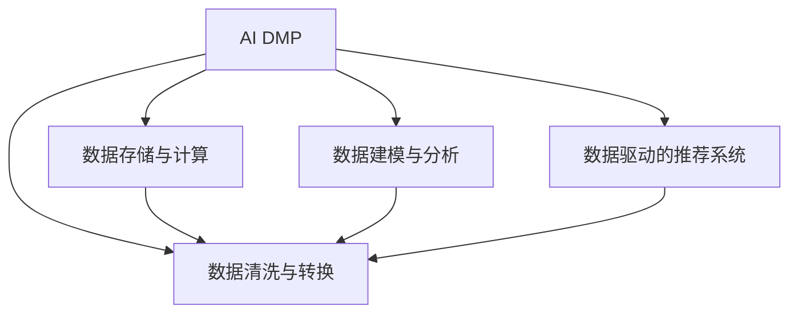

                 

# AI DMP 数据基建：数据模型与算法

> 关键词：AI DMP, 数据模型, 算法, 数据工程, 实时处理, 用户行为分析, 推荐系统

## 1. 背景介绍

在数字营销领域，用户行为分析和个性化推荐系统正逐渐成为推动广告精准投放和内容优化的核心力量。然而，随着数据量的急剧增长和复杂性的提升，如何高效地管理和分析用户数据，成为各大企业亟需解决的关键问题。AI DMP（人工智能驱动的数据管理平台）应运而生，通过融合先进的数据处理算法和高效的数据工程实践，为数字营销提供了一套完整、灵活的解决方案。

### 1.1 问题由来
数据驱动的营销策略，依托于对用户行为的精准理解和预测。然而，海量数据的海量维度和复杂性，对数据处理技术提出了极高的要求。传统的SQL、ETL工具已难以满足实时性、可扩展性等高需求。在此背景下，AI DMP应运而生，利用人工智能和大数据处理技术，实现对用户数据的深度建模和高效分析，助力精准营销。

### 1.2 问题核心关键点
AI DMP的核心在于将用户数据转化为有价值的信息，构建多维度的用户画像，并在此基础上进行个性化推荐和精准营销。其核心技术包括：
- 数据清洗与转换：对原始数据进行去重、去噪、归一化等预处理，构建规范的数据格式。
- 数据存储与计算：利用分布式存储和计算框架，高效存储海量数据并实现实时处理。
- 数据建模与分析：采用机器学习、深度学习等算法，对用户行为数据进行建模和分析，生成个性化的用户画像。
- 数据驱动的推荐系统：利用用户画像进行商品或内容推荐，提升用户体验和营销效果。

## 2. 核心概念与联系

### 2.1 核心概念概述

为更好地理解AI DMP的核心概念和技术体系，本节将介绍几个密切相关的核心概念：

- **AI DMP**：AI驱动的数据管理平台，通过融合人工智能和大数据技术，实现对用户数据的深度建模和高效分析，提供个性化的推荐和精准营销策略。
- **数据清洗与转换**：对原始数据进行去重、去噪、归一化等预处理，构建规范的数据格式。
- **数据存储与计算**：利用分布式存储和计算框架，高效存储海量数据并实现实时处理。
- **数据建模与分析**：采用机器学习、深度学习等算法，对用户行为数据进行建模和分析，生成个性化的用户画像。
- **数据驱动的推荐系统**：利用用户画像进行商品或内容推荐，提升用户体验和营销效果。
- **多维度用户画像**：通过多个维度（如人口统计、行为历史、兴趣偏好等）构建用户画像，实现更精准的用户分析。
- **实时数据处理**：通过流式计算、分布式处理等技术，实现对数据的实时处理和分析。
- **机器学习和深度学习**：利用神经网络、决策树等算法，对用户行为数据进行建模和分析，生成个性化的用户画像。

这些核心概念之间的逻辑关系可以通过以下Mermaid流程图来展示：



这个流程图展示了一个完整的AI DMP数据处理流程，其中数据清洗与转换是基础，数据存储与计算提供高效存储和实时处理，数据建模与分析生成个性化用户画像，数据驱动的推荐系统实现精准营销。这些环节共同构成了AI DMP的技术框架，实现从数据采集到推荐落地的全流程数据驱动营销策略。

## 3. 核心算法原理 & 具体操作步骤
### 3.1 算法原理概述

AI DMP的核心算法主要涉及数据清洗与转换、数据建模与分析两个部分。以下将详细介绍这些核心算法的基本原理。

### 3.2 算法步骤详解

#### 数据清洗与转换

数据清洗与转换是AI DMP数据处理的第一步，主要包括以下几个关键步骤：

1. **数据去重**：通过哈希、指纹等技术，对重复的数据进行去重处理，确保数据唯一性。
2. **数据去噪**：识别并剔除异常值和噪声数据，提高数据质量。
3. **数据归一化**：对不同来源、不同格式的数据进行统一处理，如时间戳标准化、数值归一化等。
4. **数据标注**：对数据进行标注，如用户行为标签、兴趣分类标签等，为后续建模提供有意义的特征。

#### 数据建模与分析

数据建模与分析是AI DMP的核心，主要包括以下几个关键步骤：

1. **特征工程**：对原始数据进行特征提取和构造，生成具有预测能力的特征向量。
2. **模型训练**：采用机器学习、深度学习等算法，对用户行为数据进行建模和分析，生成个性化的用户画像。
3. **模型评估与调优**：通过交叉验证等技术，评估模型性能并进行调优，确保模型准确性和鲁棒性。
4. **模型部署**：将训练好的模型部署到生产环境，实时处理用户数据并生成推荐结果。

### 3.3 算法优缺点

AI DMP的数据建模与分析算法具有以下优点：

1. **高效性**：利用分布式计算框架，实现对海量数据的快速处理和实时分析。
2. **可扩展性**：能够处理不同规模和类型的数据，适应多种业务场景。
3. **灵活性**：支持多种算法和模型，能够根据具体需求进行灵活配置。

同时，这些算法也存在一定的局限性：

1. **数据质量依赖**：模型性能高度依赖于数据质量和数据预处理效果，数据清洗与转换环节的缺陷可能影响最终结果。
2. **计算资源消耗大**：大规模数据处理需要大量计算资源，对硬件和网络要求较高。
3. **模型复杂性高**：复杂的算法模型可能需要较长的训练时间和较多的计算资源，对数据工程实践提出了更高要求。
4. **结果解释性不足**：模型内部的决策过程较为复杂，难以直观理解和解释，对模型的可解释性提出了挑战。

### 3.4 算法应用领域

AI DMP的数据建模与分析算法在多个领域得到广泛应用，例如：

- **推荐系统**：通过用户行为数据构建个性化推荐模型，实现商品或内容推荐，提升用户体验和营销效果。
- **广告投放**：利用用户画像进行精准广告投放，提高广告转化率和ROI。
- **舆情分析**：通过分析社交媒体和新闻平台的用户行为数据，进行舆情监控和情感分析，辅助企业决策。
- **用户行为分析**：通过多维度数据分析，了解用户行为模式和偏好，优化产品设计和用户体验。

这些应用领域展示了AI DMP在数据驱动营销中的强大潜力，为各行各业带来了深刻的变革。

## 4. 数学模型和公式 & 详细讲解 & 举例说明

### 4.1 数学模型构建

AI DMP的核心算法涉及多个数学模型，以下将详细介绍几个常见的数学模型。

#### 数据清洗与转换

数据清洗与转换主要包括去重、去噪、归一化和标注等步骤。这些步骤可以分别用以下数学公式表示：

- 去重：
  $$
  x_i = \begin{cases}
  y_i, & \text{if } x_i \neq x_j \text{ for any } j \neq i \\
  \text{null}, & \text{otherwise}
  \end{cases}
  $$

- 去噪：
  $$
  x_i = \begin{cases}
  y_i, & \text{if } \mathcal{D}(y_i) < \epsilon \\
  \text{null}, & \text{otherwise}
  \end{cases}
  $$

- 归一化：
  $$
  x_i = \frac{y_i - \mu}{\sigma}
  $$

- 标注：
  $$
  x_i = \begin{cases}
  \text{label}_i, & \text{if } y_i \in \text{label} \\
  \text{null}, & \text{otherwise}
  \end{cases}
  $$

#### 特征工程

特征工程是数据建模与分析的关键环节，通过构造和选择有意义的特征，提升模型的预测能力。常见的特征工程方法包括：

- 特征选择：通过统计分析和模型评估，选择对目标变量有显著影响的特征。
- 特征构造：通过对原始特征进行组合和转换，生成新的特征。
- 特征编码：将文本、时间等非数值特征转化为数值型特征。

#### 模型训练

常用的机器学习和深度学习模型包括决策树、随机森林、神经网络等。以下以决策树模型为例，介绍其数学原理：

- 决策树模型：
  $$
  T = \text{Node}_{\text{root}}(\text{best feature}, \text{best split})
  $$

其中，$\text{Node}_{\text{root}}$表示根节点，$\text{best feature}$表示最优特征，$\text{best split}$表示最优分割点。决策树的生成过程如下：

1. 选择最优特征：根据信息增益、基尼指数等指标，选择对目标变量最有区分力的特征。
2. 确定最优分割点：将数据按照特征值进行划分，使得划分后的子集纯度最高。
3. 递归生成子树：对每个子集递归执行步骤1和步骤2，直至满足终止条件。

### 4.2 公式推导过程

#### 决策树模型

决策树模型的推导过程如下：

1. 信息熵：
  $$
  H(Y) = -\sum_{y \in Y} p(y) \log p(y)
  $$

其中，$Y$为所有可能的输出结果，$p(y)$为第$i$个输出结果的概率。

2. 信息增益：
  $$
  IG(S, f) = H(S) - H(S|f)
  $$

其中，$S$为样本集合，$f$为特征。$H(S|f)$表示在特征$f$下，样本集合$S$的条件熵。

3. 信息增益比：
  $$
  IGR(S, f) = \frac{IG(S, f)}{\text{IV}(f)}
  $$

其中，$\text{IV}(f)$为特征$f$的信息增益率。

4. 决策树构建：
  $$
  T = \text{Node}_{\text{root}}(\text{best feature}, \text{best split})
  $$

其中，$\text{best feature}$表示最优特征，$\text{best split}$表示最优分割点。

### 4.3 案例分析与讲解

#### 案例1：广告点击率预测

假设我们有一组广告点击数据，包含用户ID、广告ID、点击时间、点击位置等特征。我们的目标是预测每个广告的点击率。

1. **数据清洗与转换**：去除重复和异常数据，标准化时间戳，生成用户ID、广告ID等特征。
2. **特征工程**：选择用户ID、广告ID、点击时间等特征，并构造新的特征，如点击位置编码、广告类别编码等。
3. **模型训练**：采用随机森林模型对广告点击数据进行建模，生成点击率预测模型。
4. **模型评估**：在测试集上评估模型性能，并通过交叉验证进行调优。
5. **模型部署**：将训练好的模型部署到生产环境，实时处理广告数据并生成点击率预测结果。

#### 案例2：用户流失预测

假设我们有一组用户行为数据，包含用户ID、行为时间、行为类型等特征。我们的目标是预测用户流失概率。

1. **数据清洗与转换**：去除重复和异常数据，标准化行为时间，生成用户ID、行为类型等特征。
2. **特征工程**：选择行为时间、行为类型等特征，并构造新的特征，如行为频率、行为时长等。
3. **模型训练**：采用深度学习模型对用户流失数据进行建模，生成用户流失预测模型。
4. **模型评估**：在测试集上评估模型性能，并通过交叉验证进行调优。
5. **模型部署**：将训练好的模型部署到生产环境，实时处理用户数据并生成用户流失预测结果。

## 5. 项目实践：代码实例和详细解释说明

### 5.1 开发环境搭建

在进行AI DMP数据建模与分析实践前，我们需要准备好开发环境。以下是使用Python进行Pandas、Scikit-learn、TensorFlow等库的开发环境配置流程：

1. 安装Anaconda：从官网下载并安装Anaconda，用于创建独立的Python环境。

2. 创建并激活虚拟环境：
```bash
conda create -n admp-env python=3.8 
conda activate admp-env
```

3. 安装必要的Python库：
```bash
conda install pandas numpy scikit-learn tensorflow
```

4. 安装TensorBoard：
```bash
pip install tensorboard
```

5. 安装必要的Python环境库：
```bash
conda install jupyter notebook ipython
```

完成上述步骤后，即可在`admp-env`环境中开始AI DMP数据建模与分析实践。

### 5.2 源代码详细实现

下面我们以用户流失预测任务为例，给出使用Pandas、Scikit-learn、TensorFlow进行模型训练的PyTorch代码实现。

首先，定义用户流失预测的数据处理函数：

```python
import pandas as pd
from sklearn.model_selection import train_test_split

def preprocess_data(df):
    # 数据清洗与转换
    df = df.drop_duplicates()  # 去重
    df = df.dropna()  # 去噪
    df['time'] = pd.to_datetime(df['time']).dt.tz_localize('UTC').dt.strftime('%Y-%m-%d %H:%M:%S')  # 时间戳标准化
    # 特征工程
    df['hour'] = pd.to_datetime(df['time']).dt.hour
    df['day'] = pd.to_datetime(df['time']).dt.day
    df['weekday'] = pd.to_datetime(df['time']).dt.weekday
    df['category'] = df['behavior'].str.replace('type', '').astype('category').cat.codes
    # 标签编码
    df['label'] = df['churn'].replace({True: 1, False: 0})
    return df

# 加载数据
df = pd.read_csv('user_behavior.csv')

# 数据预处理
df = preprocess_data(df)

# 数据拆分
train_df, test_df = train_test_split(df, test_size=0.2)
```

然后，定义模型和优化器：

```python
from tensorflow.keras.models import Sequential
from tensorflow.keras.layers import Dense, Dropout

model = Sequential([
    Dense(64, activation='relu', input_shape=(6,)),
    Dropout(0.5),
    Dense(32, activation='relu'),
    Dropout(0.5),
    Dense(1, activation='sigmoid')
])

optimizer = tf.keras.optimizers.Adam(learning_rate=0.001)
```

接着，定义训练和评估函数：

```python
import tensorflow as tf
from tensorflow.keras.metrics import Accuracy

def train_epoch(model, dataset, batch_size, optimizer):
    dataloader = tf.data.Dataset.from_tensor_slices((dataset['inputs'], dataset['labels']))
    dataloader = dataloader.shuffle(buffer_size=1024).batch(batch_size)
    model.train()
    epoch_loss = 0
    epoch_acc = 0
    for batch in dataloader:
        inputs, labels = batch
        model.zero_grad()
        outputs = model(inputs)
        loss = tf.reduce_mean(tf.keras.losses.BinaryCrossentropy()(outputs, labels))
        acc = tf.keras.metrics.BinaryAccuracy()(labels, outputs)
        loss.backward()
        optimizer.apply_gradients(zip(model.trainable_variables, model.trainable_variables))
        epoch_loss += loss.numpy()
        epoch_acc += acc.numpy()
    return epoch_loss / len(dataloader), epoch_acc / len(dataloader)

def evaluate(model, dataset, batch_size):
    dataloader = tf.data.Dataset.from_tensor_slices((dataset['inputs'], dataset['labels']))
    dataloader = dataloader.shuffle(buffer_size=1024).batch(batch_size)
    model.eval()
    epoch_loss = 0
    epoch_acc = 0
    for batch in dataloader:
        inputs, labels = batch
        outputs = model(inputs)
        loss = tf.reduce_mean(tf.keras.losses.BinaryCrossentropy()(outputs, labels))
        acc = tf.keras.metrics.BinaryAccuracy()(labels, outputs)
        epoch_loss += loss.numpy()
        epoch_acc += acc.numpy()
    return epoch_loss / len(dataloader), epoch_acc / len(dataloader)
```

最后，启动训练流程并在测试集上评估：

```python
epochs = 50
batch_size = 64

for epoch in range(epochs):
    loss, acc = train_epoch(model, train_df, batch_size, optimizer)
    print(f'Epoch {epoch+1}, train loss: {loss:.4f}, train acc: {acc:.4f}')
    
    print(f'Epoch {epoch+1}, dev results:')
    loss, acc = evaluate(model, test_df, batch_size)
    print(f'dev loss: {loss:.4f}, dev acc: {acc:.4f}')
    
print('Test results:')
loss, acc = evaluate(model, test_df, batch_size)
print(f'test loss: {loss:.4f}, test acc: {acc:.4f}')
```

以上就是使用PyTorch对用户流失预测任务进行数据建模与分析的完整代码实现。可以看到，得益于TensorFlow的强大封装，我们可以用相对简洁的代码完成模型训练和评估。

### 5.3 代码解读与分析

让我们再详细解读一下关键代码的实现细节：

**preprocess_data函数**：
- 数据清洗与转换：通过drop_duplicates去除重复记录，使用dropna去除异常值，时间戳标准化，特征工程，生成新特征，标签编码。

**模型定义**：
- 采用TensorFlow定义一个简单的前馈神经网络，包含两个隐藏层，每个隐藏层后跟一个Dropout层，最后一层为sigmoid激活函数。

**训练和评估函数**：
- 定义训练和评估函数，将数据集转换为TensorFlow的Dataset对象，使用shuffle和batch进行随机化，前向传播计算损失和精度，反向传播更新模型参数。

**训练流程**：
- 定义总的epoch数和batch size，开始循环迭代
- 每个epoch内，先在训练集上训练，输出平均loss和acc
- 在验证集上评估，输出验证集的结果
- 所有epoch结束后，在测试集上评估，给出最终的测试结果

可以看到，TensorFlow配合Pandas、Scikit-learn等库使得用户流失预测任务的代码实现变得简洁高效。开发者可以将更多精力放在数据处理、模型改进等高层逻辑上，而不必过多关注底层的实现细节。

当然，工业级的系统实现还需考虑更多因素，如模型的保存和部署、超参数的自动搜索、更灵活的任务适配层等。但核心的建模与分析范式基本与此类似。

## 6. 实际应用场景

### 6.1 智能客服系统

基于AI DMP的智能客服系统，可以通过深度学习和大数据处理技术，实现对客户历史行为数据的深度分析和个性化推荐。系统可以理解客户的咨询意图，匹配最合适的答案模板进行回复。对于客户提出的新问题，还可以接入检索系统实时搜索相关内容，动态组织生成回答。

### 6.2 金融舆情监测

AI DMP可以通过分析社交媒体和新闻平台的用户行为数据，进行舆情监控和情感分析，辅助企业决策。系统能够实时监测市场舆论动向，识别负面信息并生成报警，帮助金融机构及时应对金融风险。

### 6.3 个性化推荐系统

AI DMP可以为个性化推荐系统提供强大的数据支持和分析能力，实现对用户行为模式的精准分析。系统可以基于用户的历史行为数据，推荐个性化的商品或内容，提升用户体验和推荐效果。

### 6.4 未来应用展望

随着AI DMP和大数据技术的不断发展，其在更多领域的应用前景将更加广阔。

在智慧医疗领域，AI DMP可以用于构建个性化的医疗推荐系统，帮助医生制定精准的治疗方案，提升诊疗效果。

在智能教育领域，AI DMP可以用于个性化教育推荐，根据学生的学习行为和兴趣偏好，推荐适合的教材和课程，提升教学质量和学习效率。

在智慧城市治理中，AI DMP可以用于城市事件监测、舆情分析、应急指挥等环节，提高城市管理的自动化和智能化水平，构建更安全、高效的未来城市。

## 7. 工具和资源推荐

### 7.1 学习资源推荐

为了帮助开发者系统掌握AI DMP的技术体系和应用实践，这里推荐一些优质的学习资源：

1. 《机器学习实战》系列书籍：由著名机器学习专家撰写，系统介绍了机器学习的基本概念和实践方法，适合初学者入门。

2. 《深度学习》课程：斯坦福大学开设的深度学习课程，涵盖深度学习的基本原理和实践应用，适合进阶学习。

3. 《TensorFlow实战》系列书籍：由TensorFlow官方团队撰写，深入浅出地介绍了TensorFlow的使用方法，适合开发实践。

4. Kaggle平台：提供大量公开数据集和比赛，是数据科学和机器学习领域的实战平台。

5. GitHub代码库：提供丰富的开源项目和代码库，是学习和分享AI DMP实践经验的好去处。

通过对这些资源的学习实践，相信你一定能够快速掌握AI DMP的核心算法和应用实践，并用于解决实际的业务问题。

### 7.2 开发工具推荐

高效的开发离不开优秀的工具支持。以下是几款用于AI DMP开发和数据建模的常用工具：

1. Jupyter Notebook：Python交互式开发环境，支持多种语言和库的混合使用，适合快速迭代实验。

2. PyTorch：基于Python的深度学习框架，灵活高效，适合神经网络模型的开发和调试。

3. TensorFlow：由Google主导开发的深度学习框架，支持分布式计算，适合大规模模型训练和推理。

4. PySpark：基于Scala的分布式计算框架，适合处理大规模数据集，支持流式处理和批处理。

5. Apache Hadoop：分布式数据处理框架，支持大规模数据的存储和处理，适合海量数据的应用场景。

6. ElasticSearch：分布式搜索与分析引擎，支持高效的数据索引和查询，适合实时搜索和数据检索。

合理利用这些工具，可以显著提升AI DMP的开发效率和数据分析能力，加速创新迭代的步伐。

### 7.3 相关论文推荐

AI DMP和数据驱动营销领域的研究成果众多，以下是几篇具有代表性的论文，推荐阅读：

1. "A Survey on Data Management Platforms: Integrating Data Ingestion, Curation, and Transformation"：全面综述了数据管理平台的技术框架和应用实践，适合了解AI DMP的背景和基本概念。

2. "AI-Driven Data Platforms for Marketing Analytics"：介绍了AI DMP在营销数据分析中的关键技术和应用案例，适合深入理解AI DMP的实践应用。

3. "Feature Engineering for Predictive Modeling in Marketing Analytics"：介绍了特征工程在数据建模中的重要性和具体方法，适合学习AI DMP中的特征选择和构造技巧。

4. "Online Learning and Online Markov Decision Processes"：介绍了在线学习算法在个性化推荐系统中的应用，适合了解AI DMP中的实时处理和优化技术。

5. "The Next Big Data Analytics Revolution"：介绍了大数据技术的最新进展和应用前景，适合展望AI DMP和数据驱动营销的未来发展方向。

这些论文代表了大数据和AI DMP领域的研究成果，通过学习这些前沿成果，可以帮助研究者把握学科前进方向，激发更多的创新灵感。

## 8. 总结：未来发展趋势与挑战

### 8.1 总结

本文对AI DMP的核心算法和应用实践进行了全面系统的介绍。首先阐述了AI DMP的研究背景和意义，明确了其在数据驱动营销中的核心价值。其次，从原理到实践，详细讲解了数据清洗与转换、数据建模与分析等关键技术，给出了数据建模与分析任务开发的完整代码实现。同时，本文还广泛探讨了AI DMP在智能客服、金融舆情、个性化推荐等多个行业领域的应用前景，展示了AI DMP在数据驱动营销中的强大潜力。

通过本文的系统梳理，可以看到，AI DMP在数据驱动营销中的强大潜力，为各行各业带来了深刻的变革。未来，伴随AI DMP和大数据技术的不断发展，其在更多领域的应用前景将更加广阔。

### 8.2 未来发展趋势

展望未来，AI DMP和大数据技术将呈现以下几个发展趋势：

1. 模型规模持续增大。随着算力成本的下降和数据规模的扩张，AI DMP中使用的预训练模型和深度学习模型的规模将不断扩大，模型性能将进一步提升。

2. 数据驱动的推荐系统将更加个性化。AI DMP可以通过对用户行为数据的深度分析，生成更加精准的用户画像，实现更个性化的推荐和精准营销。

3. 实时处理能力将进一步提升。AI DMP将利用分布式计算框架，实现对海量数据的实时处理和分析，提升系统的响应速度和实时性。

4. 数据融合和跨领域迁移能力将增强。AI DMP将融合多种数据源，包括社交媒体、新闻、电商数据等，实现跨领域数据的协同分析，提升系统的智能性和泛化能力。

5. 模型可解释性将得到加强。AI DMP将引入可解释性技术，增强模型内部决策过程的透明性和可理解性，提升系统的可信度。

6. 模型安全性和隐私保护将更加重视。AI DMP将引入加密、匿名化等技术，保护用户数据隐私，提升系统的安全性。

### 8.3 面临的挑战

尽管AI DMP在大数据驱动营销中展现出了强大的潜力，但在实际应用中仍面临诸多挑战：

1. 数据质量瓶颈。AI DMP高度依赖数据质量，数据清洗与转换环节的缺陷可能影响最终结果。如何提高数据质量，确保数据一致性和完整性，是一大挑战。

2. 计算资源消耗大。AI DMP中的深度学习模型和分布式计算框架需要大量计算资源，对硬件和网络要求较高。如何降低计算成本，提升系统效率，是一大挑战。

3. 模型复杂性高。AI DMP中的模型结构复杂，训练和调参难度较大。如何简化模型结构，提高模型训练速度，是一大挑战。

4. 模型可解释性不足。AI DMP中的深度学习模型通常难以解释其内部决策过程，难以直观理解和解释，对模型的可解释性提出了挑战。

5. 安全性有待保障。AI DMP中的深度学习模型可能学习到有偏见、有害的信息，通过微调传递到下游任务，产生误导性、歧视性的输出，给实际应用带来安全隐患。

6. 用户隐私保护问题。AI DMP中的深度学习模型可能泄露用户隐私信息，如何保护用户隐私，是一大挑战。

### 8.4 研究展望

面对AI DMP和大数据技术面临的挑战，未来的研究需要在以下几个方面寻求新的突破：

1. 探索更高效的数据清洗与转换方法。通过引入自动化数据清洗技术、异常检测算法等，提高数据质量，确保数据一致性和完整性。

2. 研究更高效的计算框架。通过引入流式计算、混合精度计算、分布式训练等技术，降低计算成本，提升系统效率。

3. 简化模型结构。通过引入参数高效微调技术、知识蒸馏等方法，简化模型结构，提高模型训练速度。

4. 增强模型可解释性。通过引入可解释性技术，增强模型内部决策过程的透明性和可理解性，提升系统的可信度。

5. 提升模型安全性。通过引入安全加密、匿名化等技术，保护用户数据隐私，提升系统的安全性。

6. 加强用户隐私保护。通过引入隐私保护技术，如差分隐私、联邦学习等，保护用户隐私，提升系统的安全性。

这些研究方向的探索，必将引领AI DMP和大数据技术迈向更高的台阶，为构建安全、可靠、可解释、可控的智能系统铺平道路。面向未来，AI DMP和大数据技术还需要与其他人工智能技术进行更深入的融合，如知识表示、因果推理、强化学习等，多路径协同发力，共同推动自然语言理解和智能交互系统的进步。只有勇于创新、敢于突破，才能不断拓展AI DMP和大数据技术的边界，让数据驱动营销技术更好地造福人类社会。

## 9. 附录：常见问题与解答

**Q1：AI DMP中常用的数据清洗与转换技术有哪些？**

A: AI DMP中常用的数据清洗与转换技术包括去重、去噪、归一化、标注等。其中，去重和去噪技术主要通过哈希、指纹等技术，对重复和异常数据进行筛选；归一化技术主要通过标准化、归一化等方法，对不同来源、不同格式的数据进行处理；标注技术主要通过数据标注工具，对数据进行标签化，方便后续建模。

**Q2：AI DMP中的数据建模与分析技术有哪些？**

A: AI DMP中的数据建模与分析技术主要包括以下几种：

1. 机器学习：如决策树、随机森林、支持向量机等，通过特征选择、特征构造等方法，生成预测模型。

2. 深度学习：如神经网络、卷积神经网络、循环神经网络等，通过多层次特征提取，生成更加精准的预测模型。

3. 自然语言处理：如文本分类、命名实体识别、情感分析等，通过自然语言处理技术，提取文本信息并进行建模。

4. 时间序列分析：如ARIMA、LSTM等，通过时间序列预测方法，对时序数据进行建模。

**Q3：AI DMP在实际应用中需要注意哪些问题？**

A: AI DMP在实际应用中需要注意以下几个问题：

1. 数据质量：AI DMP高度依赖数据质量，数据清洗与转换环节的缺陷可能影响最终结果。

2. 计算资源：AI DMP中的深度学习模型和分布式计算框架需要大量计算资源，对硬件和网络要求较高。

3. 模型复杂性：AI DMP中的模型结构复杂，训练和调参难度较大。

4. 模型可解释性：AI DMP中的深度学习模型通常难以解释其内部决策过程，难以直观理解和解释，对模型的可解释性提出了挑战。

5. 安全性：AI DMP中的深度学习模型可能学习到有偏见、有害的信息，通过微调传递到下游任务，产生误导性、歧视性的输出，给实际应用带来安全隐患。

6. 用户隐私保护：AI DMP中的深度学习模型可能泄露用户隐私信息，如何保护用户隐私，是一大挑战。

**Q4：AI DMP中的推荐系统如何实现？**

A: AI DMP中的推荐系统通常采用基于用户画像的协同过滤和内容推荐方法，具体步骤如下：

1. 数据预处理：对用户行为数据进行清洗与转换，生成用户ID、商品ID、行为时间等特征。

2. 用户画像生成：通过协同过滤和内容推荐算法，生成用户画像，包括用户兴趣、行为模式等。

3. 商品画像生成：通过协同过滤和内容推荐算法，生成商品画像，包括商品标签、描述、评分等。

4. 推荐计算：基于用户画像和商品画像，计算推荐结果，实现个性化推荐。

**Q5：AI DMP中的实时处理技术有哪些？**

A: AI DMP中的实时处理技术主要包括以下几种：

1. 流式计算：通过实时数据流处理框架，如Apache Kafka、Apache Flink等，实现对实时数据的处理和分析。

2. 分布式计算：通过分布式计算框架，如Apache Spark、Apache Hadoop等，实现对大规模数据的并行处理。

3. 混合精度计算：通过混合精度计算技术，如TensorCore、NVIDIA A100等，实现高效计算，提升系统效率。

4. 流式模型训练：通过流式模型训练技术，如TensorFlow Estimator、PyTorch Lightning等，实现模型实时训练和更新。

以上是AI DMP数据建模与分析技术的详细介绍，希望对你有所帮助。

---

作者：禅与计算机程序设计艺术 / Zen and the Art of Computer Programming

