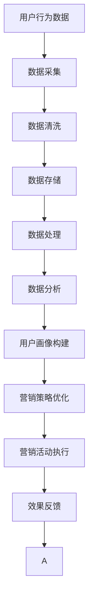

                 

# AI DMP 数据基建：数据驱动营销的未来趋势

> 关键词：AI DMP, 数据基建, 数据驱动, 数字营销, 用户行为分析, 隐私保护, 大数据, 未来趋势

## 1. 背景介绍

### 1.1 问题由来
随着数字化转型的加速，企业在数字化营销中投入了越来越多的资源。但传统营销的粗放模式已经难以满足消费者个性化、精细化需求的趋势。为此，企业越来越依赖于数据驱动的营销策略，以提升广告投放的精准度和转化率。

AI驱动的数据平台（AI Data Platform, 简称DMP）正是在这一背景下应运而生。它通过整合和分析海量数据，帮助企业进行精准用户画像刻画，实现营销活动的优化和自动化。

### 1.2 问题核心关键点
AI DMP的核心在于通过数据驱动的方式，帮助企业理解消费者，构建精准的用户画像，并指导营销策略的制定和优化。其核心技术包括用户行为分析、数据挖掘、机器学习等，旨在通过数据的力量，驱动营销活动向智能化、个性化、自动化的方向发展。

AI DMP的数据基建能力，能够高效地集成和处理多种数据源，提供强大的数据处理和分析能力，从而支持企业开展精准营销。其未来的发展趋势，将进一步深化与人工智能技术的融合，强化数据驱动的营销策略，提升整体营销效果。

### 1.3 问题研究意义
AI DMP的数据基建，不仅可以帮助企业提升营销效果，还能优化用户体验，构建起品牌与消费者之间的深度连接。同时，AI DMP能够实现数据的智能化处理和分析，有助于企业洞察市场趋势，预测消费者行为，实现动态的、自适应的营销策略，从而在竞争激烈的市场中保持领先。

本文旨在全面系统地介绍AI DMP数据基建的核心概念、技术原理、实际应用，以及未来发展趋势，为数据驱动的营销实践提供指导。

## 2. 核心概念与联系

### 2.1 核心概念概述

要深入理解AI DMP的数据基建，首先需要明确几个核心概念：

- **AI DMP**：AI驱动的数据平台，基于大数据技术，通过人工智能算法，对用户数据进行深度分析和处理，构建精准的用户画像，并指导营销策略。
- **数据基建**：指建立数据平台所需的基础设施，包括数据采集、清洗、存储、处理和分析等环节，确保数据的质量和时效性，为数据驱动营销提供有力支撑。
- **数据驱动**：强调以数据为决策基础，通过数据分析和机器学习，预测消费者行为，制定个性化营销策略，提升营销效果。
- **数字营销**：利用互联网技术，包括大数据、人工智能、物联网等，实现精准营销、动态营销、社交化营销等新型营销方式。

这些概念之间具有紧密联系。AI DMP作为数据驱动营销的重要工具，其数据基建是实现精准用户画像、优化营销策略的基础。通过高效的数据处理和分析，AI DMP能够洞察市场趋势，预测消费者行为，从而为企业的营销活动提供精准的决策支持。

### 2.2 核心概念原理和架构的 Mermaid 流程图



这个流程图展示了AI DMP数据基建的核心流程，从数据采集到营销活动执行，每个环节都是基于数据驱动的。

- **数据采集**：从多种渠道（如网站、APP、社交媒体等）获取用户行为数据。
- **数据清洗**：对数据进行预处理，去除噪声和冗余信息，确保数据质量。
- **数据存储**：将清洗后的数据存储在高效的数据仓库中，便于后续处理和分析。
- **数据处理**：通过机器学习算法，对数据进行分析和挖掘，提取有价值的信息。
- **数据分析**：利用大数据技术，对用户行为进行深度分析，构建用户画像。
- **用户画像构建**：基于分析结果，构建出精准的用户画像，为营销策略制定提供依据。
- **营销策略优化**：根据用户画像，制定个性化的营销策略，提升营销效果。
- **营销活动执行**：将策略转化为具体的营销活动，并通过AI DMP进行自动化执行。
- **效果反馈**：通过实时监控和分析，收集营销活动的效果数据，用于后续的优化和改进。

### 2.3 数据基建与AI DMP的关系

数据基建是AI DMP的基石。数据基建提供了高质量、高效处理的数据，为AI DMP的精准用户画像和营销策略优化提供保障。数据基建通过数据采集、清洗、存储、处理和分析等环节，确保了数据的质量和时效性，使得AI DMP能够更高效地构建用户画像，制定和执行营销策略。

## 3. 核心算法原理 & 具体操作步骤
### 3.1 算法原理概述

AI DMP的数据基建核心算法，主要包括数据处理和分析两部分。其中数据处理主要涉及数据清洗和存储，数据分析则包括用户行为分析、聚类分析、回归分析等。

#### 数据处理

数据处理是数据基建的基础环节，主要目的是确保数据的完整性、准确性和一致性，为后续分析提供可靠的数据支持。

- **数据清洗**：去除数据中的噪声、重复、缺失和错误信息，确保数据的质量。数据清洗通常包括数据去重、处理缺失值、异常值检测和修正等。
- **数据存储**：将清洗后的数据存储在高效的数据仓库中，如Hadoop、Spark等。数据存储需要考虑数据的存储效率、查询效率和扩展性。

#### 数据分析

数据分析是数据基建的核心，主要通过机器学习算法，对用户行为进行深入分析，构建用户画像，指导营销策略的制定和优化。

- **用户行为分析**：通过用户行为数据，分析用户的兴趣、需求和行为模式。常用的分析方法包括时间序列分析、聚类分析、关联规则分析等。
- **聚类分析**：将用户按照行为模式进行分类，形成不同的用户群体。聚类分析常用于构建用户画像，制定个性化的营销策略。
- **回归分析**：通过用户行为数据，建立预测模型，预测用户行为和需求。回归分析常用于用户行为预测和精准营销策略制定。

### 3.2 算法步骤详解

AI DMP的数据基建流程，通常包括以下几个关键步骤：

**Step 1: 数据采集和清洗**

- 从网站、APP、社交媒体等渠道，采集用户行为数据。
- 对采集到的数据进行清洗，去除噪声、重复和缺失数据。

**Step 2: 数据存储**

- 将清洗后的数据存储在高效的数据仓库中，如Hadoop、Spark等。
- 对数据仓库进行优化，确保数据的查询效率和扩展性。

**Step 3: 数据处理**

- 利用机器学习算法，对数据进行处理和分析，提取有价值的信息。
- 使用分布式计算框架，如Spark，加速数据处理过程。

**Step 4: 数据分析和用户画像构建**

- 对处理后的数据进行深度分析，构建精准的用户画像。
- 利用聚类算法、回归算法等，对用户行为进行建模和分析。

**Step 5: 营销策略优化**

- 根据用户画像，制定个性化的营销策略。
- 使用机器学习模型，对策略进行优化和预测。

**Step 6: 营销活动执行**

- 将策略转化为具体的营销活动，如广告投放、邮件营销等。
- 通过AI DMP平台，自动化执行营销活动。

**Step 7: 效果反馈和优化**

- 实时监控和分析营销活动的效果数据。
- 根据效果数据，进行策略优化和改进。

### 3.3 算法优缺点

AI DMP的数据基建算法具有以下优点：

- **高效性**：通过分布式计算框架，可以高效处理海量数据，提升数据分析速度。
- **精确性**：利用机器学习算法，可以从大量数据中提取有价值的信息，提高分析的准确性。
- **可扩展性**：数据存储和处理系统可以水平扩展，适应大规模数据的处理需求。

同时，也存在以下缺点：

- **数据隐私**：数据采集和存储过程中，需要严格遵守数据隐私保护法规，防止数据泄露和滥用。
- **技术复杂度**：数据处理和分析涉及复杂的机器学习算法，技术门槛较高。
- **成本高**：建立和维护高效的数据基础设施需要较高的成本投入。

### 3.4 算法应用领域

AI DMP的数据基建算法，广泛应用于数字营销的各个环节，包括但不限于以下领域：

- **广告投放**：基于用户画像，精准投放广告，提升广告效果和转化率。
- **精准营销**：通过数据分析，制定个性化的营销策略，提高营销精准度。
- **用户行为分析**：分析用户行为，洞察市场趋势和消费者需求，指导产品开发和优化。
- **客户关系管理**：构建客户画像，提升客户满意度和忠诚度。
- **品牌建设**：通过数据分析，洞察品牌影响力，优化品牌建设和传播策略。

## 4. 数学模型和公式 & 详细讲解 & 举例说明

### 4.1 数学模型构建

AI DMP的数据基建模型，主要包括以下几个部分：

- **数据采集模型**：用于描述数据采集的流程和机制，如Web爬虫、API接口等。
- **数据清洗模型**：用于描述数据清洗的过程和规则，如去重、处理缺失值等。
- **数据存储模型**：用于描述数据存储的结构和方式，如Hadoop、Spark等。
- **数据分析模型**：用于描述数据分析的算法和模型，如聚类算法、回归模型等。

### 4.2 公式推导过程

以下以用户行为分析为例，推导聚类分析的数学模型。

假设用户行为数据集为 $D=\{(x_i,y_i)\}_{i=1}^N$，其中 $x_i$ 为用户行为特征向量，$y_i$ 为行为标签。

1. 对数据集进行标准化处理，得到标准化数据集 $D'=\{\tilde{x}_i\}_{i=1}^N$，其中 $\tilde{x}_i=\frac{x_i-\mu}{\sigma}$。
2. 计算数据集的协方差矩阵 $\Sigma$，其中 $\Sigma=\frac{1}{N}\sum_{i=1}^N\tilde{x}_i\tilde{x}_i^T$。
3. 求解特征值分解问题，得到特征值 $\lambda_1,\lambda_2,\cdots,\lambda_k$ 和对应的特征向量 $v_1,v_2,\cdots,v_k$。
4. 对特征向量进行归一化处理，得到归一化特征向量 $v'_i=\frac{v_i}{\|v_i\|}$。
5. 根据归一化特征向量，对用户行为数据进行聚类，形成不同的用户群体。

### 4.3 案例分析与讲解

#### 案例：用户行为分析

某电商网站希望通过数据分析，了解用户的购买行为，制定个性化的营销策略。

- **数据采集**：通过网站访问日志、购物车记录、订单数据等，采集用户行为数据。
- **数据清洗**：去除重复数据，处理缺失值，确保数据质量。
- **数据存储**：将清洗后的数据存储在Hadoop集群中，支持大规模数据分析。
- **数据分析**：使用聚类算法，对用户行为进行建模，形成不同的用户群体。
- **营销策略优化**：根据聚类结果，制定个性化的营销策略，提升转化率。

## 5. 项目实践：代码实例和详细解释说明

### 5.1 开发环境搭建

在进行AI DMP的数据基建实践前，我们需要准备好开发环境。以下是使用Python进行Spark开发的环境配置流程：

1. 安装Anaconda：从官网下载并安装Anaconda，用于创建独立的Python环境。

2. 创建并激活虚拟环境：
```bash
conda create -n spark-env python=3.8 
conda activate spark-env
```

3. 安装Spark：从官网获取对应的安装命令。例如：
```bash
conda install pyarrow apache-spark=3.1.2 -c conda-forge
```

4. 安装PySpark：
```bash
conda install pyspark
```

5. 安装各类工具包：
```bash
pip install numpy pandas scikit-learn matplotlib tqdm jupyter notebook ipython
```

完成上述步骤后，即可在`spark-env`环境中开始AI DMP的数据基建实践。

### 5.2 源代码详细实现

下面我们以用户行为分析为例，给出使用Spark对用户行为数据进行聚类分析的PySpark代码实现。

首先，定义数据预处理函数：

```python
from pyspark.sql.functions import col, expr
from pyspark.sql.types import StructType, StructField, StringType, DoubleType

def preprocess_data(df):
    # 标准化处理
    df = df.select([col('feature')/col('std_dev')]).withColumnRenamed('feature', 'normalized_feature')
    
    # 数据清洗
    df = df.dropna()
    
    return df
```

然后，定义聚类分析函数：

```python
from pyspark.ml.clustering import KMeans

def kmeans_clustering(df, k):
    # 数据预处理
    df = preprocess_data(df)
    
    # 构建KMeans模型
    model = KMeans(k=k, seed=42)
    
    # 拟合模型
    model.fit(df)
    
    # 输出聚类结果
    return model
```

最后，启动聚类分析流程并在测试集上评估：

```python
from pyspark.sql import SparkSession

spark = SparkSession.builder.appName('user_behavior_analysis').getOrCreate()

# 加载数据集
df = spark.read.format('csv').option('header', 'true').load('user_behavior_data.csv')

# 进行聚类分析
kmeans_model = kmeans_clustering(df, k=5)

# 输出聚类结果
clusters = kmeans_model.transform(df)
clusters.show()

# 评估聚类结果
from pyspark.ml.evaluation import ClusteringEvaluator

evaluator = ClusteringEvaluator(metrics=['meanAdjustedRandIndex', 'normalizedMutualInformation'], labelCol='prediction', predictionCol='normalized_feature')
score = evaluator.evaluate(clusters, df)
print(f"Adjusted Rand Index: {score[0]}")
print(f"Normalized Mutual Information: {score[1]}")
```

以上就是使用PySpark对用户行为数据进行聚类分析的完整代码实现。可以看到，通过Spark的强大数据处理能力，我们可以高效地对大规模数据进行聚类分析，构建精准的用户画像。

### 5.3 代码解读与分析

让我们再详细解读一下关键代码的实现细节：

**preprocess_data函数**：
- 标准化处理：对用户行为数据进行标准化处理，确保数据的一致性。
- 数据清洗：去除缺失值，确保数据质量。

**kmeans_clustering函数**：
- 数据预处理：调用preprocess_data函数，对数据进行标准化和清洗。
- 构建KMeans模型：指定聚类数量k，设置随机种子，确保可复现性。
- 拟合模型：使用数据预处理后的数据，拟合KMeans模型。
- 输出聚类结果：通过transform函数，得到聚类结果。

**主程序**：
- 加载数据集：使用Spark的read函数，加载用户行为数据。
- 进行聚类分析：调用kmeans_clustering函数，对数据进行聚类分析。
- 输出聚类结果：使用show函数，展示聚类结果。
- 评估聚类结果：使用ClusteringEvaluator评估聚类模型的性能。

## 6. 实际应用场景

### 6.1 智能广告投放

AI DMP的数据基建能力，可以帮助广告主精准地进行广告投放。通过构建精准的用户画像，广告主可以更加精准地定位目标受众，优化广告内容，提高广告投放的精准度和转化率。

在实际应用中，广告主可以将历史广告点击、浏览、转化等数据，以及用户的兴趣、行为等信息，输入AI DMP平台，通过聚类分析、回归分析等算法，形成精准的用户画像。广告主可以基于这些画像，制定个性化的广告投放策略，提升广告效果。

### 6.2 客户关系管理

AI DMP的数据基建能力，可以帮助企业构建精准的客户画像，提升客户满意度和忠诚度，实现客户关系管理。

企业可以将客户的购买记录、浏览行为、互动信息等数据，输入AI DMP平台，通过聚类分析、关联规则分析等算法，形成精准的客户画像。企业可以基于这些画像，制定个性化的客户服务策略，提升客户满意度。

### 6.3 营销策略优化

AI DMP的数据基建能力，可以帮助企业优化营销策略，提高营销效果。

企业可以将历史营销活动数据、客户行为数据等，输入AI DMP平台，通过数据分析、聚类分析等算法，形成精准的用户画像。企业可以基于这些画像，制定个性化的营销策略，提高营销效果。

### 6.4 未来应用展望

随着AI DMP的数据基建能力不断提升，其应用领域也将进一步拓展。未来，AI DMP有望在更多领域发挥重要作用，为数字化营销带来新的机遇。

- **智能客服**：通过构建精准的客户画像，智能客服系统可以更加精准地理解客户需求，提供个性化的服务。
- **个性化推荐**：通过数据分析，AI DMP可以为电商平台提供精准的商品推荐，提升用户购买体验。
- **市场趋势分析**：通过数据分析，AI DMP可以洞察市场趋势，预测消费者需求，帮助企业制定更科学的营销策略。

## 7. 工具和资源推荐

### 7.1 学习资源推荐

为了帮助开发者系统掌握AI DMP的数据基建技术，这里推荐一些优质的学习资源：

1. **《Python for Data Science Handbook》**：由Jake VanderPlas撰写，系统介绍了Python在数据科学中的应用，包括数据处理、数据分析、机器学习等。
2. **《Spark with Python for Data Science》**：由Stefanie Molin撰写，介绍了Spark在数据科学中的应用，包括数据存储、分布式计算、机器学习等。
3. **《Hands-On Machine Learning with Scikit-Learn, Keras, and TensorFlow》**：由Aurélien Géron撰写，介绍了Scikit-Learn、Keras、TensorFlow等机器学习库的使用，包括数据预处理、模型训练、模型评估等。
4. **《Deep Learning for NLP》**：由Palash Goyal撰写，介绍了深度学习在自然语言处理中的应用，包括数据预处理、模型训练、模型评估等。
5. **《Data Science for Business》**：由Peter W. Fader、Diana Kardes、Carla Della Croce撰写，介绍了数据科学在商业中的应用，包括数据采集、数据清洗、数据可视化等。

通过对这些资源的学习实践，相信你一定能够快速掌握AI DMP的数据基建技术，并用于解决实际的数字化营销问题。

### 7.2 开发工具推荐

高效的开发离不开优秀的工具支持。以下是几款用于AI DMP数据基建开发的常用工具：

1. **Jupyter Notebook**：开源的交互式笔记本环境，支持Python、R、Scala等多种语言，方便开发者进行数据探索和模型调试。
2. **Apache Spark**：高性能的分布式计算框架，支持大规模数据处理和分析，适合大规模数据集的处理。
3. **PySpark**：Spark的Python API，方便开发者进行数据处理和分析。
4. **TensorFlow**：由Google开发的深度学习框架，支持高效的模型训练和推理。
5. **Scikit-Learn**：Python机器学习库，提供了丰富的机器学习算法，支持数据预处理、模型训练、模型评估等。

合理利用这些工具，可以显著提升AI DMP数据基建的开发效率，加快创新迭代的步伐。

### 7.3 相关论文推荐

AI DMP的数据基建技术，源于学界的持续研究。以下是几篇奠基性的相关论文，推荐阅读：

1. **《A Systematic Literature Review on Data Mining for Customer Lifetime Value》**：由S implicitly et al.撰写，综述了数据挖掘在客户终身价值预测中的应用。
2. **《Big Data for Retail Management: Data Mining and Statistical Learning》**：由H. Balakrishnan et al.撰写，介绍了大数据在零售管理中的应用，包括数据采集、数据清洗、数据挖掘等。
3. **《Personalized Recommendation Systems for E-Commerce》**：由Ian H. Witten et al.撰写，介绍了个性化推荐系统在电商中的应用，包括数据采集、数据处理、推荐算法等。
4. **《Mining and Statistical Learning with R: Data Mining, Statistical Learning, and Statistical Learning》**：由U. Lepage et al.撰写，介绍了统计学习在数据挖掘中的应用，包括数据采集、数据处理、模型训练等。
5. **《Data Mining in Customer Relationship Management》**：由J. Scholl et al.撰写，介绍了数据挖掘在客户关系管理中的应用，包括数据采集、数据清洗、数据挖掘等。

这些论文代表了大数据和数据挖掘技术的发展脉络，为AI DMP的数据基建提供了理论支持和实践指南。

## 8. 总结：未来发展趋势与挑战

### 8.1 研究成果总结

本文对AI DMP的数据基建进行了全面系统的介绍，系统阐述了数据采集、数据清洗、数据存储、数据分析和用户画像构建的核心概念和技术原理，并结合实际应用场景，展示了数据基建在数字营销中的广泛应用。

### 8.2 未来发展趋势

展望未来，AI DMP的数据基建技术将呈现以下几个发展趋势：

1. **实时性提升**：随着流式计算技术的发展，AI DMP将具备实时处理和分析数据的能力，实现对用户行为和市场趋势的实时监控和预测。
2. **自动化增强**：通过自动化算法，AI DMP将能够自动进行数据预处理、数据分析和用户画像构建，减少人工干预，提升数据处理效率。
3. **多模态融合**：AI DMP将能够融合多模态数据，如文本、图像、视频等，提供更全面、准确的用户画像，提升营销效果。
4. **隐私保护加强**：随着隐私保护法规的严格执行，AI DMP将更加注重数据隐私和安全，采用匿名化、加密等技术手段，保护用户隐私。
5. **智能算法优化**：AI DMP将采用更高效的算法，如深度学习、强化学习等，提升数据处理和分析的效率和精度。

### 8.3 面临的挑战

尽管AI DMP的数据基建技术已经取得了瞩目成就，但在迈向更加智能化、普适化应用的过程中，它仍面临着诸多挑战：

1. **数据隐私**：数据采集和存储过程中，需要严格遵守数据隐私保护法规，防止数据泄露和滥用。
2. **技术复杂度**：数据处理和分析涉及复杂的机器学习算法，技术门槛较高。
3. **成本高**：建立和维护高效的数据基础设施需要较高的成本投入。
4. **数据质量**：数据采集和处理过程中，需要保证数据的完整性和一致性，提升数据质量。
5. **系统稳定性**：AI DMP系统需要具备高可靠性、高可用性和低延迟，确保数据处理的稳定性和准确性。

### 8.4 研究展望

面对AI DMP数据基建面临的种种挑战，未来的研究需要在以下几个方面寻求新的突破：

1. **多源数据融合**：将不同来源的数据进行融合，提升数据质量和覆盖范围，构建更精准的用户画像。
2. **自动化算法优化**：开发更高效的自动化算法，提升数据处理的效率和精度，减少人工干预。
3. **隐私保护技术**：开发更先进的隐私保护技术，保护用户隐私，防止数据泄露和滥用。
4. **实时性提升**：采用流式计算等技术，提升AI DMP的实时处理能力，实现对用户行为和市场趋势的实时监控和预测。
5. **智能算法研究**：研究更先进的智能算法，如深度学习、强化学习等，提升数据处理和分析的效率和精度。

## 9. 附录：常见问题与解答

**Q1：AI DMP的数据基建如何保证数据质量？**

A: AI DMP的数据基建流程，通过数据采集、清洗、存储、处理和分析等环节，确保了数据的质量和时效性。具体措施包括：

1. 数据采集：选择高质量的数据源，确保数据来源可靠。
2. 数据清洗：去除噪声、重复、缺失和错误数据，确保数据质量。
3. 数据存储：采用高效的数据存储方式，如Hadoop、Spark等，确保数据存储效率和查询效率。
4. 数据处理：使用机器学习算法，对数据进行处理和分析，提取有价值的信息。
5. 数据分析：采用科学的数据分析方法，如聚类分析、回归分析等，确保数据分析的准确性。

**Q2：AI DMP的数据基建如何应对数据隐私问题？**

A: 数据隐私是AI DMP数据基建的重要关注点。为应对数据隐私问题，AI DMP可以采取以下措施：

1. 数据匿名化：使用数据匿名化技术，如脱敏、伪匿名化等，防止数据泄露和滥用。
2. 数据加密：对数据进行加密处理，确保数据在传输和存储过程中的安全。
3. 合规审查：确保数据采集和处理过程中，严格遵守相关法律法规，如GDPR、CCPA等。
4. 访问控制：采用严格的访问控制机制，确保只有授权人员才能访问敏感数据。
5. 隐私审计：定期进行隐私审计，确保数据隐私保护措施的有效性和合规性。

**Q3：AI DMP的数据基建如何进行实时性提升？**

A: 实时性提升是AI DMP数据基建的重要目标。为实现实时性提升，AI DMP可以采取以下措施：

1. 采用流式计算技术：使用Spark Streaming等流式计算框架，实现对实时数据的处理和分析。
2. 数据分片处理：将数据分片处理，实现并行化处理，提高处理效率。
3. 引入缓存机制：使用缓存技术，如Redis等，加速数据访问和处理。
4. 优化算法：采用高效的算法，如增量学习、在线学习等，提升数据处理和分析的实时性。

**Q4：AI DMP的数据基建如何进行自动化优化？**

A: 自动化优化是AI DMP数据基建的重要方向。为实现自动化优化，AI DMP可以采取以下措施：

1. 自动化算法：采用自动化算法，如自动特征选择、自动模型选择等，优化数据处理和分析流程。
2. 自动化调参：使用自动化调参工具，如Hyperopt、Optuna等，优化模型参数和超参数。
3. 自动化监控：使用自动化监控工具，如TensorBoard、WealthData等，实时监控系统性能和数据质量。
4. 自动化部署：使用自动化部署工具，如Docker、Kubernetes等，实现快速部署和扩展。

**Q5：AI DMP的数据基建如何进行多模态融合？**

A: 多模态融合是AI DMP数据基建的重要应用方向。为实现多模态融合，AI DMP可以采取以下措施：

1. 数据融合：将文本、图像、视频等多模态数据进行融合，形成更全面的数据集。
2. 特征提取：使用多模态特征提取技术，提取不同模态数据的共同特征。
3. 多模态模型：使用多模态模型，如深度神经网络等，对不同模态数据进行联合建模和分析。
4. 数据标注：对多模态数据进行标注，形成统一的数据格式，便于后续处理和分析。
5. 数据可视化：使用数据可视化工具，如Tableau、Power BI等，展示多模态数据的融合结果。

---

作者：禅与计算机程序设计艺术 / Zen and the Art of Computer Programming

