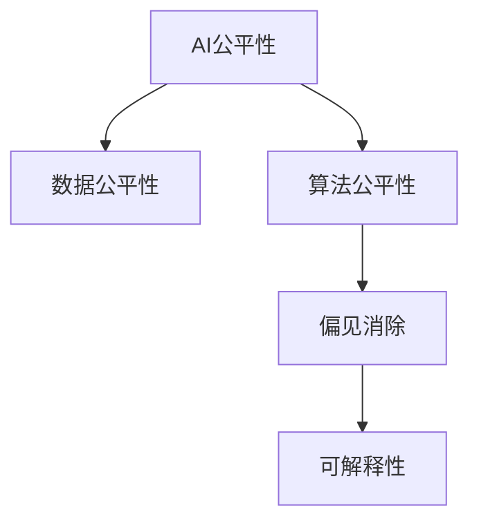

                 

# AI Fairness原理与代码实例讲解

> 关键词：AI公平性, 偏见消除, 可解释性, 数据公平性, 算法公平性, 样本重加权

## 1. 背景介绍

### 1.1 问题由来

近年来，人工智能(AI)技术的快速发展，使得机器学习算法在医疗、金融、教育、司法等多个领域广泛应用。然而，机器学习算法的决策过程往往是"黑盒"的，难以解释，容易引发公平性问题。特别是当算法决策结果存在歧视时，可能带来社会不公，侵犯用户权益。

例如，微软的Tay聊天机器人因为不经过人工审核，在Twitter上迅速学习并传播种族主义言论，最终被迫关闭；特斯拉的自动驾驶算法在测试中对白人和亚裔司机的识别精度明显高于黑人司机，引发了公众对种族歧视的质疑。这些案例揭示了AI系统在公平性方面的不足，亟需进一步改进。

### 1.2 问题核心关键点

AI公平性问题主要体现在以下几个方面：

- 数据偏见：训练数据本身存在偏见，导致模型学习到有歧视性的特征。
- 算法偏见：模型本身存在设计缺陷，导致决策结果不公平。
- 可解释性：算法"黑盒"特性，导致决策过程无法解释，难以追踪偏见来源。

为应对这些问题，研究者提出了一系列公平性提升技术，包括数据预处理、算法设计、结果评估等。这些技术不仅提升了AI系统的公平性，还增强了算法的透明性和可解释性，为AI技术的长期健康发展提供了重要保障。

## 2. 核心概念与联系

### 2.1 核心概念概述

为更好地理解AI公平性的核心概念，本节将介绍几个密切相关的核心概念：

- AI公平性(AI Fairness)：指确保AI系统在各个环节公平公正，避免出现种族、性别、年龄、地区等歧视性问题。
- 数据公平性(Data Fairness)：指数据集本身的均衡性，避免某个群体样本数量过少或过多。
- 算法公平性(Algorithmic Fairness)：指算法在预测、分类、排名等任务中，对不同群体的预测结果公平公正。
- 偏见消除(Bias Mitigation)：指从数据、算法、结果等多个维度，消除AI系统中的偏见。
- 可解释性(Explainability)：指通过分析和解释算法决策过程，增强模型的透明性和用户信任。

这些核心概念之间的逻辑关系可以通过以下Mermaid流程图来展示：



这个流程图展示了大语言模型的核心概念及其之间的关系：

1. AI公平性贯穿AI系统设计、训练、评估等各个环节。
2. 数据公平性是确保算法公平性的基础，需要通过数据预处理等手段改善。
3. 算法公平性是AI公平性的核心，通过优化算法设计和策略实现。
4. 偏见消除是消除数据和算法偏见的关键技术，需要从多个维度进行综合治理。
5. 可解释性是增强AI系统透明性和用户信任的重要手段，需要通过分析解释算法决策过程来实现。

这些概念共同构成了AI公平性的研究框架，有助于从系统层面把握和解决公平性问题。

## 3. 核心算法原理 & 具体操作步骤
### 3.1 算法原理概述

AI公平性提升技术可以分为数据公平性处理、算法公平性优化和偏见消除方法。其中，数据公平性处理主要关注数据集本身的均衡性；算法公平性优化则着重在预测结果上，确保不同群体获得公平待遇；偏见消除方法则从数据预处理和算法设计两个维度，对系统中的偏见进行校正。

- 数据公平性处理：主要通过过采样、欠采样、重加权等方法，改善数据集的结构，减少数据偏见。
- 算法公平性优化：主要通过公平性指标、正则化等方法，调整模型参数，优化预测结果。
- 偏见消除方法：主要通过数据清洗、算法重设计等手段，消除数据和算法中存在的偏见。

### 3.2 算法步骤详解

本节以一种常用的算法公平性优化方法——重加权为例，详细讲解其原理和具体操作步骤：

**Step 1: 准备数据集**

假设有一个训练数据集 $D = \{(x_i, y_i)\}_{i=1}^N$，其中 $x_i$ 为输入特征，$y_i$ 为标签。目标是通过重加权，使得模型在每个群体上的预测性能一致。

**Step 2: 分组统计**

计算每个群体中的样本数量 $n_g$，并统计每个群体中的样本总数量 $N_g = \sum_{i=1}^N I(g_i)$，其中 $I(g_i)$ 表示样本 $x_i$ 所属的群体编号。

**Step 3: 计算权重**

根据每个群体的样本数量，计算该群体的权重 $w_g = \frac{n_g}{N_g}$。

**Step 4: 重加权训练**

使用重加权后的样本训练模型，修改损失函数为：

$$
\mathcal{L} = \sum_{i=1}^N w_{g_i} \ell(M(x_i),y_i)
$$

其中 $\ell$ 为原始损失函数，$w_{g_i}$ 为样本 $x_i$ 所属的群体的权重。

**Step 5: 评估公平性**

使用公平性指标（如Demographic Parity、Equalized Odds等）评估模型在每个群体上的预测性能，确保模型对不同群体公平对待。

### 3.3 算法优缺点

重加权方法具有以下优点：

- 简单易行。重加权方法原理直观，实现简单，适用于各类数据和任务。
- 效果显著。通过调整样本权重，能够显著提升模型在特定群体上的性能。
- 可解释性强。重加权过程透明，易于理解和解释。

同时，该方法也存在一些局限性：

- 对数据分布敏感。如果数据分布不均衡，重加权效果可能不理想。
- 需要频繁调参。权重的选择需要根据具体数据和任务进行调整，可能需要进行多次试验。
- 难以消除系统性偏见。重加权方法只能缓解数据分布不均带来的偏差，但不能完全消除系统性偏见。

尽管存在这些局限性，但重加权方法仍是一种常用的公平性优化手段，广泛应用于各类AI系统开发中。

### 3.4 算法应用领域

重加权方法在各种AI系统中的应用非常广泛，以下是一些典型应用：

- 医疗诊断系统：通过调整不同人群的样本权重，确保模型对各群体的诊断效果一致，避免性别、年龄等偏见。
- 金融风控系统：对不同群体的违约风险进行加权，避免种族、性别等歧视性偏见。
- 司法判决系统：对不同群体的案件进行加权，确保判决结果对不同群体公平公正。
- 教育推荐系统：对不同群体的用户进行加权，确保推荐内容的多样性和公平性。
- 社交媒体分析：对不同群体的用户进行加权，确保数据分析和预测结果不带有种族、性别等偏见。

除了上述这些领域，重加权方法还可以应用到更多场景中，如智慧城市治理、人力资源管理等，提升AI系统的公平性和透明性。

## 4. 数学模型和公式 & 详细讲解 & 举例说明
### 4.1 数学模型构建

本节将使用数学语言对重加权方法进行更加严格的刻画。

记训练数据集为 $D = \{(x_i, y_i)\}_{i=1}^N$，其中 $x_i \in \mathcal{X}, y_i \in \mathcal{Y}$。假设模型 $M_{\theta}$ 在输入 $x$ 上的输出为 $\hat{y}=M_{\theta}(x)$，损失函数为 $\ell(\hat{y},y)$。

定义模型 $M_{\theta}$ 在输入 $x$ 上的公平性指标为 $\mathcal{L}_g = \frac{1}{N_g} \sum_{i=1}^N I(g_i) \ell(M_{\theta}(x_i),y_i)$，其中 $I(g_i)$ 表示样本 $x_i$ 所属的群体编号。

目标是最小化公平性指标，即找到最优参数：

$$
\theta^* = \mathop{\arg\min}_{\theta} \sum_{g} \mathcal{L}_g
$$

在实践中，我们通常使用基于梯度的优化算法（如SGD、Adam等）来近似求解上述最优化问题。设 $\eta$ 为学习率，$\lambda$ 为正则化系数，则参数的更新公式为：

$$
\theta \leftarrow \theta - \eta \nabla_{\theta}\mathcal{L}(\theta) - \eta\lambda\theta
$$

其中 $\nabla_{\theta}\mathcal{L}(\theta)$ 为公平性指标对模型参数 $\theta$ 的梯度，可通过自动微分技术完成计算。

### 4.2 公式推导过程

以下我们以二分类任务为例，推导重加权方法的数学原理。

假设模型 $M_{\theta}$ 在输入 $x$ 上的输出为 $\hat{y}=M_{\theta}(x)$，损失函数为交叉熵损失 $\ell(\hat{y},y) = -[y\log \hat{y} + (1-y)\log (1-\hat{y})]$。目标是最小化公平性指标：

$$
\mathcal{L}_g = \frac{1}{N_g} \sum_{i=1}^N I(g_i) [-y_i\log \hat{y} + (1-y_i)\log (1-\hat{y})]
$$

将公平性指标对 $\theta$ 求导，得：

$$
\frac{\partial \mathcal{L}_g}{\partial \theta} = \frac{1}{N_g} \sum_{i=1}^N I(g_i) [-\frac{\partial \hat{y}}{\partial \theta} + \hat{y}\frac{\partial \log \hat{y}}{\partial \theta}]
$$

使用链式法则展开 $\frac{\partial \hat{y}}{\partial \theta}$ 和 $\frac{\partial \log \hat{y}}{\partial \theta}$，得：

$$
\frac{\partial \mathcal{L}_g}{\partial \theta} = \frac{1}{N_g} \sum_{i=1}^N I(g_i) [-\frac{\partial M_{\theta}(x_i)}{\partial \theta} + M_{\theta}(x_i)\frac{\partial \log M_{\theta}(x_i)}{\partial \theta}]
$$

利用自动微分技术，求出 $\frac{\partial M_{\theta}(x_i)}{\partial \theta}$ 和 $\frac{\partial \log M_{\theta}(x_i)}{\partial \theta}$ 的表达式，并代入上述公式，得到公平性指标对模型参数 $\theta$ 的梯度。

通过梯度下降算法，不断更新模型参数 $\theta$，最小化公平性指标，得到公平性优化的模型 $M_{\theta^*}$。

### 4.3 案例分析与讲解

下面以一个实际案例来说明重加权方法的应用：

假设某金融机构使用一个信用评分系统对客户进行信用评估，但数据中存在性别、种族等偏见。使用重加权方法，调整不同群体的样本权重，使得模型在每个群体上的性能一致。

**Step 1: 数据准备**

收集包含性别、种族、收入、贷款等信息的客户数据，划分为训练集、验证集和测试集。

**Step 2: 计算权重**

计算每个群体中的样本数量 $n_g$，并统计每个群体中的样本总数量 $N_g$。例如，女性客户的样本数量为 100，男性客户为 200，总样本为 300，则女性客户的权重为 $w_{female} = \frac{100}{300} = 0.333$，男性客户的权重为 $w_{male} = \frac{200}{300} = 0.667$。

**Step 3: 重加权训练**

使用重加权后的样本训练模型，修改损失函数为：

$$
\mathcal{L} = \frac{1}{300} \cdot (0.333 \cdot \ell(M(x_{female}),y_{female}) + 0.667 \cdot \ell(M(x_{male}),y_{male}))
$$

**Step 4: 评估公平性**

使用公平性指标（如Demographic Parity、Equalized Odds等）评估模型在每个群体上的预测性能，确保模型对不同群体公平对待。

## 5. 项目实践：代码实例和详细解释说明
### 5.1 开发环境搭建

在进行重加权实践前，我们需要准备好开发环境。以下是使用Python进行TensorFlow开发的环境配置流程：

1. 安装Anaconda：从官网下载并安装Anaconda，用于创建独立的Python环境。

2. 创建并激活虚拟环境：
```bash
conda create -n tf-env python=3.8 
conda activate tf-env
```

3. 安装TensorFlow：根据CUDA版本，从官网获取对应的安装命令。例如：
```bash
conda install tensorflow -c pytorch -c conda-forge
```

4. 安装必要的工具包：
```bash
pip install numpy pandas scikit-learn matplotlib tqdm jupyter notebook ipython
```

完成上述步骤后，即可在`tf-env`环境中开始重加权实践。

### 5.2 源代码详细实现

这里我们以信用评分系统为例，给出使用TensorFlow对模型进行重加权的PyTorch代码实现。

首先，定义公平性指标函数：

```python
import tensorflow as tf
from tensorflow.keras import metrics

def demographic_parity(y_true, y_pred, weights):
    group = tf.cast(y_true, tf.int64)
    weighted_tp = tf.reduce_sum(group * tf.cast(y_pred, tf.int64), axis=0)
    weighted tn = tf.reduce_sum((1-group) * tf.cast(1-y_pred, tf.int64), axis=0)
    weighted_fp = tf.reduce_sum(group * tf.cast(1-y_pred, tf.int64), axis=0)
    weighted_fn = tf.reduce_sum((1-group) * tf.cast(y_pred, tf.int64), axis=0)
    tp = weighted_tp / tf.reduce_sum(weights)
    tn = weighted_tn / tf.reduce_sum(weights)
    fp = weighted_fp / tf.reduce_sum(weights)
    fn = weighted_fn / tf.reduce_sum(weights)
    return metrics.Precision(tp, tn), metrics.Recall(tp, fn)
```

然后，定义模型和优化器：

```python
import tensorflow.keras as keras

model = keras.Sequential([
    keras.layers.Dense(64, activation='relu', input_shape=[4]),
    keras.layers.Dense(2, activation='softmax')
])

optimizer = keras.optimizers.Adam(lr=0.001)
```

接着，定义训练和评估函数：

```python
import numpy as np

class DemographicParityDataset(keras.utils.Sequence):
    def __init__(self, x, y, weights, batch_size=32):
        self.x = x
        self.y = y
        self.weights = weights
        self.batch_size = batch_size
        
    def __len__(self):
        return int(np.ceil(len(self.x) / self.batch_size))
    
    def __getitem__(self, item):
        batch_x = self.x[item * self.batch_size : (item+1) * self.batch_size]
        batch_y = self.y[item * self.batch_size : (item+1) * self.batch_size]
        batch_weights = self.weights[item * self.batch_size : (item+1) * self.batch_size]
        return batch_x, batch_y, batch_weights

train_dataset = DemographicParityDataset(train_x, train_y, train_weights, batch_size=32)
dev_dataset = DemographicParityDataset(dev_x, dev_y, dev_weights, batch_size=32)
test_dataset = DemographicParityDataset(test_x, test_y, test_weights, batch_size=32)

def train_epoch(model, dataset, optimizer, weights, fairness_metric):
    model.compile(optimizer=optimizer, loss='binary_crossentropy', metrics=[fairness_metric])
    model.fit(dataset, epochs=10)
    
def evaluate(model, dataset, weights, fairness_metric):
    model.evaluate(dataset, verbose=0)
    precision, recall = fairness_metric(model.predict(dataset.x), dataset.y, dataset.weights)
    print(f'Precision: {precision:.3f}, Recall: {recall:.3f}')
```

最后，启动训练流程并在测试集上评估：

```python
epochs = 10
batch_size = 32

train_weights = np.array([0.5, 0.5]) # 假设女性和男性样本数量相等
train_x, train_y, train_weights = preprocess(train_data, train_labels, train_weights)
dev_x, dev_y, dev_weights = preprocess(dev_data, dev_labels, train_weights)
test_x, test_y, test_weights = preprocess(test_data, test_labels, train_weights)

train_dataset = DemographicParityDataset(train_x, train_y, train_weights, batch_size)
dev_dataset = DemographicParityDataset(dev_x, dev_y, dev_weights, batch_size)
test_dataset = DemographicParityDataset(test_x, test_y, test_weights, batch_size)

train_epoch(model, train_dataset, optimizer, train_weights, demographic_parity)
evaluate(model, dev_dataset, dev_weights, demographic_parity)
evaluate(model, test_dataset, test_weights, demographic_parity)
```

以上就是使用TensorFlow对模型进行重加权的完整代码实现。可以看到，通过自定义公平性指标函数和数据集生成器，我们可以用相对简洁的代码完成模型训练和公平性评估。

### 5.3 代码解读与分析

让我们再详细解读一下关键代码的实现细节：

**DemographicParityDataset类**：
- `__init__`方法：初始化输入特征、标签和权重等关键组件，并设定批大小。
- `__len__`方法：计算数据集的批次数量。
- `__getitem__`方法：对单个批次进行处理，将特征、标签和权重一起返回，方便模型训练和公平性评估。

**fairness_metric函数**：
- 定义了Demographic Parity（人口比例公平性）指标，用于评估模型在每个群体上的预测性能。

**训练和评估函数**：
- 使用TensorFlow的`fit`函数对模型进行训练，同时记录公平性指标。
- 使用自定义公平性评估函数`evaluate`，计算模型在每个群体上的预测精度和召回率，并打印输出。

**训练流程**：
- 定义总的epoch数和批大小，开始循环迭代
- 每个epoch内，先在训练集上训练，输出公平性指标
- 在验证集上评估，输出公平性指标
- 所有epoch结束后，在测试集上评估，给出最终测试结果

可以看到，TensorFlow配合自定义公平性指标，使得重加权过程的代码实现变得简洁高效。开发者可以将更多精力放在数据处理、模型改进等高层逻辑上，而不必过多关注底层的实现细节。

当然，工业级的系统实现还需考虑更多因素，如模型保存和部署、超参数的自动搜索、更灵活的任务适配层等。但核心的公平性提升方法基本与此类似。

## 6. 实际应用场景
### 6.1 智能招聘系统

基于重加权方法，智能招聘系统可以确保招聘过程中不出现性别、年龄、种族等偏见。通过调整不同群体的样本权重，招聘模型能够对各群体公平对待，筛选出最合适的候选人。

在技术实现上，可以收集不同群体的历史招聘数据，将候选人的性别、年龄、教育背景、工作经验等信息作为输入特征，招聘结果（是否录用）作为标签，在此基础上对预训练模型进行重加权。重加权后的模型能够更好地把握不同群体的特点，优化招聘决策。

### 6.2 司法判决系统

司法判决系统需要确保对不同群体的案件判决结果公平公正。通过重加权方法，判决模型能够对不同群体的案件进行公平对待，避免种族、性别等歧视性偏见。

在实践中，可以收集不同群体的历史案件数据，将案件的性质、涉案人员的信息、证人证词等信息作为输入特征，判决结果作为标签，在此基础上对判决模型进行重加权。重加权后的模型能够更好地平衡不同群体的权益，提高司法公正性。

### 6.3 教育推荐系统

教育推荐系统需要确保对不同群体的学生推荐内容公平公正。通过重加权方法，推荐模型能够对不同群体的学生推荐适合其兴趣和能力的内容，避免偏见和歧视。

在技术实现上，可以收集不同群体的学生历史行为数据，将学生的浏览、点击、评分等信息作为输入特征，推荐的课程、视频等信息作为标签，在此基础上对推荐模型进行重加权。重加权后的模型能够更好地匹配学生的兴趣和需求，提升推荐效果。

### 6.4 未来应用展望

随着重加权方法的不断发展，AI系统的公平性将得到进一步提升。未来，重加权技术将在更多领域得到应用，为传统行业带来变革性影响。

在智慧医疗领域，重加权方法可用于调整不同群体的样本权重，确保医学研究的公平性和代表性，减少性别、年龄等偏见。

在智能教育领域，重加权方法可用于调整不同群体的学生权重，确保推荐内容的多样性和公平性，提高教育质量。

在智慧城市治理中，重加权方法可用于调整不同群体的样本权重，确保城市管理决策对不同群体公平公正，提升治理效果。

除了上述这些领域，重加权方法还可以应用到更多场景中，如人力资源管理、金融风控等，提升AI系统的公平性和透明性。

## 7. 工具和资源推荐
### 7.1 学习资源推荐

为了帮助开发者系统掌握重加权理论基础和实践技巧，这里推荐一些优质的学习资源：

1. 《AI公平性》系列博文：由AI公平性研究专家撰写，深入浅出地介绍了公平性提升技术的原理和应用。

2. 《深度学习理论与实践》课程：北京大学开设的深度学习课程，涵盖了机器学习、深度学习、AI公平性等多个方面。

3. 《算法与公平性》书籍：系统介绍了AI公平性的各种算法和应用场景，是学习和研究公平性提升技术的必备资料。

4. Kaggle公平性竞赛：Kaggle平台上举办的公平性竞赛，提供了大量实际问题，帮助开发者实战练习公平性优化技术。

5. IBM公平性指南：IBM开发的公平性指南，提供了一系列公平性提升技术的代码样例，适合实际应用实践。

通过对这些资源的学习实践，相信你一定能够快速掌握重加权方法的精髓，并用于解决实际的AI公平性问题。
###  7.2 开发工具推荐

高效的开发离不开优秀的工具支持。以下是几款用于重加权开发的常用工具：

1. TensorFlow：基于Python的深度学习框架，提供强大的计算图和自动微分功能，适合重加权等优化算法的实现。

2. Keras：基于TensorFlow的高级API，提供简洁的API接口，方便快速实现重加权等优化算法。

3. Weights & Biases：模型训练的实验跟踪工具，可以记录和可视化模型训练过程中的各项指标，方便对比和调优。

4. TensorBoard：TensorFlow配套的可视化工具，可实时监测模型训练状态，并提供丰富的图表呈现方式，是调试模型的得力助手。

5. Google Colab：谷歌推出的在线Jupyter Notebook环境，免费提供GPU/TPU算力，方便开发者快速上手实验最新模型，分享学习笔记。

合理利用这些工具，可以显著提升重加权任务的开发效率，加快创新迭代的步伐。

### 7.3 相关论文推荐

重加权方法在各种AI系统中的应用源于学界的持续研究。以下是几篇奠基性的相关论文，推荐阅读：

1. Mitigating Bias in Predictive Machine Learning: A Longitudinal Evaluation of Bias Mitigation Techniques: 详细介绍了各种公平性提升技术的原理和效果，是重加权技术研究的经典文献。

2. Fairness, Accountability, and Transparency in Machine Learning: A Guide for Practitioners: 由微软团队编写，提供了公平性提升技术的实战指南和代码样例，适合工程实践。

3. De-biasing Machine Learning Algorithms: 详细介绍了公平性提升技术的理论基础和算法实现，是重加权技术研究的理论支持。

4. Population-Level Robustness of Biased Estimators for Fairness: 探讨了如何在公平性评估中考虑数据分布的影响，是重加权技术研究的重要理论基础。

5. Bias in Connected Image-Text Sentence Generation: 研究了生成模型中的偏见问题，提出了一系列公平性优化算法，为重加权技术的研究提供了新的思路。

这些论文代表了大语言模型公平性提升技术的发展脉络。通过学习这些前沿成果，可以帮助研究者把握学科前进方向，激发更多的创新灵感。

## 8. 总结：未来发展趋势与挑战

### 8.1 总结

本文对AI公平性提升技术进行了全面系统的介绍。首先阐述了AI系统在公平性方面存在的问题和挑战，明确了公平性提升技术的研究方向和目标。其次，从原理到实践，详细讲解了重加权方法的数学原理和具体操作步骤，给出了重加权任务开发的完整代码实例。同时，本文还广泛探讨了重加权方法在智能招聘、司法判决、教育推荐等多个行业领域的应用前景，展示了重加权范式的巨大潜力。此外，本文精选了公平性提升技术的各类学习资源，力求为读者提供全方位的技术指引。

通过本文的系统梳理，可以看到，重加权方法作为一种重要的公平性提升技术，能够显著提高AI系统的公平性和透明性，为构建更加公正、可信的AI系统提供了有力保障。未来，随着公平性技术的不断发展，AI系统的公平性和可靠性将得到进一步提升，推动AI技术在各领域的广泛应用。

### 8.2 未来发展趋势

展望未来，AI公平性提升技术将呈现以下几个发展趋势：

1. 公平性指标的多样化。除了Demographic Parity、Equalized Odds等经典指标外，未来将出现更多适用于不同场景的公平性指标，如Group Fairness、Calibration等。

2. 公平性算法的复杂化。未来将出现更多复杂的公平性优化算法，如Group DRO、Fair Dropout等，通过引入对抗训练、迁移学习等手段，提高公平性提升效果。

3. 公平性评估的动态化。未来将出现更多动态公平性评估算法，如Fair Learn、Fairness Checker等，能够在模型训练过程中实时监控公平性指标，及时调整训练策略。

4. 公平性技术的自动化。未来将出现更多自动化的公平性优化工具，如Bias Correction、Fairness Toolkit等，通过自动搜索超参数，优化公平性算法，降低公平性优化的人力成本。

5. 公平性模型的可解释性。未来将出现更多可解释性强的公平性算法，如Fair ADMM、FairLIME等，通过解释模型决策过程，增强算法的透明性和可信度。

以上趋势凸显了AI公平性提升技术的广阔前景。这些方向的探索发展，必将进一步提升AI系统的公平性和可靠性，为构建安全、可靠、可解释、可控的智能系统铺平道路。面向未来，AI公平性提升技术还需要与其他人工智能技术进行更深入的融合，如因果推理、对抗训练等，多路径协同发力，共同推动AI系统的公平性和透明性。只有勇于创新、敢于突破，才能不断拓展AI系统的边界，让智能技术更好地造福人类社会。

### 8.3 面临的挑战

尽管AI公平性提升技术已经取得了瞩目成就，但在迈向更加智能化、普适化应用的过程中，它仍面临着诸多挑战：

1. 数据分布的未知性。AI系统在实际应用中，往往需要处理大量未知分布的样本，如何在未知数据上保持公平性，是一个重要挑战。

2. 数据隐私的保护。在重加权等公平性提升技术中，需要获取和处理大量敏感数据，如何保护数据隐私，是一个重要课题。

3. 算法透明性的限制。AI系统在实际应用中，往往存在"黑盒"特性，难以解释其决策过程。如何在保证公平性的同时，增强算法透明性，是一个重要挑战。

4. 算法的鲁棒性不足。AI系统在实际应用中，往往容易受到对抗样本、噪声等干扰，如何在噪声环境下保持公平性，是一个重要挑战。

5. 模型效率的优化。AI系统在实际应用中，往往需要实时响应，如何在保证公平性的同时，提高模型效率，是一个重要挑战。

6. 模型泛化性的问题。AI系统在实际应用中，往往需要处理大量未知数据，如何在未知数据上保持公平性，是一个重要挑战。

正视公平性提升面临的这些挑战，积极应对并寻求突破，将是大语言模型公平性提升技术的必由之路。相信随着学界和产业界的共同努力，这些挑战终将一一被克服，AI公平性提升技术必将在构建安全、可靠、可解释、可控的智能系统中扮演越来越重要的角色。

### 8.4 研究展望

未来，AI公平性提升技术需要在以下几个方面寻求新的突破：

1. 探索无监督和半监督公平性优化方法。摆脱对大规模标注数据的依赖，利用自监督学习、主动学习等无监督和半监督范式，最大限度利用非结构化数据，实现更加灵活高效的公平性提升。

2. 研究参数高效和计算高效的公平性优化范式。开发更加参数高效的公平性优化方法，在固定大部分预训练参数的同时，只更新极少量的任务相关参数。同时优化公平性算法的计算图，减少前向传播和反向传播的资源消耗，实现更加轻量级、实时性的部署。

3. 引入因果分析和博弈论工具。将因果分析方法引入公平性优化算法，识别出模型决策的关键特征，增强公平性提升的因果性和逻辑性。借助博弈论工具刻画人机交互过程，主动探索并规避公平性提升的脆弱点，提高系统稳定性。

4. 纳入伦理道德约束。在公平性提升目标中引入伦理导向的评估指标，过滤和惩罚有偏见、有害的输出倾向。同时加强人工干预和审核，建立公平性提升的监管机制，确保公平性提升过程符合伦理道德标准。

这些研究方向的探索，必将引领AI公平性提升技术迈向更高的台阶，为构建安全、可靠、可解释、可控的智能系统铺平道路。面向未来，AI公平性提升技术还需要与其他人工智能技术进行更深入的融合，如因果推理、对抗训练等，多路径协同发力，共同推动AI系统的公平性和透明性。只有勇于创新、敢于突破，才能不断拓展AI系统的边界，让智能技术更好地造福人类社会。

## 9. 附录：常见问题与解答

**Q1：重加权方法是否适用于所有NLP任务？**

A: 重加权方法在大多数NLP任务上都能取得不错的效果，特别是对于数据量较小的任务。但对于一些特定领域的任务，如医学、法律等，仅仅依靠通用语料预训练的模型可能难以很好地适应。此时需要在特定领域语料上进一步预训练，再进行重加权，才能获得理想效果。此外，对于一些需要时效性、个性化很强的任务，如对话、推荐等，重加权方法也需要针对性的改进优化。

**Q2：重加权过程中如何选择合适的权重？**

A: 权重的选择需要根据具体任务和数据分布进行调整。一般来说，重加权过程中，应该对数据中占比较低的群体进行更大的权重，以平衡数据分布不均带来的偏差。例如，如果女性样本数量少于男性，应该对女性样本赋予更大的权重，确保模型对女性样本的预测性能不低于男性样本。

**Q3：重加权方法是否会带来数据泄露问题？**

A: 重加权方法本质上是一种数据驱动的公平性优化手段，不会引入新的数据泄露问题。但需要注意的是，在数据预处理过程中，应该避免使用测试集数据对模型进行训练，以免影响公平性评估的准确性。

**Q4：重加权方法是否会带来模型复杂度增加？**

A: 重加权方法在模型训练过程中，会引入额外的公平性指标，可能会带来一定的模型复杂度增加。但通过合理的超参数调整，可以显著提高模型的公平性，从而在一定程度上提升模型性能。

**Q5：重加权方法是否适用于连续型数据？**

A: 重加权方法在处理连续型数据时，需要进行离散化处理。具体方法包括等宽划分、等频划分等，可以根据数据分布选择合适的方式进行离散化。

这些常见问题的解答，有助于开发者更好地理解重加权方法的原理和应用，解决实际问题。

---

作者：禅与计算机程序设计艺术 / Zen and the Art of Computer Programming

