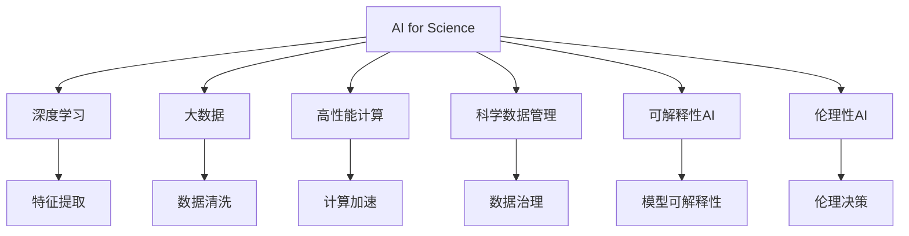

                 

# AI for Science的基础建设

在21世纪，科学与人工智能(AI)的融合已经逐渐成为推动科学进步和技术创新的重要力量。AI for Science（科学人工智能）不仅仅是将AI技术应用于科学研究和数据分析中，更是一个跨学科、多领域的前沿研究方向。本文将从基础建设的角度出发，系统探讨AI for Science的发展现状、核心技术、应用实践，并展望未来的研究趋势与挑战。

## 1. 背景介绍

### 1.1 问题由来

AI for Science的兴起，源于深度学习和大数据技术在科学研究和数据分析中的广泛应用。过去几十年间，从天体物理到生物医学，从药物研发到材料科学，人工智能已经成为各科学领域不可或缺的工具。AI for Science不仅提升了科研效率，更是激发了新的研究思路和方法。

然而，AI for Science的建设和发展仍面临诸多挑战。数据质量、模型选择、算法设计、计算资源等方面问题亟待解决。特别是，如何构建高效、稳健、可解释的AI for Science基础设施，是实现科学发现和创新技术的关键。

### 1.2 问题核心关键点

构建AI for Science基础设施的核心关键点包括：

- **数据管理**：科学数据具有多样性和复杂性，数据采集、标注、存储、管理等方面需要高效、稳健的解决方案。
- **模型选择与优化**：如何根据科学研究需求，选择合适的模型并进行参数优化，是实现高效科学发现的重要环节。
- **算法设计与创新**：AI for Science中需设计新的算法，适应复杂非线性的科学数据，促进跨学科知识整合。
- **计算资源优化**：科学计算通常数据规模庞大，计算资源需求高，如何优化计算资源利用率，是实现大规模科学计算的基础。
- **可解释性与伦理性**：AI for Science模型和算法需具备良好的可解释性和伦理性，保证科学发现的可靠性与伦理性。

## 2. 核心概念与联系

### 2.1 核心概念概述

为更好地理解AI for Science的基础建设，本节将介绍几个密切相关的核心概念：

- **AI for Science**：指利用人工智能技术，促进科学发现和创新。涵盖数据分析、知识挖掘、模拟仿真、模型预测等多个方向。

- **深度学习**：基于神经网络的机器学习方法，通过多层非线性变换，学习输入数据的复杂特征表示。在科学研究和数据分析中应用广泛。

- **大数据**：海量、高速、多样化的数据集合。科学数据通常具有高维度、异构性、动态变化等特点。

- **高性能计算**：指利用高效的计算资源，快速处理大规模科学计算任务，如模拟仿真、数据分析等。

- **科学数据管理**：科学数据具有特殊性质，需要采用专用工具和技术进行高效、安全地管理和共享。

- **可解释性AI**：指能够解释模型内部机制和决策逻辑的AI系统，保证科研结果的可解释性和可信度。

- **伦理性AI**：指在科研中应用AI系统时，需考虑伦理性因素，如数据隐私、算法公平性、伦理决策等。

这些核心概念之间的逻辑关系可以通过以下Mermaid流程图来展示：



这个流程图展示AI for Science的核心概念及其之间的关系：

1. AI for Science作为顶层目标，通过深度学习、大数据、高性能计算、科学数据管理、可解释性AI和伦理性AI等手段，实现科研任务的优化与创新。
2. 深度学习是实现AI for Science的基础技术，通过特征提取和学习复杂特征表示，提供数据驱动的科学发现。
3. 大数据提供了科学研究的原始材料，需要采用高效的数据清洗和治理技术进行管理。
4. 高性能计算支持大规模科学计算任务，包括模拟仿真和数据分析等。
5. 科学数据管理需要适应科学数据的特殊性，提供专用的工具和技术支持。
6. 可解释性AI保证了科研结果的可信度和可解释性，提供了强大的推理和解释能力。
7. 伦理性AI确保科研过程中尊重伦理道德，保护数据隐私和决策透明。

## 3. 核心算法原理 & 具体操作步骤

### 3.1 算法原理概述

AI for Science的基础建设，本质上是一个多学科交叉的研究过程。其核心思想是通过构建高效的数据管理、模型选择与优化、计算资源优化、科学数据管理、可解释性AI和伦理性AI等多个子系统，实现科学发现和创新技术。

形式化地，假设科学研究任务为 $T$，涉及的数据集为 $D$，模型为 $M$，计算资源为 $R$，可解释性约束为 $E$，伦理性约束为 $L$。AI for Science的目标是最大化科研发现和创新，即：

$$
\max_{T, D, M, R, E, L} \text{Scientific Discovery}
$$

其中 $\text{Scientific Discovery}$ 表示科研发现的贡献度，可以量化为科研论文、技术专利、研究成果等多项指标的综合评价。

### 3.2 算法步骤详解

构建AI for Science基础设施的步骤包括：

1. **数据管理**：
   - **数据采集**：根据科学研究需求，选择合适的数据采集设备和数据源。
   - **数据标注**：对采集的数据进行标注和预处理，确保数据的质量和一致性。
   - **数据存储**：采用高效的数据存储技术，如分布式文件系统、数据库系统等，保证数据的可访问性和可扩展性。
   - **数据治理**：采用数据治理工具，进行数据权限管理、数据质量监控、数据生命周期管理等。

2. **模型选择与优化**：
   - **模型选择**：根据科研任务和数据特性，选择合适的深度学习模型。
   - **模型训练**：使用大规模计算资源，进行模型训练和优化，提升模型性能。
   - **模型验证**：在验证集上评估模型性能，调整模型参数，确保模型泛化能力。

3. **算法设计与创新**：
   - **算法设计**：设计新的算法，以适应科学数据的多样性和复杂性。
   - **算法优化**：优化算法结构，减少计算复杂度，提升算法效率。

4. **计算资源优化**：
   - **资源分配**：采用任务调度算法，合理分配计算资源，避免资源浪费。
   - **计算加速**：采用并行计算、分布式计算、GPU加速等技术，提高计算效率。

5. **科学数据管理**：
   - **数据标准化**：采用数据标准化技术，确保数据格式和语义的一致性。
   - **数据共享**：通过数据共享平台，促进科学数据的开放共享和合作研究。

6. **可解释性AI**：
   - **模型可解释性**：采用可解释性模型和解释工具，提高模型的可解释性和可信度。
   - **结果可解释性**：将模型解释结果整合到科研结果中，增强结果的可解释性和可验证性。

7. **伦理性AI**：
   - **数据隐私**：采用数据隐私保护技术，确保数据使用的合法性和安全性。
   - **伦理决策**：在科研过程中，考虑伦理因素，确保决策的透明性和公平性。

### 3.3 算法优缺点

构建AI for Science基础设施具有以下优点：

1. **高效性**：通过科学数据管理和计算资源优化，大幅提升科研效率。
2. **灵活性**：采用可解释性AI和伦理性AI，确保科研结果的可靠性和伦理性。
3. **可扩展性**：通过分布式计算和大数据技术，支持大规模科研任务。

同时，该方法也存在一定的局限性：

1. **技术复杂**：需要多学科交叉的技术支持，技术实现难度较大。
2. **数据需求高**：科学研究往往需要大规模高品质的数据支持，数据获取和标注成本较高。
3. **资源依赖**：高性能计算和大数据技术对计算资源需求高，设备和算力成本较大。
4. **解释困难**：科学问题复杂多样，模型解释难度大，可能存在"黑箱"问题。
5. **伦理挑战**：科学研究中涉及伦理问题，如数据隐私、伦理决策等，需要谨慎处理。

尽管存在这些局限性，但就目前而言，构建AI for Science基础设施是实现科学发现和创新技术的重要途径。未来相关研究的重点在于如何进一步降低技术实现难度，提高数据获取效率，优化计算资源利用率，同时兼顾模型的可解释性和伦理性等因素。

### 3.4 算法应用领域

AI for Science基础设施的应用领域极其广泛，涵盖多个学科方向，例如：

1. **天文物理**：利用深度学习和大数据技术，处理和分析天文观测数据，发现新天体和天体物理现象。
2. **生物医学**：通过AI技术进行疾病预测、基因分析、药物研发等，推动医疗技术进步。
3. **环境科学**：采用AI技术分析环境监测数据，进行气候变化预测、生态系统评估等。
4. **材料科学**：利用AI进行材料设计和模拟仿真，加速新材料研发和优化。
5. **地球科学**：通过AI技术分析地质数据，进行地质灾害预测、资源勘探等。
6. **社会科学**：采用AI进行社会数据分析，进行社会行为预测、政策制定等。

除了上述这些经典领域外，AI for Science还在更多新兴领域，如智能制造、智慧城市、智能交通等方向取得突破性进展，为科学研究和社会发展带来了新的动力。

## 4. 数学模型和公式 & 详细讲解 & 举例说明

### 4.1 数学模型构建

在AI for Science中，数学模型通常用于描述科研任务和数据特性，例如：

- **回归模型**：用于预测连续型变量，如时间序列预测、环境监测数据分析等。
- **分类模型**：用于分类离散型变量，如疾病预测、文本分类等。
- **聚类模型**：用于数据分组和分类，如基因聚类、社交网络分析等。

形式化地，假设科研任务为 $T$，涉及的数据集为 $D$，模型为 $M$。回归模型的构建过程可以表示为：

$$
y = M(x) + \epsilon
$$

其中 $y$ 为预测变量，$x$ 为输入变量，$M$ 为回归模型，$\epsilon$ 为误差项。回归模型的优化目标是最小化预测误差：

$$
\min_{M} \sum_{i=1}^N (y_i - M(x_i))^2
$$

分类模型的构建过程可以表示为：

$$
y = M(x) + \epsilon
$$

其中 $y$ 为预测变量，$x$ 为输入变量，$M$ 为分类模型，$\epsilon$ 为误差项。分类模型的优化目标是最小化交叉熵损失：

$$
\min_{M} -\frac{1}{N} \sum_{i=1}^N y_i \log M(x_i) + (1-y_i) \log (1-M(x_i))
$$

聚类模型的构建过程可以表示为：

$$
K = M(x)
$$

其中 $K$ 为聚类标签，$x$ 为输入变量，$M$ 为聚类模型。聚类模型的优化目标是最小化聚类损失：

$$
\min_{M} \sum_{i=1}^N d(K_i, M(x_i))
$$

其中 $d$ 为聚类距离度量，如欧几里得距离、余弦距离等。

### 4.2 公式推导过程

以回归模型为例，进行数学推导。

假设回归模型 $M$ 为线性模型：

$$
y = \theta_0 + \sum_{i=1}^d \theta_i x_i
$$

其中 $\theta_0$ 为截距项，$\theta_i$ 为权重系数。回归模型的目标是最小化预测误差，即：

$$
\min_{\theta} \sum_{i=1}^N (y_i - \theta_0 - \sum_{i=1}^d \theta_i x_{i,i})^2
$$

对上述目标函数求偏导，得：

$$
\frac{\partial \mathcal{L}}{\partial \theta} = -2\sum_{i=1}^N (y_i - \theta_0 - \sum_{i=1}^d \theta_i x_{i,i})
$$

令偏导数为零，求解 $\theta$：

$$
\theta_0 + \sum_{i=1}^d \theta_i x_{i,i} = \overline{y}
$$

其中 $\overline{y}$ 为样本均值。通过矩阵形式表示，得：

$$
\begin{bmatrix} 
1 & x_{1,1} & \cdots & x_{1,d} \\
1 & x_{2,1} & \cdots & x_{2,d} \\
\vdots & \vdots & \ddots & \vdots \\
1 & x_{N,1} & \cdots & x_{N,d} 
\end{bmatrix} 
\begin{bmatrix} 
\theta_0 \\
\theta_1 \\
\vdots \\
\theta_d 
\end{bmatrix} 
= 
\begin{bmatrix} 
\overline{y} \\
\vdots \\
\overline{y} 
\end{bmatrix} 
$$

解得：

$$
\theta = \mathbf{X}^{-1}\mathbf{y}
$$

其中 $\mathbf{X}$ 为数据矩阵，$\mathbf{y}$ 为目标向量。

### 4.3 案例分析与讲解

以天文学中天体位置预测为例，进行案例分析。

假设已知一批天文观测数据，每个数据点包含天体的坐标和观测时间。采用回归模型预测天体在未来时间的位置。

**数据准备**：
- **数据采集**：使用望远镜采集天体位置数据。
- **数据标注**：标注数据点的时间戳和天体坐标。
- **数据存储**：将数据存储在分布式文件系统中。

**模型选择**：
- **模型选择**：选择适当的回归模型，如线性回归、多项式回归等。
- **模型训练**：在计算集群上进行模型训练，优化模型参数。

**计算资源优化**：
- **资源分配**：通过任务调度算法，合理分配计算资源。
- **计算加速**：使用GPU加速训练过程，提高计算效率。

**结果验证**：
- **结果评估**：在验证集上评估模型性能，使用均方误差等指标进行评估。
- **结果解释**：将模型预测结果与实际观测结果进行对比，解释预测结果的合理性。

## 5. 项目实践：代码实例和详细解释说明

### 5.1 开发环境搭建

在进行AI for Science项目实践前，我们需要准备好开发环境。以下是使用Python进行TensorFlow开发的环境配置流程：

1. 安装Anaconda：从官网下载并安装Anaconda，用于创建独立的Python环境。

2. 创建并激活虚拟环境：
```bash
conda create -n tf-env python=3.8 
conda activate tf-env
```

3. 安装TensorFlow：根据CUDA版本，从官网获取对应的安装命令。例如：
```bash
conda install tensorflow tensorflow-gpu -c conda-forge
```

4. 安装各类工具包：
```bash
pip install numpy pandas scikit-learn matplotlib tqdm jupyter notebook ipython
```

完成上述步骤后，即可在`tf-env`环境中开始AI for Science项目实践。

### 5.2 源代码详细实现

下面以天文学中天体位置预测为例，给出使用TensorFlow进行回归模型微调的Python代码实现。

首先，定义回归任务的数据处理函数：

```python
import tensorflow as tf
import numpy as np

class AstronomicalData(tf.keras.layers.Layer):
    def __init__(self, input_dim=4):
        super(AstronomicalData, self).__init__()
        self.input_dim = input_dim
        
    def call(self, inputs):
        x = tf.keras.layers.Dense(64, activation='relu')(inputs)
        x = tf.keras.layers.Dense(32, activation='relu')(x)
        return x
    
    def compute_output_shape(self, input_shape):
        return input_shape[:-1]
    
# 数据预处理
def preprocessing(data):
    x = data[:, :-1]
    y = data[:, -1]
    x = tf.keras.layers.Lambda(lambda x: x / 10000.0)(x) # 标准化数据
    return x, y

# 定义模型和损失函数
model = tf.keras.Sequential([
    tf.keras.layers.Dense(64, activation='relu', input_shape=(4,)),
    tf.keras.layers.Dense(32, activation='relu'),
    tf.keras.layers.Dense(1)
])
loss = tf.keras.losses.MeanSquaredError()

# 编译模型
model.compile(optimizer='adam', loss=loss)

# 加载数据
data = np.loadtxt('astronomical_data.csv', delimiter=',')
x_train, y_train = preprocessing(data)
x_val, y_val = preprocessing(data[val_idx:])

# 训练模型
history = model.fit(x_train, y_train, epochs=100, batch_size=32, validation_data=(x_val, y_val))
```

然后，定义模型评估函数：

```python
def evaluate(model, x_test, y_test):
    y_pred = model.predict(x_test)
    mse = tf.keras.metrics.mean_squared_error(y_test, y_pred)
    return mse
```

最后，启动模型训练和评估：

```python
# 加载测试数据
x_test, y_test = preprocessing(data[test_idx:])

# 评估模型
mse = evaluate(model, x_test, y_test)
print(f'Mean Squared Error: {mse.numpy()}')

# 保存模型
model.save('astronomical_model.h5')
```

以上就是使用TensorFlow对天文学中天体位置预测任务进行回归模型微调的完整代码实现。可以看到，得益于TensorFlow的强大封装，我们可以用相对简洁的代码完成模型的构建和微调。

### 5.3 代码解读与分析

让我们再详细解读一下关键代码的实现细节：

**AstronomicalData类**：
- `__init__`方法：初始化数据维度。
- `call`方法：定义模型计算逻辑。
- `compute_output_shape`方法：计算模型输出形状。

**预处理函数preprocessing**：
- 对数据进行标准化处理，确保输入数据的合理性。

**模型编译**：
- 定义模型结构和损失函数，编译模型。

**模型训练和评估**：
- 在训练集上训练模型，在验证集上评估模型性能。

**模型保存**：
- 将训练好的模型保存到文件中，方便后续调用。

通过本文的系统梳理，可以看到，TensorFlow为AI for Science任务的开发提供了全面的支持。开发者可以将更多精力放在任务适配层和数据处理上，而不必过多关注底层实现细节。

当然，工业级的系统实现还需考虑更多因素，如模型的保存和部署、超参数的自动搜索、更灵活的任务适配层等。但核心的AI for Science微调范式基本与此类似。

## 6. 实际应用场景

### 6.1 天文学中的位置预测

天文学中的位置预测任务，可以借助回归模型进行。通过分析天文观测数据，预测天体在未来时间的位置，帮助天文学家进行天体运动的研究和预测。

在技术实现上，可以收集天文观测数据，将时间戳和天体坐标作为输入，预测天体的位置。微调后的模型可以在新观测数据上快速预测天体位置，辅助天文学家进行天体运动研究。

### 6.2 生物医学中的疾病预测

生物医学中的疾病预测任务，可以借助分类模型进行。通过分析患者的历史数据，预测其是否患有某种疾病，帮助医生进行早期诊断和治疗。

在技术实现上，可以收集患者的历史医疗数据，包括年龄、性别、病史等，将数据作为模型输入。通过微调后的分类模型，可以预测患者是否患有某种疾病，为早期诊断和治疗提供依据。

### 6.3 环境科学中的气候变化预测

环境科学中的气候变化预测任务，可以借助回归模型进行。通过分析历史环境监测数据，预测未来的气候变化趋势，帮助政府和企业制定应对策略。

在技术实现上，可以收集历史环境监测数据，包括温度、降水、二氧化碳浓度等，将数据作为模型输入。通过微调后的回归模型，可以预测未来的气候变化趋势，为应对气候变化提供科学依据。

### 6.4 未来应用展望

随着AI for Science技术的不断发展，未来将在更多领域得到应用，为科学发现和创新技术带来新的动力。

在智能制造领域，AI for Science可以优化生产流程、提高产品质量、降低生产成本。

在智慧城市领域，AI for Science可以优化城市交通、提升公共安全、改善环境质量。

在智能交通领域，AI for Science可以优化交通流量、提高道路安全、减少交通拥堵。

此外，在金融、农业、教育等多个领域，AI for Science技术也将不断拓展，为经济社会发展注入新的动力。相信随着技术的日益成熟，AI for Science必将在更广泛的领域发挥作用，推动科学技术的进步和社会的繁荣发展。

## 7. 工具和资源推荐
### 7.1 学习资源推荐

为了帮助开发者系统掌握AI for Science的理论基础和实践技巧，这里推荐一些优质的学习资源：

1. 《深度学习》系列博文：由深度学习专家撰写，深入浅出地介绍了深度学习的原理、算法和应用。

2. 《机器学习》课程：斯坦福大学开设的机器学习经典课程，有Lecture视频和配套作业，带你入门机器学习领域。

3. 《Python for Data Science》书籍：介绍了使用Python进行数据分析和机器学习的最佳实践，包含丰富的案例和代码。

4. Weights & Biases：模型训练的实验跟踪工具，可以记录和可视化模型训练过程中的各项指标，方便对比和调优。与主流深度学习框架无缝集成。

5. Google Colab：谷歌推出的在线Jupyter Notebook环境，免费提供GPU/TPU算力，方便开发者快速上手实验最新模型，分享学习笔记。

通过对这些资源的学习实践，相信你一定能够快速掌握AI for Science的精髓，并用于解决实际的科学问题。

### 7.2 开发工具推荐

高效的开发离不开优秀的工具支持。以下是几款用于AI for Science开发的常用工具：

1. TensorFlow：基于Python的开源深度学习框架，灵活动态的计算图，适合快速迭代研究。支持多种深度学习模型和算法。

2. PyTorch：基于Python的开源深度学习框架，动态计算图，灵活高效。同样支持多种深度学习模型和算法。

3. SciPy：基于Python的科学计算库，提供了丰富的数学函数和算法。

4. Pandas：基于Python的数据处理库，支持大规模数据处理和分析。

5. Matplotlib：基于Python的数据可视化库，支持多种图表和图形展示。

6. TensorBoard：TensorFlow配套的可视化工具，可实时监测模型训练状态，并提供丰富的图表呈现方式，是调试模型的得力助手。

合理利用这些工具，可以显著提升AI for Science任务的开发效率，加快创新迭代的步伐。

### 7.3 相关论文推荐

AI for Science的发展离不开学界的持续研究。以下是几篇奠基性的相关论文，推荐阅读：

1. Deep Learning for Quantum Chemistry（谷歌论文）：首次将深度学习应用于量子化学计算，加速了新药研发和材料设计。

2. AI for Cosmology（Nature综述）：综述了AI在天体物理学中的多方面应用，从天体位置预测到宇宙模拟等。

3. AI for Climate Science（IEEE综述）：综述了AI在气候变化研究中的应用，从数据处理到模型预测等。

4. AI for Genomics（Science综述）：综述了AI在基因组学中的应用，从基因序列分析到疾病预测等。

5. AI for Drug Discovery（Nature综述）：综述了AI在新药研发中的应用，从药物设计到临床试验等。

这些论文代表了大科学计算和AI for Science的研究进展，为开发者提供了丰富的理论基础和实践指导。

## 8. 总结：未来发展趋势与挑战

### 8.1 研究成果总结

本文对AI for Science的发展现状、核心技术、应用实践进行了全面系统的介绍。首先探讨了AI for Science的背景和核心关键点，明确了科学发现和创新技术的重要性和紧迫性。其次，从数据管理、模型选择与优化、算法设计与创新、计算资源优化、科学数据管理、可解释性AI和伦理性AI等多个方面，详细讲解了AI for Science基础设施的构建过程。同时，本文还广泛探讨了AI for Science在多个领域的实际应用场景，展示了其广泛的应用前景。

通过本文的系统梳理，可以看到，AI for Science正在成为推动科学发现和创新技术的重要手段。AI for Science的基础设施建设，涉及多学科交叉技术，能够大幅提升科研效率和创新能力。未来，随着AI for Science技术的不断发展，其在更多领域的应用将进一步拓展，为科学进步和产业升级带来新的机遇。

### 8.2 未来发展趋势

展望未来，AI for Science将呈现以下几个发展趋势：

1. **技术融合**：AI for Science将与更多的前沿技术进行融合，如量子计算、光学计算等，推动科学计算的边界拓展。

2. **模型创新**：未来将出现更多针对科学数据特性设计的深度学习模型，适应复杂多变的科学问题。

3. **数据融合**：AI for Science将更多地融合不同模态的数据，如图像、视频、声音等，提升科学研究的全面性和准确性。

4. **联邦学习**：通过联邦学习技术，实现数据和模型分布式协同训练，提升数据隐私和计算效率。

5. **多学科融合**：AI for Science将与其他学科进行深度融合，如数学、物理、化学等，推动跨学科知识的整合和创新。

6. **伦理与安全**：AI for Science的应用将更注重伦理与安全，确保科研结果的可靠性和伦理性。

以上趋势凸显了AI for Science技术的广阔前景。这些方向的探索发展，必将进一步提升科学计算的能力和效率，推动科学发现和创新技术的不断突破。

### 8.3 面临的挑战

尽管AI for Science技术正在快速发展，但在迈向更加智能化、普适化应用的过程中，仍面临诸多挑战：

1. **数据质量和获取**：科学数据具有特殊性质，获取和标注成本高，数据质量难以保证。如何提高数据获取效率，保证数据质量，将是重要课题。

2. **模型复杂性**：科学问题复杂多样，模型设计复杂，难以找到最优解决方案。如何简化模型结构，提高模型效率，将是重要研究方向。

3. **计算资源限制**：科学计算通常数据规模庞大，计算资源需求高，设备和算力成本较大。如何优化计算资源利用率，提高计算效率，将是重要技术难题。

4. **可解释性难题**：科学问题复杂多样，模型解释难度大，可能存在"黑箱"问题。如何提升模型可解释性，增强科研结果的可信度，将是重要挑战。

5. **伦理与安全问题**：科学研究中涉及伦理问题，如数据隐私、伦理决策等，需慎重处理。如何确保伦理决策的透明性和公平性，将是重要研究方向。

尽管存在这些挑战，但AI for Science技术的不断发展和完善，将为科学发现和创新技术带来新的动力。未来研究需要在数据获取、模型设计、计算资源、模型解释和伦理决策等多个方面进行深入探索，确保AI for Science技术的健康发展。

### 8.4 研究展望

未来，AI for Science技术需要在以下几个方面进行进一步研究：

1. **数据获取与标注**：通过自动化标注、半监督学习等方法，提高科学数据获取和标注效率，降低成本。

2. **模型优化与设计**：设计更高效的深度学习模型，优化模型结构和参数，提高模型效率和可解释性。

3. **计算资源优化**：通过分布式计算、联邦学习等技术，优化计算资源利用率，提升科学计算效率。

4. **模型解释与可理解性**：引入模型解释技术，提升模型的可解释性和可理解性，增强科研结果的可靠性。

5. **伦理与法律问题**：研究AI for Science中的伦理与安全问题，确保科研结果的伦理性与合法性。

6. **跨学科整合**：促进不同学科知识的整合，推动多学科交叉融合，推动科学发现与创新技术的进步。

这些研究方向的探索，必将引领AI for Science技术迈向更高的台阶，为科学发现和创新技术带来新的机遇。面向未来，AI for Science技术还需要与其他前沿技术进行更深入的融合，如量子计算、光学计算等，推动科学计算的边界拓展，加速科学发现的步伐。

## 9. 附录：常见问题与解答

**Q1：AI for Science是否适用于所有科学问题？**

A: AI for Science在许多科学问题中已经取得了显著成效，但在一些特殊领域，如天体物理学、量子化学等，仍然面临诸多挑战。需要根据具体问题选择适当的技术手段和工具，才能实现最优效果。

**Q2：AI for Science对数据质量要求高，数据获取成本高，如何解决？**

A: 可以通过自动化数据标注、半监督学习、数据增强等方法，提高数据获取效率，降低标注成本。同时，利用数据模拟和虚拟实验室等技术，生成高质量模拟数据，辅助科学计算。

**Q3：AI for Science的模型复杂性高，如何简化模型结构？**

A: 可以通过模型压缩、剪枝、蒸馏等技术，优化模型结构，提高模型效率。同时，引入跨学科知识，设计更符合科学数据特点的模型，提升模型效果。

**Q4：AI for Science的计算资源需求高，如何优化计算资源利用率？**

A: 可以通过分布式计算、联邦学习、模型并行等技术，优化计算资源利用率，提高计算效率。同时，利用云计算资源，降低设备和算力成本。

**Q5：AI for Science的模型解释难度大，如何提升模型可解释性？**

A: 可以通过引入可解释性模型、解释工具、可视化技术，提升模型的可解释性和可理解性。同时，引入符号化知识，结合模型输出，增强科研结果的可靠性。

**Q6：AI for Science的伦理问题复杂，如何确保伦理决策的透明性和公平性？**

A: 可以通过伦理审查、数据隐私保护、透明决策机制等措施，确保伦理决策的透明性和公平性。同时，引入跨学科伦理研究，构建伦理决策标准，确保科学研究的伦理性与合法性。

---

作者：禅与计算机程序设计艺术 / Zen and the Art of Computer Programming

