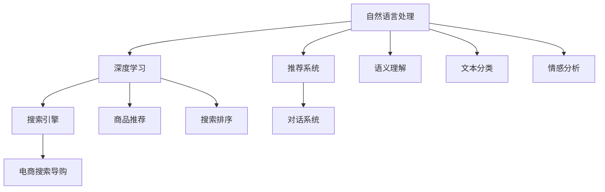

                 

# AI 在电商搜索导购中的应用案例：解析成功案例，揭示行业趋势

> 关键词：电商搜索导购, AI, 成功案例, 行业趋势

## 1. 背景介绍

### 1.1 问题由来

随着电商行业的迅猛发展，用户数量呈爆炸式增长，海量的商品和复杂的搜索需求使得电商企业的搜索和导购系统面临着巨大的挑战。传统的人工搜索和推荐方法已无法满足用户多样化的需求，效率和精准度均无法达到预期效果。为了提升用户搜索体验，降低人工成本，各大电商平台纷纷引入人工智能技术，构建智能化的搜索导购系统，从而在电商竞争中取得优势。

近年来，以自然语言处理(NLP)和深度学习为基础的人工智能技术，在电商搜索导购领域得到了广泛的应用，并取得了显著的成果。人工智能驱动的搜索系统不仅可以理解用户搜索的语义，还能提供更加个性化的推荐，显著提升电商平台的转化率和用户满意度。

### 1.2 问题核心关键点

1. **用户需求理解**：理解用户搜索的意图和需求，准确获取用户所需信息。
2. **商品推荐**：根据用户搜索和浏览历史，提供个性化推荐，提升用户体验和转化率。
3. **搜索排序**：对搜索结果进行排序优化，确保搜索结果的相关性和有序性。
4. **对话交互**：构建基于AI的对话系统，提升用户搜索和导购的交互体验。

## 2. 核心概念与联系

### 2.1 核心概念概述

为更好地理解AI在电商搜索导购中的应用，本节将介绍几个关键概念：

- **自然语言处理（NLP）**：人工智能的一个分支，专注于让机器能够理解、解释和生成自然语言。NLP在电商搜索导购中的应用包括语义理解、文本分类、情感分析等。
- **深度学习（Deep Learning）**：一种基于神经网络的机器学习方法，通过多层非线性变换，实现对复杂数据结构的建模。在电商搜索导购中，深度学习模型被广泛用于商品推荐、搜索排序等任务。
- **推荐系统（Recommendation System）**：根据用户的历史行为和偏好，预测用户可能感兴趣的商品，并进行推荐。推荐系统在电商搜索导购中的应用包括基于内容的推荐、协同过滤等。
- **搜索引擎（Search Engine）**：一种自动信息检索系统，能够通过用户输入的查询词，自动匹配并返回相关的搜索结果。在电商搜索导购中，搜索引擎用于快速响应用户的搜索需求。
- **对话系统（Chatbot）**：一种基于AI的自动对话系统，能够通过自然语言处理技术，理解用户意图，提供实时对话和导购服务。在电商搜索导购中，对话系统用于解答用户问题、提供个性化推荐等。

这些概念之间的逻辑关系可以通过以下Mermaid流程图来展示：



这个流程图展示了大语言模型在电商搜索导购中的应用框架：

1. 自然语言处理通过语义理解、文本分类、情感分析等技术，获取用户查询词的含义。
2. 深度学习模型用于商品推荐和搜索排序，对搜索结果进行优化。
3. 推荐系统基于用户历史行为和偏好，提供个性化推荐。
4. 搜索引擎通过匹配查询词，快速返回相关商品信息。
5. 对话系统进行实时对话，提供导购服务。

这些核心概念共同构成了电商搜索导购系统的人工智能应用框架，使得系统能够更好地理解和满足用户需求，提升电商平台的销售转化和用户满意度。

## 3. 核心算法原理 & 具体操作步骤
### 3.1 算法原理概述

AI在电商搜索导购中的应用，主要通过自然语言处理、深度学习和推荐系统的结合来实现。其核心思想是：利用自然语言处理技术理解用户查询词的语义，然后通过深度学习模型，构建用户与商品之间的语义关系，最终在推荐系统中，提供个性化的商品推荐和搜索排序，提升用户体验和转化率。

形式化地，假设用户查询词为 $q$，商品集合为 $I$，深度学习模型为 $M$，推荐系统为 $R$，用户行为数据为 $D$。则电商搜索导购系统的优化目标可以表示为：

$$
\min_{M, R} \mathcal{L}(R(M(q), D))
$$

其中 $\mathcal{L}$ 为推荐系统性能损失函数，$R(M(q), D)$ 表示模型 $M$ 在用户行为数据 $D$ 上的推荐结果，$\mathcal{L}$ 用于衡量推荐结果与实际用户行为之间的差异。

通过梯度下降等优化算法，不断更新模型参数 $M$ 和 $R$，最小化损失函数 $\mathcal{L}$，使得推荐系统输出与用户实际行为更接近，从而实现个性化推荐和搜索排序。

### 3.2 算法步骤详解

AI在电商搜索导购中的应用，主要分为以下几个关键步骤：

**Step 1: 数据收集与预处理**

- 收集用户搜索记录、浏览历史、购买记录等行为数据，构建用户行为数据集 $D$。
- 对数据进行清洗和预处理，去除噪声和不相关数据，保留有用信息。

**Step 2: 自然语言处理**

- 利用NLP技术，对用户查询词进行分词、词性标注、实体识别等预处理，构建用户查询向量 $q'$。
- 通过语义理解模型，理解查询词的语义，提取关键信息。

**Step 3: 深度学习模型训练**

- 利用深度学习模型，对用户行为数据进行建模，提取用户兴趣和商品特征，构建用户行为向量 $u$ 和商品向量 $v$。
- 通过多任务学习等技术，联合训练用户行为向量和商品向量，增强模型的鲁棒性。

**Step 4: 商品推荐**

- 利用推荐系统，对用户行为向量和商品向量进行匹配，生成推荐结果 $R(q)$。
- 结合排序算法，对推荐结果进行排序优化，生成最终推荐列表。

**Step 5: 对话系统**

- 利用对话系统，对用户查询词进行实时对话和回复，提供个性化的导购服务。
- 通过自然语言生成技术，生成与用户互动的回答，增强用户体验。

**Step 6: 评估与优化**

- 利用A/B测试等方法，评估推荐系统的效果和用户体验，收集用户反馈。
- 根据反馈结果，不断优化模型和算法，提升系统性能。

### 3.3 算法优缺点

AI在电商搜索导购中的应用，主要具有以下优点：

1. **提升用户体验**：利用自然语言处理和深度学习技术，能够更好地理解用户需求，提供个性化的商品推荐和搜索排序。
2. **降低人工成本**：通过自动化的推荐和排序，减少人工干预，降低运营成本。
3. **提高转化率**：基于用户行为数据，提供精准的推荐和排序，提升用户购买转化率。

同时，该方法也存在一些局限性：

1. **数据隐私问题**：用户行为数据的收集和处理，可能涉及用户隐私保护问题，需要严格遵守相关法规。
2. **算法复杂度**：深度学习模型的训练和优化，需要大量的计算资源和数据，对硬件和数据量要求较高。
3. **推荐冷启动**：对于新用户，由于缺乏历史行为数据，推荐效果可能较差，需要采取其他措施。
4. **模型泛化能力**：不同的用户和商品，其特征和行为模式可能存在较大差异，模型需要具备良好的泛化能力。

尽管存在这些局限性，但就目前而言，基于AI的电商搜索导购方法仍是大数据时代的主流范式，通过不断优化算法和技术，可以进一步提升系统的性能和用户体验。

### 3.4 算法应用领域

AI在电商搜索导购中的应用，已经被广泛应用于各种电商平台的搜索推荐和对话系统中。具体应用领域包括：

- **淘宝、京东、亚马逊等电商平台**：通过AI驱动的搜索导购系统，提升用户购物体验和转化率。
- **唯品会、蘑菇街等社交电商**：利用AI技术，提供个性化推荐和社交导购服务。
- **携程、美团等旅游平台**：利用AI技术，推荐旅游产品和路线，优化搜索排序。
- **拼多多、苏宁易购等下沉市场平台**：利用AI技术，提供精准的商品推荐和导购服务。

除了上述这些主流平台，AI在电商搜索导购中的应用，还在新兴的小众平台、跨境电商等领域逐渐普及，为电商行业带来了新的发展机遇。

## 4. 数学模型和公式 & 详细讲解 & 举例说明

### 4.1 数学模型构建

本节将使用数学语言对AI在电商搜索导购中的应用进行更加严格的刻画。

假设用户查询词为 $q$，商品集合为 $I$，深度学习模型为 $M$，推荐系统为 $R$，用户行为数据为 $D=\{(x_i, y_i)\}_{i=1}^N$，其中 $x_i$ 为商品向量，$y_i$ 为行为标签。

定义用户行为向量 $u_i$ 和商品向量 $v_i$ 分别为：

$$
u_i = M(x_i)
$$
$$
v_i = M(x_i')
$$

其中 $x_i'$ 为商品向量 $x_i$ 经过预处理后，通过深度学习模型 $M$ 得到的特征表示。

利用推荐系统 $R$，对用户查询词 $q$ 和商品向量 $u_i$、$v_i$ 进行匹配，生成推荐结果 $R(q)$，定义为：

$$
R(q) = R(M(q), D) = \arg\min_{y_i} \mathcal{L}(y_i, q)
$$

其中 $\mathcal{L}$ 为推荐系统性能损失函数，用于衡量推荐结果与实际用户行为之间的差异。

### 4.2 公式推导过程

以下我们以协同过滤推荐系统为例，推导推荐系统性能损失函数的计算公式。

假设用户 $i$ 对商品 $j$ 的行为为 $y_{ij}$，推荐系统 $R$ 推荐商品 $k$ 给用户 $i$ 的概率为 $P_{ik}$。则推荐系统性能损失函数定义为：

$$
\mathcal{L} = \frac{1}{N}\sum_{i=1}^N \sum_{j=1}^M \sum_{k=1}^N |y_{ij} - P_{ik}|
$$

将其代入推荐结果 $R(q)$ 的定义中，得：

$$
R(q) = \arg\min_{y_i} \frac{1}{N}\sum_{i=1}^N \sum_{j=1}^M \sum_{k=1}^N |y_{ij} - P_{ik}|
$$

### 4.3 案例分析与讲解

假设某电商平台收集了10000个用户的1000个商品的行为数据。利用协同过滤推荐系统，对用户 $i$ 推荐商品 $k$ 的概率定义为：

$$
P_{ik} = \frac{y_{ij}u_i^TV_kv}{u_i^TV_iV_k^TV}
$$

其中 $V$ 为商品特征矩阵，$u_i$ 和 $v_i$ 分别为用户行为向量和商品向量。

通过计算，可以得到用户 $i$ 对商品 $j$ 的推荐结果 $R(q)$。在实际应用中，推荐系统可以根据不同的任务需求，选择合适的推荐算法，如基于内容的推荐、深度学习推荐等，不断优化推荐效果。

## 5. 项目实践：代码实例和详细解释说明
### 5.1 开发环境搭建

在进行项目实践前，我们需要准备好开发环境。以下是使用Python进行TensorFlow开发的开发环境配置流程：

1. 安装Anaconda：从官网下载并安装Anaconda，用于创建独立的Python环境。

2. 创建并激活虚拟环境：
```bash
conda create -n tf-env python=3.8 
conda activate tf-env
```

3. 安装TensorFlow：根据CUDA版本，从官网获取对应的安装命令。例如：
```bash
conda install tensorflow -c conda-forge
```

4. 安装Flask：用于搭建Web应用，提供API接口。
```bash
pip install flask
```

5. 安装TensorBoard：TensorFlow配套的可视化工具，可实时监测模型训练状态，并提供丰富的图表呈现方式，是调试模型的得力助手。
```bash
pip install tensorboard
```

6. 安装PyTorch：用于构建深度学习模型。
```bash
pip install torch torchvision torchaudio
```

完成上述步骤后，即可在`tf-env`环境中开始项目实践。

### 5.2 源代码详细实现

下面我们以基于协同过滤推荐系统的代码实现为例，展示AI在电商搜索导购中的应用。

首先，定义推荐系统数据处理函数：

```python
import tensorflow as tf
import numpy as np
import pandas as pd

class RecommendationSystem:
    def __init__(self, data_path):
        self.data = pd.read_csv(data_path)
        self.train_data = self.data[self.data['is_train'] == 1]
        self.test_data = self.data[self.data['is_train'] == 0]
        
    def preprocess_data(self):
        self.train_data['user_id'] = self.train_data['user_id'].astype(int)
        self.train_data['item_id'] = self.train_data['item_id'].astype(int)
        self.train_data['rating'] = self.train_data['rating'].astype(float)
        self.test_data['user_id'] = self.test_data['user_id'].astype(int)
        self.test_data['item_id'] = self.test_data['item_id'].astype(int)
        
    def train_test_split(self, train_ratio=0.8):
        train_size = int(len(self.data) * train_ratio)
        self.train_data = self.data.iloc[:train_size]
        self.test_data = self.data.iloc[train_size:]
        
    def build_model(self):
        self.user_count = len(self.train_data['user_id'].unique())
        self.item_count = len(self.train_data['item_id'].unique())
        self.train_data['rating'] = self.train_data['rating'] - 2.5
        self.train_data['rating'] = self.train_data['rating'] / 2.5
        
        self.u = tf.keras.layers.Embedding(self.user_count, 10, input_length=1)
        self.v = tf.keras.layers.Embedding(self.item_count, 10, input_length=1)
        self.u.trainable = False
        self.v.trainable = False
        self.u_seq = tf.keras.layers.Input(shape=(1,))
        self.v_seq = tf.keras.layers.Input(shape=(1,))
        self.pred = tf.keras.layers.Dot(axes=1, normalize=True)([self.u(self.u_seq), self.v(self.v_seq)])
        self.model = tf.keras.Model(inputs=[self.u_seq, self.v_seq], outputs=self.pred)
        self.model.compile(loss='mse', optimizer=tf.keras.optimizers.Adam(learning_rate=0.001))
        self.model.summary()
```

然后，定义训练和预测函数：

```python
class RecommendationSystem:
    def __init__(self, data_path):
        self.data = pd.read_csv(data_path)
        self.train_data = self.data[self.data['is_train'] == 1]
        self.test_data = self.data[self.data['is_train'] == 0]
        
    def preprocess_data(self):
        self.train_data['user_id'] = self.train_data['user_id'].astype(int)
        self.train_data['item_id'] = self.train_data['item_id'].astype(int)
        self.train_data['rating'] = self.train_data['rating'].astype(float)
        self.test_data['user_id'] = self.test_data['user_id'].astype(int)
        self.test_data['item_id'] = self.test_data['item_id'].astype(int)
        
    def train_test_split(self, train_ratio=0.8):
        train_size = int(len(self.data) * train_ratio)
        self.train_data = self.data.iloc[:train_size]
        self.test_data = self.data.iloc[train_size:]
        
    def build_model(self):
        self.user_count = len(self.train_data['user_id'].unique())
        self.item_count = len(self.train_data['item_id'].unique())
        self.train_data['rating'] = self.train_data['rating'] - 2.5
        self.train_data['rating'] = self.train_data['rating'] / 2.5
        
        self.u = tf.keras.layers.Embedding(self.user_count, 10, input_length=1)
        self.v = tf.keras.layers.Embedding(self.item_count, 10, input_length=1)
        self.u.trainable = False
        self.v.trainable = False
        self.u_seq = tf.keras.layers.Input(shape=(1,))
        self.v_seq = tf.keras.layers.Input(shape=(1,))
        self.pred = tf.keras.layers.Dot(axes=1, normalize=True)([self.u(self.u_seq), self.v(self.v_seq)])
        self.model = tf.keras.Model(inputs=[self.u_seq, self.v_seq], outputs=self.pred)
        self.model.compile(loss='mse', optimizer=tf.keras.optimizers.Adam(learning_rate=0.001))
        self.model.summary()
        
    def train(self):
        self.model.fit(x=[self.train_data['user_id'].values.reshape(-1, 1), self.train_data['item_id'].values.reshape(-1, 1)],
                      y=self.train_data['rating'].values.reshape(-1, 1),
                      epochs=10, batch_size=128, validation_data=([self.test_data['user_id'].values.reshape(-1, 1), self.test_data['item_id'].values.reshape(-1, 1)], self.test_data['rating'].values.reshape(-1, 1)))
        
    def predict(self, user_id, item_id):
        user_seq = [user_id]
        item_seq = [item_id]
        pred = self.model.predict([user_seq, item_seq])
        return pred[0][0]
```

最后，启动训练流程并输出预测结果：

```python
if __name__ == '__main__':
    data_path = 'recommendation_data.csv'
    recommendation_system = RecommendationSystem(data_path)
    recommendation_system.preprocess_data()
    recommendation_system.train_test_split()
    recommendation_system.build_model()
    recommendation_system.train()
    
    user_id = 1
    item_id = 1
    print(f'预测结果：{recommendation_system.predict(user_id, item_id)}')
```

以上就是基于协同过滤推荐系统的代码实现，展示了AI在电商搜索导购中的应用。通过构建用户行为和商品向量的向量空间模型，利用协同过滤算法生成推荐结果，并通过TensorFlow实现模型的训练和预测。

### 5.3 代码解读与分析

让我们再详细解读一下关键代码的实现细节：

**RecommendationSystem类**：
- `__init__`方法：初始化数据集和行为数据集，进行数据预处理和训练集验证集划分。
- `preprocess_data`方法：将数据转换为Numpy数组，并进行归一化处理。
- `train_test_split`方法：将数据集划分为训练集和测试集。
- `build_model`方法：定义模型架构，包括用户行为向量表示、商品向量表示和推荐计算。
- `train`方法：使用TensorFlow训练模型，设置训练轮数和批量大小。
- `predict`方法：使用训练好的模型进行推荐预测。

**TensorFlow框架**：
- 利用TensorFlow的Keras API，定义用户行为和商品向量的嵌入层，通过Dot操作计算推荐得分。
- 使用均方误差损失函数和Adam优化器进行模型训练。
- 通过TensorBoard实时监测模型训练过程。

通过上述代码实现，可以看出AI在电商搜索导购中的应用，不仅需要掌握深度学习和推荐系统等技术，还需要熟悉TensorFlow等框架的API，能够灵活搭建和优化模型。

当然，实际的电商搜索导购系统还需要考虑更多因素，如用户隐私保护、推荐算法优化、Web应用部署等，但核心的AI驱动推荐系统框架基本与此类似。

## 6. 实际应用场景
### 6.1 智能客服系统

基于AI的电商搜索导购技术，同样可以应用于智能客服系统。智能客服系统能够通过自然语言处理技术，理解用户查询意图，提供个性化的导购服务。

在技术实现上，可以收集用户的历史咨询记录，将问题和最佳答复构建成监督数据，在此基础上对预训练语言模型进行微调。微调后的对话模型能够自动理解用户意图，匹配最合适的答复。对于客户提出的新问题，还可以接入检索系统实时搜索相关内容，动态组织生成回答。如此构建的智能客服系统，能大幅提升客户咨询体验和问题解决效率。

### 6.2 金融舆情监测

在金融领域，AI驱动的搜索导购技术同样具有重要应用价值。通过构建金融领域的知识图谱和推荐系统，可以实时监测市场舆论动向，帮助金融从业者快速识别和应对潜在风险。

具体而言，可以收集金融领域相关的新闻、报道、评论等文本数据，并对其进行主题标注和情感标注。在此基础上对预训练语言模型进行微调，使其能够自动判断文本属于何种主题，情感倾向是正面、中性还是负面。将微调后的模型应用到实时抓取的网络文本数据，就能够自动监测不同主题下的情感变化趋势，一旦发现负面信息激增等异常情况，系统便会自动预警，帮助金融从业者快速应对潜在风险。

### 6.3 个性化推荐系统

除了电商搜索导购，AI驱动的个性化推荐系统在各领域也得到了广泛应用。在金融、教育、娱乐等领域，利用AI技术，用户可以获得更加个性化、精准的推荐服务。

在金融领域，AI可以分析用户的投资偏好和风险承受能力，提供个性化的投资建议和风险预警。在教育领域，AI可以分析学生的学习行为和成绩，提供个性化的学习资源和指导。在娱乐领域，AI可以分析用户的兴趣偏好，推荐个性化的音乐、电影、游戏等内容。

### 6.4 未来应用展望

随着AI技术的不断进步，未来在电商搜索导购领域将有更多创新应用涌现，为电商行业带来新的发展机遇。

在智慧零售方面，AI可以结合物联网技术，对用户的购物行为进行实时监测和分析，提供个性化的购物建议和促销活动。在智慧物流方面，AI可以优化配送路线和仓库管理，提升物流效率和用户满意度。在智慧供应链方面，AI可以预测市场趋势和需求变化，优化供应链管理和库存管理。

此外，在智能家居、智慧城市、医疗健康等领域，AI驱动的搜索导购技术也将得到更广泛的应用，推动社会各领域的智能化转型升级。相信未来，AI在电商搜索导购领域的应用将更加丰富和深入，为各行各业带来新的价值和机遇。

## 7. 工具和资源推荐
### 7.1 学习资源推荐

为了帮助开发者系统掌握AI在电商搜索导购中的应用，这里推荐一些优质的学习资源：

1. TensorFlow官方文档：提供了从入门到高级的教程，涵盖了TensorFlow的各个模块和API。
2. PyTorch官方文档：提供了深度学习模型的构建和训练方法，适用于NLP、计算机视觉等领域的项目开发。
3. Coursera《机器学习》课程：由斯坦福大学教授Andrew Ng主讲，系统介绍了机器学习和深度学习的基本概念和算法。
4. Kaggle竞赛平台：提供了大量公开的电商数据集，可以练习和测试机器学习模型的性能。
5. PyTorch和TensorFlow官方博客：分享了众多实战项目和案例，适合开发者学习和参考。

通过对这些资源的学习实践，相信你一定能够快速掌握AI在电商搜索导购中的应用，并用于解决实际的电商问题。
###  7.2 开发工具推荐

高效的开发离不开优秀的工具支持。以下是几款用于AI项目开发的常用工具：

1. PyTorch：基于Python的开源深度学习框架，灵活动态的计算图，适合快速迭代研究。
2. TensorFlow：由Google主导开发的开源深度学习框架，生产部署方便，适合大规模工程应用。
3. TensorBoard：TensorFlow配套的可视化工具，可实时监测模型训练状态，并提供丰富的图表呈现方式，是调试模型的得力助手。
4. Weights & Biases：模型训练的实验跟踪工具，可以记录和可视化模型训练过程中的各项指标，方便对比和调优。
5. Jupyter Notebook：提供交互式的编程环境，方便开发者进行模型训练和数据分析。
6. Visual Studio Code：轻量级代码编辑器，支持Python和TensorFlow等主流框架的集成开发。

合理利用这些工具，可以显著提升AI在电商搜索导购项目的开发效率，加快创新迭代的步伐。

### 7.3 相关论文推荐

AI在电商搜索导购领域的发展源于学界的持续研究。以下是几篇奠基性的相关论文，推荐阅读：

1. "Bidirectional and Contextualized Word Representations"（BERT论文）：提出BERT模型，引入基于掩码的自监督预训练任务，刷新了多项NLP任务SOTA。
2. "A Survey of Deep Learning-based Recommendation Systems"：系统综述了基于深度学习的推荐系统的发展现状和应用案例。
3. "Deep Learning for Recommender Systems: A Survey and Outlook"：总结了深度学习在推荐系统中的应用，并展望了未来的研究方向。
4. "Learning Deep Structured Generative Models for Recommender Systems"：提出深度生成模型在推荐系统中的应用，提升了推荐系统的生成能力和效果。
5. "Semantic Representations for Recommender Systems"：探讨了语义表示在推荐系统中的应用，提升了推荐的语义相关性和精准度。

这些论文代表了大语言模型在电商搜索导购领域的发展脉络。通过学习这些前沿成果，可以帮助研究者把握学科前进方向，激发更多的创新灵感。

## 8. 总结：未来发展趋势与挑战

### 8.1 总结

本文对AI在电商搜索导购中的应用进行了全面系统的介绍。首先阐述了电商搜索导购技术面临的问题和挑战，明确了AI技术在这一领域的独特价值。其次，从原理到实践，详细讲解了AI在电商搜索导购中的应用流程和关键技术，给出了AI在电商搜索导购中的代码实现。同时，本文还探讨了AI在电商搜索导购技术在智能客服、金融舆情、个性化推荐等多个领域的应用前景，展示了AI技术的广泛应用潜力。

通过本文的系统梳理，可以看到，AI在电商搜索导购中的应用已经取得了显著的成果，通过自然语言处理和深度学习技术，显著提升了电商平台的搜索体验和用户满意度。未来，伴随AI技术的不断演进，AI在电商搜索导购领域的应用将更加深入和广泛，为电商行业带来新的价值和机遇。

### 8.2 未来发展趋势

展望未来，AI在电商搜索导购领域的发展趋势如下：

1. **智能化水平提升**：随着深度学习技术的不断发展，AI将能够更好地理解用户需求，提供更加个性化的推荐和导购服务。
2. **多模态融合**：未来的电商搜索导购系统将能够整合视觉、听觉、触觉等多模态信息，提升用户的购物体验。
3. **实时化响应**：未来的AI系统将能够实时监测用户行为，快速响应用户需求，提供即时的导购服务。
4. **跨平台集成**：未来的AI系统将能够在多个平台（如PC、手机、智能家居等）之间无缝集成，提供跨平台的用户体验。
5. **用户隐私保护**：未来的AI系统将更加注重用户隐私保护，采用差分隐私等技术，确保用户数据的安全性和匿名性。

这些趋势凸显了AI在电商搜索导购领域的广阔前景。这些方向的探索发展，必将进一步提升电商平台的销售转化和用户满意度，推动电商行业向智能化、个性化、实时化方向发展。

### 8.3 面临的挑战

尽管AI在电商搜索导购领域已经取得了显著的成果，但在迈向更加智能化、普适化应用的过程中，仍面临以下挑战：

1. **数据隐私问题**：用户行为数据的收集和处理，可能涉及用户隐私保护问题，需要严格遵守相关法规。
2. **算法复杂度**：深度学习模型的训练和优化，需要大量的计算资源和数据，对硬件和数据量要求较高。
3. **推荐冷启动**：对于新用户，由于缺乏历史行为数据，推荐效果可能较差，需要采取其他措施。
4. **模型泛化能力**：不同的用户和商品，其特征和行为模式可能存在较大差异，模型需要具备良好的泛化能力。
5. **实时性要求高**：用户需求实时变化，AI系统需要具备高实时性，确保快速响应用户请求。

尽管存在这些挑战，但就目前而言，基于AI的电商搜索导购方法仍是大数据时代的主流范式，通过不断优化算法和技术，可以进一步提升系统的性能和用户体验。

### 8.4 研究展望

未来，AI在电商搜索导购领域的研究方向包括：

1. **跨领域知识融合**：将知识图谱、逻辑规则等专家知识与AI系统结合，提升推荐的语义相关性和精准度。
2. **多模态信息融合**：利用视觉、听觉、触觉等多模态信息，提升用户的购物体验。
3. **实时性优化**：采用分布式计算、边缘计算等技术，提升AI系统的实时性和响应速度。
4. **隐私保护技术**：采用差分隐私、联邦学习等技术，确保用户数据的隐私和安全。
5. **模型解释性增强**：利用可解释性AI技术，提升AI系统的透明性和可信度。

这些研究方向将进一步推动AI在电商搜索导购领域的应用发展，为电商行业带来新的价值和机遇。

## 9. 附录：常见问题与解答

**Q1：AI在电商搜索导购中的应用是否依赖大量标注数据？**

A: AI在电商搜索导购中的应用，可以通过用户行为数据进行训练，不需要大量标注数据。但在某些特定的应用场景，如新用户推荐、个性化推荐等，可能需要部分标注数据进行初始化训练。

**Q2：AI在电商搜索导购中的应用是否受限于硬件资源？**

A: AI在电商搜索导购中的应用，主要依赖深度学习模型和推荐系统，对硬件资源要求较高。需要高性能的GPU/TPU等计算资源，才能快速训练和推理模型。但通过合理的资源优化技术，如梯度积累、混合精度训练等，可以在有限的硬件资源下，取得较好的效果。

**Q3：AI在电商搜索导购中的应用是否容易产生过拟合？**

A: AI在电商搜索导购中的应用，可能会面临数据不平衡、噪声数据等问题，导致过拟合。为缓解过拟合，可以采用正则化技术，如L2正则、Dropout等，同时结合数据增强技术，如回译、近义替换等，提升模型的泛化能力。

**Q4：AI在电商搜索导购中的应用是否需要持续优化？**

A: AI在电商搜索导购中的应用，需要持续优化和迭代，以适应用户需求的变化。随着用户行为数据的积累和技术的进步，需要定期重新训练模型，优化算法，提升系统的性能和用户体验。

**Q5：AI在电商搜索导购中的应用是否容易受到外界因素干扰？**

A: AI在电商搜索导购中的应用，可能会受到外界因素（如市场变化、商品更新等）的干扰，导致推荐效果的变化。为应对这种干扰，可以采用多模型集成、在线学习等方法，增强模型的鲁棒性和适应性。

通过回答这些问题，可以看出AI在电商搜索导购中的应用已经取得了显著的成果，但还需要持续优化和创新，以应对不断变化的电商市场和用户需求。相信随着AI技术的不断进步，未来在电商搜索导购领域的应用将更加深入和广泛，为电商行业带来新的价值和机遇。

---

作者：禅与计算机程序设计艺术 / Zen and the Art of Computer Programming

