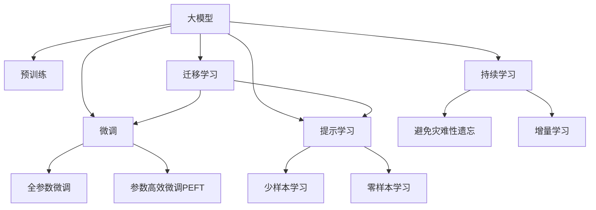

                 

# AI 大模型创业：下一个风口在哪里？

## 1. 背景介绍

### 1.1 问题由来
随着人工智能(AI)技术的飞速发展，大模型（Large Models）成为新一轮技术突破的重要引擎。尤其是自然语言处理（NLP）领域，基于大规模预训练模型（如BERT、GPT-3等）的微调技术（Fine-tuning），使得AI大模型在各类应用场景中展现出了前所未有的潜力。从智能客服到个性化推荐，从金融舆情监测到智能医疗，AI大模型在众多领域带来了革命性的变化。然而，尽管如此，AI大模型创业依然存在不小的挑战和问题，主要体现在以下几个方面：

1. **技术门槛高**：大模型创业需要深厚的技术积累和大量的资源投入，如高性能计算资源、数据处理和存储能力、强大的算法和架构设计能力等。
2. **应用落地困难**：如何将大模型应用于实际业务场景，提升用户体验，降低使用门槛，是创业公司面临的一大挑战。
3. **商业化复杂**：如何将技术转化为产品，制定合理的商业模式，获取稳定的收入来源，是创业公司需要解决的难题。

## 2. 核心概念与联系

### 2.1 核心概念概述

为了更好地理解AI大模型的创业环境，我们首先需要明确几个关键概念：

1. **大模型**：指通过大规模数据进行预训练，参数数量达到数亿级别，具备强大表征能力的神经网络模型。如BERT、GPT-3等。
2. **微调**：指在大模型基础上，使用特定任务的数据集进行有监督训练，使其能够在特定任务上表现优异。微调可以显著提升模型的精度和泛化能力。
3. **预训练**：指在大规模无标签数据上，使用自监督学习任务对模型进行预训练，使其能够学习到通用语言表示。
4. **迁移学习**：指将在大规模数据上预训练的知识迁移到特定任务上，减少新任务所需的标注数据量。
5. **参数高效微调**：指在微调过程中，只更新部分模型参数，保留大部分预训练参数，以减少计算资源消耗。
6. **提示学习**：通过在输入文本中添加提示模板（Prompt），引导模型按照期望方式进行推理和生成，减少微调参数的使用。

这些概念之间的联系和相互作用构成了AI大模型创业的核心基础，如下图所示：



### 2.2 核心概念原理和架构

大模型的核心原理在于通过大规模数据预训练，学习到通用的语言表示，并能够在特定任务上通过微调进一步提升性能。其架构主要由以下几个部分组成：

1. **编码器**：负责将输入序列（如文本）转化为模型内部的表示向量。
2. **解码器**：负责根据上下文信息生成目标序列，如回答、文本生成等。
3. **自注意力机制**：通过计算输入序列中每个位置与其他位置的相似度，提取关键信息。
4. **多头注意力**：将输入序列同时与多个子空间进行交互，增强模型的表示能力。
5. **层归一化**：通过归一化技术，控制模型内部各层的激活分布，提高训练稳定性。

### 2.3 核心概念联系

大模型、预训练、微调和提示学习之间存在紧密联系：

- **大模型和预训练**：预训练是大模型的重要组成部分，通过在大规模无标签数据上训练，学习到通用的语言表示。
- **预训练和微调**：微调是在预训练的基础上，使用特定任务数据进行有监督训练，提升模型在特定任务上的性能。
- **微调和提示学习**：提示学习可以通过精心设计的提示模板，减少微调所需的参数，提升模型的泛化能力。

## 3. 核心算法原理 & 具体操作步骤

### 3.1 算法原理概述

基于AI大模型的微调技术，本质上是一种迁移学习范式。其核心思想是通过在大规模数据上预训练模型，然后在特定任务上使用微调来提升模型性能。微调的目标是在特定任务上最小化损失函数，使得模型输出与真实标签尽可能接近。

数学上，假设预训练模型为 $M_{\theta}$，其中 $\theta$ 为预训练得到的模型参数。给定特定任务的标注数据集 $D=\{(x_i, y_i)\}_{i=1}^N$，微调的目标是最小化经验风险 $\mathcal{L}(\theta)$，即：

$$
\mathcal{L}(\theta) = \frac{1}{N} \sum_{i=1}^N \ell(M_{\theta}(x_i),y_i)
$$

其中 $\ell$ 为损失函数，如交叉熵损失。微调的优化过程通过反向传播算法更新模型参数 $\theta$，使得模型输出尽可能接近真实标签。

### 3.2 算法步骤详解

基于AI大模型的微调通常包括以下几个关键步骤：

1. **数据准备**：收集特定任务的标注数据集，进行数据预处理和划分。
2. **模型初始化**：使用预训练模型或大模型作为初始化参数。
3. **任务适配**：根据任务类型，添加合适的输出层和损失函数。
4. **超参数设置**：选择合适的优化器、学习率、批大小等超参数。
5. **训练过程**：在训练集上使用优化器更新模型参数，最小化损失函数。
6. **验证和评估**：在验证集上评估模型性能，防止过拟合。
7. **模型部署**：将训练好的模型应用于实际业务场景，进行推理和预测。

### 3.3 算法优缺点

基于AI大模型的微调技术具有以下优点：

- **高效性**：使用少量标注数据即可进行微调，减少数据标注成本。
- **泛化能力强**：在特定任务上微调可以提升模型泛化能力，减少新任务所需的标注数据量。
- **参数高效**：通过参数高效微调技术，可以保留大部分预训练参数，减少计算资源消耗。

同时，该方法也存在一定的局限性：

- **数据依赖**：微调性能高度依赖于标注数据的质量和数量，获取高质量标注数据的成本较高。
- **迁移能力有限**：当任务与预训练数据分布差异较大时，微调的性能提升有限。
- **可解释性不足**：微调模型的决策过程难以解释，难以调试和优化。

## 4. 数学模型和公式 & 详细讲解

### 4.1 数学模型构建

为了更好地理解AI大模型的微调过程，我们以分类任务为例，构建数学模型。假设模型 $M_{\theta}$ 的输出为 $\hat{y} \in [0,1]$，表示样本属于正类的概率。真实标签 $y \in \{0,1\}$。则二分类交叉熵损失函数为：

$$
\ell(M_{\theta}(x),y) = -[y\log \hat{y} + (1-y)\log (1-\hat{y})]
$$

模型在训练集上的经验风险为：

$$
\mathcal{L}(\theta) = \frac{1}{N}\sum_{i=1}^N [y_i\log M_{\theta}(x_i)+(1-y_i)\log(1-M_{\theta}(x_i))]
$$

### 4.2 公式推导过程

模型在特定任务上的微调目标是最小化经验风险 $\mathcal{L}(\theta)$，可以通过梯度下降算法更新模型参数。具体地，损失函数对参数 $\theta$ 的梯度为：

$$
\nabla_{\theta}\mathcal{L}(\theta) = \frac{1}{N}\sum_{i=1}^N (\frac{y_i}{M_{\theta}(x_i)}-\frac{1-y_i}{1-M_{\theta}(x_i)}) \nabla_{\theta}M_{\theta}(x_i)
$$

其中 $\nabla_{\theta}M_{\theta}(x_i)$ 为模型 $M_{\theta}$ 在输入 $x_i$ 上的梯度。使用梯度下降算法更新模型参数：

$$
\theta \leftarrow \theta - \eta \nabla_{\theta}\mathcal{L}(\theta)
$$

其中 $\eta$ 为学习率。

### 4.3 案例分析与讲解

以金融舆情监测为例，假设我们收集了银行论坛上的数千条评论数据，标注为正面、负面和中性情绪。我们可以使用BERT模型作为初始化参数，添加分类器层，定义交叉熵损失函数，然后在这些评论数据上进行微调。微调后的模型可以实时监测新评论的情绪，帮助银行及时应对负面舆情，降低风险。

## 5. 项目实践：代码实例和详细解释说明

### 5.1 开发环境搭建

在进行AI大模型微调之前，我们需要准备好开发环境。以下是使用Python和PyTorch搭建环境的步骤：

1. **安装PyTorch**：
   ```bash
   pip install torch torchvision torchaudio
   ```

2. **安装HuggingFace Transformers库**：
   ```bash
   pip install transformers
   ```

3. **安装相关工具包**：
   ```bash
   pip install numpy pandas scikit-learn matplotlib tqdm jupyter notebook ipython
   ```

完成环境配置后，即可开始AI大模型微调的实践。

### 5.2 源代码详细实现

以下是一个基于BERT模型的金融舆情监测任务的微调代码实现：

```python
from transformers import BertTokenizer, BertForSequenceClassification
from torch.utils.data import Dataset, DataLoader
from torch import nn, optim

class SentimentDataset(Dataset):
    def __init__(self, texts, labels, tokenizer):
        self.texts = texts
        self.labels = labels
        self.tokenizer = tokenizer
    
    def __len__(self):
        return len(self.texts)
    
    def __getitem__(self, idx):
        text = self.texts[idx]
        label = self.labels[idx]
        
        encoding = self.tokenizer(text, truncation=True, padding='max_length', max_length=128, return_tensors='pt')
        input_ids = encoding['input_ids']
        attention_mask = encoding['attention_mask']
        label = torch.tensor([label], dtype=torch.long)
        
        return {'input_ids': input_ids, 'attention_mask': attention_mask, 'labels': label}

# 定义BERT模型和任务适配层
model = BertForSequenceClassification.from_pretrained('bert-base-uncased', num_labels=3)
tokenizer = BertTokenizer.from_pretrained('bert-base-uncased')

# 定义训练和评估函数
device = torch.device('cuda') if torch.cuda.is_available() else torch.device('cpu')
model.to(device)

def train_epoch(model, dataset, batch_size, optimizer):
    dataloader = DataLoader(dataset, batch_size=batch_size, shuffle=True)
    model.train()
    loss = 0
    for batch in dataloader:
        input_ids = batch['input_ids'].to(device)
        attention_mask = batch['attention_mask'].to(device)
        labels = batch['labels'].to(device)
        optimizer.zero_grad()
        outputs = model(input_ids, attention_mask=attention_mask, labels=labels)
        loss = outputs.loss
        loss.backward()
        optimizer.step()
    return loss / len(dataloader)

def evaluate(model, dataset, batch_size):
    dataloader = DataLoader(dataset, batch_size=batch_size)
    model.eval()
    preds, labels = [], []
    with torch.no_grad():
        for batch in dataloader:
            input_ids = batch['input_ids'].to(device)
            attention_mask = batch['attention_mask'].to(device)
            labels = batch['labels'].to(device)
            outputs = model(input_ids, attention_mask=attention_mask)
            preds.append(outputs.logits.argmax(dim=1).cpu().tolist())
            labels.append(labels.cpu().tolist())
    
    print(f'Accuracy: {np.mean(preds == labels)}')

# 数据集和模型初始化
train_dataset = SentimentDataset(train_texts, train_labels, tokenizer)
dev_dataset = SentimentDataset(dev_texts, dev_labels, tokenizer)
test_dataset = SentimentDataset(test_texts, test_labels, tokenizer)

# 超参数设置
batch_size = 16
learning_rate = 1e-5
epochs = 5

# 训练和评估
optimizer = optim.Adam(model.parameters(), lr=learning_rate)
for epoch in range(epochs):
    loss = train_epoch(model, train_dataset, batch_size, optimizer)
    print(f'Epoch {epoch+1}, loss: {loss:.4f}')
    
    evaluate(model, dev_dataset, batch_size)
    
print(f'Test Accuracy: {evaluate(model, test_dataset, batch_size)}')
```

### 5.3 代码解读与分析

上述代码实现了基于BERT模型的金融舆情监测任务的微调过程。具体步骤如下：

1. **数据处理**：定义 `SentimentDataset` 类，继承自 PyTorch 的 `Dataset` 类，用于加载和预处理数据。
2. **模型初始化**：使用 `BertForSequenceClassification` 模型作为分类器，添加交叉熵损失函数。
3. **训练和评估**：定义训练和评估函数，使用 `DataLoader` 类加载数据，使用 `Adam` 优化器进行优化。
4. **模型评估**：在验证集和测试集上评估模型性能。

## 6. 实际应用场景

### 6.1 智能客服系统

AI大模型微调技术在智能客服系统中的应用非常广泛。通过微调，客服系统可以自动理解和处理客户提出的各种问题，提供精准的回复和解决方案。例如，银行客服可以通过微调金融知识库中的数据，使系统能够自动回答客户关于银行业务的常见问题。

### 6.2 金融舆情监测

金融舆情监测是AI大模型在金融领域的重要应用之一。通过微调，模型可以实时监测金融市场舆情，预测市场趋势，帮助金融机构及时应对风险。例如，银行可以利用微调后的模型，监测社交媒体和新闻网站的舆情，及时发现和应对潜在的负面舆情。

### 6.3 个性化推荐系统

个性化推荐系统是AI大模型在电商、视频等领域的典型应用。通过微调，系统可以根据用户的历史行为数据和兴趣爱好，推荐符合用户需求的物品。例如，电商平台可以通过微调用户评价和商品描述数据，提高推荐的准确性和多样性。

### 6.4 未来应用展望

未来，AI大模型微调技术将在更多领域得到应用，为传统行业带来变革性影响。

1. **医疗领域**：通过微调医疗知识库，智能医疗系统可以提供精准的疾病诊断和治疗建议，提高医疗服务的智能化水平。
2. **教育领域**：通过微调学生行为数据和教育资源，智能教育系统可以个性化推荐学习内容，提高教育质量和公平性。
3. **智慧城市**：通过微调城市监控视频数据，智慧城市系统可以实现智能安防和应急响应，提高城市管理的智能化水平。
4. **智能家居**：通过微调用户行为数据，智能家居系统可以实现个性化推荐和智能控制，提高用户的生活质量。

## 7. 工具和资源推荐

### 7.1 学习资源推荐

为了帮助开发者系统掌握AI大模型微调的理论基础和实践技巧，这里推荐一些优质的学习资源：

1. **《Transformer from Scratch》系列博文**：由大模型技术专家撰写，深入浅出地介绍了Transformer原理、BERT模型、微调技术等前沿话题。
2. **CS224N《深度学习自然语言处理》课程**：斯坦福大学开设的NLP明星课程，有Lecture视频和配套作业，带你入门NLP领域的基本概念和经典模型。
3. **《Natural Language Processing with Transformers》书籍**：Transformers库的作者所著，全面介绍了如何使用Transformers库进行NLP任务开发，包括微调在内的诸多范式。
4. **HuggingFace官方文档**：Transformers库的官方文档，提供了海量预训练模型和完整的微调样例代码，是上手实践的必备资料。
5. **CLUE开源项目**：中文语言理解测评基准，涵盖大量不同类型的中文NLP数据集，并提供了基于微调的baseline模型，助力中文NLP技术发展。

通过对这些资源的学习实践，相信你一定能够快速掌握AI大模型微调的精髓，并用于解决实际的NLP问题。

### 7.2 开发工具推荐

高效的开发离不开优秀的工具支持。以下是几款用于AI大模型微调开发的常用工具：

1. **PyTorch**：基于Python的开源深度学习框架，灵活动态的计算图，适合快速迭代研究。大部分预训练语言模型都有PyTorch版本的实现。
2. **TensorFlow**：由Google主导开发的开源深度学习框架，生产部署方便，适合大规模工程应用。同样有丰富的预训练语言模型资源。
3. **Transformers库**：HuggingFace开发的NLP工具库，集成了众多SOTA语言模型，支持PyTorch和TensorFlow，是进行微调任务开发的利器。
4. **Weights & Biases**：模型训练的实验跟踪工具，可以记录和可视化模型训练过程中的各项指标，方便对比和调优。与主流深度学习框架无缝集成。
5. **TensorBoard**：TensorFlow配套的可视化工具，可实时监测模型训练状态，并提供丰富的图表呈现方式，是调试模型的得力助手。
6. **Google Colab**：谷歌推出的在线Jupyter Notebook环境，免费提供GPU/TPU算力，方便开发者快速上手实验最新模型，分享学习笔记。

合理利用这些工具，可以显著提升AI大模型微调任务的开发效率，加快创新迭代的步伐。

### 7.3 相关论文推荐

AI大模型和微调技术的发展源于学界的持续研究。以下是几篇奠基性的相关论文，推荐阅读：

1. **Attention is All You Need**：提出了Transformer结构，开启了NLP领域的预训练大模型时代。
2. **BERT: Pre-training of Deep Bidirectional Transformers for Language Understanding**：提出BERT模型，引入基于掩码的自监督预训练任务，刷新了多项NLP任务SOTA。
3. **Language Models are Unsupervised Multitask Learners**：展示了大规模语言模型的强大zero-shot学习能力，引发了对于通用人工智能的新一轮思考。
4. **Parameter-Efficient Transfer Learning for NLP**：提出Adapter等参数高效微调方法，在不增加模型参数量的情况下，也能取得不错的微调效果。
5. **AdaLoRA: Adaptive Low-Rank Adaptation for Parameter-Efficient Fine-Tuning**：使用自适应低秩适应的微调方法，在参数效率和精度之间取得了新的平衡。
6. **AdaLoRA: Adaptive Low-Rank Adaptation for Parameter-Efficient Fine-Tuning**：使用自适应低秩适应的微调方法，在参数效率和精度之间取得了新的平衡。

这些论文代表了大语言模型微调技术的发展脉络。通过学习这些前沿成果，可以帮助研究者把握学科前进方向，激发更多的创新灵感。

## 8. 总结：未来发展趋势与挑战

### 8.1 研究成果总结

本文对基于AI大模型的微调方法进行了全面系统的介绍。首先阐述了AI大模型和微调技术的研究背景和意义，明确了微调在拓展预训练模型应用、提升下游任务性能方面的独特价值。其次，从原理到实践，详细讲解了微调的数学原理和关键步骤，给出了微调任务开发的完整代码实例。同时，本文还广泛探讨了微调方法在智能客服、金融舆情、个性化推荐等多个行业领域的应用前景，展示了微调范式的巨大潜力。最后，本文精选了微调技术的各类学习资源，力求为读者提供全方位的技术指引。

### 8.2 未来发展趋势

展望未来，AI大模型微调技术将呈现以下几个发展趋势：

1. **模型规模持续增大**：随着算力成本的下降和数据规模的扩张，预训练语言模型的参数量还将持续增长。超大规模语言模型蕴含的丰富语言知识，有望支撑更加复杂多变的下游任务微调。
2. **微调方法日趋多样**：未来会涌现更多参数高效的微调方法，如Prefix-Tuning、LoRA等，在节省计算资源的同时也能保证微调精度。
3. **持续学习成为常态**：随着数据分布的不断变化，微调模型也需要持续学习新知识以保持性能。如何在不遗忘原有知识的同时，高效吸收新样本信息，将成为重要的研究课题。
4. **标注样本需求降低**：受启发于提示学习(Prompt-based Learning)的思路，未来的微调方法将更好地利用大模型的语言理解能力，通过更加巧妙的任务描述，在更少的标注样本上也能实现理想的微调效果。
5. **多模态微调崛起**：当前的微调主要聚焦于纯文本数据，未来会进一步拓展到图像、视频、语音等多模态数据微调。多模态信息的融合，将显著提升语言模型对现实世界的理解和建模能力。
6. **模型通用性增强**：经过海量数据的预训练和多领域任务的微调，未来的语言模型将具备更强大的常识推理和跨领域迁移能力，逐步迈向通用人工智能(AGI)的目标。

以上趋势凸显了AI大模型微调技术的广阔前景。这些方向的探索发展，必将进一步提升NLP系统的性能和应用范围，为人类认知智能的进化带来深远影响。

### 8.3 面临的挑战

尽管AI大模型微调技术已经取得了瞩目成就，但在迈向更加智能化、普适化应用的过程中，它仍面临着诸多挑战：

1. **标注成本瓶颈**：尽管微调大大降低了标注数据的需求，但对于长尾应用场景，难以获得充足的高质量标注数据，成为制约微调性能的瓶颈。如何进一步降低微调对标注样本的依赖，将是一大难题。
2. **模型鲁棒性不足**：当前微调模型面对域外数据时，泛化性能往往大打折扣。对于测试样本的微小扰动，微调模型的预测也容易发生波动。如何提高微调模型的鲁棒性，避免灾难性遗忘，还需要更多理论和实践的积累。
3. **推理效率有待提高**：大规模语言模型虽然精度高，但在实际部署时往往面临推理速度慢、内存占用大等效率问题。如何在保证性能的同时，简化模型结构，提升推理速度，优化资源占用，将是重要的优化方向。
4. **可解释性亟需加强**：当前微调模型更像是"黑盒"系统，难以解释其内部工作机制和决策逻辑。对于医疗、金融等高风险应用，算法的可解释性和可审计性尤为重要。如何赋予微调模型更强的可解释性，将是亟待攻克的难题。
5. **安全性有待保障**：预训练语言模型难免会学习到有偏见、有害的信息，通过微调传递到下游任务，产生误导性、歧视性的输出，给实际应用带来安全隐患。如何从数据和算法层面消除模型偏见，避免恶意用途，确保输出的安全性，也将是重要的研究课题。
6. **知识整合能力不足**：现有的微调模型往往局限于任务内数据，难以灵活吸收和运用更广泛的先验知识。如何让微调过程更好地与外部知识库、规则库等专家知识结合，形成更加全面、准确的信息整合能力，还有很大的想象空间。

正视AI大模型微调面临的这些挑战，积极应对并寻求突破，将是大模型微调走向成熟的必由之路。相信随着学界和产业界的共同努力，这些挑战终将一一被克服，AI大模型微调必将在构建人机协同的智能时代中扮演越来越重要的角色。

### 8.4 研究展望

面对AI大模型微调所面临的挑战，未来的研究需要在以下几个方面寻求新的突破：

1. **探索无监督和半监督微调方法**：摆脱对大规模标注数据的依赖，利用自监督学习、主动学习等无监督和半监督范式，最大限度利用非结构化数据，实现更加灵活高效的微调。
2. **研究参数高效和计算高效的微调范式**：开发更加参数高效的微调方法，在固定大部分预训练参数的同时，只更新极少量的任务相关参数。同时优化微调模型的计算图，减少前向传播和反向传播的资源消耗，实现更加轻量级、实时性的部署。
3. **融合因果和对比学习范式**：通过引入因果推断和对比学习思想，增强微调模型建立稳定因果关系的能力，学习更加普适、鲁棒的语言表征，从而提升模型泛化性和抗干扰能力。
4. **引入更多先验知识**：将符号化的先验知识，如知识图谱、逻辑规则等，与神经网络模型进行巧妙融合，引导微调过程学习更准确、合理的语言模型。同时加强不同模态数据的整合，实现视觉、语音等多模态信息与文本信息的协同建模。
5. **结合因果分析和博弈论工具**：将因果分析方法引入微调模型，识别出模型决策的关键特征，增强输出解释的因果性和逻辑性。借助博弈论工具刻画人机交互过程，主动探索并规避模型的脆弱点，提高系统稳定性。
6. **纳入伦理道德约束**：在模型训练目标中引入伦理导向的评估指标，过滤和惩罚有偏见、有害的输出倾向。同时加强人工干预和审核，建立模型行为的监管机制，确保输出符合人类价值观和伦理道德。

这些研究方向的探索，必将引领AI大模型微调技术迈向更高的台阶，为构建安全、可靠、可解释、可控的智能系统铺平道路。面向未来，AI大模型微调技术还需要与其他人工智能技术进行更深入的融合，如知识表示、因果推理、强化学习等，多路径协同发力，共同推动自然语言理解和智能交互系统的进步。只有勇于创新、敢于突破，才能不断拓展语言模型的边界，让智能技术更好地造福人类社会。

## 9. 附录：常见问题与解答

**Q1：AI大模型微调是否适用于所有NLP任务？**

A: AI大模型微调在大多数NLP任务上都能取得不错的效果，特别是对于数据量较小的任务。但对于一些特定领域的任务，如医学、法律等，仅仅依靠通用语料预训练的模型可能难以很好地适应。此时需要在特定领域语料上进一步预训练，再进行微调，才能获得理想效果。此外，对于一些需要时效性、个性化很强的任务，如对话、推荐等，微调方法也需要针对性的改进优化。

**Q2：微调过程中如何选择合适的学习率？**

A: 微调的学习率一般要比预训练时小1-2个数量级，如果使用过大的学习率，容易破坏预训练权重，导致过拟合。一般建议从1e-5开始调参，逐步减小学习率，直至收敛。也可以使用warmup策略，在开始阶段使用较小的学习率，再逐渐过渡到预设值。需要注意的是，不同的优化器(如AdamW、Adafactor等)以及不同的学习率调度策略，可能需要设置不同的学习率阈值。

**Q3：采用AI大模型微调时会面临哪些资源瓶颈？**

A: 目前主流的预训练大模型动辄以亿计的参数规模，对算力、内存、存储都提出了很高的要求。GPU/TPU等高性能设备是必不可少的，但即便如此，超大批次的训练和推理也可能遇到显存不足的问题。因此需要采用一些资源优化技术，如梯度积累、混合精度训练、模型并行等，来突破硬件瓶颈。同时，模型的存储和读取也可能占用大量时间和空间，需要采用模型压缩、稀疏化存储等方法进行优化。

**Q4：如何缓解AI大模型微调过程中的过拟合问题？**

A: 过拟合是微调面临的主要挑战，尤其是在标注数据不足的情况下。常见的缓解策略包括：
1. **数据增强**：通过回译、近义替换等方式扩充训练集
2. **正则化**：使用L2正则、Dropout、Early Stopping等避免过拟合
3. **对抗训练**：引入对抗样本，提高模型鲁棒性
4. **参数高效微调**：只调整少量参数(如Adapter、Prefix等)，减小过拟合风险
5. **多模型集成**：训练多个微调模型，取平均输出，抑制过拟合

这些策略往往需要根据具体任务和数据特点进行灵活组合。只有在数据、模型、训练、推理等各环节进行全面优化，才能最大限度地发挥AI大模型微调的威力。

**Q5：AI大模型微调在落地部署时需要注意哪些问题？**

A: 将AI大模型微调转化为实际应用，还需要考虑以下因素：
1. **模型裁剪**：去除不必要的层和参数，减小模型尺寸，加快推理速度
2. **量化加速**：将浮点模型转为定点模型，压缩存储空间，提高计算效率
3. **服务化封装**：将模型封装为标准化服务接口，便于集成调用
4. **弹性伸缩**：根据请求流量动态调整资源配置，平衡服务质量和成本
5. **监控告警**：实时采集系统指标，设置异常告警阈值，确保服务稳定性
6. **安全防护**：采用访问鉴权、数据脱敏等措施，保障数据和模型安全

AI大模型微调为NLP应用开启了广阔的想象空间，但如何将强大的性能转化为稳定、高效、安全的业务价值，还需要工程实践的不断打磨。唯有从数据、算法、工程、业务等多个维度协同发力，才能真正实现人工智能技术在垂直行业的规模化落地。总之，微调需要开发者根据具体任务，不断迭代和优化模型、数据和算法，方能得到理想的效果。

---

作者：禅与计算机程序设计艺术 / Zen and the Art of Computer Programming

