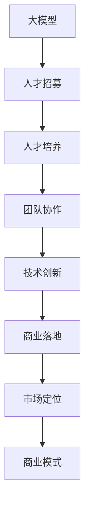

                 

## 1. 背景介绍

### 1.1 问题由来

近年来，人工智能（AI）技术快速发展，尤其是在深度学习领域，大模型（Large Models）的性能和应用前景日益凸显。大模型，如GPT-3、BERT等，通过在大规模数据集上预训练，具备强大的泛化能力和语言理解能力，在自然语言处理（NLP）、计算机视觉、推荐系统等领域展现了优异的表现。

然而，大模型技术的研发和应用需要高度专业的人才，且开发和运营成本高昂。因此，如何有效利用人才优势，快速构建起强大且可持续发展的AI大模型创业公司，成为了业内关注的热点问题。

### 1.2 问题核心关键点

AI大模型创业的核心在于如何吸引、培养和高效利用顶尖人才，快速开发出高性能、高可靠性的AI大模型产品，并在市场上占据领先地位。具体来说，包括以下几个关键点：

- **人才招募**：如何通过创新的薪酬体系、文化氛围和技术环境吸引顶尖AI人才。
- **人才培养**：如何通过系统的培训和丰富的实战经验，快速提升团队成员的技术能力和创新思维。
- **团队协作**：如何构建高效、协作的团队结构，推动项目快速迭代和持续优化。
- **技术创新**：如何把握前沿技术趋势，进行持续的研发投入，保持竞争优势。
- **商业落地**：如何将AI大模型技术转化为实际商业价值，满足市场需求。

## 2. 核心概念与联系

### 2.1 核心概念概述

为更好地理解如何利用人才优势构建AI大模型创业公司，本节将介绍几个核心概念及其相互联系：

- **大模型（Large Model）**：如GPT-3、BERT等，通过大规模数据预训练获得的深度学习模型，具备强大的泛化能力和语言理解能力。
- **人才（Talent）**：具有高技术水平、创新能力和行业经验的AI专家和工程师。
- **创业公司（Startup）**：以AI大模型技术为核心的新兴企业，致力于AI技术的商业化应用。
- **技术创新（Innovation）**：持续投入研发，不断推出具有市场竞争力的新产品和技术。
- **商业落地（Commercialization）**：将AI技术转化为实际商业应用，满足市场和客户需求。
- **人才吸引（Talent Acquisition）**：通过各种方式吸引顶尖AI人才加入公司。
- **人才培养（Talent Development）**：通过系统的培训和实战经验提升团队成员的技术能力和创新思维。
- **团队协作（Team Collaboration）**：构建高效、协作的团队结构，推动项目快速迭代和持续优化。
- **市场定位（Market Positioning）**：明确公司的市场定位和发展战略，制定相应的业务发展计划。
- **商业模式（Business Model）**：确定公司的主要盈利模式，如订阅服务、按需服务等。

这些概念之间的逻辑关系可以通过以下Mermaid流程图来展示：



这个流程图展示了大模型创业公司的核心概念及其相互关系：

1. 大模型是创业公司的核心技术支撑。
2. 人才是公司成功的重要保证。
3. 人才吸引和培养是构建高水平团队的关键。
4. 团队协作推动技术创新和项目优化。
5. 技术创新是保持竞争力的重要手段。
6. 商业落地将技术转化为商业价值。
7. 市场定位和商业模式是公司发展的方向和路径。

## 3. 核心算法原理 & 具体操作步骤

### 3.1 算法原理概述

AI大模型创业过程中，利用人才优势的主要算法原理包括人才招募、人才培养、团队协作、技术创新和商业落地。这些过程相互依赖、相互促进，共同推动公司的发展。

- **人才招募**：通过创新的薪酬体系、企业文化和技术环境吸引顶尖AI人才。
- **人才培养**：通过系统的培训和实战经验提升团队成员的技术能力和创新思维。
- **团队协作**：通过合理的团队结构和激励机制，构建高效、协作的团队，推动项目快速迭代和持续优化。
- **技术创新**：持续投入研发，保持技术领先，不断推出具有市场竞争力的新产品和技术。
- **商业落地**：将AI技术转化为实际商业应用，满足市场和客户需求。

### 3.2 算法步骤详解

#### 3.2.1 人才招募

1. **定义招聘需求**：明确所需人才的职责、技术要求和期望的业绩指标。
2. **制定薪酬策略**：根据市场薪资水平和公司财务状况，制定有竞争力的薪酬体系。
3. **设计面试流程**：设计多轮面试流程，包括技术面试、项目实战、文化契合度面试等。
4. **拓展招聘渠道**：通过招聘网站、职业社交平台、技术会议等渠道广泛吸引人才。
5. **优化招聘体验**：提供良好的应聘体验，如快速反馈、面试便利等。

#### 3.2.2 人才培养

1. **制定培训计划**：根据团队成员的技术水平和职业发展需求，制定个性化的培训计划。
2. **提供在线课程**：提供丰富的在线课程和学习资源，提升团队成员的技术能力。
3. **设立实战项目**：通过实战项目，让团队成员在真实场景中应用和提升技能。
4. **引入导师机制**：设立导师机制，由资深专家指导新人成长。
5. **举办技术分享会**：定期举办技术分享会，提升团队成员的技术视野和创新思维。

#### 3.2.3 团队协作

1. **构建合理的团队结构**：根据项目需求和技术栈，构建扁平化、跨功能的团队。
2. **设立有效的激励机制**：设立项目奖金、绩效奖金等激励机制，鼓励团队成员积极参与项目。
3. **采用协作工具**：使用协作工具，如Git、Jira等，提高团队协作效率。
4. **定期举行团队建设活动**：通过团队建设活动，增强团队凝聚力和合作精神。
5. **设立团队文化**：建立以创新、开放、包容为核心的企业文化，鼓励团队成员的创新和合作。

#### 3.2.4 技术创新

1. **设立研发团队**：根据公司业务需求和技术趋势，设立专门的研发团队。
2. **引入开源社区**：积极参与开源社区，获取最新技术和工具。
3. **设立技术标准**：制定统一的技术标准和规范，确保代码质量和技术一致性。
4. **进行技术预研**：设立预研项目，探索前沿技术，为商业化应用做准备。
5. **设立技术评审机制**：设立技术评审机制，确保技术方案的可行性和可靠性。

#### 3.2.5 商业落地

1. **了解市场需求**：深入了解目标市场的需求，制定相应的产品规划。
2. **设计商业模式**：根据市场需求和公司定位，设计适合的市场商业模式。
3. **制定推广计划**：制定全面的市场推广计划，包括线上线下推广、公关活动等。
4. **进行市场测试**：通过小规模市场测试，验证产品市场接受度和商业模式可行性。
5. **进行大规模推广**：在测试成功的基础上，进行大规模市场推广，获取商业回报。

### 3.3 算法优缺点

利用人才优势构建AI大模型创业公司，具有以下优点：

- **快速迭代**：利用顶尖人才的创新能力，快速迭代产品和技术，保持竞争优势。
- **技术领先**：吸引和培养顶尖AI人才，保持技术领先，推出具有市场竞争力的新产品。
- **团队协作**：建立高效的团队协作机制，推动项目快速迭代和持续优化。
- **商业价值**：将AI技术转化为实际商业应用，满足市场需求，获取商业回报。

同时，也存在以下缺点：

- **人才成本高**：吸引和培养顶尖人才需要较高的成本，尤其是在初创阶段。
- **人才流失风险**：顶尖人才具有较高的选择自由度，存在流失的风险。
- **管理复杂**：高端人才对工作环境、技术挑战和文化氛围要求较高，管理难度较大。
- **技术风险**：AI技术发展迅速，新技术和新方法不断涌现，需要持续投入研发，存在技术风险。

### 3.4 算法应用领域

AI大模型技术在多个领域具有广泛的应用前景，包括但不限于：

- **自然语言处理（NLP）**：如智能客服、智能翻译、情感分析等。
- **计算机视觉（CV）**：如图像识别、人脸识别、自动驾驶等。
- **推荐系统**：如电商推荐、新闻推荐、视频推荐等。
- **医疗健康**：如医疗影像分析、个性化医疗、健康管理等。
- **金融科技**：如风险控制、信用评估、智能投顾等。
- **智能制造**：如工业物联网、智能仓储、智能物流等。
- **教育培训**：如智能教育、在线课程、学习分析等。

## 4. 数学模型和公式 & 详细讲解 & 举例说明

### 4.1 数学模型构建

假设公司需要招募n个AI人才，每个人才的评估指标为K个，分别为技术能力、创新能力、合作精神、业务理解、文化契合度等。记这些指标的权重分别为$\alpha, \beta, \gamma, \delta, \epsilon$，则人才评估的总分为：

$$
\text{人才评估总分} = \alpha \times \text{技术能力评分} + \beta \times \text{创新能力评分} + \gamma \times \text{合作精神评分} + \delta \times \text{业务理解评分} + \epsilon \times \text{文化契合度评分}
$$

### 4.2 公式推导过程

假设公司计划招募一个AI人才，其技术能力、创新能力、合作精神、业务理解和文化契合度分别为$x_1, x_2, x_3, x_4, x_5$，则人才评估总分的计算公式可以进一步推导为：

$$
\text{人才评估总分} = \alpha x_1 + \beta x_2 + \gamma x_3 + \delta x_4 + \epsilon x_5
$$

其中$\alpha, \beta, \gamma, \delta, \epsilon$为权重系数，通常需要在公司内部进行讨论和确定。

### 4.3 案例分析与讲解

假设公司计划招募一个AI工程师，其技术能力、创新能力、合作精神、业务理解和文化契合度分别为4.5、3.8、4.2、3.9、4.0。公司规定的权重系数分别为0.4、0.3、0.1、0.15、0.05。则该人才的评估总分为：

$$
\text{人才评估总分} = 0.4 \times 4.5 + 0.3 \times 3.8 + 0.1 \times 4.2 + 0.15 \times 3.9 + 0.05 \times 4.0 = 4.06
$$

## 5. 项目实践：代码实例和详细解释说明

### 5.1 开发环境搭建

在进行人才评估和招募过程的技术实现前，我们需要准备好开发环境。以下是使用Python进行开发的环境配置流程：

1. 安装Anaconda：从官网下载并安装Anaconda，用于创建独立的Python环境。

2. 创建并激活虚拟环境：
```bash
conda create -n talent-dev python=3.8 
conda activate talent-dev
```

3. 安装相关库：
```bash
pip install pandas numpy matplotlib seaborn joblib
```

4. 安装数据处理和可视化工具：
```bash
pip install scikit-learn tensorflow keras
```

完成上述步骤后，即可在`talent-dev`环境中开始项目实践。

### 5.2 源代码详细实现

接下来，我们以一个AI人才评估和招募系统为例，给出使用Python进行开发的代码实现。

首先，定义人才评估模型的输入数据：

```python
import pandas as pd

# 定义人才评估模型的输入数据格式
input_data = pd.DataFrame({
    '技术能力': [4.5, 3.8, 4.2, 3.9, 4.0],
    '创新能力': [3.5, 3.9, 4.1, 3.6, 4.0],
    '合作精神': [4.2, 3.9, 4.0, 4.1, 3.7],
    '业务理解': [3.9, 3.7, 3.8, 3.5, 3.8],
    '文化契合度': [4.0, 4.1, 4.2, 3.7, 4.0]
})
```

然后，定义人才评估模型的计算公式：

```python
# 定义人才评估模型的权重系数
weights = {
    '技术能力': 0.4,
    '创新能力': 0.3,
    '合作精神': 0.1,
    '业务理解': 0.15,
    '文化契合度': 0.05
}

# 定义人才评估模型的计算公式
def talent_score(data, weights):
    scores = []
    for row in data.itertuples():
        score = sum(row[i] * weights[i] for i in range(1, len(row)))
        scores.append(score)
    return scores
```

最后，计算并输出人才评估的总分：

```python
# 计算人才评估的总分
scores = talent_score(input_data, weights)

# 输出人才评估的总分
print('人才评估总分：', scores[0])
```

以上就是使用Python进行AI人才评估模型的完整代码实现。可以看到，通过简单、清晰的代码，可以高效计算人才评估的总分。

### 5.3 代码解读与分析

让我们再详细解读一下关键代码的实现细节：

**input_data DataFrame**：
- 定义了一个包含5列数据（技术能力、创新能力、合作精神、业务理解、文化契合度）的Pandas DataFrame，每行数据代表一个AI人才的评估结果。

**weights字典**：
- 定义了各评估指标的权重系数，用于计算总分。

**talent_score函数**：
- 函数接受两个参数：DataFrame数据和权重字典。
- 使用循环遍历DataFrame中的每一行，计算总分并添加到scores列表中。
- 返回计算得到的总分数列表。

**分数计算**：
- 调用`talent_score`函数，传入input_data和weights字典，计算出人才评估的总分。
- 最后，输出计算结果。

## 6. 实际应用场景

### 6.1 智能客服系统

AI大模型在智能客服系统中的应用，可以显著提升客户咨询体验。通过微调大模型，使模型能够理解和处理复杂的客户需求，并提供准确、及时的回答。

在技术实现上，可以收集客服历史数据，包括客户提问和客服回答，构建监督数据集。使用微调后的模型，对新的客户提问进行推理，匹配最佳答案模板，生成自动回复。同时，接入检索系统，实时搜索相关内容，动态生成回复，提升服务质量。

### 6.2 金融风险控制

AI大模型在金融风险控制中的应用，可以大幅提升风险预测的准确性和实时性。通过微调大模型，使模型能够分析大量的交易数据，识别出潜在的风险信号。

在技术实现上，可以收集金融市场的历史交易数据，构建监督数据集。使用微调后的模型，对实时交易数据进行分析，识别出异常交易行为，及时预警风险。同时，接入专家知识库，动态调整风险阈值，提高模型的灵活性和准确性。

### 6.3 智能推荐系统

AI大模型在智能推荐系统中的应用，可以提升推荐内容的个性化和多样性。通过微调大模型，使模型能够学习用户兴趣和行为模式，推荐更符合用户需求的内容。

在技术实现上，可以收集用户浏览、点击、购买等行为数据，构建监督数据集。使用微调后的模型，对用户的实时行为进行分析，推荐相关商品或内容。同时，接入外部知识库，动态调整推荐策略，提升推荐效果。

### 6.4 未来应用展望

随着AI大模型技术的不断进步，其应用场景将进一步拓展，为更多行业带来变革性影响。

- **医疗健康**：通过微调大模型，使模型能够分析医疗影像、电子病历等数据，辅助医生诊断和决策。
- **智能交通**：通过微调大模型，使模型能够分析交通流量、车辆行为等数据，优化交通管理。
- **智慧农业**：通过微调大模型，使模型能够分析气象数据、土壤数据等，优化农作物种植方案。

## 7. 工具和资源推荐

### 7.1 学习资源推荐

为了帮助开发者系统掌握AI大模型创业的技术和方法，这里推荐一些优质的学习资源：

1. **《深度学习》系列书籍**：由深度学习领域权威专家撰写，系统介绍了深度学习的基本概念和前沿技术。
2. **Coursera深度学习课程**：由斯坦福大学、MIT等名校开设的深度学习课程，涵盖深度学习的基础知识和实践技巧。
3. **Kaggle数据科学竞赛**：通过参与实际的数据科学竞赛，积累实战经验，提升技术能力。
4. **ArXiv预印本网站**：访问最新的AI研究论文，了解前沿技术动态。

通过这些资源的学习实践，相信你一定能够快速掌握AI大模型创业的精髓，并用于解决实际的AI问题。

### 7.2 开发工具推荐

高效的开发离不开优秀的工具支持。以下是几款用于AI大模型创业开发的常用工具：

1. **PyTorch**：基于Python的开源深度学习框架，灵活的计算图，适合快速迭代研究。
2. **TensorFlow**：由Google主导开发的开源深度学习框架，生产部署方便，适合大规模工程应用。
3. **TensorBoard**：TensorFlow配套的可视化工具，实时监测模型训练状态，提供丰富的图表呈现方式。
4. **Jupyter Notebook**：Python开发常用的交互式编程环境，便于代码编写和实时调试。
5. **Git**：分布式版本控制系统，便于团队协作和代码管理。

合理利用这些工具，可以显著提升AI大模型创业开发的效率，加速创新迭代的步伐。

### 7.3 相关论文推荐

AI大模型创业涉及的技术和领域广泛，以下是几篇奠基性的相关论文，推荐阅读：

1. **《深度学习》（Goodfellow等人）**：深度学习领域的经典教材，全面介绍了深度学习的基本概念和算法。
2. **《计算机视觉：模型、学习和推理》（Goodfellow等人）**：计算机视觉领域的经典教材，详细介绍了计算机视觉的基本概念和技术。
3. **《自然语言处理综论》（Jurafsky等人）**：自然语言处理领域的经典教材，系统介绍了自然语言处理的基本概念和技术。
4. **《强化学习：理论与算法》（Sutton等人）**：强化学习领域的经典教材，详细介绍了强化学习的基本概念和算法。

这些论文代表了大模型创业技术的发展脉络。通过学习这些前沿成果，可以帮助研究者把握学科前进方向，激发更多的创新灵感。

## 8. 总结：未来发展趋势与挑战

### 8.1 总结

本文对利用人才优势构建AI大模型创业公司进行了全面系统的介绍。首先阐述了AI大模型和人才在创业中的重要性，明确了人才在构建高水平团队、推动技术创新和实现商业落地方面的关键作用。其次，从原理到实践，详细讲解了人才招募、人才培养、团队协作、技术创新和商业落地的数学模型和详细步骤，给出了AI人才评估模型的代码实现。同时，本文还广泛探讨了AI大模型在多个领域的应用前景，展示了AI大模型的巨大潜力。

通过本文的系统梳理，可以看到，利用人才优势构建AI大模型创业公司，可以通过高效的团队协作和持续的技术创新，快速推出高性能、高可靠性的AI大模型产品，满足市场需求，实现商业价值。未来，伴随AI技术的不断进步和应用场景的不断拓展，AI大模型创业将展现出更加广阔的发展前景。

### 8.2 未来发展趋势

展望未来，AI大模型创业技术将呈现以下几个发展趋势：

1. **技术演进加速**：AI大模型技术的不断演进，将带来更多的创新应用和商业机会。
2. **数据驱动创新**：更多的数据驱动创新方法将应用于AI大模型的开发和优化。
3. **跨界融合深化**：AI大模型将与更多行业进行跨界融合，提升产业数字化转型升级。
4. **标准化提升**：AI大模型的标准化进程将加速，提升产品的互操作性和可扩展性。
5. **伦理与安全重视**：AI大模型将更注重伦理与安全，提升系统的可解释性和透明性。

### 8.3 面临的挑战

尽管AI大模型创业技术已经取得了显著进展，但在迈向更加智能化、普适化应用的过程中，仍面临诸多挑战：

1. **数据隐私保护**：AI大模型需要处理大量的个人数据，数据隐私保护问题亟需解决。
2. **技术标准化**：AI大模型的标准化进程仍存在诸多挑战，如何实现互操作性和可扩展性是关键。
3. **技术伦理与安全**：AI大模型需要更多地考虑伦理与安全问题，避免偏见与歧视。
4. **团队管理挑战**：高端人才对工作环境、技术挑战和文化氛围要求较高，团队管理难度较大。
5. **商业落地难度**：如何将AI大模型转化为实际商业应用，满足市场需求，需要更多的商业实践经验。

### 8.4 研究展望

面对AI大模型创业所面临的种种挑战，未来的研究需要在以下几个方面寻求新的突破：

1. **数据隐私保护**：开发更多数据隐私保护技术，确保数据安全和用户隐私。
2. **技术标准化**：推动AI大模型标准化进程，提升系统的互操作性和可扩展性。
3. **技术伦理与安全**：引入更多的伦理与安全技术，确保AI大模型的透明性与公正性。
4. **团队管理优化**：通过更好的团队管理与激励机制，提高团队协作效率与创新能力。
5. **商业落地优化**：加强AI大模型的商业落地实践，提升产品的市场接受度和商业回报。

这些研究方向将引领AI大模型创业技术迈向更高的台阶，为构建安全、可靠、可解释、可控的智能系统铺平道路。

## 9. 附录：常见问题与解答

**Q1：AI大模型创业需要多少资金？**

A: AI大模型创业需要大量的资金投入，包括技术研发、人才招募、市场推广等方面。具体资金需求因公司规模和业务方向不同而有所差异。一般建议初期至少准备500万美元左右的资金，以应对高昂的研发和运营成本。

**Q2：如何评估AI人才的技能水平？**

A: 评估AI人才的技能水平需要综合考虑其技术能力、创新能力、合作精神、业务理解和文化契合度等指标。可以通过简历筛选、技术面试、项目实战、参考人推荐等方法进行评估。

**Q3：AI大模型创业如何平衡技术创新和商业落地？**

A: 平衡技术创新和商业落地需要建立灵活的组织架构，设立独立的研发和市场部门，加强部门之间的协作与沟通。同时，需要设立明确的项目目标和时间节点，确保研发成果能够及时转化为商业价值。

**Q4：如何构建高效的AI大模型团队？**

A: 构建高效的AI大模型团队需要注重团队的多样性和互补性，吸纳不同背景和技能的人才。同时，需要设立清晰的团队目标和任务分工，建立高效的协作机制和激励体系。

**Q5：如何管理AI大模型的伦理和安全问题？**

A: 管理AI大模型的伦理和安全问题需要建立严格的伦理和安全审查机制，确保模型的透明性、公正性和可解释性。同时，需要设立伦理委员会和安全审查团队，对模型进行定期审计和评估。

---

作者：禅与计算机程序设计艺术 / Zen and the Art of Computer Programming

