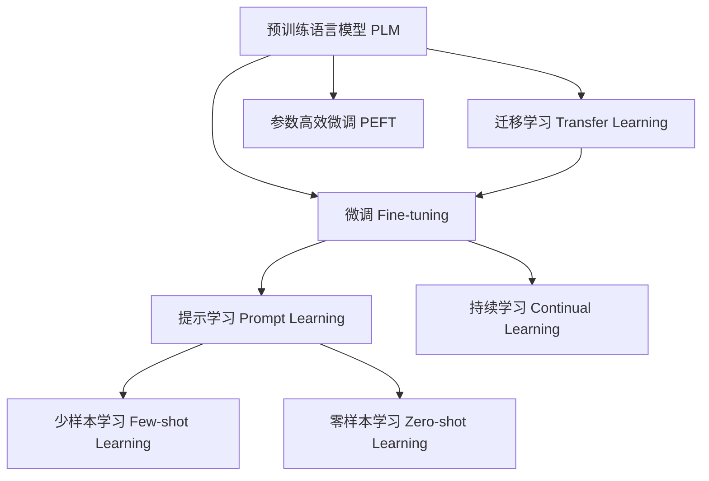

                 

## 1. 背景介绍

### 1.1 问题由来

人工智能(AI)技术在过去的十年里，取得了飞速的发展。特别是深度学习算法，已经在图像识别、自然语言处理(NLP)、语音识别等多个领域取得了突破性进展。这些技术的突破，使得AI技术具备了在各行各业大规模应用的能力，引领了第四次工业革命。

然而，当前AI技术的落地应用，依然面临许多挑战。比如：算力需求巨大，需要大规模的集群计算资源支持；数据需求庞大，需要海量的标注数据进行训练；算法的可解释性不足，缺乏透明度，难以被广泛接受；商业化应用复杂，需要大量的工程实践和系统集成工作。

这些挑战使得AI技术的落地应用难度较高，需要强大的研发团队和丰富的经验积累。然而，随着近年来AI大模型的兴起，为AI技术的应用提供了一个新的方向。AI大模型，特别是预训练语言模型(如BERT、GPT等)，具备了在大规模数据上进行自我学习和知识积累的能力，显著降低了AI技术的研发成本和应用门槛。

### 1.2 问题核心关键点

AI大模型创业，核心在于如何利用国际优势，打造具有竞争力的AI产品和服务。具体而言，可以从以下几个方面考虑：

1. **数据资源**：利用国际上丰富的数据资源，包括大规模的无标签语料库、领域特定的标注数据集等，构建预训练大模型，从而在特定领域内获得优势。
2. **算法能力**：借助国际上先进的算法和模型架构，如Transformer、深度残差网络等，提升模型的表现力和效率。
3. **云计算平台**：利用云计算平台提供的强大算力和弹性扩展能力，降低算力成本，提高模型训练和推理的效率。
4. **社区生态**：借助国际AI社区的力量，快速获取最新的研究成果和技术动态，提升自身竞争力。
5. **商业化策略**：利用国际市场上的需求和技术需求，开发符合市场需求的AI产品和解决方案，构建稳定的商业模式。

这些因素共同构成了AI大模型创业的核心优势，使得企业在国际竞争中占据有利地位。

### 1.3 问题研究意义

AI大模型创业，不仅能够推动AI技术在各行各业的广泛应用，促进经济社会发展，还能带动技术创新，加速AI技术的前沿探索。同时，AI大模型创业也有助于构建一个健康的AI产业生态，推动国际技术合作和知识共享。

具体而言，AI大模型创业具有以下意义：

1. **降低研发成本**：利用大模型的高效学习和知识积累能力，显著降低了AI技术的研发成本，使得中小企业也能够参与到AI技术的开发和应用中来。
2. **提升应用效果**：大模型的泛化能力和自适应能力，使得AI技术在特定领域内能够获得更好的效果，满足用户需求。
3. **加速技术演进**：大模型创业使得企业能够快速获取最新的研究成果和技术动态，加速AI技术的前沿探索。
4. **构建产业生态**：大模型创业能够推动AI技术的产业化进程，构建一个健康的AI产业生态，促进技术合作和知识共享。

## 2. 核心概念与联系

### 2.1 核心概念概述

为了更好地理解AI大模型创业的原理，我们首先介绍几个关键的概念：

1. **预训练语言模型(Pre-trained Language Model, PLM)**：通过在大规模无标签文本语料库上进行自我学习，学习到语言的通用表示，具备强大的语言理解和生成能力。

2. **微调(Fine-tuning)**：在预训练模型的基础上，使用下游任务的少量标注数据，通过有监督地训练来优化模型在特定任务上的性能。

3. **迁移学习(Transfer Learning)**：将一个领域学习到的知识，迁移应用到另一个不同但相关的领域的学习范式。大模型的预训练-微调过程即是一种典型的迁移学习方式。

4. **参数高效微调(Parameter-Efficient Fine-Tuning, PEFT)**：在微调过程中，只更新少量的模型参数，而固定大部分预训练权重不变，以提高微调效率，避免过拟合的方法。

5. **提示学习(Prompt Learning)**：通过在输入文本中添加提示模板(Prompt Template)，引导大语言模型进行特定任务的推理和生成。可以在不更新模型参数的情况下，实现零样本或少样本学习。

6. **少样本学习(Few-shot Learning)**：指在只有少量标注样本的情况下，模型能够快速适应新任务的学习方法。在大语言模型中，通常通过在输入中提供少量示例来实现，无需更新模型参数。

7. **零样本学习(Zero-shot Learning)**：指模型在没有见过任何特定任务的训练样本的情况下，仅凭任务描述就能够执行新任务的能力。大语言模型通过预训练获得的广泛知识，使其能够理解任务指令并生成相应输出。

8. **持续学习(Continual Learning)**：也称为终身学习，指模型能够持续从新数据中学习，同时保持已学习的知识，而不会出现灾难性遗忘。这对于保持大语言模型的时效性和适应性至关重要。

这些核心概念之间的逻辑关系可以通过以下Mermaid流程图来展示：



这个流程图展示了大语言模型的核心概念及其之间的关系：

1. 预训练语言模型通过自我学习，获得语言的通用表示。
2. 微调通过有监督训练，优化模型在特定任务上的性能。
3. 迁移学习将预训练知识应用到新的任务上。
4. 参数高效微调和提示学习，在不更新大部分预训练权重的情况下，提升微调效果。
5. 少样本学习和零样本学习，利用预训练知识快速适应新任务。
6. 持续学习，保持模型的时效性和适应性。

这些概念共同构成了大语言模型的学习和应用框架，使得AI大模型在特定领域内能够快速落地应用。

## 3. 核心算法原理 & 具体操作步骤
### 3.1 算法原理概述

AI大模型创业，核心在于利用预训练语言模型的优势，通过微调和迁移学习，快速开发出符合特定需求的产品和服务。其核心算法原理如下：

1. **预训练**：在大规模无标签语料库上，通过自监督学习任务训练预训练语言模型，学习到语言的通用表示。
2. **微调**：在预训练模型的基础上，使用下游任务的少量标注数据，通过有监督地训练来优化模型在特定任务上的性能。
3. **迁移学习**：将预训练模型的泛化能力应用到新任务上，提升模型在新任务上的表现。

### 3.2 算法步骤详解

AI大模型创业的具体操作步骤如下：

1. **数据准备**：收集和处理目标任务的数据集，包括预训练数据集和下游任务的数据集。
2. **模型选择**：选择合适的预训练语言模型，如BERT、GPT等。
3. **微调设计**：设计微调的任务适配层，包括输出层和损失函数。
4. **微调训练**：在微调数据集上，使用合适的优化器和超参数，进行微调训练。
5. **模型评估**：在验证集上评估微调后的模型性能，并进行必要的调整。
6. **模型部署**：将微调后的模型部署到实际应用中，并进行测试和优化。

### 3.3 算法优缺点

AI大模型创业具有以下优点：

1. **高效**：利用预训练模型的优势，通过微调和迁移学习，可以快速适应新任务，提高研发效率。
2. **灵活**：模型可以通过微调，适应不同领域和场景的需求，具有很强的灵活性。
3. **成本低**：预训练模型可以共享，降低单次微调的计算和标注成本。
4. **效果显著**：微调方法可以显著提升模型在新任务上的表现，获得更高的精度和效果。

然而，AI大模型创业也存在以下缺点：

1. **依赖数据**：微调效果很大程度上依赖于标注数据的质量和数量，获取高质量标注数据的成本较高。
2. **迁移能力有限**：当目标任务与预训练数据的分布差异较大时，微调的性能提升有限。
3. **负面效果传递**：预训练模型的固有偏见、有害信息等，可能通过微调传递到下游任务，造成负面影响。
4. **可解释性不足**：微调模型的决策过程通常缺乏可解释性，难以对其推理逻辑进行分析和调试。

尽管存在这些局限性，但AI大模型创业在当前AI技术的应用场景中，仍然具有重要意义。

### 3.4 算法应用领域

AI大模型创业，在多个领域都得到了广泛应用，包括但不限于：

1. **自然语言处理(NLP)**：如文本分类、命名实体识别、情感分析、机器翻译等。
2. **计算机视觉(CV)**：如图像分类、目标检测、图像生成等。
3. **语音识别(Speech)**：如语音识别、语音合成、语音情感分析等。
4. **推荐系统**：如用户行为预测、商品推荐、广告推荐等。
5. **智能运维**：如故障预测、运维监控、智能调度等。
6. **智能客服**：如自动问答、客户意图识别、智能推荐等。

## 4. 数学模型和公式 & 详细讲解 & 举例说明
### 4.1 数学模型构建

AI大模型创业的数学模型构建，主要涉及到预训练语言模型的构建和微调模型的训练。以下是对这两个过程的数学建模：

1. **预训练语言模型**
   假设预训练语言模型为 $M_{\theta}$，其中 $\theta$ 为模型参数。预训练模型的训练目标是通过自监督学习任务，最大化模型在任务上的概率：
   $$
   \max_{\theta} P_{\theta}(X)
   $$
   其中 $X$ 为输入的语料库，$P_{\theta}(X)$ 为模型在 $X$ 上的概率分布。

2. **微调模型**
   假设微调任务为 $T$，训练集为 $D=\{(x_i,y_i)\}_{i=1}^N$，其中 $x_i$ 为输入样本，$y_i$ 为标签。微调的优化目标是最小化经验风险，即：
   $$
   \theta^* = \mathop{\arg\min}_{\theta} \mathcal{L}(\theta)
   $$
   其中 $\mathcal{L}$ 为针对任务 $T$ 设计的损失函数，用于衡量模型预测输出与真实标签之间的差异。常见的损失函数包括交叉熵损失、均方误差损失等。

### 4.2 公式推导过程

以下我们以二分类任务为例，推导交叉熵损失函数及其梯度的计算公式。

假设模型 $M_{\theta}$ 在输入 $x$ 上的输出为 $\hat{y}=M_{\theta}(x) \in [0,1]$，表示样本属于正类的概率。真实标签 $y \in \{0,1\}$。则二分类交叉熵损失函数定义为：
$$
\ell(M_{\theta}(x),y) = -[y\log \hat{y} + (1-y)\log (1-\hat{y})]
$$

将其代入经验风险公式，得：
$$
\mathcal{L}(\theta) = -\frac{1}{N}\sum_{i=1}^N [y_i\log M_{\theta}(x_i)+(1-y_i)\log(1-M_{\theta}(x_i))]
$$

根据链式法则，损失函数对参数 $\theta_k$ 的梯度为：
$$
\frac{\partial \mathcal{L}(\theta)}{\partial \theta_k} = -\frac{1}{N}\sum_{i=1}^N (\frac{y_i}{M_{\theta}(x_i)}-\frac{1-y_i}{1-M_{\theta}(x_i)}) \frac{\partial M_{\theta}(x_i)}{\partial \theta_k}
$$

其中 $\frac{\partial M_{\theta}(x_i)}{\partial \theta_k}$ 可进一步递归展开，利用自动微分技术完成计算。

### 4.3 案例分析与讲解

假设我们要进行文本分类任务的微调，数据集包含5000个样本，其中每个样本有一个类别标签。我们选取BERT作为预训练语言模型，并使用交叉熵损失函数进行微调。具体实现步骤如下：

1. **数据准备**：
   - 收集文本分类任务的数据集，如IMDB影评数据集，将其分为训练集、验证集和测试集。
   - 将文本进行分词，转换为BERT模型可以接受的格式。
   - 将文本和标签转换为模型需要的输入输出格式。

2. **模型选择**：
   - 选择BERT作为预训练语言模型，并使用其提供的预训练权重。
   - 设计任务适配层，包括线性分类器和交叉熵损失函数。

3. **微调训练**：
   - 加载预训练权重，初始化微调模型。
   - 使用交叉熵损失函数，在训练集上训练模型。
   - 每轮迭代中，使用AdamW优化器更新模型参数。
   - 在验证集上评估模型性能，并调整学习率等超参数。
   - 重复上述步骤，直至模型收敛。

4. **模型评估**：
   - 在测试集上评估模型性能，计算准确率、精确率、召回率等指标。
   - 可视化模型的性能变化，了解模型在不同epoch下的表现。

5. **模型部署**：
   - 将微调后的模型保存为模型文件。
   - 将模型文件部署到实际应用中，如NLP服务、Web应用等。
   - 根据实际应用需求，进行必要的调整和优化。

通过以上步骤，我们完成了BERT模型在文本分类任务上的微调，实现了模型的快速落地应用。

## 5. 项目实践：代码实例和详细解释说明
### 5.1 开发环境搭建

在进行AI大模型创业的实践前，我们需要准备好开发环境。以下是使用Python进行PyTorch开发的环境配置流程：

1. 安装Anaconda：从官网下载并安装Anaconda，用于创建独立的Python环境。

2. 创建并激活虚拟环境：
```bash
conda create -n pytorch-env python=3.8 
conda activate pytorch-env
```

3. 安装PyTorch：根据CUDA版本，从官网获取对应的安装命令。例如：
```bash
conda install pytorch torchvision torchaudio cudatoolkit=11.1 -c pytorch -c conda-forge
```

4. 安装Transformers库：
```bash
pip install transformers
```

5. 安装各类工具包：
```bash
pip install numpy pandas scikit-learn matplotlib tqdm jupyter notebook ipython
```

完成上述步骤后，即可在`pytorch-env`环境中开始创业实践。

### 5.2 源代码详细实现

下面我们以文本分类任务为例，给出使用Transformers库对BERT模型进行微调的PyTorch代码实现。

首先，定义文本分类任务的数据处理函数：

```python
from transformers import BertTokenizer
from torch.utils.data import Dataset
import torch

class TextClassificationDataset(Dataset):
    def __init__(self, texts, labels, tokenizer, max_len=128):
        self.texts = texts
        self.labels = labels
        self.tokenizer = tokenizer
        self.max_len = max_len
        
    def __len__(self):
        return len(self.texts)
    
    def __getitem__(self, item):
        text = self.texts[item]
        label = self.labels[item]
        
        encoding = self.tokenizer(text, return_tensors='pt', max_length=self.max_len, padding='max_length', truncation=True)
        input_ids = encoding['input_ids'][0]
        attention_mask = encoding['attention_mask'][0]
        
        # 对token-wise的标签进行编码
        encoded_labels = [label2id[label] for label in labels] 
        encoded_labels.extend([label2id['O']] * (self.max_len - len(encoded_labels)))
        labels = torch.tensor(encoded_labels, dtype=torch.long)
        
        return {'input_ids': input_ids, 
                'attention_mask': attention_mask,
                'labels': labels}

# 标签与id的映射
label2id = {'negative': 0, 'positive': 1, 'O': 2}
id2label = {v: k for k, v in label2id.items()}

# 创建dataset
tokenizer = BertTokenizer.from_pretrained('bert-base-cased')

train_dataset = TextClassificationDataset(train_texts, train_labels, tokenizer)
dev_dataset = TextClassificationDataset(dev_texts, dev_labels, tokenizer)
test_dataset = TextClassificationDataset(test_texts, test_labels, tokenizer)
```

然后，定义模型和优化器：

```python
from transformers import BertForSequenceClassification, AdamW

model = BertForSequenceClassification.from_pretrained('bert-base-cased', num_labels=len(label2id))

optimizer = AdamW(model.parameters(), lr=2e-5)
```

接着，定义训练和评估函数：

```python
from torch.utils.data import DataLoader
from tqdm import tqdm
from sklearn.metrics import classification_report

device = torch.device('cuda') if torch.cuda.is_available() else torch.device('cpu')
model.to(device)

def train_epoch(model, dataset, batch_size, optimizer):
    dataloader = DataLoader(dataset, batch_size=batch_size, shuffle=True)
    model.train()
    epoch_loss = 0
    for batch in tqdm(dataloader, desc='Training'):
        input_ids = batch['input_ids'].to(device)
        attention_mask = batch['attention_mask'].to(device)
        labels = batch['labels'].to(device)
        model.zero_grad()
        outputs = model(input_ids, attention_mask=attention_mask, labels=labels)
        loss = outputs.loss
        epoch_loss += loss.item()
        loss.backward()
        optimizer.step()
    return epoch_loss / len(dataloader)

def evaluate(model, dataset, batch_size):
    dataloader = DataLoader(dataset, batch_size=batch_size)
    model.eval()
    preds, labels = [], []
    with torch.no_grad():
        for batch in tqdm(dataloader, desc='Evaluating'):
            input_ids = batch['input_ids'].to(device)
            attention_mask = batch['attention_mask'].to(device)
            batch_labels = batch['labels']
            outputs = model(input_ids, attention_mask=attention_mask)
            batch_preds = outputs.logits.argmax(dim=2).to('cpu').tolist()
            batch_labels = batch_labels.to('cpu').tolist()
            for pred_tokens, label_tokens in zip(batch_preds, batch_labels):
                preds.append(pred_tokens[:len(label_tokens)])
                labels.append(label_tokens)
                
    print(classification_report(labels, preds))
```

最后，启动训练流程并在测试集上评估：

```python
epochs = 5
batch_size = 16

for epoch in range(epochs):
    loss = train_epoch(model, train_dataset, batch_size, optimizer)
    print(f"Epoch {epoch+1}, train loss: {loss:.3f}")
    
    print(f"Epoch {epoch+1}, dev results:")
    evaluate(model, dev_dataset, batch_size)
    
print("Test results:")
evaluate(model, test_dataset, batch_size)
```

以上就是使用PyTorch对BERT进行文本分类任务微调的完整代码实现。可以看到，得益于Transformers库的强大封装，我们可以用相对简洁的代码完成BERT模型的加载和微调。

### 5.3 代码解读与分析

让我们再详细解读一下关键代码的实现细节：

**TextClassificationDataset类**：
- `__init__`方法：初始化文本、标签、分词器等关键组件。
- `__len__`方法：返回数据集的样本数量。
- `__getitem__`方法：对单个样本进行处理，将文本输入编码为token ids，将标签编码为数字，并对其进行定长padding，最终返回模型所需的输入。

**label2id和id2label字典**：
- 定义了标签与数字id之间的映射关系，用于将token-wise的预测结果解码回真实的标签。

**训练和评估函数**：
- 使用PyTorch的DataLoader对数据集进行批次化加载，供模型训练和推理使用。
- 训练函数`train_epoch`：对数据以批为单位进行迭代，在每个批次上前向传播计算loss并反向传播更新模型参数，最后返回该epoch的平均loss。
- 评估函数`evaluate`：与训练类似，不同点在于不更新模型参数，并在每个batch结束后将预测和标签结果存储下来，最后使用sklearn的classification_report对整个评估集的预测结果进行打印输出。

**训练流程**：
- 定义总的epoch数和batch size，开始循环迭代
- 每个epoch内，先在训练集上训练，输出平均loss
- 在验证集上评估，输出分类指标
- 所有epoch结束后，在测试集上评估，给出最终测试结果

可以看到，PyTorch配合Transformers库使得BERT微调的代码实现变得简洁高效。开发者可以将更多精力放在数据处理、模型改进等高层逻辑上，而不必过多关注底层的实现细节。

当然，工业级的系统实现还需考虑更多因素，如模型的保存和部署、超参数的自动搜索、更灵活的任务适配层等。但核心的微调范式基本与此类似。

## 6. 实际应用场景
### 6.1 智能客服系统

基于大语言模型微调的对话技术，可以广泛应用于智能客服系统的构建。传统客服往往需要配备大量人力，高峰期响应缓慢，且一致性和专业性难以保证。而使用微调后的对话模型，可以7x24小时不间断服务，快速响应客户咨询，用自然流畅的语言解答各类常见问题。

在技术实现上，可以收集企业内部的历史客服对话记录，将问题和最佳答复构建成监督数据，在此基础上对预训练对话模型进行微调。微调后的对话模型能够自动理解用户意图，匹配最合适的答案模板进行回复。对于客户提出的新问题，还可以接入检索系统实时搜索相关内容，动态组织生成回答。如此构建的智能客服系统，能大幅提升客户咨询体验和问题解决效率。

### 6.2 金融舆情监测

金融机构需要实时监测市场舆论动向，以便及时应对负面信息传播，规避金融风险。传统的人工监测方式成本高、效率低，难以应对网络时代海量信息爆发的挑战。基于大语言模型微调的文本分类和情感分析技术，为金融舆情监测提供了新的解决方案。

具体而言，可以收集金融领域相关的新闻、报道、评论等文本数据，并对其进行主题标注和情感标注。在此基础上对预训练语言模型进行微调，使其能够自动判断文本属于何种主题，情感倾向是正面、中性还是负面。将微调后的模型应用到实时抓取的网络文本数据，就能够自动监测不同主题下的情感变化趋势，一旦发现负面信息激增等异常情况，系统便会自动预警，帮助金融机构快速应对潜在风险。

### 6.3 个性化推荐系统

当前的推荐系统往往只依赖用户的历史行为数据进行物品推荐，无法深入理解用户的真实兴趣偏好。基于大语言模型微调技术，个性化推荐系统可以更好地挖掘用户行为背后的语义信息，从而提供更精准、多样的推荐内容。

在实践中，可以收集用户浏览、点击、评论、分享等行为数据，提取和用户交互的物品标题、描述、标签等文本内容。将文本内容作为模型输入，用户的后续行为（如是否点击、购买等）作为监督信号，在此基础上微调预训练语言模型。微调后的模型能够从文本内容中准确把握用户的兴趣点。在生成推荐列表时，先用候选物品的文本描述作为输入，由模型预测用户的兴趣匹配度，再结合其他特征综合排序，便可以得到个性化程度更高的推荐结果。

### 6.4 未来应用展望

随着大语言模型微调技术的发展，其在各行各业的应用前景将更加广阔。以下是对未来应用场景的展望：

1. **智慧医疗**：基于微调的医疗问答、病历分析、药物研发等应用将提升医疗服务的智能化水平，辅助医生诊疗，加速新药开发进程。

2. **智能教育**：微调技术可应用于作业批改、学情分析、知识推荐等方面，因材施教，促进教育公平，提高教学质量。

3. **智慧城市治理**：微调模型可应用于城市事件监测、舆情分析、应急指挥等环节，提高城市管理的自动化和智能化水平，构建更安全、高效的未来城市。

4. **企业生产**：如故障预测、智能运维、生产调度等，通过微调模型，提高生产效率和质量。

5. **社会治理**：如舆情分析、公共服务评估、犯罪预测等，通过微调模型，提升社会治理的智能化水平。

6. **文娱传媒**：如内容推荐、版权鉴定、智能翻译等，通过微调模型，提供更精准、高效的文娱服务。

7. **金融服务**：如风险评估、智能投顾、信用评分等，通过微调模型，提升金融服务的智能化水平。

8. **智能交通**：如路况预测、智能调度、自动驾驶等，通过微调模型，提升交通管理的智能化水平。

9. **智能家居**：如语音交互、智能推荐、家庭安全等，通过微调模型，提升智能家居的智能化水平。

未来，大语言模型微调技术将在更多领域得到应用，为传统行业带来变革性影响。随着预训练语言模型和微调方法的不断进步，相信AI技术将在更广阔的应用领域大放异彩。

## 7. 工具和资源推荐
### 7.1 学习资源推荐

为了帮助开发者系统掌握大语言模型微调的理论基础和实践技巧，这里推荐一些优质的学习资源：

1. **《Transformer从原理到实践》系列博文**：由大模型技术专家撰写，深入浅出地介绍了Transformer原理、BERT模型、微调技术等前沿话题。

2. **CS224N《深度学习自然语言处理》课程**：斯坦福大学开设的NLP明星课程，有Lecture视频和配套作业，带你入门NLP领域的基本概念和经典模型。

3. **《Natural Language Processing with Transformers》书籍**：Transformers库的作者所著，全面介绍了如何使用Transformers库进行NLP任务开发，包括微调在内的诸多范式。

4. **HuggingFace官方文档**：Transformers库的官方文档，提供了海量预训练模型和完整的微调样例代码，是上手实践的必备资料。

5. **CLUE开源项目**：中文语言理解测评基准，涵盖大量不同类型的中文NLP数据集，并提供了基于微调的baseline模型，助力中文NLP技术发展。

通过对这些资源的学习实践，相信你一定能够快速掌握大语言模型微调的精髓，并用于解决实际的NLP问题。

### 7.2 开发工具推荐

高效的开发离不开优秀的工具支持。以下是几款用于大语言模型微调开发的常用工具：

1. **PyTorch**：基于Python的开源深度学习框架，灵活动态的计算图，适合快速迭代研究。大部分预训练语言模型都有PyTorch版本的实现。

2. **TensorFlow**：由Google主导开发的开源深度学习框架，生产部署方便，适合大规模工程应用。同样有丰富的预训练语言模型资源。

3. **Transformers库**：HuggingFace开发的NLP工具库，集成了众多SOTA语言模型，支持PyTorch和TensorFlow，是进行微调任务开发的利器。

4. **Weights & Biases**：模型训练的实验跟踪工具，可以记录和可视化模型训练过程中的各项指标，方便对比和调优。与主流深度学习框架无缝集成。

5. **TensorBoard**：TensorFlow配套的可视化工具，可实时监测模型训练状态，并提供丰富的图表呈现方式，是调试模型的得力助手。

6. **Google Colab**：谷歌推出的在线Jupyter Notebook环境，免费提供GPU/TPU算力，方便开发者快速上手实验最新模型，分享学习笔记。

合理利用这些工具，可以显著提升大语言模型微调任务的开发效率，加快创新迭代的步伐。

### 7.3 相关论文推荐

大语言模型和微调技术的发展源于学界的持续研究。以下是几篇奠基性的相关论文，推荐阅读：

1. **Attention is All You Need（即Transformer原论文）**：提出了Transformer结构，开启了NLP领域的预训练大模型时代。

2. **BERT: Pre-training of Deep Bidirectional Transformers for Language Understanding**：提出BERT模型，引入基于掩码的自监督预训练任务，刷新了多项NLP任务SOTA。

3. **Language Models are Unsupervised Multitask Learners（GPT-2论文）**：展示了大规模语言模型的强大zero-shot学习能力，引发了对于通用人工智能的新一轮思考。

4. **Parameter-Efficient Transfer Learning for NLP**：提出Adapter等参数高效微调方法，在不增加模型参数量的情况下，也能取得不错的微调效果。

5. **Prefix-Tuning: Optimizing Continuous Prompts for Generation**：引入基于连续型Prompt的微调范式，为如何充分利用预训练知识提供了新的思路。

6. **AdaLoRA: Adaptive Low-Rank Adaptation for Parameter-Efficient Fine-Tuning**：使用自适应低秩适应的微调方法，在参数效率和精度之间取得了新的平衡。

这些论文代表了大语言模型微调技术的发展脉络。通过学习这些前沿成果，可以帮助研究者把握学科前进方向，激发更多的创新灵感。

## 8. 总结：未来发展趋势与挑战

### 8.1 总结

本文对AI大模型创业的原理和实践进行了全面系统的介绍。首先阐述了AI大模型创业的背景和意义，明确了如何利用大语言模型的优势，通过微调和迁移学习，打造具有竞争力的AI产品和服务。其次，从原理到实践，详细讲解了AI大模型微调的过程，给出了微调任务开发的完整代码实例。同时，本文还探讨了AI大模型在多个领域的应用前景，展示了其广阔的发展空间。

通过本文的系统梳理，可以看到，AI大模型微调技术正在成为AI技术应用的重要方向，极大地拓展了预训练语言模型的应用边界，推动了AI技术在各行各业的落地应用。未来，伴随预训练语言模型和微调方法的不断进步，相信AI技术将在更广阔的应用领域大放异彩，深刻影响人类的生产生活方式。

### 8.2 未来发展趋势

展望未来，AI大模型微调技术将呈现以下几个发展趋势：

1. **模型规模持续增大**：随着算力成本的下降和数据规模的扩张，预训练语言模型的参数量还将持续增长。超大规模语言模型蕴含的丰富语言知识，有望支撑更加复杂多变的下游任务微调。

2. **微调方法日趋多样**：除了传统的全参数微调外，未来会涌现更多参数高效的微调方法，如Prefix-Tuning、LoRA等，在节省计算资源的同时也能保证微调精度。

3. **持续学习成为常态**：随着数据分布的不断变化，微调模型也需要持续学习新知识以保持性能。如何在不遗忘原有知识的同时，高效吸收新样本信息，将成为重要的研究课题。

4. **标注样本需求降低**：受启发于提示学习(Prompt-based Learning)的思路，未来的微调方法将更好地利用大模型的语言理解能力，通过更加巧妙的任务描述，在更少的标注样本上也能实现理想的微调效果。

5. **多模态微调崛起**：当前的微调主要聚焦于纯文本数据，未来会进一步拓展到图像、视频、语音等多模态数据微调。多模态信息的融合，将显著提升语言模型对现实世界的理解和建模能力。

6. **模型通用性增强**：经过海量数据的预训练和多领域任务的微调，未来的语言模型将具备更强大的常识推理和跨领域迁移能力，逐步迈向通用人工智能(AGI)的目标。

以上趋势凸显了大语言模型微调技术的广阔前景。这些方向的探索发展，必将进一步提升AI技术在特定领域内的表现，提升应用效果和用户体验。

### 8.3 面临的挑战

尽管AI大模型微调技术已经取得了瞩目成就，但在迈向更加智能化、普适化应用的过程中，它仍面临着诸多挑战：

1. **标注成本瓶颈**：微调效果很大程度上依赖于标注数据的质量和数量，获取高质量标注数据的成本较高。如何进一步降低微调对标注样本的依赖，将是一大难题。

2. **模型鲁棒性不足**：当前微调模型面对域外数据时，泛化性能往往大打折扣。对于测试样本的微小扰动，微调模型的预测也容易发生波动。如何提高微调模型的鲁棒性，避免灾难性遗忘，还需要更多理论和实践的积累。

3. **推理效率有待提高**：大规模语言模型虽然精度高，但在实际部署时往往面临推理速度慢、内存占用大等效率问题。如何在保证性能的同时，简化模型结构，提升推理速度，优化资源占用，将是重要的优化方向。

4. **可解释性亟需加强**：当前微调模型更像是"黑盒"系统，难以解释其内部工作机制和决策逻辑。对于医疗、金融等高风险应用，算法的可解释性和可审计性尤为重要。如何赋予微调模型更强的可解释性，将是亟待攻克的难题。

5. **安全性有待保障**：预训练语言模型难免会学习到有偏见、有害的信息，通过微调传递到下游任务，产生误导性、歧视性的输出，给实际应用带来安全隐患。如何从数据和算法层面消除模型偏见，避免恶意用途，确保输出的安全性，也将是重要的研究课题。

6. **知识整合能力不足**：现有的微调模型往往局限于任务内数据，难以灵活吸收和运用更广泛的先验知识。如何让微调过程更好地与外部知识库、规则库等专家知识结合，形成更加全面、准确的信息整合能力，还有很大的想象空间。

正视AI大模型微调面临的这些挑战，积极应对并寻求突破，将是大语言模型微调走向成熟的必由之路。相信随着学界和产业界的共同努力，这些挑战终将一一被克服，AI大模型微调必将在构建安全、可靠、可解释、可控的智能系统铺平道路。

### 8.4 研究展望

面对AI大模型微调所面临的种种挑战，未来的研究需要在以下几个方面寻求新的突破：

1. **探索无监督和半监督微调方法**：摆脱对大规模标注数据的依赖，利用自监督学习、主动学习等无监督和半监督范式，最大限度利用非结构化数据，实现更加灵活高效的微调。

2. **研究参数高效和计算高效的微调范式**：开发更加参数高效的微调方法，在固定大部分预训练参数的同时，只更新极少量的任务相关参数。同时优化微调模型的计算图，减少前向传播和反向传播的资源消耗，实现更加轻量级、实时性的部署。

3. **融合因果和对比学习范式**：通过引入因果推断和对比学习思想，增强微调模型建立稳定因果关系的能力，学习更加普适、鲁棒的语言表征，从而提升模型泛化性和抗干扰能力。

4. **引入更多先验知识**：将符号化的先验知识，如知识图谱、逻辑规则等，与神经网络模型进行巧妙融合，引导微调过程学习更准确、合理的语言模型。同时加强不同模态数据的整合，实现视觉、语音等多模态信息与文本信息的协同建模。

5. **结合因果分析和博弈论工具**：将因果分析方法引入微调模型，识别出模型决策的关键特征，增强输出解释的因果性和逻辑性。借助博弈论工具刻画人机交互过程，主动探索并规避模型的脆弱点，提高系统稳定性。

6. **纳入伦理道德约束**：在模型训练目标中引入伦理导向的评估指标，过滤和惩罚有偏见、有害的输出倾向。同时加强人工干预和审核，建立模型行为的监管机制，确保输出符合人类价值观和伦理道德。

这些研究方向的探索，必将引领AI大模型微调技术迈向更高的台阶，为构建安全、可靠、可解释、可控的智能系统铺平道路。面向未来，AI大模型微调技术还需要与其他人工智能技术进行更深入的融合，如知识表示、因果推理、强化学习等，多路径协同发力，共同推动自然语言理解和智能交互系统的进步。只有勇于创新、敢于突破，才能不断拓展语言模型的边界，让智能技术更好地造福人类社会。

## 9. 附录：常见问题与解答

**Q1：AI大模型创业是否适用于所有领域？**

A: AI大模型创业虽然具有广泛的应用前景，但并不是所有领域都适合。例如，对于需要高精度和高安全性的领域，如医疗、金融、司法等，AI大模型微调仍需结合专家知识进行进一步的定制化开发。而对于一般性较强、应用场景较广的领域，如智能客服、推荐系统等，AI大模型创业更具优势。

**Q2：如何选择适合的大语言模型？**

A: 选择合适的预训练语言模型，需要考虑以下几个因素：
1. 任务类型：不同类型的任务适合不同类型的预训练语言模型。例如，文本分类任务适合使用BERT，而对话任务适合使用GPT。
2. 数据特点：预训练语言模型的性能很大程度上取决于数据的特点。例如，大规模语料库训练出的语言模型，适用于泛化能力强的任务，而小规模语料库训练出的语言模型，适用于特定领域的任务。
3. 计算资源：不同的大语言模型需要的计算资源不同。例如，BERT需要的计算资源较大，适合在大型企业中使用；GPT-2则需要更大的计算资源，适合在研究机构中使用。

**Q3：如何进行模型微调？**

A: 模型微调主要包括以下几个步骤：
1. 数据准备：收集和处理目标任务的数据集，包括预训练数据集和下游任务的数据集。
2. 模型选择：选择合适的预训练语言模型，如BERT、GPT等。
3. 微调设计：设计微调的任务适配层，包括输出层和损失函数。
4. 微调训练：在微调数据集上，使用合适的优化器和超参数，进行微调训练。
5. 模型评估：在验证集上评估微调后的模型性能，并进行必要的调整。
6. 模型部署：将微调后的模型部署到实际应用中，并进行测试和优化。

**Q4：如何提高模型鲁棒性？**

A: 提高模型鲁棒性的方法包括：
1. 数据增强：通过回译、近义替换等方式扩充训练集，增加模型的泛化能力。
2. 正则化：使用L2正则、Dropout、Early Stopping等，避免模型过拟合。
3. 对抗训练：引入对抗样本，提高模型对噪声和攻击的鲁棒性。
4. 参数高效微调：只更新极少量的任务相关参数，避免模型过拟合。
5. 模型融合：将多个模型集成，取平均输出，提高模型的鲁棒性。

**Q5：如何提高模型可解释性？**

A: 提高模型可解释性的方法包括：
1. 输出解释：通过可视化模型的内部机制，解释模型的决策过程。例如，使用注意力机制可视化模型对输入的关注点。
2. 对抗训练：引入对抗样本，检验模型的鲁棒性和可解释性。
3. 知识图谱：将模型的输出与知识图谱结合，提供更丰富的背景信息。
4. 模型解释器：开发模型解释器，解释模型的决策依据。例如，使用SHAP值、LIME等方法。

通过以上步骤，我们完成了AI大模型创业的原理和实践的详细解读，希望能帮助读者更好地理解大语言模型微调技术，并应用于实际项目中。

